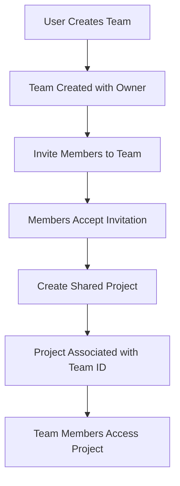
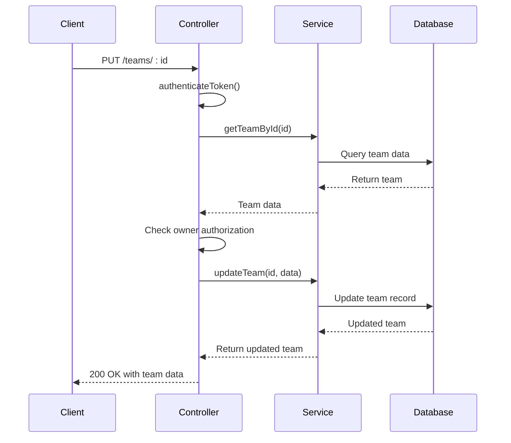
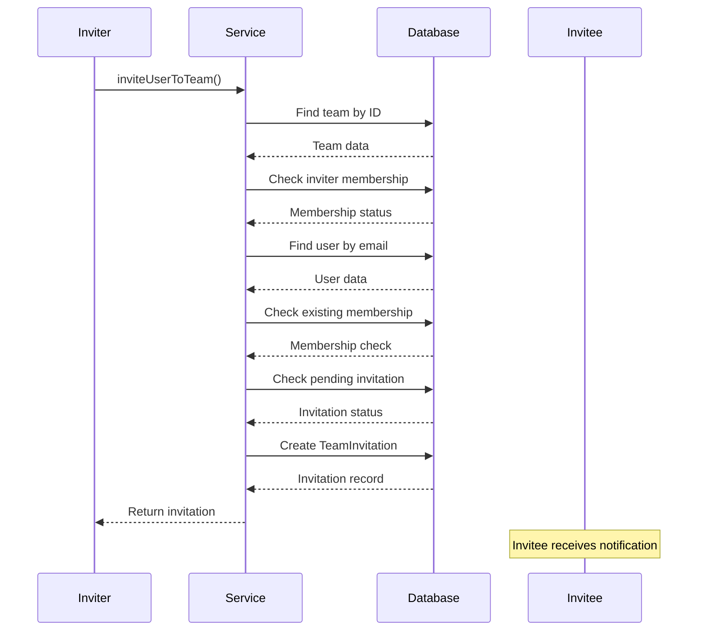
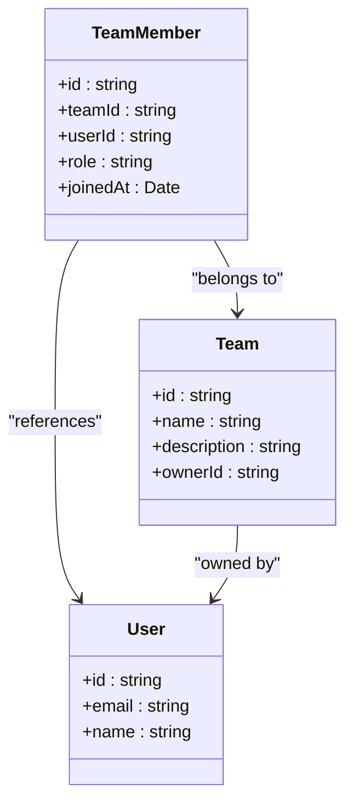
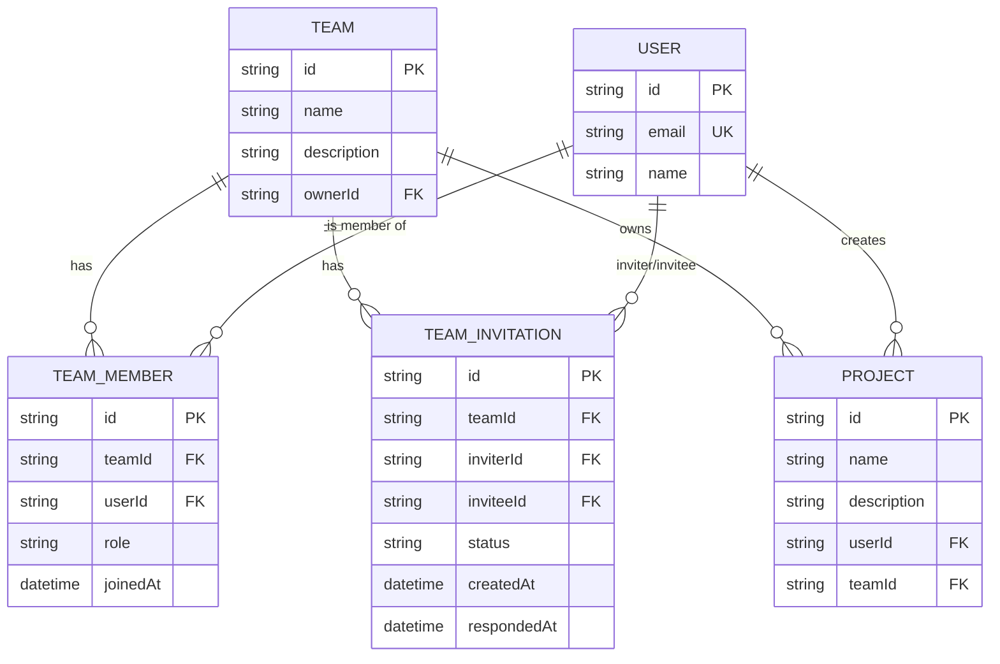

# Collaboration Module

<cite>
**Referenced Files in This Document**   
- [collaboration.service.ts](file://pikzels-clone\src\modules\collaboration\collaboration.service.ts)
- [collaboration.controller.ts](file://pikzels-clone\src\modules\collaboration\collaboration.controller.ts)
- [collaboration.routes.ts](file://pikzels-clone\src\modules\collaboration\collaboration.routes.ts)
- [migration.sql](file://pikzels-clone\prisma\migrations\20250829072650_init\migration.sql)
</cite>

## Table of Contents
1. [Introduction](#introduction)
2. [Team Project Sharing Mechanism](#team-project-sharing-mechanism)
3. [Controller Logic for Team Access and Permissions](#controller-logic-for-team-access-and-permissions)
4. [User Invitation Workflow](#user-invitation-workflow)
5. [Role-Based Access Control](#role-based-access-control)
6. [Real-Time Collaboration State Management](#real-time-collaboration-state-management)
7. [Data Model for Team Memberships and Project Sharing](#data-model-for-team-memberships-and-project-sharing)
8. [Security Considerations in Access Control](#security-considerations-in-access-control)
9. [Scaling Collaboration Features for Large Teams](#scaling-collaboration-features-for-large-teams)
10. [Handling Concurrent Edits](#handling-concurrent-edits)
11. [Common Issues and Troubleshooting](#common-issues-and-troubleshooting)

## Introduction
The Collaboration Module enables team-based workflows within the Thumbnail Maker application, allowing users to create teams, share projects, and manage access permissions. This document details the implementation of team collaboration features, focusing on the service, controller, and routing layers that manage team creation, user invitations, role-based access control, and project sharing. The module ensures secure data isolation between teams while supporting scalable collaboration for growing user bases.

## Team Project Sharing Mechanism
The team project sharing mechanism is implemented through the `collaboration.service.ts` file, which provides methods to manage team-related operations. The core functionality revolves around associating projects with teams via the `teamId` field in the `Project` model. When a project is created or updated, it can be assigned to a specific team, making it accessible to all team members based on their roles.

The `getTeamProjects` method in `CollaborationService` retrieves all projects associated with a given team ID, including metadata such as the user who created the project and thumbnail previews. This enables team members to view and collaborate on shared projects while maintaining ownership attribution.

**Diagram sources**
- [collaboration.service.ts](file://pikzels-clone\src\modules\collaboration\collaboration.service.ts#L407-L431)

**Section sources**
- [collaboration.service.ts](file://pikzels-clone\src\modules\collaboration\collaboration.service.ts#L407-L431)

## Controller Logic for Team Access and Permissions
The controller logic in `collaboration.controller.ts` handles HTTP requests related to team management and access control. Each endpoint validates user authentication through the `authenticateToken` middleware before processing requests. The controller enforces authorization rules by checking user roles and ownership before allowing operations such as team updates, member removal, or role changes.

For example, the `updateTeam` function verifies that only the team owner can modify team information. Similarly, the `removeTeamMember` function ensures that only owners or administrators can remove members, preventing unauthorized access modifications.

**Diagram sources**
- [collaboration.controller.ts](file://pikzels-clone\src\modules\collaboration\collaboration.controller.ts#L78-L111)
- [collaboration.service.ts](file://pikzels-clone\src\modules\collaboration\collaboration.service.ts#L53-L65)

**Section sources**
- [collaboration.controller.ts](file://pikzels-clone\src\modules\collaboration\collaboration.controller.ts#L78-L111)

## User Invitation Workflow
The user invitation workflow allows team members to invite others to join their team via email. The process begins when a user sends a POST request to `/teams/:teamId/invite` with the invitee's email address. The `inviteUserToTeam` method in `CollaborationService` validates that the inviter is a team member and that the invitee exists in the system.

If validation passes, a `TeamInvitation` record is created with a "pending" status. The invitee receives a notification and can respond to the invitation through the `respondToInvitation` endpoint. Upon acceptance, the invitee is added as a team member with the default role of "member".

**Diagram sources**
- [collaboration.service.ts](file://pikzels-clone\src\modules\collaboration\collaboration.service.ts#L155-L241)
- [collaboration.controller.ts](file://pikzels-clone\src\modules\collaboration\collaboration.controller.ts#L121-L145)

**Section sources**
- [collaboration.service.ts](file://pikzels-clone\src\modules\collaboration\collaboration.service.ts#L155-L241)

## Role-Based Access Control
Role-based access control (RBAC) is implemented through the `role` field in the `TeamMember` model, which supports roles such as "owner", "admin", and "member". The system enforces role-based permissions for various operations:

- **Owner**: Can update team information, invite/remove members, and change member roles
- **Admin**: Can remove members but cannot change roles
- **Member**: Read-only access to team projects

The `updateMemberRole` method ensures that only team owners can modify roles, preventing privilege escalation. Similarly, the `removeTeamMember` method restricts removal privileges to owners and admins, maintaining team integrity.

**Diagram sources**
- [collaboration.service.ts](file://pikzels-clone\src\modules\collaboration\collaboration.service.ts#L359-L402)
- [migration.sql](file://pikzels-clone\prisma\migrations\20250829072650_init\migration.sql#L1-L52)

**Section sources**
- [collaboration.service.ts](file://pikzels-clone\src\modules\collaboration\collaboration.service.ts#L359-L402)

## Real-Time Collaboration State Management
While the current implementation does not include real-time collaboration features, the architecture supports future integration of real-time updates through WebSocket or similar technologies. The team membership and project association data model provides a solid foundation for implementing real-time state synchronization.

Potential real-time features could include:
- Live presence indicators showing which team members are viewing a project
- Real-time notifications for project updates or comments
- Collaborative editing with conflict resolution

The existing REST API endpoints can be extended to support real-time communication by adding WebSocket handlers that broadcast state changes to connected clients.

## Data Model for Team Memberships and Project Sharing
The data model for team collaborations is defined in the Prisma schema and implemented through database migrations. Key entities include:

- **Team**: Represents a collaboration group with a name, description, and owner
- **TeamMember**: Junction table linking users to teams with role assignments
- **TeamInvitation**: Tracks pending invitations with status and timestamps
- **Project**: Extended with a `teamId` field to enable team-based project sharing

The `TeamMember` table establishes a many-to-many relationship between users and teams, allowing users to belong to multiple teams simultaneously. The `Project` table's `teamId` foreign key enables projects to be associated with specific teams, facilitating access control and data isolation.

**Diagram sources**
- [migration.sql](file://pikzels-clone\prisma\migrations\20250829072650_init\migration.sql#L1-L52)

**Section sources**
- [migration.sql](file://pikzels-clone\prisma\migrations\20250829072650_init\migration.sql#L1-L52)

## Security Considerations in Access Control
The collaboration module implements several security measures to protect team data and prevent unauthorized access:

1. **Authentication**: All endpoints require valid JWT tokens through the `authenticateToken` middleware
2. **Authorization**: Role-based checks prevent unauthorized operations (e.g., only owners can delete teams)
3. **Data Validation**: Input validation prevents injection attacks and ensures data integrity
4. **Error Handling**: Generic error messages prevent information leakage
5. **Data Isolation**: Queries are scoped to team IDs, preventing cross-team data access

The system also prevents common security issues such as:
- **Privilege Escalation**: Only owners can change member roles
- **Insecure Direct Object References**: Team and member IDs are validated against user permissions
- **Broken Access Control**: Comprehensive role checks on every sensitive operation

## Scaling Collaboration Features for Large Teams
The current implementation can be scaled for large teams through several optimizations:

1. **Database Indexing**: Add indexes on frequently queried fields like `teamId` and `userId`
2. **Caching**: Implement Redis caching for team membership and project lists
3. **Pagination**: Add pagination to endpoints that return lists (e.g., `getTeamProjects`)
4. **Batch Operations**: Support bulk invitations and role updates
5. **Asynchronous Processing**: Move invitation emails to background jobs

Performance considerations include:
- Limiting the number of thumbnails returned in project previews
- Using efficient database queries with proper joins and filtering
- Implementing rate limiting on invitation endpoints

## Handling Concurrent Edits
While the current implementation does not address concurrent editing conflicts, the architecture supports future conflict resolution mechanisms:

1. **Optimistic Locking**: Add version numbers to projects and thumbnails
2. **Real-Time Sync**: Implement WebSocket-based real-time collaboration
3. **Conflict Detection**: Compare timestamps and user actions to detect conflicts
4. **Merge Strategies**: Develop algorithms to merge conflicting changes

The service layer could be extended with locking mechanisms to prevent simultaneous edits, or a more sophisticated operational transformation system could be implemented for real-time collaboration.

## Common Issues and Troubleshooting
Common issues in the collaboration module include:

### Permission Conflicts
- **Symptom**: Users cannot access team projects despite being members
- **Solution**: Verify team membership status and role assignments in the database
- **Prevention**: Implement clear error messages indicating permission requirements

### Notification Delivery Failures
- **Symptom**: Users don't receive invitation emails
- **Solution**: Check email service configuration and logs
- **Prevention**: Implement retry mechanisms and fallback notification methods

### Data Consistency Issues
- **Symptom**: Team member counts don't match actual membership
- **Solution**: Use database transactions for related operations
- **Prevention**: Implement data integrity checks and periodic audits

### Performance Bottlenecks
- **Symptom**: Slow response times for large teams
- **Solution**: Add database indexes and implement caching
- **Prevention**: Monitor query performance and optimize as needed

**Section sources**
- [collaboration.service.ts](file://pikzels-clone\src\modules\collaboration\collaboration.service.ts)
- [collaboration.controller.ts](file://pikzels-clone\src\modules\collaboration\collaboration.controller.ts)