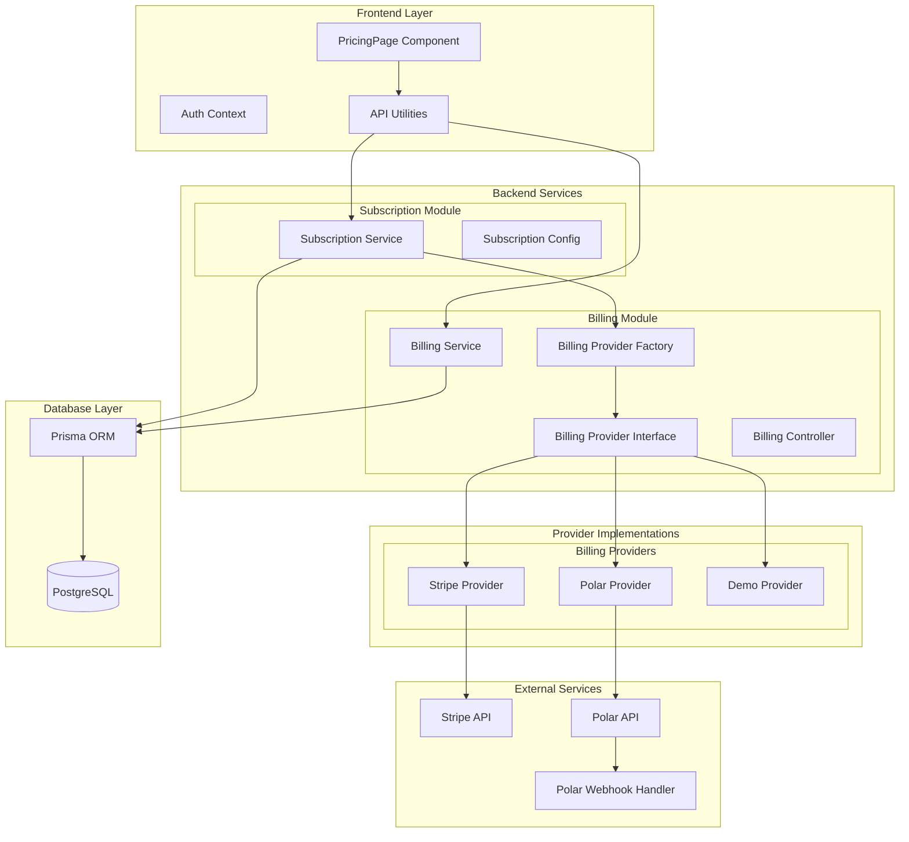
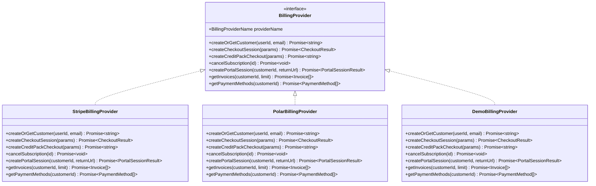
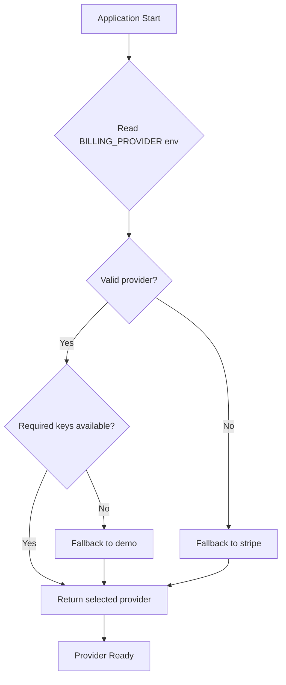
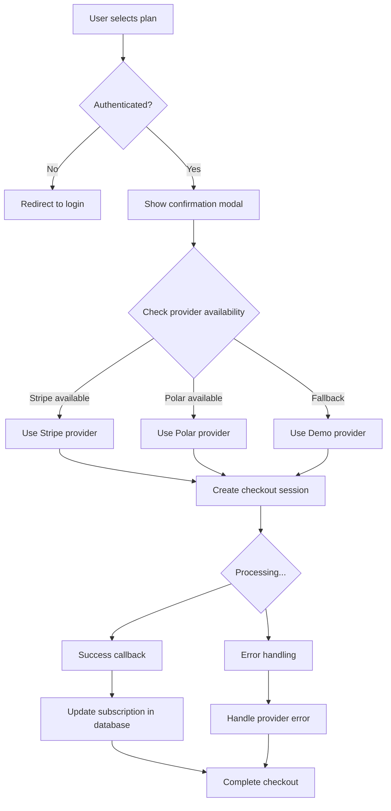

# Billing System

<cite>
**Referenced Files in This Document**
- [PricingPage.tsx](file://pikzels-clone/client/src/components/dashboard/PricingPage.tsx)
- [pricing-checkout-flow.spec.ts](file://pikzels-clone/tests/e2e/pricing-checkout-flow.spec.ts)
- [subscription.service.ts](file://pikzels-clone/src/modules/subscription/subscription.service.ts)
- [subscription.config.ts](file://pikzels-clone/src/modules/subscription/subscription.config.ts)
- [billing.service.ts](file://pikzels-clone/src/modules/billing/billing.service.ts)
- [billing.controller.ts](file://pikzels-clone/src/modules/billing/billing.controller.ts)
- [billing.routes.ts](file://pikzels-clone/src/modules/billing/billing.routes.ts)
- [billing-provider.factory.ts](file://pikzels-clone/src/modules/billing/billing-provider.factory.ts)
- [billing-provider.interface.ts](file://pikzels-clone/src/modules/billing/billing-provider.interface.ts)
- [stripe.provider.ts](file://pikzels-clone/src/modules/billing/providers/stripe.provider.ts)
- [polar.provider.ts](file://pikzels-clone/src/modules/billing/providers/polar.provider.ts)
- [demo.provider.ts](file://pikzels-clone/src/modules/billing/providers/demo.provider.ts)
- [polar-webhook.routes.ts](file://pikzels-clone/src/modules/billing/polar-webhook.routes.ts)
- [api.ts](file://pikzels-clone/client/src/utils/api.ts)
</cite>

## Update Summary
**Changes Made**
- Added comprehensive billing provider abstraction layer with Strategy pattern implementation
- Introduced Stripe, Polar, and Demo billing provider implementations
- Added billing-provider.factory.ts for provider selection and instantiation
- Added billing-provider.interface.ts defining the common provider contract
- Implemented automatic fallback to Demo mode when real provider keys are unavailable
- Enhanced billing service with provider-aware operations
- Added Polar webhook handling for subscription lifecycle management

## Table of Contents
1. [Introduction](#introduction)
2. [System Architecture](#system-architecture)
3. [Billing Provider Abstraction](#billing-provider-abstraction)
4. [Core Billing Providers](#core-billing-providers)
5. [Factory Pattern Implementation](#factory-pattern-implementation)
6. [Core Components](#core-components)
7. [Pricing and Plans](#pricing-and-plans)
8. [Checkout Flow](#checkout-flow)
9. [Subscription Management](#subscription-management)
10. [Billing Portal](#billing-portal)
11. [Demo Mode](#demo-mode)
12. [Error Handling](#error-handling)
13. [Testing Strategy](#testing-strategy)
14. [Security Considerations](#security-considerations)
15. [Conclusion](#conclusion)

## Introduction

The Billing System is a comprehensive subscription management solution built for the ThumPiks thumbnail generation platform. This system implements a sophisticated billing provider abstraction layer using the Strategy pattern, supporting multiple payment processors including Stripe, Polar, and a comprehensive Demo mode. The system handles user pricing tiers, subscription management, payment processing, and provides seamless fallback mechanisms between different billing providers.

The system supports four main subscription tiers: Free, Starter ($9/month), Creator Pro ($24/month), and Business ($69/month), each offering different levels of AI thumbnail generation capabilities with varying credit allocations and feature sets. The abstraction layer allows for easy switching between payment providers and graceful degradation to demo mode when real payment keys are unavailable.

## System Architecture

The billing system follows a modular architecture with clear separation of concerns between frontend presentation, backend services, and external payment processing through a flexible provider abstraction layer.



**Diagram sources**
- [billing-provider.factory.ts:29-56](file://pikzels-clone/src/modules/billing/billing-provider.factory.ts#L29-L56)
- [billing-provider.interface.ts:110-155](file://pikzels-clone/src/modules/billing/billing-provider.interface.ts#L110-L155)
- [billing.service.ts:16-52](file://pikzels-clone/src/modules/billing/billing.service.ts#L16-L52)
- [subscription.service.ts:45-82](file://pikzels-clone/src/modules/subscription/subscription.service.ts#L45-L82)

## Billing Provider Abstraction

The billing system implements a comprehensive provider abstraction layer using TypeScript interfaces and the Strategy pattern. This design enables runtime selection of billing providers based on environment configuration and automatic fallback to demo mode when real payment keys are unavailable.

### Provider Interface Contract

The `BillingProvider` interface defines a common contract that all billing implementations must follow, ensuring consistent behavior across different payment processors while allowing provider-specific optimizations.



**Diagram sources**
- [billing-provider.interface.ts:110-155](file://pikzels-clone/src/modules/billing/billing-provider.interface.ts#L110-L155)
- [stripe.provider.ts:24-225](file://pikzels-clone/src/modules/billing/providers/stripe.provider.ts#L24-L225)
- [polar.provider.ts:30-278](file://pikzels-clone/src/modules/billing/providers/polar.provider.ts#L30-L278)
- [demo.provider.ts:23-135](file://pikzels-clone/src/modules/billing/providers/demo.provider.ts#L23-L135)

**Section sources**
- [billing-provider.interface.ts:1-156](file://pikzels-clone/src/modules/billing/billing-provider.interface.ts#L1-L156)

## Core Billing Providers

### Stripe Provider

The Stripe provider implements enterprise-grade payment processing with full subscription management capabilities, customer portal integration, and comprehensive invoice handling.

**Key Features:**
- Full Stripe SDK integration with latest API version
- Customer management with automatic ID persistence
- Subscription lifecycle management (create, cancel, renew)
- Billing portal session creation
- Detailed invoice and payment method retrieval
- Raw Stripe instance exposure for webhook verification

### Polar Provider

The Polar provider offers merchant-of-record functionality with built-in tax compliance (VAT, GST, Sales Tax) and simplified checkout flows optimized for European markets.

**Key Features:**
- Merchant-of-record with automatic tax calculations
- Sandbox mode support for development
- Discount code integration for promotional campaigns
- Customer session-based portal access
- Structured error handling with field-specific validation
- Order-based billing history integration

### Demo Provider

The demo provider simulates billing operations for development and testing environments without requiring real payment credentials.

**Key Features:**
- Complete simulation of billing workflows
- Automatic demo checkout URL generation
- Mock data generation for invoices and payment methods
- Seamless integration with development workflows
- Environment-based fallback mechanism

**Section sources**
- [stripe.provider.ts:1-226](file://pikzels-clone/src/modules/billing/providers/stripe.provider.ts#L1-L226)
- [polar.provider.ts:1-352](file://pikzels-clone/src/modules/billing/providers/polar.provider.ts#L1-L352)
- [demo.provider.ts:1-136](file://pikzels-clone/src/modules/billing/providers/demo.provider.ts#L1-L136)

## Factory Pattern Implementation

The billing provider factory implements a sophisticated selection mechanism that determines the active billing provider based on environment configuration and available credentials, with automatic fallback to demo mode when real payment keys are unavailable.

### Provider Selection Logic



**Diagram sources**
- [billing-provider.factory.ts:29-56](file://pikzels-clone/src/modules/billing/billing-provider.factory.ts#L29-L56)

### Provider Configuration Options

| Environment Variable | Purpose | Valid Values | Default Behavior |
|---------------------|---------|--------------|------------------|
| `BILLING_PROVIDER` | Active billing provider | `stripe`, `polar`, `demo` | `stripe` |
| `STRIPE_SECRET_KEY` | Stripe API credentials | Secret key | Enables Stripe provider |
| `POLAR_ACCESS_TOKEN` | Polar API credentials | Access token | Enables Polar provider |
| `POLAR_WEBHOOK_SECRET` | Polar webhook verification | Secret key | Webhook processing |
| `CLIENT_URL` | Application base URL | URL string | Development fallback |

**Section sources**
- [billing-provider.factory.ts:1-86](file://pikzels-clone/src/modules/billing/billing-provider.factory.ts#L1-L86)

## Core Components

### Frontend Pricing Component

The PricingPage component serves as the primary interface for subscription management, featuring dynamic pricing display, interactive modals, and seamless integration with the billing provider abstraction layer.

**Enhanced Features:**
- Dynamic provider-aware pricing display
- Interactive modals with loading states and error handling
- Plan comparison with feature differentiation
- User authentication integration
- Provider-specific checkout flow routing

### Backend Billing Service

The billing service handles provider-aware operations including payment method retrieval, billing history consolidation, and billing portal session creation, automatically selecting the appropriate provider based on user subscription data.

**Key Operations:**
- Payment method retrieval from provider-specific customer records
- Combined billing history from provider invoices and credit transactions
- Billing portal session creation with provider-specific customer IDs
- Provider fallback mechanisms for edge cases

**Section sources**
- [billing.service.ts:1-181](file://pikzels-clone/src/modules/billing/billing.service.ts#L1-L181)

## Pricing and Plans

The system supports four distinct pricing tiers with carefully calculated credit allocations and provider-specific implementation details:

| Plan | Monthly Price | Annual Price | Credits/Month | Key Features | Provider Support |
|------|---------------|--------------|---------------|--------------|------------------|
| Free | $0 | $0 | 5 | Basic AI thumbnails, 720p resolution | All Providers |
| Starter | $9 | $7.50/month | 30 | 1080p HD, Face swap (1 face) | All Providers |
| Creator Pro | $24 | $19/month | 120 | Advanced analytics, A/B testing | All Providers |
| Business | $69 | $59/month | 500 | Team collaboration, White-label | All Providers |



**Diagram sources**
- [subscription.service.ts:45-82](file://pikzels-clone/src/modules/subscription/subscription.service.ts#L45-L82)
- [billing-provider.factory.ts:29-56](file://pikzels-clone/src/modules/billing/billing-provider.factory.ts#L29-L56)

**Section sources**
- [subscription.config.ts:29-109](file://pikzels-clone/src/modules/subscription/subscription.config.ts#L29-L109)

## Checkout Flow

The checkout process follows a sophisticated multi-stage flow designed to enhance user experience and reduce abandonment rates, with provider-specific optimizations and comprehensive error handling.

### Stage 1: Plan Selection
Users browse pricing tiers and click "Upgrade" to open the confirmation modal with provider-specific messaging.

### Stage 2: Provider Selection
The system automatically selects the appropriate provider based on configuration and availability, with transparent fallback to demo mode when needed.

### Stage 3: Confirmation Modal
The modal displays provider-specific plan details and pricing, with security assurances and clear action buttons.

### Stage 4: Processing States
The system progresses through three loading states with provider-specific feedback:
1. **Confirm**: Initial confirmation
2. **Processing**: Backend verification
3. **Redirecting**: Provider-specific payment page

### Stage 5: Payment Completion
Successful completion updates user subscriptions and credits, with provider-specific success handling and error recovery.

**Section sources**
- [pricing-checkout-flow.spec.ts:184-281](file://pikzels-clone/tests/e2e/pricing-checkout-flow.spec.ts#L184-L281)

## Subscription Management

The system provides comprehensive subscription lifecycle management with provider-aware operations and automatic fallback mechanisms.

### Current Subscription Retrieval
```typescript
export async function getCurrentSubscription(userId: string): Promise<SubscriptionData | null>
```

### Provider-Aware Operations
The system maintains separate subscription IDs for each provider and automatically routes operations to the correct provider based on subscription data.

### Credit Management
Each plan includes a monthly credit allocation with provider-specific implementation details:
- **Free**: 5 credits
- **Starter**: 30 credits  
- **Creator Pro**: 120 credits
- **Business**: 500 credits

**Section sources**
- [subscription.service.ts:87-162](file://pikzels-clone/src/modules/subscription/subscription.service.ts#L87-L162)

## Billing Portal

The billing portal provides users with comprehensive account management capabilities through provider-specific integrations while maintaining a unified user experience.

### Portal Features
- **Payment Method Management**: Provider-specific payment method handling
- **Invoice Access**: Consolidated billing history from multiple providers
- **Subscription Cancellation**: Direct cancellation routed to correct provider
- **Plan Upgrades**: Seamless plan switching with provider awareness

### Implementation Details
The billing portal integrates with provider-specific customer portals while providing demo mode fallbacks for development environments. The system automatically detects the user's provider association and routes requests accordingly.

**Section sources**
- [billing.controller.ts:52-79](file://pikzels-clone/src/modules/billing/billing.controller.ts#L52-L79)
- [billing.routes.ts:1-33](file://pikzels-clone/src/modules/billing/billing.routes.ts#L1-L33)

## Demo Mode

The system includes robust demo mode functionality for development and testing with comprehensive simulation capabilities and seamless integration into the provider abstraction layer.

### Demo Features
- **Simulated Checkout**: Creates realistic checkout URLs without provider APIs
- **Auto-completion**: Automatic successful payment simulation
- **Database Persistence**: Maintains subscription state in development
- **Provider Fallback**: Automatic activation when real provider keys are unavailable
- **Unified Interface**: Identical API surface to real providers

### Demo URL Generation
Demo checkout URLs follow this pattern:
```
http://localhost:8556/demo-checkout?session={sessionId}&user={userId}&plan={planId}&cycle={billingCycle}
```

**Section sources**
- [demo.provider.ts:45-82](file://pikzels-clone/src/modules/billing/providers/demo.provider.ts#L45-L82)

## Error Handling

The system implements comprehensive error handling across all components with provider-specific error management and graceful degradation capabilities.

### Frontend Error Handling
- **Authentication Errors**: Automatic redirects to login
- **Network Failures**: User-friendly error messages
- **Provider Configuration**: Clear guidance for development setup
- **Loading States**: Graceful user feedback during operations

### Backend Error Management
- **Provider API Errors**: Structured error objects with provider details
- **Database Operations**: Transaction safety and rollback capabilities
- **Webhook Processing**: Idempotent operation handling
- **Configuration Validation**: Early detection of missing environment variables

### Provider-Specific Error Handling
- **Stripe Errors**: Standardized error codes and user messages
- **Polar Errors**: Structured validation errors with field-specific feedback
- **Demo Errors**: Simulated error responses for development testing

**Section sources**
- [billing-provider.interface.ts:21-38](file://pikzels-clone/src/modules/billing/billing-provider.interface.ts#L21-L38)
- [polar.provider.ts:284-352](file://pikzels-clone/src/modules/billing/providers/polar.provider.ts#L284-L352)

## Testing Strategy

The billing system includes comprehensive end-to-end testing with provider-specific test coverage and automated fallback validation.

### Test Coverage Areas
- **Checkout Flow Validation**: Full upgrade process verification across all providers
- **Provider Selection Testing**: Environment variable impact on provider selection
- **Error Scenario Testing**: Authentication, network failures, and provider errors
- **Demo Mode Testing**: Fallback behavior and simulation accuracy

### Automated Test Features
- **Visual Regression Testing**: Screenshots for UI validation
- **State Machine Testing**: Loading state progression verification
- **Cross-provider Compatibility**: Multi-provider testing scenarios
- **Environment Configuration Testing**: Different provider setups

**Section sources**
- [pricing-checkout-flow.spec.ts:1-481](file://pikzels-clone/tests/e2e/pricing-checkout-flow.spec.ts#L1-L481)

## Security Considerations

### Authentication Security
- **HttpOnly Cookies**: Secure authentication token storage
- **CSRF Protection**: Cross-site request forgery prevention
- **Session Management**: Automatic session expiration handling

### Payment Security
- **PCI Compliance**: Payment providers handle sensitive data
- **Tokenization**: No raw credit card data stored
- **Encryption**: All sensitive data transmission is encrypted
- **Webhook Verification**: Polar webhooks use signature verification

### Data Protection
- **Environment Variables**: Payment keys stored securely
- **Audit Logging**: Comprehensive transaction logging
- **Data Minimization**: Only necessary user data collected
- **Provider Isolation**: Separate customer records per provider

## Conclusion

The Billing System represents a robust, scalable solution for subscription-based SaaS platforms with its comprehensive provider abstraction layer and dual-mode operation. The implementation of the Strategy pattern with Stripe, Polar, and Demo providers creates a flexible foundation that can adapt to changing business requirements while maintaining developer productivity and user experience.

**Key Strengths:**
- **Architectural Excellence**: Clean separation of concerns with provider abstraction
- **Provider Flexibility**: Easy switching between payment processors
- **Development Efficiency**: Seamless demo mode integration
- **Production Reliability**: Comprehensive error handling and fallback mechanisms
- **Scalability**: Modular design supporting future provider additions

The system successfully balances technical sophistication with practical usability, providing a solid foundation for future feature expansion and business growth while maintaining high standards for security, reliability, and user experience across all supported billing providers.