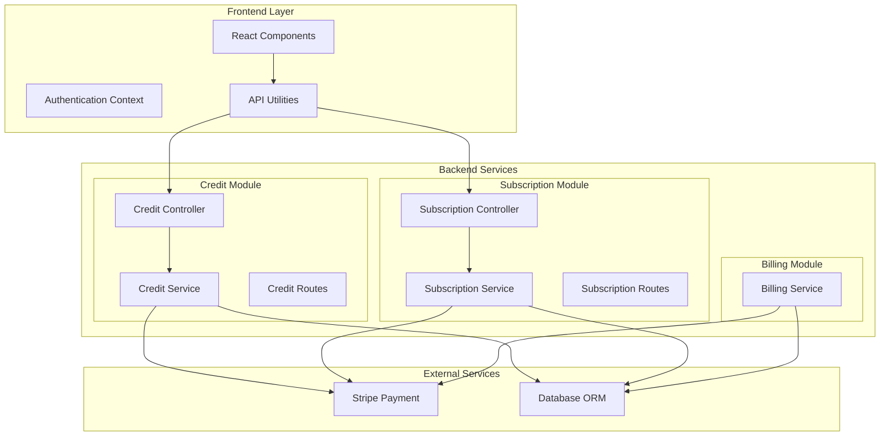
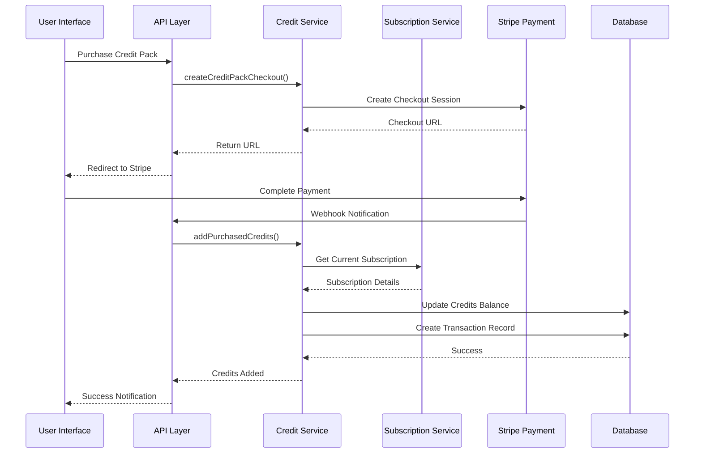
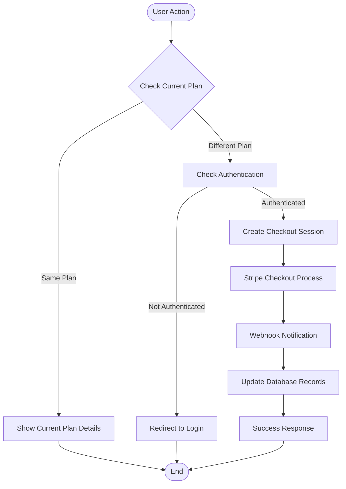
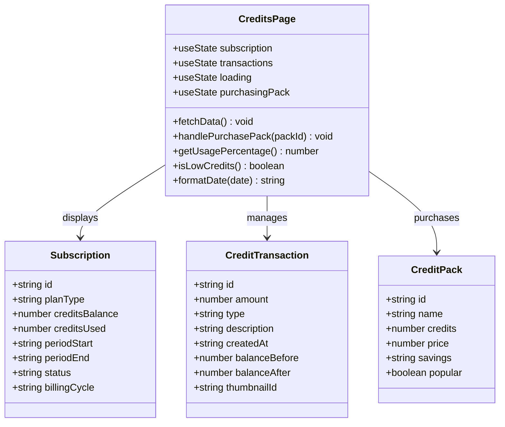
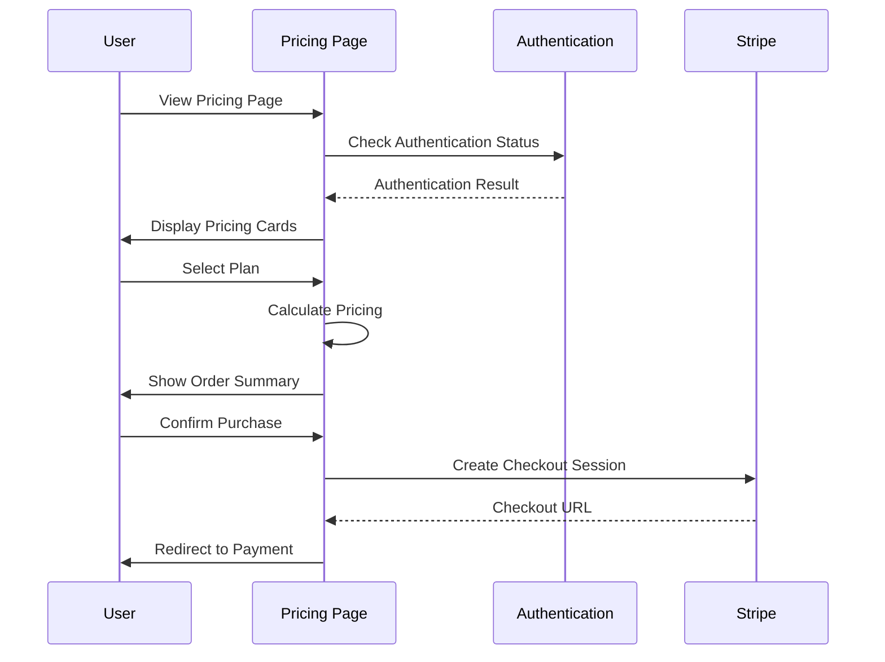
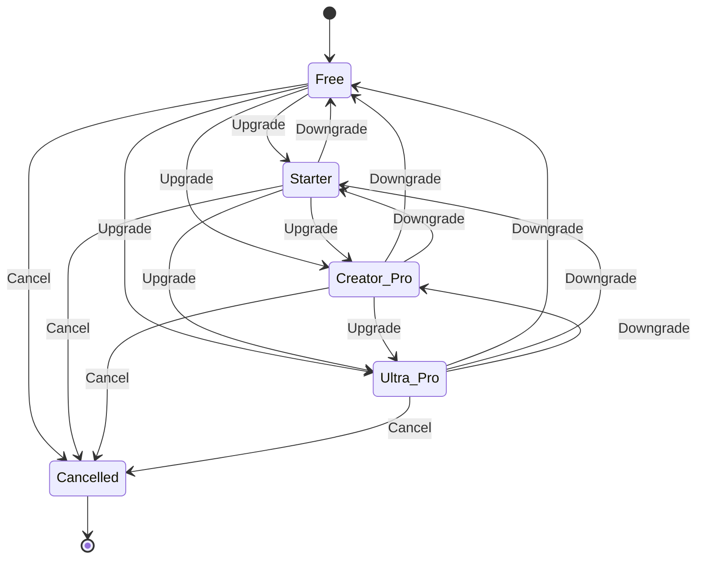
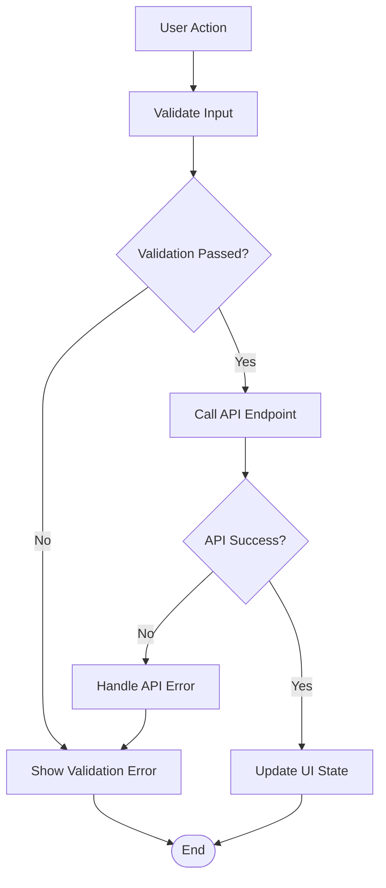

# Credit System

<cite>
**Referenced Files in This Document**
- [CreditsPage.tsx](file://pikzels-clone/client/src/components/dashboard/CreditsPage.tsx)
- [PricingPage.tsx](file://pikzels-clone/client/src/components/dashboard/PricingPage.tsx)
- [SubscriptionManagement.tsx](file://pikzels-clone/client/src/components/dashboard/SubscriptionManagement.tsx)
- [credit.service.ts](file://pikzels-clone/src/modules/credit/credit.service.ts)
- [credit.controller.ts](file://pikzels-clone/src/modules/credit/credit.controller.ts)
- [credit.routes.ts](file://pikzels-clone/src/modules/credit/credit.routes.ts)
- [subscription.service.ts](file://pikzels-clone/src/modules/subscription/subscription.service.ts)
- [subscription.controller.ts](file://pikzels-clone/src/modules/subscription/subscription.controller.ts)
- [subscription.routes.ts](file://pikzels-clone/src/modules/subscription/subscription.routes.ts)
- [subscription.config.ts](file://pikzels-clone/src/modules/subscription/subscription.config.ts)
- [billing.service.ts](file://pikzels-clone/src/modules/billing/billing.service.ts)
- [pricing-checkout-flow.spec.ts](file://pikzels-clone/tests/e2e/pricing-checkout-flow.spec.ts)
</cite>

## Update Summary
**Changes Made**
- Added new "Ultra Pro" subscription tier with 600 monthly credits and unlimited face swap capability
- Updated pricing tables to include the new Ultra Pro plan
- Enhanced subscription configuration with unlimited credit allocation for power creators
- Updated subscription lifecycle diagrams to reflect the new tier structure

## Table of Contents
1. [Introduction](#introduction)
2. [System Architecture](#system-architecture)
3. [Core Components](#core-components)
4. [Credit Management Flow](#credit-management-flow)
5. [Subscription System](#subscription-system)
6. [Pricing and Billing](#pricing-and-billing)
7. [User Interface Components](#user-interface-components)
8. [Data Models](#data-models)
9. [API Endpoints](#api-endpoints)
10. [Error Handling and Validation](#error-handling-and-validation)
11. [Testing and Quality Assurance](#testing-and-quality-assurance)
12. [Conclusion](#conclusion)

## Introduction

The Credit System is a comprehensive billing and monetization framework designed for the ThumPiks thumbnail generation platform. This system manages user credits, subscription plans, credit pack purchases, and billing operations through a sophisticated combination of frontend React components and backend Node.js services integrated with Stripe payment processing.

The system supports multiple pricing tiers, flexible billing cycles (monthly/annual), credit-based thumbnail generation, and seamless integration with Stripe for secure payment processing. Users can purchase additional credits through predefined credit packs, upgrade their subscription plans, and manage their billing preferences through an intuitive dashboard interface.

**Updated** Enhanced with new Ultra Pro tier offering 600 monthly credits and unlimited face swap capability for power creators and comprehensive testing scenarios.

## System Architecture

The Credit System follows a modular architecture with clear separation between frontend presentation, backend services, and external integrations:



**Diagram sources**
- [CreditsPage.tsx:1-539](file://pikzels-clone/client/src/components/dashboard/CreditsPage.tsx#L1-L539)
- [credit.service.ts:1-297](file://pikzels-clone/src/modules/credit/credit.service.ts#L1-L297)
- [subscription.service.ts:1-533](file://pikzels-clone/src/modules/subscription/subscription.service.ts#L1-L533)

The architecture ensures scalability, maintainability, and clear separation of concerns through modular design patterns and dependency injection.

## Core Components

### Credit Management Module

The Credit Management Module handles all credit-related operations including balance tracking, transaction logging, and credit pack purchases.

**Section sources**
- [credit.service.ts:1-297](file://pikzels-clone/src/modules/credit/credit.service.ts#L1-L297)
- [credit.controller.ts:1-81](file://pikzels-clone/src/modules/credit/credit.controller.ts#L1-L81)
- [credit.routes.ts:1-29](file://pikzels-clone/src/modules/credit/credit.routes.ts#L1-L29)

### Subscription Management Module

The Subscription Management Module controls user subscription lifecycle, plan upgrades, cancellations, and renewal processes.

**Section sources**
- [subscription.service.ts:1-533](file://pikzels-clone/src/modules/subscription/subscription.service.ts#L1-L533)
- [subscription.controller.ts:1-311](file://pikzels-clone/src/modules/subscription/subscription.controller.ts#L1-L311)
- [subscription.routes.ts:1-121](file://pikzels-clone/src/modules/subscription/subscription.routes.ts#L1-L121)

### Billing Integration Module

The Billing Integration Module provides comprehensive billing history management and Stripe portal integration.

**Section sources**
- [billing.service.ts:1-236](file://pikzels-clone/src/modules/billing/billing.service.ts#L1-L236)

## Credit Management Flow

The credit management system operates through a well-defined flow that ensures proper credit allocation, usage tracking, and transaction logging:



**Diagram sources**
- [credit.service.ts:95-185](file://pikzels-clone/src/modules/credit/credit.service.ts#L95-L185)
- [subscription.controller.ts:147-225](file://pikzels-clone/src/modules/subscription/subscription.controller.ts#L147-L225)

The flow ensures atomic operations and maintains data consistency through proper transaction handling and error management.

## Subscription System

The subscription system manages user plans, billing cycles, and credit allocation:



**Diagram sources**
- [subscription.service.ts:47-123](file://pikzels-clone/src/modules/subscription/subscription.service.ts#L47-L123)
- [subscription.controller.ts:22-70](file://pikzels-clone/src/modules/subscription/subscription.controller.ts#L22-L70)

**Section sources**
- [subscription.service.ts:128-158](file://pikzels-clone/src/modules/subscription/subscription.service.ts#L128-L158)
- [subscription.controller.ts:77-105](file://pikzels-clone/src/modules/subscription/subscription.controller.ts#L77-L105)

## Pricing and Billing

The pricing system offers multiple tiers with flexible billing options, now including the new Ultra Pro tier:

| Plan | Monthly Price | Annual Price | Credits/Month | Key Features |
|------|---------------|--------------|---------------|--------------|
| Free | $0 | $0 | 5 | Basic thumbnail generation |
| Starter | $19 | $15 ($180/year) | 50 | All styles, HD resolution |
| Creator Pro | $39 | $29 ($348/year) | 200 | Face training, A/B testing |
| **Ultra Pro** | **$79** | **$59 ($708/year)** | **600** | **Unlimited face swap, 4K Ultra HD** |

**Updated** Added Ultra Pro tier with 600 monthly credits and unlimited face swap capability for power creators and comprehensive testing scenarios.

**Section sources**
- [PricingPage.tsx:58-103](file://pikzels-clone/client/src/components/dashboard/PricingPage.tsx#L58-L103)
- [PricingPage.tsx:439-496](file://pikzels-clone/client/src/components/dashboard/PricingPage.tsx#L439-L496)
- [PricingPage.tsx:222-261](file://pikzels-clone/client/src/components/dashboard/PricingPage.tsx#L222-L261)

### Credit Pack Options

Users can purchase additional credits through predefined packages:

| Package | Credits | Price | Savings | Popular |
|---------|---------|-------|---------|---------|
| Starter Pack | 50 | $9 | - | No |
| Value Pack | 100 | $15 | Save $3 | Yes |
| Pro Pack | 250 | $35 | Save $10 | No |
| Ultra Pack | 500 | $60 | Save $30 | No |

**Section sources**
- [CreditsPage.tsx:47-76](file://pikzels-clone/client/src/components/dashboard/CreditsPage.tsx#L47-L76)

### Subscription Configuration

The subscription configuration now includes the new Ultra Pro tier with unlimited capabilities:

**Section sources**
- [subscription.config.ts:89-111](file://pikzels-clone/src/modules/subscription/subscription.config.ts#L89-L111)

## User Interface Components

### Credits Dashboard

The Credits Dashboard provides comprehensive credit management capabilities:



**Diagram sources**
- [CreditsPage.tsx:6-35](file://pikzels-clone/client/src/components/dashboard/CreditsPage.tsx#L6-L35)

**Section sources**
- [CreditsPage.tsx:37-539](file://pikzels-clone/client/src/components/dashboard/CreditsPage.tsx#L37-L539)

### Pricing Interface

The Pricing interface offers intuitive plan selection with real-time pricing calculations:



**Diagram sources**
- [PricingPage.tsx:105-182](file://pikzels-clone/client/src/components/dashboard/PricingPage.tsx#L105-L182)

**Section sources**
- [PricingPage.tsx:23-56](file://pikzels-clone/client/src/components/dashboard/PricingPage.tsx#L23-L56)

### Subscription Management

The Subscription Management component provides comprehensive subscription control:

**Section sources**
- [SubscriptionManagement.tsx:1-47](file://pikzels-clone/client/src/components/dashboard/SubscriptionManagement.tsx#L1-L47)

## Data Models

### Credit Transaction Schema

The credit transaction system maintains detailed records of all credit operations:

```mermaid
erDiagram
CREDIT_TRANSACTION {
string id PK
string userId FK
string type ENUM
number amount
string description
datetime createdAt
number balanceBefore
number balanceAfter
string stripePaymentId
string thumbnailId
}
SUBSCRIPTION {
string id PK
string userId FK
string planType
number creditsBalance
number creditsUsed
datetime periodStart
datetime periodEnd
string status
string stripeSubscriptionId
}
USER {
string id PK
string email UK
string stripeCustomerId
string stripeSubscriptionId
}
USER ||--o{ SUBSCRIPTION : has
USER ||--o{ CREDIT_TRANSACTION : has
SUBSCRIPTION ||--o{ CREDIT_TRANSACTION : generates
```

**Diagram sources**
- [credit.service.ts:58-72](file://pikzels-clone/src/modules/credit/credit.service.ts#L58-L72)
- [subscription.service.ts:128-158](file://pikzels-clone/src/modules/subscription/subscription.service.ts#L128-L158)

### Subscription Lifecycle

The subscription lifecycle manages plan transitions and renewal processes, now including the Ultra Pro tier:



**Updated** Added Ultra Pro tier to subscription lifecycle with unlimited face swap capability.

**Diagram sources**
- [subscription.service.ts:163-193](file://pikzels-clone/src/modules/subscription/subscription.service.ts#L163-L193)

## API Endpoints

### Credit Management Endpoints

| Endpoint | Method | Description | Authentication |
|----------|--------|-------------|----------------|
| `/api/credits/transactions` | GET | Retrieve credit transaction history | Required |
| `/api/credits/balance` | GET | Get current credit balance | Required |
| `/api/credits/purchase` | POST | Purchase credit pack | Required |

### Subscription Management Endpoints

| Endpoint | Method | Description | Authentication |
|----------|--------|-------------|----------------|
| `/api/subscription/create-checkout` | POST | Create Stripe checkout session | Required |
| `/api/subscription/current` | GET | Get current subscription details | Required |
| `/api/subscription/cancel` | POST | Cancel subscription | Required |
| `/api/subscription/deduct-credits` | POST | Deduct credits from balance | Required |
| `/api/subscription/webhook` | POST | Handle Stripe webhook events | Not Required |
| `/api/subscription/demo-complete` | POST | Complete demo checkout | Required |

**Section sources**
- [credit.routes.ts:7-28](file://pikzels-clone/src/modules/credit/credit.routes.ts#L7-L28)
- [subscription.routes.ts:15-118](file://pikzels-clone/src/modules/subscription/subscription.routes.ts#L15-L118)

## Error Handling and Validation

The system implements comprehensive error handling and validation mechanisms:

### Frontend Error Handling



**Diagram sources**
- [CreditsPage.tsx:129-147](file://pikzels-clone/client/src/components/dashboard/CreditsPage.tsx#L129-L147)

### Backend Error Handling

The backend services implement structured error handling with proper logging and user feedback:

**Section sources**
- [credit.controller.ts:11-25](file://pikzels-clone/src/modules/credit/credit.controller.ts#L11-L25)
- [subscription.controller.ts:22-70](file://pikzels-clone/src/modules/subscription/subscription.controller.ts#L22-L70)

## Testing and Quality Assurance

### End-to-End Testing

The system includes comprehensive end-to-end testing for critical user flows:

**Section sources**
- [pricing-checkout-flow.spec.ts:464-480](file://pikzels-clone/tests/e2e/pricing-checkout-flow.spec.ts#L464-L480)

### Component Testing

Individual components are tested for proper functionality and user experience:

**Section sources**
- [CreditsPage.tsx:78-127](file://pikzels-clone/client/src/components/dashboard/CreditsPage.tsx#L78-L127)
- [PricingPage.tsx:34-56](file://pikzels-clone/client/src/components/dashboard/PricingPage.tsx#L34-L56)

## Conclusion

The Credit System represents a robust, scalable solution for managing digital asset generation through a credit-based model. The system successfully integrates frontend user interfaces with backend services while maintaining security, reliability, and user experience excellence.

**Updated** Recent enhancements include the addition of the Ultra Pro subscription tier with 600 monthly credits and unlimited face swap capability, expanding support for power creators and comprehensive testing scenarios.

Key strengths of the system include:

- **Modular Architecture**: Clean separation of concerns with dedicated modules for credits, subscriptions, and billing
- **Flexible Pricing**: Multiple tiers with monthly/annual billing options and credit pack purchases, now including Ultra Pro tier
- **Enhanced Capabilities**: Unlimited face swap and 4K Ultra HD resolution for power creators
- **Seamless Integration**: Smooth Stripe integration with comprehensive error handling and fallback mechanisms
- **Comprehensive Monitoring**: Detailed transaction logging and audit trails for all financial operations
- **User Experience**: Intuitive dashboards with real-time updates and responsive design

The system provides a solid foundation for scaling the ThumPiks platform while maintaining operational efficiency and user satisfaction. Future enhancements could include advanced analytics, automated billing reminders, expanded payment method support, and additional tier customization options for different user segments.

**Updated** The addition of the Ultra Pro tier significantly expands the platform's capabilities for power creators and testing environments, providing effectively unlimited credits for staging and quality assurance scenarios while maintaining the system's core credit-based architecture.