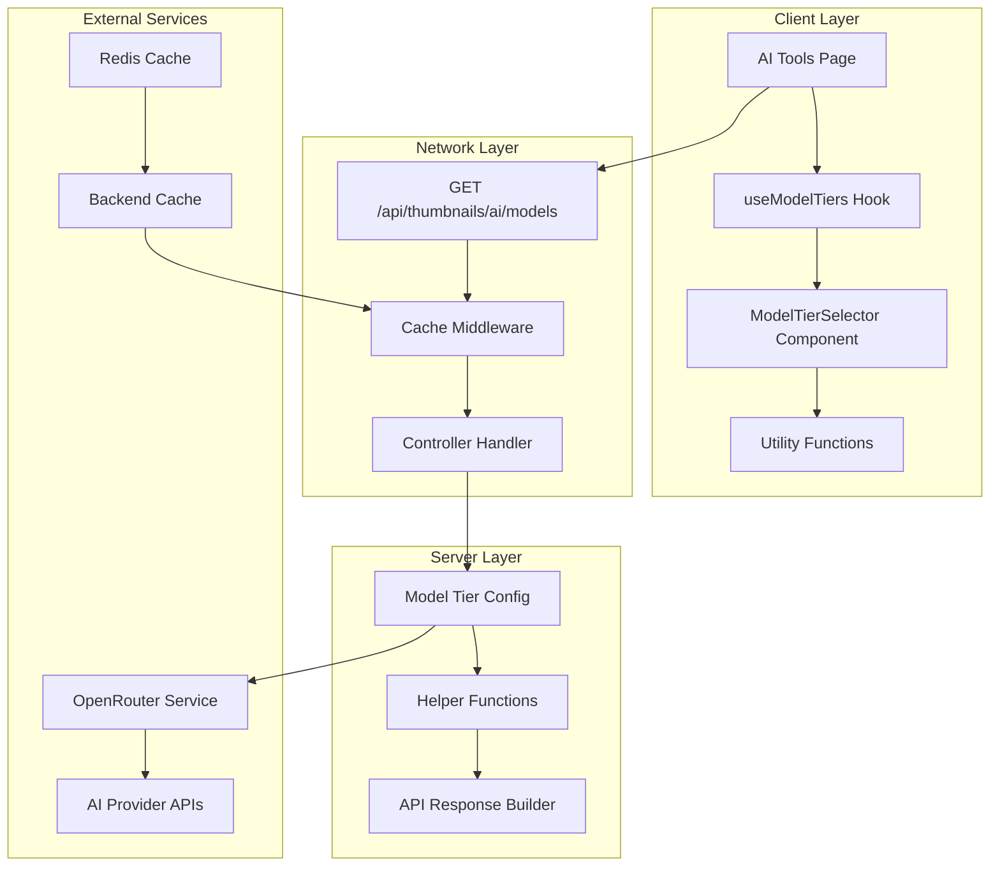
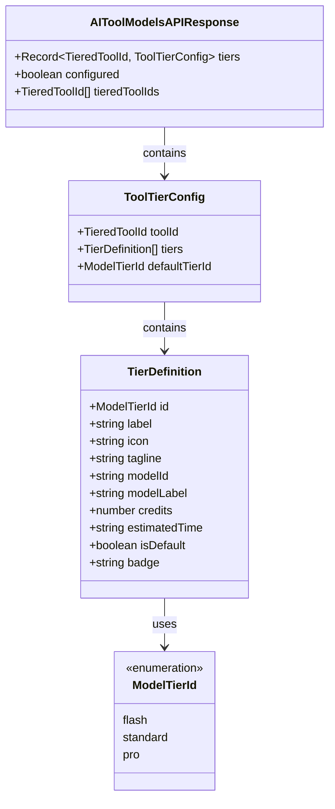
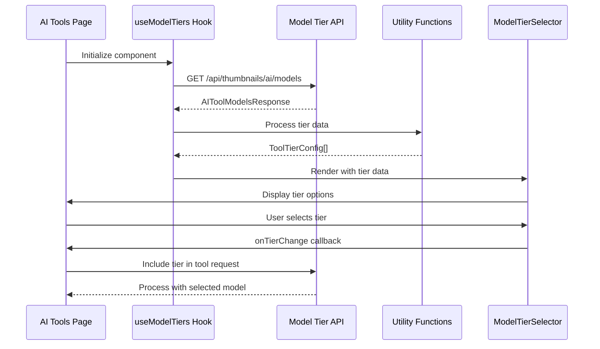
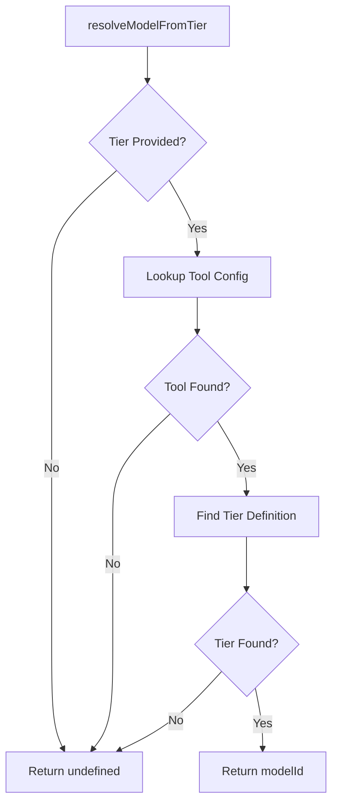
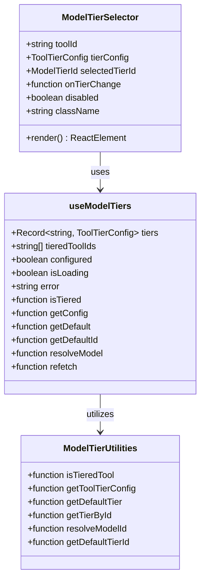
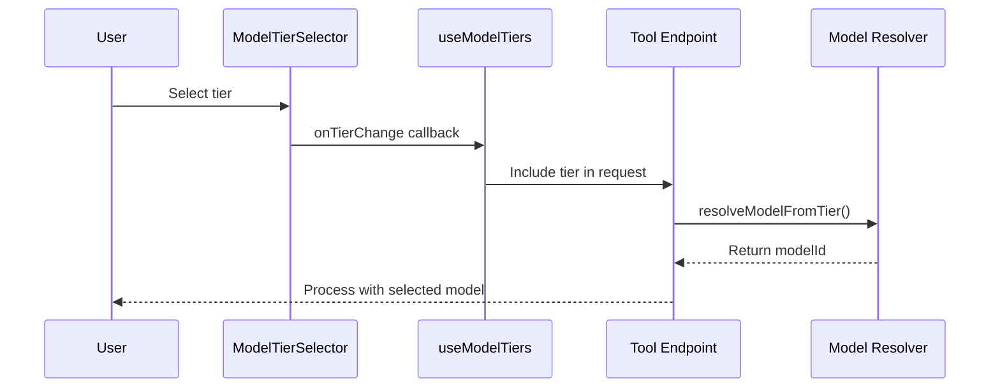
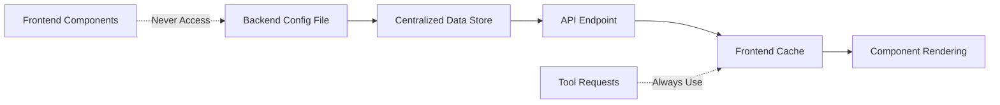

# Model Tier Management System

<cite>
**Referenced Files in This Document**
- [model-tiers.config.ts](file://pikzels-clone/src/modules/thumbnail/model-tiers.config.ts)
- [model-tiers.ts](file://pikzels-clone/client/src/features/ai-tools/model-tiers.ts)
- [useModelTiers.ts](file://pikzels-clone/client/src/features/ai-tools/hooks/useModelTiers.ts)
- [ModelTierSelector.tsx](file://pikzels-clone/client/src/features/ai-tools/components/ModelTierSelector.tsx)
- [model-tiers.spec.ts](file://pikzels-clone/tests/e2e/model-tiers.spec.ts)
- [thumbnail.controller.ts](file://pikzels-clone/src/modules/thumbnail/thumbnail.controller.ts)
</cite>

## Table of Contents
1. [Introduction](#introduction)
2. [System Architecture](#system-architecture)
3. [Core Components](#core-components)
4. [Backend Configuration Management](#backend-configuration-management)
5. [Frontend Tier Selection System](#frontend-tier-selection-system)
6. [API Integration](#api-integration)
7. [Testing Framework](#testing-framework)
8. [Implementation Patterns](#implementation-patterns)
9. [Performance Considerations](#performance-considerations)
10. [Troubleshooting Guide](#troubleshooting-guide)
11. [Conclusion](#conclusion)

## Introduction

The Model Tier Management System is a sophisticated backend-driven configuration system that manages AI model tier selection for thumbnail generation tools. This system implements a "single source of truth" architecture where all model tier configurations are centrally managed in the backend and dynamically served to the frontend through a dedicated API endpoint.

The system supports four primary AI tools: Text-to-Image Generation, Inpainting, Face Swapping, and AI Upscaling. Each tool offers three quality tiers: Flash (fastest), Standard (balanced), and Pro (highest quality), each with distinct credit costs, processing speeds, and model specifications.

Key architectural principles include:
- **Centralized Configuration**: All tier data exists only in the backend
- **Transparent Attribution**: "Intel Inside" model attribution for user trust
- **Dynamic Loading**: Real-time tier configuration fetching
- **Type Safety**: Strong TypeScript definitions across the entire stack
- **Performance Optimization**: Multi-layer caching strategy

## System Architecture

The Model Tier Management System follows a clear separation of concerns with distinct layers for configuration, API exposure, and presentation:



**Diagram sources**
- [useModelTiers.ts](file://pikzels-clone/client/src/features/ai-tools/hooks/useModelTiers.ts#L144-L294)
- [thumbnail.controller.ts](file://pikzels-clone/src/modules/thumbnail/thumbnail.controller.ts#L1296-L1311)
- [model-tiers.config.ts](file://pikzels-clone/src/modules/thumbnail/model-tiers.config.ts#L268-L331)

## Core Components

### Backend Configuration Engine

The backend serves as the sole authority for all model tier information through a centralized configuration system:



**Diagram sources**
- [model-tiers.config.ts](file://pikzels-clone/src/modules/thumbnail/model-tiers.config.ts#L23-L73)

**Section sources**
- [model-tiers.config.ts](file://pikzels-clone/src/modules/thumbnail/model-tiers.config.ts#L1-L331)

### Frontend Integration Layer

The frontend implements a reactive system for managing tier selections with comprehensive utility functions:



**Diagram sources**
- [useModelTiers.ts](file://pikzels-clone/client/src/features/ai-tools/hooks/useModelTiers.ts#L94-L138)
- [ModelTierSelector.tsx](file://pikzels-clone/client/src/features/ai-tools/components/ModelTierSelector.tsx#L224-L327)

**Section sources**
- [useModelTiers.ts](file://pikzels-clone/client/src/features/ai-tools/hooks/useModelTiers.ts#L1-L294)
- [model-tiers.ts](file://pikzels-clone/client/src/features/ai-tools/model-tiers.ts#L1-L148)

## Backend Configuration Management

### Tier Configuration Structure

The backend maintains a comprehensive tier configuration system with explicit typing and validation:

| Tier | Model ID | Model Label | Credits | Estimated Time | Default |
|------|----------|-------------|---------|----------------|---------|
| Flash | black-forest-labs/flux.2-klein-4b | FLUX.2 Klein | 1 | ~3s | No |
| Standard | google/gemini-2.5-flash-image | Gemini 2.5 Flash Image | 2 | ~8s | Yes (default for generate) |
| Pro | google/gemini-3-pro-image-preview | Gemini 3 Pro Image | 5 | ~15s | No |

**Section sources**
- [model-tiers.config.ts](file://pikzels-clone/src/modules/thumbnail/model-tiers.config.ts#L104-L256)

### Configuration Resolution Functions

The backend provides several utility functions for tier resolution and validation:



**Diagram sources**
- [model-tiers.config.ts](file://pikzels-clone/src/modules/thumbnail/model-tiers.config.ts#L294-L305)

**Section sources**
- [model-tiers.config.ts](file://pikzels-clone/src/modules/thumbnail/model-tiers.config.ts#L286-L331)

## Frontend Tier Selection System

### Component Architecture

The frontend implements a modular tier selection system with comprehensive state management:



**Diagram sources**
- [ModelTierSelector.tsx](file://pikzels-clone/client/src/features/ai-tools/components/ModelTierSelector.tsx#L33-L51)
- [useModelTiers.ts](file://pikzels-clone/client/src/features/ai-tools/hooks/useModelTiers.ts#L36-L69)

### State Management and Caching

The frontend implements a sophisticated caching strategy with multiple layers:

| Cache Level | Duration | Purpose | Scope |
|-------------|----------|---------|-------|
| Module-Level Cache | Session Duration | Prevent duplicate requests | All hook instances |
| Client Cache | 5 minutes | Reduce network calls | Single page session |
| Backend Cache | 1 hour | Optimize server performance | API endpoint level |

**Section sources**
- [useModelTiers.ts](file://pikzels-clone/client/src/features/ai-tools/hooks/useModelTiers.ts#L71-L138)

## API Integration

### Endpoint Specification

The system exposes a single API endpoint for tier configuration retrieval:

**Endpoint**: `GET /api/thumbnails/ai/models`

**Response Structure**:
```typescript
interface AIToolModelsResponse {
  tiers: Record<TieredToolId, ToolTierConfig>;
  configured: boolean;
  tieredToolIds: TieredToolId[];
}
```

**Authentication**: Requires valid session cookies (credentials: 'include')

**Caching**: 
- Backend: 1 hour via cacheMiddleware
- Frontend: 5 minutes module-level cache

**Section sources**
- [thumbnail.controller.ts](file://pikzels-clone/src/modules/thumbnail/thumbnail.controller.ts#L1296-L1311)
- [useModelTiers.ts](file://pikzels-clone/client/src/features/ai-tools/hooks/useModelTiers.ts#L108-L117)

### Request Flow Integration

When users initiate AI operations, the selected tier is automatically included in the request:



**Diagram sources**
- [useModelTiers.ts](file://pikzels-clone/client/src/features/ai-tools/hooks/useModelTiers.ts#L253-L269)
- [model-tiers.config.ts](file://pikzels-clone/src/modules/thumbnail/model-tiers.config.ts#L294-L305)

## Testing Framework

### End-to-End Test Coverage

The testing suite provides comprehensive coverage of the tier system functionality:

| Test Category | Coverage Area | Test Methods |
|---------------|---------------|--------------|
| API Validation | Backend endpoint response | Authentication, response structure |
| UI Rendering | Frontend tier selector | Tool availability, visual elements |
| Functionality | Tier switching | Selection persistence, model attribution |
| Integration | API requests | Parameter inclusion, request interception |

**Section sources**
- [model-tiers.spec.ts](file://pikzels-clone/tests/e2e/model-tiers.spec.ts#L1-L242)

### Test Scenarios

The E2E tests validate critical user workflows:

1. **Authentication Flow**: Ensures proper 401 responses without credentials
2. **Tool Availability**: Confirms tier selector appears for supported tools
3. **Visual Elements**: Validates "Intel Inside" model attribution display
4. **Credit Display**: Verifies tier credit costs are visible
5. **API Integration**: Tests tier parameter inclusion in tool requests

## Implementation Patterns

### Single Source of Truth Principle

The system enforces strict separation between backend configuration and frontend presentation:



**Diagram sources**
- [model-tiers.config.ts](file://pikzels-clone/src/modules/thumbnail/model-tiers.config.ts#L1-L17)
- [model-tiers.ts](file://pikzels-clone/client/src/features/ai-tools/model-tiers.ts#L1-L19)

### Type Safety Implementation

Comprehensive TypeScript definitions ensure compile-time safety across the entire system:

| Layer | Type Definitions | Benefits |
|-------|------------------|----------|
| Backend | Strongly typed configs | Runtime validation |
| Frontend | Mirror types | Consistent data flow |
| API | Response interfaces | Client-side safety |
| Utilities | Generic helpers | Reusable logic |

**Section sources**
- [model-tiers.config.ts](file://pikzels-clone/src/modules/thumbnail/model-tiers.config.ts#L21-L73)
- [model-tiers.ts](file://pikzels-clone/client/src/features/ai-tools/model-tiers.ts#L21-L36)

## Performance Considerations

### Caching Strategy

The multi-layer caching system optimizes performance across different scenarios:

1. **Backend Caching**: Reduces database/API calls for tier data
2. **Module-Level Caching**: Prevents duplicate network requests within components
3. **Client-Side Caching**: Minimizes bandwidth usage during user sessions

### Network Optimization

- **Deduplication**: Concurrent requests are merged into a single fetch
- **Lazy Loading**: Tier data is fetched only when needed
- **Graceful Degradation**: Fallback mechanisms for unavailable data

**Section sources**
- [useModelTiers.ts](file://pikzels-clone/client/src/features/ai-tools/hooks/useModelTiers.ts#L87-L138)

## Troubleshooting Guide

### Common Issues and Solutions

| Issue | Symptoms | Solution |
|-------|----------|----------|
| Tier Selector Not Appearing | Non-tiered tools show selector | Verify tool is in TIERED_TOOL_IDS |
| Incorrect Model Attribution | Wrong model displayed | Check resolveModelFromTier function |
| API Fetch Failures | Empty tier data | Inspect cacheMiddleware configuration |
| Performance Issues | Slow tier loading | Review client-side cache TTL |

### Debugging Tools

1. **Console Logging**: Monitor fetch operations and errors
2. **Network Inspection**: Verify API responses and headers
3. **State Monitoring**: Track component state changes
4. **Cache Validation**: Confirm cache timestamps and data freshness

**Section sources**
- [useModelTiers.ts](file://pikzels-clone/client/src/features/ai-tools/hooks/useModelTiers.ts#L190-L202)

## Conclusion

The Model Tier Management System represents a robust, scalable solution for AI model tier configuration in thumbnail generation applications. Its architecture prioritizes maintainability, performance, and user experience through:

- **Centralized Control**: Single source of truth eliminates configuration drift
- **Performance Optimization**: Multi-layer caching ensures responsive user interactions
- **Type Safety**: Comprehensive TypeScript implementation prevents runtime errors
- **Extensibility**: Modular design allows easy addition of new tools and tiers
- **Transparency**: Clear model attribution builds user trust

The system successfully balances flexibility with reliability, providing a foundation for future AI tool expansion while maintaining consistent user experiences across all supported operations.