# Notification Service

<cite>
**Referenced Files in This Document**
- [NotificationsDropdown.tsx](file://pikzels-clone/client/src/components/notifications/NotificationsDropdown.tsx)
- [NotificationsPage.tsx](file://pikzels-clone/client/src/components/nofitications/NotificationsPage.tsx)
- [useNotifications.ts](file://pikzels-clone/client/src/hooks/useNotifications.ts)
- [notification.service.ts](file://pikzels-clone/src/modules/notification/notification.service.ts)
- [user-notification.controller.ts](file://pikzels-clone/src/modules/user-notification/user-notification.controller.ts)
- [user-notification.service.ts](file://pikzels-clone/src/modules/user-notification/user-notification.service.ts)
- [user-notification.types.ts](file://pikzels-clone/src/modules/user-notification/types.ts)
- [notification-sse.routes.ts](file://pikzels-clone/src/modules/notification-sse/notification-sse.routes.ts)
- [sse.service.ts](file://pikzels-clone/src/services/sse.service.ts)
- [event-emitter.ts](file://pikzels-clone/src/events/event-emitter.ts)
- [event-types.ts](file://pikzels-clone/src/events/event-types.ts)
- [event-registry.ts](file://pikzels-clone/src/events/event-registry.ts)
- [event-persistence.ts](file://pikzels-clone/src/events/event-persistence.ts)
- [analytics-handlers.ts](file://pikzels-clone/src/events/analytics-handlers.ts)
- [social-share-handlers.ts](file://pikzels-clone/src/events/social-share-handlers.ts)
- [service-monitor-agent.js](file://pikzels-clone/service-monitor-agent.js)
</cite>

## Update Summary
**Changes Made**
- Added comprehensive server-sent events (SSE) support for real-time notification delivery
- Implemented centralized notification management with category-based filtering
- Introduced new NotificationsPage component with advanced filtering and pagination
- Enhanced frontend notification system with TanStack Query integration
- Added real-time synchronization between frontend and backend notification systems

## Table of Contents
1. [Introduction](#introduction)
2. [System Architecture](#system-architecture)
3. [Frontend Notification Components](#frontend-notification-components)
4. [Real-Time SSE Integration](#real-time-sse-integration)
5. [Backend Notification Management](#backend-notification-management)
6. [Centralized Notification Categories](#centralized-notification-categories)
7. [Advanced Filtering and Pagination](#advanced-filtering-and-pagination)
8. [Email Preferences Service](#email-preferences-service)
9. [Event-Driven Notification System](#event-driven-notification-system)
10. [Analytics and Tracking](#analytics-and-tracking)
11. [Social Sharing Notifications](#social-sharing-notifications)
12. [Event Persistence and Storage](#event-persistence-and-storage)
13. [Configuration Management](#configuration-management)
14. [Performance Considerations](#performance-considerations)
15. [Troubleshooting Guide](#troubleshooting-guide)
16. [Conclusion](#conclusion)

## Introduction

The Notification Service is a comprehensive, real-time notification management system designed to handle both immediate user notifications and persistent event-driven notifications across the Thumbnail Maker platform. The system has been significantly enhanced with server-sent events (SSE) support, centralized notification categorization, and advanced filtering capabilities.

The service now provides a complete notification lifecycle management system with real-time updates, user-friendly interfaces, and robust backend processing. It supports multiple notification channels including immediate SSE delivery, persistent database storage, and traditional event-driven processing.

## System Architecture

The Notification Service follows a modern, layered architecture with real-time capabilities and centralized management.

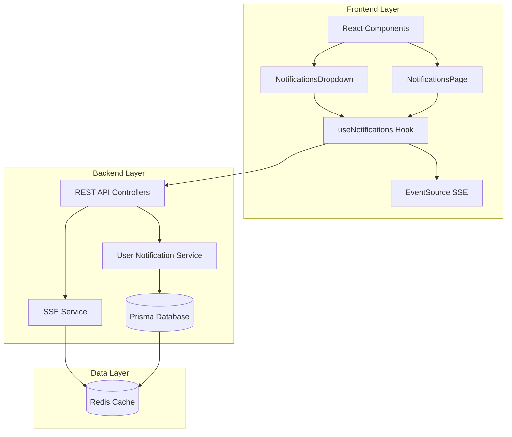

**Diagram sources**
- [NotificationsDropdown.tsx:1-248](file://pikzels-clone/client/src/components/notifications/NotificationsDropdown.tsx#L1-L248)
- [NotificationsPage.tsx:1-489](file://pikzels-clone/client/src/components/notifications/NotificationsPage.tsx#L1-L489)
- [useNotifications.ts:1-319](file://pikzels-clone/client/src/hooks/useNotifications.ts#L1-L319)
- [user-notification.controller.ts:1-160](file://pikzels-clone/src/modules/user-notification/user-notification.controller.ts#L1-L160)
- [sse.service.ts:1-285](file://pikzels-clone/src/services/sse.service.ts#L1-L285)

## Frontend Notification Components

The frontend notification system has been completely redesigned with two primary components: a compact dropdown for quick access and a comprehensive page for full management.

### NotificationsDropdown Component

The NotificationsDropdown component provides a streamlined interface for quick notification access with real-time updates.

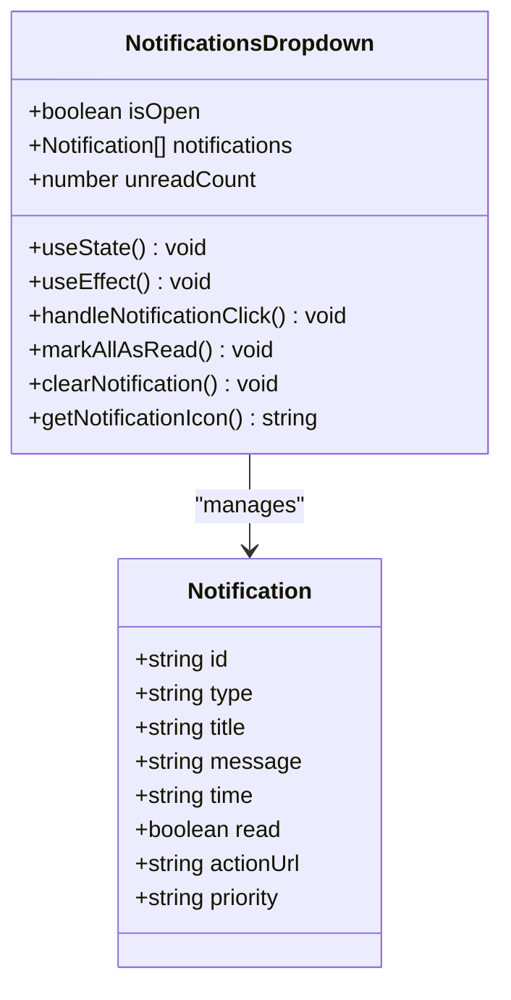

**Diagram sources**
- [NotificationsDropdown.tsx:31-46](file://pikzels-clone/client/src/components/notifications/NotificationsDropdown.tsx#L31-L46)

### NotificationsPage Component

The NotificationsPage component offers comprehensive notification management with advanced filtering, pagination, and bulk operations.

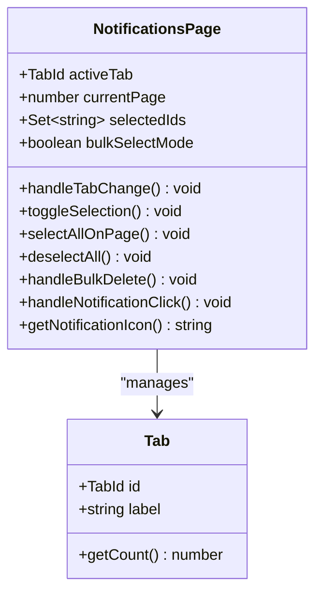

**Diagram sources**
- [NotificationsPage.tsx:86-121](file://pikzels-clone/client/src/components/notifications/NotificationsPage.tsx#L86-L121)

**Section sources**
- [NotificationsDropdown.tsx:1-248](file://pikzels-clone/client/src/components/notifications/NotificationsDropdown.tsx#L1-L248)
- [NotificationsPage.tsx:1-489](file://pikzels-clone/client/src/components/notifications/NotificationsPage.tsx#L1-L489)

## Real-Time SSE Integration

The system now implements comprehensive server-sent events (SSE) for real-time notification delivery, replacing polling mechanisms with efficient bidirectional communication.

### SSE Connection Management

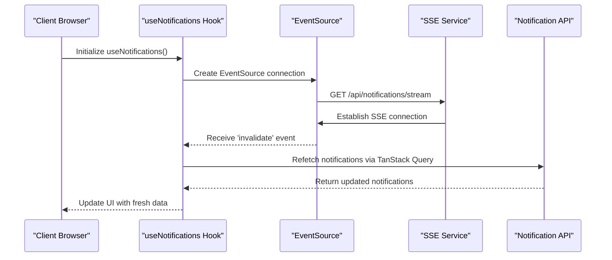

**Diagram sources**
- [useNotifications.ts:115-169](file://pikzels-clone/client/src/hooks/useNotifications.ts#L115-L169)
- [notification-sse.routes.ts:25-35](file://pikzels-clone/src/modules/notification-sse/notification-sse.routes.ts#L25-L35)
- [sse.service.ts:58-91](file://pikzels-clone/src/services/sse.service.ts#L58-L91)

### SSE Service Architecture

The SSE service manages long-lived connections with robust connection limits and automatic reconnection capabilities.

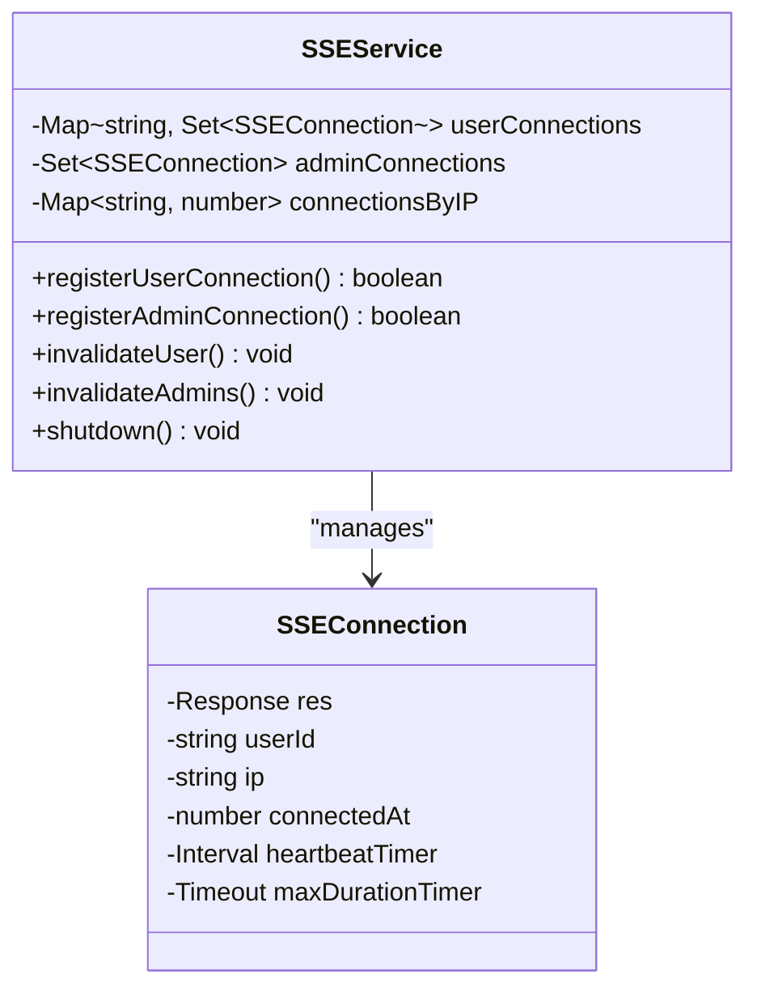

**Diagram sources**
- [sse.service.ts:39-52](file://pikzels-clone/src/services/sse.service.ts#L39-L52)

**Section sources**
- [useNotifications.ts:1-319](file://pikzels-clone/client/src/hooks/useNotifications.ts#L1-L319)
- [notification-sse.routes.ts:1-56](file://pikzels-clone/src/modules/notification-sse/notification-sse.routes.ts#L1-L56)
- [sse.service.ts:1-285](file://pikzels-clone/src/services/sse.service.ts#L1-L285)

## Backend Notification Management

The backend notification system provides comprehensive CRUD operations with real-time invalidation and advanced filtering capabilities.

### User Notification Service

The User Notification Service handles all user-specific notification operations with transactional integrity and real-time synchronization.

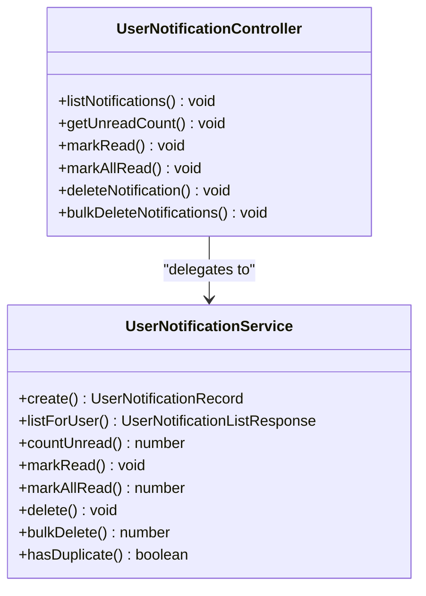

**Diagram sources**
- [user-notification.service.ts:33-31](file://pikzels-clone/src/modules/user-notification/user-notification.service.ts#L33-L31)
- [user-notification.controller.ts:17-39](file://pikzels-clone/src/modules/user-notification/user-notification.controller.ts#L17-L39)

### Notification Types and Categories

The system supports a comprehensive set of notification types organized into logical categories for better user experience.

| Category | Notification Types | Purpose |
|----------|-------------------|---------|
| Credit | `credits_low`, `credits_depleted`, `credits_purchased` | Credit balance management and warnings |
| Billing | `billing_success`, `billing_failed`, `subscription_changed` | Payment processing and subscription updates |
| Security | `security_login`, `security_password_changed` | Security alerts and login notifications |
| Thumbnail | `thumbnail_ready`, `thumbnail_failed` | Thumbnail generation status |
| System | `system` | System-wide announcements and maintenance |

**Section sources**
- [user-notification.service.ts:1-203](file://pikzels-clone/src/modules/user-notification/user-notification.service.ts#L1-L203)
- [user-notification.controller.ts:1-160](file://pikzels-clone/src/modules/user-notification/user-notification.controller.ts#L1-L160)
- [user-notification.types.ts:1-62](file://pikzels-clone/src/modules/user-notification/types.ts#L1-L62)

## Centralized Notification Categories

The notification system now implements a centralized categorization system that provides consistent iconography and styling across all notification types.

### Category Mapping System

```mermaid
flowchart TD
Type[string notification.type] --> CheckPrefix{"Type prefix?"}
CheckPrefix --> |"credits_"| Credit["Category: credit"]
CheckPrefix --> |"subscription_"| Billing["Category: billing"]
CheckPrefix --> |"thumbnail_"| Thumbnail["Category: thumbnail"]
CheckPrefix --> |"security_"|"Category: security"]
CheckPrefix --> |"billing_"|"Category: billing"]
CheckPrefix --> |"credits_low"| Credit
CheckPrefix --> |"credits_depleted"| Credit
CheckPrefix --> |"credits_purchased"| Credit
CheckPrefix --> |"thumbnail_ready"| Thumbnail
CheckPrefix --> |"thumbnail_failed"| Thumbnail
CheckPrefix --> |"security_login"| Security
CheckPrefix --> |"security_password_changed"| Security
CheckPrefix --> |"billing_success"| Billing
CheckPrefix --> |"billing_failed"| Billing
CheckPrefix --> |"subscription_changed"| Billing
CheckPrefix --> |Default| System["Category: system"]
```

**Diagram sources**
- [useNotifications.ts:304-318](file://pikzels-clone/client/src/hooks/useNotifications.ts#L304-L318)

**Section sources**
- [useNotifications.ts:24-319](file://pikzels-clone/client/src/hooks/useNotifications.ts#L24-L319)

## Advanced Filtering and Pagination

The NotificationsPage component provides sophisticated filtering and pagination capabilities for managing large volumes of notifications efficiently.

### Filtering System

The system supports three primary filter states with dynamic count updates:

| Filter Type | Query Parameter | Description |
|-------------|----------------|-------------|
| All | `isRead=all` | Show all notifications regardless of read status |
| Unread | `isRead=false` | Show only unread notifications |
| Read | `isRead=true` | Show only read notifications |

### Pagination Implementation

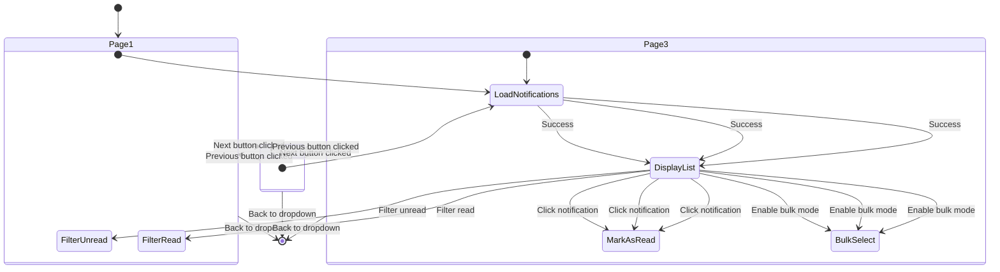

**Diagram sources**
- [NotificationsPage.tsx:86-121](file://pikzels-clone/client/src/components/notifications/NotificationsPage.tsx#L86-L121)

**Section sources**
- [NotificationsPage.tsx:48-121](file://pikzels-clone/client/src/components/notifications/NotificationsPage.tsx#L48-L121)
- [useNotifications.ts:58-81](file://pikzels-clone/client/src/hooks/useNotifications.ts#L58-L81)

## Email Preferences Service

The email preferences service maintains backward compatibility while integrating with the new notification system architecture.

### EmailPreferences Interface

The service continues to provide structured email preference management:

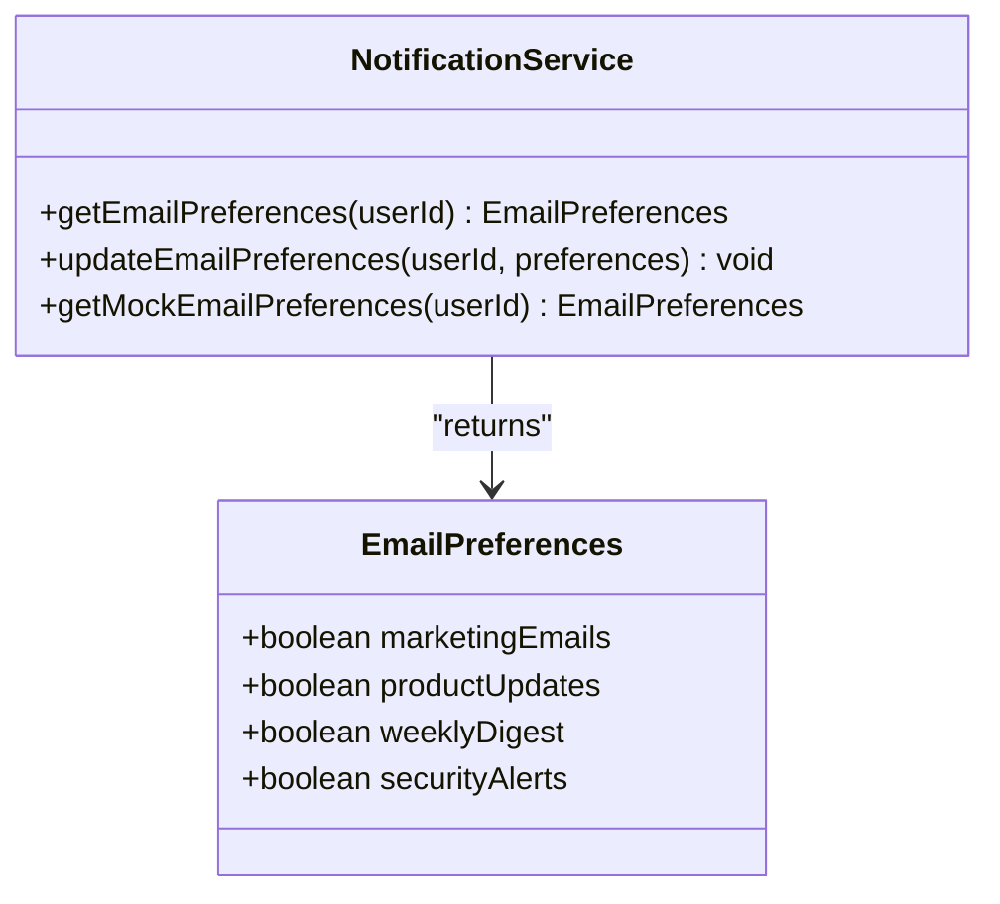

**Diagram sources**
- [notification.service.ts:16-21](file://pikzels-clone/src/modules/notification/notification.service.ts#L16-L21)

**Section sources**
- [notification.service.ts:27-87](file://pikzels-clone/src/modules/notification/notification.service.ts#L27-L87)

## Event-Driven Notification System

The backend event-driven system continues to provide robust processing for complex notification scenarios while coordinating with the new real-time SSE system.

### Event Emitter Architecture

The event emitter maintains its role in processing complex notification scenarios:

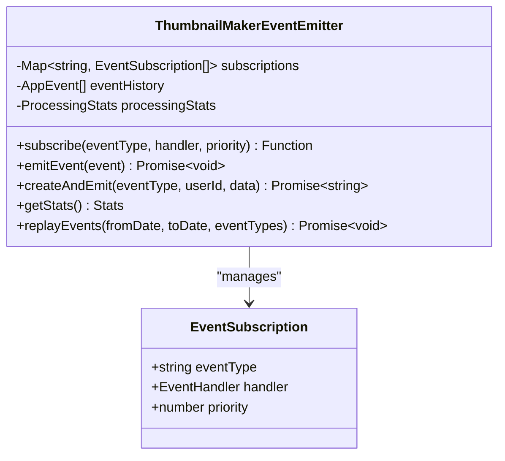

**Diagram sources**
- [event-emitter.ts:16-68](file://pikzels-clone/src/events/event-emitter.ts#L16-L68)

**Section sources**
- [event-types.ts:104-113](file://pikzels-clone/src/events/event-types.ts#L104-L113)
- [event-emitter.ts:35-68](file://pikzels-clone/src/events/event-emitter.ts#L35-L68)

## Analytics and Tracking

The analytics system has been enhanced to track notification engagement and system performance metrics.

### Real-Time Analytics Processing

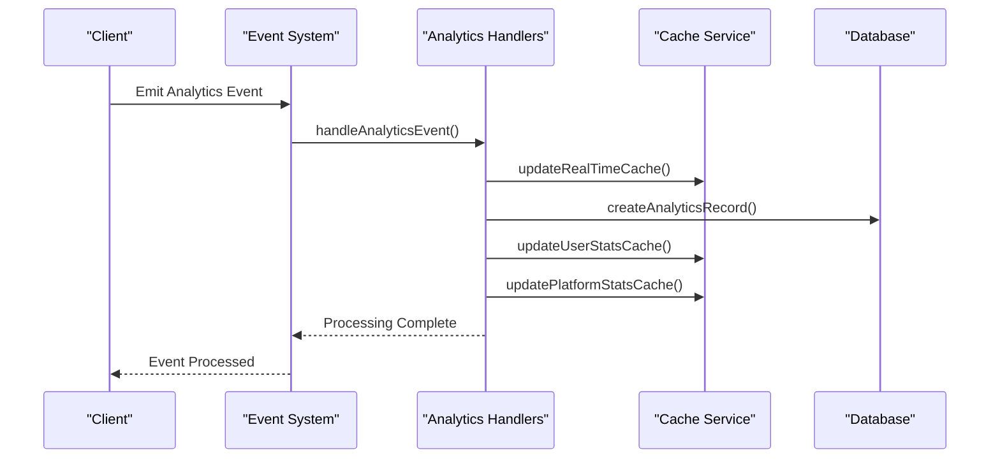

**Diagram sources**
- [analytics-handlers.ts:33-52](file://pikzels-clone/src/events/analytics-handlers.ts#L33-L52)
- [analytics-handlers.ts:171-208](file://pikzels-clone/src/events/analytics-handlers.ts#L171-L208)

**Section sources**
- [analytics-handlers.ts:21-28](file://pikzels-clone/src/events/analytics-handlers.ts#L21-L28)
- [analytics-handlers.ts:288-294](file://pikzels-clone/src/events/analytics-handlers.ts#L288-L294)

## Social Sharing Notifications

The social sharing system maintains its resilient background processing capabilities for cross-platform content distribution.

### Social Share Processing Pipeline

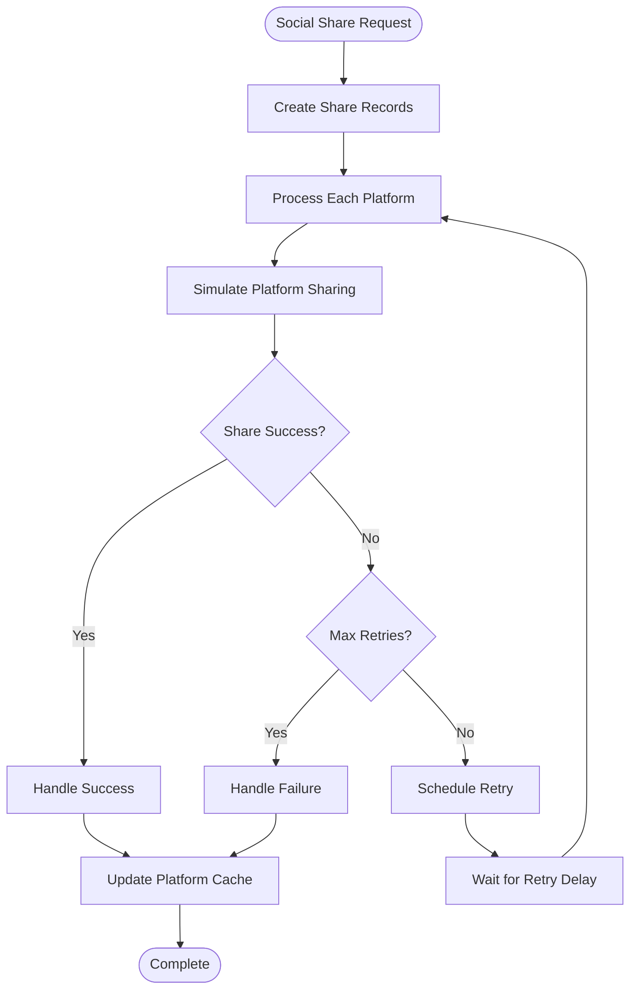

**Diagram sources**
- [social-share-handlers.ts:126-154](file://pikzels-clone/src/events/social-share-handlers.ts#L126-L154)
- [social-share-handlers.ts:232-273](file://pikzels-clone/src/events/social-share-handlers.ts#L232-L273)

**Section sources**
- [social-share-handlers.ts:28-53](file://pikzels-clone/src/events/social-share-handlers.ts#L28-L53)

## Event Persistence and Storage

The event persistence system ensures reliable storage and retrieval of notification events for auditing and recovery purposes.

### Event Storage Architecture

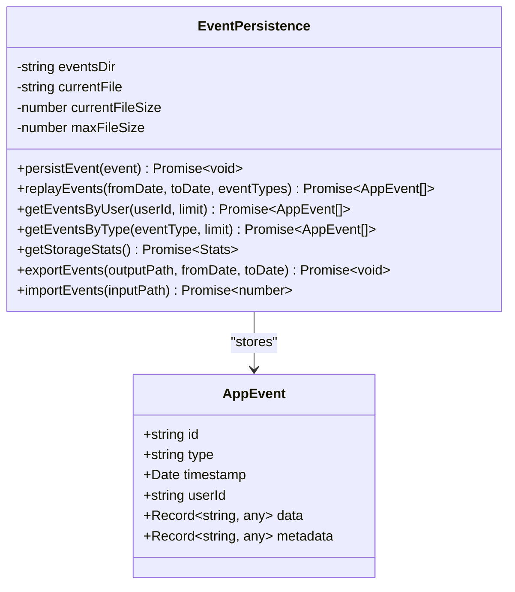

**Diagram sources**
- [event-persistence.ts:15-44](file://pikzels-clone/src/events/event-persistence.ts#L15-L44)

**Section sources**
- [event-persistence.ts:17-29](file://pikzels-clone/src/events/event-persistence.ts#L17-L29)
- [event-persistence.ts:281-291](file://pikzels-clone/src/events/event-persistence.ts#L281-L291)

## Configuration Management

The service includes comprehensive configuration management for various notification channels and integrations.

### Service Monitor Configuration

The service monitor agent provides configuration endpoints for managing notification settings:

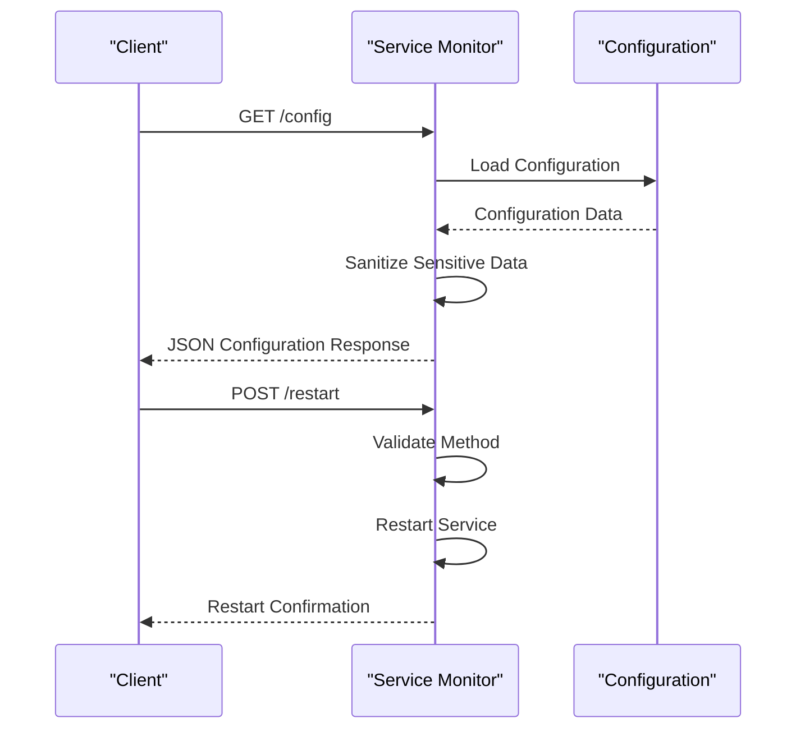

**Diagram sources**
- [service-monitor-agent.js:1072-1094](file://pikzels-clone/service-monitor-agent.js#L1072-L1094)

**Section sources**
- [service-monitor-agent.js:1077-1084](file://pikzels-clone/service-monitor-agent.js#L1077-L1084)

## Performance Considerations

The notification service has been optimized for performance with real-time capabilities and efficient resource management.

### Real-Time Performance Optimizations

- **SSE Connection Limits**: 5 connections per IP, 3 per user to prevent abuse
- **Connection Duration**: 30-minute maximum to ensure regular re-authentication
- **Heartbeat Mechanism**: 30-second intervals to keep connections alive
- **Automatic Reconnection**: 5-second retry intervals for failed connections
- **TanStack Query Caching**: 30-second stale time with SSE invalidation

### Memory and Resource Management

- **Connection Cleanup**: Automatic cleanup of dead connections
- **IP Tracking**: Prevents abuse through connection counting
- **Graceful Shutdown**: Proper cleanup of all SSE connections
- **Database Optimization**: Efficient pagination with 100-item limit per query

## Troubleshooting Guide

### Common Issues and Solutions

**SSE Connection Issues**
- Verify EventSource support in browser
- Check CORS configuration for SSE endpoints
- Monitor connection limits and IP restrictions
- Validate authentication cookies for user connections

**Notification Component Issues**
- Verify proper initialization of TanStack Query
- Check SSE connection establishment
- Ensure proper cleanup of EventSource instances
- Validate notification data structure and types

**Backend API Issues**
- Confirm database connectivity for notification operations
- Verify Prisma schema and migrations
- Check user authentication and authorization
- Monitor SSE service health and connection counts

**Performance Issues**
- Monitor SSE connection counts and memory usage
- Check TanStack Query cache effectiveness
- Validate database query performance
- Review network latency for SSE connections

**Section sources**
- [useNotifications.ts:115-169](file://pikzels-clone/client/src/hooks/useNotifications.ts#L115-L169)
- [sse.service.ts:58-91](file://pikzels-clone/src/services/sse.service.ts#L58-L91)

## Conclusion

The Notification Service has evolved into a comprehensive, real-time notification management system that combines the best of modern web technologies with robust backend processing. The integration of server-sent events provides instant notification delivery while maintaining excellent performance characteristics through strategic caching and connection management.

The centralized categorization system ensures consistent user experience across all notification types, while the advanced filtering and pagination capabilities in the NotificationsPage component provide efficient management of large notification volumes. The combination of real-time SSE updates and persistent database storage creates a resilient system that can handle both immediate user notifications and complex event-driven scenarios.

Key strengths of the enhanced system include its real-time responsiveness, comprehensive filtering capabilities, efficient resource management, and seamless integration between frontend and backend components. The service is well-positioned to scale with the platform's growth and can accommodate additional notification channels and processing requirements as needed.