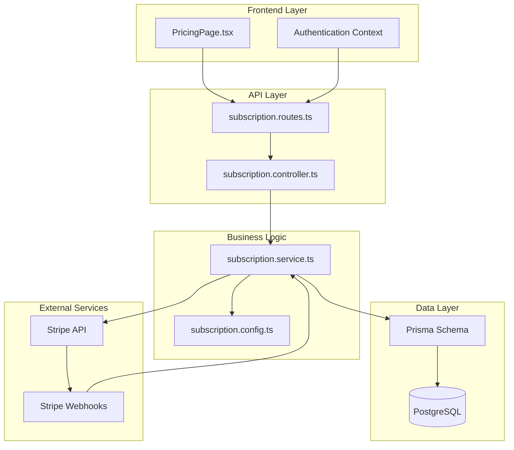
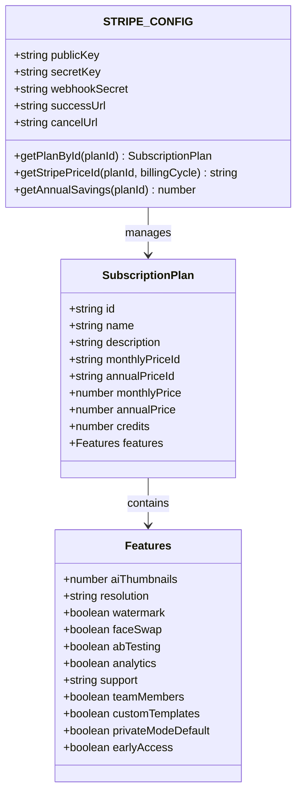
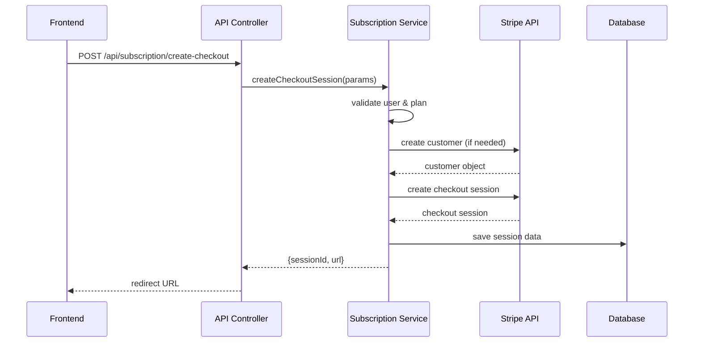
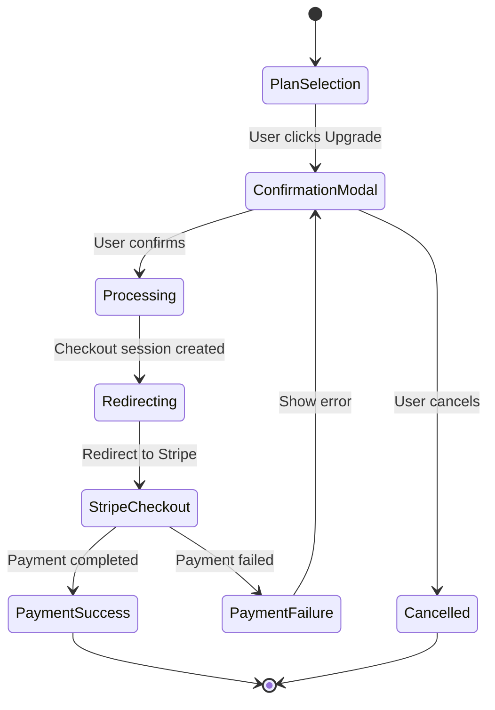
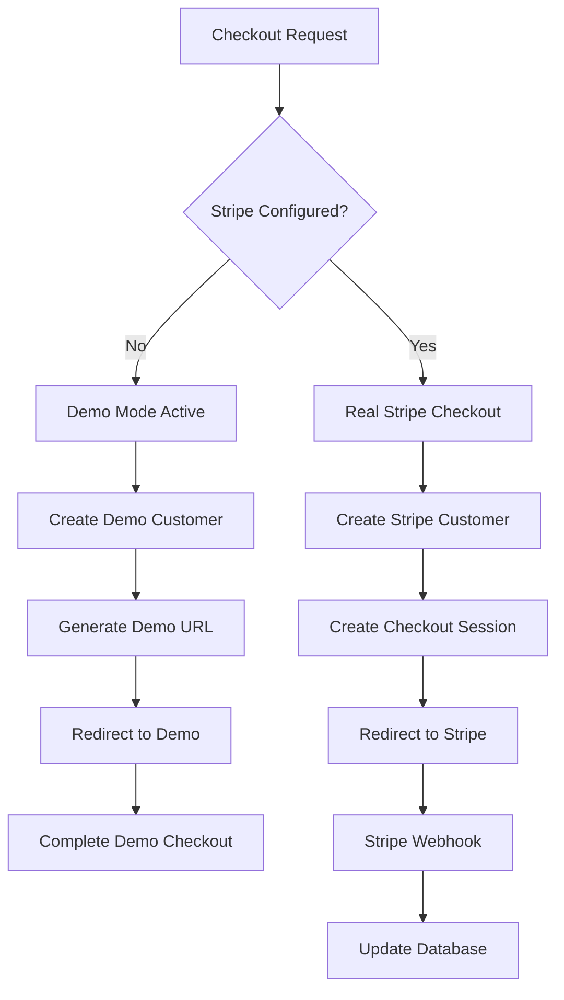
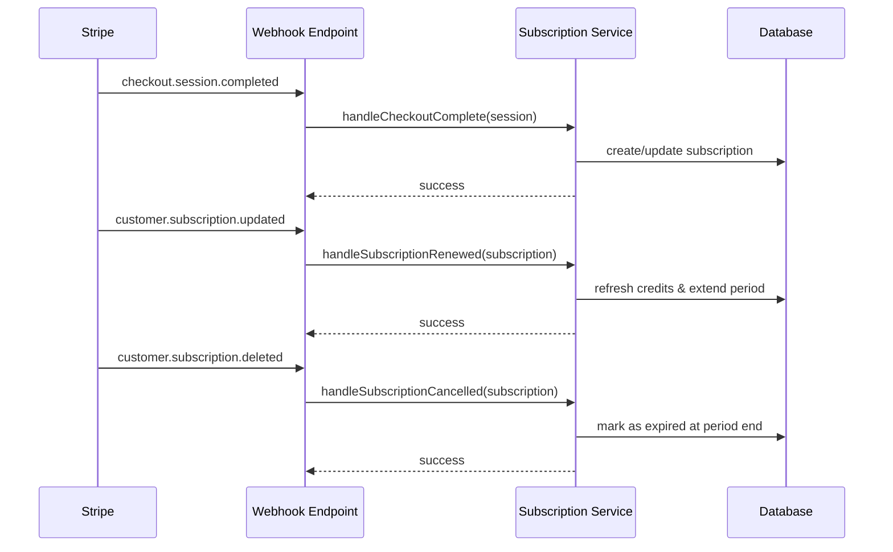
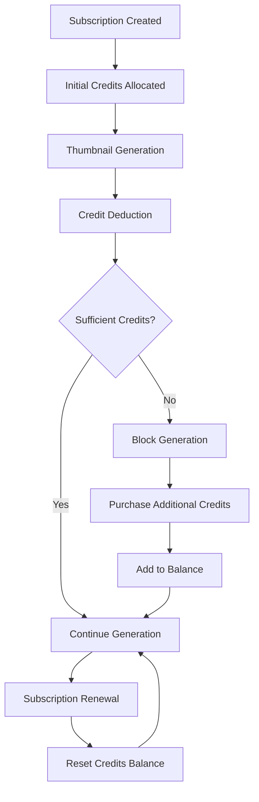
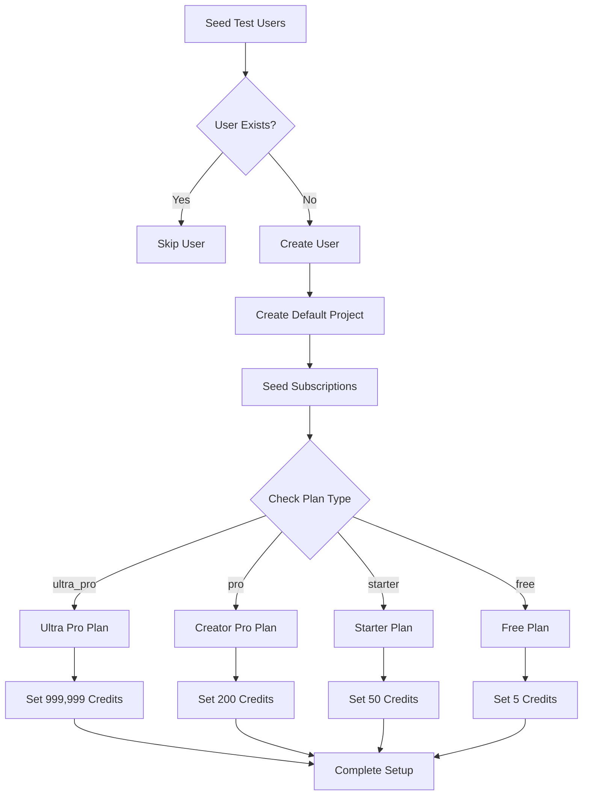
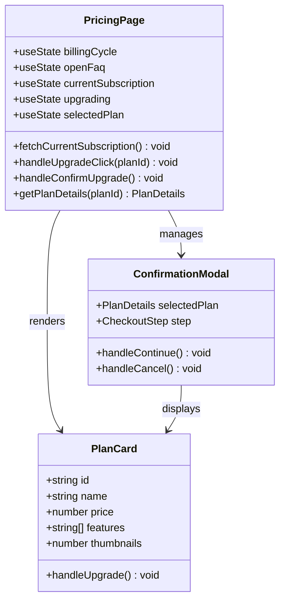

# Subscription Management

<cite>
**Referenced Files in This Document**
- [subscription.config.ts](file://pikzels-clone/src/modules/subscription/subscription.config.ts)
- [subscription.service.ts](file://pikzels-clone/src/modules/subscription/subscription.service.ts)
- [subscription.controller.ts](file://pikzels-clone/src/modules/subscription/subscription.controller.ts)
- [subscription.routes.ts](file://pikzels-clone/src/modules/subscription/subscription.routes.ts)
- [schema.prisma](file://pikzels-clone/prisma/schema.prisma)
- [PricingPage.tsx](file://pikzels-clone/client/src/components/dashboard/PricingPage.tsx)
- [seed.ts](file://pikzels-clone/prisma/seed.ts)
- [.env.example](file://pikzels-clone/.env.example)
- [pricing-checkout-flow.spec.ts](file://pikzels-clone/tests/e2e/pricing-checkout-flow.spec.ts)
</cite>

## Update Summary
**Changes Made**
- Enhanced Ultra Pro subscription plan with unlimited face swaps and dedicated support
- Updated TEST_SUBSCRIPTIONS mapping to include ultra_pro plan with 999,999 credits for unlimited access testing
- Improved subscription creation process with comprehensive metadata and idempotent seeding capabilities
- Enhanced test user subscription management with systematic credit allocation strategies
- Updated subscription plans table with comprehensive feature matrix including Ultra Pro tier

## Table of Contents
1. [Introduction](#introduction)
2. [System Architecture](#system-architecture)
3. [Core Components](#core-components)
4. [Subscription Plans](#subscription-plans)
5. [Checkout Process](#checkout-process)
6. [Webhook Integration](#webhook-integration)
7. [Credit Management](#credit-management)
8. [Test User Subscription Management](#test-user-subscription-management)
9. [Frontend Implementation](#frontend-implementation)
10. [Testing and Validation](#testing-and-validation)
11. [Security Considerations](#security-considerations)
12. [Troubleshooting Guide](#troubleshooting-guide)
13. [Conclusion](#conclusion)

## Introduction

The Subscription Management system is a comprehensive billing solution built for the Thumbnail Maker platform. It provides a complete subscription lifecycle management including plan selection, checkout processing, webhook handling, and credit-based usage tracking. The system integrates seamlessly with Stripe for payment processing while maintaining robust fallback mechanisms for development environments.

**Updated** The system now supports five distinct subscription tiers: Free, Starter, Creator Pro, Ultra Pro, and Business, each offering different levels of AI-powered thumbnail generation capabilities with flexible monthly and annual billing cycles. The Ultra Pro plan is specifically designed for Ultimate Tester accounts and provides premium features with unlimited face swaps and dedicated support.

## System Architecture

The subscription management system follows a modular architecture with clear separation of concerns across multiple layers:



**Diagram sources**
- [subscription.routes.ts:1-121](file://pikzels-clone/src/modules/subscription/subscription.routes.ts#L1-L121)
- [subscription.controller.ts:1-311](file://pikzels-clone/src/modules/subscription/subscription.controller.ts#L1-L311)
- [subscription.service.ts:1-533](file://pikzels-clone/src/modules/subscription/subscription.service.ts#L1-L533)
- [schema.prisma:123-142](file://pikzels-clone/prisma/schema.prisma#L123-L142)

## Core Components

### Configuration Management

The system uses centralized configuration for subscription plans and Stripe integration:



**Diagram sources**
- [subscription.config.ts:7-27](file://pikzels-clone/src/modules/subscription/subscription.config.ts#L7-L27)
- [subscription.config.ts:111-149](file://pikzels-clone/src/modules/subscription/subscription.config.ts#L111-L149)

**Section sources**
- [subscription.config.ts:1-172](file://pikzels-clone/src/modules/subscription/subscription.config.ts#L1-L172)

### Service Layer Implementation

The service layer handles all business logic for subscription operations:



**Diagram sources**
- [subscription.controller.ts:22-70](file://pikzels-clone/src/modules/subscription/subscription.controller.ts#L22-L70)
- [subscription.service.ts:47-123](file://pikzels-clone/src/modules/subscription/subscription.service.ts#L47-L123)

**Section sources**
- [subscription.service.ts:1-533](file://pikzels-clone/src/modules/subscription/subscription.service.ts#L1-L533)

## Subscription Plans

The system supports five comprehensive subscription tiers, each designed for different user needs and usage patterns:

**Updated** The Ultra Pro plan is specifically designed for Ultimate Tester accounts and provides premium features with unlimited face swaps and dedicated support.

| Plan | Monthly Price | Annual Price | Credits/Month | Key Features |
|------|---------------|--------------|---------------|--------------|
| **Free** | $0 | $0 | 5 | Basic AI thumbnails, community support, 720p resolution |
| **Starter** | $19 | $15 ($180 total) | 50 | 1080p HD, face swap (10 faces), no watermark |
| **Creator Pro** | $39 | $29 ($348 total) | 200 | Advanced AI features, A/B testing, priority support |
| **Ultra Pro** | $79 | $59 ($708 total) | 600 | Premium features, unlimited face swaps, dedicated support |
| **Business** | Custom | Custom | 500+ | Team collaboration, white-label, API access |

### Plan Features Matrix

```mermaid
flowchart TD
Free[Free Plan] --> Starter[Starter Plan]
Starter --> Pro[Creator Pro Plan]
Pro --> UltraPro[Ultra Pro Plan]
UltraPro --> Business[Business Plan]
Free --> F1[5 AI Thumbnails]
Free --> F2[Community Support]
Free --> F3[720p Resolution]
Starter --> S1[50 AI Thumbnails]
Starter --> S2[1080p HD]
Starter --> S3[Face Swap (10)]
Starter --> S4[No Watermark]
Pro --> P1[200 AI Thumbnails]
Pro --> P2[Advanced Analytics]
Pro --> P3[A/B Testing]
Pro --> P4[Priority Support]
UltraPro --> U1[600 AI Thumbnails]
UltraPro --> U2[Unlimited Face Swaps]
UltraPro --> U3[Dedicated Support]
UltraPro --> U4[Private Mode Default]
Business --> B1[500+ AI Thumbnails]
Business --> B2[Team Collaboration]
Business --> B3[Custom Templates]
Business --> B4[White-label Option]
```

**Section sources**
- [subscription.config.ts:29-111](file://pikzels-clone/src/modules/subscription/subscription.config.ts#L29-L111)

## Checkout Process

The checkout process is designed with user experience and security as top priorities:

### Multi-Stage Confirmation Flow



### Development Environment Fallback

The system includes a sophisticated demo mode for development environments:



**Section sources**
- [PricingPage.tsx:105-182](file://pikzels-clone/client/src/components/dashboard/PricingPage.tsx#L105-L182)
- [subscription.service.ts:422-451](file://pikzels-clone/src/modules/subscription/subscription.service.ts#L422-L451)

## Webhook Integration

The system implements comprehensive webhook handling for real-time subscription updates:

### Webhook Event Processing



**Diagram sources**
- [subscription.controller.ts:147-225](file://pikzels-clone/src/modules/subscription/subscription.controller.ts#L147-L225)
- [subscription.service.ts:242-416](file://pikzels-clone/src/modules/subscription/subscription.service.ts#L242-L416)

**Section sources**
- [subscription.controller.ts:147-225](file://pikzels-clone/src/modules/subscription/subscription.controller.ts#L147-L225)
- [subscription.service.ts:242-416](file://pikzels-clone/src/modules/subscription/subscription.service.ts#L242-L416)

## Credit Management

The subscription system implements a dual-credit system combining subscription-based credits with individual transaction tracking:

### Credit Lifecycle



### Database Schema Integration

The Prisma schema defines the subscription model with comprehensive indexing for optimal performance:

| Field | Type | Description | Index |
|-------|------|-------------|-------|
| `id` | String | Unique subscription identifier | Primary Key |
| `planType` | String | Reference to subscription plan | Index |
| `creditsBalance` | Int | Available credits for usage | |
| `creditsUsed` | Int | Credits consumed this period | |
| `periodStart` | DateTime | Billing period start date | |
| `periodEnd` | DateTime | Billing period end date | |
| `userId` | String | User association | Index |
| `billingCycle` | String | Monthly/Annual billing | |
| `cancelAtPeriodEnd` | Boolean | Cancellation flag | |
| `status` | String | Active/Expired/Canceled | Index |
| `stripePriceId` | String | Stripe price reference | |
| `stripeSubscriptionId` | String | Stripe subscription ID | Unique Index |

**Section sources**
- [schema.prisma:123-142](file://pikzels-clone/prisma/schema.prisma#L123-L142)
- [subscription.service.ts:198-237](file://pikzels-clone/src/modules/subscription/subscription.service.ts#L198-L237)

## Test User Subscription Management

**Updated** The system includes comprehensive subscription management for test users with varied plan types and credit allocations ranging from 5 to 999,999 credits.

### Enhanced Test User Subscription Strategy

The test environment utilizes a comprehensive subscription strategy to support various testing scenarios with systematic credit allocation:

| Test User | Plan Type | Credits | Purpose |
|-----------|-----------|---------|---------|
| `ultratester@thumpiks.com` | ultra_pro | 999,999 | Ultimate Tester account with unlimited access |
| `testerllm@example.com` | pro | 200 | Standard Creator Pro testing |
| `admin@example.com` | ultra_pro | 999,999 | Admin user with premium access |
| `tester1@example.com` | starter | 50 | Starter tier testing |
| `tester2@example.com` | free | 5 | Basic tier testing |
| `tester3@example.com` | ultra_pro | 600 | Ultra Pro with standard credits |

### Enhanced Test User Setup Process



**Section sources**
- [seed.ts:75-84](file://pikzels-clone/prisma/seed.ts#L75-L84)
- [seed.ts:260-316](file://pikzels-clone/prisma/seed.ts#L260-L316)

## Frontend Implementation

The frontend provides an intuitive pricing interface with comprehensive user guidance:

### Interactive Pricing Interface



**Diagram sources**
- [PricingPage.tsx:23-200](file://pikzels-clone/client/src/components/dashboard/PricingPage.tsx#L23-L200)

**Section sources**
- [PricingPage.tsx:1-744](file://pikzels-clone/client/src/components/dashboard/PricingPage.tsx#L1-L744)

## Testing and Validation

The system includes comprehensive end-to-end testing for the subscription flow:

### Automated Testing Coverage

The Playwright test suite validates critical subscription scenarios:

| Test Category | Coverage | Validation Points |
|---------------|----------|-------------------|
| **Checkout Flow** | Full upgrade process | Modal appearance, loading states, redirect behavior |
| **Pricing Display** | Plan information accuracy | Monthly vs annual pricing, feature comparison |
| **User Experience** | Interface responsiveness | Button states, error handling, loading indicators |
| **Security Validation** | Authentication requirements | Protected routes, session validation |

**Section sources**
- [pricing-checkout-flow.spec.ts:1-200](file://pikzels-clone/tests/e2e/pricing-checkout-flow.spec.ts#L1-L200)
- [pricing-checkout-flow.spec.ts:363-418](file://pikzels-clone/tests/e2e/pricing-checkout-flow.spec.ts#L363-L418)

## Security Considerations

The subscription system implements multiple layers of security:

### Authentication and Authorization

- **Route Protection**: All subscription endpoints require authentication middleware
- **Input Validation**: Comprehensive request validation with whitelist restrictions
- **Stripe Signature Verification**: Webhook endpoints verify Stripe signatures
- **Environment Configuration**: Secure handling of API keys and secrets

### Data Protection

- **Database Security**: Proper indexing for performance without compromising security
- **Session Management**: Secure cookie handling with appropriate attributes
- **Error Handling**: Graceful error responses without exposing sensitive information
- **Rate Limiting**: Built-in protection against abuse and automated attacks

**Section sources**
- [subscription.routes.ts:16-118](file://pikzels-clone/src/modules/subscription/subscription.routes.ts#L16-L118)
- [subscription.controller.ts:147-225](file://pikzels-clone/src/modules/subscription/subscription.controller.ts#L147-L225)

## Troubleshooting Guide

### Common Issues and Solutions

| Issue | Symptoms | Solution |
|-------|----------|----------|
| **Stripe Not Configured** | Demo mode activation, checkout errors | Add Stripe API keys to environment variables |
| **Checkout Session Creation Failed** | Error 500 from API, no redirect URL | Verify Stripe configuration and network connectivity |
| **Webhook Processing Errors** | Subscriptions not updating, stale data | Check webhook endpoint accessibility and signature verification |
| **Credit Deduction Failures** | Generation blocked despite sufficient credits | Verify subscription status and credit balance |
| **Ultra Pro Plan Not Available** | Ultra Pro plan missing from UI | Ensure STRIPE_PRICE_ID_ULTRA_PRO_* environment variables are configured |
| **Test User Subscription Issues** | Test users missing subscriptions | Verify TEST_SUBSCRIPTIONS mapping and seed script execution |

### Development Environment Setup

For local development, ensure the following environment variables are configured:

- `STRIPE_SECRET_KEY`: Your Stripe secret API key
- `STRIPE_PUBLISHABLE_KEY`: Your Stripe publishable API key  
- `STRIPE_WEBHOOK_SECRET`: Your Stripe webhook signing secret
- `STRIPE_PRICE_ID_ULTRA_PRO_MONTHLY`: Ultra Pro monthly price ID
- `STRIPE_PRICE_ID_ULTRA_PRO_ANNUAL`: Ultra Pro annual price ID
- `CLIENT_URL`: Frontend application URL for redirects

**Section sources**
- [.env.example:20-32](file://pikzels-clone/.env.example#L20-L32)
- [subscription.service.ts:53-55](file://pikzels-clone/src/modules/subscription/subscription.service.ts#L53-L55)

## Conclusion

The Subscription Management system provides a robust, scalable foundation for monetizing thumbnail generation capabilities. Its modular architecture ensures maintainability while the comprehensive feature set supports various business models and user needs.

**Updated** Key strengths now include:

- **Enhanced Plan Hierarchy**: Five distinct tiers including the new Ultra Pro plan for Ultimate Tester accounts
- **Flexible Billing Options**: Support for both monthly and annual billing cycles with varied credit allocations
- **Comprehensive Test User Management**: Systematic subscription management for diverse testing scenarios with unlimited access testing
- **Robust Security**: Multi-layered security with proper authentication and authorization
- **Developer-Friendly**: Excellent development experience with demo mode and comprehensive testing
- **Scalable Architecture**: Well-designed components that can accommodate future growth

The system successfully balances user experience with business requirements, providing clear value propositions while maintaining technical excellence. The addition of the Ultra Pro plan with unlimited face swaps and comprehensive test user management significantly enhances the platform's capability to support advanced testing and premium user experiences.