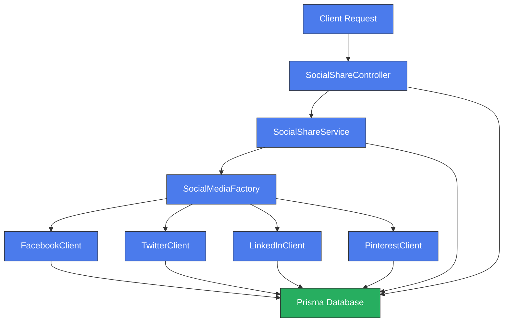
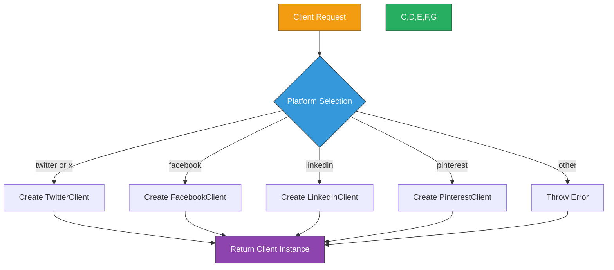
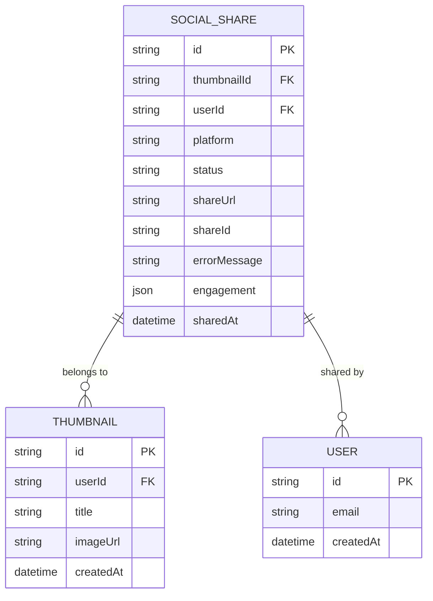
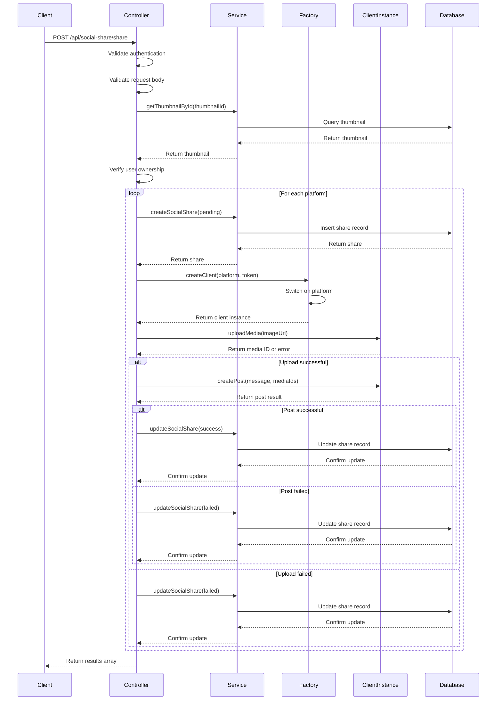
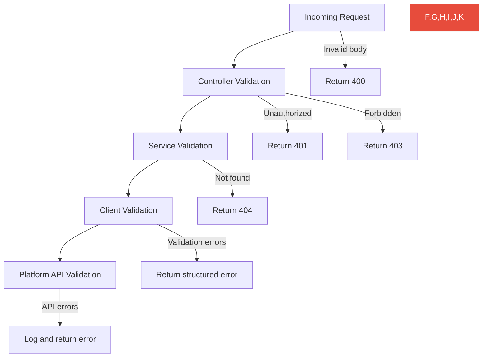

# Social Sharing Module

<cite>
**Referenced Files in This Document**   
- [social-media-factory.ts](file://pikzels-clone\src\modules\social-share\social-media-factory.ts)
- [social-share.service.ts](file://pikzels-clone\src\modules\social-share\social-share.service.ts)
- [social-share.controller.ts](file://pikzels-clone\src\modules\social-share\social-share.controller.ts)
- [social-share.routes.ts](file://pikzels-clone\src\modules\social-share\social-share.routes.ts)
- [social-media-client.ts](file://pikzels-clone\src\modules\social-share\social-media-client.ts)
- [facebook-client.ts](file://pikzels-clone\src\modules\social-share\facebook-client.ts)
- [twitter-client.ts](file://pikzels-clone\src\modules\social-share\twitter-client.ts)
- [linkedin-client.ts](file://pikzels-clone\src\modules\social-share\linkedin-client.ts)
- [pinterest-client.ts](file://pikzels-clone\src\modules\social-share\pinterest-client.ts)
- [social-share.test.ts](file://pikzels-clone\src\__tests__\social-share.test.ts)
</cite>

## Table of Contents
1. [Introduction](#introduction)
2. [Core Architecture](#core-architecture)
3. [Social Media Client Implementation](#social-media-client-implementation)
4. [Factory Pattern for Client Selection](#factory-pattern-for-client-selection)
5. [Unified Sharing Service](#unified-sharing-service)
6. [Controller and Route Implementation](#controller-and-route-implementation)
7. [Platform-Specific Considerations](#platform-specific-considerations)
8. [Error Handling and Validation](#error-handling-and-validation)
9. [Testing Strategy](#testing-strategy)
10. [Extension Points](#extension-points)
11. [Troubleshooting Guide](#troubleshooting-guide)

## Introduction

The Social Sharing Module enables users to share generated thumbnails across multiple social media platforms including Facebook, Twitter, LinkedIn, and Pinterest. The module follows a modular architecture with dedicated client classes for each platform, a factory pattern for dynamic client selection, and a unified service layer for consistent sharing logic. This documentation provides comprehensive details on the implementation, integration patterns, and operational considerations for the social sharing functionality.

## Core Architecture

The social sharing system is structured around a layered architecture that separates concerns between platform-specific implementations and shared business logic. The core components work together to provide a seamless sharing experience while maintaining flexibility for future platform additions.



**Diagram sources**
- [social-share.controller.ts](file://pikzels-clone\src\modules\social-share\social-share.controller.ts)
- [social-share.service.ts](file://pikzels-clone\src\modules\social-share\social-share.service.ts)
- [social-media-factory.ts](file://pikzels-clone\src\modules\social-share\social-media-factory.ts)
- [facebook-client.ts](file://pikzels-clone\src\modules\social-share\facebook-client.ts)
- [twitter-client.ts](file://pikzels-clone\src\modules\social-share\twitter-client.ts)
- [linkedin-client.ts](file://pikzels-clone\src\modules\social-share\linkedin-client.ts)
- [pinterest-client.ts](file://pikzels-clone\src\modules\social-share\pinterest-client.ts)

**Section sources**
- [social-share.controller.ts](file://pikzels-clone\src\modules\social-share\social-share.controller.ts#L1-L50)
- [social-share.service.ts](file://pikzels-clone\src\modules\social-share\social-share.service.ts#L1-L50)
- [social-media-factory.ts](file://pikzels-clone\src\modules\social-share\social-media-factory.ts#L1-L10)

## Social Media Client Implementation

The module implements dedicated client classes for each supported social media platform, all extending from a common base class. This approach ensures consistent interfaces while allowing platform-specific adaptations for API requirements, content formatting, and validation rules.

### Base Client Interface

The `SocialMediaClient` abstract class defines the contract that all platform-specific clients must implement. It provides shared functionality for post validation and text formatting while requiring concrete implementations for media upload, post creation, and engagement retrieval.

```mermaid
classDiagram
class SocialMediaClient {
<<abstract>>
+string accessToken
+string baseUrl
+uploadMedia(imageUrl) Promise~{mediaId} | {error}~
+createPost(post, mediaIds) Promise~SocialMediaResponse~
+getEngagement(postId) Promise~any~
-formatText(text, platform) string
-validatePost(post) {valid, errors}
}
class SocialMediaPost {
+string text
+string imageUrl
+string link
}
class SocialMediaResponse {
+boolean success
+string postId
+string postUrl
+string error
+any engagement
}
SocialMediaClient <|-- FacebookClient
SocialMediaClient <|-- TwitterClient
SocialMediaClient <|-- LinkedInClient
SocialMediaClient <|-- PinterestClient
SocialMediaClient --> SocialMediaPost
SocialMediaClient --> SocialMediaResponse
classDef abstract fill : #9B59B6,stroke : #333,color : white;
classDef interface fill : #3498DB,stroke : #333,color : white;
class SocialMediaClient abstract
```

**Diagram sources**
- [social-media-client.ts](file://pikzels-clone\src\modules\social-share\social-media-client.ts#L1-L70)

**Section sources**
- [social-media-client.ts](file://pikzels-clone\src\modules\social-share\social-media-client.ts#L1-L70)

### Platform-Specific Clients

Each social media platform has a dedicated client class that handles the specific API requirements and limitations of that platform. These clients implement the abstract methods defined in the base class and add platform-specific validation and formatting logic.

#### Facebook Client

The `FacebookClient` handles integration with Facebook's Graph API, supporting post creation with images and retrieval of engagement metrics. It enforces Facebook's character limit of 63,206 characters for posts and validates that posts contain either text or an image.

**Section sources**
- [facebook-client.ts](file://pikzels-clone\src\modules\social-share\facebook-client.ts#L6-L130)

#### Twitter Client

The `TwitterClient` manages Twitter API integration with specific handling for Twitter's 280-character limit. It validates tweet content and formats text appropriately for the platform. The client supports media uploads and tweet creation with proper error handling for API limitations.

**Section sources**
- [twitter-client.ts](file://pikzels-clone\src\modules\social-share\twitter-client.ts#L6-L128)

#### LinkedIn Client

The `LinkedInClient` implements LinkedIn API functionality with support for longer-form content up to 3,000 characters. It handles media uploads and post creation while validating content according to LinkedIn's requirements. Engagement metrics include likes, comments, shares, and impressions.

**Section sources**
- [linkedin-client.ts](file://pikzels-clone\src\modules\social-share\linkedin-client.ts#L6-L130)

#### Pinterest Client

The `PinterestClient` manages Pinterest API integration with specific validation rules requiring images for pins. It enforces Pinterest's 500-character limit for pin descriptions and handles the creation of pins with proper media association. The client also retrieves engagement metrics specific to Pinterest's analytics.

**Section sources**
- [pinterest-client.ts](file://pikzels-clone\src\modules\social-share\pinterest-client.ts#L6-L136)

## Factory Pattern for Client Selection

The `SocialMediaFactory` implements the Factory design pattern to dynamically instantiate the appropriate client based on the requested platform. This pattern provides a clean separation between client creation logic and the rest of the application, making it easy to add new platforms without modifying existing code.



**Diagram sources**
- [social-media-factory.ts](file://pikzels-clone\src\modules\social-share\social-media-factory.ts#L6-L25)

**Section sources**
- [social-media-factory.ts](file://pikzels-clone\src\modules\social-share\social-media-factory.ts#L6-L25)

The factory supports case-insensitive platform names and treats "x" as an alias for Twitter. When an unsupported platform is requested, it throws an error with a descriptive message. This implementation allows the controller to request clients by platform name without knowing the specific class implementations, promoting loose coupling and maintainability.

## Unified Sharing Service

The `SocialShareService` provides a unified interface for managing social sharing operations across all platforms. It handles database interactions for tracking share status, engagement, and metadata, abstracting the persistence layer from the controller and client classes.

### Data Model and Operations

The service interacts with the Prisma ORM to manage social share records in the database. Each share record includes the thumbnail ID, user ID, platform, status, share URL, share ID, error messages, and engagement data.



**Diagram sources**
- [social-share.service.ts](file://pikzels-clone\src\modules\social-share\social-share.service.ts#L4-L130)

**Section sources**
- [social-share.service.ts](file://pikzels-clone\src\modules\social-share\social-share.service.ts#L4-L130)

### Service Methods

The service exposes several key methods for managing the social sharing lifecycle:

- **createSocialShare**: Creates a new share record with initial pending status
- **getSocialSharesByUser**: Retrieves all shares for a specific user with optional filters
- **getSocialSharesByThumbnail**: Retrieves all shares associated with a specific thumbnail
- **updateSocialShare**: Updates share status, URL, ID, or error information
- **deleteSocialShare**: Removes a share record from the database
- **getSocialShareStats**: Aggregates sharing statistics by platform and status

These methods provide a consistent interface for the controller to interact with share data regardless of the underlying platform or database structure.

## Controller and Route Implementation

The `SocialShareController` handles HTTP requests for social sharing operations, serving as the entry point for client interactions. It orchestrates the sharing workflow by coordinating between the service layer, factory pattern, and platform clients.

### Request Processing Flow



**Diagram sources**
- [social-share.controller.ts](file://pikzels-clone\src\modules\social-share\social-share.controller.ts#L16-L281)
- [social-share.service.ts](file://pikzels-clone\src\modules\social-share\social-share.service.ts#L4-L20)
- [social-media-factory.ts](file://pikzels-clone\src\modules\social-share\social-media-factory.ts#L6-L15)

**Section sources**
- [social-share.controller.ts](file://pikzels-clone\src\modules\social-share\social-share.controller.ts#L16-L281)
- [social-share.routes.ts](file://pikzels-clone\src\modules\social-share\social-share.routes.ts#L1-L26)

### Route Definitions

The module defines RESTful endpoints for social sharing operations:

- **POST /api/social-share/share**: Share a thumbnail to one or more platforms
- **GET /api/social-share/**: Retrieve social shares for the authenticated user
- **GET /api/social-share/stats**: Get sharing statistics by platform
- **GET /api/social-share/thumbnail/:thumbnailId**: Get shares for a specific thumbnail
- **DELETE /api/social-share/:id**: Remove a share record

All routes require authentication via the `authenticateToken` middleware, ensuring that users can only access their own sharing data.

## Platform-Specific Considerations

Each social media platform has unique requirements and limitations that are handled by the respective client implementations.

### Content Formatting Differences

| Platform | Character Limit | Image Requirements | Special Considerations |
|---------|----------------|-------------------|----------------------|
| Facebook | 63,206 characters | Supports multiple images | High tolerance for long-form content |
| Twitter | 280 characters | Single image per tweet | Character count includes URLs and media |
| LinkedIn | 3,000 characters | Single image per post | Professional content focus |
| Pinterest | 500 characters | Image required for pins | Visual content emphasis |

The client classes handle these differences through platform-specific formatting methods that truncate text appropriately and validate content before submission.

### Rate Limiting and API Quotas

While the current implementation does not include explicit rate limiting handling, the architecture supports adding such functionality through:

1. **Client-level rate limiting**: Each client could track API usage and implement exponential backoff
2. **Service-level queuing**: The service could queue share requests to stay within platform quotas
3. **User-level limits**: The system could enforce daily sharing limits per user

These enhancements would require monitoring API response headers for rate limit information and implementing appropriate retry logic.

## Error Handling and Validation

The module implements comprehensive error handling at multiple levels to ensure robust operation despite API failures or invalid requests.

### Validation Hierarchy



**Diagram sources**
- [social-share.controller.ts](file://pikzels-clone\src\modules\social-share\social-share.controller.ts#L16-L281)
- [social-media-client.ts](file://pikzels-clone\src\modules\social-share\social-media-client.ts#L50-L70)
- [platform-specific clients](file://pikzels-clone\src\modules\social-share\)

**Section sources**
- [social-share.controller.ts](file://pikzels-clone\src\modules\social-share\social-share.controller.ts#L16-L281)
- [social-media-client.ts](file://pikzels-clone\src\modules\social-share\social-media-client.ts#L50-L70)

The validation process occurs at multiple levels:
1. **Controller**: Validates request structure, authentication, and ownership
2. **Service**: Validates database relationships and business rules
3. **Client**: Validates platform-specific content requirements
4. **API**: Handles platform API-level validation and errors

Each share attempt is recorded in the database with appropriate status (pending, success, failed), allowing users to track sharing outcomes and troubleshoot issues.

## Testing Strategy

The module includes unit tests that verify the core functionality and error handling pathways.

### Test Coverage

The existing tests focus on authentication requirements for all endpoints, ensuring that unauthenticated requests receive appropriate 401 Unauthorized responses. This validates the security middleware integration across all social sharing routes.

**Section sources**
- [social-share.test.ts](file://pikzels-clone\src\__tests__\social-share.test.ts#L1-L58)

### Recommended Test Enhancements

To improve test coverage, the following tests should be added:

1. **Client integration tests**: Mock API responses to verify client behavior with various success and error scenarios
2. **Service layer tests**: Test database interactions and business logic in isolation
3. **Factory pattern tests**: Verify correct client instantiation for different platform names
4. **End-to-end sharing tests**: Simulate complete sharing workflows across multiple platforms
5. **Error recovery tests**: Verify proper handling of network failures and API rate limits

These tests would provide comprehensive coverage of the module's functionality and ensure reliability in production environments.

## Extension Points

The modular architecture provides several extension points for enhancing the social sharing functionality.

### Adding New Platforms

To add support for a new social media platform:

1. Create a new client class extending `SocialMediaClient`
2. Implement the required abstract methods with platform-specific logic
3. Add the platform to the `SocialMediaFactory` switch statement
4. Update documentation and tests

This approach requires minimal changes to existing code and maintains the separation of concerns.

### Rich Media Support

The current implementation supports basic image sharing, but could be extended to support:

- **Video uploads**: Add methods for video processing and platform-specific video requirements
- **Carousel posts**: Implement support for multiple images in a single post
- **Stories/Reels**: Add specialized endpoints for ephemeral content
- **Live streaming**: Integrate with platform live streaming APIs

These features would require enhancements to the `SocialMediaPost` interface and client implementations.

### Advanced Analytics

The module could be extended to provide more detailed analytics by:

- **Cross-platform comparison**: Aggregate engagement metrics across platforms
- **Performance trends**: Track sharing success rates over time
- **Content optimization**: Analyze which thumbnail types perform best on each platform
- **Audience insights**: Integrate with platform analytics APIs for demographic data

These enhancements would build upon the existing statistics functionality in the `SocialShareService`.

## Troubleshooting Guide

### Common Sharing Failures

| Issue | Likely Cause | Resolution |
|------|------------|-----------|
| No access token | User hasn't connected platform account | Prompt user to authenticate with the platform |
| Media upload failed | Invalid image URL or network issue | Verify image accessibility and retry |
| Post creation failed | Content validation error | Check character limits and required fields |
| Authentication error | Expired or invalid token | Refresh token or re-authenticate user |
| Platform API error | Temporary service outage | Retry with exponential backoff |

### API Quota Issues

When encountering rate limiting or quota issues:

1. **Monitor API response headers** for rate limit information
2. **Implement request queuing** to stay within platform limits
3. **Add retry logic** with exponential backoff for failed requests
4. **Notify users** of quota limits and suggest optimal sharing times
5. **Cache responses** to minimize redundant API calls

The current implementation logs errors but does not include proactive rate limiting. Adding these features would improve reliability during high-volume sharing scenarios.

### Debugging Steps

1. **Check the social share record** in the database for status and error messages
2. **Verify user authentication tokens** are valid and have required permissions
3. **Test image URL accessibility** independently of the sharing process
4. **Review platform API documentation** for any recent changes
5. **Examine server logs** for detailed error information and stack traces

By following these steps, most sharing issues can be diagnosed and resolved efficiently.