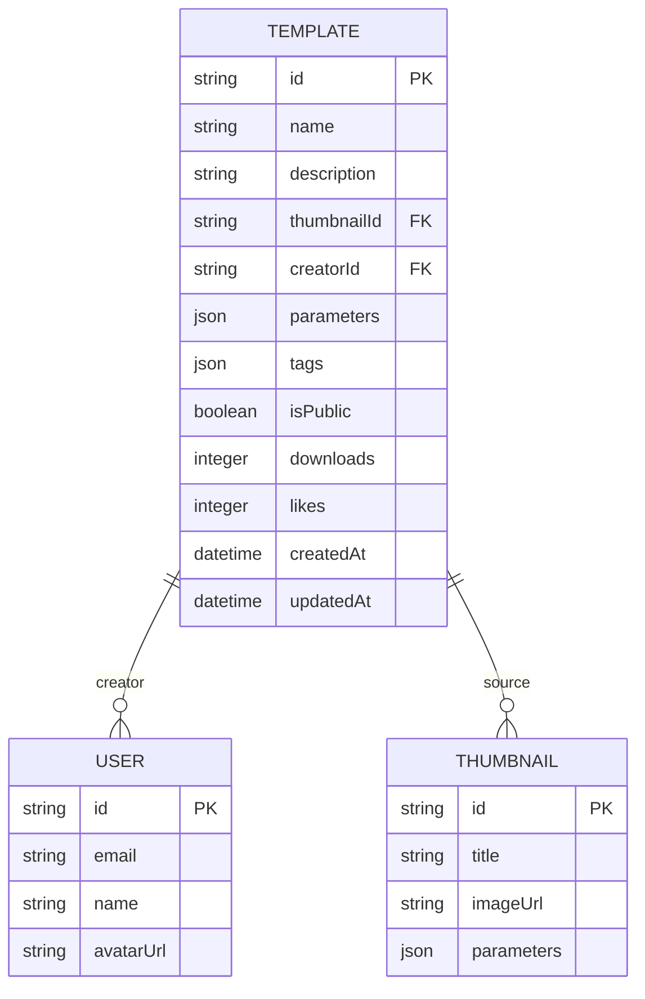
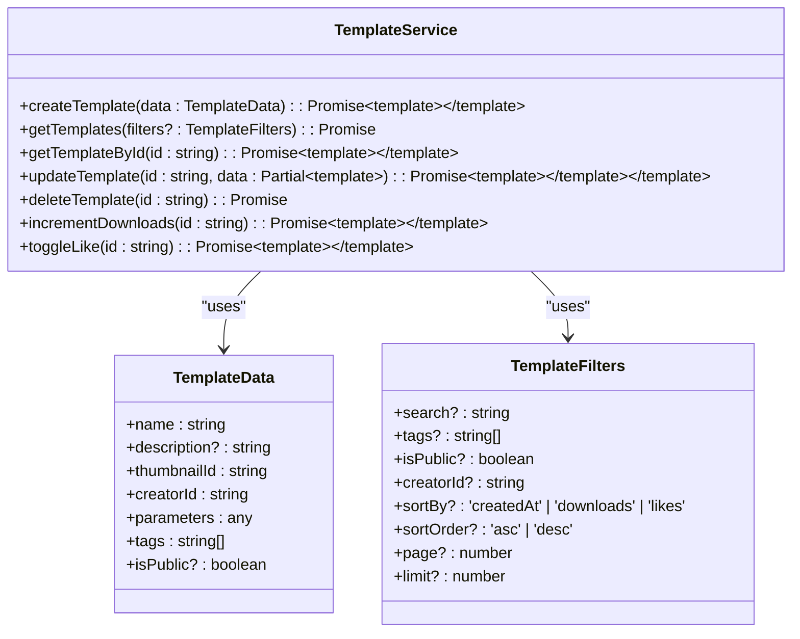
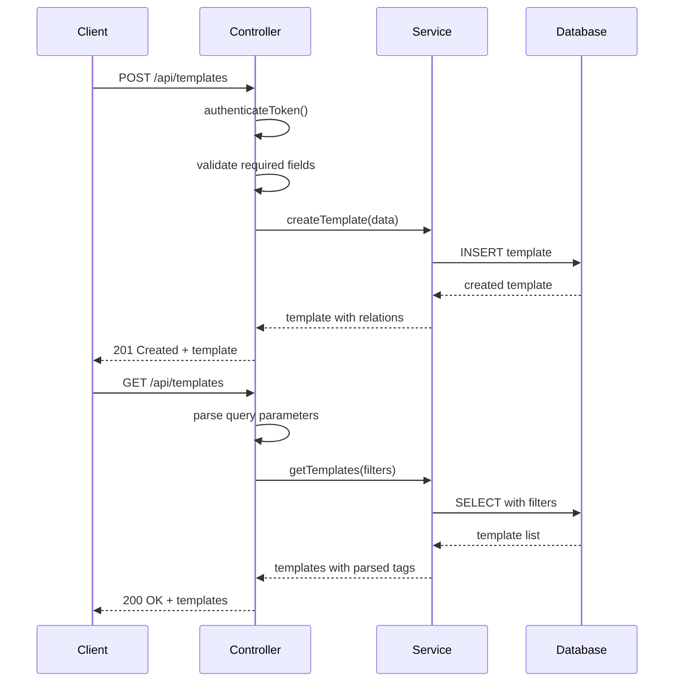
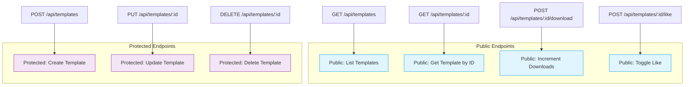
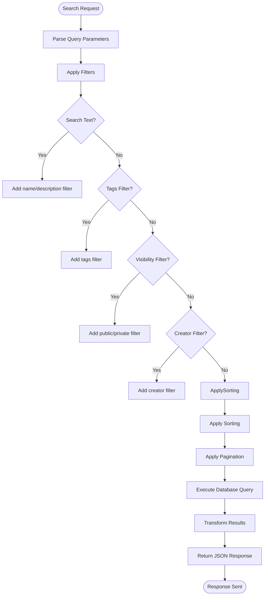

# Templates Module

<cite>
**Referenced Files in This Document**   
- [template.service.ts](file://pikzels-clone\src\modules\templates\template.service.ts)
- [template.controller.ts](file://pikzels-clone\src\modules\templates\template.controller.ts)
- [template.routes.ts](file://pikzels-clone\src\modules\templates\template.routes.ts)
- [migration.sql](file://pikzels-clone\prisma\migrations\20250829072650_init\migration.sql)
- [template-marketplace.md](file://pikzels-clone\docs\template-marketplace.md)
- [TemplateMarketplace.tsx](file://pikzels-clone\client\src\components\templates\TemplateMarketplace.tsx)
</cite>

## Table of Contents
1. [Introduction](#introduction)
2. [Data Model](#data-model)
3. [Template Service](#template-service)
4. [Template Controller](#template-controller)
5. [Route Definitions](#route-definitions)
6. [Marketplace Integration](#marketplace-integration)
7. [Template Versioning and Categories](#template-versioning-and-categories)
8. [Search Functionality](#search-functionality)
9. [Performance Optimization](#performance-optimization)
10. [Customization and Branding](#customization-and-branding)
11. [Extending Marketplace](#extending-marketplace)
12. [Common Issues](#common-issues)
13. [Conclusion](#conclusion)

## Introduction
The Templates Module provides a comprehensive system for managing thumbnail templates within the application. It enables users to create, share, and reuse template designs through a marketplace interface. The module consists of a backend service layer, controller logic, and API routes that support template operations including creation, retrieval, updating, and deletion. This documentation details the implementation of the template management system with a focus on the service, controller, and routing components.

**Section sources**
- [template.service.ts](file://pikzels-clone\src\modules\templates\template.service.ts#L1-L10)
- [template.controller.ts](file://pikzels-clone\src\modules\templates\template.controller.ts#L1-L10)
- [template.routes.ts](file://pikzels-clone\src\modules\templates\template.routes.ts#L1-L5)

## Data Model
The Template data model is designed to store reusable thumbnail configurations with associated metadata. Templates are linked to their source thumbnails and creators, enabling proper attribution and relationship management. Key fields include name, description, parameters, tags, and visibility settings. The model also tracks usage metrics such as download counts and likes to support marketplace functionality. Tags are stored as JSON arrays in the database and serialized/deserialized through the service layer. The data model supports both public and private templates, allowing creators to control visibility.

**Diagram sources**
- [migration.sql](file://pikzels-clone\prisma\migrations\20250829072650_init\migration.sql#L30-L50)
- [template-marketplace.md](file://pikzels-clone\docs\template-marketplace.md#L40-L80)

**Section sources**
- [migration.sql](file://pikzels-clone\prisma\migrations\20250829072650_init\migration.sql#L30-L50)
- [template-marketplace.md](file://pikzels-clone\docs\template-marketplace.md#L40-L80)

## Template Service
The TemplateService class provides the core business logic for template operations. It encapsulates all database interactions through Prisma ORM, offering methods for creating, retrieving, updating, and deleting templates. The service handles data transformation, particularly for tags which are stored as JSON strings in the database but exposed as arrays in the API. The getTemplates method supports comprehensive filtering by search terms, tags, creator, and visibility status, with sorting and pagination capabilities. The service also implements increment operations for tracking template downloads and likes, supporting marketplace engagement metrics.

**Diagram sources**
- [template.service.ts](file://pikzels-clone\src\modules\templates\template.service.ts#L4-L218)

**Section sources**
- [template.service.ts](file://pikzels-clone\src\modules\templates\template.service.ts#L4-L218)

## Template Controller
The template controller implements RESTful endpoints for template operations, handling HTTP requests and responses. It validates input data, manages authentication requirements, and orchestrates calls to the TemplateService. Protected routes require authentication middleware to verify user identity before allowing template creation, modification, or deletion. The controller enforces ownership validation, ensuring users can only modify templates they created. Error handling is implemented consistently across all endpoints, with appropriate HTTP status codes and error messages. Request parameters and query strings are properly typed and validated to prevent malformed data from reaching the service layer.

**Diagram sources**
- [template.controller.ts](file://pikzels-clone\src\modules\templates\template.controller.ts#L9-L208)

**Section sources**
- [template.controller.ts](file://pikzels-clone\src\modules\templates\template.controller.ts#L9-L208)

## Route Definitions
The template routes are defined using Express Router, establishing the API endpoint structure for template operations. The routing configuration separates public and protected endpoints, applying authentication middleware only to operations that require user authorization. Public routes allow browsing templates and retrieving specific templates by ID, while protected routes handle creation, modification, and deletion. The route definitions follow RESTful conventions with appropriate HTTP methods mapped to controller functions. Special endpoints for incrementing download counts and toggling likes use POST requests to modify template engagement metrics.

**Diagram sources**
- [template.routes.ts](file://pikzels-clone\src\modules\templates\template.routes.ts#L1-L26)

**Section sources**
- [template.routes.ts](file://pikzels-clone\src\modules\templates\template.routes.ts#L1-L26)

## Marketplace Integration
The template marketplace integration enables community sharing of thumbnail designs through a structured API. Users can publish templates as public resources, making them discoverable by other users. The marketplace supports engagement features including download tracking and liking mechanisms to surface popular templates. Search and filtering capabilities allow users to find templates by keywords, tags, or creator. The integration includes proper attribution by linking templates to their creators with profile information. Usage statistics are maintained to highlight trending templates and reward popular creators.

**Section sources**
- [template.service.ts](file://pikzels-clone\src\modules\templates\template.service.ts#L182-L218)
- [template.controller.ts](file://pikzels-clone\src\modules\templates\template.controller.ts#L167-L208)
- [template-marketplace.md](file://pikzels-clone\docs\template-marketplace.md#L200-L300)

## Template Versioning and Categories
While the current implementation does not include explicit versioning, the data model supports future extension for template version management. Categories are implemented through the tags system, allowing templates to be classified and filtered by design characteristics, use cases, or content types. The tags field enables flexible categorization without requiring predefined category structures. Multiple tags can be assigned to a template, supporting multi-dimensional classification. The search functionality can filter by specific tags, enabling users to browse templates within particular categories.

**Section sources**
- [template.service.ts](file://pikzels-clone\src\modules\templates\template.service.ts#L60-L70)
- [template-marketplace.md](file://pikzels-clone\docs\template-marketplace.md#L350-L380)

## Search Functionality
The search functionality provides robust template discovery through multiple filtering dimensions. Users can search by text terms across template names and descriptions with case-insensitive matching. Tag-based filtering allows narrowing results to specific design characteristics or categories. The search supports combination filters, such as finding public templates with specific tags created by a particular user. Results are sortable by creation date, download count, or like count, enabling discovery of both new and popular templates. Pagination is implemented to handle large result sets efficiently.

**Diagram sources**
- [template.service.ts](file://pikzels-clone\src\modules\templates\template.service.ts#L45-L109)

**Section sources**
- [template.service.ts](file://pikzels-clone\src\modules\templates\template.service.ts#L45-L109)

## Performance Optimization
The template system includes several performance optimizations for high-concurrency access. Pagination limits result sets to a maximum of 100 items per page, preventing excessive database load. Database queries are optimized with proper indexing on frequently filtered fields such as creatorId, isPublic, and tags. The service layer minimizes database round-trips by including related data (thumbnail and creator) in single queries. JSON serialization and deserialization of tags is handled efficiently in memory. The API design separates read and write operations, allowing potential read scaling through caching or read replicas.

**Section sources**
- [template.service.ts](file://pikzels-clone\src\modules\templates\template.service.ts#L90-L100)
- [template-marketplace.md](file://pikzels-clone\docs\template-marketplace.md#L300-L320)

## Customization and Branding
The template system supports user customization through parameter inheritance and modification. When applying a template, users can adjust the parameters to suit their specific needs while preserving the core design. Template creators are properly attributed through the creator relationship, which includes name and avatar display. Public templates serve as portfolio pieces for creators, enhancing their visibility within the community. The system supports branding requirements by preserving creator attribution and allowing creators to include their branding elements within template designs.

**Section sources**
- [template.service.ts](file://pikzels-clone\src\modules\templates\template.service.ts#L30-L40)
- [template-marketplace.md](file://pikzels-clone\docs\template-marketplace.md#L150-L180)

## Extending Marketplace
The marketplace can be extended with new template categories by leveraging the existing tags system or by adding a dedicated category field to the data model. Premium content functionality could be implemented by adding a subscription check in the service layer or introducing a template tier field. Additional features like template ratings, collections, or advanced search could be added through new API endpoints and database fields. The modular architecture allows for incremental enhancement without disrupting existing functionality.

**Section sources**
- [template-marketplace.md](file://pikzels-clone\docs\template-marketplace.md#L320-L350)
- [template.service.ts](file://pikzels-clone\src\modules\templates\template.service.ts#L1-L10)

## Common Issues
Common issues in the template system include template rendering inconsistencies that may occur when applying parameters to different thumbnail dimensions. Upload validation failures typically result from missing required fields such as name, thumbnailId, or parameters. Permission errors occur when users attempt to modify templates they don't own. Search functionality may return unexpected results if tag filtering is not properly implemented with JSON array containment checks. Performance issues can arise with unbounded result sets, mitigated by the implemented pagination limits.

**Section sources**
- [template.controller.ts](file://pikzels-clone\src\modules\templates\template.controller.ts#L15-L40)
- [template.service.ts](file://pikzels-clone\src\modules\templates\template.service.ts#L60-L70)
- [template-marketplace.md](file://pikzels-clone\docs\template-marketplace.md#L380-L400)

## Conclusion
The Templates Module provides a robust foundation for template management and marketplace functionality. The separation of concerns between service, controller, and routing layers ensures maintainability and scalability. The data model supports essential features for template sharing and discovery, with extensibility for future enhancements. The implementation includes proper authentication, authorization, and error handling to ensure a reliable user experience. With its comprehensive API and flexible categorization system, the module effectively supports community-driven template sharing and reuse.