# Thumbnail Processing Module

<cite>
**Referenced Files in This Document**
- [thumbnail.routes.ts](file://pikzels-clone\src\modules\thumbnail\thumbnail.routes.ts)
- [thumbnail.public.routes.ts](file://pikzels-clone\src\modules\thumbnail\thumbnail.public.routes.ts)
- [thumbnail.controller.ts](file://pikzels-clone\src\modules\thumbnail\thumbnail.controller.ts)
- [thumbnail.service.ts](file://pikzels-clone\src\modules\thumbnail\thumbnail.service.ts)
- [image-processing.service.ts](file://pikzels-clone\src\modules\thumbnail\image-processing.service.ts)
- [openrouter-ai.service.ts](file://pikzels-clone\src\modules\thumbnail\openrouter-ai.service.ts)
- [replicate-ai.service.ts](file://pikzels-clone\src\modules\thumbnail\replicate-ai.service.ts)
- [replicate-queue.service.ts](file://pikzels-clone\src\modules\thumbnail\replicate-queue.service.ts)
- [ai-service-manager.ts](file://pikzels-clone\src\modules\thumbnail\ai-service-manager.ts)
- [ai-provider-load-balancer.ts](file://pikzels-clone\src\modules\thumbnail\ai-provider-load-balancer.ts)
- [ai-usage-example.ts](file://pikzels-clone\src\modules\thumbnail\ai-usage-example.ts)
- [comet-ai.service.ts](file://pikzels-clone\src\modules\thumbnail\comet-ai.service.ts)
- [zenmux-ai.service.ts](file://pikzels-clone\src\modules\thumbnail\zenmux-ai.service.ts)
- [ai.service.ts](file://pikzels-clone\src\modules\thumbnail\ai.service.ts)
- [video-proxy.service.ts](file://pikzels-clone\src\modules\video-proxy\video-proxy.service.ts)
- [video-proxy.controller.ts](file://pikzels-clone\src\modules\video-proxy\video-proxy.controller.ts)
- [video-proxy.routes.ts](file://pikzels-clone\src\modules\video-proxy\video-proxy.routes.ts)
- [video-service.ts](file://pikzels-clone\client\src\services\video\video-service.ts)
- [platforms.ts](file://pikzels-clone\client\src\services\video\platforms.ts)
- [replicate.provider.ts](file://pikzels-clone\client\src\services\ai-providers\replicate.provider.ts)
- [security.middleware.ts](file://pikzels-clone\src\middleware\security.middleware.ts)
- [event-emitter.ts](file://pikzels-clone\src\events\event-emitter.ts)
- [event-persistence.ts](file://pikzels-clone\src\events\event-persistence.ts)
- [server.ts](file://pikzels-clone\src\server.ts)
</cite>

## Update Summary
**Changes Made**
- **Enhanced AI Integration**: Added comprehensive Replicate AI service with computer vision capabilities for advanced image manipulation
- **New Replicate AI Service**: Implemented ReplicateAIService providing specialized models for segmentation, background removal, upscaling, and expansion
- **Queue Management System**: Added production-grade ReplicateQueueService using BullMQ for distributed job processing with Redis
- **Advanced Computer Vision Tools**: Integrated SAM 2 segmentation, interactive object selection, and image decomposition capabilities
- **Enhanced Controller Logic**: Updated thumbnail.controller.ts with 600+ new lines of Replicate-powered functionality
- **Multi-Provider AI Architecture**: Enhanced with Replicate as the primary provider for computer vision tasks alongside OpenRouter for general AI generation
- **Queue-Based Processing**: Implemented asynchronous job processing for Replicate operations with rate limiting and retry mechanisms

## Table of Contents
1. [Introduction](#introduction)
2. [Project Structure](#project-structure)
3. [Core Components](#core-components)
4. [Architecture Overview](#architecture-overview)
5. [Enhanced AI-Powered Workflow](#enhanced-ai-powered-workflow)
6. [Advanced AI Tool Integration](#advanced-ai-tool-integration)
7. [Replicate AI Service and Queue Management](#replicate-ai-service-and-queue-management)
8. [AI Provider Load Balancing](#ai-provider-load-balancing)
9. [Enhanced Video Processing Pipeline](#enhanced-video-processing-pipeline)
10. [Advanced Security Features](#advanced-security-features)
11. [AI Integration Enhancements](#ai-integration-enhancements)
12. [Detailed Component Analysis](#detailed-component-analysis)
13. [Performance Considerations](#performance-considerations)
14. [Troubleshooting Guide](#troubleshooting-guide)
15. [Conclusion](#conclusion)

## Introduction
The Thumbnail Processing Module provides a comprehensive solution for creating, editing, and enhancing thumbnails through both AI-powered and traditional image processing techniques. The module supports public and authenticated access patterns, batch editing capabilities, and integration with multiple AI services for advanced image generation and enhancement. Recent enhancements include improved video frame extraction integration, enhanced security features, new video proxy service integration for external video platform support, and comprehensive AI service integration featuring Replicate AI for computer vision tasks.

**Updated** The module now features sophisticated AI-powered capabilities with dual AI service architecture supporting both OpenRouter for general image generation and Replicate for specialized computer vision tasks. The Replicate AI service provides purpose-built models for segmentation, background removal, upscaling, and image expansion, while the queue management system ensures reliable processing of these computationally intensive operations.

The module now features sophisticated AI tool integration with specialized endpoints for advanced image manipulation tasks including object segmentation, interactive selection, layer decomposition, and canvas expansion. Each AI operation uses optimized models selected specifically for the task at hand, ensuring superior results for thumbnail creation and editing. The module includes an AI service manager that provides unified access to multiple AI providers with load balancing and failover capabilities, supporting OpenAI, CometAI, ZenMux, OpenRouter, and Replicate services.

The enhanced architecture now supports both synchronous and asynchronous processing patterns, with the queue system handling complex computer vision operations that require extended processing times while maintaining responsive user experiences.

## Project Structure
The thumbnail processing functionality is organized within the `src/modules/thumbnail` directory, with related AI enhancement services in `src/modules/ai` and new video proxy services in `src/modules/video-proxy`. The module follows a clean separation of concerns with distinct route, controller, service, and image processing layers. Enhanced security middleware provides comprehensive protection against web threats.

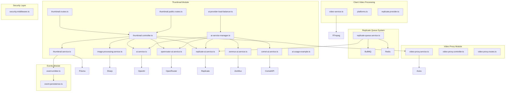

**Diagram sources**
- [thumbnail.routes.ts](file://pikzels-clone\src\modules\thumbnail\thumbnail.routes.ts)
- [thumbnail.public.routes.ts](file://pikzels-clone\src\modules\thumbnail\thumbnail.public.routes.ts)
- [thumbnail.controller.ts](file://pikzels-clone\src\modules\thumbnail\thumbnail.controller.ts)
- [replicate-queue.service.ts](file://pikzels-clone\src\modules\thumbnail\replicate-queue.service.ts)
- [replicate-ai.service.ts](file://pikzels-clone\src\modules\thumbnail\replicate-ai.service.ts)
- [video-proxy.service.ts](file://pikzels-clone\src\modules\video-proxy\video-proxy.service.ts)
- [video-proxy.controller.ts](file://pikzels-clone\src\modules\video-proxy\video-proxy.controller.ts)
- [video-proxy.routes.ts](file://pikzels-clone\src\modules\video-proxy\video-proxy.routes.ts)
- [video-service.ts](file://pikzels-clone\client\src\services\video\video-service.ts)
- [platforms.ts](file://pikzels-clone\client\src\services\video\platforms.ts)
- [replicate.provider.ts](file://pikzels-clone\client\src\services\ai-providers\replicate.provider.ts)
- [security.middleware.ts](file://pikzels-clone\src\middleware\security.middleware.ts)

**Section sources**
- [thumbnail.routes.ts](file://pikzels-clone\src\modules\thumbnail\thumbnail.routes.ts)
- [thumbnail.public.routes.ts](file://pikzels-clone\src\modules\thumbnail\thumbnail.public.routes.ts)
- [video-proxy.service.ts](file://pikzels-clone\src\modules\video-proxy\video-proxy.service.ts)
- [video-proxy.controller.ts](file://pikzels-clone\src\modules\video-proxy\video-proxy.controller.ts)
- [video-proxy.routes.ts](file://pikzels-clone\src\modules\video-proxy\video-proxy.routes.ts)

## Core Components
The Thumbnail Processing Module consists of several core components that work together to provide thumbnail creation, editing, and enhancement capabilities. The module implements a layered architecture with clear separation between API routes, controller logic, service orchestration, and image processing functionality. Key components include the route handlers that define API endpoints, controllers that manage request processing, services that coordinate business logic, and specialized image processing classes that handle the actual image manipulation.

**Updated** Enhanced with comprehensive AI tool integration featuring dual AI service architecture supporting both OpenRouter for general AI generation and Replicate for specialized computer vision tasks. The Replicate AI service provides purpose-built models for segmentation, background removal, upscaling, and image expansion, while the queue management system ensures reliable processing of these computationally intensive operations. The module now includes an AI service manager that provides unified access to multiple AI providers with load balancing and failover capabilities, supporting OpenAI, CometAI, ZenMux, OpenRouter, and Replicate services.

**Section sources**
- [thumbnail.controller.ts](file://pikzels-clone\src\modules\thumbnail\thumbnail.controller.ts)
- [thumbnail.service.ts](file://pikzels-clone\src\modules\thumbnail\thumbnail.service.ts)
- [image-processing.service.ts](file://pikzels-clone\src\modules\thumbnail\image-processing.service.ts)
- [openrouter-ai.service.ts](file://pikzels-clone\src\modules\thumbnail\openrouter-ai.service.ts)
- [replicate-ai.service.ts](file://pikzels-clone\src\modules\thumbnail\replicate-ai.service.ts)
- [ai-service-manager.ts](file://pikzels-clone\src\modules\thumbnail\ai-service-manager.ts)
- [video-proxy.service.ts](file://pikzels-clone\src\modules\video-proxy\video-proxy.service.ts)
- [security.middleware.ts](file://pikzels-clone\src\middleware\security.middleware.ts)

## Architecture Overview
The Thumbnail Processing Module follows a service-oriented architecture with clear separation between API routes, controller logic, business services, and image processing utilities. The architecture supports both authenticated and public access patterns, with authentication middleware protecting most endpoints while allowing public access to shared thumbnails. Enhanced security measures provide comprehensive protection against web vulnerabilities.

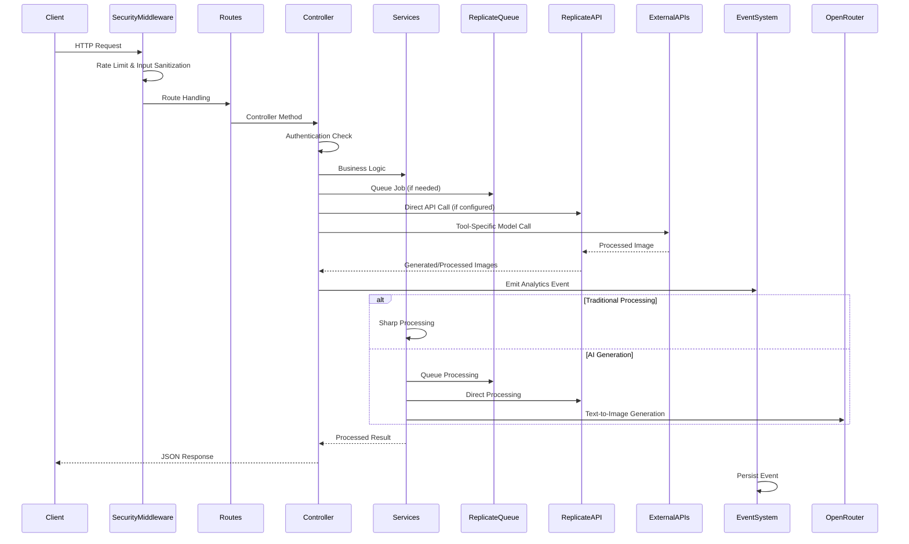

**Diagram sources**
- [thumbnail.routes.ts](file://pikzels-clone\src\modules\thumbnail\thumbnail.routes.ts)
- [thumbnail.controller.ts](file://pikzels-clone\src\modules\thumbnail\thumbnail.controller.ts)
- [replicate-queue.service.ts](file://pikzels-clone\src\modules\thumbnail\replicate-queue.service.ts)
- [replicate-ai.service.ts](file://pikzels-clone\src\modules\thumbnail\replicate-ai.service.ts)
- [video-proxy.service.ts](file://pikzels-clone\src\modules\video-proxy\video-proxy.service.ts)
- [openrouter-ai.service.ts](file://pikzels-clone\src\modules\thumbnail\openrouter-ai.service.ts)
- [security.middleware.ts](file://pikzels-clone\src\middleware\security.middleware.ts)
- [event-emitter.ts](file://pikzels-clone\src\events\event-emitter.ts)

## Enhanced AI-Powered Workflow
The module now includes comprehensive AI-powered capabilities through dual AI service architecture, providing specialized endpoints for advanced image manipulation tasks. Each AI endpoint uses optimized models selected specifically for the task, ensuring superior results for thumbnail creation and editing.

**Updated** Enhanced with Replicate AI service providing purpose-built models for computer vision tasks including segmentation, background removal, upscaling, and image expansion. The workflow now supports both synchronous and asynchronous processing patterns, with the queue system handling complex operations that require extended processing times.

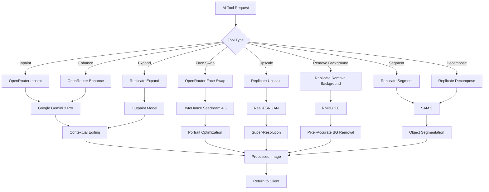

**Diagram sources**
- [thumbnail.controller.ts](file://pikzels-clone\src\modules\thumbnail\thumbnail.controller.ts)
- [replicate-ai.service.ts](file://pikzels-clone\src\modules\thumbnail\replicate-ai.service.ts)
- [openrouter-ai.service.ts](file://pikzels-clone\src\modules\thumbnail\openrouter-ai.service.ts)
- [thumbnail.routes.ts](file://pikzels-clone\src\modules\thumbnail\thumbnail.routes.ts)

**Section sources**
- [thumbnail.controller.ts](file://pikzels-clone\src\modules\thumbnail\thumbnail.controller.ts)
- [replicate-ai.service.ts](file://pikzels-clone\src\modules\thumbnail\replicate-ai.service.ts)
- [openrouter-ai.service.ts](file://pikzels-clone\src\modules\thumbnail\openrouter-ai.service.ts)
- [thumbnail.routes.ts](file://pikzels-clone\src\modules\thumbnail\thumbnail.routes.ts)

## Advanced AI Tool Integration
The module now provides specialized AI tools through dual AI service architecture, with Replicate handling computer vision tasks and OpenRouter managing general AI generation. The AI tools include inpainting for selective image editing, face swapping for identity replacement, upscaling for resolution enhancement, background removal for subject isolation, quality enhancement for image optimization, segmentation for object detection, decomposition for layer extraction, and expansion for canvas modification.

**Updated** Enhanced with comprehensive Replicate integration featuring purpose-built models for different computer vision tasks, providing superior results compared to traditional approaches. The Replicate service includes SAM 2 for object segmentation, RMBG 2.0 for background removal, Real-ESRGAN for super-resolution, and specialized outpainting models for canvas expansion.

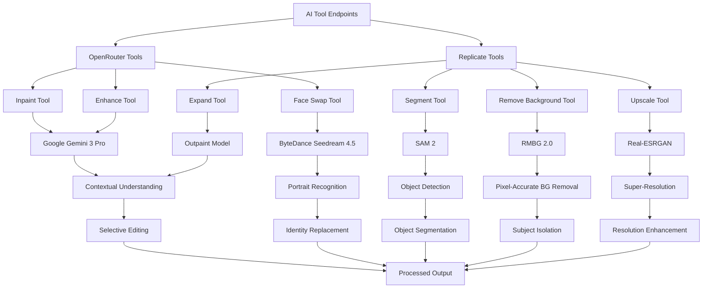

**Diagram sources**
- [thumbnail.controller.ts](file://pikzels-clone\src\modules\thumbnail\thumbnail.controller.ts)
- [replicate-ai.service.ts](file://pikzels-clone\src\modules\thumbnail\replicate-ai.service.ts)
- [openrouter-ai.service.ts](file://pikzels-clone\src\modules\thumbnail\openrouter-ai.service.ts)

**Section sources**
- [thumbnail.controller.ts](file://pikzels-clone\src\modules\thumbnail\thumbnail.controller.ts)
- [replicate-ai.service.ts](file://pikzels-clone\src\modules\thumbnail\replicate-ai.service.ts)
- [openrouter-ai.service.ts](file://pikzels-clone\src\modules\thumbnail\openrouter-ai.service.ts)

## Replicate AI Service and Queue Management
The module now includes a sophisticated Replicate AI service with computer vision capabilities and a production-grade queue management system. The Replicate AI service provides purpose-built models for segmentation, background removal, upscaling, and image expansion, while the queue system handles asynchronous processing with rate limiting and retry mechanisms.

**Updated** The Replicate AI service includes comprehensive error handling with exponential backoff, retry-After header parsing, and automatic failover mechanisms. The queue management system uses BullMQ with Redis for distributed job processing, providing scalability and reliability for computationally intensive operations.

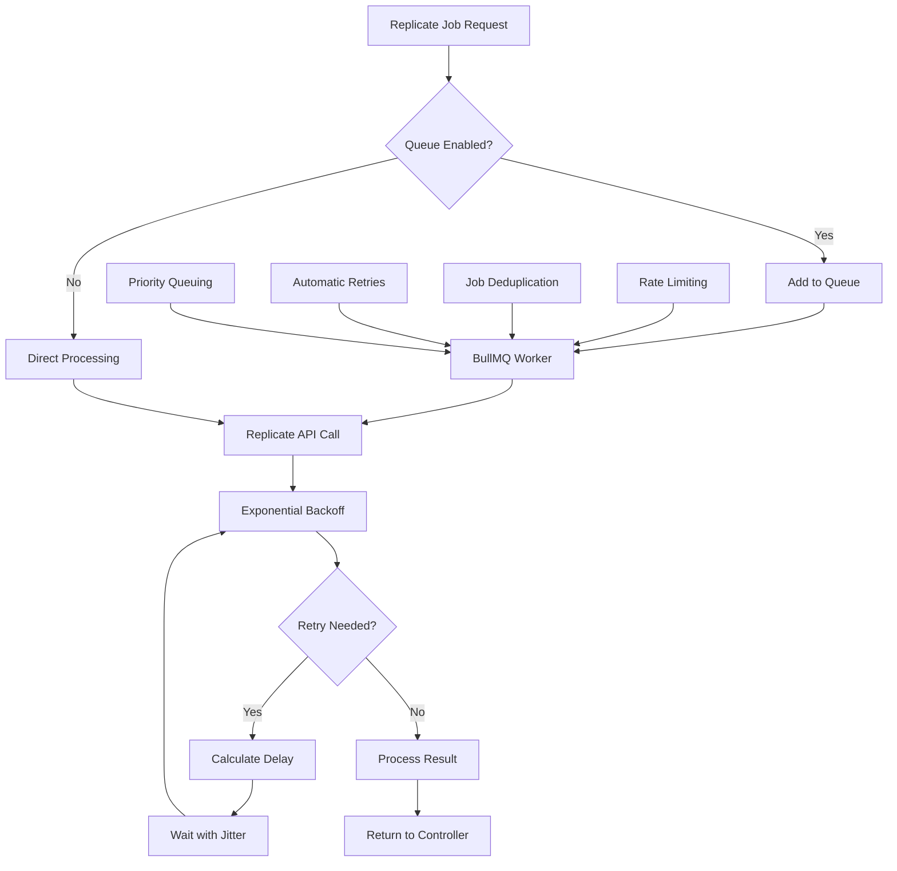

**Diagram sources**
- [replicate-queue.service.ts](file://pikzels-clone\src\modules\thumbnail\replicate-queue.service.ts)
- [replicate-ai.service.ts](file://pikzels-clone\src\modules\thumbnail\replicate-ai.service.ts)

**Section sources**
- [replicate-ai.service.ts](file://pikzels-clone\src\modules\thumbnail\replicate-ai.service.ts)
- [replicate-queue.service.ts](file://pikzels-clone\src\modules\thumbnail\replicate-queue.service.ts)
- [server.ts](file://pikzels-clone\src\server.ts)

## AI Provider Load Balancing
The module now includes a sophisticated AI provider load balancer that manages multiple AI services with automatic failover, rate limiting detection, and request queuing. This component ensures high availability and optimal performance when using multiple AI providers simultaneously.

**Updated** Enhanced with Replicate integration providing computer vision capabilities as the primary provider for specialized tasks, while OpenRouter handles general AI generation. The load balancer now supports priority-based routing and fallback mechanisms between providers.

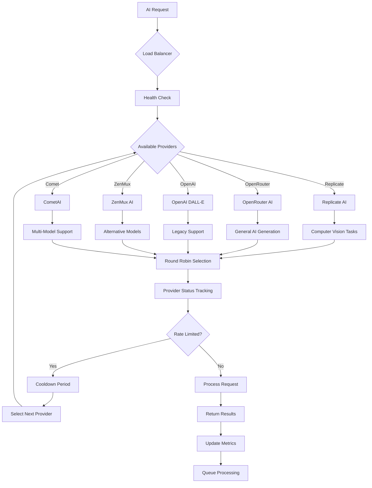

**Diagram sources**
- [ai-provider-load-balancer.ts](file://pikzels-clone\src\modules\thumbnail\ai-provider-load-balancer.ts)
- [ai-service-manager.ts](file://pikzels-clone\src\modules\thumbnail\ai-service-manager.ts)

**Section sources**
- [ai-provider-load-balancer.ts](file://pikzels-clone\src\modules\thumbnail\ai-provider-load-balancer.ts)
- [ai-service-manager.ts](file://pikzels-clone\src\modules\thumbnail\ai-service-manager.ts)

## Enhanced Video Processing Pipeline
The module now includes comprehensive video processing capabilities through the integration of a video proxy service and browser-based video processing. This enhancement enables users to generate thumbnails from social media videos by providing video URLs, with automatic platform detection and proxy handling.

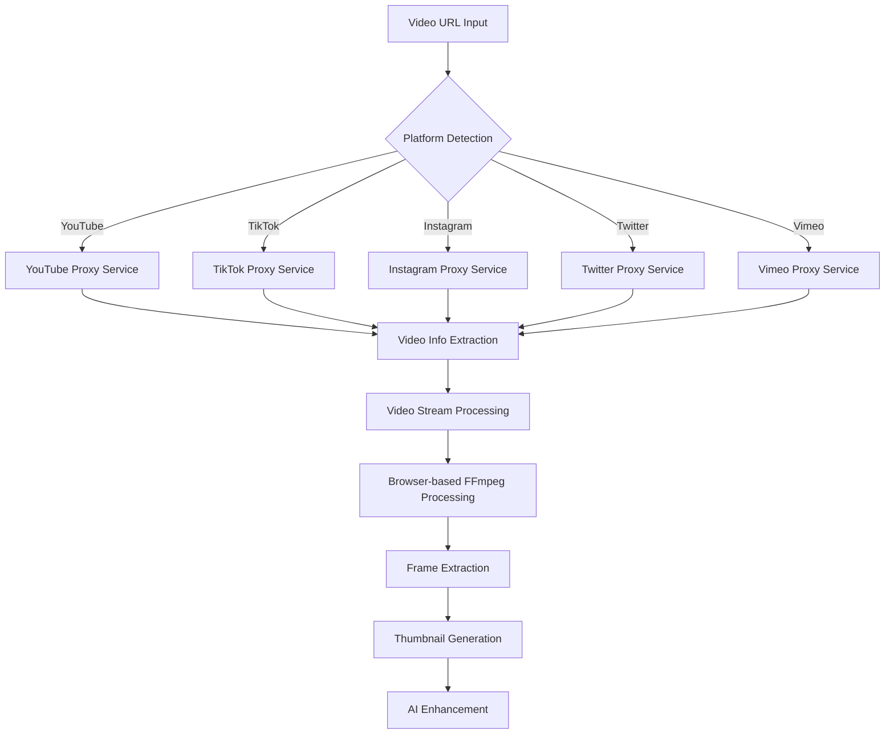

**Diagram sources**
- [video-proxy.service.ts](file://pikzels-clone\src\modules\video-proxy\video-proxy.service.ts)
- [video-proxy.controller.ts](file://pikzels-clone\src\modules\video-proxy\video-proxy.controller.ts)
- [video-service.ts](file://pikzels-clone\client\src\services\video\video-service.ts)
- [platforms.ts](file://pikzels-clone\client\src\services\video\platforms.ts)

**Section sources**
- [video-proxy.service.ts](file://pikzels-clone\src\modules\video-proxy\video-proxy.service.ts)
- [video-proxy.controller.ts](file://pikzels-clone\src\modules\video-proxy\video-proxy.controller.ts)
- [video-service.ts](file://pikzels-clone\client\src\services\video\video-service.ts)
- [platforms.ts](file://pikzels-clone\client\src\services\video\platforms.ts)

## Advanced Security Features
The module implements comprehensive security measures through enhanced middleware that provides protection against common web vulnerabilities. The security layer includes advanced rate limiting, input sanitization, HTTPS redirection, and request size limiting to ensure optimal protection while maintaining performance.

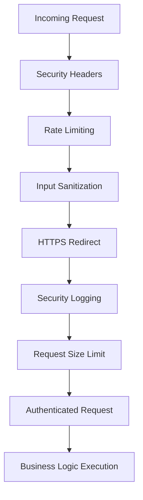

**Diagram sources**
- [security.middleware.ts](file://pikzels-clone\src\middleware\security.middleware.ts)

**Section sources**
- [security.middleware.ts](file://pikzels-clone\src\middleware\security.middleware.ts)

## AI Integration Enhancements
The module now supports multiple AI service providers through enhanced AI service integration. The primary AI service uses OpenRouter's multimodal API with specialized models for different tasks, while the legacy OpenAI service provides fallback capabilities. The ZenMux AI service provides alternative AI capabilities through the ZenMux platform supporting multiple models including Google Gemini and InclusionAI models.

**Updated** Enhanced with comprehensive dual AI service architecture featuring Replicate as the primary provider for computer vision tasks and OpenRouter for general AI generation. The Replicate service provides purpose-built models for segmentation, background removal, upscaling, and image expansion, while the queue management system ensures reliable processing of these computationally intensive operations.

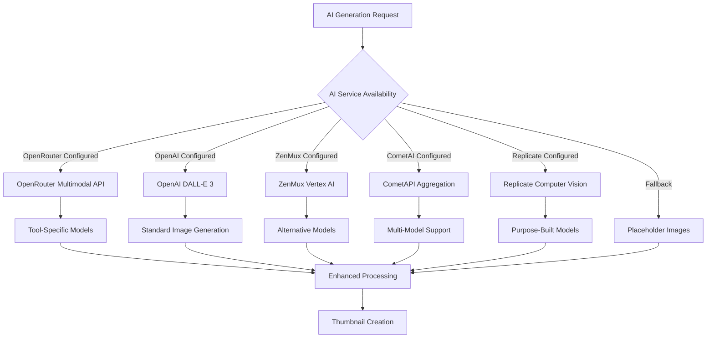

**Diagram sources**
- [openrouter-ai.service.ts](file://pikzels-clone\src\modules\thumbnail\openrouter-ai.service.ts)
- [replicate-ai.service.ts](file://pikzels-clone\src\modules\thumbnail\replicate-ai.service.ts)
- [ai-service-manager.ts](file://pikzels-clone\src\modules\thumbnail\ai-service-manager.ts)
- [ai-provider-load-balancer.ts](file://pikzels-clone\src\modules\thumbnail\ai-provider-load-balancer.ts)
- [comet-ai.service.ts](file://pikzels-clone\src\modules\thumbnail\comet-ai.service.ts)
- [zenmux-ai.service.ts](file://pikzels-clone\src\modules\thumbnail\zenmux-ai.service.ts)
- [ai.service.ts](file://pikzels-clone\src\modules\thumbnail\ai.service.ts)

**Section sources**
- [openrouter-ai.service.ts](file://pikzels-clone\src\modules\thumbnail\openrouter-ai.service.ts)
- [replicate-ai.service.ts](file://pikzels-clone\src\modules\thumbnail\replicate-ai.service.ts)
- [ai-service-manager.ts](file://pikzels-clone\src\modules\thumbnail\ai-service-manager.ts)
- [ai-provider-load-balancer.ts](file://pikzels-clone\src\modules\thumbnail\ai-provider-load-balancer.ts)
- [comet-ai.service.ts](file://pikzels-clone\src\modules\thumbnail\comet-ai.service.ts)
- [zenmux-ai.service.ts](file://pikzels-clone\src\modules\thumbnail\zenmux-ai.service.ts)
- [ai.service.ts](file://pikzels-clone\src\modules\thumbnail\ai.service.ts)

## Detailed Component Analysis

### API Routes and Authentication Separation
The module implements a clear separation between public and authenticated routes through two distinct route files. The `thumbnail.routes.ts` file defines authenticated endpoints that require JWT token verification, while `thumbnail.public.routes.ts` provides public access to shared thumbnails without authentication requirements. Enhanced security middleware protects all routes with comprehensive security measures.

**Updated** Enhanced with comprehensive AI tool routes that use dual AI service architecture, with Replicate handling computer vision tasks and OpenRouter managing general AI generation. The module now includes 12 new AI tool endpoints: `/api/thumbnails/ai/generate`, `/api/thumbnails/ai/inpaint`, `/api/thumbnails/ai/face-swap`, `/api/thumbnails/ai/upscale`, `/api/thumbnails/ai/remove-background`, `/api/thumbnails/ai/enhance`, `/api/thumbnails/ai/generate-text`, `/api/thumbnails/ai/segment`, `/api/thumbnails/ai/decompose`, and `/api/thumbnails/ai/expand`.

```mermaid
graph TD
AuthRoutes --> |JWT Authentication| CreateThumbnail
AuthRoutes --> |JWT Authentication| UpdateThumbnail
AuthRoutes --> |JWT Authentication| DeleteThumbnail
AuthRoutes --> |JWT Authentication| GenerateThumbnail
AuthRoutes --> |JWT Authentication| ApplyEdits
AuthRoutes --> |JWT Authentication| ApplyStyleTransfer
AuthRoutes --> |JWT Authentication| ApplyImageEnhancement
AuthRoutes --> |JWT Authentication| AIInpaint
AuthRoutes --> |JWT Authentication| AIFaceSwap
AuthRoutes --> |JWT Authentication| AIUpscale
AuthRoutes --> |JWT Authentication| AIRemoveBackground
AuthRoutes --> |JWT Authentication| AIEnhance
AuthRoutes --> |JWT Authentication| AIGenerateText
AuthRoutes --> |JWT Authentication| AISegment
AuthRoutes --> |JWT Authentication| AIDecompose
AuthRoutes --> |JWT Authentication| AIExpand
AuthRoutes --> |JWT Authentication| GetAIToolModels
PublicRoutes --> |No Auth| AccessSharedThumbnail
SecurityMiddleware --> AuthRoutes
SecurityMiddleware --> PublicRoutes
```

**Diagram sources**
- [thumbnail.routes.ts](file://pikzels-clone\src\modules\thumbnail\thumbnail.routes.ts)
- [thumbnail.public.routes.ts](file://pikzels-clone\src\modules\thumbnail\thumbnail.public.routes.ts)
- [security.middleware.ts](file://pikzels-clone\src\middleware\security.middleware.ts)

**Section sources**
- [thumbnail.routes.ts](file://pikzels-clone\src\modules\thumbnail\thumbnail.routes.ts)
- [thumbnail.public.routes.ts](file://pikzels-clone\src\modules\thumbnail\thumbnail.public.routes.ts)
- [security.middleware.ts](file://pikzels-clone\src\middleware\security.middleware.ts)

### Controller Logic and Request Processing
The `thumbnail.controller.ts` file contains the core request processing logic for all thumbnail operations. Controllers handle input validation, authentication checks, error handling, and orchestration of service calls. Each controller method follows a consistent pattern of validating user authentication, checking input parameters, calling appropriate services, and returning structured responses.

**Updated** Enhanced with comprehensive AI tool endpoints featuring dual AI service architecture, each using optimized models for specific tasks including inpainting, face swapping, upscaling, background removal, quality enhancement, segmentation, decomposition, and expansion. The controller now includes 600+ new lines of Replicate-powered functionality with detailed error handling, analytics event emission, and credit management.

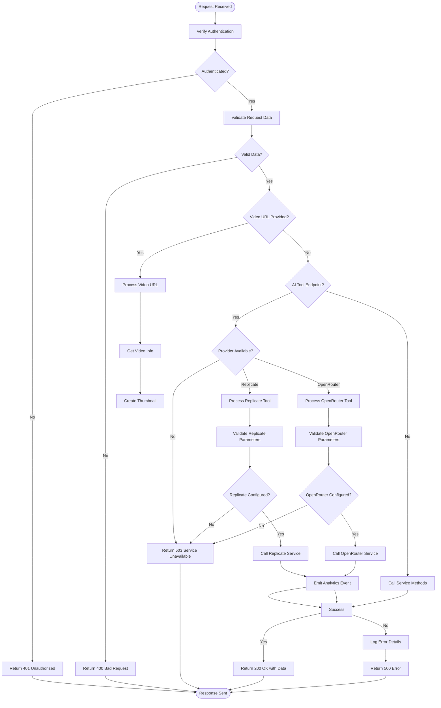

**Diagram sources**
- [thumbnail.controller.ts](file://pikzels-clone\src\modules\thumbnail\thumbnail.controller.ts)

**Section sources**
- [thumbnail.controller.ts](file://pikzels-clone\src\modules\thumbnail\thumbnail.controller.ts)

### Service Orchestration and Business Logic
The `thumbnail.service.ts` file implements the business logic for thumbnail management, including CRUD operations and project association. The service layer acts as an intermediary between the controller and data access layers, handling database operations through Prisma ORM while enforcing business rules and validation.

**Updated** Enhanced with event-driven architecture for analytics and monitoring, providing comprehensive tracking of thumbnail operations and user interactions. The service now integrates with dual AI service architecture through the AI service manager and load balancer. The service layer coordinates between multiple AI providers through the AI service manager and queue management system.

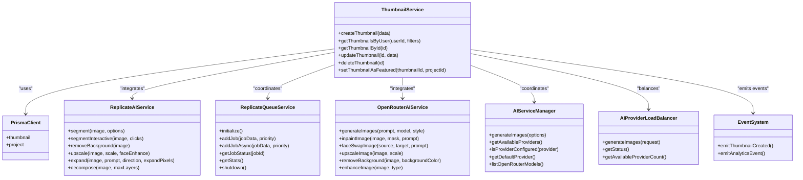

**Diagram sources**
- [thumbnail.service.ts](file://pikzels-clone\src\modules\thumbnail\thumbnail.service.ts)
- [replicate-ai.service.ts](file://pikzels-clone\src\modules\thumbnail\replicate-ai.service.ts)
- [replicate-queue.service.ts](file://pikzels-clone\src\modules\thumbnail\replicate-queue.service.ts)
- [openrouter-ai.service.ts](file://pikzels-clone\src\modules\thumbnail\openrouter-ai.service.ts)
- [ai-service-manager.ts](file://pikzels-clone\src\modules\thumbnail\ai-service-manager.ts)
- [ai-provider-load-balancer.ts](file://pikzels-clone\src\modules\thumbnail\ai-provider-load-balancer.ts)
- [event-emitter.ts](file://pikzels-clone\src\events\event-emitter.ts)

**Section sources**
- [thumbnail.service.ts](file://pikzels-clone\src\modules\thumbnail\thumbnail.service.ts)
- [replicate-ai.service.ts](file://pikzels-clone\src\modules\thumbnail\replicate-ai.service.ts)
- [replicate-queue.service.ts](file://pikzels-clone\src\modules\thumbnail\replicate-queue.service.ts)
- [openrouter-ai.service.ts](file://pikzels-clone\src\modules\thumbnail\openrouter-ai.service.ts)
- [ai-service-manager.ts](file://pikzels-clone\src\modules\thumbnail\ai-service-manager.ts)
- [ai-provider-load-balancer.ts](file://pikzels-clone\src\modules\thumbnail\ai-provider-load-balancer.ts)
- [event-emitter.ts](file://pikzels-clone\src\events\event-emitter.ts)

### Image Processing Pipeline
The `image-processing.service.ts` file implements a comprehensive image manipulation pipeline using the Sharp library. The service supports various image transformations including resizing, cropping, color adjustments, and filter application. The processing pipeline is designed to handle both single and batch operations efficiently.

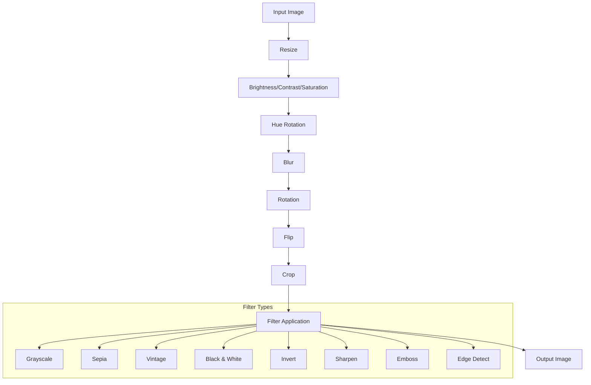

**Diagram sources**
- [image-processing.service.ts](file://pikzels-clone\src\modules\thumbnail\image-processing.service.ts)

**Section sources**
- [image-processing.service.ts](file://pikzels-clone\src\modules\thumbnail\image-processing.service.ts)

### AI Integration and Enhancement
The module now includes enhanced AI integration with support for multiple AI service providers. The new `replicate-ai.service.ts` provides comprehensive Replicate integration with specialized models for different computer vision tasks, while the legacy `ai.service.ts` offers OpenAI DALL-E 3 integration. The `zenmux-ai.service.ts` offers alternative AI capabilities through the ZenMux platform supporting multiple image generation models, and `comet-ai.service.ts` provides multi-model support through the CometAPI aggregation platform.

**Updated** Enhanced with comprehensive dual AI service architecture featuring Replicate as the primary provider for computer vision tasks and OpenRouter for general AI generation. The Replicate service includes purpose-built models for segmentation, background removal, upscaling, and image expansion, while the queue management system ensures reliable processing of these computationally intensive operations.

```mermaid
graph TD
AIS[AIService] --> |OpenAI API| DALLE3[DALL-E 3]
ORAIS[OpenRouterAIService] --> |OpenRouter API| ToolModels[Tool-Specific Models]
RAIS[ReplicateAIService] --> |Replicate API| CVModels[Computer Vision Models]
ZAIS[ZenmuxAIService] --> |ZenMux Vertex AI| Gemini[Google Gemini]
COMET[CometAIService] --> |CometAPI Aggregation| MultiModels[Multi-Model Support]
RAIS --> |Purpose-Built Models| Segment[SAM 2]
RAIS --> |Purpose-Built Models| RemoveBG[RMBG 2.0]
RAIS --> |Purpose-Built Models| Upscale[Real-ESRGAN]
RAIS --> |Purpose-Built Models| Expand[Outpaint Model]
ORAIS --> |Specialized Models| Inpaint[Inpaint Model]
ORAIS --> |Specialized Models| FaceSwap[Face Swap Model]
ORAIS --> |Specialized Models| Enhance[Quality Model]
AIS --> |Fallback| Placeholder[Placeholder Images]
ZAIS --> |Fallback| Sharp[Sharp Processing]
COMET --> |Fallback| FLUX[FLUX Models]
Segment --> ObjectDetection[Object Detection]
RemoveBG --> SubjectIsolation[Subject Isolation]
Upscale --> SuperResolution[Super-Resolution]
Expand --> CanvasExpansion[Canvas Expansion]
Inpaint --> ContextualEditing[Contextual Editing]
FaceSwap --> PortraitOptimization[Portrait Optimization]
Enhance --> QualityImprovement[Quality Improvement]
subgraph "AI Generation"
AIS --> PromptEngineering
PromptEngineering --> StyleMapping
StyleMapping --> APIRequest
APIRequest --> DALLE3
end
subgraph "AI Enhancement"
ORAIS --> ModelSelection
ModelSelection --> StyleTransformation
StyleTransformation --> ImageGeneration
end
```

**Diagram sources**
- [ai-service-manager.ts](file://pikzels-clone\src\modules\thumbnail\ai-service-manager.ts)
- [replicate-ai.service.ts](file://pikzels-clone\src\modules\thumbnail\replicate-ai.service.ts)
- [openrouter-ai.service.ts](file://pikzels-clone\src\modules\thumbnail\openrouter-ai.service.ts)
- [ai-provider-load-balancer.ts](file://pikzels-clone\src\modules\thumbnail\ai-provider-load-balancer.ts)
- [comet-ai.service.ts](file://pikzels-clone\src\modules\thumbnail\comet-ai.service.ts)
- [zenmux-ai.service.ts](file://pikzels-clone\src\modules\thumbnail\zenmux-ai.service.ts)
- [ai.service.ts](file://pikzels-clone\src\modules\thumbnail\ai.service.ts)

**Section sources**
- [ai-service-manager.ts](file://pikzels-clone\src\modules\thumbnail\ai-service-manager.ts)
- [replicate-ai.service.ts](file://pikzels-clone\src\modules\thumbnail\replicate-ai.service.ts)
- [openrouter-ai.service.ts](file://pikzels-clone\src\modules\thumbnail\openrouter-ai.service.ts)
- [ai-provider-load-balancer.ts](file://pikzels-clone\src\modules\thumbnail\ai-provider-load-balancer.ts)
- [comet-ai.service.ts](file://pikzels-clone\src\modules\thumbnail\comet-ai.service.ts)
- [zenmux-ai.service.ts](file://pikzels-clone\src\modules\thumbnail\zenmux-ai.service.ts)
- [ai.service.ts](file://pikzels-clone\src\modules\thumbnail\ai.service.ts)

### Video Proxy Service Integration
The new video proxy service provides seamless integration with external video platforms, enabling users to generate thumbnails from social media videos without CORS restrictions. The service supports multiple platforms including YouTube, TikTok, Instagram, Twitter, and Vimeo.

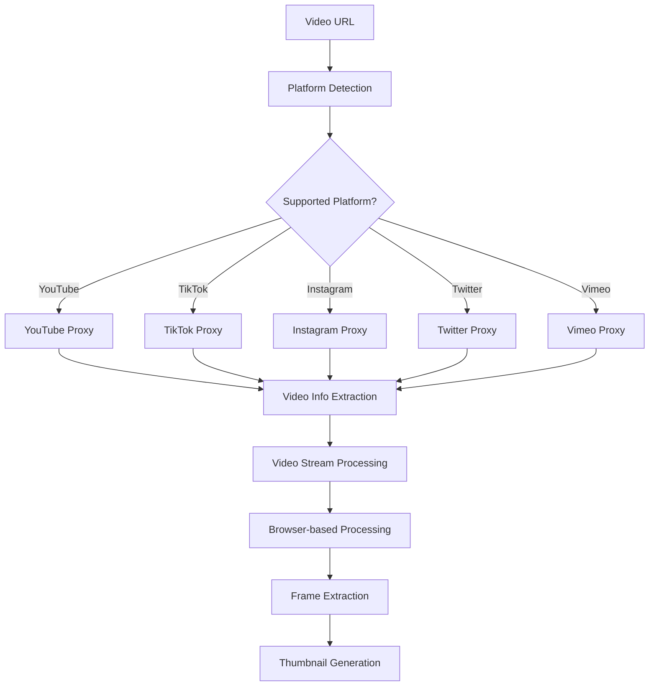

**Diagram sources**
- [video-proxy.service.ts](file://pikzels-clone\src\modules\video-proxy\video-proxy.service.ts)
- [video-proxy.controller.ts](file://pikzels-clone\src\modules\video-proxy\video-proxy.controller.ts)

**Section sources**
- [video-proxy.service.ts](file://pikzels-clone\src\modules\video-proxy\video-proxy.service.ts)
- [video-proxy.controller.ts](file://pikzels-clone\src\modules\video-proxy\video-proxy.controller.ts)
- [video-proxy.routes.ts](file://pikzels-clone\src\modules\video-proxy\video-proxy.routes.ts)

## Performance Considerations
The module implements several performance optimizations to handle image processing efficiently. Image processing operations are designed to be memory-efficient by streaming data through the Sharp pipeline without loading entire images into memory. The AI services include error handling and fallback mechanisms to maintain functionality when external APIs are unavailable or rate-limited.

**Updated** Enhanced with Replicate queue management system featuring production-grade distributed processing with Redis-backed job queuing, rate limiting, and automatic retries. The queue system handles computationally intensive operations that exceed typical timeout limits, while the dual AI service architecture optimizes resource utilization by routing tasks to the most appropriate provider.

For batch operations, the module processes images sequentially to avoid overwhelming system resources, with error handling that allows partial success when some images in a batch fail to process. The service layer implements efficient database queries with proper indexing and filtering to minimize response times for thumbnail retrieval operations.

The enhanced security middleware provides rate limiting and request size limiting to prevent abuse while maintaining optimal performance. The event-driven architecture enhances performance by decoupling analytics processing from the main request flow, reducing response times and improving system responsiveness.

The AI provider load balancer includes comprehensive performance monitoring with metrics for provider health, response times, and queue management. The load balancer automatically distributes requests across available providers based on configurable strategies including round-robin, least-loaded, fastest, weighted, and failover-only modes.

The Replicate queue system provides horizontal scalability through distributed workers, automatic job deduplication, and priority-based processing. The queue system includes comprehensive monitoring with Redis-backed statistics for waiting, active, completed, failed, and delayed job counts.

**Section sources**
- [image-processing.service.ts](file://pikzels-clone\src\modules\thumbnail\image-processing.service.ts)
- [replicate-ai.service.ts](file://pikzels-clone\src\modules\thumbnail\replicate-ai.service.ts)
- [replicate-queue.service.ts](file://pikzels-clone\src\modules\thumbnail\replicate-queue.service.ts)
- [thumbnail.service.ts](file://pikzels-clone\src\modules\thumbnail\thumbnail.service.ts)
- [video-proxy.service.ts](file://pikzels-clone\src\modules\video-proxy\video-proxy.service.ts)
- [security.middleware.ts](file://pikzels-clone\src\middleware\security.middleware.ts)
- [event-emitter.ts](file://pikzels-clone\src\events\event-emitter.ts)
- [ai-provider-load-balancer.ts](file://pikzels-clone\src\modules\thumbnail\ai-provider-load-balancer.ts)

## Troubleshooting Guide
The module includes comprehensive error handling across all components. Common issues include missing API keys for AI services, invalid image URLs, and processing failures due to corrupted image data. The system provides detailed error messages while avoiding exposure of sensitive information.

**Updated** Enhanced troubleshooting for dual AI service architecture including Replicate queue system issues, provider configuration problems, and computer vision task failures. The system now includes comprehensive logging for queue status, worker health, and job processing failures.

When AI services are unavailable, the system gracefully falls back to placeholder image generation. Image processing errors are logged with detailed context to aid in debugging, while maintaining application stability by preventing unhandled exceptions from crashing the server. For the event system, common issues include:

- **Event persistence failures**: Check that the `events-store` directory exists and has write permissions
- **Event replay issues**: Verify that event files are in the correct JSONL format
- **Storage full errors**: Monitor the size of the `events-store` directory and implement cleanup if needed
- **Event processing delays**: Check system resources and consider optimizing event handlers

For Replicate service issues:
- **API key configuration**: Verify REPLICATE_API_KEY environment variable is set correctly
- **Model availability**: Check that the selected Replicate model is available and supports the requested operation
- **Rate limiting**: Monitor Replicate API usage and implement retry logic for rate limit exceeded errors
- **Queue initialization**: Verify Redis connection and queue configuration for Replicate job processing
- **Worker health**: Check queue worker status and job processing logs

For dual AI service architecture issues:
- **Provider health monitoring**: Check provider status through load balancer status endpoint
- **Model configuration**: Use getAIToolModels endpoint to verify which models are configured for each tool
- **Credit management**: Verify credit deduction and refund mechanisms for AI operations
- **Fallback mechanisms**: Ensure proper fallback between Replicate and OpenRouter providers

For queue system issues:
- **Redis connectivity**: Verify Redis server is accessible and credentials are correct
- **Queue overflow**: Monitor queue size and adjust maxQueueSize configuration
- **Worker failures**: Check worker logs for job processing errors and retry mechanisms
- **Rate limit handling**: Configure appropriate rate limiting for Replicate API calls
- **Job deduplication**: Verify job ID generation and deduplication logic

For video processing issues:
- **Platform detection failures**: Verify URL format matches supported patterns
- **Proxy service errors**: Check platform-specific API availability and rate limits
- **Browser processing failures**: Ensure FFmpeg.wasm is properly loaded and initialized
- **Video stream timeouts**: Verify network connectivity and platform accessibility

For security-related issues:
- **Rate limit exceeded**: Check rate limiting configuration and adjust as needed
- **Input sanitization errors**: Review request data format and remove potentially malicious content
- **HTTPS redirect issues**: Verify SSL certificate configuration and environment settings

**Section sources**
- [thumbnail.controller.ts](file://pikzels-clone\src\modules\thumbnail\thumbnail.controller.ts)
- [replicate-ai.service.ts](file://pikzels-clone\src\modules\thumbnail\replicate-ai.service.ts)
- [replicate-queue.service.ts](file://pikzels-clone\src\modules\thumbnail\replicate-queue.service.ts)
- [openrouter-ai.service.ts](file://pikzels-clone\src\modules\thumbnail\openrouter-ai.service.ts)
- [ai-service-manager.ts](file://pikzels-clone\src\modules\thumbnail\ai-service-manager.ts)
- [ai-provider-load-balancer.ts](file://pikzels-clone\src\modules\thumbnail\ai-provider-load-balancer.ts)
- [image-processing.service.ts](file://pikzels-clone\src\modules\thumbnail\image-processing.service.ts)
- [video-proxy.service.ts](file://pikzels-clone\src\modules\video-proxy\video-proxy.service.ts)
- [security.middleware.ts](file://pikzels-clone\src\middleware\security.middleware.ts)
- [event-emitter.ts](file://pikzels-clone\src\events\event-emitter.ts)

## Conclusion
The Thumbnail Processing Module provides a robust and extensible solution for thumbnail creation and enhancement. The architecture supports both traditional image processing and AI-powered capabilities, with clear separation between public and authenticated access patterns. The module is designed for performance and reliability, with comprehensive error handling and fallback mechanisms to ensure consistent user experience even when external services are unavailable.

**Updated** The recent enhancements significantly expand the module's capabilities with comprehensive dual AI service architecture featuring Replicate AI for computer vision tasks and OpenRouter for general AI generation. The 12 new AI tool endpoints provide sophisticated capabilities including selective image editing, face swapping, resolution enhancement, background removal, quality optimization, object segmentation, layer decomposition, and canvas expansion. Each AI tool uses optimized models selected specifically for the task, ensuring superior results compared to traditional approaches.

The module's event-driven architecture and comprehensive error handling ensure reliable operation under various conditions, while the modular design allows for easy extension and customization of functionality. The dual AI service architecture provides enterprise-grade AI capabilities with configurable models, timeout handling, and comprehensive error management, making it suitable for production environments requiring high-quality image processing and manipulation.

The Replicate queue management system adds enterprise-grade reliability with automatic failover, rate limiting detection, and distributed job processing, ensuring optimal performance under high load conditions. The AI provider load balancer adds sophisticated routing and failover capabilities with intelligent provider selection algorithms and comprehensive monitoring.

The enhanced security measures and comprehensive troubleshooting guides ensure that developers can effectively deploy and maintain the module in production environments, while the extensive documentation and examples provide clear guidance for implementing custom AI tools and extensions. The module now supports five AI providers (OpenAI, CometAI, ZenMux, OpenRouter, Replicate) with sophisticated load balancing and failover capabilities, making it a comprehensive solution for modern thumbnail generation and enhancement needs.

The dual AI service architecture ensures that computer vision tasks are handled by purpose-built models optimized for those specific operations, while general AI generation continues to benefit from OpenRouter's multimodal capabilities. The queue management system provides scalable processing for computationally intensive operations, ensuring responsive user experiences even for complex image manipulation tasks.