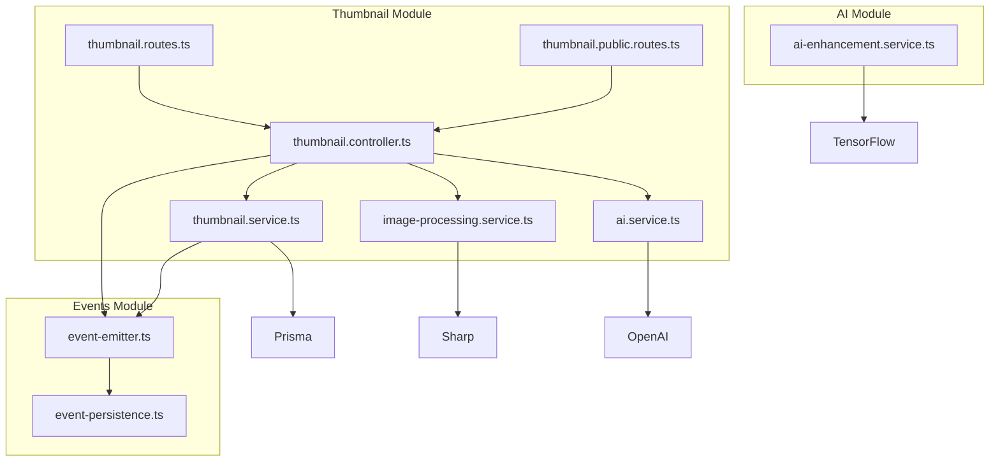
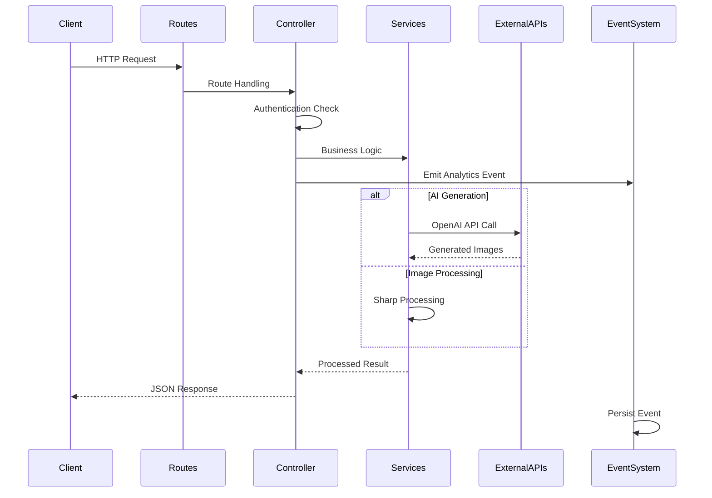
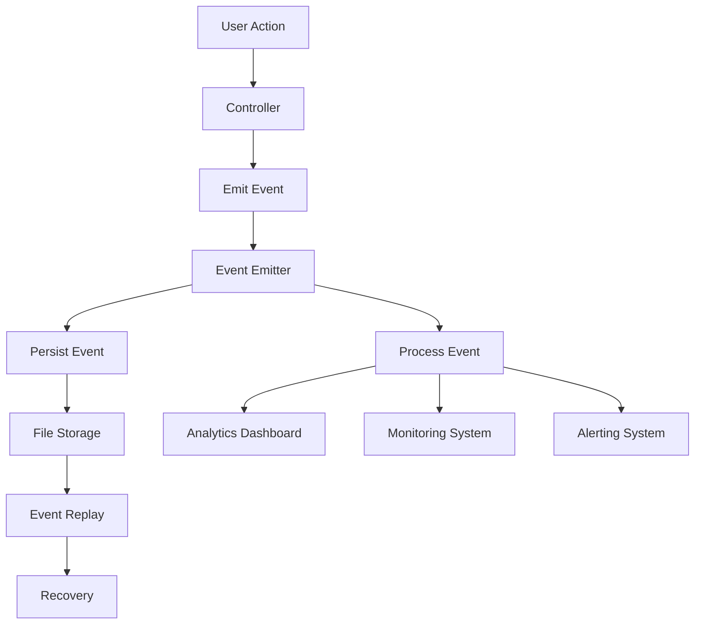
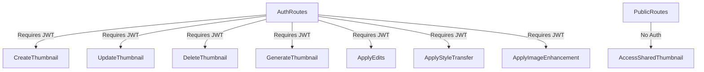
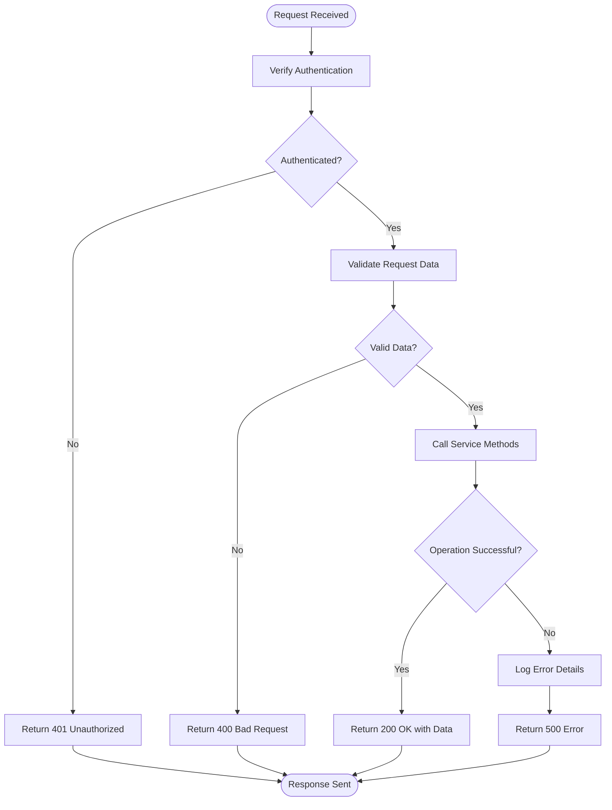
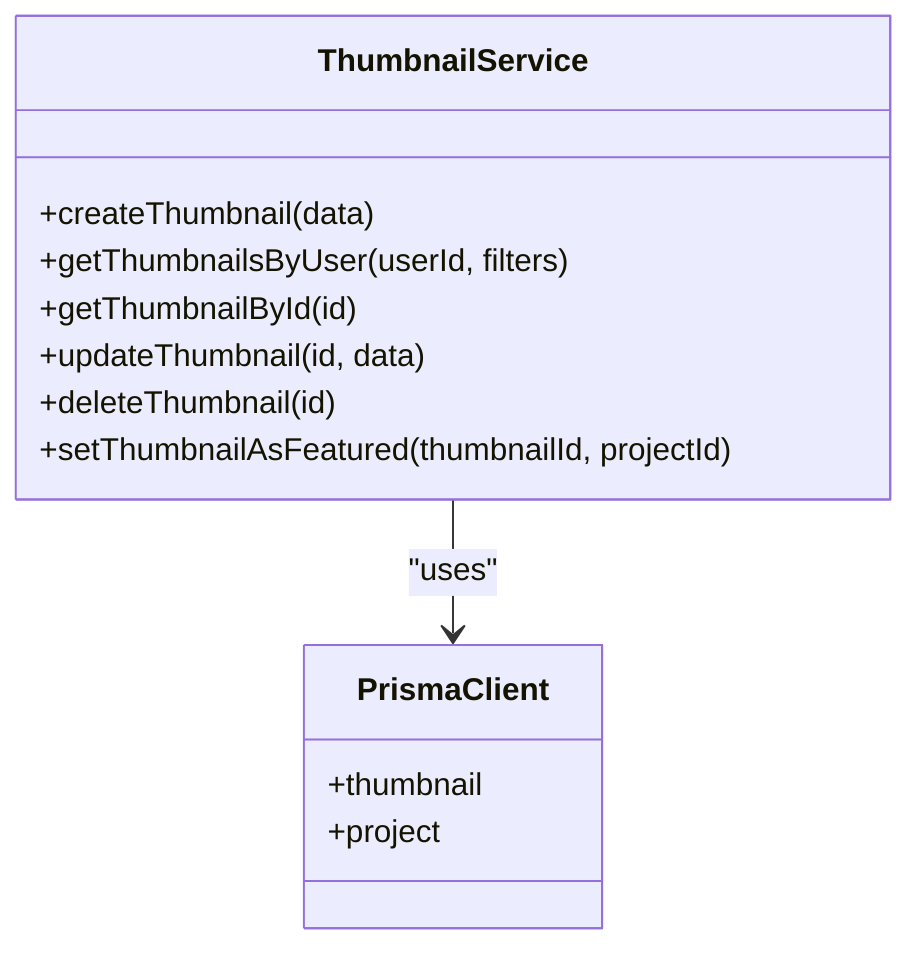
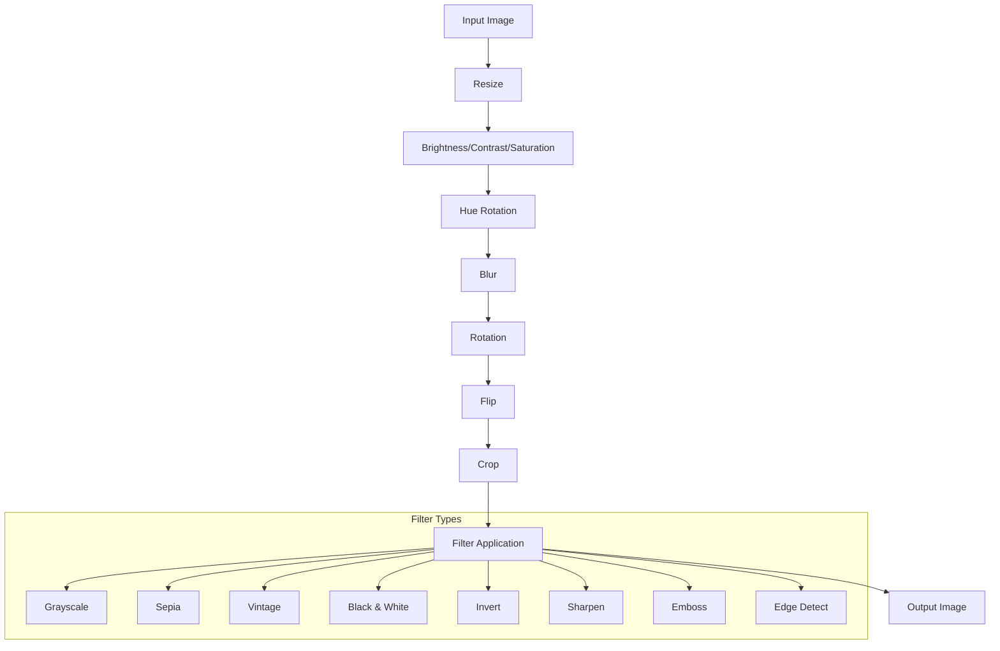
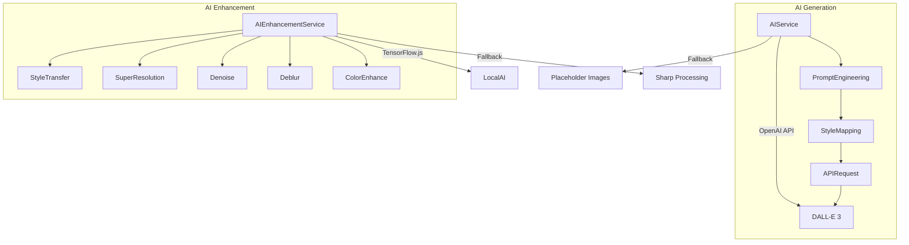
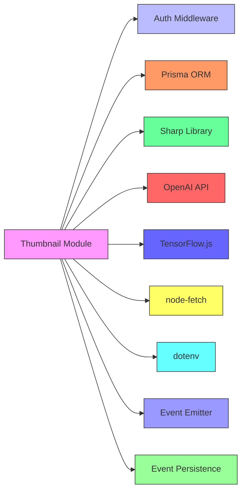

# Thumbnail Processing Module

<cite>
**Referenced Files in This Document**   
- [thumbnail.routes.ts](file://pikzels-clone\src\modules\thumbnail\thumbnail.routes.ts)
- [thumbnail.public.routes.ts](file://pikzels-clone\src\modules\thumbnail\thumbnail.public.routes.ts)
- [thumbnail.controller.ts](file://pikzels-clone\src\modules\thumbnail\thumbnail.controller.ts)
- [thumbnail.service.ts](file://pikzels-clone\src\modules\thumbnail\thumbnail.service.ts)
- [image-processing.service.ts](file://pikzels-clone\src\modules\thumbnail\image-processing.service.ts)
- [ai.service.ts](file://pikzels-clone\src\modules\thumbnail\ai.service.ts)
- [event-emitter.ts](file://pikzels-clone\src\events\event-emitter.ts) - *Updated in recent commit*
- [event-persistence.ts](file://pikzels-clone\src\events\event-persistence.ts) - *Updated in recent commit*
</cite>

## Update Summary
**Changes Made**   
- Updated architecture overview to include event-driven analytics system
- Added event-driven architecture section to document new analytics capabilities
- Enhanced dependency analysis to include event emitter and persistence services
- Updated performance considerations to reflect event-driven architecture benefits
- Added troubleshooting guidance for event system issues

## Table of Contents
1. [Introduction](#introduction)
2. [Project Structure](#project-structure)
3. [Core Components](#core-components)
4. [Architecture Overview](#architecture-overview)
5. [Event-Driven Architecture](#event-driven-architecture)
6. [Detailed Component Analysis](#detailed-component-analysis)
7. [Dependency Analysis](#dependency-analysis)
8. [Performance Considerations](#performance-considerations)
9. [Troubleshooting Guide](#troubleshooting-guide)
10. [Conclusion](#conclusion)

## Introduction
The Thumbnail Processing Module provides a comprehensive solution for creating, editing, and enhancing thumbnails through both AI-powered and traditional image processing techniques. The module supports public and authenticated access patterns, batch editing capabilities, and integration with AI services for advanced image generation and enhancement. This document details the complete workflow from API request to image creation and AI enhancement, covering controller logic, service orchestration, and extension points. Recent updates have enhanced the module with an event-driven architecture for analytics and monitoring.

## Project Structure
The thumbnail processing functionality is organized within the `src/modules/thumbnail` directory, with related AI enhancement services in `src/modules/ai`. The module follows a clean separation of concerns with distinct route, controller, service, and image processing layers. New event-driven analytics capabilities are implemented in the `src/events` directory.

**Diagram sources**
- [thumbnail.routes.ts](file://pikzels-clone\src\modules\thumbnail\thumbnail.routes.ts)
- [thumbnail.public.routes.ts](file://pikzels-clone\src\modules\thumbnail\thumbnail.public.routes.ts)
- [event-emitter.ts](file://pikzels-clone\src\events\event-emitter.ts)
- [event-persistence.ts](file://pikzels-clone\src\events\event-persistence.ts)
- [ai-enhancement.service.ts](file://pikzels-clone\src\modules\ai\ai-enhancement.service.ts)

**Section sources**
- [thumbnail.routes.ts](file://pikzels-clone\src\modules\thumbnail\thumbnail.routes.ts)
- [thumbnail.public.routes.ts](file://pikzels-clone\src\modules\thumbnail\thumbnail.public.routes.ts)

## Core Components
The Thumbnail Processing Module consists of several core components that work together to provide thumbnail creation, editing, and enhancement capabilities. The module implements a layered architecture with clear separation between routing, controller logic, service orchestration, and image processing functionality. Key components include the route handlers that define API endpoints, controllers that manage request processing, services that coordinate business logic, and specialized image processing classes that handle the actual image manipulation. The recent update introduces an event-driven architecture for analytics and monitoring.

**Section sources**
- [thumbnail.controller.ts](file://pikzels-clone\src\modules\thumbnail\thumbnail.controller.ts)
- [thumbnail.service.ts](file://pikzels-clone\src\modules\thumbnail\thumbnail.service.ts)
- [image-processing.service.ts](file://pikzels-clone\src\modules\thumbnail\image-processing.service.ts)

## Architecture Overview
The Thumbnail Processing Module follows a service-oriented architecture with clear separation between API routes, controller logic, business services, and image processing utilities. The architecture supports both authenticated and public access patterns, with authentication middleware protecting most endpoints while allowing public access to shared thumbnails. The recent update introduces an event-driven architecture for analytics and monitoring.

**Diagram sources**
- [thumbnail.routes.ts](file://pikzels-clone\src\modules\thumbnail\thumbnail.routes.ts)
- [thumbnail.controller.ts](file://pikzels-clone\src\modules\thumbnail\thumbnail.controller.ts)
- [ai.service.ts](file://pikzels-clone\src\modules\thumbnail\ai.service.ts)
- [event-emitter.ts](file://pikzels-clone\src\events\event-emitter.ts)

## Event-Driven Architecture
The module has been enhanced with an event-driven architecture for analytics and monitoring. This system captures key user interactions and system events, providing valuable insights into thumbnail usage patterns and system performance.

**Diagram sources**
- [event-emitter.ts](file://pikzels-clone\src\events\event-emitter.ts)
- [event-persistence.ts](file://pikzels-clone\src\events\event-persistence.ts)

**Section sources**
- [event-emitter.ts](file://pikzels-clone\src\events\event-emitter.ts)
- [event-persistence.ts](file://pikzels-clone\src\events\event-persistence.ts)

### Event Types and Structure
The event system supports several key event types that capture important user interactions:

- **thumbnail.created**: Emitted when a new thumbnail is created
- **thumbnail.updated**: Emitted when a thumbnail is modified
- **thumbnail.deleted**: Emitted when a thumbnail is removed
- **thumbnail_featured**: Emitted when a thumbnail is set as featured
- **analytics.track**: Generic analytics event for tracking user actions
- **social.share.requested**: Emitted when a social share is requested

Each event follows a consistent structure with the following properties:
- `id`: Unique identifier for the event
- `type`: Type of event (e.g., "thumbnail.created")
- `timestamp`: When the event occurred
- `userId`: ID of the user who triggered the event
- `data`: Event-specific data (e.g., thumbnail ID, project ID)
- `metadata`: Additional context about the event

### Event Persistence and Reliability
The event system includes persistence capabilities to ensure reliability and data durability. Events are stored in JSONL (JSON Lines) format in the `events-store` directory, with automatic file rotation when files reach 10MB in size. This approach provides several benefits:

- **Reliability**: Events are persisted to disk, preventing data loss during system restarts
- **Replay capability**: Events can be replayed for recovery or debugging purposes
- **Scalability**: File-based storage avoids dependency on external databases
- **Debugging**: Human-readable JSON format makes events easy to inspect

The persistence system supports several operations:
- **Event replay**: Retrieve and replay events from a specific time period
- **Export/import**: Export events to JSON files for backup or analysis
- **Storage statistics**: Monitor event storage usage and performance
- **Cleanup**: Remove old events to manage storage space

## Detailed Component Analysis

### API Routes and Authentication Separation
The module implements a clear separation between public and authenticated routes through two distinct route files. The `thumbnail.routes.ts` file defines authenticated endpoints that require JWT token verification, while `thumbnail.public.routes.ts` provides public access to shared thumbnails without authentication requirements.

**Diagram sources**
- [thumbnail.routes.ts](file://pikzels-clone\src\modules\thumbnail\thumbnail.routes.ts)
- [thumbnail.public.routes.ts](file://pikzels-clone\src\modules\thumbnail\thumbnail.public.routes.ts)

**Section sources**
- [thumbnail.routes.ts](file://pikzels-clone\src\modules\thumbnail\thumbnail.routes.ts)
- [thumbnail.public.routes.ts](file://pikzels-clone\src\modules\thumbnail\thumbnail.public.routes.ts)

### Controller Logic and Request Processing
The `thumbnail.controller.ts` file contains the core request processing logic for all thumbnail operations. Controllers handle input validation, authentication checks, error handling, and orchestration of service calls. Each controller method follows a consistent pattern of validating user authentication, checking input parameters, calling appropriate services, and returning structured responses.

**Diagram sources**
- [thumbnail.controller.ts](file://pikzels-clone\src\modules\thumbnail\thumbnail.controller.ts)

**Section sources**
- [thumbnail.controller.ts](file://pikzels-clone\src\modules\thumbnail\thumbnail.controller.ts)

### Service Orchestration and Business Logic
The `thumbnail.service.ts` file implements the business logic for thumbnail management, including CRUD operations and project association. The service layer acts as an intermediary between the controller and data access layers, handling database operations through Prisma ORM while enforcing business rules and validation.

**Diagram sources**
- [thumbnail.service.ts](file://pikzels-clone\src\modules\thumbnail\thumbnail.service.ts)

**Section sources**
- [thumbnail.service.ts](file://pikzels-clone\src\modules\thumbnail\thumbnail.service.ts)

### Image Processing Pipeline
The `image-processing.service.ts` file implements a comprehensive image manipulation pipeline using the Sharp library. The service supports various image transformations including resizing, cropping, color adjustments, and filter application. The processing pipeline is designed to handle both single and batch operations efficiently.

**Diagram sources**
- [image-processing.service.ts](file://pikzels-clone\src\modules\thumbnail\image-processing.service.ts)

**Section sources**
- [image-processing.service.ts](file://pikzels-clone\src\modules\thumbnail\image-processing.service.ts)

### AI Integration and Enhancement
The `ai.service.ts` file provides integration with OpenAI's DALL-E 3 API for AI-generated thumbnails, while `ai-enhancement.service.ts` offers local AI-powered image enhancements using TensorFlow.js. These services enable both cloud-based and local AI processing capabilities, with fallback mechanisms for when external services are unavailable.

**Diagram sources**
- [ai.service.ts](file://pikzels-clone\src\modules\thumbnail\ai.service.ts)
- [ai-enhancement.service.ts](file://pikzels-clone\src\modules\ai\ai-enhancement.service.ts)

**Section sources**
- [ai.service.ts](file://pikzels-clone\src\modules\thumbnail\ai.service.ts)
- [ai-enhancement.service.ts](file://pikzels-clone\src\modules\ai\ai-enhancement.service.ts)

## Dependency Analysis
The Thumbnail Processing Module has well-defined dependencies on both internal and external services. The module depends on authentication middleware for access control, Prisma ORM for data persistence, and external AI services for advanced image generation capabilities. The recent update adds dependencies on the event-driven architecture components.

**Diagram sources**
- [thumbnail.controller.ts](file://pikzels-clone\src\modules\thumbnail\thumbnail.controller.ts)
- [ai.service.ts](file://pikzels-clone\src\modules\thumbnail\ai.service.ts)
- [ai-enhancement.service.ts](file://pikzels-clone\src\modules\ai\ai-enhancement.service.ts)
- [event-emitter.ts](file://pikzels-clone\src\events\event-emitter.ts)
- [event-persistence.ts](file://pikzels-clone\src\events\event-persistence.ts)

**Section sources**
- [thumbnail.controller.ts](file://pikzels-clone\src\modules\thumbnail\thumbnail.controller.ts)
- [ai.service.ts](file://pikzels-clone\src\modules\thumbnail\ai.service.ts)
- [ai-enhancement.service.ts](file://pikzels-clone\src\modules\ai\ai-enhancement.service.ts)
- [event-emitter.ts](file://pikzels-clone\src\events\event-emitter.ts)
- [event-persistence.ts](file://pikzels-clone\src\events\event-persistence.ts)

## Performance Considerations
The module implements several performance optimizations to handle image processing efficiently. Image processing operations are designed to be memory-efficient by streaming data through the Sharp pipeline without loading entire images into memory. The AI services include error handling and fallback mechanisms to maintain functionality when external APIs are unavailable or rate-limited.

For batch operations, the module processes images sequentially to avoid overwhelming system resources, with error handling that allows partial success when some images in a batch fail to process. The service layer implements efficient database queries with proper indexing and filtering to minimize response times for thumbnail retrieval operations. The event-driven architecture enhances performance by decoupling analytics processing from the main request flow, reducing response times and improving system responsiveness.

**Section sources**
- [image-processing.service.ts](file://pikzels-clone\src\modules\thumbnail\image-processing.service.ts)
- [ai.service.ts](file://pikzels-clone\src\modules\thumbnail\ai.service.ts)
- [thumbnail.service.ts](file://pikzels-clone\src\modules\thumbnail\thumbnail.service.ts)
- [event-emitter.ts](file://pikzels-clone\src\events\event-emitter.ts)

## Troubleshooting Guide
The module includes comprehensive error handling across all components. Common issues include missing API keys for AI services, invalid image URLs, and processing failures due to corrupted image data. The system provides detailed error messages while avoiding exposure of sensitive information.

When AI services are unavailable, the system gracefully falls back to placeholder image generation. Image processing errors are logged with detailed context to aid in debugging, while maintaining application stability by preventing unhandled exceptions from crashing the server. For the event system, common issues include:

- **Event persistence failures**: Check that the `events-store` directory exists and has write permissions
- **Event replay issues**: Verify that event files are in the correct JSONL format
- **Storage full errors**: Monitor the size of the `events-store` directory and implement cleanup if needed
- **Event processing delays**: Check system resources and consider optimizing event handlers

**Section sources**
- [thumbnail.controller.ts](file://pikzels-clone\src\modules\thumbnail\thumbnail.controller.ts)
- [ai.service.ts](file://pikzels-clone\src\modules\thumbnail\ai.service.ts)
- [image-processing.service.ts](file://pikzels-clone\src\modules\thumbnail\image-processing.service.ts)
- [event-emitter.ts](file://pikzels-clone\src\events\event-emitter.ts)

## Conclusion
The Thumbnail Processing Module provides a robust and extensible solution for thumbnail creation and enhancement. The architecture supports both traditional image processing and AI-powered capabilities, with clear separation between public and authenticated access patterns. The module is designed for performance and reliability, with comprehensive error handling and fallback mechanisms to ensure consistent user experience even when external services are unavailable. The recent addition of an event-driven architecture enhances the system's analytics and monitoring capabilities, providing valuable insights into user behavior and system performance.