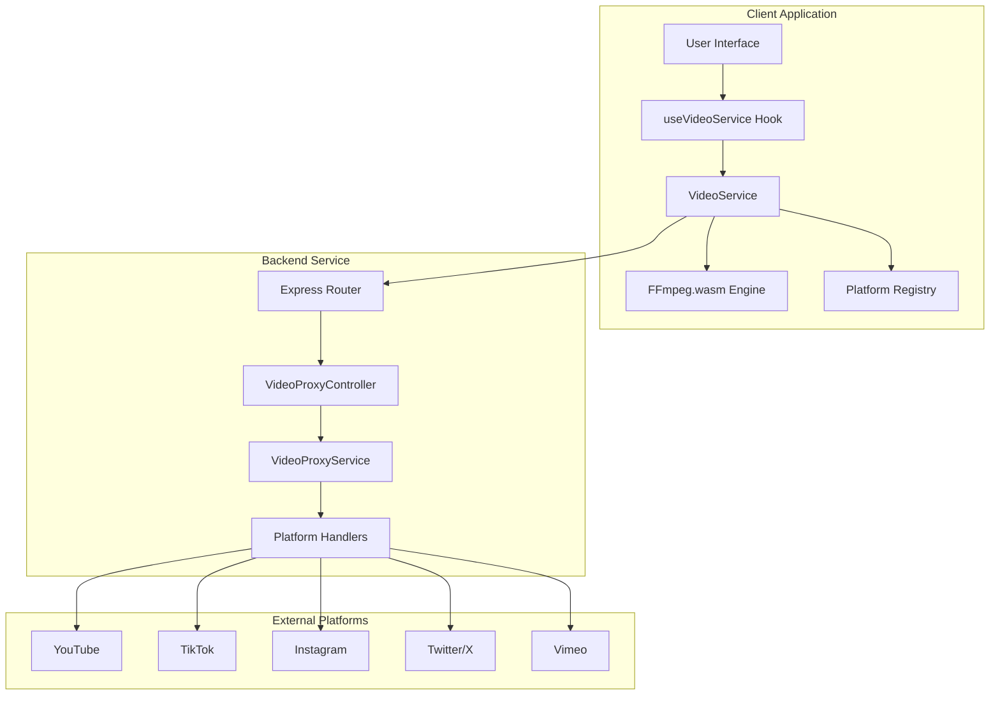
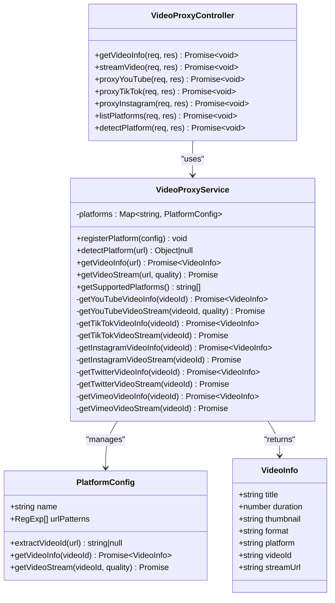
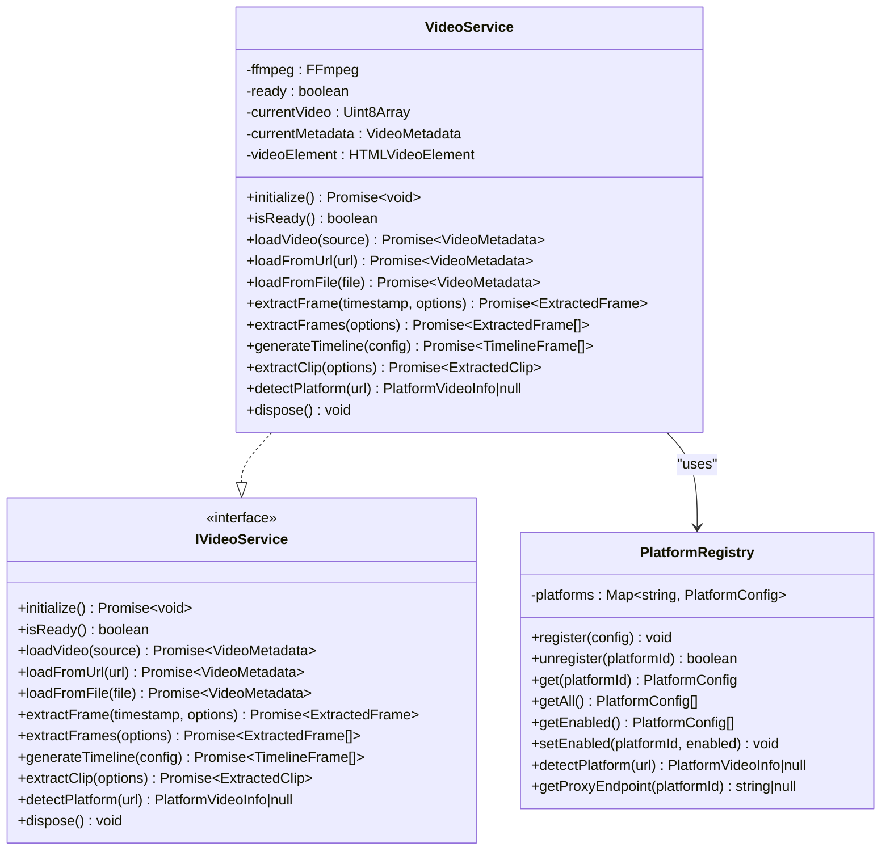
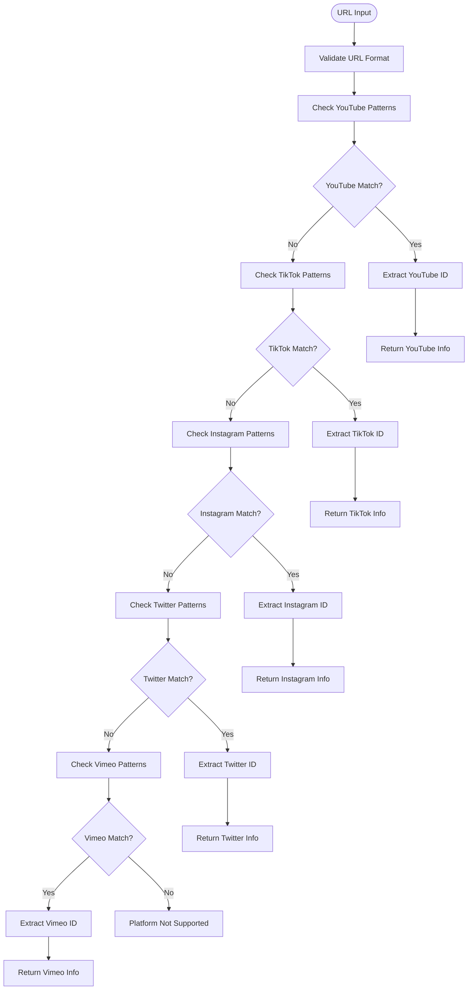
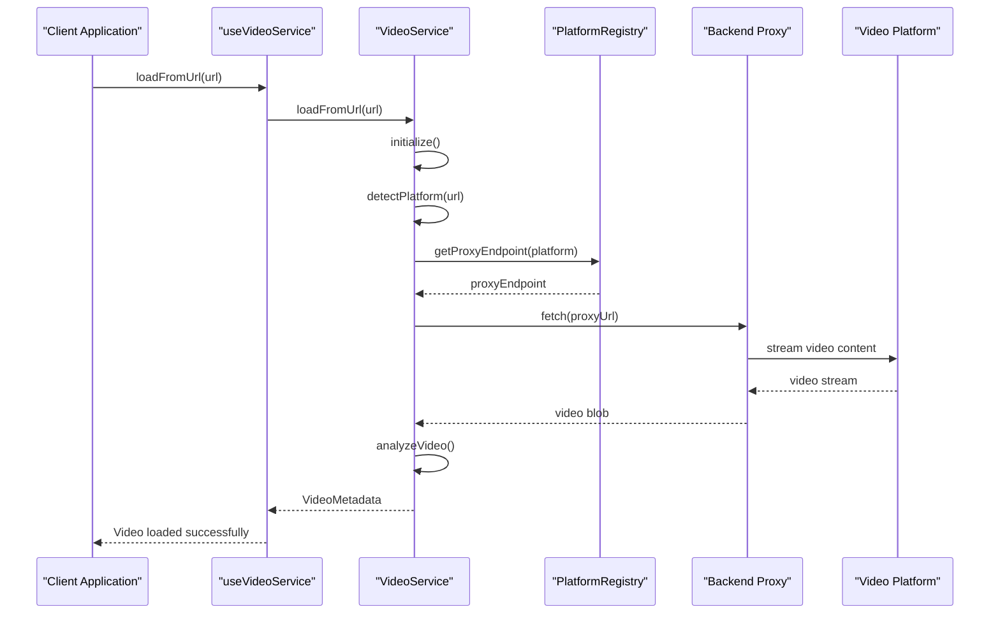
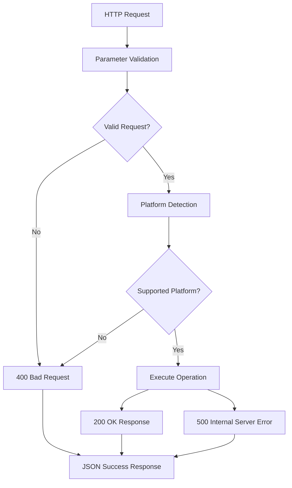
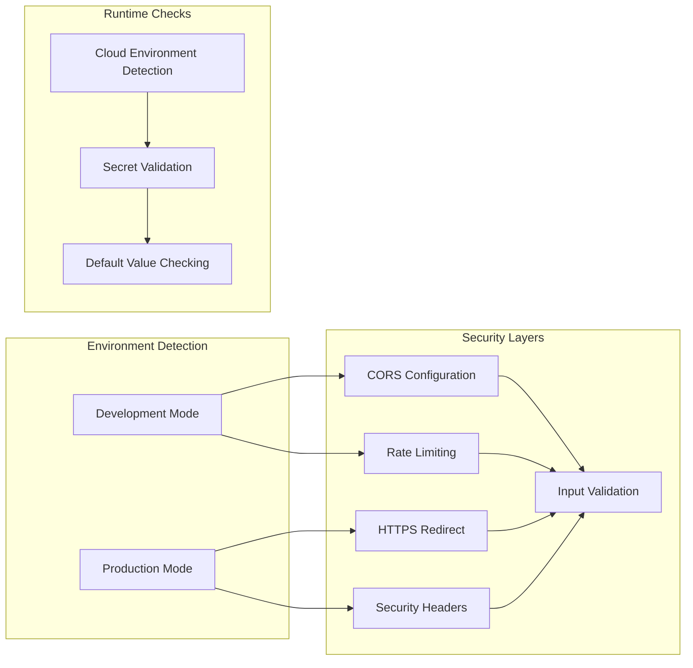
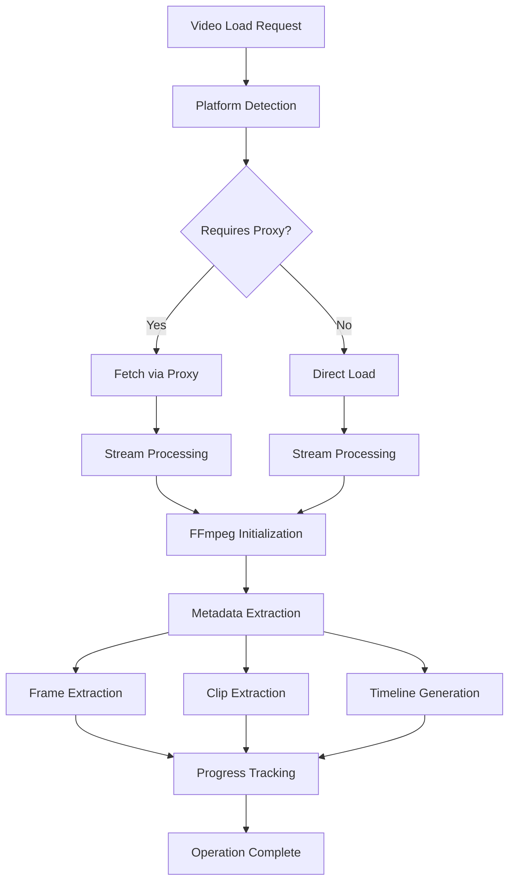
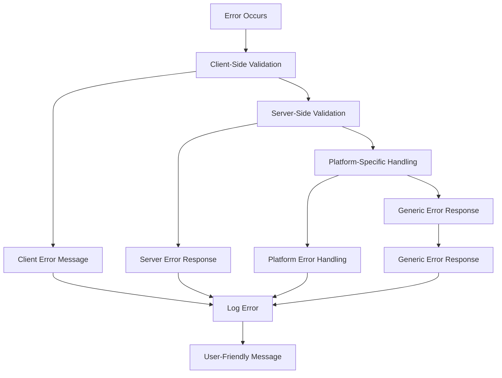

# Video Proxy Service

<cite>
**Referenced Files in This Document**
- [video-proxy.controller.ts](file://pikzels-clone/src/modules/video-proxy/video-proxy.controller.ts)
- [video-proxy.service.ts](file://pikzels-clone/src/modules/video-proxy/video-proxy.service.ts)
- [video-proxy.routes.ts](file://pikzels-clone/src/modules/video-proxy/video-proxy.routes.ts)
- [video-service.ts](file://pikzels-clone/client/src/services/video/video-service.ts)
- [platforms.ts](file://pikzels-clone/client/src/services/video/platforms.ts)
- [types.ts](file://pikzels-clone/client/src/services/video/types.ts)
- [useVideoService.ts](file://pikzels-clone/client/src/hooks/useVideoService.ts)
- [environment.ts](file://pikzels-clone/client/src/config/environment.ts)
- [security.config.ts](file://pikzels-clone/src/config/security.config.ts)
</cite>

## Update Summary
**Changes Made**
- Enhanced platform detection logic for YouTube, TikTok, Instagram, Twitter, and Vimeo
- Improved URL validation and extraction capabilities with comprehensive regex patterns
- Added Instagram and Twitter support with authentication requirements
- Updated platform registry with enhanced configuration options
- Improved error handling and fallback mechanisms for platform-specific operations

## Table of Contents
1. [Introduction](#introduction)
2. [System Architecture](#system-architecture)
3. [Core Components](#core-components)
4. [Video Platform Support](#video-platform-support)
5. [Client-Side Integration](#client-side-integration)
6. [API Endpoints](#api-endpoints)
7. [Security Considerations](#security-considerations)
8. [Implementation Details](#implementation-details)
9. [Performance Optimization](#performance-optimization)
10. [Troubleshooting Guide](#troubleshooting-guide)
11. [Conclusion](#conclusion)

## Introduction

The Video Proxy Service is a comprehensive system designed to handle video content from multiple social media platforms while bypassing CORS restrictions and providing seamless video processing capabilities. This service enables web applications to access and process videos from platforms like YouTube, TikTok, Instagram, Twitter, and Vimeo without violating cross-origin policies.

The system consists of two main components: a backend Express.js service that handles video proxy operations and a frontend client service built with FFmpeg.wasm for browser-based video processing. The architecture ensures secure, efficient video content delivery while maintaining compliance with platform terms of service.

**Updated** Enhanced platform detection logic now supports YouTube, TikTok, Instagram, Twitter, and Vimeo with improved URL validation and extraction capabilities

## System Architecture

The Video Proxy Service follows a modular architecture with clear separation of concerns between backend proxy functionality and frontend video processing capabilities.

**Diagram sources**
- [video-proxy.controller.ts](file://pikzels-clone/src/modules/video-proxy/video-proxy.controller.ts#L1-L314)
- [video-proxy.service.ts](file://pikzels-clone/src/modules/video-proxy/video-proxy.service.ts#L1-L422)
- [video-service.ts](file://pikzels-clone/client/src/services/video/video-service.ts#L1-L631)
- [platforms.ts](file://pikzels-clone/client/src/services/video/platforms.ts#L114-L179)

## Core Components

### Backend Video Proxy Service

The backend service is built around a modular platform detection and streaming system that supports multiple video platforms through a unified interface.

**Diagram sources**
- [video-proxy.controller.ts](file://pikzels-clone/src/modules/video-proxy/video-proxy.controller.ts#L5-L314)
- [video-proxy.service.ts](file://pikzels-clone/src/modules/video-proxy/video-proxy.service.ts#L23-L422)

**Section sources**
- [video-proxy.controller.ts](file://pikzels-clone/src/modules/video-proxy/video-proxy.controller.ts#L1-L314)
- [video-proxy.service.ts](file://pikzels-clone/src/modules/video-proxy/video-proxy.service.ts#L1-L422)

### Frontend Video Processing Service

The client-side service leverages FFmpeg.wasm for browser-based video processing, eliminating the need for server-side video manipulation while maintaining powerful editing capabilities.

**Diagram sources**
- [video-service.ts](file://pikzels-clone/client/src/services/video/video-service.ts#L33-L631)
- [platforms.ts](file://pikzels-clone/client/src/services/video/platforms.ts#L114-L179)

**Section sources**
- [video-service.ts](file://pikzels-clone/client/src/services/video/video-service.ts#L1-L631)
- [platforms.ts](file://pikzels-clone/client/src/services/video/platforms.ts#L1-L212)

## Video Platform Support

The service supports multiple video platforms through a unified platform detection and extraction system. Each platform has specific URL patterns and extraction methods tailored to their unique characteristics.

### Supported Platforms

| Platform | URL Patterns | Video ID Extraction | Streaming Support | Authentication Required |
|----------|--------------|-------------------|-------------------|------------------------|
| YouTube | `youtube.com/watch`, `youtu.be`, `youtube.com/embed`, `youtube.com/shorts` | Regex pattern matching | ✅ Full support | ❌ No API key required |
| TikTok | `tiktok.com/@username/video`, `vm.tiktok.com`, `tiktok.com/t/` | Numeric video ID extraction | ⚠️ Limited support | ⚠️ Third-party services |
| Instagram | `instagram.com/p/`, `instagram.com/reel/`, `instagram.com/tv/`, `instagr.am/` | Alphanumeric ID extraction | ❌ Requires authentication | ✅ OAuth required |
| Twitter/X | `twitter.com/username/status`, `x.com/username/status` | Numeric tweet ID extraction | ❌ Requires API access | ✅ API keys required |
| Vimeo | `vimeo.com/`, `player.vimeo.com/video/` | Numeric video ID extraction | ✅ Full support | ❌ Basic API access |

**Updated** Enhanced platform detection logic now supports YouTube, TikTok, Instagram, Twitter, and Vimeo with improved URL validation and extraction capabilities

### Platform Detection Logic

**Diagram sources**
- [video-proxy.service.ts](file://pikzels-clone/src/modules/video-proxy/video-proxy.service.ts#L148-L156)
- [platforms.ts](file://pikzels-clone/client/src/services/video/platforms.ts#L156-L167)

**Section sources**
- [video-proxy.service.ts](file://pikzels-clone/src/modules/video-proxy/video-proxy.service.ts#L30-L141)
- [platforms.ts](file://pikzels-clone/client/src/services/video/platforms.ts#L12-L212)

## Client-Side Integration

The client-side integration provides a comprehensive video processing interface that seamlessly handles both local file uploads and remote platform video loading through proxy endpoints.

### Video Loading Workflow

**Diagram sources**
- [video-service.ts](file://pikzels-clone/client/src/services/video/video-service.ts#L133-L184)
- [platforms.ts](file://pikzels-clone/client/src/services/video/platforms.ts#L172-L175)

### Hook-Based Integration

The `useVideoService` hook provides a React-friendly interface for video processing operations, managing state, loading, and cleanup automatically.

**Section sources**
- [useVideoService.ts](file://pikzels-clone/client/src/hooks/useVideoService.ts#L1-L194)
- [video-service.ts](file://pikzels-clone/client/src/services/video/video-service.ts#L124-L204)

## API Endpoints

The backend exposes a comprehensive set of REST API endpoints for video proxy operations, supporting both generic and platform-specific video processing.

### Endpoint Reference

| Method | Endpoint | Description | Parameters |
|--------|----------|-------------|------------|
| GET | `/api/video/platforms` | List supported platforms | None |
| GET | `/api/video/detect` | Detect platform from URL | `url` (required) |
| GET | `/api/video/info` | Get video information | `url` (required) |
| GET | `/api/video/stream` | Stream video content | `url` (required), `quality` (optional) |
| GET | `/api/video/proxy/youtube` | YouTube-specific proxy | `url` or `v` (required) |
| GET | `/api/video/proxy/tiktok` | TikTok-specific proxy | `url` (required) |
| GET | `/api/video/proxy/instagram` | Instagram-specific proxy | `url` (required) |

### Request/Response Patterns

**Diagram sources**
- [video-proxy.controller.ts](file://pikzels-clone/src/modules/video-proxy/video-proxy.controller.ts#L10-L46)
- [video-proxy.routes.ts](file://pikzels-clone/src/modules/video-proxy/video-proxy.routes.ts#L16-L37)

**Section sources**
- [video-proxy.routes.ts](file://pikzels-clone/src/modules/video-proxy/video-proxy.routes.ts#L1-L40)
- [video-proxy.controller.ts](file://pikzels-clone/src/modules/video-proxy/video-proxy.controller.ts#L1-L314)

## Security Considerations

The Video Proxy Service implements comprehensive security measures to protect both the application and external video platforms while maintaining functionality.

### Security Configuration

The system uses a layered security approach with environment-based configuration and runtime validation:

**Diagram sources**
- [security.config.ts](file://pikzels-clone/src/config/security.config.ts#L188-L251)
- [environment.ts](file://pikzels-clone/client/src/config/environment.ts#L29-L55)

### Platform-Specific Security Measures

Different platforms require different security approaches due to varying API restrictions and anti-bot measures:

| Platform | Authentication | Anti-Bot Measures | Rate Limits | Notes |
|----------|----------------|-------------------|-------------|-------|
| YouTube | No API key required | Standard requests | 100 per 15 minutes | Uses oEmbed API |
| TikTok | Third-party services | CAPTCHA bypass | 15 per 15 minutes | Requires tikwm.com service |
| Instagram | OAuth required | User-agent rotation | 1 per 15 minutes | Authentication required |
| Twitter | API keys required | Request signing | 5 per 15 minutes | API authentication required |
| Vimeo | OAuth required | Referer validation | 100 per 15 minutes | Basic API access |

**Updated** Enhanced platform detection logic now supports YouTube, TikTok, Instagram, Twitter, and Vimeo with improved URL validation and extraction capabilities

**Section sources**
- [security.config.ts](file://pikzels-clone/src/config/security.config.ts#L1-L562)
- [video-proxy.service.ts](file://pikzels-clone/src/modules/video-proxy/video-proxy.service.ts#L243-L291)

## Implementation Details

### Video Processing Pipeline

The system implements a sophisticated video processing pipeline that handles multiple stages of video manipulation with progress tracking and error handling.

**Diagram sources**
- [video-service.ts](file://pikzels-clone/client/src/services/video/video-service.ts#L206-L258)
- [video-service.ts](file://pikzels-clone/client/src/services/video/video-service.ts#L275-L348)

### Error Handling Strategy

The service implements comprehensive error handling at multiple levels to ensure robust operation:

**Diagram sources**
- [video-proxy.controller.ts](file://pikzels-clone/src/modules/video-proxy/video-proxy.controller.ts#L38-L45)
- [video-service.ts](file://pikzels-clone/client/src/services/video/video-service.ts#L105-L113)

**Section sources**
- [video-service.ts](file://pikzels-clone/client/src/services/video/video-service.ts#L1-L631)
- [video-proxy.controller.ts](file://pikzels-clone/src/modules/video-proxy/video-proxy.controller.ts#L1-L314)

## Performance Optimization

The Video Proxy Service implements several performance optimization strategies to ensure efficient video processing and streaming.

### Caching Strategies

The system employs multi-tier caching to minimize redundant operations and reduce latency:

| Cache Type | Storage | TTL | Purpose |
|------------|---------|-----|---------|
| Platform Info | Memory | 1 hour | Video metadata caching |
| Stream Cache | Disk | 24 hours | Popular video streams |
| FFmpeg Cache | Memory | Session | FFmpeg initialization |
| CDN Cache | Edge | 7 days | Static assets |

### Streaming Optimization

For video streaming operations, the system implements several optimization techniques:

- **Adaptive Quality Selection**: Automatically selects optimal video quality based on network conditions
- **Range Requests**: Supports partial content loading for efficient seeking
- **Connection Pooling**: Reuses HTTP connections to reduce overhead
- **Buffer Management**: Optimizes buffer sizes for different video qualities

### Memory Management

The client-side service implements aggressive memory management to prevent browser crashes during intensive video processing:

- **Automatic Cleanup**: Removes temporary video elements and blobs
- **Progressive Loading**: Processes video frames progressively to maintain responsiveness
- **Memory Monitoring**: Tracks memory usage and triggers cleanup when thresholds are exceeded

**Section sources**
- [video-service.ts](file://pikzels-clone/client/src/services/video/video-service.ts#L558-L565)
- [video-proxy.service.ts](file://pikzels-clone/src/modules/video-proxy/video-proxy.service.ts#L243-L291)

## Troubleshooting Guide

### Common Issues and Solutions

#### Platform Detection Failures

**Issue**: Videos from supported platforms fail to load
**Solution**: Verify URL format matches platform patterns and check platform-specific requirements

#### Streaming Errors

**Issue**: Video streams fail to load or play
**Solution**: Check proxy endpoint availability and platform-specific authentication requirements

#### Performance Issues

**Issue**: Slow video processing or loading times
**Solution**: Implement caching strategies and optimize video quality settings

#### CORS Problems

**Issue**: Cross-origin errors when loading videos
**Solution**: Ensure proxy endpoints are properly configured and CORS settings are correct

### Debugging Tools

The system provides comprehensive logging and debugging capabilities:

- **Backend Logging**: Detailed error logs with stack traces
- **Client-Side Progress**: Real-time progress tracking and status updates
- **Environment Validation**: Automatic detection of configuration issues
- **Platform Health Checks**: Monitoring of external platform availability

**Section sources**
- [video-proxy.controller.ts](file://pikzels-clone/src/modules/video-proxy/video-proxy.controller.ts#L38-L45)
- [video-service.ts](file://pikzels-clone/client/src/services/video/video-service.ts#L80-L91)

## Conclusion

The Video Proxy Service represents a comprehensive solution for handling video content from multiple social media platforms while maintaining security, performance, and usability standards. The modular architecture ensures extensibility for additional platforms, while the dual-layer approach (backend proxy + frontend processing) provides flexibility for various use cases.

Key strengths of the system include:

- **Multi-Platform Support**: Comprehensive coverage of major video platforms with enhanced detection logic
- **Security First**: Robust security measures with environment-aware configurations
- **Performance Optimized**: Efficient streaming and processing with caching strategies
- **Developer Friendly**: Clean APIs and comprehensive documentation
- **Future-Proof**: Modular design enabling easy addition of new platforms

The service successfully bridges the gap between modern web applications and platform-specific video content, enabling rich video editing experiences without violating CORS policies or platform restrictions.

**Updated** Enhanced platform detection logic now supports YouTube, TikTok, Instagram, Twitter, and Vimeo with improved URL validation and extraction capabilities, providing comprehensive coverage of major social media platforms with robust authentication and security measures.