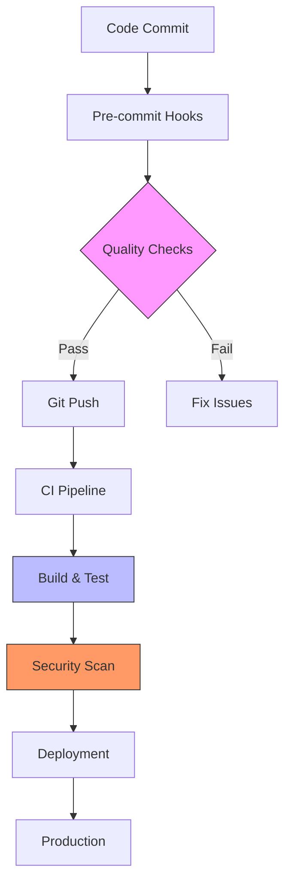
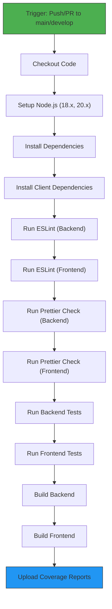
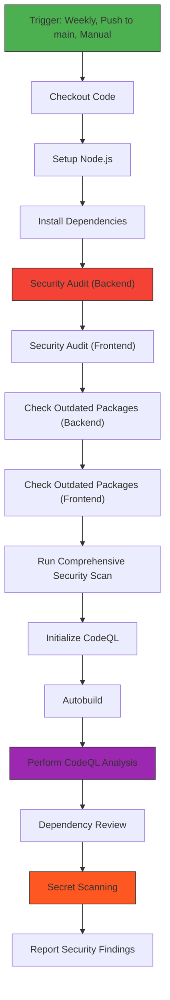
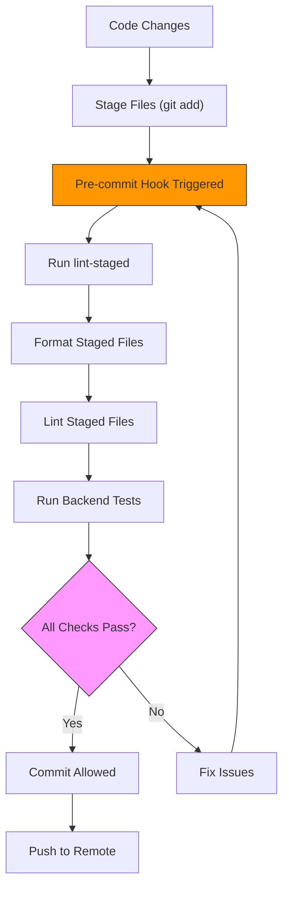
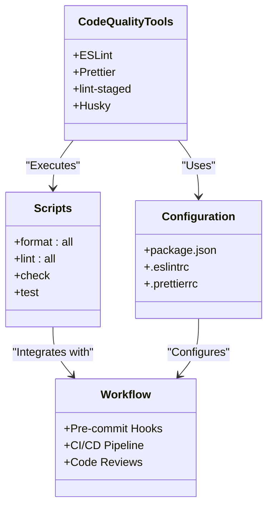

# CI/CD & DevOps

<cite>
**Referenced Files in This Document**  
- [ci.yml](file://pikzels-clone/.github/workflows/ci.yml)
- [security.yml](file://pikzels-clone/.github/workflows/security.yml)
- [package.json](file://pikzels-clone/package.json)
- [client/package.json](file://pikzels-clone/client/package.json)
- [.husky/pre-commit](file://pikzels-clone/.husky/pre-commit)
- [DEVELOPMENT_WORKFLOW.md](file://pikzels-clone/DEVELOPMENT_WORKFLOW.md)
- [scripts/security-scan.js](file://pikzels-clone/scripts/security-scan.js) - *Updated in recent commit*
- [PERFORMANCE.md](file://pikzels-clone/PERFORMANCE.md) - *Added in recent commit*
</cite>

## Update Summary
**Changes Made**   
- Updated Security Scanning Workflow section to reflect enhanced security scanning capabilities
- Added new section on Performance Benchmarking and Monitoring
- Enhanced diagram sources to include new security scanning script
- Updated section sources to reflect changes in security.yml and addition of security-scan.js
- Added reference to PERFORMANCE.md in document sources

## Table of Contents
1. [Introduction](#introduction)
2. [CI/CD Pipeline Overview](#cicd-pipeline-overview)
3. [Continuous Integration Workflow](#continuous-integration-workflow)
4. [Security Scanning Workflow](#security-scanning-workflow)
5. [Development Workflow & Pre-commit Hooks](#development-workflow--pre-commit-hooks)
6. [Code Quality Enforcement](#code-quality-enforcement)
7. [Deployment Strategies](#deployment-strategies)
8. [Troubleshooting Guide](#troubleshooting-guide)
9. [Performance Optimization](#performance-optimization)
10. [Performance Benchmarking & Monitoring](#performance-benchmarking--monitoring)
11. [Conclusion](#conclusion)

## Introduction

The CI/CD and DevOps infrastructure for the Thumbnail Maker Studio project is designed to ensure code quality, security, and reliability through automated processes. This document provides a comprehensive overview of the continuous integration, security scanning, code quality enforcement, and development workflows implemented in the project. The system leverages GitHub Actions for pipeline automation, Husky and lint-staged for pre-commit quality checks, and conventional commits for standardized version control practices.

**Section sources**
- [DEVELOPMENT_WORKFLOW.md](file://pikzels-clone/DEVELOPMENT_WORKFLOW.md#L0-L225)

## CI/CD Pipeline Overview

The project implements a robust CI/CD strategy with two primary GitHub Actions workflows that automate quality assurance and security checks. The pipelines are triggered on push and pull request events to main branches, ensuring that all code changes undergo rigorous validation before integration. The system is designed to catch issues early in the development cycle, reducing technical debt and improving overall code quality.

**Diagram sources**
- [ci.yml](file://pikzels-clone/.github/workflows/ci.yml#L1-L62)
- [security.yml](file://pikzels-clone/.github/workflows/security.yml#L1-L58)
- [.husky/pre-commit](file://pikzels-clone/.husky/pre-commit#L1-L12)

**Section sources**
- [ci.yml](file://pikzels-clone/.github/workflows/ci.yml#L1-L62)
- [security.yml](file://pikzels-clone/.github/workflows/security.yml#L1-L58)

## Continuous Integration Workflow

The continuous integration workflow, defined in `ci.yml`, executes a comprehensive suite of quality checks across multiple Node.js versions to ensure compatibility and stability. The pipeline runs on Ubuntu environments and includes matrix testing with Node.js 18.x and 20.x, providing broad compatibility coverage.

The workflow begins with code checkout and Node.js environment setup, followed by dependency installation for both backend and frontend components. It then executes a series of quality checks including ESLint for code quality analysis on both backend and frontend code, Prettier for code formatting verification, comprehensive testing for both backend and frontend applications, and build verification to ensure the application can be successfully compiled.

Code coverage reporting is integrated through Codecov, with reports uploaded only from the Node.js 20.x test run to avoid duplication. The workflow is triggered on push and pull request events to the main and develop branches, creating quality gates that prevent low-quality code from being merged.

**Diagram sources**
- [ci.yml](file://pikzels-clone/.github/workflows/ci.yml#L1-L62)

**Section sources**
- [ci.yml](file://pikzels-clone/.github/workflows/ci.yml#L1-L62)
- [package.json](file://pikzels-clone/package.json#L20-L21)
- [client/package.json](file://pikzels-clone/client/package.json#L13-L14)

## Security Scanning Workflow

The security workflow, defined in `security.yml`, implements a multi-layered approach to vulnerability detection and code security analysis. The pipeline runs on a weekly schedule (every Monday), on pushes to the main branch, and can be manually triggered, ensuring regular security assessments.

The workflow consists of four main jobs: security audit, CodeQL analysis, dependency review, and secret scanning. The security audit job performs dependency vulnerability scanning using npm audit with a moderate severity threshold for both backend and frontend dependencies. It also checks for outdated packages that may contain unpatched vulnerabilities.

The CodeQL analysis job leverages GitHub's advanced code scanning technology to detect security vulnerabilities, coding errors, and potential exploits in the JavaScript/TypeScript codebase. This static analysis tool automatically builds the code and performs deep semantic analysis to identify security issues that might be missed by traditional scanning methods.

The dependency-review job runs on pull requests and fails if moderate or higher severity vulnerabilities are detected in dependency changes, preventing vulnerable dependencies from being introduced.

The secret-scanning job performs pattern-based detection of potential secrets in the codebase, including API keys, JWT secrets, and database credentials with embedded passwords. This proactive scanning helps prevent accidental exposure of sensitive information.

Additionally, a comprehensive security scan is executed via the `scripts/security-scan.js` script, which performs multiple security checks including dependency vulnerabilities, code security issues, configuration security, environment security, and git history analysis. This custom script generates detailed security reports in both JSON and Markdown formats.

**Diagram sources**
- [security.yml](file://pikzels-clone/.github/workflows/security.yml#L1-L115)
- [scripts/security-scan.js](file://pikzels-clone/scripts/security-scan.js#L1-L473)

**Section sources**
- [security.yml](file://pikzels-clone/.github/workflows/security.yml#L1-L115)
- [package.json](file://pikzels-clone/package.json#L10-L11)
- [scripts/security-scan.js](file://pikzels-clone/scripts/security-scan.js#L1-L473) - *Updated in recent commit*

## Development Workflow & Pre-commit Hooks

The development workflow is enhanced with pre-commit hooks powered by Husky and lint-staged, creating a local quality gate that prevents problematic code from being committed. This approach shifts quality enforcement left in the development process, catching issues before they reach the CI/CD pipeline.

The pre-commit hook script executes a series of automated checks on staged files, including code formatting with Prettier, linting with ESLint, and running backend tests. This ensures that only properly formatted, lint-free, and tested code can be committed to the repository. The hook provides immediate feedback to developers, allowing them to address issues in context.

The workflow also incorporates conventional commits through Commitizen, standardizing commit message formats across the team. This practice improves changelog generation, release planning, and code review processes by providing consistent, meaningful commit messages that describe the nature and scope of changes.

**Diagram sources**
- [.husky/pre-commit](file://pikzels-clone/.husky/pre-commit#L1-L12)
- [package.json](file://pikzels-clone/package.json#L30-L31)

**Section sources**
- [.husky/pre-commit](file://pikzels-clone/.husky/pre-commit#L1-L12)
- [DEVELOPMENT_WORKFLOW.md](file://pikzels-clone/DEVELOPMENT_WORKFLOW.md#L100-L150)
- [package.json](file://pikzels-clone/package.json#L30-L31)

## Code Quality Enforcement

Code quality is enforced through a multi-layered approach that combines automated tools with standardized practices. The project utilizes ESLint for static code analysis and Prettier for code formatting, with configurations applied consistently across both backend and frontend codebases.

The lint-staged configuration in package.json defines rules for different file types, ensuring that TypeScript, JavaScript, JSON, and Markdown files are properly formatted and linted. The configuration includes separate rules for client-side code, with commands that navigate to the client directory before executing linting and formatting tools.

The development workflow document provides comprehensive guidance on quality commands, including combined scripts for formatting and linting all code (`npm run format:all` and `npm run lint:all`), as well as a comprehensive check script (`npm run check`) that runs both formatting and linting operations. This layered approach ensures consistent code style and quality across the entire codebase.

**Diagram sources**
- [package.json](file://pikzels-clone/package.json#L22-L31)
- [DEVELOPMENT_WORKFLOW.md](file://pikzels-clone/DEVELOPMENT_WORKFLOW.md#L50-L100)

**Section sources**
- [package.json](file://pikzels-clone/package.json#L22-L31)
- [DEVELOPMENT_WORKFLOW.md](file://pikzels-clone/DEVELOPMENT_WORKFLOW.md#L50-L100)

## Deployment Strategies

While the provided configuration files focus primarily on CI/CD and quality assurance, the deployment strategy can be inferred from the build processes and pipeline structure. The project appears to follow a staged deployment approach with separate main and develop branches, where the develop branch serves as an integration environment and the main branch represents production-ready code.

The build pipeline generates compiled assets for both backend (via `npm run build`) and frontend (via `cd client && npm run build`) applications, suggesting a decoupled architecture where frontend and backend are built and potentially deployed independently. The multi-node testing strategy indicates consideration for runtime compatibility across different Node.js versions in production environments.

Rollback procedures are not explicitly defined in the configuration files, but the use of Git branches and conventional commits provides a foundation for effective rollback strategies. The comprehensive testing and quality checks serve as safeguards against deploying problematic code, reducing the need for rollbacks.

**Section sources**
- [ci.yml](file://pikzels-clone/.github/workflows/ci.yml#L1-L62)
- [package.json](file://pikzels-clone/package.json#L8-L9)

## Troubleshooting Guide

Common pipeline issues and their resolutions include:

**Pre-commit Hook Failures**: When the pre-commit hook fails due to linting or formatting issues, run `npm run lint:all` and `npm run format:all` to fix the issues locally before attempting to commit again.

**CI/CD Pipeline Failures**: For pipeline failures, first reproduce the issue locally by running the same commands specified in the workflow files. Common causes include test failures, linting errors, or build issues that can be addressed by running `npm test`, `npm run lint`, or `npm run build` respectively.

**Security Audit Failures**: When npm audit reports vulnerabilities, update the affected packages to patched versions. For outdated packages, run `npm outdated` to identify which dependencies need updating, then use `npm update` or `npm install package@version` to upgrade them.

**Client-specific Issues**: Since the client application has its own package.json, ensure you navigate to the client directory when running client-specific commands, or use the wrapper scripts provided in the root package.json.

**Section sources**
- [DEVELOPMENT_WORKFLOW.md](file://pikzels-clone/DEVELOPMENT_WORKFLOW.md#L180-L225)
- [.husky/pre-commit](file://pikzels-clone/.husky/pre-commit#L1-L12)

## Performance Optimization

The CI/CD pipeline includes several performance optimization features. The use of npm ci instead of npm install ensures faster, more reliable dependency installation by using the package-lock.json file. Dependency caching is implemented through the actions/setup-node action with the cache parameter, reducing installation time across workflow runs.

The matrix strategy for Node.js versions allows parallel testing, reducing total pipeline execution time. Selective code coverage reporting (only from Node.js 20.x) prevents redundant uploads and saves storage space. The lint-staged configuration ensures that only modified files are processed during pre-commit checks, making the development workflow faster and more efficient.

**Section sources**
- [ci.yml](file://pikzels-clone/.github/workflows/ci.yml#L1-L62)
- [package.json](file://pikzels-clone/package.json#L30-L31)

## Performance Benchmarking & Monitoring

The project includes comprehensive performance benchmarking and monitoring capabilities as documented in PERFORMANCE.md. The system implements a Redis-based caching architecture with cache-aside pattern, service layer caching, and HTTP response caching to significantly improve response times.

Performance monitoring tracks key metrics including response times, request counts, error rates, cache hit ratios, memory usage, and database performance. The system provides monitoring endpoints to access performance metrics, cache statistics, and system health status.

The performance optimization implementation includes:
- Redis caching with connection pooling and smart cache keys
- Service layer caching with automatic invalidation on data changes
- HTTP response caching with configurable TTL values
- Response compression using Gzip
- Rate limiting to prevent abuse
- Database optimization with proper indexing
- Performance metrics API endpoints

Performance testing scripts are available to validate improvements and monitor system behavior under load.

**Section sources**
- [PERFORMANCE.md](file://pikzels-clone/PERFORMANCE.md) - *Added in recent commit*
- [package.json](file://pikzels-clone/package.json#L100-L105)

## Conclusion

The CI/CD and DevOps infrastructure for the Thumbnail Maker Studio project demonstrates a mature, comprehensive approach to automated development operations. By combining GitHub Actions workflows with local pre-commit hooks, the system creates multiple quality gates that ensure code reliability, security, and consistency. The integration of conventional commits, automated formatting, and comprehensive testing creates a development environment that promotes best practices and reduces technical debt. This robust infrastructure enables the team to maintain high code quality while accelerating development velocity.