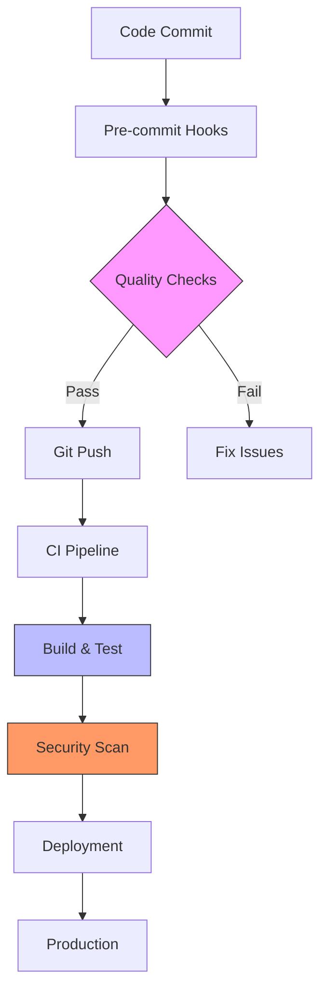
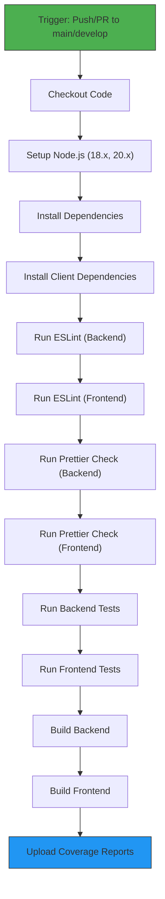
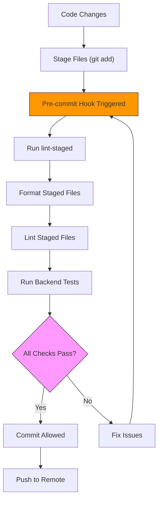

# CI/CD & DevOps

<cite>
**Referenced Files in This Document**
- [ci.yml](file://pikzels-clone/.github/workflows/ci.yml)
- [security.yml](file://pikzels-clone/.github/workflows/security.yml)
- [package.json](file://pikzels-clone/package.json)
- [client/package.json](file://pikzels-clone/client/package.json)
- [client/netlify.toml](file://pikzels-clone/client/netlify.toml)
- [client/tsconfig.json](file://pikzels-clone/client/tsconfig.json)
- [client/tsconfig.node.json](file://pikzels-clone/client/tsconfig.node.json)
- [.husky/pre-commit](file://pikzels-clone/.husky/pre-commit)
- [DEVELOPMENT_WORKFLOW.md](file://pikzels-clone/DEVELOPMENT_WORKFLOW.md)
</cite>

## Update Summary
**Changes Made**
- Enhanced Netlify build process documentation with development dependency installation
- Added Node.js version pinning details for deployment consistency
- Updated TypeScript configuration documentation including test file exclusion from compilation
- Improved build reliability and deployment consistency sections
- Added new deployment configuration section with Netlify-specific details

## Table of Contents
1. [Introduction](#introduction)
2. [CI/CD Pipeline Overview](#cicd-pipeline-overview)
3. [Continuous Integration Workflow](#continuous-integration-workflow)
4. [Security Scanning Workflow](#security-scanning-workflow)
5. [Development Workflow & Pre-commit Hooks](#development-workflow--pre-commit-hooks)
6. [Code Quality Enforcement](#code-quality-enforcement)
7. [Deployment Strategies](#deployment-strategies)
8. [Troubleshooting Guide](#troubleshooting-guide)
9. [Performance Optimization](#performance-optimization)
10. [Conclusion](#conclusion)

## Introduction

The CI/CD and DevOps infrastructure for the Thumbnail Maker Studio project is designed to ensure code quality, security, and reliability through automated processes. This document provides a comprehensive overview of the continuous integration, security scanning, code quality enforcement, and development workflows implemented in the project. The system leverages GitHub Actions for pipeline automation, Husky and lint-staged for pre-commit quality checks, and conventional commits for standardized version control practices.

**Section sources**
- [DEVELOPMENT_WORKFLOW.md:1-226](file://pikzels-clone/DEVELOPMENT_WORKFLOW.md#L1-L226)

## CI/CD Pipeline Overview

The project implements a robust CI/CD strategy with two primary GitHub Actions workflows that automate quality assurance and security checks. The pipelines are triggered on push and pull request events to main branches, ensuring that all code changes undergo rigorous validation before integration. The system is designed to catch issues early in the development cycle, reducing technical debt and improving overall code quality.

**Diagram sources**
- [ci.yml:1-63](file://pikzels-clone/.github/workflows/ci.yml#L1-L63)
- [security.yml:1-116](file://pikzels-clone/.github/workflows/security.yml#L1-L116)
- [.husky/pre-commit:1-61](file://pikzels-clone/.husky/pre-commit#L1-L61)

**Section sources**
- [ci.yml:1-63](file://pikzels-clone/.github/workflows/ci.yml#L1-L63)
- [security.yml:1-116](file://pikzels-clone/.github/workflows/security.yml#L1-L116)

## Continuous Integration Workflow

The continuous integration workflow, defined in `ci.yml`, executes a comprehensive suite of quality checks across multiple Node.js versions to ensure compatibility and stability. The pipeline runs on Ubuntu environments and includes matrix testing with Node.js 18.x and 20.x, providing broad compatibility coverage.

The workflow begins with code checkout and Node.js environment setup, followed by dependency installation for both backend and frontend components. It then executes a series of quality checks including ESLint for code quality analysis on both backend and frontend code, Prettier for code formatting verification, comprehensive testing for both backend and frontend applications, and build verification to ensure the application can be successfully compiled.

Code coverage reporting is integrated through Codecov, with reports uploaded only from the Node.js 20.x test run to avoid duplication. The workflow is triggered on push and pull request events to the main and develop branches, creating quality gates that prevent low-quality code from being merged.

**Diagram sources**
- [ci.yml:1-63](file://pikzels-clone/.github/workflows/ci.yml#L1-L63)

**Section sources**
- [ci.yml:1-63](file://pikzels-clone/.github/workflows/ci.yml#L1-L63)
- [package.json:15-16](file://pikzels-clone/package.json#L15-L16)
- [client/package.json:6-9](file://pikzels-clone/client/package.json#L6-L9)

## Security Scanning Workflow

The security workflow, defined in `security.yml`, implements a multi-layered approach to vulnerability detection and code security analysis. The pipeline runs on a weekly schedule (every Monday), on pushes to the main branch, and can be manually triggered, ensuring regular security assessments.

The workflow consists of four main jobs: security audit, CodeQL analysis, dependency review, and secret scanning. The security audit job performs dependency vulnerability scanning using npm audit with a moderate severity threshold for both backend and frontend dependencies. It also checks for outdated packages that may contain unpatched vulnerabilities.

The CodeQL analysis job leverages GitHub's advanced code scanning technology to detect security vulnerabilities, coding errors, and potential exploits in the JavaScript/TypeScript codebase. This static analysis tool automatically builds the code and performs deep semantic analysis to identify security issues that might be missed by traditional scanning methods.

The dependency-review job runs on pull requests and fails if moderate or higher severity vulnerabilities are detected in dependency changes, preventing vulnerable dependencies from being introduced.

The secret-scanning job performs pattern-based detection of potential secrets in the codebase, including API keys, JWT secrets, and database credentials with embedded passwords. This proactive scanning helps prevent accidental exposure of sensitive information.

**Section sources**
- [security.yml:1-116](file://pikzels-clone/.github/workflows/security.yml#L1-L116)
- [package.json:84-88](file://pikzels-clone/package.json#L84-L88)

## Development Workflow & Pre-commit Hooks

The development workflow is enhanced with pre-commit hooks powered by Husky and lint-staged, creating a local quality gate that prevents problematic code from being committed. This approach shifts quality enforcement left in the development process, catching issues before they reach the CI/CD pipeline.

The pre-commit hook script executes a series of automated checks on staged files, including code formatting with Prettier, linting with ESLint, and running backend tests. This ensures that only properly formatted, lint-free, and tested code can be committed to the repository. The hook provides immediate feedback to developers, allowing them to address issues in context.

The workflow also incorporates conventional commits through Commitizen, standardizing commit message formats across the team. This practice improves changelog generation, release planning, and code review processes by providing consistent, meaningful commit messages that describe the nature and scope of changes.

**Diagram sources**
- [.husky/pre-commit:1-61](file://pikzels-clone/.husky/pre-commit#L1-L61)
- [package.json:33-34](file://pikzels-clone/package.json#L33-L34)

**Section sources**
- [.husky/pre-commit:1-61](file://pikzels-clone/.husky/pre-commit#L1-L61)
- [DEVELOPMENT_WORKFLOW.md:76-121](file://pikzels-clone/DEVELOPMENT_WORKFLOW.md#L76-L121)
- [package.json:33-34](file://pikzels-clone/package.json#L33-L34)

## Code Quality Enforcement

Code quality is enforced through a multi-layered approach that combines automated tools with standardized practices. The project utilizes ESLint for static code analysis and Prettier for code formatting, with configurations applied consistently across both backend and frontend codebases.

The lint-staged configuration in package.json defines rules for different file types, ensuring that TypeScript, JavaScript, JSON, and Markdown files are properly formatted and linted. The configuration includes separate rules for client-side code, with commands that navigate to the client directory before executing linting and formatting tools.

The development workflow document provides comprehensive guidance on quality commands, including combined scripts for formatting and linting all code (`npm run format:all` and `npm run lint:all`), as well as a comprehensive check script (`npm run check`) that runs both formatting and linting operations. This layered approach ensures consistent code style and quality across the entire codebase.

**Section sources**
- [package.json:191-199](file://pikzels-clone/package.json#L191-L199)
- [DEVELOPMENT_WORKFLOW.md:122-146](file://pikzels-clone/DEVELOPMENT_WORKFLOW.md#L122-L146)

## Deployment Strategies

The project implements a comprehensive deployment strategy with enhanced Netlify build process configuration and TypeScript compilation improvements. The deployment pipeline ensures build reliability and deployment consistency through development dependency installation and Node.js version pinning.

### Netlify Build Process Enhancement

The client application now includes enhanced build process configuration in `client/netlify.toml` that installs development dependencies during the build phase. This ensures consistent build environments across different deployment contexts.

**Updated** Enhanced development dependency installation for improved build reliability

The Netlify configuration includes:
- Development dependency installation: `npm install --include=dev && npm run build`
- Node.js version pinning: `NODE_VERSION = "22"` for consistent runtime behavior
- Environment-specific build commands for production, deploy previews, and branch deployments
- Proper environment variable configuration for production deployment

### TypeScript Configuration Improvements

The TypeScript configuration has been enhanced to exclude test files from compilation, improving build performance and deployment consistency. The client-side TypeScript configuration now includes comprehensive test file exclusion patterns.

**Updated** Added TypeScript configuration improvements for better build reliability

Key TypeScript enhancements:
- Test file exclusion from compilation: `"exclude": ["src/**/*.test.ts", "src/**/*.test.tsx", "src/**/__tests__/**"]`
- Separate TypeScript configuration for Vite build process
- Improved type checking for production code vs test code

### Environment Management

The deployment strategy includes comprehensive environment management with different contexts:

**Production Context**: Strictest settings with NODE_ENV set to "production" and VITE_ENV set to "production"
**Deploy Preview Context**: PR preview deployments with VITE_ENV set to "preview"  
**Branch Deploy Context**: Staging deployments with VITE_ENV set to "staging"

**Section sources**
- [client/netlify.toml:1-50](file://pikzels-clone/client/netlify.toml#L1-L50)
- [client/tsconfig.json:24-26](file://pikzels-clone/client/tsconfig.json#L24-L26)
- [client/tsconfig.node.json:1-9](file://pikzels-clone/client/tsconfig.node.json#L1-L9)

## Troubleshooting Guide

Common pipeline issues and their resolutions include:

**Pre-commit Hook Failures**: When the pre-commit hook fails due to linting or formatting issues, run `npm run lint:all` and `npm run format:all` to fix the issues locally before attempting to commit again.

**CI/CD Pipeline Failures**: For pipeline failures, first reproduce the issue locally by running the same commands specified in the workflow files. Common causes include test failures, linting errors, or build issues that can be addressed by running `npm test`, `npm run lint`, or `npm run build` respectively.

**Security Audit Failures**: When npm audit reports vulnerabilities, update the affected packages to patched versions. For outdated packages, run `npm outdated` to identify which dependencies need updating, then use `npm update` or `npm install package@version` to upgrade them.

**Client-specific Issues**: Since the client application has its own package.json, ensure you navigate to the client directory when running client-specific commands, or use the wrapper scripts provided in the root package.json.

**Netlify Build Issues**: For Netlify deployment failures, verify that development dependencies are properly installed by checking the `npm install --include=dev` step in the build command. Ensure Node.js version matches the pinned version in `netlify.toml`.

**TypeScript Compilation Errors**: For TypeScript compilation issues in test files, check the `tsconfig.test.json` configuration and ensure test files are properly excluded from production compilation.

**Section sources**
- [DEVELOPMENT_WORKFLOW.md:147-192](file://pikzels-clone/DEVELOPMENT_WORKFLOW.md#L147-L192)
- [.husky/pre-commit:1-61](file://pikzels-clone/.husky/pre-commit#L1-L61)

## Performance Optimization

The CI/CD pipeline includes several performance optimization features. The use of npm ci instead of npm install ensures faster, more reliable dependency installation by using the package-lock.json file. Dependency caching is implemented through the actions/setup-node action with the cache parameter, reducing installation time across workflow runs.

The matrix strategy for Node.js versions allows parallel testing, reducing total pipeline execution time. Selective code coverage reporting (only from Node.js 20.x) prevents redundant uploads and saves storage space. The lint-staged configuration ensures that only modified files are processed during pre-commit checks, making the development workflow faster and more efficient.

**Section sources**
- [ci.yml:1-63](file://pikzels-clone/.github/workflows/ci.yml#L1-L63)
- [package.json:78-80](file://pikzels-clone/package.json#L78-L80)

## Conclusion

The CI/CD and DevOps infrastructure for the Thumbnail Maker Studio project demonstrates a mature, comprehensive approach to automated development operations. By combining GitHub Actions workflows with local pre-commit hooks, the system creates multiple quality gates that ensure code reliability, security, and consistency. The recent enhancements to the Netlify build process with development dependency installation and Node.js version pinning, along with TypeScript configuration improvements for test file exclusion, significantly improve build reliability and deployment consistency for the client application.

The integration of conventional commits, automated formatting, and comprehensive testing creates a development environment that promotes best practices and reduces technical debt. The enhanced deployment strategy with environment-specific configurations and improved TypeScript compilation ensures reliable, consistent deployments across all environments. This robust infrastructure enables the team to maintain high code quality while accelerating development velocity and ensuring production-ready deployments.