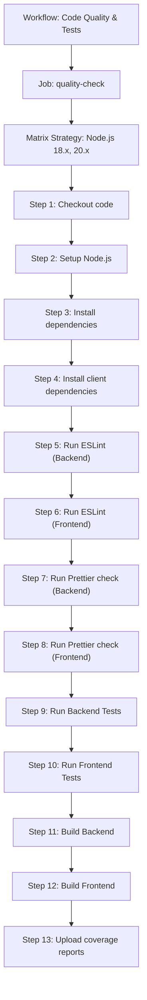
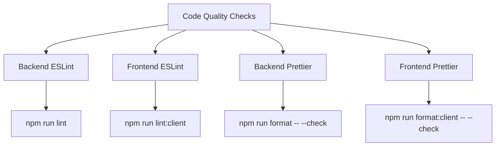

# GitHub Actions CI Pipeline

<cite>
**Referenced Files in This Document**   
- [pikzels-clone/.github/workflows/ci.yml](file://pikzels-clone/.github/workflows/ci.yml)
- [pikzels-clone/package.json](file://pikzels-clone/package.json)
- [pikzels-clone/client/package.json](file://pikzels-clone/client/package.json)
- [pikzels-clone/jest.config.js](file://pikzels-clone/jest.config.js)
- [pikzels-clone/client/jest.config.js](file://pikzels-clone/client/jest.config.js)
</cite>

## Table of Contents
1. [Introduction](#introduction)
2. [Workflow Configuration](#workflow-configuration)
3. [Trigger Events](#trigger-events)
4. [Quality Check Job](#quality-check-job)
5. [Matrix Strategy](#matrix-strategy)
6. [Pipeline Steps](#pipeline-steps)
7. [Code Quality Checks](#code-quality-checks)
8. [Testing Strategy](#testing-strategy)
9. [Build Process](#build-process)
10. [Coverage Reporting](#coverage-reporting)
11. [Integration with Development Workflow](#integration-with-development-workflow)
12. [Performance Optimization](#performance-optimization)
13. [Troubleshooting Common Failures](#troubleshooting-common-failures)
14. [Interpreting Workflow Outputs](#interpreting-workflow-outputs)
15. [Build Time Optimization](#build-time-optimization)

## Introduction

The GitHub Actions CI Pipeline for the Thumbnail Maker Studio project provides a comprehensive continuous integration system that ensures code quality, functionality, and reliability through automated testing and validation. This pipeline is designed to run on every push and pull request to the main and develop branches, providing immediate feedback on code changes. The system implements a matrix strategy to test across multiple Node.js versions, executes comprehensive code quality checks, runs unit tests for both frontend and backend components, builds the complete application, and reports test coverage metrics.

**Section sources**
- [pikzels-clone/.github/workflows/ci.yml](file://pikzels-clone/.github/workflows/ci.yml#L1-L62)

## Workflow Configuration

The CI pipeline is configured through the `ci.yml` file located in the `.github/workflows` directory. This configuration defines a workflow named "Code Quality & Tests" that orchestrates the entire continuous integration process. The workflow is structured around a single job called "quality-check" that executes a series of steps to validate code changes. The configuration follows GitHub Actions syntax and leverages various community actions to perform specific tasks such as code checkout, Node.js environment setup, and coverage reporting.

**Diagram sources**
- [pikzels-clone/.github/workflows/ci.yml](file://pikzels-clone/.github/workflows/ci.yml#L1-L62)

**Section sources**
- [pikzels-clone/.github/workflows/ci.yml](file://pikzels-clone/.github/workflows/ci.yml#L1-L62)

## Trigger Events

The CI pipeline is triggered by two types of events: push and pull_request. These triggers are specifically configured to activate when changes are made to the main and develop branches. This branching strategy supports a robust development workflow where feature branches are created from develop, and changes are merged through pull requests. The dual-branch trigger ensures that both the primary development branch (develop) and the production-ready branch (main) maintain high code quality standards. When developers push changes to either branch or open a pull request targeting these branches, the pipeline automatically executes, providing immediate feedback on the impact of the changes.

**Section sources**
- [pikzels-clone/.github/workflows/ci.yml](file://pikzels-clone/.github/workflows/ci.yml#L4-L9)

## Quality Check Job

The pipeline consists of a single job named "quality-check" that runs on the ubuntu-latest virtual environment provided by GitHub Actions. This job serves as the container for all quality assurance activities, ensuring that code changes meet the project's standards before being merged. The job is designed to be comprehensive, covering code quality, functionality, and build integrity. By consolidating all checks into a single job, the pipeline provides a clear pass/fail status that is easy to interpret. The job's success is required for pull requests to be merged, enforcing the quality gate across the codebase.

**Section sources**
- [pikzels-clone/.github/workflows/ci.yml](file://pikzels-clone/.github/workflows/ci.yml#L11-L13)

## Matrix Strategy

The pipeline employs a matrix strategy to test the application across multiple Node.js versions, specifically 18.x and 20.x. This approach ensures compatibility with different runtime environments and helps identify version-specific issues early in the development process. The matrix creates two parallel job instances, each running the complete set of quality checks on a different Node.js version. This strategy provides confidence that the application will function correctly in various deployment environments and helps prevent issues that might arise from Node.js version differences. The matrix configuration is a key component of the pipeline's robustness, enabling comprehensive testing without requiring separate workflow files.

**Section sources**
- [pikzels-clone/.github/workflows/ci.yml](file://pikzels-clone/.github/workflows/ci.yml#L15-L17)

## Pipeline Steps

The quality-check job executes a sequence of 13 steps that comprehensively validate the codebase. These steps follow a logical progression from code retrieval to final reporting. The pipeline begins with code checkout, followed by environment setup and dependency installation. It then proceeds through code quality checks, testing, and building phases before concluding with coverage reporting. Each step is designed to catch specific types of issues, from formatting problems to functional bugs. The sequential nature of these steps ensures that earlier, faster checks (like linting) can fail quickly, providing rapid feedback to developers without requiring the full pipeline execution when basic quality standards are not met.

**Section sources**
- [pikzels-clone/.github/workflows/ci.yml](file://pikzels-clone/.github/workflows/ci.yml#L19-L62)

## Code Quality Checks

The pipeline implements comprehensive code quality checks for both the backend and frontend components of the application. These checks include ESLint for code style and potential error detection, and Prettier for code formatting consistency. The backend ESLint check runs the `lint` script defined in the root package.json, while the frontend ESLint check executes the `lint:client` script. Similarly, Prettier checks are performed separately for backend and frontend code using the `format` and `format:client` scripts with the `--check` flag to verify formatting without making changes. Notably, the ESLint steps are configured with `continue-on-error: true`, allowing the pipeline to proceed even if linting issues are detected, ensuring that other quality checks are still performed.

**Diagram sources**
- [pikzels-clone/.github/workflows/ci.yml](file://pikzels-clone/.github/workflows/ci.yml#L27-L36)
- [pikzels-clone/package.json](file://pikzels-clone/package.json#L20-L23)

**Section sources**
- [pikzels-clone/.github/workflows/ci.yml](file://pikzels-clone/.github/workflows/ci.yml#L27-L36)
- [pikzels-clone/package.json](file://pikzels-clone/package.json#L20-L23)

## Testing Strategy

The pipeline executes a comprehensive testing strategy that covers both backend and frontend components. Backend tests are run using the `npm test` command, which invokes Jest with the configuration specified in jest.config.js. Frontend tests are executed by navigating to the client directory and running `npm test`, which uses the client-specific jest.config.js. The testing configuration for the backend specifies a Node.js test environment, while the frontend configuration uses jsdom to simulate a browser environment for React component testing. This dual testing approach ensures that both server-side logic and client-side user interface components are thoroughly validated, maintaining high quality across the full stack.

**Section sources**
- [pikzels-clone/.github/workflows/ci.yml](file://pikzels-clone/.github/workflows/ci.yml#L37-L42)
- [pikzels-clone/jest.config.js](file://pikzels-clone/jest.config.js#L1-L16)
- [pikzels-clone/client/jest.config.js](file://pikzels-clone/client/jest.config.js#L1-L10)

## Build Process

The pipeline includes a complete build process for both the backend and frontend components, verifying that the application can be successfully compiled. The backend build is executed using the `npm run build` command, which runs the TypeScript compiler (tsc) as defined in the root package.json. This step ensures that all TypeScript code compiles without errors and generates the necessary JavaScript files in the dist directory. The frontend build is performed by navigating to the client directory and running `npm run build`, which first executes tsc and then uses Vite to create a production-ready build. These build steps are critical for catching compilation errors and ensuring that the application can be deployed successfully.

**Section sources**
- [pikzels-clone/.github/workflows/ci.yml](file://pikzels-clone/.github/workflows/ci.yml#L43-L48)
- [pikzels-clone/package.json](file://pikzels-clone/package.json#L15-L16)

## Coverage Reporting

The pipeline integrates with Codecov to report test coverage metrics, providing visibility into the effectiveness of the test suite. The coverage upload step uses the Codecov GitHub Action and is configured to run only on the Node.js 20.x matrix instance to avoid duplicate reports. This conditional execution is implemented using the `if: matrix.node-version == '20.x'` condition, optimizing pipeline efficiency. The step is configured with `fail_ci_if_error: false` to ensure that coverage reporting issues do not cause the entire pipeline to fail, maintaining the primary focus on code quality and functionality. Coverage reports help the team identify untested code paths and prioritize test coverage improvements.

**Section sources**
- [pikzels-clone/.github/workflows/ci.yml](file://pikzels-clone/.github/workflows/ci.yml#L49-L55)

## Integration with Development Workflow

The CI pipeline is tightly integrated with the project's development workflow, serving as a quality gate for code changes. By triggering on both push and pull_request events to the main and develop branches, the pipeline ensures that all proposed changes undergo automated validation. This integration supports a collaborative development process where team members can review code with confidence that it meets quality standards. The pipeline's comprehensive checks provide immediate feedback, enabling developers to address issues before they are merged. This proactive approach to quality assurance reduces the likelihood of introducing bugs into the codebase and maintains a high standard of code quality throughout the project lifecycle.

**Section sources**
- [pikzels-clone/.github/workflows/ci.yml](file://pikzels-clone/.github/workflows/ci.yml#L4-L9)

## Performance Optimization

The pipeline incorporates several performance optimization techniques to reduce execution time and improve efficiency. The most significant optimization is dependency caching, implemented through the `actions/setup-node@v4` action with the `cache: 'npm'` parameter. This caching mechanism stores npm dependencies between runs, significantly reducing installation time for subsequent pipeline executions. The matrix strategy is also optimized by running tests in parallel across different Node.js versions, rather than sequentially. Additionally, the selective execution of the coverage reporting step on only one matrix instance prevents redundant operations. These optimizations ensure that the pipeline provides rapid feedback without compromising on thoroughness.

**Section sources**
- [pikzels-clone/.github/workflows/ci.yml](file://pikzels-clone/.github/workflows/ci.yml#L22-L23)

## Troubleshooting Common Failures

Common pipeline failures typically fall into several categories, each requiring specific troubleshooting approaches. Linting errors, while non-blocking due to `continue-on-error: true`, should be addressed by running the appropriate lint command locally and fixing the reported issues. Test failures require examining the test output to identify the failing tests and debugging the underlying code issues. Build failures often indicate TypeScript compilation errors or missing dependencies and can be reproduced locally using the same build commands. Dependency installation issues may require clearing the npm cache or updating package locks. Understanding these common failure modes enables developers to quickly diagnose and resolve pipeline issues, minimizing development delays.

**Section sources**
- [pikzels-clone/.github/workflows/ci.yml](file://pikzels-clone/.github/workflows/ci.yml#L27-L48)

## Interpreting Workflow Outputs

Interpreting workflow outputs requires understanding the status and logs of each pipeline step. A successful pipeline will show all steps as completed with green checkmarks, indicating that all quality checks passed. Failed steps will be marked with red X icons, and clicking on these steps reveals detailed logs that help diagnose the issue. For linting steps, warnings and errors are displayed in the output, showing the specific files and lines that need attention. Test outputs include detailed information about failing tests, including error messages and stack traces. Build outputs show compilation errors, while coverage reports provide metrics on test coverage percentages. Understanding these outputs enables effective response to pipeline results.

**Section sources**
- [pikzels-clone/.github/workflows/ci.yml](file://pikzels-clone/.github/workflows/ci.yml#L1-L62)

## Build Time Optimization

Further build time optimization can be achieved through several strategies beyond the existing caching mechanism. One approach is to implement step caching for the build outputs, allowing subsequent runs to reuse compiled artifacts when source files haven't changed. Another strategy is to optimize the test suite by identifying and addressing slow tests, potentially using test parallelization for the frontend tests. The pipeline could also be enhanced with conditional execution of certain steps based on which files were changed, avoiding unnecessary checks for unrelated components. Additionally, upgrading to GitHub Actions runners with more resources could reduce execution time for compute-intensive operations like building and testing.

**Section sources**
- [pikzels-clone/.github/workflows/ci.yml](file://pikzels-clone/.github/workflows/ci.yml#L1-L62)