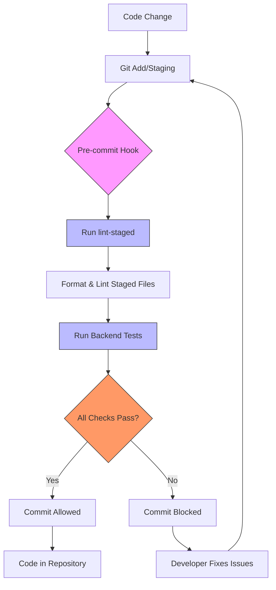
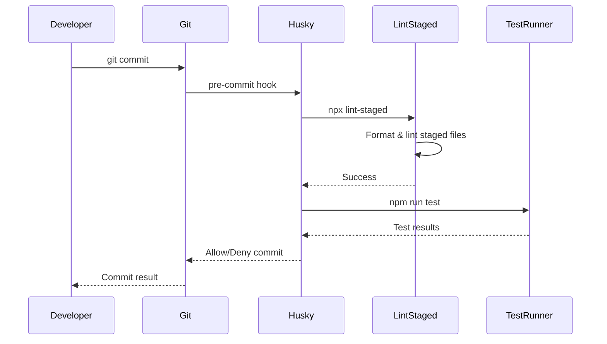

# Pre-commit Quality Enforcement

<cite>
**Referenced Files in This Document**  
- [package.json](file://pikzels-clone/package.json)
- [DEVELOPMENT_WORKFLOW.md](file://pikzels-clone/DEVELOPMENT_WORKFLOW.md)
- [.husky/pre-commit](file://pikzels-clone/.husky/pre-commit)
</cite>

## Table of Contents
1. [Introduction](#introduction)
2. [Core Components](#core-components)
3. [Architecture Overview](#architecture-overview)
4. [Detailed Component Analysis](#detailed-component-analysis)
5. [Development Workflow Integration](#development-workflow-integration)
6. [Troubleshooting Guide](#troubleshooting-guide)
7. [Best Practices](#best-practices)

## Introduction

The Pre-commit Quality Enforcement system in the Thumbnail Maker Studio project ensures code quality and consistency through automated checks that run before each Git commit. This system leverages Husky and lint-staged to automatically format code, fix linting issues, and run tests on staged files, preventing problematic code from entering the repository. The workflow is designed to maintain professional code quality standards while providing developers with immediate feedback during the development process.

**Section sources**
- [DEVELOPMENT_WORKFLOW.md](file://pikzels-clone/DEVELOPMENT_WORKFLOW.md#L1-L20)

## Core Components

The pre-commit quality enforcement system consists of three main components: Husky for Git hook management, lint-staged for selective file processing, and a comprehensive script suite in package.json for code quality operations. These components work together to create a seamless development experience where code formatting, linting, and testing are automated and consistent across the team.

**Section sources**
- [package.json](file://pikzels-clone/package.json#L1-L91)
- [.husky/pre-commit](file://pikzels-clone/.husky/pre-commit#L1-L13)

## Architecture Overview



**Diagram sources**
- [package.json](file://pikzels-clone/package.json#L1-L91)
- [.husky/pre-commit](file://pikzels-clone/.husky/pre-commit#L1-L13)

## Detailed Component Analysis

### Husky Integration

Husky is configured as a Git hook manager that intercepts the commit process and runs quality checks before allowing the commit to proceed. The prepare script in package.json automatically sets up Husky when dependencies are installed, ensuring that all developers have the same pre-commit checks without manual configuration.



**Diagram sources**
- [package.json](file://pikzels-clone/package.json#L1-L91)
- [.husky/pre-commit](file://pikzels-clone/.husky/pre-commit#L1-L13)

### lint-staged Configuration

The lint-staged configuration in package.json defines the quality checks applied to staged files based on their file type. TypeScript and TSX files are processed with both ESLint and Prettier, while JSON and Markdown files are formatted with Prettier only. The configuration also includes special handling for client-side code by changing to the client directory before running the tools.

```mermaid
flowchart TD
A[Staged Files] --> B{File Type?}
B --> |*.ts, *.tsx| C[Run ESLint --fix]
C --> D[Run Prettier --write]
B --> |*.js, *.jsx, *.json, *.md| E[Run Prettier --write]
B --> |client/src/**/*.{ts,tsx}| F[cd client && ESLint --fix]
F --> G[cd client && Prettier --write]
C --> H[Processed]
D --> H
E --> H
G --> H
H --> I[Return to Git]
style B fill:#f96,stroke:#333
style C fill:#bbf,stroke:#333
style D fill:#bbf,stroke:#333
style E fill:#bbf,stroke:#333
style F fill:#bbf,stroke:#333
style G fill:#bbf,stroke:#333
```

**Diagram sources**
- [package.json](file://pikzels-clone/package.json#L1-L91)

## Development Workflow Integration

The pre-commit system is integrated into the daily development workflow through several key scripts defined in package.json. Developers can run `npm run check` to format and lint all code before committing, ensuring their changes will pass the pre-commit checks. The `npm run commit` script provides a guided interface for creating conventional commit messages that meet the project's standards.

When a developer attempts to commit code, the pre-commit hook automatically runs `npx lint-staged` to process only the staged files, followed by `npm run test` to verify that the changes haven't broken existing functionality. This selective processing improves performance by avoiding unnecessary checks on unchanged files.

**Section sources**
- [package.json](file://pikzels-clone/package.json#L1-L91)
- [DEVELOPMENT_WORKFLOW.md](file://pikzels-clone/DEVELOPMENT_WORKFLOW.md#L1-L225)

## Troubleshooting Guide

Common issues with the pre-commit quality enforcement system typically fall into three categories: formatting failures, linting errors, and test failures. When the pre-commit hook blocks a commit, developers should first run `npm run check` to identify and fix formatting and linting issues across the entire codebase. For client-specific issues, developers should navigate to the client directory and run the appropriate commands there.

If tests are failing, developers should run `npm test` to get detailed information about the failures and address them before attempting to commit again. In cases where the pre-commit hook itself is not functioning, developers can reinitialize it by running `npx husky install` to ensure the Git hooks are properly set up.

**Section sources**
- [DEVELOPMENT_WORKFLOW.md](file://pikzels-clone/DEVELOPMENT_WORKFLOW.md#L1-L225)
- [.husky/pre-commit](file://pikzels-clone/.husky/pre-commit#L1-L13)

## Best Practices

To maximize the effectiveness of the pre-commit quality enforcement system, developers should adopt several best practices. First, they should run `npm run check` regularly during development to catch issues early, rather than waiting until commit time. Second, they should use `npm run commit` to create properly formatted commit messages that provide clear context for code changes.

Developers should also be aware that the pre-commit hook only processes staged files, so they should stage their changes incrementally and commit related changes together. This approach makes it easier to identify and fix issues when they arise. Finally, developers should ensure their local environment is properly configured by running `npm install` whenever dependencies change, as this automatically sets up the Husky hooks through the prepare script.

**Section sources**
- [package.json](file://pikzels-clone/package.json#L1-L91)
- [DEVELOPMENT_WORKFLOW.md](file://pikzels-clone/DEVELOPMENT_WORKFLOW.md#L1-L225)