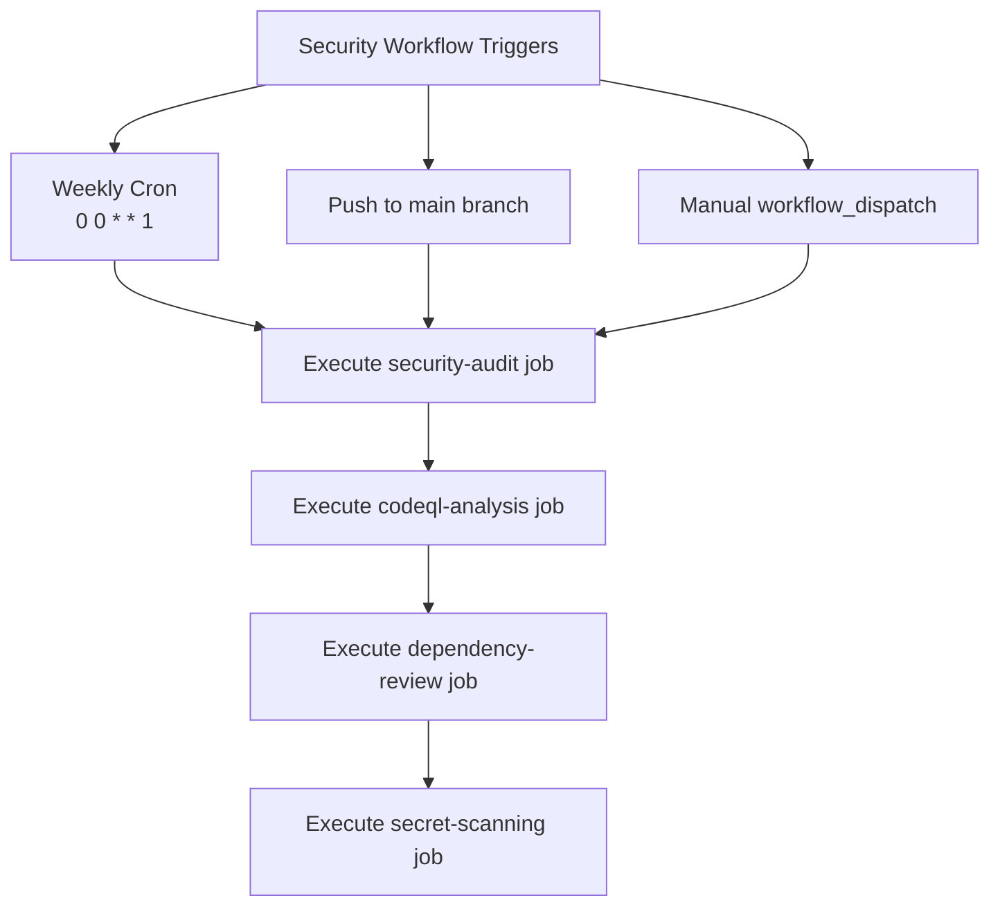
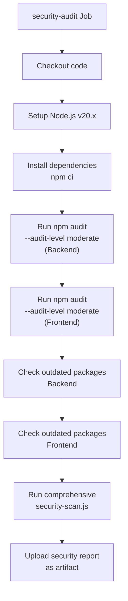
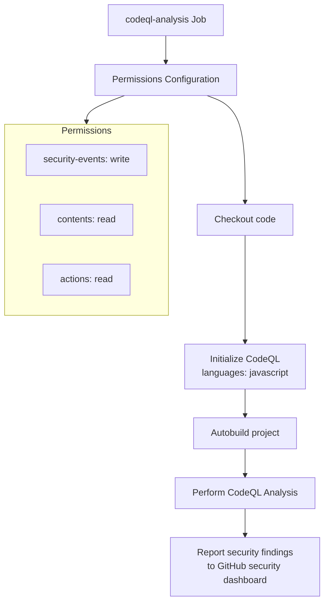

# Security & Dependency Audit

<cite>
**Referenced Files in This Document**   
- [security.yml](file://pikzels-clone\.github\workflows\security.yml) - *Updated in recent commit*
- [package.json](file://pikzels-clone\package.json) - *Updated in recent commit*
- [client/package.json](file://pikzels-clone\client\package.json) - *Updated in recent commit*
- [security-scan.js](file://pikzels-clone\scripts\security-scan.js) - *Added in recent commit*
- [security.middleware.ts](file://pikzels-clone\src\middleware\security.middleware.ts) - *Added in recent commit*
- [validation.middleware.ts](file://pikzels-clone\src\middleware\validation.middleware.ts) - *Added in recent commit*
- [README.md](file://pikzels-clone\README.md)
</cite>

## Update Summary
**Changes Made**   
- Added new section on Security & Validation Middleware reflecting recent infrastructure improvements
- Updated Security Audit Job section to include the new comprehensive security scan
- Added new diagram for the enhanced security workflow
- Updated package management section to reflect new security scripts
- Added sources for newly added files and updated sections
- Enhanced documentation to reflect new security features including rate limiting, input sanitization, and validation rules

## Table of Contents
1. [Introduction](#introduction)
2. [Security Workflow Configuration](#security-workflow-configuration)
3. [Security Audit Job](#security-audit-job)
4. [CodeQL Analysis Job](#codeql-analysis-job)
5. [Dependency Review Job](#dependency-review-job)
6. [Secret Scanning Job](#secret-scanning-job)
7. [Package Management and Audit Scripts](#package-management-and-audit-scripts)
8. [Security & Validation Middleware](#security--validation-middleware)
9. [Integration with DevOps Strategy](#integration-with-devops-strategy)
10. [Common Security Issues and Remediation](#common-security-issues-and-remediation)
11. [Best Practices for Dependency Management](#best-practices-for-dependency-management)
12. [Conclusion](#conclusion)

## Introduction

The Security & Dependency Audit workflow is a critical component of the Thumbnail Maker Studio's DevOps strategy, ensuring code quality and security through automated checks. This comprehensive security system runs on multiple triggers—weekly via cron, on pushes to the main branch, and manually through workflow dispatch—providing continuous protection against vulnerabilities. The workflow combines npm audit for dependency security with GitHub's CodeQL for static code analysis, creating a robust defense against both known package vulnerabilities and potential code-level security issues. This document details the implementation, configuration, and best practices for maintaining a secure codebase within the project's development lifecycle.

**Section sources**
- [security.yml](file://pikzels-clone\.github\workflows\security.yml#L1-L58)
- [README.md](file://pikzels-clone\README.md#L1-L200)

## Security Workflow Configuration

The security workflow is configured to execute under three distinct triggers, ensuring comprehensive coverage of the development lifecycle. The cron schedule triggers the workflow weekly on Mondays at midnight, providing regular security assessments regardless of code changes. This scheduled execution ensures that even during periods of low development activity, the codebase continues to be monitored for newly discovered vulnerabilities in dependencies. The push trigger activates the workflow whenever changes are pushed to the main branch, providing immediate feedback on security implications of new code. This real-time validation helps catch security issues early in the development process before they can be deployed. Additionally, the workflow_dispatch trigger enables manual execution, allowing developers and security teams to initiate security audits on demand, such as before major releases or in response to specific security concerns. This multi-trigger approach creates a defense-in-depth strategy for security monitoring.

**Diagram sources**
- [security.yml](file://pikzels-clone\.github\workflows\security.yml#L3-L10)

**Section sources**
- [security.yml](file://pikzels-clone\.github\workflows\security.yml#L3-L10)

## Security Audit Job

The security-audit job performs comprehensive dependency vulnerability scanning for both the backend and frontend components of the application. Running on Ubuntu latest, the job begins by checking out the code repository and setting up Node.js version 20.x with npm package caching to optimize performance. After installing dependencies with npm ci for reproducible builds, the job executes npm audit with a moderate severity threshold on both the backend and frontend packages. This dual-audit approach ensures that vulnerabilities in both application layers are identified and addressed. The job also includes checks for outdated packages in both environments, helping maintain dependency freshness and reduce technical debt. Additionally, the job now runs a comprehensive security scan using the custom security-scan.js script, which performs multiple security checks including dependency scanning, code analysis, configuration security, environment security, and git security. The job uploads the generated security report as an artifact for further analysis, ensuring that security findings are preserved for audit purposes.

**Diagram sources**
- [security.yml](file://pikzels-clone\.github\workflows\security.yml#L12-L45)
- [security-scan.js](file://pikzels-clone\scripts\security-scan.js#L1-L50)

**Section sources**
- [security.yml](file://pikzels-clone\.github\workflows\security.yml#L12-L45)
- [security-scan.js](file://pikzels-clone\scripts\security-scan.js#L1-L50)

## CodeQL Analysis Job

The codeql-analysis job implements GitHub's advanced static code analysis capabilities to detect security vulnerabilities and coding errors in the codebase. Configured with specific permissions for security-events (write), contents (read), and actions (read), this job ensures that security findings can be properly reported and integrated into GitHub's security dashboard. The analysis process follows a three-step workflow: initialization of CodeQL with JavaScript language support, automated project building, and comprehensive code analysis. This approach enables deep inspection of the codebase for common security issues such as injection vulnerabilities, authentication flaws, and improper error handling. The integration with GitHub's security platform allows for automatic creation of security advisories and seamless tracking of vulnerabilities within the repository's security tab, providing developers with actionable insights and remediation guidance.

**Diagram sources**
- [security.yml](file://pikzels-clone\.github\workflows\security.yml#L47-L58)

**Section sources**
- [security.yml](file://pikzels-clone\.github\workflows\security.yml#L47-L58)

## Dependency Review Job

The dependency-review job is executed only on pull requests to the main branch, providing an additional layer of security for incoming code changes. This job analyzes dependency changes between the current branch and the main branch, identifying any new dependencies or version updates that could introduce security vulnerabilities. The job is configured with a fail-on-severity threshold of moderate, meaning it will fail the workflow if any moderate or higher severity vulnerabilities are detected in the new dependencies. This targeted approach ensures that security reviews are focused on actual changes rather than re-scanning the entire dependency tree on every workflow execution. By running specifically on pull requests, this job serves as a gatekeeper for dependency changes, preventing vulnerable packages from being merged into the main codebase.

**Section sources**
- [security.yml](file://pikzels-clone\.github\workflows\security.yml#L60-L71)

## Secret Scanning Job

The secret-scanning job performs pattern-based detection of potential secrets in the codebase, complementing GitHub's built-in secret scanning capabilities with custom rules specific to the project's needs. This job scans for common secret patterns including API keys (32+ character alphanumeric strings), JWT secrets, and database URLs with credentials. The scan is configured to exclude example files and node_modules directories to reduce false positives. When potential secrets are detected, the job outputs warnings to alert developers, helping prevent accidental commits of sensitive information. This proactive scanning approach adds an additional layer of protection against credential leaks and other security incidents caused by hardcoded secrets in the codebase.

**Section sources**
- [security.yml](file://pikzels-clone\.github\workflows\security.yml#L73-L115)

## Package Management and Audit Scripts

The project's package management strategy is implemented through comprehensive npm scripts in both the root and client package.json files. The backend package.json includes development scripts for testing, linting, formatting, and database management, while the client package.json focuses on frontend-specific tasks like development server management and build processes. The security workflow leverages npm audit commands with moderate severity thresholds to identify vulnerabilities, and the package.json now includes dedicated security scripts such as "security:scan", "security:audit", and "security:check" for running various security assessments. The dependency tree includes critical packages such as @prisma/client for database operations, bcryptjs for password hashing, express for the web server, and sharp for image processing—all of which are regularly scanned for vulnerabilities. The devDependencies include testing frameworks, linting tools, and TypeScript support, ensuring code quality and maintainability throughout the development process.

**Section sources**
- [package.json](file://pikzels-clone\package.json#L1-L92)
- [client/package.json](file://pikzels-clone\client\package.json#L1-L40)

## Security & Validation Middleware

The project has been enhanced with comprehensive security and validation middleware to protect against common web application vulnerabilities. The security.middleware.ts file implements multiple security layers including HTTP security headers (via Helmet), rate limiting for general requests and authentication endpoints, input sanitization to prevent XSS attacks, and security logging to detect suspicious activity. The validation.middleware.ts file provides robust request validation with configurable rules for email, password, URL, and UUID validation, along with custom validation functions and input sanitization. These middleware components work together to provide defense-in-depth security, protecting the application from various attack vectors including brute force attacks, injection attacks, and data tampering. The middleware is configured with environment-specific settings and comprehensive logging to support security monitoring and incident response.

**Section sources**
- [security.middleware.ts](file://pikzels-clone\src\middleware\security.middleware.ts#L1-L230)
- [validation.middleware.ts](file://pikzels-clone\src\middleware\validation.middleware.ts#L1-L351)

## Integration with DevOps Strategy

The security audit workflow is deeply integrated into the project's overall DevOps strategy, complementing existing quality assurance processes documented in the README.md. This integration creates a comprehensive quality pipeline that combines security scanning with code formatting, linting, and testing. The automated nature of the security checks ensures that every code change undergoes security validation, aligning with the project's emphasis on automated quality assurance. Security findings are incorporated into the same feedback loop as other code quality metrics, allowing developers to address security issues alongside other technical debt. The workflow's results are visible in the repository's security tab and contribute to the project's overall quality badge, providing transparency into the security posture of the codebase. This holistic approach to quality ensures that security is not an afterthought but an integral part of the development process.

**Section sources**
- [README.md](file://pikzels-clone\README.md#L146-L153)
- [security.yml](file://pikzels-clone\.github\workflows\security.yml#L1-L58)

## Common Security Issues and Remediation

While the security workflow is designed to catch vulnerabilities early, common issues may still arise that require specific remediation strategies. High-severity vulnerabilities in dependencies like node-fetch or jsonwebtoken could expose the application to remote code execution or authentication bypass attacks. These are typically remediated by updating to patched versions or implementing additional security controls. Prototype pollution vulnerabilities in utility libraries can be addressed by input validation and using safer alternatives. Cross-site scripting (XSS) risks in the React frontend may be detected by CodeQL and require proper input sanitization and secure coding practices. Regular false positives from npm audit can be managed by reviewing advisory details and implementing appropriate risk assessments. The combination of automated scanning and manual review ensures that genuine security threats are prioritized and addressed promptly.

**Section sources**
- [package.json](file://pikzels-clone\package.json#L60-L75)
- [client/package.json](file://pikzels-clone\client\package.json#L15-L25)

## Best Practices for Dependency Management

Effective dependency management is essential for maintaining a secure and stable codebase. The project follows several best practices, including using npm ci for reproducible builds in CI environments, regularly updating dependencies to their latest secure versions, and monitoring for deprecated packages. The dual-package structure (backend and frontend) allows for targeted dependency management, minimizing the attack surface by keeping dependencies scoped to their respective environments. Developers are encouraged to review npm audit reports carefully, understanding the context and impact of each vulnerability before applying updates. The use of lock files (package-lock.json) ensures consistent dependency versions across development and production environments. Additionally, the project leverages GitHub's dependabot (implied by the security focus) to automatically create pull requests for dependency updates, streamlining the maintenance process while maintaining security.

**Section sources**
- [package.json](file://pikzels-clone\package.json#L1-L92)
- [client/package.json](file://pikzels-clone\client\package.json#L1-L40)
- [security.yml](file://pikzels-clone\.github\workflows\security.yml#L20-L27)

## Conclusion

The Security & Dependency Audit workflow represents a comprehensive approach to maintaining code quality and security in the Thumbnail Maker Studio project. By combining automated dependency scanning with static code analysis, the workflow provides multiple layers of protection against security vulnerabilities. The multi-trigger execution model ensures continuous monitoring, while the integration with GitHub's security ecosystem enables effective vulnerability management. This proactive security posture, combined with the project's emphasis on code quality and automated testing, creates a robust foundation for sustainable development. As the project evolves, maintaining and enhancing this security infrastructure will be critical to protecting user data and ensuring the reliability of the thumbnail creation platform.