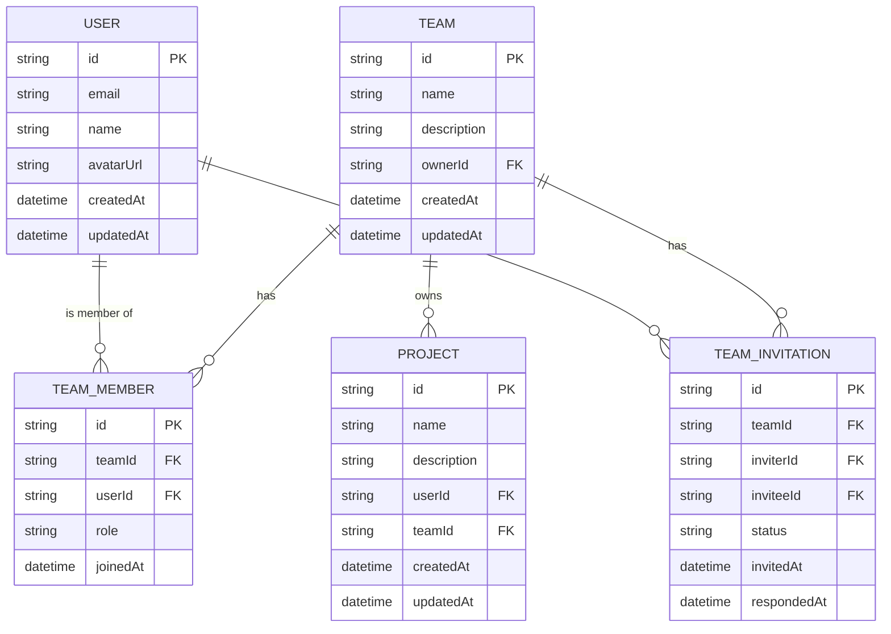
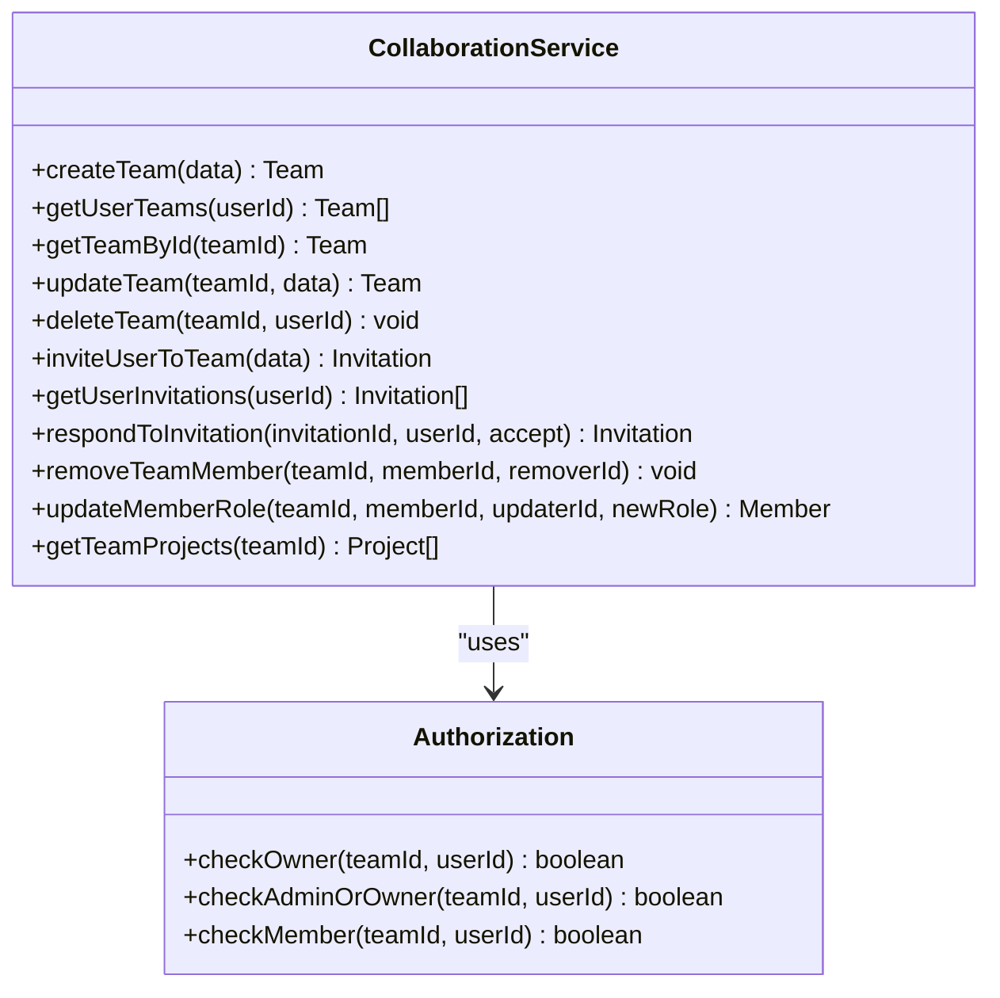
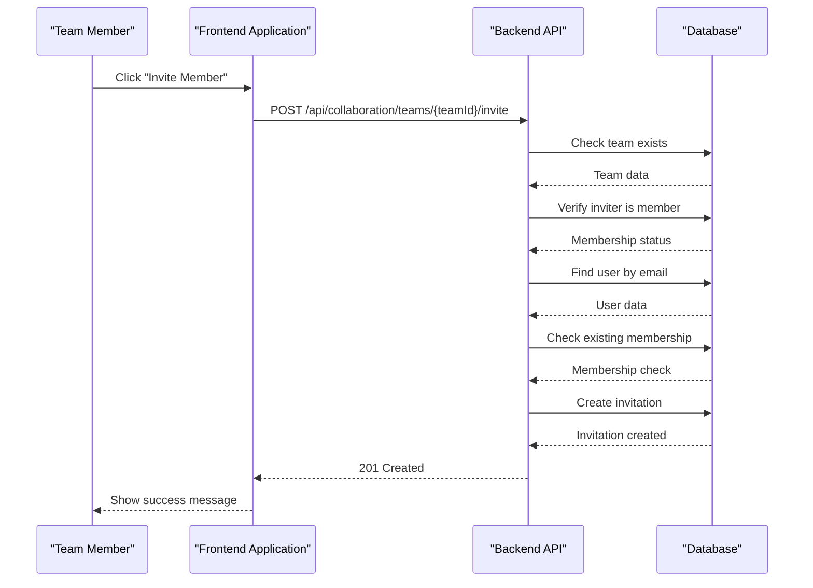
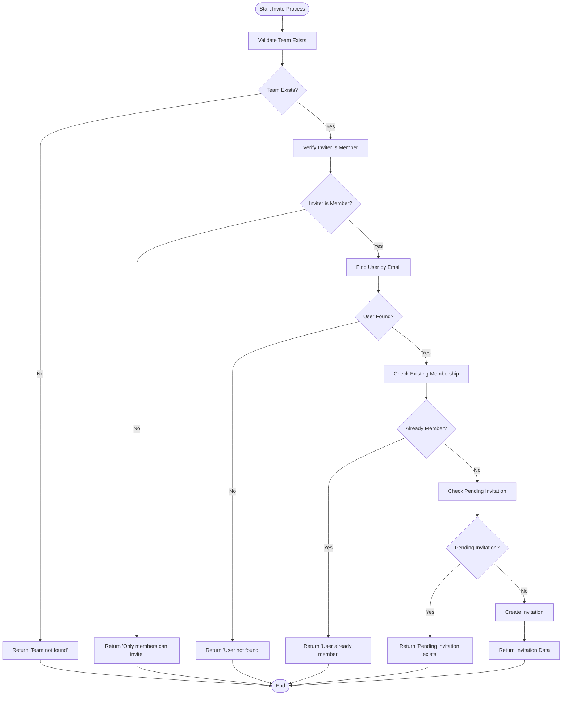
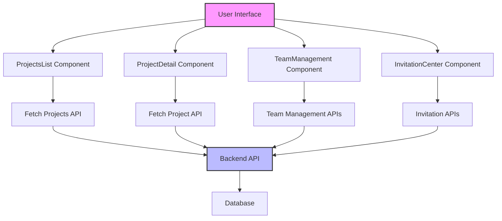
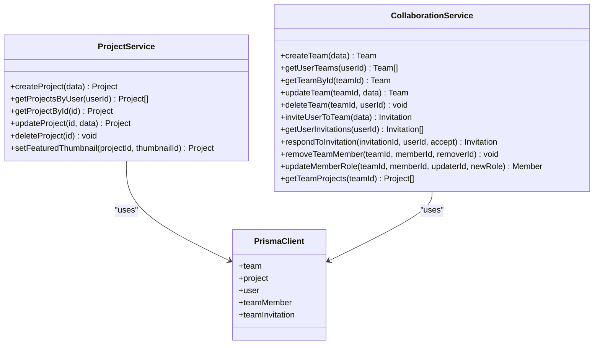

# Collaboration Features

<cite>
**Referenced Files in This Document**
- [collaboration.service.ts](file://pikzels-clone\src\modules\collaboration\collaboration.service.ts)
- [collaboration.controller.ts](file://pikzels-clone\src\modules\collaboration\collaboration.controller.ts)
- [collaboration.routes.ts](file://pikzels-clone\src\modules\collaboration\collaboration.routes.ts)
- [project.service.ts](file://pikzels-clone\src\modules\project\project.service.ts)
- [ProjectDetail.tsx](file://pikzels-clone\client\src\components\projects\ProjectDetail.tsx)
- [ProjectsList.tsx](file://pikzels-clone\client\src\components\projects\ProjectsList.tsx)
- [migration.sql](file://pikzels-clone\prisma\migrations\20250829072650_init\migration.sql)
- [collaboration.md](file://pikzels-clone\docs\collaboration.md)
</cite>

## Update Summary
**Changes Made**
- Updated TypeScript error handling section to reflect explicit type assertions for req.params
- Enhanced API endpoint documentation with improved type safety examples
- Added TypeScript best practices for Express.js route parameter handling
- Updated code examples to demonstrate proper type assertion patterns

## Table of Contents
1. [Introduction](#introduction)
2. [Project Organization Model](#project-organization-model)
3. [Access Control System](#access-control-system)
4. [Real-Time Collaboration Patterns](#real-time-collaboration-patterns)
5. [Conflict Resolution Mechanisms](#conflict-resolution-mechanisms)
6. [TypeScript Error Handling and Type Safety](#typescript-error-handling-and-type-safety)
7. [User Interface for Project Management](#user-interface-for-project-management)
8. [Data Consistency and Synchronization](#data-consistency-and-synchronization)
9. [Team Workflow Best Practices](#team-workflow-best-practices)
10. [Conclusion](#conclusion)

## Introduction

The Collaboration Features in the Thumbnail Maker application enable team-based project management, allowing multiple users to collaborate on thumbnail creation. This comprehensive system provides a structured approach to team organization, access control, and collaborative workflows. The implementation follows a modular architecture with well-defined backend services and frontend components that work together to create a seamless collaborative experience.

The system is built around teams as the primary organizational unit, where users can create teams, invite members, and manage team projects. Each team has a clear ownership structure with role-based permissions that control what actions team members can perform. The collaboration system integrates with the existing project management functionality, extending it to support team ownership and shared access.

**Section sources**
- [collaboration.md](file://pikzels-clone\docs\collaboration.md#L1-L583)

## Project Organization Model

The project organization model is centered around teams, which serve as containers for users and projects. The system implements a hierarchical structure where teams can own multiple projects, and team members can collaborate on these projects based on their assigned roles.

The core entities in the organization model are:

- **Team**: The primary organizational unit that groups users together
- **TeamMember**: Represents a user's membership in a team with a specific role
- **TeamInvitation**: Manages the process of inviting users to join teams
- **Project**: Extended to support team ownership through the teamId field

The database schema defines relationships between these entities, with teams having a one-to-many relationship with both team members and projects. Each team has an owner who has elevated privileges, and members are assigned roles that determine their level of access and permissions within the team.



**Diagram sources**
- [migration.sql](file://pikzels-clone\prisma\migrations\20250829072650_init\migration.sql#L1-L52)

**Section sources**
- [collaboration.service.ts](file://pikzels-clone\src\modules\collaboration\collaboration.service.ts#L4-L432)
- [collaboration.md](file://pikzels-clone\docs\collaboration.md#L1-L583)

## Access Control System

The access control system implements role-based permissions to manage user access to team resources. Three distinct roles are defined within teams: owner, admin, and member, each with different levels of authority and capabilities.

The owner role has the highest level of permissions, including the ability to:
- Create and delete teams
- Update team information
- Invite and remove team members
- Update member roles
- Delete the team

Admins have elevated privileges compared to regular members, allowing them to:
- Invite new members to the team
- Remove existing members (except the owner)
- Access all team projects

Regular members have more limited permissions:
- Can view team information and members
- Can access team projects
- Can respond to invitations
- Cannot modify team structure or membership

The system enforces these permissions through authorization checks in the backend services. Before executing any sensitive operation, the system verifies that the requesting user has the appropriate role and permissions. For example, when updating a member's role, only the team owner can perform this action, as verified in the `updateMemberRole` method of the CollaborationService.



**Diagram sources**
- [collaboration.service.ts](file://pikzels-clone\src\modules\collaboration\collaboration.service.ts#L4-L432)

**Section sources**
- [collaboration.service.ts](file://pikzels-clone\src\modules\collaboration\collaboration.service.ts#L4-L432)
- [collaboration.controller.ts](file://pikzels-clone\src\modules\collaboration\collaboration.controller.ts#L3-L260)

## Real-Time Collaboration Patterns

The real-time collaboration patterns in the Thumbnail Maker application are designed to facilitate seamless teamwork while maintaining data integrity. The system implements a request-response model for team management operations, ensuring that all changes are properly coordinated and validated.

Key collaboration patterns include:

1. **Team Creation Workflow**: When a user creates a team, they automatically become the owner and are added as a member with owner privileges. This establishes clear ownership from the beginning.

2. **Invitation System**: Team members can invite others to join through an email-based invitation system. The invitee receives a notification and can accept or decline the invitation through the user interface.

3. **Role Management**: Owners can promote members to admin status or demote admins to member status, allowing for flexible team management as projects evolve.

4. **Project Sharing**: Projects can be associated with teams, making them accessible to all team members according to their permission levels.

The API endpoints for collaboration are organized in a RESTful manner, with clear routes for each operation. The system uses standard HTTP methods and status codes to communicate the results of operations, making it easy to integrate with frontend components.



**Diagram sources**
- [collaboration.controller.ts](file://pikzels-clone\src\modules\collaboration\collaboration.controller.ts#L3-L260)
- [collaboration.routes.ts](file://pikzels-clone\src\modules\collaboration\collaboration.routes.ts#L1-L46)

**Section sources**
- [collaboration.controller.ts](file://pikzels-clone\src\modules\collaboration\collaboration.controller.ts#L3-L260)
- [collaboration.routes.ts](file://pikzels-clone\src\modules\collaboration\collaboration.routes.ts#L1-L46)

## Conflict Resolution Mechanisms

The system implements several conflict resolution mechanisms to handle potential issues that may arise during collaborative work. These mechanisms are designed to prevent data inconsistencies and ensure a smooth user experience.

Key conflict resolution strategies include:

1. **Membership Validation**: Before adding a user to a team, the system checks whether they are already a member or have a pending invitation. This prevents duplicate entries and conflicting states.

2. **Role Protection**: The system protects certain roles from modification. For example, team owners cannot be removed by other members, and only owners can change member roles, preventing privilege escalation.

3. **Ownership Verification**: Sensitive operations like team deletion require verification that the requesting user is the team owner, preventing unauthorized modifications.

4. **State Management**: The invitation system uses a status field to track the state of invitations (pending, accepted, declined), ensuring that users cannot respond to invitations multiple times.

The backend services implement comprehensive error handling to provide meaningful feedback when conflicts occur. For example, if a user tries to invite someone who is already a member, the system returns a specific error message rather than allowing the operation to proceed.



**Diagram sources**
- [collaboration.service.ts](file://pikzels-clone\src\modules\collaboration\collaboration.service.ts#L4-L432)

**Section sources**
- [collaboration.service.ts](file://pikzels-clone\src\modules\collaboration\collaboration.service.ts#L4-L432)

## TypeScript Error Handling and Type Safety

**Updated** The collaboration controller has been enhanced with explicit type assertions to resolve TypeScript errors in Express.js req.params handling. These improvements ensure type safety while maintaining compatibility with the Express.js framework.

The TypeScript errors were primarily occurring in route parameter extraction where `req.params` properties were typed as `string | string[]` or potentially undefined. The solution involved implementing explicit type assertions using the `as string` operator to safely convert route parameters to string types.

Key improvements include:

1. **Explicit Type Assertions**: All route parameters now use explicit type assertions:
   ```typescript
   const id = req.params.id as string;
   const teamId = req.params.teamId as string;
   const memberId = req.params.memberId as string;
   ```

2. **Consistent Parameter Validation**: Each parameter extraction is paired with validation to ensure parameters exist before use:
   ```typescript
   if (!id) {
     return res.status(400).json({ error: 'Team ID is required' });
   }
   ```

3. **Type-Safe Route Handlers**: The controller methods now properly handle the mixed types that Express.js params can contain, preventing runtime type errors.

4. **Enhanced Error Handling**: Improved error handling with specific validation messages for missing or invalid parameters.

These changes demonstrate best practices for TypeScript development with Express.js, showing how to handle the framework's dynamic typing while maintaining type safety in the application code.

**Section sources**
- [collaboration.controller.ts](file://pikzels-clone\src\modules\collaboration\collaboration.controller.ts#L47-L244)

## User Interface for Project Management

The user interface for project management provides team members with the tools they need to collaborate effectively on thumbnail creation projects. The frontend components are designed to be intuitive and user-friendly, with clear visual indicators of team membership and project status.

Key UI components include:

- **Project List**: Displays all projects accessible to the user, including both personal and team projects. Projects are organized with clear labels indicating their ownership and status.

- **Project Detail View**: Provides comprehensive information about a specific project, including its name, description, creation date, and associated thumbnails.

- **Team Management Interface**: Allows team owners and admins to manage team members, send invitations, and update roles.

- **Invitation Center**: Shows pending invitations for the user to accept or decline, with clear information about the inviting team and member.

The UI components are implemented as React components that communicate with the backend API through HTTP requests. Authentication tokens are included in requests to ensure that users can only access resources they have permission to view.



**Diagram sources**
- [ProjectsList.tsx](file://pikzels-clone\client\src\components\projects\ProjectsList.tsx#L1-L229)
- [ProjectDetail.tsx](file://pikzels-clone\client\src\components\projects\ProjectDetail.tsx#L1-L186)

**Section sources**
- [ProjectsList.tsx](file://pikzels-clone\client\src\components\projects\ProjectsList.tsx#L1-L229)
- [ProjectDetail.tsx](file://pikzels-clone\client\src\components\projects\ProjectDetail.tsx#L1-L186)

## Data Consistency and Synchronization

The system ensures data consistency and synchronization through several mechanisms that coordinate changes across the application. These mechanisms are critical for maintaining the integrity of team data and project information.

Key synchronization strategies include:

1. **Database Transactions**: The Prisma ORM provides transaction support that ensures related operations are completed atomically. For example, when creating a team, the team record and the owner's membership are created in a single transaction.

2. **Foreign Key Constraints**: The database schema includes foreign key constraints that maintain referential integrity between related entities, such as ensuring that team members reference valid users and teams.

3. **Cascading Operations**: When a team is deleted, related records (members and invitations) are automatically removed through cascading deletes, preventing orphaned data.

4. **State Synchronization**: The frontend components use React's state management to keep the UI synchronized with the backend data. After successful API calls, the local state is updated to reflect the changes.

The system also implements validation at multiple levels to prevent inconsistent data from being stored. Input validation occurs on both the frontend and backend, with the backend serving as the final authority on data validity.



**Diagram sources**
- [project.service.ts](file://pikzels-clone\src\modules\project\project.service.ts#L4-L80)
- [collaboration.service.ts](file://pikzels-clone\src\modules\collaboration\collaboration.service.ts#L4-L432)

**Section sources**
- [project.service.ts](file://pikzels-clone\src\modules\project\project.service.ts#L4-L80)
- [collaboration.service.ts](file://pikzels-clone\src\modules\collaboration\collaboration.service.ts#L4-L432)

## Team Workflow Best Practices

To maximize the effectiveness of the collaboration features, teams should follow these best practices for managing their workflows:

1. **Clear Ownership Structure**: Establish a clear ownership structure from the beginning, with designated team owners who are responsible for overall team management.

2. **Role Assignment**: Assign roles based on team members' responsibilities and expertise. Use admin roles for team leads or senior members who need additional management capabilities.

3. **Project Organization**: Organize projects logically within teams, grouping related thumbnail creation efforts together for easier management.

4. **Communication**: Use the invitation system and team management features to keep all members informed about team changes and project updates.

5. **Access Control**: Regularly review team membership and permissions to ensure that only appropriate individuals have access to sensitive projects.

6. **Documentation**: Maintain clear documentation of team processes and project requirements to ensure consistency across team members.

7. **Version Control**: While the system doesn't implement traditional version control, teams should establish naming conventions and organization strategies for thumbnails to track iterations and variations.

By following these best practices, teams can leverage the collaboration features to work more efficiently and produce higher quality thumbnails through coordinated efforts.

**Section sources**
- [collaboration.md](file://pikzels-clone\docs\collaboration.md#L1-L583)

## Conclusion

The Collaboration Features in the Thumbnail Maker application provide a comprehensive solution for team-based project management in thumbnail creation. The system's well-structured organization model, robust access control, and thoughtful conflict resolution mechanisms create a solid foundation for effective collaboration.

The implementation demonstrates a clear separation of concerns between frontend and backend components, with well-defined APIs that facilitate integration. The use of role-based permissions ensures that team members have appropriate access to resources while maintaining security and data integrity.

Recent improvements in TypeScript error handling have enhanced the reliability and type safety of the collaboration controller, demonstrating best practices for working with Express.js route parameters in TypeScript applications. These enhancements contribute to a more maintainable and error-resistant codebase.

For future enhancements, the system could benefit from additional features such as team communication tools, activity feeds, and more granular permission controls. However, the current implementation provides a solid foundation that can be extended as needed to meet evolving collaboration requirements.

The documentation and code structure indicate a well-planned development process, with attention to both functionality and user experience. By following the established patterns and best practices, teams can effectively leverage these collaboration features to enhance their thumbnail creation workflows.

**Section sources**
- [collaboration.md](file://pikzels-clone\docs\collaboration.md#L1-L583)