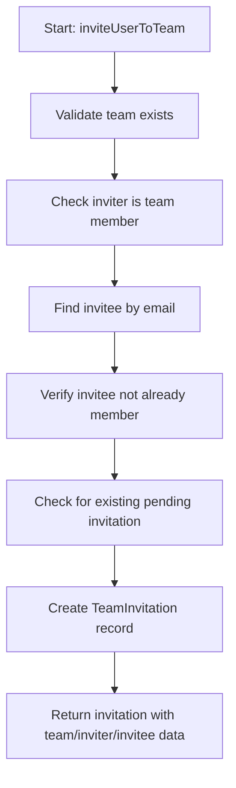
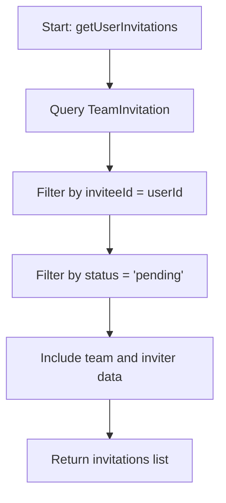
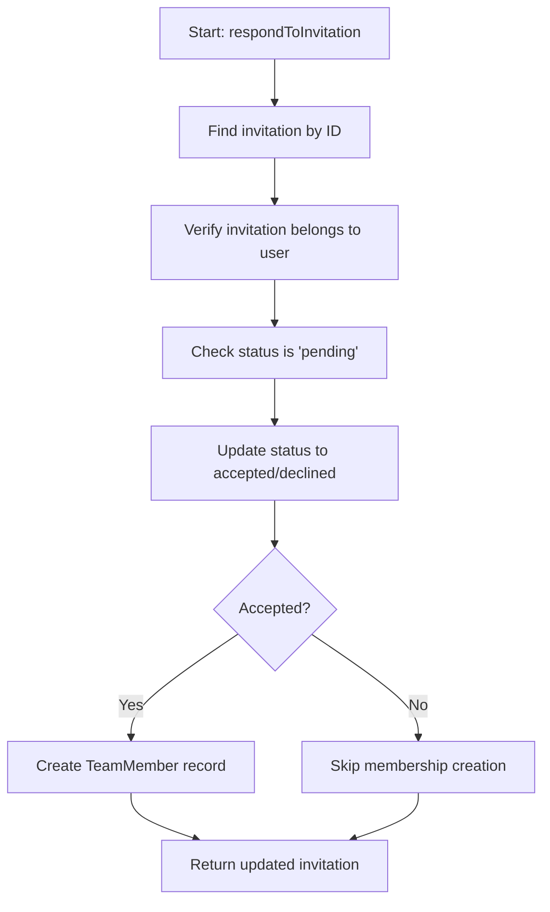
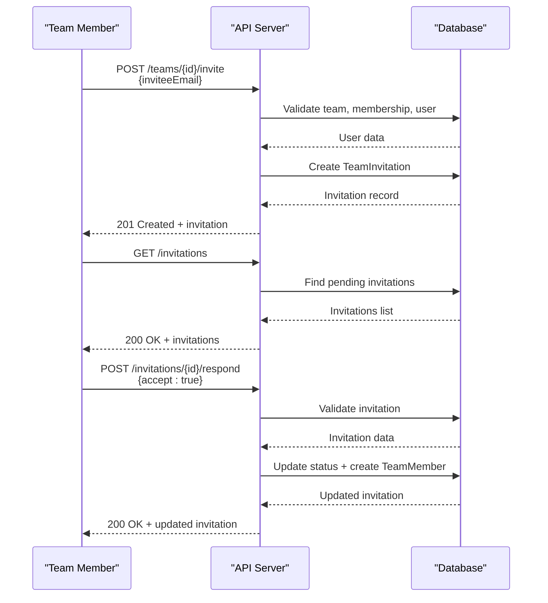
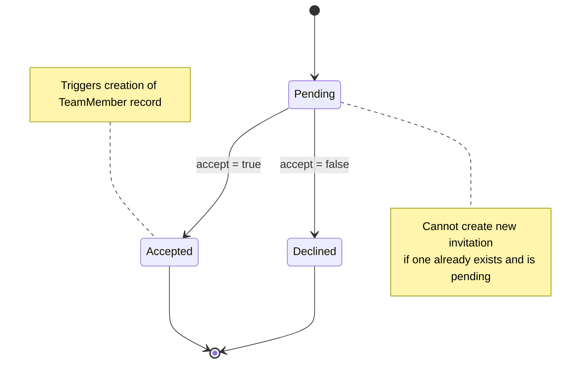

# Team Invitations System

<cite>
**Referenced Files in This Document**   
- [collaboration.md](file://pikzels-clone/docs/collaboration.md)
- [collaboration.service.ts](file://pikzels-clone/src/modules/collaboration/collaboration.service.ts)
- [collaboration.controller.ts](file://pikzels-clone/src/modules/collaboration/collaboration.controller.ts)
- [collaboration.routes.ts](file://pikzels-clone/src/modules/collaboration/collaboration.routes.ts)
</cite>

## Table of Contents
1. [TeamInvitation Model](#teaminvitation-model)
2. [Service Methods](#service-methods)
3. [API Endpoints](#api-endpoints)
4. [Invitation Workflow](#invitation-workflow)
5. [Edge Cases and Validation](#edge-cases-and-validation)
6. [Troubleshooting Guide](#troubleshooting-guide)

## TeamInvitation Model

The `TeamInvitation` model represents an invitation sent to a user to join a team. It contains essential fields to track the invitation lifecycle and relationships.

| Field | Type | Description |
|-------|------|-------------|
| id | String (UUID) | Unique identifier for the invitation |
| teamId | String | Reference to the team being joined |
| inviterId | String | ID of the user who sent the invitation |
| inviteeId | String | ID of the user who received the invitation |
| status | String | Current status of the invitation ("pending", "accepted", "declined") |
| invitedAt | DateTime | Timestamp when the invitation was created |
| respondedAt | DateTime (optional) | Timestamp when the invitation was responded to |

**Section sources**
- [collaboration.md](file://pikzels-clone/docs/collaboration.md#L50-L61)

## Service Methods

### inviteUserToTeam
This method handles the core logic for sending a team invitation. It performs multiple validation checks before creating an invitation.

Validation logic includes:
- Team existence verification
- Inviter membership check in the target team
- Invitee existence by email lookup
- Prevention of duplicate invitations for the same user and team
- Ensuring the invitee is not already a team member



**Diagram sources**
- [collaboration.service.ts](file://pikzels-clone/src/modules/collaboration/collaboration.service.ts#L155-L241)

**Section sources**
- [collaboration.service.ts](file://pikzels-clone/src/modules/collaboration/collaboration.service.ts#L155-L241)

### getUserInvitations
Retrieves all pending invitations for the current user. The method filters invitations by:
- Current user as invitee
- Status equal to "pending"

The response includes team information and inviter details for display purposes.



**Diagram sources**
- [collaboration.service.ts](file://pikzels-clone/src/modules/collaboration/collaboration.service.ts#L246-L264)

**Section sources**
- [collaboration.service.ts](file://pikzels-clone/src/modules/collaboration/collaboration.service.ts#L246-L264)

### respondToInvitation
Handles the response (accept/decline) to a team invitation. The method ensures:
- Invitation exists and belongs to the current user
- Invitation is still in "pending" status
- Updates the invitation status and timestamp
- Adds user as team member if accepted



**Diagram sources**
- [collaboration.service.ts](file://pikzels-clone/src/modules/collaboration/collaboration.service.ts#L269-L309)

**Section sources**
- [collaboration.service.ts](file://pikzels-clone/src/modules/collaboration/collaboration.service.ts#L269-L309)

## API Endpoints

### POST /api/collaboration/teams/:teamId/invite
Sends an invitation to a user to join a team.

**Request Example:**
```json
{
  "inviteeEmail": "user@example.com"
}
```

**Response Example (201 Created):**
```json
{
  "id": "uuid",
  "teamId": "team-uuid",
  "inviterId": "user-uuid",
  "inviteeId": "invitee-uuid",
  "status": "pending",
  "invitedAt": "2025-09-15T10:00:00Z",
  "respondedAt": null,
  "team": { "id": "team-uuid", "name": "Design Team" },
  "inviter": { "id": "user-uuid", "name": "John Doe", "email": "john@example.com" },
  "invitee": { "id": "invitee-uuid", "name": "Jane Smith", "email": "user@example.com" }
}
```

**Section sources**
- [collaboration.controller.ts](file://pikzels-clone/src/modules/collaboration/collaboration.controller.ts#L121-L145)
- [collaboration.routes.ts](file://pikzels-clone/src/modules/collaboration/collaboration.routes.ts#L20-L22)

### GET /api/collaboration/invitations
Retrieves all pending invitations for the authenticated user.

**Response Example (200 OK):**
```json
[
  {
    "id": "uuid",
    "teamId": "team-uuid",
    "inviterId": "user-uuid",
    "inviteeId": "current-user-uuid",
    "status": "pending",
    "invitedAt": "2025-09-15T10:00:00Z",
    "respondedAt": null,
    "team": { "id": "team-uuid", "name": "Marketing Team" },
    "inviter": { "id": "user-uuid", "name": "Alice Johnson", "email": "alice@example.com", "avatarUrl": "url" }
  }
]
```

**Section sources**
- [collaboration.controller.ts](file://pikzels-clone/src/modules/collaboration/collaboration.controller.ts#L150-L163)
- [collaboration.routes.ts](file://pikzels-clone/src/modules/collaboration/collaboration.routes.ts#L38-L40)

### POST /api/collaboration/invitations/:id/respond
Responds to a team invitation (accept or decline).

**Request Example:**
```json
{
  "accept": true
}
```

**Response Example (200 OK):**
```json
{
  "id": "uuid",
  "teamId": "team-uuid",
  "inviterId": "user-uuid",
  "inviteeId": "current-user-uuid",
  "status": "accepted",
  "invitedAt": "2025-09-15T10:00:00Z",
  "respondedAt": "2025-09-15T10:05:00Z"
}
```

**Section sources**
- [collaboration.controller.ts](file://pikzels-clone/src/modules/collaboration/collaboration.controller.ts#L168-L192)
- [collaboration.routes.ts](file://pikzels-clone/src/modules/collaboration/collaboration.routes.ts#L42-L44)

## Invitation Workflow

The complete invitation workflow involves three main steps:



**Diagram sources**
- [collaboration.controller.ts](file://pikzels-clone/src/modules/collaboration/collaboration.controller.ts#L121-L192)
- [collaboration.service.ts](file://pikzels-clone/src/modules/collaboration/collaboration.service.ts#L155-L309)

## Edge Cases and Validation

The system handles several edge cases to ensure data integrity:

- **Duplicate invitations**: Prevents multiple pending invitations to the same user for the same team
- **Expired invitations**: While no explicit expiration is implemented, the system prevents responding to already-responded invitations
- **Status transitions**: Only allows transition from "pending" to either "accepted" or "declined"
- **Authorization**: Ensures users can only respond to their own invitations
- **Membership conflicts**: Prevents inviting users who are already team members



**Diagram sources**
- [collaboration.service.ts](file://pikzels-clone/src/modules/collaboration/collaboration.service.ts#L155-L309)

**Section sources**
- [collaboration.service.ts](file://pikzels-clone/src/modules/collaboration/collaboration.service.ts#L155-L309)

## Troubleshooting Guide

Common issues and their solutions:

| Error Message | Cause | Solution |
|---------------|------|----------|
| "Team not found" | Invalid teamId in request | Verify the team ID exists and is correct |
| "Only team members can invite others" | User not in team | Ensure the inviting user is a member of the team |
| "User with this email not found" | Invitee email doesn't exist | Verify the email address is registered in the system |
| "User is already a member of this team" | User already in team | No action needed - user can access team resources |
| "User already has a pending invitation" | Duplicate invitation attempt | Check existing invitations or wait for response |
| "Invitation not found or not authorized" | Invalid ID or wrong user | Verify invitation ID and that current user is the invitee |
| "Invitation already responded to" | Attempting to respond twice | No action possible - invitation lifecycle complete |

**Section sources**
- [collaboration.service.ts](file://pikzels-clone/src/modules/collaboration/collaboration.service.ts#L155-L309)
- [collaboration.controller.ts](file://pikzels-clone/src/modules/collaboration/collaboration.controller.ts#L121-L192)