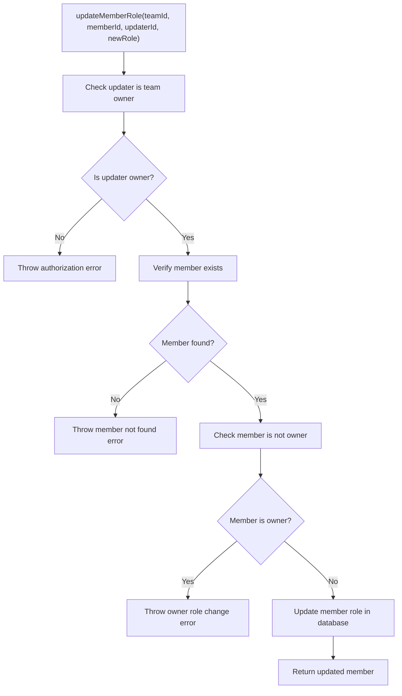
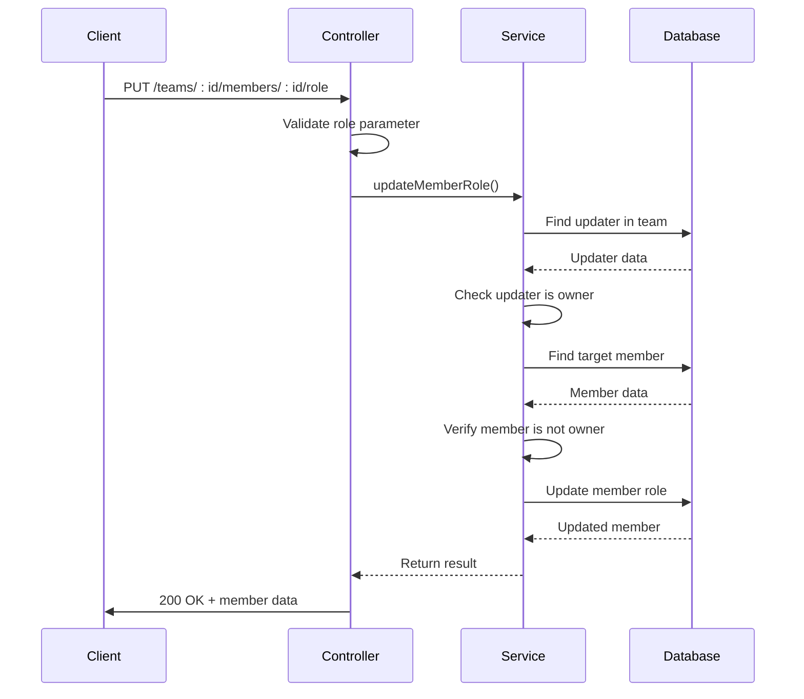
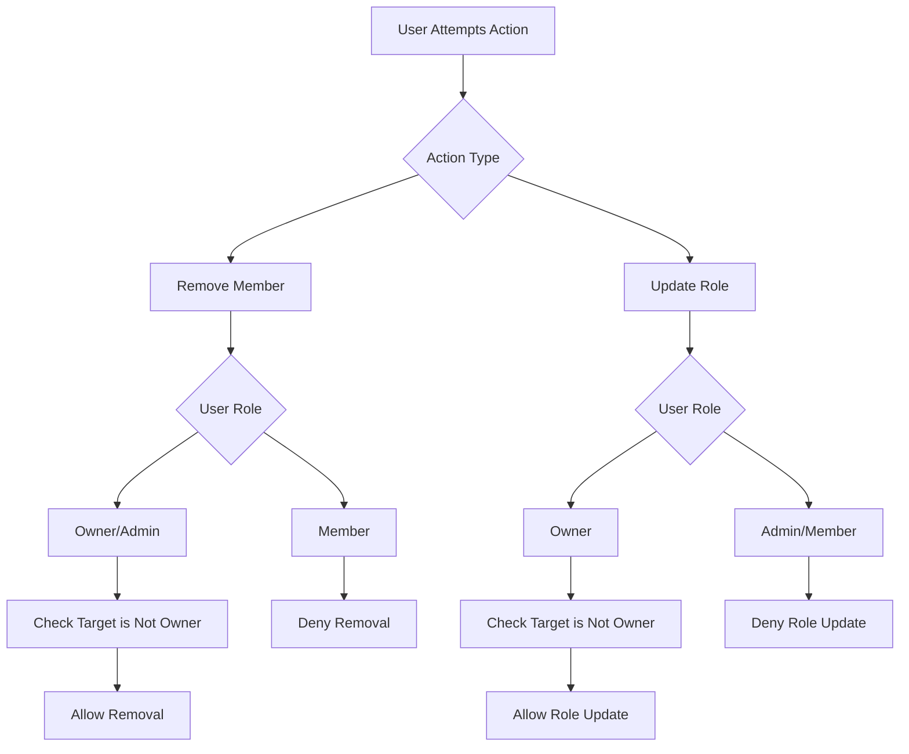

# Team Membership & Roles

<cite>
**Referenced Files in This Document**   
- [collaboration.service.ts](file://pikzels-clone\src\modules\collaboration\collaboration.service.ts)
- [collaboration.controller.ts](file://pikzels-clone\src\modules\collaboration\collaboration.controller.ts)
- [collaboration.md](file://pikzels-clone\docs\collaboration.md)
</cite>

## Table of Contents
1. [TeamMember Model](#teammember-model)
2. [Service Methods](#service-methods)
3. [API Endpoints](#api-endpoints)
4. [Authorization Logic](#authorization-logic)
5. [Error Handling](#error-handling)
6. [Troubleshooting Guide](#troubleshooting-guide)

## TeamMember Model

The TeamMember model represents the relationship between users and teams, capturing membership details and role assignments. This model serves as the foundation for team-based collaboration within the application.

| Field | Type | Description |
|-------|------|-------------|
| id | String (UUID) | Unique identifier for the membership |
| teamId | String | Reference to the team |
| userId | String | Reference to the user |
| role | String | Member role ("owner", "admin", "member") |
| joinedAt | DateTime | When the user joined the team |

The model establishes a many-to-many relationship between users and teams through explicit membership records. Each team member is assigned one of three roles that determine their permissions within the team: "owner" (full control), "admin" (management capabilities), or "member" (basic participation).

**Section sources**
- [collaboration.md](file://pikzels-clone\docs\collaboration.md#L40-L49)

## Service Methods

The collaboration service provides two key methods for managing team membership and roles: `removeTeamMember` and `updateMemberRole`. These methods encapsulate the business logic for modifying team composition and permissions.

### removeTeamMember Method

This method handles the removal of a member from a team, implementing appropriate authorization checks and business rules. The method accepts three parameters: `teamId` (the team from which to remove a member), `memberId` (the user to be removed), and `removerId` (the user initiating the removal).

### updateMemberRole Method

This method manages role changes for team members, ensuring that only authorized users can modify roles. It accepts four parameters: `teamId` (the team containing the member), `memberId` (the user whose role is being changed), `updaterId` (the user making the change), and `newRole` (the role to assign).



**Diagram sources**
- [collaboration.service.ts](file://pikzels-clone\src\modules\collaboration\collaboration.service.ts#L359-L402)

**Section sources**
- [collaboration.service.ts](file://pikzels-clone\src\modules\collaboration\collaboration.service.ts#L314-L402)

## API Endpoints

The team membership functionality is exposed through RESTful API endpoints that follow standard conventions for resource manipulation.

### DELETE /api/collaboration/teams/:teamId/members/:memberId

This endpoint removes a member from a team. It requires authentication and appropriate authorization based on the requester's role.

##### Request
```http
DELETE /api/collaboration/teams/team-123/members/member-456
Authorization: Bearer <token>
```

##### Response
```http
HTTP/1.1 204 No Content
```

### PUT /api/collaboration/teams/:teamId/members/:memberId/role

This endpoint updates a member's role within a team. The request body must include the new role to be assigned.

##### Request
```http
PUT /api/collaboration/teams/team-123/members/member-456/role
Authorization: Bearer <token>
Content-Type: application/json

{
  "role": "admin"
}
```

##### Response
```json
{
  "id": "member-456",
  "teamId": "team-123",
  "userId": "user-789",
  "role": "admin",
  "joinedAt": "2023-01-01T00:00:00.000Z"
}
```



**Diagram sources**
- [collaboration.controller.ts](file://pikzels-clone\src\modules\collaboration\collaboration.controller.ts#L216-L241)
- [collaboration.service.ts](file://pikzels-clone\src\modules\collaboration\collaboration.service.ts#L359-L402)

**Section sources**
- [collaboration.md](file://pikzels-clone\docs\collaboration.md#L345-L374)

## Authorization Logic

The system implements role-based access control to ensure that team management operations are performed only by authorized users according to their roles.

### Role Hierarchy and Permissions

- **Owner**: Has full control over the team, including the ability to update any member's role (except their own) and remove members
- **Admin**: Can remove members from the team but cannot change roles
- **Member**: Has no team management privileges

### Access Control Rules

For the `removeTeamMember` operation:
- Only users with "owner" or "admin" roles can remove members
- Owners and admins cannot remove the team owner
- Users cannot remove themselves (though this is not explicitly prevented, it's covered by other rules)

For the `updateMemberRole` operation:
- Only the team owner can update member roles
- The owner cannot change their own role
- The owner cannot change another owner's role (though the system only allows one owner)



**Diagram sources**
- [collaboration.service.ts](file://pikzels-clone\src\modules\collaboration\collaboration.service.ts#L314-L402)

**Section sources**
- [collaboration.service.ts](file://pikzels-clone\src\modules\collaboration\collaboration.service.ts#L314-L402)

## Error Handling

The system implements comprehensive error handling to provide meaningful feedback for various failure scenarios in team membership operations.

### Common Error Scenarios

| Error Type | HTTP Status | Response Body | Trigger Condition |
|------------|-------------|---------------|-------------------|
| Unauthorized Access | 500 | {error: "Not authorized to remove members"} | Non-owner/admin attempts removal |
| Unauthorized Role Update | 500 | {error: "Only team owners can update member roles"} | Non-owner attempts role change |
| Member Not Found | 500 | {error: "Member not found"} | Target member doesn't exist |
| Invalid Request | 400 | {error: "Role is required"} | Missing role in update request |
| Internal Server Error | 500 | {error: "Failed to remove team member"} | Unhandled exceptions |

The error handling follows a consistent pattern across both service methods, using try-catch blocks in the controller layer to catch exceptions thrown by the service layer and convert them to appropriate HTTP responses.

**Section sources**
- [collaboration.controller.ts](file://pikzels-clone\src\modules\collaboration\collaboration.controller.ts#L197-L241)

## Troubleshooting Guide

This section addresses common issues encountered when managing team membership and roles, along with their solutions.

### Permission Denied Errors

**Symptom**: Receiving "Not authorized to remove members" or "Only team owners can update member roles" errors.

**Causes and Solutions**:
- **Non-admin trying to remove members**: Only owners and admins can remove members. Ensure the requesting user has the appropriate role.
- **Non-owner trying to update roles**: Only owners can update member roles. Verify the user is the team owner.
- **Invalid authentication token**: Ensure the request includes a valid JWT token in the Authorization header.

### Cannot Remove or Modify Owner

**Symptom**: Receiving "Cannot remove team owner" or "Cannot change team owner role" errors.

**Explanation**: These are intentional restrictions in the system design. The team owner has special status and cannot be removed or have their role changed through these endpoints.

**Workaround**: If ownership transfer is needed, the current owner must first promote another member to owner, then the new owner can remove the previous owner.

### Member Not Found Errors

**Symptom**: Receiving "Member not found" errors when attempting to remove or update a member.

**Causes and Solutions**:
- **Invalid memberId**: Verify the memberId in the URL path corresponds to an actual team member.
- **Member already removed**: The member may have already been removed from the team.
- **Member belongs to different team**: Ensure the memberId belongs to the team specified in the teamId parameter.

### Role Update Validation Errors

**Symptom**: Receiving "Role is required" errors when updating a member's role.

**Solution**: Ensure the PUT request includes a JSON body with a "role" field specifying the new role ("owner", "admin", or "member").

**Section sources**
- [collaboration.service.ts](file://pikzels-clone\src\modules\collaboration\collaboration.service.ts#L314-L402)
- [collaboration.controller.ts](file://pikzels-clone\src\modules\collaboration\collaboration.controller.ts#L197-L241)