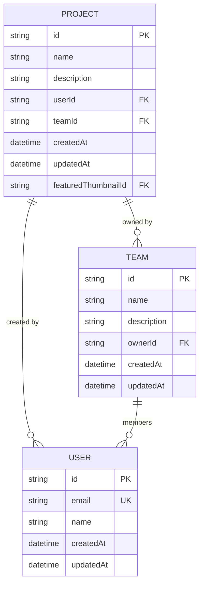
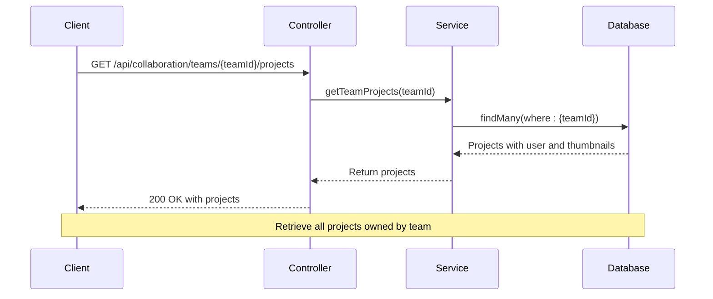
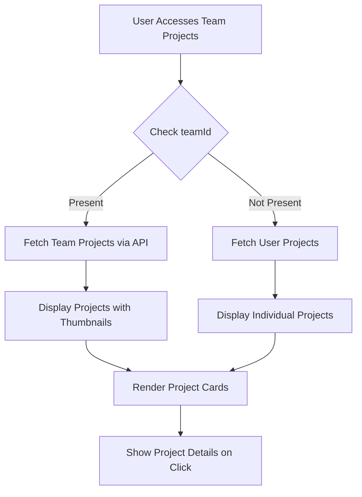
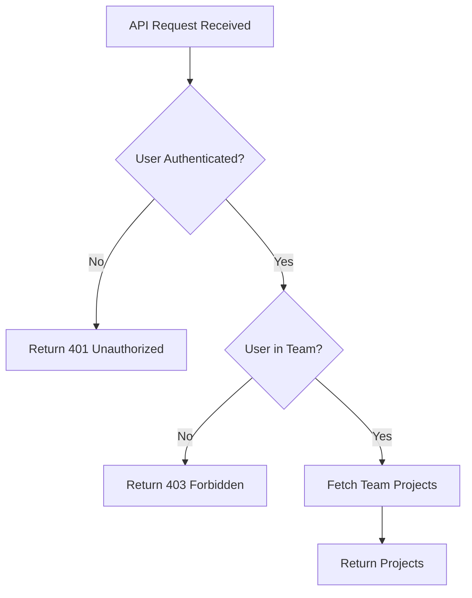

# Team Projects Integration

<cite>
**Referenced Files in This Document**  
- [collaboration.service.ts](file://pikzels-clone\src\modules\collaboration\collaboration.service.ts)
- [collaboration.controller.ts](file://pikzels-clone\src\modules\collaboration\collaboration.controller.ts)
- [ProjectDetail.tsx](file://pikzels-clone\client\src\components\projects\ProjectDetail.tsx)
- [schema.prisma](file://pikzels-clone\prisma\schema.prisma)
- [project.service.ts](file://pikzels-clone\src\modules\project\project.service.ts)
- [project.controller.ts](file://pikzels-clone\src\modules\project\project.controller.ts)
- [ProjectsList.tsx](file://pikzels-clone\client\src\components\projects\ProjectsList.tsx)
</cite>

## Table of Contents
1. [Introduction](#introduction)
2. [Project Model Extension](#project-model-extension)
3. [Team Projects Service](#team-projects-service)
4. [API Endpoint Specification](#api-endpoint-specification)
5. [Frontend Integration](#frontend-integration)
6. [Access Control and Security](#access-control-and-security)
7. [Performance Optimization](#performance-optimization)
8. [Troubleshooting Guide](#troubleshooting-guide)

## Introduction

The Team Projects Integration feature enables collaborative project management by allowing projects to be owned by teams rather than individual users. This documentation details the implementation of team-owned projects, including the data model changes, service methods, API endpoints, and frontend integration. The system supports retrieving all projects owned by a specific team, displaying them with associated thumbnails and user information, and managing access control when teamId is present.

**Section sources**
- [schema.prisma](file://pikzels-clone\prisma\schema.prisma#L29-L45)
- [collaboration.service.ts](file://pikzels-clone\src\modules\collaboration\collaboration.service.ts#L407-L431)

## Project Model Extension

The Project model has been extended to support team ownership through the addition of a teamId field. This optional field allows projects to be associated with a team while maintaining individual ownership through the userId field. The data model supports both individual and team ownership scenarios, enabling flexible project management.



**Diagram sources**
- [schema.prisma](file://pikzels-clone\prisma\schema.prisma#L29-L45)

**Section sources**
- [schema.prisma](file://pikzels-clone\prisma\schema.prisma#L29-L45)

## Team Projects Service

The `getTeamProjects` service method retrieves all projects owned by a specified team. The implementation includes related data such as user information and project thumbnails to provide a comprehensive view of team projects. The service method efficiently queries the database with appropriate filtering and includes necessary relationships.



**Diagram sources**
- [collaboration.service.ts](file://pikzels-clone\src\modules\collaboration\collaboration.service.ts#L407-L431)
- [collaboration.controller.ts](file://pikzels-clone\src\modules\collaboration\collaboration.controller.ts#L246-L259)

**Section sources**
- [collaboration.service.ts](file://pikzels-clone\src\modules\collaboration\collaboration.service.ts#L407-L431)

## API Endpoint Specification

The API endpoint `GET /api/collaboration/teams/:teamId/projects` provides access to all projects owned by a specific team. The endpoint requires proper authentication and authorization to ensure users can only access projects from teams they belong to.

### Request
```
GET /api/collaboration/teams/cb8a1e23-4f56-4e89-9a1b-2c3d4e5f6a7b/projects
Authorization: Bearer <token>
```

### Response
```json
[
  {
    "id": "a1b2c3d4-e5f6-7g8h-9i10-j11k12l13m14",
    "name": "Marketing Campaign",
    "description": "Q4 marketing materials",
    "createdAt": "2025-09-15T10:30:00Z",
    "updatedAt": "2025-09-15T10:30:00Z",
    "userId": "d4e5f6g7-h8i9-0j1k-2l3m-4n5o6p7q8r9s",
    "teamId": "cb8a1e23-4f56-4e89-9a1b-2c3d4e5f6a7b",
    "featuredThumbnailId": "t1u2v3w4-x5y6-7z8a-9b10-c11d12e13f14",
    "user": {
      "id": "d4e5f6g7-h8i9-0j1k-2l3m-4n5o6p7q8r9s",
      "name": "John Doe",
      "email": "john.doe@example.com"
    },
    "thumbnails": [
      {
        "id": "t1u2v3w4-x5y6-7z8a-9b10-c11d12e13f14",
        "title": "Campaign Banner",
        "imageUrl": "/api/thumbnails/t1u2v3w4-x5y6-7z8a-9b10-c11d12e13f14/image",
        "createdAt": "2025-09-15T10:30:00Z"
      }
    ],
    "_count": {
      "thumbnails": 5
    }
  }
]
```

**Section sources**
- [collaboration.controller.ts](file://pikzels-clone\src\modules\collaboration\collaboration.controller.ts#L246-L259)
- [collaboration.service.ts](file://pikzels-clone\src\modules\collaboration\collaboration.service.ts#L407-L431)

## Frontend Integration

The frontend integration includes components that display team projects and handle the UI presentation. The ProjectDetail component has been enhanced to support team-owned projects, showing appropriate information based on ownership type.



**Diagram sources**
- [ProjectDetail.tsx](file://pikzels-clone\client\src\components\projects\ProjectDetail.tsx#L3-L8)
- [ProjectsList.tsx](file://pikzels-clone\client\src\components\projects\ProjectsList.tsx#L3-L8)

**Section sources**
- [ProjectDetail.tsx](file://pikzels-clone\client\src\components\projects\ProjectDetail.tsx#L3-L8)
- [ProjectsList.tsx](file://pikzels-clone\client\src\components\projects\ProjectsList.tsx#L3-L8)

## Access Control and Security

Access control is implemented at both the service and controller levels to ensure users can only access projects from teams they belong to. The system verifies user membership in the team before returning project data.



**Diagram sources**
- [collaboration.controller.ts](file://pikzels-clone\src\modules\collaboration\collaboration.controller.ts#L246-L259)
- [project.controller.ts](file://pikzels-clone\src\modules\project\project.controller.ts#L70-L85)

**Section sources**
- [collaboration.controller.ts](file://pikzels-clone\src\modules\collaboration\collaboration.controller.ts#L246-L259)
- [project.controller.ts](file://pikzels-clone\src\modules\project\project.controller.ts#L70-L85)

## Performance Optimization

The system implements several performance optimizations for loading team projects and their associated thumbnails:

1. **Limited Thumbnail Loading**: Only 5 most recent thumbnails are loaded per project to reduce payload size
2. **Efficient Database Queries**: The service method uses Prisma's include feature to fetch related data in a single query
3. **Indexing**: Database indexes on teamId and userId fields ensure fast lookups

The implementation balances comprehensive data retrieval with performance considerations, ensuring responsive user experiences even with large numbers of projects and thumbnails.

**Section sources**
- [collaboration.service.ts](file://pikzels-clone\src\modules\collaboration\collaboration.service.ts#L415-L425)
- [schema.prisma](file://pikzels-clone\prisma\schema.prisma#L42-L43)

## Troubleshooting Guide

This section addresses common issues encountered when working with team projects.

### Projects Not Appearing in Team Views

If projects are not appearing in team views, verify the following:

1. **Team ID Assignment**: Ensure the project's teamId field is correctly set to the team's ID
2. **User Membership**: Confirm the user is a member of the team
3. **Data Consistency**: Check that the teamId exists in the Team table and is not null

### Permission Errors When Accessing Team Projects

Permission errors typically occur due to authentication or authorization issues:

1. **Authentication Token**: Verify the request includes a valid Bearer token
2. **Team Membership**: Ensure the authenticated user is a member of the requested team
3. **API Endpoint**: Confirm the correct endpoint format is used: `/api/collaboration/teams/:teamId/projects`

### Data Consistency Issues

When projects are shared across teams, maintain data consistency by:

1. **Single Team Ownership**: Each project should belong to only one team (teamId is a single reference, not a collection)
2. **Ownership Validation**: Always validate team ownership before modifying project data
3. **Cascade Effects**: Consider the impact of team deletion on owned projects

**Section sources**
- [collaboration.service.ts](file://pikzels-clone\src\modules\collaboration\collaboration.service.ts#L407-L431)
- [collaboration.controller.ts](file://pikzels-clone\src\modules\collaboration\collaboration.controller.ts#L246-L259)
- [schema.prisma](file://pikzels-clone\prisma\schema.prisma#L29-L45)