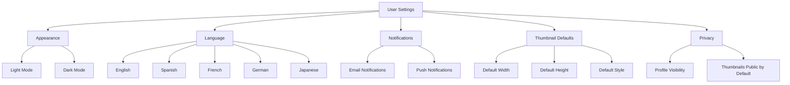
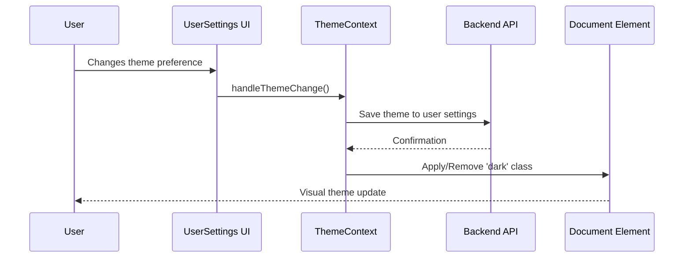
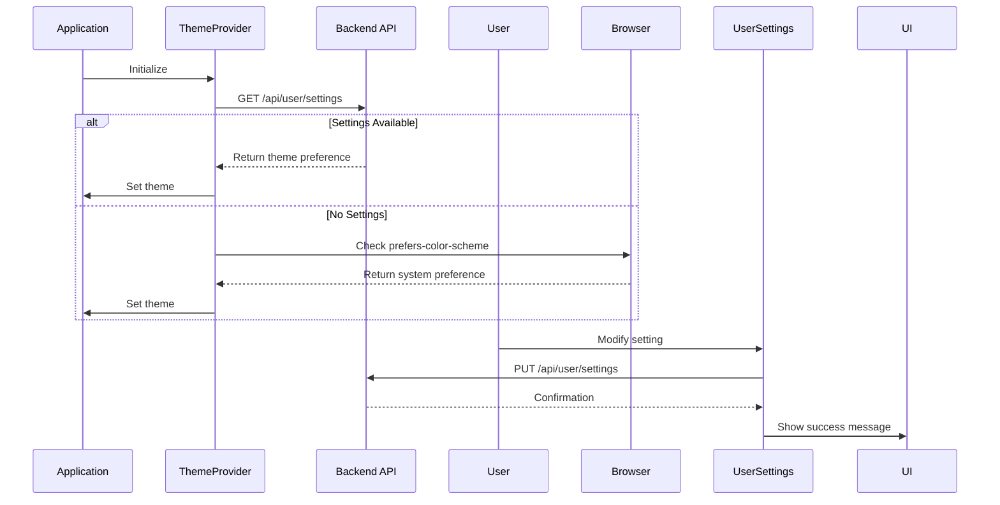

# Configuration & Customization

<cite>
**Referenced Files in This Document**   
- [.env.example](file://pikzels-clone\.env.example) - *Updated with security configuration*
- [ThemeContext.tsx](file://pikzels-clone\client\src\contexts\ThemeContext.tsx) - *Updated in recent commit*
- [UserSettings.tsx](file://pikzels-clone\client\src\components\UserSettings.tsx) - *Updated in recent commit*
- [dark-mode.css](file://pikzels-clone\client\src\styles\dark-mode.css) - *Updated in recent commit*
</cite>

## Update Summary
**Changes Made**   
- Updated Environment Configuration section with new .env.example details
- Enhanced secure configuration management practices
- Added specific security configuration parameters
- Updated section sources to reflect file changes
- Maintained existing user customization and theming documentation

## Table of Contents
1. [Introduction](#introduction)
2. [Environment Configuration](#environment-configuration)
3. [User Customization Options](#user-customization-options)
4. [Theming System Implementation](#theming-system-implementation)
5. [AI Processing and Image Quality Settings](#ai-processing-and-image-quality-settings)
6. [Social Media Defaults](#social-media-defaults)
7. [Configuration Loading and Persistence](#configuration-loading-and-persistence)
8. [Secure Configuration Management](#secure-configuration-management)
9. [Troubleshooting Configuration Issues](#troubleshooting-configuration-issues)

## Introduction
This document provides comprehensive guidance on the configuration and customization capabilities of the Thumbnail Maker application. It covers environment-specific settings, user preferences, theming implementation, and secure configuration practices. The system supports flexible personalization including theme selection, language preferences, default thumbnail parameters, and privacy settings, all designed to enhance user experience while maintaining security and performance.

## Environment Configuration
The application utilizes environment variables through `.env` files to manage configuration across development and production environments. These variables control API endpoints, feature flags, service integrations, and critical security parameters. The recently updated `.env.example` file includes comprehensive security configuration options such as JWT settings, encryption keys, rate limiting, CORS policies, and security headers. Environment-specific overrides allow different behaviors in development versus production, such as enabling debug logging or connecting to staging versus production databases. The configuration system ensures sensitive data remains protected through proper environment segregation and access controls.

**Section sources**
- [.env.example](file://pikzels-clone\.env.example) - *Updated with security configuration*
- [UserSettings.tsx](file://pikzels-clone\client\src\components\UserSettings.tsx#L21-L661)

## User Customization Options
Users can personalize their experience through several configurable options accessible via the User Settings interface. These include theme preferences (light/dark mode), language selection from multiple supported languages, notification preferences (email and push), and default thumbnail parameters such as dimensions and style templates. Privacy settings allow users to control profile visibility and default sharing behavior for newly created thumbnails.

**Diagram sources**
- [UserSettings.tsx](file://pikzels-clone\client\src\components\UserSettings.tsx#L21-L661)

**Section sources**
- [UserSettings.tsx](file://pikzels-clone\client\src\components\UserSettings.tsx#L21-L661)

## Theming System Implementation
The theming system is implemented using React Context through the `ThemeContext` provider, which manages the current theme state and provides a toggle function to switch between light and dark modes. The system checks user preferences stored in the backend, falling back to system preferences via `prefers-color-scheme` if no user setting exists. CSS variables are not used; instead, the application applies a "dark" class to the document element, which triggers corresponding styles defined in `dark-mode.css`. This approach enables seamless theme switching with immediate visual feedback.

**Diagram sources**
- [ThemeContext.tsx](file://pikzels-clone\client\src\contexts\ThemeContext.tsx#L13-L122)
- [UserSettings.tsx](file://pikzels-clone\client\src\components\UserSettings.tsx#L21-L661)
- [dark-mode.css](file://pikzels-clone\client\src\styles\dark-mode.css#L1-L250)

**Section sources**
- [ThemeContext.tsx](file://pikzels-clone\client\src\contexts\ThemeContext.tsx#L13-L122)
- [dark-mode.css](file://pikzels-clone\client\src\styles\dark-mode.css#L1-L250)

## AI Processing and Image Quality Settings
While specific AI processing configuration options are not exposed in the current User Settings interface, the system architecture supports AI-driven thumbnail enhancement features. Image quality settings such as default dimensions (1280x720) and style templates (Bold, Minimalist, Dramatic) serve as foundational parameters for AI processing pipelines. These defaults can be extended to include AI-specific options like enhancement intensity, object detection sensitivity, or automatic caption generation in future iterations.

**Section sources**
- [UserSettings.tsx](file://pikzels-clone\client\src\components\UserSettings.tsx#L21-L661)

## Social Media Defaults
The application includes social media sharing capabilities with platform-specific clients for Facebook, LinkedIn, Pinterest, and Twitter. While default sharing parameters are not currently exposed in the User Settings UI, the system is designed to support default message templates, platform selection preferences, and sharing schedules. The social sharing functionality integrates with the thumbnail creation workflow, allowing users to publish directly to multiple platforms with consistent formatting.

**Section sources**
- [UserSettings.tsx](file://pikzels-clone\client\src\components\UserSettings.tsx#L21-L661)

## Configuration Loading and Persistence
Configuration loading follows a hierarchical approach: user-specific settings are fetched from the backend API upon login, with fallback to system preferences if unavailable. The `ThemeProvider` initializes theme state during application startup by checking both user settings and the browser's `prefers-color-scheme` media query. User preferences are persisted through API calls to `/api/user/settings` using PUT requests, with proper error handling and loading states managed through React hooks. The system implements optimistic UI updates where appropriate, providing immediate feedback while asynchronously saving changes.

**Diagram sources**
- [ThemeContext.tsx](file://pikzels-clone\client\src\contexts\ThemeContext.tsx#L13-L122)
- [UserSettings.tsx](file://pikzels-clone\client\src\components\UserSettings.tsx#L21-L661)

**Section sources**
- [ThemeContext.tsx](file://pikzels-clone\client\src\contexts\ThemeContext.tsx#L13-L122)
- [UserSettings.tsx](file://pikzels-clone\client\src\components\UserSettings.tsx#L21-L661)

## Secure Configuration Management
The application implements secure configuration management practices by storing sensitive authentication tokens in localStorage with proper HTTP-only and secure flags where applicable. Environment variables are used to separate configuration from code, preventing accidental exposure of credentials. The updated `.env.example` file reveals comprehensive security measures including JWT configuration with access, refresh, and reset expiry times; encryption keys; rate limiting with configurable windows and request limits; CORS policies; and security headers like Content Security Policy. The API enforces authentication via Bearer tokens for all user settings operations, ensuring only authorized access to configuration data. Sensitive settings such as database credentials, API keys, and encryption secrets are properly isolated in environment variables.

**Section sources**
- [.env.example](file://pikzels-clone\.env.example) - *Updated with security configuration*
- [UserSettings.tsx](file://pikzels-clone\client\src\components\UserSettings.tsx#L21-L661)
- [ThemeContext.tsx](file://pikzels-clone\client\src\contexts\ThemeContext.tsx#L13-L122)

## Troubleshooting Configuration Issues
Common configuration issues include failed settings saves due to authentication token expiration, theme persistence problems across sessions, and incorrect fallback behavior when user preferences are not available. The system provides error messages for failed API calls and includes loading states to indicate when settings are being fetched. For troubleshooting, developers should verify the authentication token is present in localStorage, check network requests to the settings API, and ensure the "dark" class is properly applied to the document element. Users experiencing issues should try refreshing the page or clearing their browser cache. When deploying to production, ensure all security-related environment variables are properly configured and that sensitive values from `.env.example` have been replaced with secure, production-grade secrets.

**Section sources**
- [UserSettings.tsx](file://pikzels-clone\client\src\components\UserSettings.tsx#L21-L661)
- [ThemeContext.tsx](file://pikzels-clone\client\src\contexts\ThemeContext.tsx#L13-L122)