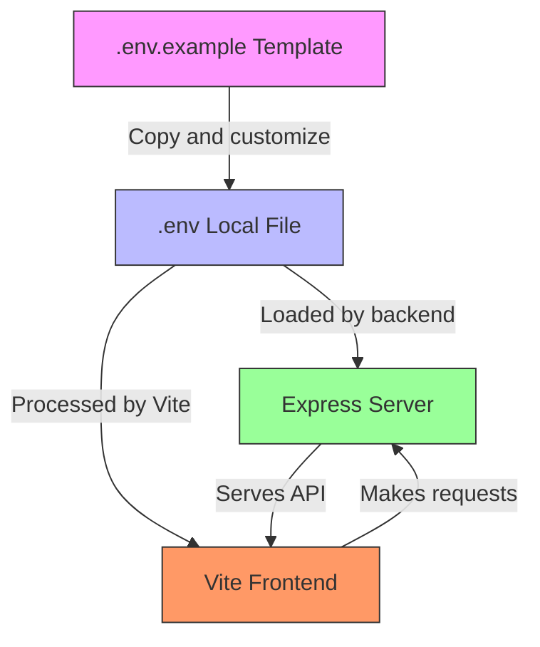
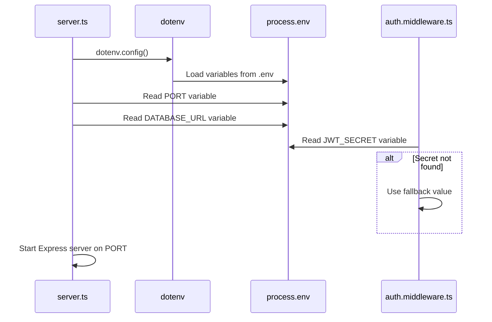
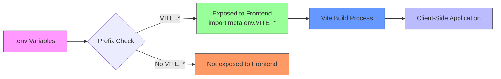

# Environment Configuration

<cite>
**Referenced Files in This Document**  
- [.env.example](file://pikzels-clone\.env.example)
- [server.ts](file://pikzels-clone\src\server.ts)
- [vite.config.ts](file://pikzels-clone\client\vite.config.ts)
- [auth.middleware.ts](file://pikzels-clone\src\middleware\auth.middleware.ts)
</cite>

## Table of Contents
1. [Introduction](#introduction)
2. [Environment Variables Overview](#environment-variables-overview)
3. [.env File Structure and Template](#env-file-structure-and-template)
4. [Backend Configuration with Express and Dotenv](#backend-configuration-with-express-and-dotenv)
5. [Frontend Configuration with Vite](#frontend-configuration-with-vite)
6. [Configuration Validation and Security](#configuration-validation-and-security)
7. [Environment-Specific Configuration](#environment-specific-configuration)
8. [Troubleshooting Common Issues](#troubleshooting-common-issues)
9. [Best Practices for Environment Management](#best-practices-for-environment-management)

## Introduction

The Thumbnail Maker application employs a comprehensive environment configuration system to manage settings across different deployment environments. This document details how environment variables are structured, loaded, and utilized by both the frontend (Vite) and backend (Express) components of the application. The configuration system supports development, testing, and production environments while ensuring secure handling of sensitive data such as API keys and database credentials.

**Section sources**
- [.env.example](file://pikzels-clone\.env.example)
- [server.ts](file://pikzels-clone\src\server.ts)
- [vite.config.ts](file://pikzels-clone\client\vite.config.ts)

## Environment Variables Overview

The application uses environment variables to configure critical aspects including database connections, server ports, authentication secrets, and third-party service integrations. These variables allow the application to adapt to different environments without code changes. The system distinguishes between frontend and backend configuration needs, with backend variables typically containing more sensitive information that should never be exposed to client-side code.

The configuration approach follows the twelve-factor app methodology, storing configuration in the environment rather than in the codebase. This separation enables the same codebase to run in multiple environments with different configurations, supporting seamless deployment across development, staging, and production environments.

## .env File Structure and Template

The project provides a `.env.example` file as a template for local environment setup. This template defines the required environment variables with example values, serving as documentation for the configuration schema. Developers copy this file to create their local `.env` file, replacing placeholder values with actual configuration for their environment.

The template includes variables for database connection, JWT authentication, server configuration, and AI service integration. Each variable is clearly commented to explain its purpose and expected format. The `.env` file is git-ignored to prevent accidental exposure of sensitive credentials, while the `.env.example` file is committed to version control to ensure all team members have access to the required configuration structure.

**Diagram sources**
- [.env.example](file://pikzels-clone\.env.example)

**Section sources**
- [.env.example](file://pikzels-clone\.env.example)

## Backend Configuration with Express and Dotenv

The backend server, built with Express, uses the `dotenv` package to load environment variables from the `.env` file during application startup. The configuration process begins in `server.ts` where `dotenv.config()` is called immediately to ensure all environment variables are available before any other modules are loaded.

Key configuration variables include `DATABASE_URL` for database connectivity, `JWT_SECRET` for authentication token signing, and `PORT` for server binding. The backend validates the presence of critical variables and provides default values for non-sensitive settings to ensure the application can start even if some variables are missing. The `auth.middleware.ts` file demonstrates how the `JWT_SECRET` is accessed from `process.env`, with a fallback value for development environments.

**Diagram sources**
- [server.ts](file://pikzels-clone\src\server.ts)
- [auth.middleware.ts](file://pikzels-clone\src\middleware\auth.middleware.ts)

**Section sources**
- [server.ts](file://pikzels-clone\src\server.ts)
- [auth.middleware.ts](file://pikzels-clone\src\middleware\auth.middleware.ts)

## Frontend Configuration with Vite

The frontend application, built with Vite, handles environment variables differently from the backend. Vite automatically loads variables prefixed with `VITE_` from `.env` files and makes them available to the application through `import.meta.env`. This prefix requirement prevents accidental exposure of sensitive backend variables to the client-side code.

The Vite configuration in `vite.config.ts` also handles proxy settings for development, redirecting API requests from the frontend server to the backend server. This configuration includes the proxy target (`http://localhost:8555`) and settings like `changeOrigin` and `secure` to handle CORS and SSL requirements during development. The port configuration in Vite (8556) is deliberately different from the backend port (8550) to avoid conflicts.

**Diagram sources**
- [vite.config.ts](file://pikzels-clone\client\vite.config.ts)

**Section sources**
- [vite.config.ts](file://pikzels-clone\client\vite.config.ts)

## Configuration Validation and Security

The application implements several security measures to protect sensitive configuration data. The `.env` file is included in `.gitignore` to prevent accidental commits of credentials to version control. The `.env.example` file provides a safe template without actual values.

For backend configuration, the code includes fallback values for non-critical variables but requires essential variables like database URLs to be explicitly set. The JWT secret uses a fallback only in development, with production deployments expected to provide a strong, unique secret. The middleware components access environment variables directly through `process.env`, relying on the dotenv package to handle the loading and parsing.

The separation between frontend and backend variables is enforced by Vite's prefix requirement, ensuring that backend secrets are not bundled into client-side JavaScript. This architecture prevents exposure of database credentials, API keys, and other sensitive information to browser clients.

## Environment-Specific Configuration

While the current implementation focuses on development configuration, the environment system supports environment-specific overrides through Vite's built-in environment file naming convention. Files like `.env.production`, `.env.development`, and `.env.test` can provide environment-specific values that override the base `.env` configuration.

The backend's use of `process.env.PORT || 8550` demonstrates a pattern for environment-specific configuration, where production environments can set the PORT variable through platform-specific mechanisms (like Heroku or Docker), while development environments use the default value. Similar patterns can be applied to database URLs, logging levels, and feature flags to enable different behaviors across environments.

For CI/CD integration, environment variables can be set in the pipeline configuration, eliminating the need for `.env` files in production deployments. This approach enhances security by keeping credentials out of the file system and allowing for easier rotation and management through the CI/CD platform's secret management features.

## Troubleshooting Common Issues

Common configuration issues include missing environment variables, incorrect file paths, and CORS misconfigurations. When variables are missing, the application may fail to start or exhibit unexpected behavior. Developers should verify that their `.env` file exists in the correct location and contains all required variables as defined in `.env.example`.

CORS issues typically occur when the frontend and backend servers are on different ports or domains. The Vite proxy configuration in `vite.config.ts` addresses this in development by routing API requests through the same origin. In production, proper CORS headers must be configured on the backend server, though this configuration is not currently visible in the available code.

Port conflicts can occur if the configured ports are already in use. The backend defaults to port 8550 and the frontend to 8556, but these can be overridden by setting the PORT environment variable. When troubleshooting, verify that no other processes are using these ports and consider changing the values in the environment files.

## Best Practices for Environment Management

The project follows several best practices for environment management. The use of a template file (`.env.example`) ensures consistent configuration across development environments. The separation of sensitive and non-sensitive variables through Vite's prefix system protects credentials from client-side exposure.

For team collaboration, the `.env` file should never be committed to version control, while the `.env.example` file should be kept up-to-date with all required variables. Documentation should clearly specify which variables are required for different environments and deployment scenarios.

In production deployments, environment variables should be set through the hosting platform's configuration interface rather than file-based approaches. This enhances security and simplifies management across multiple instances. Regular rotation of secrets like JWT tokens and API keys is recommended, with automated processes for updating these values across environments.