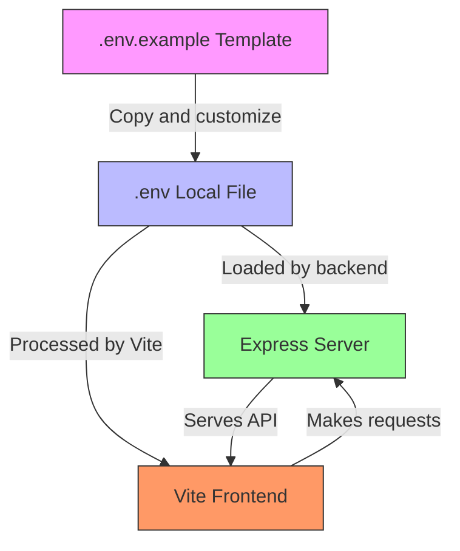
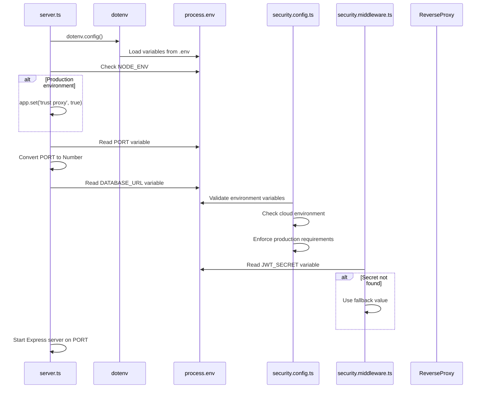
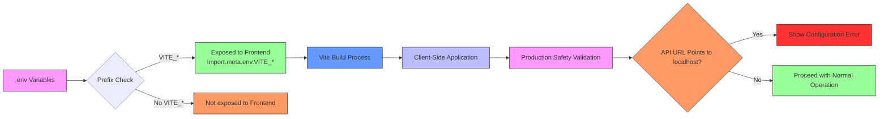
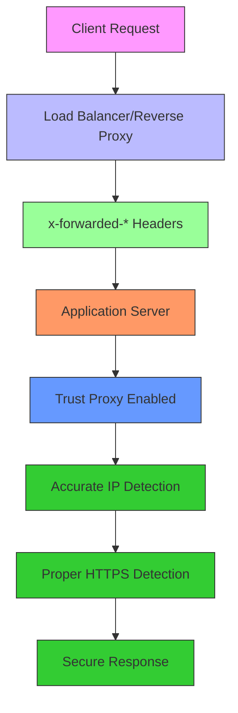

# Environment Configuration

<cite>
**Referenced Files in This Document**
- [.env.example](file://pikzels-clone/.env.example)
- [server.ts](file://pikzels-clone/src/server.ts)
- [vite.config.ts](file://pikzels-clone/client/vite.config.ts)
- [auth.middleware.ts](file://pikzels-clone/src/middleware/auth.middleware.ts)
- [security.middleware.ts](file://pikzels-clone/src/middleware/security.middleware.ts)
- [security.config.ts](file://pikzels-clone/src/config/security.config.ts)
- [environment.ts](file://pikzels-clone/client/src/config/environment.ts)
- [openrouter-ai.service.ts](file://pikzels-clone/src/modules/thumbnail/openrouter-ai.service.ts)
- [netlify.toml](file://pikzels-clone/client/netlify.toml)
- [railway.json](file://pikzels-clone/railway.json)
- [PORT-COMPLIANCE-RULES.md](file://pikzels-clone/PORT-COMPLIANCE-RULES.md)
- [ai-service-manager.ts](file://pikzels-clone/src/modules/thumbnail/ai-service-manager.ts)
- [thumbnail.controller.ts](file://pikzels-clone/src/modules/thumbnail/thumbnail.controller.ts)
</cite>

## Update Summary
**Changes Made**
- Enhanced OpenRouter model configuration with comprehensive per-tool model selection system
- Improved environment variable handling with detailed timeout and retry mechanisms
- Added production safety checks preventing localhost deployment
- Enhanced security validation for production deployments
- Comprehensive model availability documentation for OpenRouter integration
- Added detailed error recovery mechanisms and timeout handling

## Table of Contents
1. [Introduction](#introduction)
2. [Environment Variables Overview](#environment-variables-overview)
3. [.env File Structure and Template](#.env-file-structure-and-template)
4. [Backend Configuration with Express and Dotenv](#backend-configuration-with-express-and-dotenv)
5. [Frontend Configuration with Vite](#frontend-configuration-with-vite)
6. [Configuration Validation and Security](#configuration-validation-and-security)
7. [Environment-Specific Configuration](#environment-specific-configuration)
8. [Reverse Proxy and Production Deployment](#reverse-proxy-and-production-deployment)
9. [AI Tool Configuration with OpenRouter](#ai-tool-configuration-with-openrouter)
10. [Troubleshooting Common Issues](#troubleshooting-common-issues)
11. [Best Practices for Environment Management](#best-practices-for-environment-management)

## Introduction

The Thumbnail Maker application employs a comprehensive environment configuration system to manage settings across different deployment environments. This document details how environment variables are structured, loaded, and utilized by both the frontend (Vite) and backend (Express) components of the application. The configuration system supports development, testing, and production environments while ensuring secure handling of sensitive data such as API keys and database credentials.

**Updated** Enhanced with production safety checks that prevent accidental deployment with localhost URLs, expanded OpenRouter model configuration options for customizing AI tool selection per operation, comprehensive environment variable validation systems, and robust timeout/error handling mechanisms.

## Environment Variables Overview

The application uses environment variables to configure critical aspects including database connections, server ports, authentication secrets, and third-party service integrations. These variables allow the application to adapt to different environments without code changes. The system distinguishes between frontend and backend configuration needs, with backend variables typically containing more sensitive information that should never be exposed to client-side code.

The configuration approach follows the twelve-factor app methodology, storing configuration in the environment rather than in the codebase. This separation enables the same codebase to run in multiple environments with different configurations, supporting seamless deployment across development, staging, and production environments.

**Updated** Enhanced with new variables for production safety validation, per-tool AI model configuration, comprehensive security validation, and detailed timeout handling for AI services.

## .env File Structure and Template

The project provides a `.env.example` file as a template for local environment setup. This template defines the required environment variables with example values, serving as documentation for the configuration schema. Developers copy this file to create their local `.env` file, replacing placeholder values with actual configuration for their environment.

The template includes variables for database connection, JWT authentication, server configuration, and AI service integration. Each variable is clearly commented to explain its purpose and expected format. The `.env` file is git-ignored to prevent accidental exposure of sensitive credentials, while the `.env.example` file is committed to version control to ensure all team members have access to the required configuration structure.

**Updated** Added new variables for OpenRouter model configuration including per-tool model selection, enhanced security settings for production deployments, comprehensive AI provider configuration, and detailed timeout handling settings.



**Diagram sources**
- [.env.example](file://pikzels-clone/.env.example)

**Section sources**
- [.env.example](file://pikzels-clone/.env.example)

## Backend Configuration with Express and Dotenv

The backend server, built with Express, uses the `dotenv` package to load environment variables from the `.env` file during application startup. The configuration process begins in `server.ts` where `dotenv.config()` is called immediately to ensure all environment variables are available before any other modules are loaded.

**Updated** Enhanced trust proxy configuration for reverse proxy environments and production deployment integration with comprehensive security validation.

Key configuration variables include `DATABASE_URL` for database connectivity, `JWT_SECRET` for authentication token signing, and `PORT` for server binding. The backend validates the presence of critical variables and provides default values for non-sensitive settings to ensure the application can start even if some variables are missing. The `auth.middleware.ts` file demonstrates how the `JWT_SECRET` is accessed from `process.env`, with a fallback value for development environments.

The PORT handling has been enhanced to automatically convert the environment variable from string to number using `Number(process.env.PORT) || 8550`, ensuring proper numeric comparison and preventing runtime errors. This change improves reliability across different deployment platforms.

**Enhanced Trust Proxy Configuration**: The server now includes intelligent trust proxy detection for production environments. When `NODE_ENV` is set to 'production', the application automatically sets `app.set('trust proxy', true)` to properly handle reverse proxy headers like `x-forwarded-proto` and `x-forwarded-host`. This ensures accurate IP detection and proper HTTPS redirection in containerized and cloud deployments.

**Comprehensive Security Validation**: The backend now includes extensive environment validation at startup, including cloud environment detection and production safety checks. The security configuration validates required variables, enforces production-specific requirements, and prevents deployment in cloud environments without proper production settings.



**Diagram sources**
- [server.ts](file://pikzels-clone/src/server.ts)
- [security.config.ts](file://pikzels-clone/src/config/security.config.ts)
- [security.middleware.ts](file://pikzels-clone/src/middleware/security.middleware.ts)

**Section sources**
- [server.ts](file://pikzels-clone/src/server.ts)
- [auth.middleware.ts](file://pikzels-clone/src/middleware/auth.middleware.ts)
- [security.config.ts](file://pikzels-clone/src/config/security.config.ts)

## Frontend Configuration with Vite

The frontend application, built with Vite, handles environment variables differently from the backend. Vite automatically loads variables prefixed with `VITE_` from `.env` files and makes them available to the application through `import.meta.env`. This prefix requirement prevents accidental exposure of sensitive backend variables to the client-side code.

The Vite configuration in `vite.config.ts` also handles proxy settings for development, redirecting API requests from the frontend server to the backend server. This configuration includes the proxy target (`http://localhost:8550`) and settings like `changeOrigin` and `secure` to handle CORS and SSL requirements during development. The port configuration in Vite (8556) is deliberately different from the backend port (8550) to avoid conflicts.

**Updated** Enhanced CORS configuration now supports multiple origins through the CORS_ORIGIN environment variable, allowing flexible deployment configurations, comprehensive production safety validation, and detailed timeout handling for AI operations.

**Enhanced Production Safety Validation**: The frontend now includes comprehensive validation to prevent accidental deployment with localhost URLs. The `environment.ts` file implements a fail-safe mechanism that detects production builds and validates that the API URL is not pointing to localhost, preventing API calls from failing in production.

**Cloud Platform Detection**: The frontend configuration includes detection for major cloud platforms (Netlify, Vercel, Cloudflare Pages) to provide appropriate environment detection and configuration validation.



**Diagram sources**
- [vite.config.ts](file://pikzels-clone/client/vite.config.ts)
- [environment.ts](file://pikzels-clone/client/src/config/environment.ts)

**Section sources**
- [vite.config.ts](file://pikzels-clone/client/vite.config.ts)
- [environment.ts](file://pikzels-clone/client/src/config/environment.ts)

## Configuration Validation and Security

The application implements several security measures to protect sensitive configuration data. The `.env` file is included in `.gitignore` to prevent accidental commits of credentials to version control. The `.env.example` file provides a safe template without actual values.

For backend configuration, the code includes fallback values for non-critical variables but requires essential variables like database URLs to be explicitly set. The JWT secret uses a fallback only in development, with production deployments expected to provide a strong, unique secret. The middleware components access environment variables directly through `process.env`, relying on the dotenv package to handle the loading and parsing.

**Updated** Enhanced security configuration with comprehensive validation, trust proxy integration, HTTPS redirection for production environments, production safety checks, and detailed timeout handling for AI operations.

The separation between frontend and backend variables is enforced by Vite's prefix requirement, ensuring that backend secrets are not bundled into client-side JavaScript. This architecture prevents exposure of database credentials, API keys, and other sensitive information to browser clients.

The security middleware now includes enhanced validation for CORS origins, file upload limits, compression settings, and HTTPS redirection. The `security.config.ts` file provides centralized configuration management with validation for production deployments.

**Trust Proxy Integration**: The security system now properly handles reverse proxy environments by trusting forwarded headers from load balancers and CDNs. This ensures accurate IP detection for rate limiting and proper HTTPS detection for redirects.

**HTTPS Redirection**: Enhanced HTTPS redirect middleware automatically detects when requests come through HTTPS via reverse proxies and redirects HTTP traffic to HTTPS when enabled.

**Production Safety Validation**: The frontend includes a comprehensive validation system that prevents accidental deployment with localhost URLs. This fail-safe mechanism detects production builds and validates that API URLs are not pointing to localhost, displaying clear error messages and preventing API calls from failing in production.

**Cloud Environment Detection**: The backend includes sophisticated cloud environment detection that identifies deployment platforms (Railway, Heroku, Vercel, etc.) and enforces production mode requirements automatically.

**Timeout and Error Handling**: The OpenRouter AI service includes comprehensive timeout handling with 2-minute timeouts for image generation operations, automatic retry mechanisms with exponential backoff, and detailed error categorization for robust error recovery.

## Environment-Specific Configuration

While the current implementation focuses on development configuration, the environment system supports environment-specific overrides through Vite's built-in environment file naming convention. Files like `.env.production`, `.env.development`, and `.env.test` can provide environment-specific values that override the base `.env` configuration.

**Updated** Enhanced environment-specific configuration with trust proxy settings, HTTPS redirection, production-ready security configurations, per-tool AI model overrides, and detailed timeout handling.

The backend's use of `Number(process.env.PORT) || 8550` demonstrates a pattern for environment-specific configuration, where production environments can set the PORT variable through platform-specific mechanisms (like Heroku or Docker), while development environments use the default value. Similar patterns can be applied to database URLs, logging levels, and feature flags to enable different behaviors across environments.

The MAX_FILE_SIZE environment variable allows administrators to configure upload limits per deployment, with the security middleware enforcing these limits across all file upload endpoints. The ENABLE_COMPRESSION flag provides fine-grained control over HTTP compression, allowing teams to optimize for different network conditions.

**Production Deployment Patterns**: The application includes specific production deployment patterns including:
- Trust proxy configuration for reverse proxy environments
- HTTPS redirection for secure deployments
- Enhanced CORS configuration for production domains
- Production-only API mode for separate frontend deployments
- Production safety validation to prevent localhost URL deployment
- Comprehensive timeout handling for AI operations

For CI/CD integration, environment variables can be set in the pipeline configuration, eliminating the need for `.env` files in production deployments. This approach enhances security by keeping credentials out of the file system and allowing for easier rotation and management through the CI/CD platform's secret management features.

## Reverse Proxy and Production Deployment

**Updated** Comprehensive reverse proxy support for production environments with trust proxy configuration, HTTPS redirection, and detailed timeout handling for AI operations.

The application is designed to work seamlessly behind reverse proxies and load balancers commonly used in production deployments. The Express server includes intelligent trust proxy detection that automatically configures the application to properly handle forwarded headers from reverse proxies.

**Trust Proxy Configuration**: When `NODE_ENV` is set to 'production', the server automatically enables trust proxy mode:
```javascript
if (process.env.NODE_ENV === 'production') {
  app.set('trust proxy', true);
}
```

This configuration ensures that:
- Accurate client IP detection through `x-forwarded-for` headers
- Proper HTTPS detection via `x-forwarded-proto` headers
- Correct host detection through `x-forwarded-host` headers
- Secure cookie handling in proxy environments

**Production Deployment Platforms**: The application is optimized for deployment on platforms like Railway, which uses reverse proxies and load balancers. The configuration includes:
- Health check endpoint at `/health` for platform monitoring
- Production-only API mode for separate frontend deployments
- Proper port binding to `0.0.0.0` for containerized deployments
- HTTPS redirection for secure production environments

**Reverse Proxy Headers**: The application properly handles standard reverse proxy headers:
- `x-forwarded-for`: Client IP addresses through proxy chains
- `x-forwarded-proto`: Protocol indication (http/https)
- `x-forwarded-host`: Original host header
- `cf-connecting-ip`: Cloudflare-specific client IP
- `true-client-ip`: Akamai-specific client IP

**Platform Integration**: The deployment configuration includes platform-specific optimizations:
- Railway platform with health checks and restart policies
- Netlify frontend with API proxy configuration
- Production API-only mode for separate frontend deployments



**Diagram sources**
- [server.ts](file://pikzels-clone/src/server.ts)
- [netlify.toml](file://pikzels-clone/client/netlify.toml)

**Section sources**
- [server.ts](file://pikzels-clone/src/server.ts)
- [railway.json](file://pikzels-clone/railway.json)
- [netlify.toml](file://pikzels-clone/client/netlify.toml)

## AI Tool Configuration with OpenRouter

**Updated** Comprehensive OpenRouter model configuration system with per-tool model selection, detailed timeout handling, robust error recovery mechanisms, and enhanced Gemini-based model support.

The application now supports sophisticated per-tool AI model configuration through OpenRouter, allowing different models to be selected for different AI operations with comprehensive timeout handling and error recovery. This enhancement provides greater flexibility in optimizing AI performance across various thumbnail creation tasks.

**Per-Tool Model Configuration**: The OpenRouter service includes predefined model recommendations for different AI operations with environment variable overrides:

- **Text-to-Image Generation** (`generate`): Optimized for creating thumbnails quickly with good quality using `google/gemini-2.5-flash-image`
- **Inpainting** (`inpaint`): Contextual editing with preserved background areas using `google/gemini-3-pro-image-preview`
- **Face Swap** (`faceSwap`): Portrait optimization with identity preservation using `bytedance-seed/seedream-4.5`
- **Upscaling** (`upscale`): Detail preservation during resolution increases using `black-forest-labs/flux.2-max`

Each tool type has both primary and fallback model recommendations that can be overridden via environment variables. The configuration system checks for environment variable overrides first, then falls back to recommended defaults.

**Environment Variable Overrides**: The system supports per-tool model configuration through environment variables:
- `OPENROUTER_MODEL_GENERATE`: Custom model for text-to-image generation
- `OPENROUTER_MODEL_INPAINT`: Custom model for inpainting operations  
- `OPENROUTER_MODEL_FACESWAP`: Custom model for face swap operations
- `OPENROUTER_MODEL_UPSCALE`: Custom model for upscaling operations

**Default Model Selection**: The system includes a default image model (`OPENROUTER_IMAGE_MODEL`) that serves as a fallback for operations that don't match specific tool types. The default model is set to `google/gemini-2.5-flash-image` for optimal balance of speed and quality.

**Model Availability**: The OpenRouter service maintains a comprehensive list of available image generation models, including:
- Google Gemini family (NANO_BANANA, NANO_BANANA_PRO)
- Black Forest Labs FLUX.2 family (MAX, PRO, FLEX, KLEIN)
- ByteDance Seedream (seedream-4.5)
- OpenAI GPT-5 Image models
- Sourceful Riverflow family

**Enhanced Timeout Handling**: The OpenRouter service includes comprehensive timeout handling with:
- 2-minute timeout for image generation operations (120,000ms)
- Automatic retry mechanism with 3-second delays between attempts
- Intelligent error categorization to determine retry eligibility
- Detailed error reporting for debugging and monitoring

**Robust Error Recovery**: The system implements sophisticated error recovery mechanisms:
- Non-retryable errors (API key, credit, invalid, 400, 401, 402)
- Retryable errors with exponential backoff
- Detailed error categorization and reporting
- Graceful degradation to fallback models when primary models fail

**Gemini Model Support**: Enhanced support for Gemini-based models with:
- Aspect ratio configuration for different image dimensions
- Image size options (1K, 2K, 4K) for higher resolution outputs
- Specialized configuration for Gemini 2.5 Flash and 3 Pro models
- Automatic image_config generation for Gemini-specific parameters

**Model Configuration Management**: The AI service manager provides centralized access to OpenRouter model configuration, allowing tools to query available models and check configuration status. The system includes comprehensive error handling for model availability and configuration validation.

**Section sources**
- [openrouter-ai.service.ts](file://pikzels-clone/src/modules/thumbnail/openrouter-ai.service.ts)
- [ai-service-manager.ts](file://pikzels-clone/src/modules/thumbnail/ai-service-manager.ts)
- [thumbnail.controller.ts](file://pikzels-clone/src/modules/thumbnail/thumbnail.controller.ts)

## Troubleshooting Common Issues

**Updated** Added comprehensive troubleshooting guidance for production safety validation, per-tool AI model configuration, OpenRouter deployment issues, detailed timeout handling, and robust error recovery mechanisms.

Common configuration issues include missing environment variables, incorrect file paths, and CORS misconfigurations. When variables are missing, the application may fail to start or exhibit unexpected behavior. Developers should verify that their `.env` file exists in the correct location and contains all required variables as defined in `.env.example`.

**PORT Handling Issues**: If the server fails to start or throws type errors, verify that the PORT variable is a valid number. The system automatically converts string values to numbers, but malformed values will cause startup failures.

**Trust Proxy Issues**: In production environments, if IP addresses show as proxy IPs or HTTPS detection fails, verify that:
- `NODE_ENV` is set to 'production'
- Reverse proxy is properly configured to forward required headers
- Trust proxy configuration is enabled automatically

**HTTPS Redirection Issues**: If HTTPS redirection fails in production:
- Verify that reverse proxy is terminating SSL
- Check that `x-forwarded-proto` header is being forwarded
- Ensure `ENABLE_HTTPS_REDIRECT` is set to 'true'

**File Size Limit Issues**: If users encounter "Request entity too large" errors, check the MAX_FILE_SIZE environment variable. The default value is 10MB (10485760 bytes), but this can be adjusted for different deployment requirements.

**Compression Issues**: If compression appears disabled despite ENABLE_COMPRESSION being set to true, verify that the environment variable is correctly formatted as a string ("true" vs boolean true).

**CORS Issues**: The enhanced CORS configuration supports multiple origins separated by commas. Ensure that all required origins are included in the CORS_ORIGIN variable, and verify that the credentials setting matches your deployment requirements.

**Production Safety Validation Issues**: If the frontend shows a configuration error about localhost URLs in production:
- Verify that `VITE_API_URL` is set to your production backend URL
- Ensure the URL does not contain localhost, 127.0.0.1, or 0.0.0.0
- Check that the URL includes your production domain (e.g., railway.app)

**Per-Tool AI Model Issues**: If AI operations are using unexpected models:
- Verify that the appropriate environment variables are set
- Check that the model IDs are valid OpenRouter model names
- Ensure that the OpenRouter API key is properly configured
- Verify that the model supports image generation with proper modalities

**OpenRouter Deployment Issues**: If OpenRouter AI features are not working:
- Verify that `OPENROUTER_API_KEY` is set in both frontend and backend environments
- Check that the API key has access to the configured models
- Ensure that the `OPENROUTER_API_URL` points to the correct OpenRouter endpoint
- Verify that the timeout settings are appropriate for your deployment

**Timeout and Error Handling Issues**: If AI operations are timing out or failing:
- Verify that the `IMAGE_GENERATION_TIMEOUT` is set appropriately (default 120,000ms)
- Check that the retry mechanism is functioning (MAX_RETRIES = 2, RETRY_DELAY = 3000ms)
- Review error logs for specific error categories and retry eligibility
- Ensure that non-retryable errors are properly handled

**Environment Validation Issues**: If the backend shows security validation errors:
- Verify that all required environment variables are set
- Check that production-specific variables are configured correctly
- Ensure that cloud environment detection is working properly
- Verify that production mode requirements are met

**Cloud Platform Issues**: If experiencing issues with cloud deployments:
- Verify that cloud environment detection is working
- Check that production mode is properly enforced
- Ensure that all required production variables are set
- Verify that trust proxy is enabled for reverse proxy environments

**Section sources**
- [environment.ts](file://pikzels-clone/client/src/config/environment.ts)
- [openrouter-ai.service.ts](file://pikzels-clone/src/modules/thumbnail/openrouter-ai.service.ts)
- [security.config.ts](file://pikzels-clone/src/config/security.config.ts)

## Best Practices for Environment Management

**Updated** Enhanced best practices for production safety validation, per-tool AI model configuration, reverse proxy environments, comprehensive timeout handling, and robust error recovery mechanisms.

The project follows several best practices for environment management. The use of a template file (`.env.example`) ensures consistent configuration across development environments. The separation of sensitive and non-sensitive variables through Vite's prefix system protects credentials from client-side exposure.

**New Best Practices for Enhanced Configuration**:

- **Production Safety Validation**: Always verify that production builds use non-localhost URLs for API endpoints
- **Per-Tool Model Optimization**: Configure different models for different AI operations based on performance and quality requirements
- **Trust Proxy Management**: Enable trust proxy automatically in production environments and verify reverse proxy header forwarding
- **HTTPS Redirection**: Configure HTTPS redirection for production deployments with proper SSL termination
- **Reverse Proxy Headers**: Ensure all x-forwarded-* headers are properly forwarded by load balancers and CDNs
- **Production API Mode**: Use production-only API mode for separate frontend deployments
- **Health Check Configuration**: Configure proper health checks for containerized deployments
- **Cloud Environment Detection**: Leverage cloud platform detection for automatic configuration adjustments
- **Environment Validation**: Implement comprehensive validation at startup to catch configuration errors early
- **Timeout Configuration**: Set appropriate timeout values for AI operations based on model complexity and deployment requirements
- **Error Recovery Strategy**: Implement robust error recovery mechanisms with proper error categorization and retry logic
- **Model Availability Monitoring**: Regularly check model availability and update configurations as needed

For team collaboration, the `.env` file should never be committed to version control, while the `.env.example` file should be kept up-to-date with all required variables. Documentation should clearly specify which variables are required for different environments and deployment scenarios.

**Production Deployment Best Practices**:

- Set ENABLE_COMPRESSION to true for production deployments to improve response times
- Configure CORS_ORIGIN with specific domains rather than wildcards
- Set appropriate MAX_FILE_SIZE values based on your application's requirements
- Use the security validation features to catch configuration errors early
- Enable trust proxy for all production deployments behind reverse proxies
- Configure HTTPS redirection for secure production environments
- Set per-tool AI models based on operation requirements and budget constraints
- Validate production safety settings before deployment
- Implement comprehensive environment validation at startup
- Leverage cloud platform detection for automatic configuration
- Configure appropriate timeout values for AI operations (default 120,000ms)
- Implement robust error recovery mechanisms with proper retry logic
- Monitor model availability and update configurations regularly

**Reverse Proxy Deployment Best Practices**:

- Ensure all x-forwarded-* headers are forwarded by the reverse proxy
- Configure proper SSL termination at the proxy level
- Set up health checks that work with the reverse proxy configuration
- Test IP detection and HTTPS detection in staging environments
- Monitor for proper header forwarding in production

**AI Model Configuration Best Practices**:

- Use faster models (like Gemini 2.5 Flash) for thumbnail generation operations
- Use higher-quality models (like Gemini 3 Pro) for detailed editing operations
- Configure fallback models for cost optimization and reliability
- Monitor model performance and adjust configurations based on usage patterns
- Set environment variables per deployment environment for easy switching
- Implement model availability checking for robust error handling
- Configure appropriate timeout values for different model types
- Implement comprehensive error recovery mechanisms with proper error categorization

**Environment Validation Best Practices**:

- Implement comprehensive validation at application startup
- Use cloud environment detection to automatically adjust configuration
- Enforce production-specific requirements for security
- Provide clear error messages for configuration issues
- Implement fail-safe mechanisms for critical security settings
- Monitor timeout and error handling effectiveness
- Regularly test error recovery mechanisms under various failure scenarios

In production deployments, environment variables should be set through the hosting platform's configuration interface rather than file-based approaches. This enhances security and simplifies management across multiple instances. Regular rotation of secrets like JWT tokens and API keys is recommended, with automated processes for updating these values across environments.

**Platform-Specific Best Practices**:

- **Railway**: Leverage built-in health checks and restart policies, trust proxy configuration, timeout handling
- **Netlify**: Configure API proxy settings for production deployments, environment variable management, production safety validation
- **Cloudflare**: Ensure proper header forwarding and SSL termination, production safety validation, timeout configuration
- **AWS/GCP/Azure**: Configure load balancer health checks and security groups, trust proxy settings, timeout handling
- **Vercel**: Implement production safety validation, environment variable configuration, error recovery monitoring

**Section sources**
- [PORT-COMPLIANCE-RULES.md](file://pikzels-clone/PORT-COMPLIANCE-RULES.md)
- [security.config.ts](file://pikzels-clone/src/config/security.config.ts)
- [security.middleware.ts](file://pikzels-clone/src/middleware/security.middleware.ts)
- [railway.json](file://pikzels-clone/railway.json)
- [netlify.toml](file://pikzels-clone/client/netlify.toml)
- [environment.ts](file://pikzels-clone/client/src/config/environment.ts)
- [openrouter-ai.service.ts](file://pikzels-clone/src/modules/thumbnail/openrouter-ai.service.ts)
- [ai-service-manager.ts](file://pikzels-clone/src/modules/thumbnail/ai-service-manager.ts)