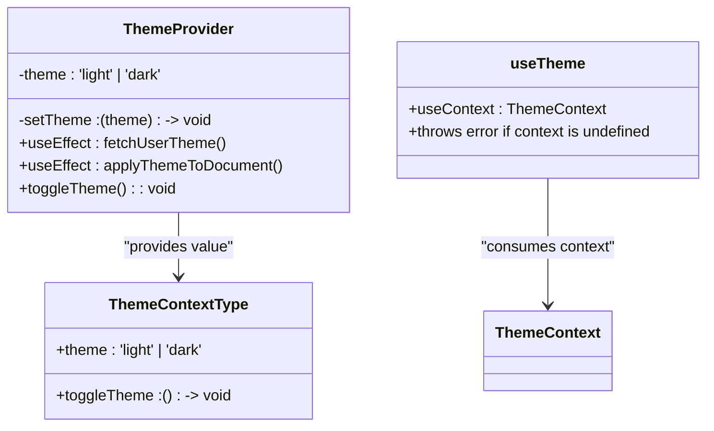
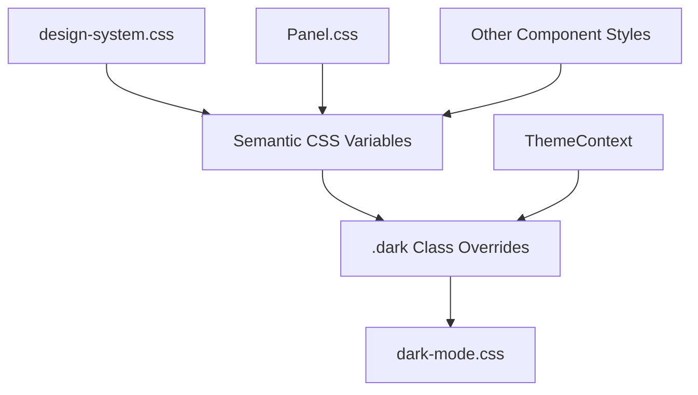
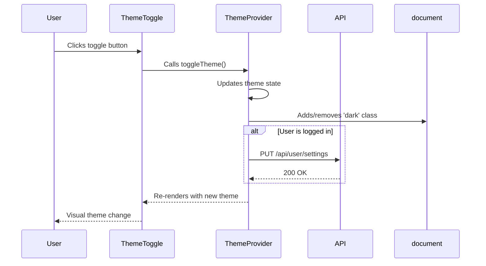

# Theming System

<cite>
**Referenced Files in This Document**   
- [ThemeContext.tsx](file://pikzels-clone/client/src/contexts/ThemeContext.tsx)
- [dark-mode.css](file://pikzels-clone/client/src/styles/dark-mode.css)
- [design-system.css](file://pikzels-clone/client/src/styles/design-system.css)
- [Panel.css](file://pikzels-clone/client/src/components/ui/Panel.css)
- [ThemeToggle.tsx](file://pikzels-clone/client/src/components/ThemeToggle.tsx)
- [Project Style Guide.md](file://pikzels-clone/Project Style Guide.md)
</cite>

## Table of Contents
1. [Introduction](#introduction)
2. [Theme Context Implementation](#theme-context-implementation)
3. [CSS Custom Properties and Styling](#css-custom-properties-and-styling)
4. [ThemeToggle Component and User Interaction](#themetoggle-component-and-user-interaction)
5. [Theme-Aware Component Rendering](#theme-aware-component-rendering)
6. [Accessibility and Performance Considerations](#accessibility-and-performance-considerations)
7. [Alignment with Project Style Guide](#alignment-with-project-style-guide)
8. [Troubleshooting Common Issues](#troubleshooting-common-issues)
9. [Conclusion](#conclusion)

## Introduction
The Theming System in the frontend application enables dynamic switching between light and dark modes using React's Context API via `ThemeContext.tsx`. This system leverages CSS custom properties (variables) defined in `design-system.css` and overridden in `dark-mode.css`, allowing consistent and maintainable theming across components. The `ThemeToggle` component provides user interaction for theme switching, with persistence via `localStorage`. This documentation details the implementation, integration, and best practices for maintaining a robust, accessible, and performant theming solution.

**Section sources**
- [ThemeContext.tsx](file://pikzels-clone/client/src/contexts/ThemeContext.tsx#L1-L122)
- [Project Style Guide.md](file://pikzels-clone/Project Style Guide.md#L1-L505)

## Theme Context Implementation

The `ThemeContext` is implemented using React's Context API to manage and distribute the current theme state (`light` or `dark`) throughout the component tree. The `ThemeProvider` component initializes the theme state, checks user preferences from the backend API if authenticated, or falls back to system preferences using `window.matchMedia('(prefers-color-scheme: dark)')`. Upon theme change, it updates the `theme` state and applies the `dark` class to the `documentElement`, triggering CSS rule evaluation.

The `useTheme` custom hook provides a safe way to consume the context, throwing an error if used outside the `ThemeProvider`. This ensures proper usage and prevents runtime errors due to undefined context.

**Diagram sources**
- [ThemeContext.tsx](file://pikzels-clone/client/src/contexts/ThemeContext.tsx#L1-L122)

**Section sources**
- [ThemeContext.tsx](file://pikzels-clone/client/src/contexts/ThemeContext.tsx#L1-L122)

## CSS Custom Properties and Styling

The theming system relies on CSS custom properties (variables) defined in `design-system.css` to create a consistent design language. These variables include color palettes, typography, spacing, and shadows. In light mode, semantic variables like `--color-text-primary` map to light gray shades, while in dark mode, they map to light text on dark backgrounds via the `.dark` class override.

The `dark-mode.css` file contains specific overrides for Tailwind-like utility classes (e.g., `.bg-white`, `.text-gray-900`) when the `.dark` class is present on the root element. This approach allows existing components to automatically adapt to the current theme without requiring per-component theme logic.

Component-specific styles, such as those in `Panel.css`, use semantic variables (e.g., `var(--color-bg-secondary)`) rather than hardcoded colors, ensuring consistency and ease of theme adaptation.

**Diagram sources**
- [design-system.css](file://pikzels-clone/client/src/styles/design-system.css#L1-L419)
- [dark-mode.css](file://pikzels-clone/client/src/styles/dark-mode.css#L1-L250)
- [Panel.css](file://pikzels-clone/client/src/components/ui/Panel.css#L1-L394)

**Section sources**
- [design-system.css](file://pikzels-clone/client/src/styles/design-system.css#L1-L419)
- [dark-mode.css](file://pikzels-clone/client/src/styles/dark-mode.css#L1-L250)
- [Panel.css](file://pikzels-clone/client/src/components/ui/Panel.css#L1-L394)

## ThemeToggle Component and User Interaction

The `ThemeToggle` component renders a button that allows users to switch between light and dark modes. It accepts `isDarkMode` and `onToggle` props, typically provided by the `useTheme` hook. The button displays an emoji (🌙 or ☀️) and text indicating the target mode. When clicked, it calls `onToggle`, which updates the state in `ThemeProvider` and persists the preference to the backend API if the user is authenticated.

The component uses localStorage to remember the user’s token for authentication but does not directly store the theme preference; instead, persistence is handled by the `ThemeProvider` via API calls.

**Diagram sources**
- [ThemeToggle.tsx](file://pikzels-clone/client/src/components/ThemeToggle.tsx#L1-L34)
- [ThemeContext.tsx](file://pikzels-clone/client/src/contexts/ThemeContext.tsx#L1-L122)

**Section sources**
- [ThemeToggle.tsx](file://pikzels-clone/client/src/components/ThemeToggle.tsx#L1-L34)

## Theme-Aware Component Rendering

Components consume the current theme via the `useTheme` hook to conditionally render content or apply dynamic styles. For example, a component might render different icons or labels based on the current mode. Style composition is achieved by using semantic CSS variables in component styles, allowing them to automatically adapt to the active theme without conditional logic in the component code.

This separation of concerns ensures that styling remains declarative and maintainable, while component logic focuses on behavior rather than presentation details.

**Section sources**
- [ThemeContext.tsx](file://pikzels-clone/client/src/contexts/ThemeContext.tsx#L115-L121)
- [design-system.css](file://pikzels-clone/client/src/styles/design-system.css#L1-L419)

## Accessibility and Performance Considerations

The theming system supports accessibility by respecting user preferences via `prefers-color-scheme` and providing sufficient contrast ratios in both light and dark modes. The `design-system.css` file includes high-contrast mode overrides using `@media (prefers-contrast: high)` to enhance readability for users with visual impairments.

Performance is optimized by minimizing re-renders through proper state management in `ThemeProvider` and using CSS variables for style changes, which are handled efficiently by the browser’s rendering engine. The initial theme detection is asynchronous but non-blocking, ensuring a smooth user experience.

**Section sources**
- [design-system.css](file://pikzels-clone/client/src/styles/design-system.css#L1-L419)
- [ThemeContext.tsx](file://pikzels-clone/client/src/contexts/ThemeContext.tsx#L1-L122)

## Alignment with Project Style Guide

The theming implementation adheres to the `Project Style Guide.md`, using TypeScript interfaces for type safety, functional components with hooks, and descriptive naming conventions. CSS follows the design token pattern with semantic variable names, and component styles are modular and reusable. The use of React Context aligns with the guidance for state management in medium-sized applications.

**Section sources**
- [Project Style Guide.md](file://pikzels-clone/Project Style Guide.md#L1-L505)
- [ThemeContext.tsx](file://pikzels-clone/client/src/contexts/ThemeContext.tsx#L1-L122)

## Troubleshooting Common Issues

### Theme Flickering on Load
This occurs when the default theme (light) is briefly displayed before the user’s preference is loaded. To mitigate, ensure `ThemeProvider` is as high as possible in the component tree and consider adding a loading state or skeleton UI during theme initialization.

### Inconsistent Styles
Ensure all components use semantic CSS variables from `design-system.css` rather than hardcoded colors. Verify that `dark-mode.css` is imported and that component-specific styles do not override theme variables with fixed values.

### Browser Compatibility
The system uses modern CSS features like custom properties and `prefers-color-scheme`, which are supported in all major browsers. For older browsers, consider using a polyfill or defaulting to light mode.

**Section sources**
- [ThemeContext.tsx](file://pikzels-clone/client/src/contexts/ThemeContext.tsx#L1-L122)
- [dark-mode.css](file://pikzels-clone/client/src/styles/dark-mode.css#L1-L250)
- [design-system.css](file://pikzels-clone/client/src/styles/design-system.css#L1-L419)

## Conclusion
The Theming System provides a robust, scalable solution for dynamic light and dark mode switching in the frontend application. By leveraging React Context, CSS custom properties, and semantic styling, it ensures consistency, accessibility, and maintainability. The integration with user preferences and backend persistence enhances the user experience, while adherence to the project style guide ensures code quality and team alignment.