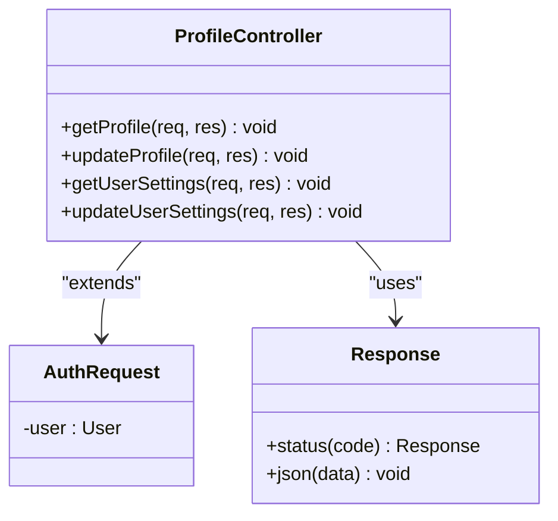
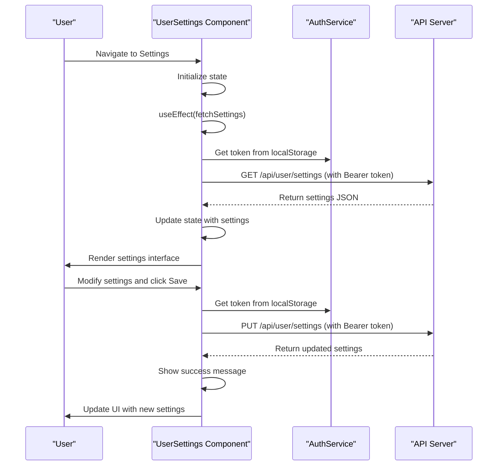
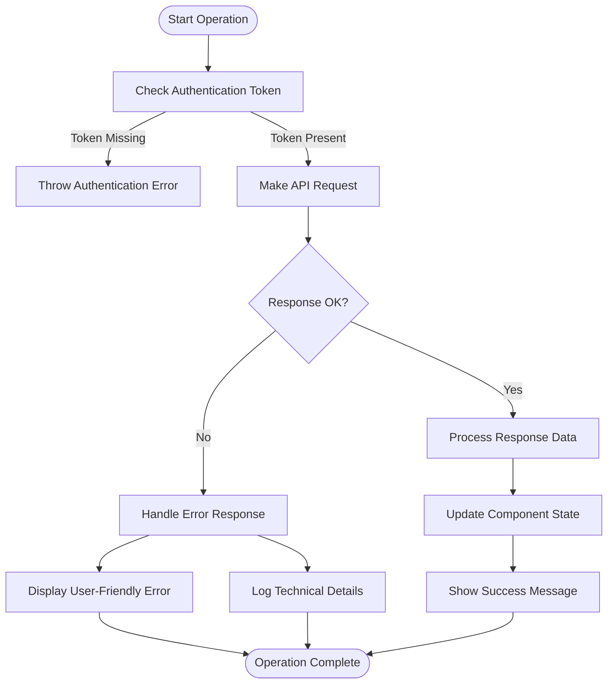

# User Preferences

<cite>
**Referenced Files in This Document**   
- [UserSettings.tsx](file://pikzels-clone/client/src/components/UserSettings.tsx)
- [auth.service.ts](file://pikzels-clone/shared/auth.service.ts)
- [profile.controller.ts](file://pikzels-clone/src/modules/auth/profile.controller.ts)
- [schema.md](file://pikzels-clone/docs/database/schema.md)
- [migration.sql](file://pikzels-clone/prisma/migrations/20250909081634_add_user_settings/migration.sql)
- [extending-user-settings.md](file://pikzels-clone/docs/guides/extending-user-settings.md)
</cite>

## Table of Contents
1. [Introduction](#introduction)
2. [Core Settings Categories](#core-settings-categories)
3. [Backend Implementation](#backend-implementation)
4. [Frontend Integration](#frontend-integration)
5. [API Request/Response Flow](#api-requestresponse-flow)
6. [State Management and Error Handling](#state-management-and-error-handling)
7. [Data Validation and Privacy](#data-validation-and-privacy)
8. [Cross-Device Synchronization](#cross-device-synchronization)
9. [Extending the Settings Schema](#extending-the-settings-schema)
10. [Conclusion](#conclusion)

## Introduction

The User Preferences system in Thumbnail Maker Studio enables users to customize their experience through various configurable settings. This comprehensive system covers appearance preferences, language selection, notification configurations, thumbnail defaults, and privacy controls. The implementation follows a modern architecture with a flexible JSON-based storage model that allows for easy extension and maintenance. The system is designed to provide a personalized experience while maintaining data integrity and user privacy across all application interactions.

## Core Settings Categories

The User Preferences system organizes settings into logical categories that address different aspects of the user experience. These categories are implemented through a structured interface that defines the available options and their data types.

### Appearance Settings
Users can customize the application's visual appearance through theme selection. The system supports both light and dark themes, allowing users to choose their preferred color scheme based on their environment or personal preference. The theme setting is implemented as a simple string enumeration with values "light" or "dark".

### Language Preferences
The language setting allows users to select their preferred interface language from available options including English, Spanish, French, German, and Japanese. This setting affects all text displayed in the application interface, providing localization support for international users.

### Notification Configuration
Users can manage their notification preferences through both email and push notification settings. These boolean flags determine whether the user receives alerts about account activities, system updates, or other relevant events. The notification system is designed to respect user preferences while ensuring important communications are delivered according to user specifications.

### Thumbnail Defaults
This category allows users to establish default parameters for thumbnail creation. Users can specify default dimensions (width and height) and select a preferred style template (bold, minimalist, or dramatic). These defaults are applied automatically when creating new thumbnails, reducing repetitive configuration and ensuring consistency across user-generated content.

### Privacy Controls
Privacy settings give users control over their visibility and content sharing. Users can choose whether their profile is visible to other users and whether newly created thumbnails are public by default. These settings empower users to manage their digital footprint and control how their content is shared within the platform.

**Section sources**
- [UserSettings.tsx](file://pikzels-clone/client/src/components/UserSettings.tsx#L4-L16)

## Backend Implementation

The backend implementation of the User Preferences system leverages Prisma ORM with a flexible JSON-based storage approach that accommodates evolving requirements without requiring frequent database migrations.

### Prisma UserSettings Model
The User model in the Prisma schema includes a `settings` field of type JSON, which stores all user preferences as a structured object. This design choice provides significant flexibility, allowing new settings to be added without altering the database schema. The JSON field can accommodate complex nested structures while maintaining query performance for the core user data.

```prisma
model User {
  id            String     @id @default(uuid())
  email         String     @unique
  passwordHash  String
  name          String?
  avatarUrl     String?
  isVerified    Boolean    @default(false)
  settings      Json?
  createdAt     DateTime   @default(now())
  updatedAt     DateTime   @updatedAt
  projects      Project[]
  thumbnails    Thumbnail[]
  subscriptions Subscription[]
}
```

### Database Migration
The user settings functionality was introduced through a database migration that added the `settings` column to the User table. This migration demonstrates the non-disruptive nature of the implementation, as it only required adding a new column without modifying existing data structures.

```sql
-- AlterTable
ALTER TABLE "User" ADD COLUMN "settings" JSONB;
```

This approach allows for backward compatibility, as existing users automatically receive an empty settings object when they first access the preferences interface.

### Controller Implementation
The profile controller handles all operations related to user settings through dedicated endpoints. The implementation follows REST principles with clear separation of concerns between different operations.



**Diagram sources**
- [profile.controller.ts](file://pikzels-clone/src/modules/auth/profile.controller.ts#L1-L108)

The controller methods include proper error handling and authentication checks, ensuring that users can only access or modify their own settings. The `getUserSettings` method retrieves the settings JSON object from the database, while `updateUserSettings` persists changes back to the database.

**Section sources**
- [profile.controller.ts](file://pikzels-clone/src/modules/auth/profile.controller.ts#L1-L108)
- [schema.md](file://pikzels-clone/docs/database/schema.md#L1-L201)
- [migration.sql](file://pikzels-clone/prisma/migrations/20250909081634_add_user_settings/migration.sql#L1-L3)

## Frontend Integration

The frontend implementation of the User Preferences system is centered around the UserSettings component, which provides a comprehensive interface for managing all user preferences.

### UserSettings Component Architecture
The UserSettings component is implemented as a React functional component with a well-structured state management approach. It maintains local state for settings, loading status, saving status, success messages, and error conditions. This state management ensures a responsive user interface that provides appropriate feedback during all operations.

The component uses the `useEffect` hook to automatically fetch settings when the component mounts, ensuring that users always see their current preferences. The fetch operation includes proper error handling and loading states to provide a smooth user experience.

### Integration with AuthService
The UserSettings component integrates with the shared AuthService to handle authentication and API communication. The service provides methods for setting and retrieving the authentication token, which is required for all settings-related API calls. This integration ensures that all requests are properly authenticated and that users remain logged in during their session.

The component retrieves the authentication token from localStorage and includes it in the Authorization header for all API requests. This approach maintains security while providing a seamless experience for authenticated users.



**Diagram sources**
- [UserSettings.tsx](file://pikzels-clone/client/src/components/UserSettings.tsx#L21-L661)
- [auth.service.ts](file://pikzels-clone/shared/auth.service.ts#L1-L141)

The component implements specific handler functions for each settings category, allowing for targeted updates without affecting unrelated preferences. These handlers use functional state updates to ensure that settings changes are applied correctly, even if multiple changes occur rapidly.

**Section sources**
- [UserSettings.tsx](file://pikzels-clone/client/src/components/UserSettings.tsx#L21-L661)
- [auth.service.ts](file://pikzels-clone/shared/auth.service.ts#L1-L141)

## API Request/Response Flow

The User Preferences system follows a standard REST API pattern for retrieving and updating user settings, with well-defined request and response structures.

### GET Request for Settings Retrieval
When a user accesses the settings page, the frontend sends a GET request to retrieve their current preferences:

**Request:**
```
GET /api/user/settings
Headers: {
  Authorization: Bearer <token>
}
```

**Response (Success - 200 OK):**
```json
{
  "settings": {
    "theme": "dark",
    "language": "en",
    "notifications": {
      "email": true,
      "push": false
    },
    "thumbnailDefaults": {
      "width": 1280,
      "height": 720,
      "style": "bold"
    },
    "privacy": {
      "profileVisible": true,
      "thumbnailsPublic": false
    }
  }
}
```

**Response (Error - 401 Unauthorized):**
```json
{
  "error": "Unauthorized"
}
```

### PUT Request for Settings Update
When a user saves changes to their preferences, the frontend sends a PUT request with the complete settings object:

**Request:**
```
PUT /api/user/settings
Headers: {
  Content-Type: application/json
  Authorization: Bearer <token>
}
Body: {
  "settings": {
    "theme": "light",
    "language": "es",
    "notifications": {
      "email": false,
      "push": true
    },
    "thumbnailDefaults": {
      "width": 1920,
      "height": 1080,
      "style": "minimalist"
    },
    "privacy": {
      "profileVisible": false,
      "thumbnailsPublic": true
    }
  }
}
```

**Response (Success - 200 OK):**
```json
{
  "settings": {
    "theme": "light",
    "language": "es",
    "notifications": {
      "email": false,
      "push": true
    },
    "thumbnailDefaults": {
      "width": 1920,
      "height": 1080,
      "style": "minimalist"
    },
    "privacy": {
      "profileVisible": false,
      "thumbnailsPublic": true
    }
  }
}
```

The API endpoints are designed to accept and return the complete settings object, ensuring that all preferences are consistently synchronized between the client and server. This approach prevents partial updates that could lead to inconsistent states.

**Section sources**
- [profile.controller.ts](file://pikzels-clone/src/modules/auth/profile.controller.ts#L50-L107)
- [UserSettings.tsx](file://pikzels-clone/client/src/components/UserSettings.tsx#L50-L98)

## State Management and Error Handling

The User Preferences system implements robust state management and comprehensive error handling to ensure a reliable user experience.

### Component State Structure
The UserSettings component maintains several state variables to track different aspects of the user interface:

- `settings`: Stores the current user preferences as a structured object
- `loading`: Indicates whether settings are being fetched from the server
- `saving`: Indicates whether settings are being saved to the server
- `success`: Tracks whether the last save operation was successful
- `error`: Stores any error messages from failed operations

This state management approach provides clear visual feedback to users about the current status of their settings operations.

### Error Handling Implementation
The system implements comprehensive error handling at multiple levels:

1. **Authentication Errors**: If no authentication token is found in localStorage, the system throws an error indicating that the user is not authenticated.

2. **Network Errors**: Failed fetch operations are caught and converted into user-friendly error messages displayed in the interface.

3. **Validation Errors**: While the current implementation relies on backend validation, the frontend could be extended to include client-side validation for immediate feedback.

4. **Recovery Mechanisms**: After failed operations, the system maintains the previous state, allowing users to retry without losing their changes.

The error handling follows a consistent pattern of try-catch blocks with appropriate error messages and logging. Errors are displayed prominently in the interface, while technical details are logged to the console for debugging purposes.



**Diagram sources**
- [UserSettings.tsx](file://pikzels-clone/client/src/components/UserSettings.tsx#L50-L98)
- [profile.controller.ts](file://pikzels-clone/src/modules/auth/profile.controller.ts#L50-L107)

The system also implements loading states to prevent user interaction during operations, reducing the likelihood of race conditions or duplicate requests.

**Section sources**
- [UserSettings.tsx](file://pikzels-clone/client/src/components/UserSettings.tsx#L21-L661)

## Data Validation and Privacy

The User Preferences system incorporates data validation and privacy considerations to ensure data integrity and protect user information.

### Data Validation Approach
The system employs a multi-layered validation strategy:

1. **Frontend Validation**: While the current implementation focuses on UI constraints (such as input types and required fields), it could be extended to include more comprehensive client-side validation.

2. **Backend Validation**: The profile controller includes basic validation through Prisma's type checking and database constraints. Additional validation rules can be implemented as needed for specific settings.

3. **Type Safety**: The TypeScript interface for UserSettings provides compile-time type checking, preventing many common errors before they reach runtime.

The validation system is designed to be extensible, allowing new validation rules to be added as new settings are introduced. For example, thumbnail dimensions could include minimum and maximum value constraints to prevent impractical settings.

### Privacy Considerations
The system addresses privacy through several mechanisms:

1. **Authentication Requirements**: All settings operations require valid authentication tokens, ensuring that users can only access their own preferences.

2. **Secure Storage**: Authentication tokens are stored in localStorage with appropriate security considerations, though in a production environment, additional measures like HTTP-only cookies might be considered.

3. **Data Minimization**: The settings object only includes necessary preferences, avoiding the collection of unnecessary personal information.

4. **Privacy Controls**: Users have explicit control over their profile visibility and content sharing through dedicated privacy settings.

5. **Audit Logging**: While not explicitly implemented in the current code, the system could be extended to log settings changes for security auditing.

The privacy design follows the principle of least privilege, ensuring that users have control over their data while the system maintains necessary functionality.

**Section sources**
- [UserSettings.tsx](file://pikzels-clone/client/src/components/UserSettings.tsx#L21-L661)
- [profile.controller.ts](file://pikzels-clone/src/modules/auth/profile.controller.ts#L50-L107)
- [schema.md](file://pikzels-clone/docs/database/schema.md#L1-L201)

## Cross-Device Synchronization

The User Preferences system is designed to support synchronization across multiple devices, ensuring a consistent user experience regardless of the access point.

### Synchronization Mechanism
The system achieves cross-device synchronization through server-side storage of preferences. Since all settings are stored in the database and retrieved from the server on each access, users automatically receive their latest preferences when logging in from any device.

This approach eliminates the need for complex client-side synchronization logic and ensures that the server state is always the source of truth. When a user updates their preferences on one device, those changes are immediately available on all other devices upon the next settings access.

### Consistency Guarantees
The system provides strong consistency guarantees through the following mechanisms:

1. **Atomic Updates**: Settings updates are performed as single database operations, ensuring that the entire settings object is updated consistently.

2. **Version Control**: While not explicitly implemented, the system could be extended to include version numbers or timestamps to detect and resolve conflicts if multiple devices attempt to update settings simultaneously.

3. **Conflict Resolution**: In cases where conflicts might occur, the last-write-wins strategy is implicitly followed, with the most recent update overwriting previous values.

4. **Offline Support**: The current implementation does not include offline support, but could be extended to cache settings locally and synchronize when connectivity is restored.

The synchronization design prioritizes simplicity and reliability over complex conflict resolution, making it suitable for the majority of user scenarios where settings changes are infrequent and not time-critical.

## Extending the Settings Schema

The User Preferences system is designed to be easily extensible, allowing new settings to be added without significant code changes or database migrations.

### Adding New Settings Categories
To add a new settings category, developers should follow these steps:

1. **Update the Interface**: Extend the UserSettings interface in UserSettings.tsx to include the new category with appropriate type definitions.

2. **Add UI Elements**: Create a new section in the UserSettings component with controls for the new settings.

3. **Implement Handler Functions**: Add handler functions to manage state updates for the new settings, following the pattern of existing handlers.

4. **Update Documentation**: Document the new settings in the extending-user-settings.md guide to ensure other developers understand the implementation.

### Best Practices for Extension
When extending the settings schema, consider the following best practices:

1. **Maintain Type Safety**: Always define proper TypeScript types for new settings to ensure compile-time error detection.

2. **Provide Defaults**: Include sensible default values for new settings to ensure a consistent experience for existing users.

3. **Validate Critical Settings**: Implement validation for settings that could impact application functionality or performance.

4. **Consider Performance**: Be mindful of the size of the settings object, as it is transferred with every settings operation.

5. **Plan for Migration**: Consider how existing users will receive new settings, potentially implementing migration logic if necessary.

6. **Test Thoroughly**: Include comprehensive tests for new settings to ensure they work correctly across all scenarios.

The flexible JSON-based storage model makes it straightforward to add new settings without database schema changes, supporting rapid iteration and feature development.

**Section sources**
- [extending-user-settings.md](file://pikzels-clone/docs/guides/extending-user-settings.md#L1-L244)
- [UserSettings.tsx](file://pikzels-clone/client/src/components/UserSettings.tsx#L4-L16)

## Conclusion

The User Preferences system in Thumbnail Maker Studio provides a comprehensive and flexible solution for user customization. By combining a well-structured frontend interface with a robust backend implementation, the system enables users to personalize their experience across multiple dimensions including appearance, language, notifications, thumbnail defaults, and privacy controls.

The architecture demonstrates several best practices in modern web application development, including the use of TypeScript for type safety, React for component-based UI development, and Prisma for database abstraction. The JSON-based settings storage provides exceptional flexibility, allowing for easy extension without requiring database migrations.

Key strengths of the implementation include its clear separation of concerns, comprehensive error handling, and support for cross-device synchronization. The system is designed to be maintainable and extensible, with clear patterns for adding new settings and functionality.

For future development, potential enhancements could include more sophisticated validation, improved offline support, enhanced privacy features, and additional settings categories to further personalize the user experience. The existing architecture provides a solid foundation for these and other improvements.