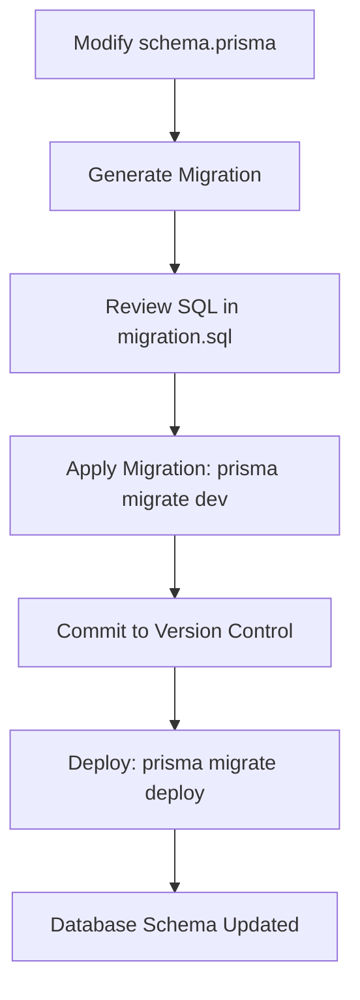
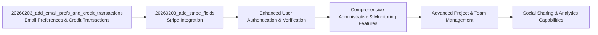

# Database Migrations

<cite>
**Referenced Files in This Document**
- [prisma/schema.prisma](file://pikzels-clone/prisma/schema.prisma)
- [prisma/migrations/20260203_add_email_prefs_and_credit_transactions/migration.sql](file://pikzels-clone/prisma/migrations/20260203_add_email_prefs_and_credit_transactions/migration.sql)
- [prisma/migrations/20260203_add_stripe_fields/migration.sql](file://pikzels-clone/prisma/migrations/20260203_add_stripe_fields/migration.sql)
- [prisma/migrations/migration_lock.toml](file://pikzels-clone/prisma/migrations/migration_lock.toml)
- [package.json](file://pikzels-clone/package.json)
- [railway.json](file://pikzels-clone/railway.json)
- [src/utils/prisma-factory.ts](file://pikzels-clone/src/utils/prisma-factory.ts)
</cite>

## Update Summary
**Changes Made**
- Updated migration workflow to reflect integration of `npx prisma migrate deploy` into deployment pipeline
- Added documentation for financial features including email preferences and credit transactions
- Enhanced Stripe integration fields documentation
- Updated migration history to include recent financial feature migrations
- Added new CreditTransaction model and associated financial capabilities
- Enhanced User model with comprehensive email preference system
- Updated deployment configuration to use `prisma migrate deploy` command

## Table of Contents
1. [Introduction](#introduction)
2. [Migration Workflow Overview](#migration-workflow-overview)
3. [Migration Lifecycle: dev vs deploy](#migration-lifecycle-dev-vs-deploy)
4. [Migration History and Schema Evolution](#migration-history-and-schema-evolution)
5. [Migration File Analysis](#migration-file-analysis)
6. [Financial Features and Credit System](#financial-features-and-credit-system)
7. [Stripe Integration Implementation](#stripe-integration-implementation)
8. [Version Control and Collaboration](#version-control-and-collaboration)
9. [Creating New Migrations](#creating-new-migrations)
10. [Deployment Pipeline Integration](#deployment-pipeline-integration)
11. [Best Practices](#best-practices)
12. [Conclusion](#conclusion)

## Introduction

This document provides comprehensive documentation for the Prisma migration strategy in Thumbnail Maker Studio. It details the workflow, structure, and best practices for managing database schema changes through Prisma migrations. The system uses a version-controlled migration approach to ensure consistent database evolution across development, staging, and production environments. This documentation covers the purpose and implementation of each migration, the SQL schema changes, and the operational procedures for creating, testing, and deploying migrations.

**Section sources**
- [prisma/schema.prisma](file://pikzels-clone/prisma/schema.prisma)
- [prisma/migrations/migration_lock.toml](file://pikzels-clone/prisma/migrations/migration_lock.toml)

## Migration Workflow Overview

The Prisma migration workflow in Thumbnail Maker Studio follows a structured process for evolving the database schema. Migrations are created and applied using Prisma's CLI tools, with distinct commands for development and production environments. The workflow begins with schema modifications in the `schema.prisma` file, followed by generating migration files that capture the necessary SQL changes. These migrations are then applied to the database and version-controlled alongside the application code.

The migration system ensures that all team members and deployment environments maintain database schema consistency. Each migration represents an atomic change to the database structure, allowing for predictable and reversible schema evolution. The workflow supports both forward migrations (applying changes) and rollback procedures when needed.



**Diagram sources**
- [prisma/schema.prisma](file://pikzels-clone/prisma/schema.prisma)
- [package.json](file://pikzels-clone/package.json)

## Migration Lifecycle: dev vs deploy

Thumbnail Maker Studio employs different Prisma commands for development and production environments to ensure safe and appropriate migration application. The `prisma migrate dev` command is used during development, while `prisma migrate deploy` is used for production deployments.

The `prisma migrate dev` command is designed for the development workflow. It creates new migrations when the Prisma schema changes, applies pending migrations to the database, and handles migration history conflicts that may arise from team collaboration. This command is typically run during local development and in CI/CD pipelines for non-production environments.

In contrast, `prisma migrate deploy` is optimized for production use. It applies all pending migrations to the database without creating new ones, making it suitable for automated deployment scripts. This command assumes that migrations have already been created and reviewed, focusing solely on applying them to the target database.

The package.json file contains a script alias `prisma:migrate` that points to `npx prisma migrate dev`, indicating the primary development workflow for applying migrations during local development and testing.

**Section sources**
- [package.json](file://pikzels-clone/package.json)
- [prisma/schema.prisma](file://pikzels-clone/prisma/schema.prisma)

## Migration History and Schema Evolution

The database schema in Thumbnail Maker Studio has evolved through a series of versioned migrations, each addressing specific feature requirements. The migration history reflects the project's development progression, from initial setup to advanced functionality.

The current migration sequence includes a comprehensive schema that establishes core entities such as User, Project, Thumbnail, Subscription, AdminNotification, AdminRole, AuditLog, FeatureFlag, SocialShare, SystemHealth, SystemMetrics, Team, TeamInvitation, TeamMember, Template, and UserSession. The most recent migrations add extensive financial capabilities including email preferences, credit transaction tracking, and Stripe payment integration.

Each migration is timestamp-prefixed to ensure chronological ordering and prevent naming conflicts in team environments. The schema evolution demonstrates a thoughtful approach to database design, where changes are implemented in discrete, purpose-driven steps. This incremental strategy allows for easier debugging, testing, and potential rollback if issues arise. The migration history serves as an audit trail of database changes, providing valuable context for developers understanding the current schema structure.



**Diagram sources**
- [prisma/migrations/20260203_add_email_prefs_and_credit_transactions/migration.sql](file://pikzels-clone/prisma/migrations/20260203_add_email_prefs_and_credit_transactions/migration.sql)
- [prisma/migrations/20260203_add_stripe_fields/migration.sql](file://pikzels-clone/prisma/migrations/20260203_add_stripe_fields/migration.sql)

## Migration File Analysis

### Financial Features and Email Preferences Migration

The recent migration introduces comprehensive financial and communication features that significantly enhance the platform's monetization capabilities. This migration adds the CreditTransaction model for tracking financial activities and enhances the User model with detailed email preference management.

Key financial enhancements include:
- **CreditTransaction Model**: Complete transaction tracking system for purchases, usage, refunds, and bonuses
- **Email Preference System**: Comprehensive email subscription management with marketing, product updates, security alerts, and weekly digests
- **Stripe Payment Integration**: Foundation for Stripe payment processing with customer and subscription tracking
- **Audit Trail**: Complete financial activity logging with timestamps and metadata

The migration introduces the CreditTransaction model with fields for transaction type, amount, description, and Stripe payment integration. Email preferences include boolean flags for marketing emails, product updates, security alerts, and weekly digest subscriptions, along with unsubscribe tracking.

**Section sources**
- [prisma/migrations/20260203_add_email_prefs_and_credit_transactions/migration.sql](file://pikzels-clone/prisma/migrations/20260203_add_email_prefs_and_credit_transactions/migration.sql)

### Stripe Integration Fields Migration

The second recent migration focuses specifically on Stripe payment integration, adding the infrastructure needed for subscription management and payment processing. This migration enhances both the User and Subscription models with Stripe-specific fields and creates the necessary indexes for efficient payment processing.

Key Stripe integration features include:
- **User Model Enhancements**: Stripe customer ID tracking and subscription association
- **Subscription Model Extensions**: Billing cycle management, cancellation tracking, and Stripe subscription ID management
- **Index Optimization**: Performance-optimized indexes for Stripe integration queries
- **Unique Constraints**: Ensures data integrity for Stripe identifiers

The migration adds columns for billing cycle, cancellation tracking, status management, and Stripe-specific identifiers. It also creates unique indexes for Stripe customer IDs and subscription IDs to prevent duplicates and ensure fast lookups.

**Section sources**
- [prisma/migrations/20260203_add_stripe_fields/migration.sql](file://pikzels-clone/prisma/migrations/20260203_add_stripe_fields/migration.sql)

### Core Entity Models

The migration establishes several core entity models that form the foundation of the Thumbnail Maker Studio platform:

**Project Model**: Enhanced project management with featured thumbnail support, hierarchical project structures, and team collaboration features. Includes parent-child relationships for nested projects and path tracking for complex project hierarchies.

**Thumbnail Model**: Central content management with AI-generated thumbnail support, user ownership tracking, and featured status indicators. Supports relationship with both projects and users for comprehensive content organization.

**SocialShare Model**: Dedicated social media integration with platform-specific tracking, engagement metrics, and error handling for failed shares. Supports multiple social platforms through a unified interface.

**System Monitoring Models**: Comprehensive system health and metrics tracking through SystemHealth and SystemMetrics models, enabling real-time monitoring and performance analysis.

**Section sources**
- [prisma/schema.prisma](file://pikzels-clone/prisma/schema.prisma)

## Financial Features and Credit System

### CreditTransaction Model

The CreditTransaction model represents a comprehensive financial transaction system that tracks all monetary activities within the Thumbnail Maker Studio platform. This model supports four primary transaction types: purchase, usage, refund, and bonus.

**Transaction Types**:
- **Purchase**: Credits acquired through payment processing
- **Usage**: Credits consumed for thumbnail generation or premium features
- **Refund**: Credits returned to users for cancellations or disputes
- **Bonus**: Credits awarded for promotions, referrals, or special events

**Key Features**:
- **Amount Tracking**: Integer-based credit amounts for precise accounting
- **Stripe Integration**: Direct linking to Stripe payment IDs for reconciliation
- **Metadata Storage**: JSONB field for storing transaction details and custom data
- **Audit Trail**: Complete timestamped record of all financial activities

The model includes foreign key relationships to the User model, ensuring proper attribution of transactions to individual accounts. Indexes are strategically placed on user ID, transaction type, and creation timestamps for efficient querying and reporting.

**Section sources**
- [prisma/schema.prisma](file://pikzels-clone/prisma/schema.prisma)
- [prisma/migrations/20260203_add_email_prefs_and_credit_transactions/migration.sql](file://pikzels-clone/prisma/migrations/20260203_add_email_prefs_and_credit_transactions/migration.sql)

### Email Preference Management

The enhanced User model now includes a comprehensive email preference system that provides granular control over communication preferences. This system supports compliance with email regulations while allowing users to customize their communication experience.

**Email Preference Categories**:
- **Marketing Emails**: Promotional content, new feature announcements, and special offers
- **Product Updates**: Platform updates, feature improvements, and service announcements
- **Security Alerts**: Account security notifications, suspicious activity warnings, and policy changes
- **Weekly Digest**: Aggregated weekly summaries of platform activity and user achievements

**Key Features**:
- **Default Settings**: Conservative defaults prioritizing user experience and compliance
- **Unsubscribe Tracking**: Timestamped records of unsubscribe actions for legal compliance
- **Preference Validation**: Ensures user consent for marketing communications
- **Compliance Ready**: Built-in mechanisms for GDPR and anti-spam regulation compliance

The email preference system integrates seamlessly with the credit transaction system, allowing for targeted communication about financial activities and account status.

**Section sources**
- [prisma/schema.prisma](file://pikzels-clone/prisma/schema.prisma)
- [prisma/migrations/20260203_add_email_prefs_and_credit_transactions/migration.sql](file://pikzels-clone/prisma/migrations/20260203_add_email_prefs_and_credit_transactions/migration.sql)

## Stripe Integration Implementation

### User Model Stripe Fields

The User model has been enhanced with Stripe-specific fields to support customer account management and payment processing. These fields enable seamless integration with Stripe's customer management system while maintaining data integrity and security.

**Stripe Integration Fields**:
- **stripeCustomerId**: Unique identifier for Stripe customer records
- **stripeSubscriptionId**: Association with active Stripe subscriptions
- **Email Verification**: Enhanced email verification system for payment security

The stripeCustomerId field includes a unique constraint to prevent duplicate customer records and ensure accurate billing. The stripeSubscriptionId field maintains the relationship between user accounts and their active subscriptions.

**Section sources**
- [prisma/schema.prisma](file://pikzels-clone/prisma/schema.prisma)
- [prisma/migrations/20260203_add_stripe_fields/migration.sql](file://pikzels-clone/prisma/migrations/20260203_add_stripe_fields/migration.sql)

### Subscription Model Stripe Enhancements

The Subscription model has been significantly expanded to support comprehensive Stripe subscription management. These enhancements enable sophisticated billing cycles, subscription lifecycle management, and payment processing integration.

**Enhanced Subscription Fields**:
- **billingCycle**: Monthly, annual, or custom billing intervals
- **cancelAtPeriodEnd**: Graceful cancellation at billing period completion
- **status**: Real-time subscription status tracking (active, past_due, canceled)
- **stripePriceId**: Association with Stripe price definitions
- **stripeSubscriptionId**: Unique Stripe subscription identifier

**Index Strategy**:
- Status indexing for subscription management queries
- Stripe subscription ID indexing for payment reconciliation
- Unique constraints for data integrity enforcement

The subscription model now supports complex billing scenarios including proration, upgrades/downgrades, and subscription modifications while maintaining auditability and compliance readiness.

**Section sources**
- [prisma/schema.prisma](file://pikzels-clone/prisma/schema.prisma)
- [prisma/migrations/20260203_add_stripe_fields/migration.sql](file://pikzels-clone/prisma/migrations/20260203_add_stripe_fields/migration.sql)

## Version Control and Collaboration

Prisma migrations are fully integrated into the version control system, ensuring that database schema changes are tracked alongside application code. All migration files in the `prisma/migrations` directory are committed to Git, creating a shared history of database evolution accessible to all team members.

The `migration_lock.toml` file plays a critical role in ensuring consistent migration application across different environments. This file records the database provider and prevents accidental provider changes that could lead to compatibility issues. By including this file in version control, the team ensures that all development, staging, and production environments use the same database provider configuration.

The timestamp-based naming convention for migration directories (e.g., `20260203_add_email_prefs_and_credit_transactions`) prevents naming conflicts when multiple developers create migrations simultaneously. Prisma's migration system detects when migrations have been pulled from version control but not yet applied, automatically applying them in the correct order.

**Section sources**
- [prisma/migrations/migration_lock.toml](file://pikzels-clone/prisma/migrations/migration_lock.toml)
- [prisma/migrations/](file://pikzels-clone/prisma/migrations/)

## Creating New Migrations

To create new migrations when adding features, developers should follow the established workflow. First, modify the `schema.prisma` file to reflect the desired schema changes, such as adding new models, fields, or relationships. Then, generate the migration using the Prisma CLI:

```bash
npx prisma migrate dev --name migration_name
```

This command creates a new migration directory with a timestamp prefix and generates the corresponding SQL file. Developers should carefully review the generated SQL to ensure it accurately reflects the intended changes and doesn't include unintended modifications.

Before committing, migrations should be tested in a development environment to verify they apply correctly and don't cause data loss or corruption. For migrations that modify existing data, additional validation scripts may be necessary to ensure data integrity.

When the migration is ready, it should be committed to version control along with any application code changes that depend on the new schema. The migration will then be automatically applied to other developers' databases when they pull the changes and run `prisma migrate dev`.

**Section sources**
- [prisma/schema.prisma](file://pikzels-clone/prisma/schema.prisma)
- [package.json](file://pikzels-clone/package.json)

## Deployment Pipeline Integration

**Updated** The deployment pipeline has been enhanced to automatically apply Prisma migrations during deployment, ensuring reliable database schema updates without manual intervention.

Thumbnail Maker Studio's deployment pipeline integrates Prisma migration deployment through the `railway.json` configuration file. The deployment process is orchestrated to first apply pending migrations using `npx prisma migrate deploy` before starting the application server. This ensures that the database schema is always up-to-date with the deployed application code.

The deployment workflow follows this sequence:
1. **Build Phase**: Application dependencies are installed, Prisma client is generated, and the application is compiled
2. **Migration Phase**: Pending migrations are automatically applied using `prisma migrate deploy`
3. **Startup Phase**: The application server starts with guaranteed schema consistency

This automated approach eliminates the risk of deployment failures due to unapplied migrations and reduces manual intervention requirements. The deployment configuration ensures that migrations are applied in the correct order and that any migration conflicts are handled appropriately.

**Section sources**
- [railway.json](file://pikzels-clone/railway.json)

## Best Practices

### Migration Naming
Use descriptive names that clearly indicate the purpose of the migration. Follow the convention of using snake_case and including the feature or component being modified (e.g., `add_user_settings`, `add_social_shares`, `add_email_prefs_and_credit_transactions`).

### Testing Migrations
Always test migrations in a development environment before committing. Verify that the migration applies cleanly and that existing data remains intact. For complex migrations, create test data that exercises the new schema features.

### Rollback Procedures
Design migrations to be as reversible as possible. For simple schema changes, Prisma can often generate rollback scripts automatically. For complex data migrations, document the rollback procedure in the migration comments. Regular database backups should be performed before applying migrations to production.

### Handling Conflicts
When migration history conflicts occur (e.g., two developers create migrations with the same sequence), use Prisma's `--create-only` flag to generate the migration without applying it, then coordinate with the team to resolve the conflict before applying.

### Production Deployments
Use `prisma migrate deploy` for production deployments, as it's optimized for automated environments. Ensure migrations are thoroughly tested in staging before production deployment. Monitor the deployment process to catch any migration failures immediately.

### Automated Deployment
Leverage the deployment pipeline integration to automatically apply migrations during deployment. This reduces manual intervention and ensures consistent database state across all environments.

### Financial Data Integrity
For financial migrations, implement additional validation procedures including:
- Transaction amount verification
- Currency conversion testing
- Compliance validation for email preferences
- Stripe API integration testing

**Section sources**
- [prisma/migrations/](file://pikzels-clone/prisma/migrations/)
- [package.json](file://pikzels-clone/package.json)
- [railway.json](file://pikzels-clone/railway.json)

## Conclusion

The Prisma migration strategy in Thumbnail Maker Studio provides a robust framework for managing database schema evolution. The recent integration of `prisma migrate deploy` into the deployment pipeline ensures automatic and reliable database schema application during deployments, reducing manual intervention and improving deployment reliability.

The addition of financial features through the recent migrations demonstrates the system's ability to support complex business requirements while maintaining database consistency and performance. The comprehensive credit transaction system, email preference management, and Stripe integration provide a solid foundation for monetization and user communication.

By following the documented workflow and best practices, the development team can safely and efficiently modify the database structure to support new features. The version-controlled migration history ensures consistency across environments, while the clear separation between development and production commands enables appropriate risk management. The automated deployment pipeline integration provides confidence that database schemas will be consistently applied across all environments.

As the application continues to evolve, this migration strategy will support ongoing database changes while maintaining data integrity, developer productivity, and deployment reliability. The comprehensive financial and communication features introduced in recent migrations position the platform for successful monetization and user engagement while maintaining technical excellence and regulatory compliance.