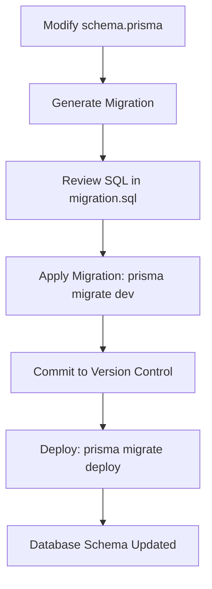

# Database Migrations

<cite>
**Referenced Files in This Document**  
- [prisma/schema.prisma](file://pikzels-clone/prisma/schema.prisma)
- [prisma/migrations/20250829072650_init/migration.sql](file://pikzels-clone/prisma/migrations/20250829072650_init/migration.sql)
- [prisma/migrations/20250909081634_add_user_settings/migration.sql](file://pikzels-clone/prisma/migrations/20250909081634_add_user_settings/migration.sql)
- [prisma/migrations/20250911125101_add_featured_thumbnail_fields/migration.sql](file://pikzels-clone/prisma/migrations/20250911125101_add_featured_thumbnail_fields/migration.sql)
- [prisma/migrations/20250911134004_add_social_shares/migration.sql](file://pikzels-clone/prisma/migrations/20250911134004_add_social_shares/migration.sql)
- [prisma/migrations/migration_lock.toml](file://pikzels-clone/prisma/migrations/migration_lock.toml)
- [package.json](file://pikzels-clone/package.json)
</cite>

## Table of Contents
1. [Introduction](#introduction)
2. [Migration Workflow Overview](#migration-workflow-overview)
3. [Migration Lifecycle: dev vs deploy](#migration-lifecycle-dev-vs-deploy)
4. [Migration History and Schema Evolution](#migration-history-and-schema-evolution)
5. [Migration File Analysis](#migration-file-analysis)
6. [Version Control and Collaboration](#version-control-and-collaboration)
7. [Creating New Migrations](#creating-new-migrations)
8. [Best Practices](#best-practices)
9. [Conclusion](#conclusion)

## Introduction

This document provides comprehensive documentation for the Prisma migration strategy in Thumbnail Maker Studio. It details the workflow, structure, and best practices for managing database schema changes through Prisma migrations. The system uses a version-controlled migration approach to ensure consistent database evolution across development, staging, and production environments. This documentation covers the purpose and implementation of each migration, the SQL schema changes, and the operational procedures for creating, testing, and deploying migrations.

**Section sources**
- [prisma/schema.prisma](file://pikzels-clone/prisma/schema.prisma)
- [prisma/migrations/migration_lock.toml](file://pikzels-clone/prisma/migrations/migration_lock.toml)

## Migration Workflow Overview

The Prisma migration workflow in Thumbnail Maker Studio follows a structured process for evolving the database schema. Migrations are created and applied using Prisma's CLI tools, with distinct commands for development and production environments. The workflow begins with schema modifications in the `schema.prisma` file, followed by generating migration files that capture the necessary SQL changes. These migrations are then applied to the database and version-controlled alongside the application code.

The migration system ensures that all team members and deployment environments maintain database schema consistency. Each migration represents an atomic change to the database structure, allowing for predictable and reversible schema evolution. The workflow supports both forward migrations (applying changes) and rollback procedures when needed.



**Diagram sources**
- [prisma/schema.prisma](file://pikzels-clone/prisma/schema.prisma)
- [package.json](file://pikzels-clone/package.json)

## Migration Lifecycle: dev vs deploy

Thumbnail Maker Studio employs different Prisma commands for development and production environments to ensure safe and appropriate migration application. The `prisma migrate dev` command is used during development, while `prisma migrate deploy` is used for production deployments.

The `prisma migrate dev` command is designed for the development workflow. It creates new migrations when the Prisma schema changes, applies pending migrations to the database, and handles migration history conflicts that may arise from team collaboration. This command is typically run during local development and in CI/CD pipelines for non-production environments.

In contrast, `prisma migrate deploy` is optimized for production use. It applies all pending migrations to the database without creating new ones, making it suitable for automated deployment scripts. This command assumes that migrations have already been created and reviewed, focusing solely on applying them to the target database.

The package.json file contains a script alias `prisma:migrate` that points to `npx prisma migrate dev`, indicating the primary development workflow for applying migrations during local development and testing.

**Section sources**
- [package.json](file://pikzels-clone/package.json)
- [prisma/schema.prisma](file://pikzels-clone/prisma/schema.prisma)

## Migration History and Schema Evolution

The database schema in Thumbnail Maker Studio has evolved through a series of versioned migrations, each addressing specific feature requirements. The migration history reflects the project's development progression, from initial setup to advanced functionality.

The migration sequence begins with the initial schema setup, establishing core entities such as User, Project, Thumbnail, and Subscription. Subsequent migrations incrementally enhance the data model by adding user settings, featured thumbnail capabilities, and social sharing functionality. Each migration is timestamp-prefixed to ensure chronological ordering and prevent naming conflicts in team environments.

The schema evolution demonstrates a thoughtful approach to database design, where changes are implemented in discrete, purpose-driven steps. This incremental strategy allows for easier debugging, testing, and potential rollback if issues arise. The migration history serves as an audit trail of database changes, providing valuable context for developers understanding the current schema structure.


**Diagram sources**
- [prisma/migrations/20250829072650_init/migration.sql](file://pikzels-clone/prisma/migrations/20250829072650_init/migration.sql)
- [prisma/migrations/20250909081634_add_user_settings/migration.sql](file://pikzels-clone/prisma/migrations/20250909081634_add_user_settings/migration.sql)
- [prisma/migrations/20250911125101_add_featured_thumbnail_fields/migration.sql](file://pikzels-clone/prisma/migrations/20250911125101_add_featured_thumbnail_fields/migration.sql)
- [prisma/migrations/20250911134004_add_social_shares/migration.sql](file://pikzels-clone/prisma/migrations/20250911134004_add_social_shares/migration.sql)

## Migration File Analysis

### Initial Schema Migration

The initial migration establishes the foundational database structure for Thumbnail Maker Studio. It creates four core tables: User, Project, Thumbnail, and Subscription. The User table includes essential fields for authentication and user information, with email uniqueness enforced through a database constraint. The Project and Thumbnail tables establish relationships through foreign keys, maintaining referential integrity. The Subscription table tracks user subscription details, including credit balances and billing periods.

**Section sources**
- [prisma/migrations/20250829072650_init/migration.sql](file://pikzels-clone/prisma/migrations/20250829072650_init/migration.sql)

### User Settings Migration

The user settings migration introduces a flexible approach to storing user preferences by adding a JSONB column to the User table. This schema design allows for extensible user settings without requiring future migrations for new preference types. The JSONB data type enables efficient storage and querying of semi-structured data, supporting various user interface configurations, notification preferences, and application settings.

**Section sources**
- [prisma/migrations/20250909081634_add_user_settings/migration.sql](file://pikzels-clone/prisma/migrations/20250909081634_add_user_settings/migration.sql)

### Featured Thumbnail Fields Migration

This migration significantly enhances the Project and Thumbnail models to support featured thumbnail functionality. It employs Prisma's `redefineTables` approach to modify existing tables by adding new columns and relationships. The Project table gains a `featuredThumbnailId` field with a foreign key constraint to the Thumbnail table, allowing projects to designate a specific thumbnail as featured. The Thumbnail table adds an `isFeatured` boolean flag to indicate whether a thumbnail is currently featured in its parent project.

The migration uses SQLite pragmas to temporarily defer foreign key constraints during the table redefinition process, ensuring data integrity while restructuring. A unique index on `Project.featuredThumbnailId` prevents multiple projects from featuring the same thumbnail simultaneously.

**Section sources**
- [prisma/migrations/20250911125101_add_featured_thumbnail_fields/migration.sql](file://pikzels-clone/prisma/migrations/20250911125101_add_featured_thumbnail_fields/migration.sql)

### Social Sharing Migration

The social sharing migration introduces a dedicated `SocialShare` table to track thumbnail sharing activities across various platforms. This table captures essential information about each sharing event, including the target platform, share status, timestamps, and engagement metrics. Foreign key constraints link each social share to the corresponding thumbnail and user, maintaining referential integrity.

The schema supports multiple social platforms (Twitter, Facebook, LinkedIn, Pinterest) through a generic `platform` field. The `engagement` column uses JSONB to store platform-specific metrics, providing flexibility for different engagement data structures. Error handling is incorporated with `errorMessage` and `status` fields to track and diagnose sharing failures.

**Section sources**
- [prisma/migrations/20250911134004_add_social_shares/migration.sql](file://pikzels-clone/prisma/migrations/20250911134004_add_social_shares/migration.sql)

## Version Control and Collaboration

Prisma migrations are fully integrated into the version control system, ensuring that database schema changes are tracked alongside application code. All migration files in the `prisma/migrations` directory are committed to Git, creating a shared history of database evolution accessible to all team members.

The `migration_lock.toml` file plays a critical role in ensuring consistent migration application across different environments. This file records the database provider and prevents accidental provider changes that could lead to compatibility issues. By including this file in version control, the team ensures that all development, staging, and production environments use the same database provider configuration.

The timestamp-based naming convention for migration directories (e.g., `20250829072650_init`) prevents naming conflicts when multiple developers create migrations simultaneously. Prisma's migration system detects when migrations have been pulled from version control but not yet applied, automatically applying them in the correct order.

**Section sources**
- [prisma/migrations/migration_lock.toml](file://pikzels-clone/prisma/migrations/migration_lock.toml)
- [prisma/migrations/](file://pikzels-clone/prisma/migrations/)

## Creating New Migrations

To create new migrations when adding features, developers should follow the established workflow. First, modify the `schema.prisma` file to reflect the desired schema changes, such as adding new models, fields, or relationships. Then, generate the migration using the Prisma CLI:

```bash
npx prisma migrate dev --name migration_name
```

This command creates a new migration directory with a timestamp prefix and generates the corresponding SQL file. Developers should carefully review the generated SQL to ensure it accurately reflects the intended changes and doesn't include unintended modifications.

Before committing, migrations should be tested in a development environment to verify they apply correctly and don't cause data loss or corruption. For migrations that modify existing data, additional validation scripts may be necessary to ensure data integrity.

When the migration is ready, it should be committed to version control along with any application code changes that depend on the new schema. The migration will then be automatically applied to other developers' databases when they pull the changes and run `prisma migrate dev`.

**Section sources**
- [prisma/schema.prisma](file://pikzels-clone/prisma/schema.prisma)
- [package.json](file://pikzels-clone/package.json)

## Best Practices

### Migration Naming
Use descriptive names that clearly indicate the purpose of the migration. Follow the convention of using snake_case and including the feature or component being modified (e.g., `add_user_settings`, `add_social_shares`).

### Testing Migrations
Always test migrations in a development environment before committing. Verify that the migration applies cleanly and that existing data remains intact. For complex migrations, create test data that exercises the new schema features.

### Rollback Procedures
Design migrations to be as reversible as possible. For simple schema changes, Prisma can often generate rollback scripts automatically. For complex data migrations, document the rollback procedure in the migration comments. Regular database backups should be performed before applying migrations to production.

### Handling Conflicts
When migration history conflicts occur (e.g., two developers create migrations with the same sequence), use Prisma's `--create-only` flag to generate the migration without applying it, then coordinate with the team to resolve the conflict before applying.

### Production Deployments
Use `prisma migrate deploy` for production deployments, as it's optimized for automated environments. Ensure migrations are thoroughly tested in staging before production deployment. Monitor the deployment process to catch any migration failures immediately.

**Section sources**
- [prisma/migrations/](file://pikzels-clone/prisma/migrations/)
- [package.json](file://pikzels-clone/package.json)

## Conclusion

The Prisma migration strategy in Thumbnail Maker Studio provides a robust framework for managing database schema evolution. By following the documented workflow and best practices, the development team can safely and efficiently modify the database structure to support new features. The version-controlled migration history ensures consistency across environments, while the clear separation between development and production commands enables appropriate risk management. As the application continues to evolve, this migration strategy will support ongoing database changes while maintaining data integrity and developer productivity.