# Database Schema & ORM

<cite>
**Referenced Files in This Document**
- [schema.prisma](file://pikzels-clone/prisma/schema.prisma)
- [seed.ts](file://pikzels-clone/prisma/seed.ts)
- [subscription.service.ts](file://pikzels-clone/src/modules/subscription/subscription.service.ts)
- [subscription.config.ts](file://pikzels-clone/src/modules/subscription/subscription.config.ts)
- [brand-kit.service.ts](file://pikzels-clone/src/modules/brand-kit/brand-kit.service.ts)
- [brand-kit.controller.ts](file://pikzels-clone/src/modules/brand-kit/brand-kit.controller.ts)
- [brand-kit.routes.ts](file://pikzels-clone/src/modules/brand-kit/brand-kit.routes.ts)
- [prisma-factory.ts](file://pikzels-clone/src/utils/prisma-factory.ts)
- [credit.service.ts](file://pikzels-clone/src/modules/credit/credit.service.ts)
- [email.service.ts](file://pikzels-clone/src/modules/auth/email.service.ts)
- [package.json](file://pikzels-clone/package.json)
- [create-test-users.ts](file://pikzels-clone/create-test-users.ts)
- [setup-all-test-users.ts](file://pikzels-clone/setup-all-test-users.ts)
- [verify-test-users.ts](file://pikzels-clone/verify-test-users.ts)
- [remove-test-users.ts](file://pikzels-clone/remove-test-users.ts)
</cite>

## Update Summary
**Changes Made**
- Enhanced Prisma seed script with new Ultimate Tester account implementation (ultratester@thumpiks.com)
- Added comprehensive subscription seeding functionality with TEST_SUBSCRIPTIONS object
- Implemented varied subscription plan types and credit allocations for different test accounts
- Updated database seeding documentation to reflect new subscription management system
- Enhanced test user management with comprehensive subscription provisioning
- Expanded schema to include comprehensive feedback, contact, chat, and watermark systems
- Added new table relationships for admin notifications, audit logs, feature flags, and system health monitoring
- Enhanced User model with expanded relationships for brand kit, feedback, contact submissions, and chat sessions

## Table of Contents
1. [Introduction](#introduction)
2. [Data Model Overview](#data-model-overview)
3. [Entity Relationship Diagram](#entity-relationship-diagram)
4. [Model Definitions](#model-definitions)
5. [Brand Management System](#brand-management-system)
6. [Feedback & Support Systems](#feedback--support-systems)
7. [Global Chat & Communication](#global-chat--communication)
8. [Administrative & Operational Models](#administrative--operational-models)
9. [Migration Strategy](#migration-strategy)
10. [Prisma Client Usage](#prisma-client-usage)
11. [Database Seeding & Test User Management](#database-seeding--test-user-management)
12. [Query Examples](#query-examples)
13. [Data Integrity and Constraints](#data-integrity-and-constraints)
14. [Indexing and Performance](#indexing-and-performance)
15. [Schema Evolution](#schema-evolution)

## Introduction

This document provides comprehensive documentation for the database schema and ORM implementation of Thumbnail Maker Studio. The system uses Prisma as the ORM layer with a PostgreSQL database backend, managing core entities including users, projects, thumbnails, social shares, subscriptions, credit transactions, and a comprehensive brand management system. The schema has evolved through a series of migrations to support new features while maintaining data integrity and performance.

The most recent enhancements introduce sophisticated administrative systems including feedback and ticketing, global chat functionality, comprehensive brand management with specialized models for logos, color palettes, typography, brand voice, photography assets, graphics, icons, style presets, and custom categories. The system now includes extensive operational monitoring with admin notifications, audit logging, feature flags, system health tracking, and comprehensive user management capabilities with expanded relationships for all new functional areas.

**Section sources**
- [schema.prisma](file://pikzels-clone/prisma/schema.prisma)

## Data Model Overview

The database schema for Thumbnail Maker Studio consists of numerous interconnected models that represent the core entities of the application. The primary models include User, Project, Thumbnail, SocialShare, Subscription, CreditTransaction, and a comprehensive brand management system with specialized models for brand asset storage and management. The schema now includes extensive administrative and operational models for feedback management, global chat, system monitoring, and comprehensive user relationship management.

The data model follows relational database principles with proper normalization while incorporating JSON fields for flexible data storage where appropriate. Relationships between entities are explicitly defined with foreign key constraints to ensure data integrity.

```mermaid
erDiagram
USER {
string id PK
string email UK
string username UK
string passwordHash
string name
string avatarUrl
boolean isVerified
string emailVerificationToken UK
datetime emailVerificationExpiry
boolean emailVerified
boolean marketingEmails
boolean productUpdates
boolean weeklyDigest
boolean securityAlerts
datetime emailUnsubscribedAt
string displayPreference
json settings
datetime createdAt
datetime updatedAt
datetime lastLoginAt
boolean isActive
string stripeCustomerId UK
string stripeSubscriptionId UK
string polarCustomerId UK
string youtubeAccessToken
string youtubeRefreshToken
string youtubeChannelId
datetime youtubeConnectedAt
datetime emailUnsubscribedAt
}
PROJECT {
string id PK
string name
string description
string userId FK
string featuredThumbnailId FK
string parentProjectId FK
string teamId FK
string folderType
integer depth
string projectPath
string category
boolean isArchived
datetime createdAt
datetime updatedAt
}
THUMBNAIL {
string id PK
string title
string imageUrl
string originalImageUrl
string prompt
json parameters
string projectId FK
string userId FK
boolean isFeatured
integer downloadCount
integer editCount
string storagePublicId
string storageProvider
datetime deletedAt
datetime createdAt
}
SOCIALSHARE {
string id PK
string thumbnailId FK
string userId FK
string platform
string shareUrl
string shareId
string status
string errorMessage
datetime sharedAt
json engagement
}
SUBSCRIPTION {
string id PK
string planType
integer creditsBalance
integer creditsUsed
datetime periodStart
datetime periodEnd
string userId FK
string billingCycle
boolean cancelAtPeriodEnd
string status
string stripePriceId
string stripeSubscriptionId UK
string polarSubscriptionId UK
string polarProductId
string billingProvider
datetime createdAt
}
CREDITTRANSACTION {
string id PK
string userId FK
string type
integer amount
string description
string stripePaymentId
string polarOrderId
json metadata
datetime createdAt
}
ADMINNOTIFICATION {
string id PK
string title
string message
string type
string priority
boolean isRead
datetime readAt
datetime createdAt
datetime expiresAt
json metadata
}
AUDITLOG {
string id PK
string userId FK
string adminId FK
string action
string resource
string resourceId
json details
string ipAddress
string userAgent
datetime timestamp
string severity
}
FEATUREFLAG {
string id PK
string name UK
string description
boolean isEnabled
json config
string createdBy
datetime createdAt
datetime updatedAt
}
SYSTEMHEALTH {
string id PK
string service
string status
float response
float errorRate
json details
datetime checkedAt
}
SYSTEMMETRICS {
string id PK
string metricType
float metricValue
datetime metricDate
json additionalData
datetime createdAt
}
TEAM {
string id PK
string name
string description
string ownerId FK
datetime createdAt
datetime updatedAt
}
TEAMINVITATION {
string id PK
string teamId FK
string inviterId FK
string inviteeId FK
string status
datetime invitedAt
datetime respondedAt
}
TEAMMEMBER {
string id PK
string teamId FK
string userId FK
string role
datetime joinedAt
}
TEMPLATE {
string id PK
string name
string description
string thumbnailId FK
string creatorId FK
json parameters
json tags
boolean isPublic
integer downloads
integer likes
datetime createdAt
datetime updatedAt
}
VISIONANALYSIS {
string id PK
string userId FK
string imageUrl
string description
string suggestedPrompt
json elements
string sourceType
datetime createdAt
}
ABTEST {
string id PK
string name
string description
string userId FK
string status
datetime startDate
datetime endDate
datetime createdAt
datetime updatedAt
}
ABTESTVARIANT {
string id PK
string testId FK
string name
string thumbnailId FK
integer impressions
integer clicks
float ctr
boolean isControl
}
ABTESTIMPRESSION {
string id PK
string testId FK
string variantId FK
string userId FK
string action
json metadata
datetime createdAt
}
USERASSET {
string id PK
string userId FK
string type
string url
string publicId
string name
integer sizeBytes
string mimeType
integer width
integer height
datetime createdAt
}
USERURLHISTORY {
string id PK
string userId FK
string url UK
string title
string platform
string thumbnailUrl
float selectedFrameTime
boolean pinned
datetime createdAt
}
COMPOSITIONLAYOUT {
string id PK
string name
string description
string category
json tags
integer canvasWidth
integer canvasHeight
string wireframeSvg
json slots
json textSlots
string fallbackBackground
string previewUrl
boolean builtIn
boolean isPublic
integer popularity
integer downloads
integer likes
string creatorId
datetime createdAt
datetime updatedAt
}
USERSESSION {
string id PK
string userId FK
string sessionId UK
string ipAddress
string userAgent
datetime loginAt
datetime lastActivity
datetime logoutAt
boolean isActive
}
PASSWORDRESETTOKEN {
string id PK
string userId FK
string token UK
string ipAddress
string userAgent
datetime createdAt
datetime expiresAt
datetime usedAt
boolean isUsed
}
BRANDLOGO {
string id PK
string userId FK
string name
string url
string publicId
string variant
boolean isPrimary
string fileType
datetime createdAt
}
BRANDCOLORPALETTE {
string id PK
string userId FK
string name
boolean isPrimary
datetime createdAt
}
BRANDCOLORSWATCH {
string id PK
string paletteId FK
string hex
string name
string role
}
BRANDFONT {
string id PK
string userId FK
string name
string fontFamily
json weights
string role
string previewText
datetime createdAt
}
BRANDVOICE {
string id PK
string userId UK
string tone
string description
json keywords
json dos
json donts
datetime createdAt
datetime updatedAt
}
BRANDPHOTO {
string id PK
string userId FK
string name
string url
string publicId
string thumbnailUrl
json tags
string category
datetime createdAt
}
BRANDGRAPHIC {
string id PK
string userId FK
string name
string url
string publicId
string thumbnailUrl
string type
datetime createdAt
}
BRANDICON {
string id PK
string userId FK
string name
text svg
string category
datetime createdAt
}
BRANDSTYLEPRESET {
string id PK
string userId FK
string name
string previewUrl
string textPlacement
string overlayColor
float overlayOpacity
json fontPairing
json colorScheme
datetime createdAt
}
BRANDCUSTOMCATEGORY {
string id PK
string userId FK
string name
string icon
string color
string bgColor
string borderColor
string textColor
string hoverColor
datetime createdAt
}
FEEDBACK {
string id PK
string userId FK
string type
string subject
text message
string screenshotUrl
string screenshotPublicId
string sentiment
float sentimentScore
string category
json tags
string aiSummary
string priority
datetime createdAt
datetime updatedAt
}
TICKET {
string id PK
string feedbackId UK
string status
string assignee
text resolution
text internalNotes
datetime resolvedAt
datetime closedAt
datetime createdAt
datetime updatedAt
}
TICKETREPLY {
string id PK
string ticketId FK
string authorType
string authorId
string authorName
text message
boolean isInternal
datetime createdAt
}
CONTACTSUBMISSION {
string id PK
string name
string email
string subject
text message
string screenshotUrl
string screenshotPublicId
string status
json triageResult
boolean aiResponseSent
string ticketId UK
string userId
string ipAddress
datetime createdAt
datetime resolvedAt
}
CHATSESSION {
string id PK
string userId FK
string title
string scope
string status
string escalatedToTicketId UK
json metadata
integer messageCount
datetime createdAt
datetime updatedAt
datetime lastMessageAt
}
CHATMESSAGE {
string id PK
string sessionId FK
string role
text content
string imageUrl
string imagePublicId
json metadata
datetime createdAt
}
EMAILLOG {
string id PK
string userId FK
string emailType
string recipientEmail
string fromEmail
string subject
string status
string providerMessageId
string errorMessage
string errorCode
string bounceReason
integer retryCount
integer maxRetries
datetime sentAt
datetime deliveredAt
datetime failedAt
datetime createdAt
datetime updatedAt
}
REVIEW {
string id PK
string userId UK
integer rating
string title
text body
string channelName
string channelUrl
string subscribers
string niche
string improvement
string status
boolean isFeatured
string adminNote
datetime reviewedAt
string reviewedBy
datetime createdAt
datetime updatedAt
}
USER ||--o{ PROJECT : owns
USER ||--o{ THUMBNAIL : creates
USER ||--o{ SOCIALSHARE : shares
USER ||--o{ SUBSCRIPTION : has
USER ||--o{ CREDITTRANSACTION : makes
USER ||--o{ ADMINNOTIFICATION : receives
USER ||--o{ AUDITLOG : generates
USER ||--o{ TEAM : belongs
USER ||--o{ USERASSET : uploads
USER ||--o{ USERURLHISTORY : accesses
USER ||--o{ VISIONANALYSIS : submits
USER ||--o{ ABTEST : manages
USER ||--o{ ABTESTIMPRESSION : views
USER ||--o{ USERSESSION : maintains
USER ||--o{ PASSWORDRESETTOKEN : uses
USER ||--o{ FEEDBACK : submits
USER ||--o{ CONTACTSUBMISSION : creates
USER ||--o{ CHATSESSION : participates
USER ||--o{ EMAILLOG : receives
USER ||--o{ REVIEW : writes
USER ||--o{ BRANDLOGO : contains
USER ||--o{ BRANDCOLORPALETTE : contains
USER ||--o{ BRANDFONT : contains
USER ||--o{ BRANDVOICE : defines
USER ||--o{ BRANDPHOTO : contains
USER ||--o{ BRANDGRAPHIC : contains
USER ||--o{ BRANDICON : contains
USER ||--o{ BRANDSTYLEPRESET : contains
USER ||--o{ BRANDCUSTOMCATEGORY : contains
PROJECT ||--o{ THUMBNAIL : contains
PROJECT }o--|| THUMBNAIL : "featured in"
PROJECT ||--o{ PROJECT : "parent-child"
THUMBNAIL ||--o{ SOCIALSHARE : shared via
SUBSCRIPTION ||--o{ CREDITTRANSACTION : "tracks usage"
TEAM ||--o{ TEAMINVITATION : sends
TEAM ||--o{ TEAMMEMBER : includes
TEAM ||--o{ PROJECT : manages
TEMPLATE ||--o{ THUMBNAIL : based on
ABTEST ||--o{ ABTESTVARIANT : contains
ABTEST ||--o{ ABTESTIMPRESSION : tracks
ABTESTVARIANT ||--o{ THUMBNAIL : uses
FEEDBACK ||--o{ TICKET : escalates to
CONTACTSUBMISSION ||--o{ TICKET : converts to
CHATSESSION ||--o{ CHATMESSAGE : contains
```

**Diagram sources**
- [schema.prisma](file://pikzels-clone/prisma/schema.prisma)

**Section sources**
- [schema.prisma](file://pikzels-clone/prisma/schema.prisma)

## Entity Relationship Diagram

```mermaid
graph TD
User --> |owns| Project
User --> |creates| Thumbnail
User --> |shares via| SocialShare
User --> |has subscription| Subscription
User --> |makes| CreditTransaction
User --> |receives| AdminNotification
User --> |generates| AuditLog
User --> |belongs to| Team
User --> |uploads| UserAsset
User --> |accesses| UserUrlHistory
User --> |submits| VisionAnalysis
User --> |manages| ABTest
User --> |submits| Feedback
User --> |creates| ContactSubmission
User --> |participates in| ChatSession
User --> |writes| Review
User --> |uploads| BrandLogo
User --> |creates| BrandColorPalette
User --> |defines| BrandVoice
User --> |stores| BrandPhoto
User --> |stores| BrandGraphic
User --> |stores| BrandIcon
User --> |creates| BrandStylePreset
User --> |organizes| BrandCustomCategory
Project --> |contains| Thumbnail
Project --> |features| Thumbnail
Project --> |parent-child| Project
Thumbnail --> |shared via| SocialShare
Subscription --> |tracks| CreditTransaction
Team --> |manages| Project
Team --> |includes| TeamMember
Team --> |sends| TeamInvitation
Template --> |based on| Thumbnail
ABTest --> |contains| ABTestVariant
ABTest --> |tracks| ABTestImpression
ABTestVariant --> |uses| Thumbnail
Feedback --> |escalates to| Ticket
ContactSubmission --> |converts to| Ticket
ChatSession --> |contains| ChatMessage
style User fill:#f9f,stroke:#333
style Project fill:#bbf,stroke:#333
style Thumbnail fill:#f96,stroke:#333
style SocialShare fill:#6f9,stroke:#333
style Subscription fill:#ff6,stroke:#333
style CreditTransaction fill:#6ff,stroke:#333
style AdminNotification fill:#ff9,stroke:#333
style AuditLog fill:#9ff,stroke:#333
style Team fill:#f9f,stroke:#333
style UserAsset fill:#9f9,stroke:#333
style UserUrlHistory fill:#f99,stroke:#333
style VisionAnalysis fill:#99f,stroke:#333
style ABTest fill:#fff,stroke:#333
style Feedback fill:#f9f,stroke:#333
style ContactSubmission fill:#ff9,stroke:#333
style ChatSession fill:#9ff,stroke:#333
style BrandLogo fill:#ff9,stroke:#333
style BrandColorPalette fill:#9ff,stroke:#333
style BrandVoice fill:#f9f,stroke:#333
style BrandPhoto fill:#9f9,stroke:#333
style BrandGraphic fill:#f99,stroke:#333
style BrandIcon fill:#99f,stroke:#333
style BrandStylePreset fill:#fff,stroke:#333
style BrandCustomCategory fill:#f9f,stroke:#333
```



**Diagram sources**
- [schema.prisma](file://pikzels-clone/prisma/schema.prisma)

## Model Definitions

### User Model

The User model represents application users with comprehensive authentication credentials, profile information, preferences, and subscription management capabilities. It serves as the central identity for all user activities within the system, now featuring enhanced email preferences alongside traditional authentication methods and comprehensive brand management relationships.

Key fields:
- `id`: Unique identifier using UUID
- `email`: Unique email address for login (UK constraint)
- `username`: Unique username for display and login (UK constraint)
- `passwordHash`: BCrypt-hashed password
- `name`: User's full name (required field)
- `avatarUrl`: Optional avatar image URL
- `isVerified`: Email verification status boolean
- `emailVerificationToken`: Unique token for email verification (UK constraint)
- `emailVerificationExpiry`: Expiration timestamp for verification tokens
- `emailVerified`: Email verification status for marketing compliance
- `marketingEmails`: User preference for promotional emails
- `productUpdates`: User preference for product update notifications
- `weeklyDigest`: User preference for weekly email digest
- `securityAlerts`: User preference for security-related notifications
- `emailUnsubscribedAt`: Timestamp when user unsubscribed from emails
- `displayPreference`: User's preferred display format ('name' or 'username')
- `settings`: JSON field storing user preferences
- `lastLoginAt`: Timestamp of last successful login
- `isActive`: Account activation/deactivation status
- `stripeCustomerId`: Stripe customer ID for payment processing
- `stripeSubscriptionId`: Stripe subscription ID for subscription management
- `polarCustomerId`: Polar customer ID for alternative payment processing
- `youtubeAccessToken`: YouTube API access token for content integration
- `youtubeRefreshToken`: YouTube API refresh token for token rotation
- `youtubeChannelId`: YouTube channel identifier for content management
- `youtubeConnectedAt`: Timestamp when YouTube integration was established

The User model includes comprehensive relationships with Projects, Thumbnails, SocialShares, Subscriptions, CreditTransactions, AdminNotifications, AuditLogs, Teams, UserAssets, UserUrlHistory, VisionAnalysis, ABTests, Feedback, ContactSubmissions, ChatSessions, EmailLogs, Reviews, and the new Brand Management system. The brand relationships include one-to-many associations with all brand asset models, enabling comprehensive brand asset organization and management.

**Section sources**
- [schema.prisma](file://pikzels-clone/prisma/schema.prisma)

### Project Model

The Project model organizes thumbnails into logical groups. Each project belongs to a user and can contain multiple thumbnails, with one designated as the featured thumbnail. The model has been enhanced with hierarchical structure capabilities, project categorization, and archiving functionality.

Key fields:
- `id`: Unique identifier using UUID
- `name`: Project name
- `userId`: Foreign key to owner User
- `teamId`: Optional foreign key to Team for collaborative projects
- `featuredThumbnailId`: Optional foreign key to featured Thumbnail
- `createdAt`: Creation timestamp
- `updatedAt`: Last update timestamp
- `parentProjectId`: Optional foreign key to parent Project (enables hierarchical structure)
- `folderType`: Type of project container ('project' or 'folder')
- `depth`: Nesting depth level (0 = root, 1 = sub-project, etc.)
- `projectPath`: Full path for efficient hierarchical queries (e.g., "/root/sub1/sub2")
- `category`: Optional category for project classification and filtering
- `isArchived`: Boolean flag indicating if project is archived (defaults to false)

The Project model includes database indexes on `userId`, `teamId`, `parentProjectId`, `depth`, and `isArchived` fields to optimize query performance for user-specific, team-based, hierarchy-based, and archive-based project retrieval.

**Section sources**
- [schema.prisma](file://pikzels-clone/prisma/schema.prisma)

### Thumbnail Model

The Thumbnail model represents individual thumbnail images created by users. Each thumbnail belongs to a project and user, with metadata about its creation and usage. The model has been enhanced with comprehensive usage tracking capabilities and storage management.

Key fields:
- `id`: Unique identifier using UUID
- `title`: Thumbnail title
- `imageUrl`: URL to the main image file
- `originalImageUrl`: URL to the original uploaded image file
- `prompt`: Text prompt used for AI generation
- `parameters`: JSON field storing generation parameters
- `projectId`: Foreign key to parent Project
- `userId`: Foreign key to creator User
- `isFeatured`: Boolean indicating if this thumbnail is featured in its project
- `downloadCount`: Integer counter tracking thumbnail downloads (defaults to 0)
- `editCount`: Integer counter tracking thumbnail edits (defaults to 0)
- `storagePublicId`: Public identifier for cloud storage integration
- `storageProvider`: Storage provider type (defaults to 'cloudinary')
- `deletedAt`: Soft delete timestamp for archive functionality
- `createdAt`: Creation timestamp

The parameters field uses JSON storage to accommodate flexible thumbnail generation options without requiring schema changes.

**Section sources**
- [schema.prisma](file://pikzels-clone/prisma/schema.prisma)

### SocialShare Model

The SocialShare model tracks sharing activities of thumbnails to various social media platforms. It records the status, results, and engagement metrics of each sharing attempt.

Key fields:
- `id`: Unique identifier using UUID
- `thumbnailId`: Foreign key to shared Thumbnail
- `userId`: Foreign key to sharing User
- `platform`: Target platform (twitter, facebook, etc.)
- `status`: Sharing status (pending, success, failed)
- `shareUrl`: URL of the shared post
- `shareId`: Platform-specific identifier
- `errorMessage`: Error details if sharing failed
- `engagement`: JSON field storing engagement metrics

This model enables analytics and retry functionality for failed sharing attempts.

**Section sources**
- [schema.prisma](file://pikzels-clone/prisma/schema.prisma)

### Subscription Model

The Subscription model manages user billing plans and credit-based usage tracking. It handles subscription lifecycle management, credit allocation, and billing cycle tracking.

Key fields:
- `id`: Unique identifier using UUID
- `planType`: Type of subscription plan (basic, premium, enterprise)
- `creditsBalance`: Current credit balance available for usage
- `creditsUsed`: Total credits used during current billing period
- `periodStart`: Start timestamp of current billing period
- `periodEnd`: End timestamp of current billing period
- `userId`: Foreign key to subscribing User
- `billingCycle`: Billing frequency ('monthly' or 'annual')
- `cancelAtPeriodEnd`: Flag for cancellation at billing period end
- `status`: Current subscription status (active, cancelled, expired)
- `stripePriceId`: Stripe price ID for the subscription plan
- `stripeSubscriptionId`: Stripe subscription ID for external processing
- `polarSubscriptionId`: Polar subscription ID for alternative payment processing
- `polarProductId`: Polar product ID for subscription management
- `billingProvider`: Billing provider ('stripe' or 'polar')
- `createdAt`: Creation timestamp

The Subscription model establishes a one-to-one relationship with User and includes comprehensive indexing for billing operations and status tracking.

**Section sources**
- [schema.prisma](file://pikzels-clone/prisma/schema.prisma)

### CreditTransaction Model

The CreditTransaction model tracks all credit-related financial activities including purchases, usage, refunds, and bonuses. It provides complete audit trail for credit operations and supports detailed reporting.

Key fields:
- `id`: Unique identifier using UUID
- `userId`: Foreign key to user who performed the transaction
- `type`: Type of transaction ('purchase', 'usage', 'refund', 'bonus')
- `amount`: Credit amount (+positive for additions, -negative for deductions)
- `description`: Human-readable description of the transaction
- `stripePaymentId`: Stripe payment ID for purchase tracking
- `polarOrderId`: Polar order ID for alternative payment tracking
- `metadata`: JSON field storing additional transaction details
- `createdAt`: Timestamp of transaction creation

The CreditTransaction model includes comprehensive indexing on userId, type, and createdAt fields to support efficient querying and reporting of credit activities.

**Section sources**
- [schema.prisma](file://pikzels-clone/prisma/schema.prisma)

## Brand Management System

The Brand Management System represents a comprehensive solution for storing and organizing brand assets. It consists of nine specialized models that handle different aspects of brand identity management, from logos and colors to typography and brand voice.

### BrandLogo Model

The BrandLogo model stores logo assets with support for multiple variants and file formats.

Key fields:
- `id`: Unique identifier using UUID
- `userId`: Foreign key to User who owns the logo
- `name`: Descriptive name for the logo
- `url`: Cloud storage URL for the logo asset
- `publicId`: Cloudinary public identifier for asset management
- `variant`: Logo variant type ('full', 'icon', 'light', 'dark')
- `isPrimary`: Boolean flag indicating primary logo selection
- `fileType`: File format ('svg', 'png', 'jpg')
- `createdAt`: Creation timestamp

### BrandColorPalette Model

The BrandColorPalette model manages color schemes with multiple swatches and primary palette designation.

Key fields:
- `id`: Unique identifier using UUID
- `userId`: Foreign key to User who owns the palette
- `name`: Descriptive name for the color palette
- `isPrimary`: Boolean flag indicating primary palette selection
- `createdAt`: Creation timestamp

### BrandColorSwatch Model

The BrandColorSwatch model represents individual color entries within palettes.

Key fields:
- `id`: Unique identifier using UUID
- `paletteId`: Foreign key to parent ColorPalette
- `hex`: Hexadecimal color code
- `name`: Descriptive name for the color
- `role`: Color role ('primary', 'secondary', 'accent', 'neutral', 'custom')

### BrandFont Model

The BrandFont model manages typography assets with weight specifications and role categorization.

Key fields:
- `id`: Unique identifier using UUID
- `userId`: Foreign key to User who owns the font
- `name`: Descriptive name for the font family
- `fontFamily`: CSS font-family value
- `weights`: JSON array of font weights with labels and styles
- `role`: Font role ('heading', 'subheading', 'body', 'custom')
- `previewText`: Sample text for font preview
- `createdAt`: Creation timestamp

### BrandVoice Model

The BrandVoice model captures brand communication guidelines and personality traits.

Key fields:
- `id`: Unique identifier using UUID
- `userId`: Foreign key to User who owns the brand voice (unique constraint)
- `tone`: Overall brand tone and personality
- `description`: Detailed brand voice description
- `keywords`: JSON array of brand keywords and characteristics
- `dos`: JSON array of recommended communication practices
- `donts`: JSON array of prohibited communication practices
- `createdAt`: Creation timestamp
- `updatedAt`: Last modification timestamp

### BrandPhoto Model

The BrandPhoto model stores photographic assets with categorization and tagging.

Key fields:
- `id`: Unique identifier using UUID
- `userId`: Foreign key to User who owns the photo
- `name`: Descriptive name for the photo
- `url`: Cloud storage URL for the photo
- `publicId`: Cloudinary public identifier for asset management
- `thumbnailUrl`: Cloud storage URL for thumbnail version
- `tags`: JSON array of descriptive tags
- `category`: Photo category ('headshot', 'background', 'product', 'lifestyle', 'custom')
- `createdAt`: Creation timestamp

### BrandGraphic Model

The BrandGraphic model manages graphical assets including overlays, shapes, and decorative elements.

Key fields:
- `id`: Unique identifier using UUID
- `userId`: Foreign key to User who owns the graphic
- `name`: Descriptive name for the graphic
- `url`: Cloud storage URL for the graphic
- `publicId`: Cloudinary public identifier for asset management
- `thumbnailUrl`: Cloud storage URL for thumbnail version
- `type`: Graphic type ('overlay', 'shape', 'pattern', 'sticker', 'badge', 'custom')
- `createdAt`: Creation timestamp

### BrandIcon Model

The BrandIcon model stores SVG icon assets organized by category.

Key fields:
- `id`: Unique identifier using UUID
- `userId`: Foreign key to User who owns the icon
- `name`: Descriptive name for the icon
- `svg`: SVG markup text for the icon
- `category`: Icon category ('action', 'social', 'media', 'ui', 'custom')
- `createdAt`: Creation timestamp

### BrandStylePreset Model

The BrandStylePreset model captures complete visual style configurations.

Key fields:
- `id`: Unique identifier using UUID
- `userId`: Foreign key to User who owns the style preset
- `name`: Descriptive name for the style preset
- `previewUrl`: URL for style preview image
- `textPlacement`: Text placement position ('top-left', 'top-center', 'top-right', 'center', 'bottom-left', 'bottom-center', 'bottom-right')
- `overlayColor`: Overlay background color hex code
- `overlayOpacity`: Overlay transparency (0.0 to 1.0)
- `fontPairing`: JSON object containing heading and body font pairings
- `colorScheme`: JSON array of color hex codes in the scheme
- `createdAt`: Creation timestamp

### BrandCustomCategory Model

The BrandCustomCategory model provides customizable organizational categories for brand assets.

Key fields:
- `id`: Unique identifier using UUID
- `userId`: Foreign key to User who owns the category
- `name`: Descriptive name for the category
- `icon`: Lucide icon name for visual representation
- `color`: Tailwind CSS color class
- `bgColor`: Background color class
- `borderColor`: Border color class
- `textColor`: Text color class
- `hoverColor`: Hover effect color class
- `createdAt`: Creation timestamp

**Section sources**
- [schema.prisma](file://pikzels-clone/prisma/schema.prisma)

## Feedback & Support Systems

The Feedback & Support Systems provide comprehensive customer interaction and issue management capabilities. The system includes feedback collection, automated ticketing, detailed ticket management with replies, and intelligent triage functionality.

### Feedback Model

The Feedback model captures user feedback including bug reports, feature requests, and general inquiries with sentiment analysis and categorization.

Key fields:
- `id`: Unique identifier using UUID
- `userId`: Foreign key to User who submitted feedback
- `type`: Feedback type ('BUG', 'FEATURE_REQUEST', 'GENERAL')
- `subject`: Feedback subject or title
- `message`: Detailed feedback message (Text field)
- `screenshotUrl`: Optional URL to attached screenshot
- `screenshotPublicId`: Cloudinary public ID for screenshot
- `sentiment`: Sentiment classification ('POSITIVE', 'NEGATIVE', 'NEUTRAL', 'MIXED')
- `sentimentScore`: Numerical sentiment score (0.0 to 1.0)
- `category`: AI-detected category ('ui', 'performance', 'billing', etc.)
- `tags`: JSON array of tags for categorization
- `aiSummary`: AI-generated summary of feedback
- `priority`: Priority level ('LOW', 'MEDIUM', 'HIGH', 'URGENT')
- `createdAt`: Creation timestamp
- `updatedAt`: Last update timestamp

### Ticket Model

The Ticket model manages support tickets with full lifecycle tracking from creation to resolution.

Key fields:
- `id`: Unique identifier using UUID
- `feedbackId`: Unique foreign key to originating Feedback
- `status`: Ticket status ('OPEN', 'IN_PROGRESS', 'WAITING', 'RESOLVED', 'CLOSED')
- `assignee`: Assigned support agent user ID
- `resolution`: Resolution details (Text field)
- `internalNotes`: Internal notes for support team (Text field)
- `resolvedAt`: Timestamp when ticket was resolved
- `closedAt`: Timestamp when ticket was closed
- `createdAt`: Creation timestamp
- `updatedAt`: Last update timestamp

### TicketReply Model

The TicketReply model handles all responses and communications within tickets.

Key fields:
- `id`: Unique identifier using UUID
- `ticketId`: Foreign key to parent Ticket
- `authorType`: Author type ('ADMIN' or 'USER')
- `authorId`: Author user ID
- `authorName`: Author display name
- `message`: Reply message (Text field)
- `isInternal`: Internal reply flag (not visible to users)
- `createdAt`: Creation timestamp

### ContactSubmission Model

The ContactSubmission model manages general contact form submissions with automated triage and status tracking.

Key fields:
- `id`: Unique identifier using UUID
- `name`: Contact name
- `email`: Contact email address
- `subject`: Submission subject ('general', 'support', 'billing', 'feature', 'bug')
- `message`: Contact message (Text field)
- `screenshotUrl`: Optional URL to attached screenshot
- `screenshotPublicId`: Cloudinary public ID for screenshot
- `status`: Submission status ('PENDING', 'TRIAGED', 'AUTO_RESOLVED', 'TICKET_CREATED', 'DISMISSED')
- `triageResult`: AI-generated triage analysis
- `aiResponseSent`: AI response delivery status
- `ticketId`: Unique foreign key to associated Ticket
- `userId`: Foreign key to authenticated user
- `ipAddress`: Client IP address
- `createdAt`: Creation timestamp
- `resolvedAt`: Resolution timestamp

**Section sources**
- [schema.prisma](file://pikzels-clone/prisma/schema.prisma)

## Global Chat & Communication

The Global Chat & Communication system provides real-time messaging capabilities with session management, escalation to tickets, and comprehensive message handling.

### ChatSession Model

The ChatSession model manages user chat sessions with status tracking and metadata support.

Key fields:
- `id`: Unique identifier using UUID
- `userId`: Foreign key to session owner
- `title`: Optional session title
- `scope`: Session scope ('product', 'billing', 'feedback', 'general')
- `status`: Session status ('active', 'archived', 'escalated')
- `escalatedToTicketId`: Unique foreign key to ticket if escalated
- `metadata`: JSON metadata for session configuration
- `messageCount`: Message count tracker
- `createdAt`: Creation timestamp
- `updatedAt`: Last update timestamp
- `lastMessageAt`: Timestamp of last message

### ChatMessage Model

The ChatMessage model handles individual chat messages with role-based content and optional media attachments.

Key fields:
- `id`: Unique identifier using UUID
- `sessionId`: Foreign key to parent ChatSession
- `role`: Message role ('user', 'assistant', 'system')
- `content`: Message content (Text field)
- `imageUrl`: Optional URL to attached image
- `imagePublicId`: Cloudinary public ID for image
- `metadata`: JSON metadata for message context
- `createdAt`: Creation timestamp

### EmailLog Model

The EmailLog model tracks all email communications sent through the system with comprehensive status tracking and delivery metrics.

Key fields:
- `id`: Unique identifier using UUID
- `userId`: Optional foreign key to user
- `emailType`: Email type ('password_reset', 'welcome', 'verification')
- `recipientEmail`: Recipient email address
- `fromEmail`: Sender email address
- `subject`: Email subject
- `status`: Delivery status ('pending', 'sent', 'delivered', 'bounced', 'failed')
- `providerMessageId`: External provider message ID
- `errorMessage`: Error details if delivery failed
- `errorCode`: Error code if applicable
- `bounceReason`: Bounce reason if applicable
- `retryCount`: Number of retry attempts
- `maxRetries`: Maximum retry attempts configured
- `sentAt`: Timestamp when email was sent
- `deliveredAt`: Timestamp when email was delivered
- `failedAt`: Timestamp when email failed
- `createdAt`: Creation timestamp
- `updatedAt`: Last update timestamp

### Review Model

The Review model manages user-generated reviews and testimonials with moderation capabilities and featured status.

Key fields:
- `id`: Unique identifier using UUID
- `userId`: Unique foreign key to reviewing user
- `rating`: Star rating (1-5)
- `title`: Optional short headline
- `body`: Review content (Text field)
- `channelName`: Content creator channel name
- `channelUrl`: Channel URL
- `subscribers`: Subscriber count string
- `niche`: Content niche/category
- `improvement`: Measurable improvement description
- `status`: Review status ('PENDING', 'APPROVED', 'REJECTED')
- `isFeatured`: Featured on landing page
- `adminNote`: Internal admin note
- `reviewedAt`: Timestamp when reviewed
- `reviewedBy`: Admin user ID
- `createdAt`: Creation timestamp
- `updatedAt`: Last update timestamp

**Section sources**
- [schema.prisma](file://pikzels-clone/prisma/schema.prisma)

## Administrative & Operational Models

The Administrative & Operational Models provide comprehensive system management, monitoring, and governance capabilities.

### AdminNotification Model

The AdminNotification model manages administrative notifications with priority levels and expiration tracking.

Key fields:
- `id`: Unique identifier
- `title`: Notification title
- `message`: Notification content
- `type`: Notification type
- `priority`: Priority level ('low', 'normal', 'high', 'urgent')
- `isRead`: Read status
- `readAt`: Read timestamp
- `createdAt`: Creation timestamp
- `expiresAt`: Expiration timestamp
- `metadata`: JSON metadata

### AuditLog Model

The AuditLog model provides comprehensive audit trails for all system activities with detailed event tracking.

Key fields:
- `id`: Unique identifier
- `userId`: Optional foreign key to user
- `adminId`: Optional foreign key to admin
- `action`: Action type
- `resource`: Affected resource
- `resourceId`: Resource identifier
- `details`: JSON details of the action
- `ipAddress`: Client IP address
- `userAgent`: User agent string
- `timestamp`: Action timestamp
- `severity`: Severity level ('info', 'warning', 'error', 'critical')

### FeatureFlag Model

The FeatureFlag model manages feature toggles for controlled rollouts and A/B testing.

Key fields:
- `id`: Unique identifier
- `name`: Unique feature name
- `description`: Feature description
- `isEnabled`: Toggle state
- `config`: JSON configuration
- `createdBy`: Creator identifier
- `createdAt`: Creation timestamp
- `updatedAt`: Last update timestamp

### SystemHealth Model

The SystemHealth model monitors service health and performance metrics.

Key fields:
- `id`: Unique identifier using UUID
- `service`: Service name
- `status`: Health status
- `response`: Response time
- `errorRate`: Error rate percentage
- `details`: JSON details
- `checkedAt`: Last check timestamp

### SystemMetrics Model

The SystemMetrics model collects and stores system performance metrics with date-based aggregation.

Key fields:
- `id`: Unique identifier using UUID
- `metricType`: Metric type identifier
- `metricValue`: Numeric metric value
- `metricDate`: Date for metric aggregation
- `additionalData`: JSON additional data
- `createdAt`: Creation timestamp

**Section sources**
- [schema.prisma](file://pikzels-clone/prisma/schema.prisma)

## Migration Strategy

The database schema has evolved through a series of versioned migrations managed by Prisma Migrate. Each migration is stored in a timestamped directory with corresponding SQL files.

Key migrations include:
- **20251031011418_add_username_and_verification_fields**: Initial schema creation with comprehensive user management, project organization, and basic thumbnail functionality
- **20260203_add_email_prefs_and_credit_transactions**: Added comprehensive email preferences system and CreditTransaction model for credit-based billing
- **20260203_add_stripe_fields**: Enhanced Subscription model with Stripe integration fields and improved billing management
- **20260216_add_missing_columns**: Added project categorization and archiving capabilities, plus thumbnail usage tracking with downloadCount and editCount fields

**Updated** The schema now includes comprehensive brand management tables, feedback and ticketing systems, global chat functionality, administrative models, and operational monitoring capabilities through the main schema definition. The expanded User model relationships now include brand kit, feedback, contact submissions, chat sessions, and comprehensive system integration points.

The migration strategy follows best practices:
- Each migration is atomic and focused on a specific feature
- SQL files are generated and version-controlled
- Foreign key constraints are properly defined
- Indexes are added to support query patterns
- Data integrity is maintained during schema changes


**Diagram sources**
- [schema.prisma](file://pikzels-clone/prisma/schema.prisma)

**Section sources**
- [schema.prisma](file://pikzels-clone/prisma/schema.prisma)

## Prisma Client Usage

The Prisma Client is now managed through a centralized factory pattern to improve connection management, prevent memory leaks, and enhance test reliability. The factory provides a singleton instance with automatic cleanup capabilities.

### Centralized Factory Architecture

The Prisma factory implements a singleton pattern that addresses critical connection management issues:

#### Core Features
- **Singleton Pattern**: Single Prisma instance shared across entire application lifecycle
- **Automatic Cleanup**: Graceful disconnection on process exit and test cleanup
- **Type Safety**: Full TypeScript integration with PrismaClient typing
- **Connection Pool Management**: Prevents connection pool leaks in test environments
- **Backward Compatibility**: Transparent replacement of direct PrismaClient instantiation

#### Factory Implementation Details
The factory manages connection lifecycle through:
- Global singleton storage (`prismaInstance: PrismaClient | null`)
- Automatic cleanup via `beforeExit` event handlers
- Reset capability for test isolation
- Health check functionality for monitoring

#### Usage Patterns
Services now import and use the factory:
```typescript
import { getPrisma } from '../../utils/prisma-factory';

// In any service method
const prisma = getPrisma();
return prisma.user.findMany({ where: { id: userId } });
```

#### Benefits Over Direct Instantiation
- **Memory Leak Prevention**: Eliminates multiple connection pools in tests
- **Graceful Shutdown**: Automatic cleanup prevents hanging processes
- **Consistent State**: Single connection instance across all services
- **Test Reliability**: Isolated test environments with clean connections

**Section sources**
- [prisma-factory.ts](file://pikzels-clone/src/utils/prisma-factory.ts)
- [credit.service.ts](file://pikzels-clone/src/modules/credit/credit.service.ts)
- [subscription.service.ts](file://pikzels-clone/src/modules/subscription/subscription.service.ts)

## Database Seeding & Test User Management

**Updated** The database seeding system provides automated test user creation with comprehensive subscription management and consistent credentials across all environments. This system ensures reliable testing infrastructure while maintaining production safety through environment-aware safeguards.

### Enhanced Prisma Seed Script

The seed script now includes a comprehensive test user management system with five predefined test users, including the new Ultimate Tester account, and sophisticated subscription provisioning.

#### Enhanced Test User Configuration
The system manages five predefined test users with comprehensive subscription provisioning:

**Ultimate Tester Account**
- **ultratester@thumpiks.com**: Username: `ultratester`, Password: `UltraTest2026!` - Premium testing account with unlimited credits
- **testerllm@example.com**: Username: `testerLLM`, Password: `LLMdemo2026!` - Specialized AI/LLM testing user
- **tester1@example.com**: Username: `tester1`, Password: `Test123!` - Basic testing user
- **tester2@example.com**: Username: `tester2`, Password: `Test123!` - Secondary testing user
- **tester3@example.com**: Username: `tester3`, Password: `Test123!` - Tertiary testing user

Each test user includes comprehensive profile information and subscription allocation:
- **Email**: Unique email address for authentication
- **Username**: Display-friendly username for UI testing
- **Password**: Secure password with special characters
- **Name**: Human-readable name for user interface display
- **Subscription**: Plan type and credit allocation based on user role

#### Comprehensive Subscription Management
The TEST_SUBSCRIPTIONS object provides sophisticated subscription provisioning:

**Subscription Plan Allocations**:
- **ultratester@thumpiks.com**: `ultra_pro` plan with 999,999 credits (effectively unlimited)
- **testerllm@example.com**: `pro` plan with 200 credits for AI feature testing
- **admin@example.com**: `ultra_pro` plan with 999,999 credits for administrative testing
- **tester1@example.com**: `starter` plan with 50 credits for basic functionality testing
- **tester2@example.com**: `free` plan with 5 credits for baseline functionality testing
- **tester3@example.com**: `ultra_pro` plan with 600 credits for comprehensive testing

#### Environment Detection & Safety
The seed script includes sophisticated environment detection:
- **Production Protection**: Automatically skips seeding in production unless explicitly forced
- **Environment Awareness**: Supports staging, demo, QA, and test environments
- **Force Override**: Uses `SEED_TEST_USERS=true` environment variable to force seeding
- **Safe Defaults**: Production environments log warnings and exit without creating data

#### Idempotent Operations
The seed script is designed to be idempotent:
- **Duplicate Prevention**: Checks for existing users before creation
- **Safe Re-runs**: Can be executed multiple times without side effects
- **Progress Tracking**: Provides detailed logs of created vs existing users
- **Default Project Creation**: Automatically creates default project for each user
- **Subscription Provisioning**: Creates subscriptions with appropriate plan types and credits

#### Database Operations
The seed script performs comprehensive database operations:
- **User Creation**: Creates users with hashed passwords and verification flags
- **Project Association**: Creates default project for each user
- **Subscription Management**: Creates appropriate subscription plans with credit allocations
- **Relationship Establishment**: Links users to their projects and subscriptions automatically
- **Timestamp Management**: Sets creation and update timestamps appropriately

### Enhanced Test User Management Scripts

#### Legacy Test User Script
The original `create-test-users.ts` script maintains backward compatibility:
- **Basic Functionality**: Creates test users without default projects or subscriptions
- **Simple Implementation**: Straightforward user creation process
- **Environment Agnostic**: No environment detection or safety checks

#### Comprehensive Setup Script
The `setup-all-test-users.ts` script provides complete test environment setup:
- **Super Admin Creation**: Creates system administrator account
- **Multiple User Types**: Manages both regular users and admin users
- **Project Generation**: Creates default projects for all users
- **Subscription Provisioning**: Creates appropriate subscription plans for each user
- **Permission Assignment**: Handles admin role assignments

#### Verification Script
The `verify-test-users.ts` script provides comprehensive validation:
- **Database Connectivity**: Tests connection to database
- **User Existence**: Verifies all test users are present
- **Username Mapping**: Confirms username-to-email mapping
- **Project Validation**: Checks default project creation
- **Subscription Verification**: Validates subscription plan types and credit allocations
- **Password Hash Verification**: Validates password security implementation

#### Cleanup Script
The `remove-test-users.ts` script provides safe production cleanup:
- **Irreversible Deletion**: Permanently removes test users from production
- **Confirmation Required**: Requires explicit confirmation for production use
- **Cascade Deletion**: Removes all related data (projects, thumbnails, subscriptions, etc.)
- **Safety Checks**: Prevents accidental deletion in non-production environments

### Deployment Workflow Integration

The seed system integrates seamlessly with the deployment workflow:

#### Development Setup
```bash
# Complete fresh environment setup
npm run db:setup

# Individual steps
npm run prisma:migrate:deploy
npm run prisma:generate
npm run prisma:seed
```

#### Post-Deployment
```bash
# After redeployment or reset
npm run prisma:migrate:deploy
npm run prisma:seed
```

#### Environment-Specific Usage
```bash
# Development (auto-enabled)
npm run prisma:seed

# Staging/Demo (auto-enabled)
NODE_ENV=staging npm run prisma:seed

# Production (requires override)
SEED_TEST_USERS=true npm run prisma:seed
```

### Test Credentials Management

The system maintains consistent test credentials across all environments:

#### Comprehensive Test Credentials Summary
```bash
# Enhanced test credentials summary
Username: ultratester | Email: ultratester@thumpiks.com | Password: UltraTest2026!
Username: testerLLM | Email: testerllm@example.com | Password: LLMdemo2026!
Username: tester1 | Email: tester1@example.com | Password: Test123!
Username: tester2 | Email: tester2@example.com | Password: Test123!
Username: tester3 | Email: tester3@example.com | Password: Test123!
```

#### Specialized Testing Scenarios
- **Premium Testing**: ultratester@thumpiks.com for unlimited credit testing
- **AI/LLM Testing**: testerllm@example.com for advanced AI feature testing
- **Basic Functionality**: tester1-3@example.com for standard feature validation
- **Administrative Testing**: admin@example.com for system administration testing
- **Multi-user Scenarios**: All users for collaboration and team functionality testing
- **Authentication Testing**: All credentials for login and session management validation

#### Subscription-Based Testing
- **Unlimited Credits**: ultratester@thumpiks.com for comprehensive feature testing
- **Pro Plan Testing**: testerllm@example.com for AI feature validation
- **Starter Plan Testing**: tester1@example.com for basic functionality validation
- **Free Plan Testing**: tester2@example.com for baseline feature validation
- **Ultra Pro Testing**: tester3@example.com for premium feature validation

#### Application Integration
- **Frontend Testing**: Credentials work across all application interfaces
- **API Testing**: Valid for backend API authentication
- **E2E Testing**: Compatible with Playwright end-to-end tests
- **Manual Testing**: Available for manual quality assurance processes

### Database Setup Commands

The system provides convenient commands for different scenarios:

#### Fresh Environment Setup
```bash
# Complete setup with migration, generation, and seeding
npm run db:setup
```

#### Database Reset
```bash
# Reset database and reseed (⚠️ deletes all data)
npm run db:reset
```

#### Manual Seeding
```bash
# Direct seed execution
npm run prisma:seed
```

#### Package.json Integration
The seed script is integrated into the package.json scripts:
- **`prisma:seed`**: Direct execution of seed script
- **`db:setup`**: Combined migration, generation, and seeding
- **`db:reset`**: Migration reset with automatic reseeding

**Section sources**
- [seed.ts](file://pikzels-clone/prisma/seed.ts)
- [package.json](file://pikzels-clone/package.json)
- [create-test-users.ts](file://pikzels-clone/create-test-users.ts)
- [setup-all-test-users.ts](file://pikzels-clone/setup-all-test-users.ts)
- [verify-test-users.ts](file://pikzels-clone/verify-test-users.ts)
- [remove-test-users.ts](file://pikzels-clone/remove-test-users.ts)
- [email.service.ts](file://pikzels-clone/src/modules/auth/email.service.ts)

## Query Examples

Common database operations are implemented in the service layer with proper error handling and validation, now utilizing the centralized Prisma factory and including brand management operations.

### Creating a Thumbnail
```typescript
// In thumbnail.service.ts
async createThumbnail(data: { title: string; imageUrl: string; prompt: string; parameters: any; projectId: string; userId: string }) {
  const prisma = getPrisma();
  return prisma.thumbnail.create({ data });
}
```

### Getting User's Projects with Featured Thumbnails
```typescript
// In project.service.ts
async getProjectsByUser(userId: string) {
  const prisma = getPrisma();
  return prisma.project.findMany({
    where: { userId },
    orderBy: { createdAt: 'desc' },
    include: { featuredThumbnail: true }
  });
}
```

### Sharing a Thumbnail to Social Media
```typescript
// In social-share.service.ts
async createSocialShare(data: { thumbnailId: string; userId: string; platform: string; status: string }) {
  const prisma = getPrisma();
  return prisma.socialShare.create({ data });
}
```

### Managing Credit Transactions
```typescript
// In credit.service.ts
async getTransactions(userId: string) {
  const prisma = getPrisma();
  return prisma.creditTransaction.findMany({
    where: { userId },
    orderBy: { createdAt: 'desc' },
    take: 100,
  });
}

async getBalance(userId: string): Promise<number> {
  const prisma = getPrisma();
  const subscription = await prisma.subscription.findFirst({
    where: { userId },
    orderBy: { createdAt: 'desc' },
    select: { creditsBalance: true },
  });
  return subscription?.creditsBalance || 0;
}
```

### Handling Subscription Payments
```typescript
// In subscription.service.ts
async createCheckoutSession(params: CreateCheckoutSessionParams) {
  const prisma = getPrisma();
  // Get or create Stripe customer
  const user = await prisma.user.findUnique({
    where: { id: userId },
    select: { stripeCustomerId: true },
  });
  
  // ... rest of checkout session creation
}
```

### Managing Email Preferences
```typescript
// In auth.service.ts
async updateEmailPreferences(userId: string, preferences: {
  marketingEmails?: boolean;
  productUpdates?: boolean;
  weeklyDigest?: boolean;
  securityAlerts?: boolean;
}) {
  const prisma = getPrisma();
  return prisma.user.update({
    where: { id: userId },
    data: {
      emailVerified: preferences.marketingEmails !== undefined ? 
        preferences.marketingEmails : undefined,
      marketingEmails: preferences.marketingEmails,
      productUpdates: preferences.productUpdates,
      weeklyDigest: preferences.weeklyDigest,
      securityAlerts: preferences.securityAlerts,
    },
  });
}

async unsubscribeUser(userId: string) {
  const prisma = getPrisma();
  return prisma.user.update({
    where: { id: userId },
    data: {
      emailUnsubscribedAt: new Date(),
    },
  });
}
```

### Credit Purchase and Deduction
```typescript
// In credit.service.ts
async createCreditPackCheckout(userId: string, userEmail: string, packId: string) {
  const prisma = getPrisma();
  // Get or create Stripe customer
  const user = await prisma.user.findUnique({
    where: { id: userId },
    select: { stripeCustomerId: true },
  });
  
  // ... rest of checkout session creation with credit pack logic
}

async deductCredits(userId: string, amount: number, description: string) {
  const prisma = getPrisma();
  const subscription = await prisma.subscription.findFirst({
    where: { userId },
    orderBy: { createdAt: 'desc' },
  });

  if (!subscription) {
    throw new Error('No subscription found');
  }

  if (subscription.creditsBalance < amount) {
    return false; // Insufficient credits
  }

  // Deduct credits and create transaction
  await prisma.subscription.update({
    where: { id: subscription.id },
    data: {
      creditsBalance: { decrement: amount },
      creditsUsed: { increment: amount },
    },
  });

  await prisma.creditTransaction.create({
    data: {
      userId,
      type: 'usage',
      amount: -amount,
      description,
    },
  });

  return true;
}
```

### Project Archiving and Categorization
```typescript
// In project.service.ts
async archiveProject(projectId: string, userId: string) {
  const prisma = getPrisma();
  return prisma.project.update({
    where: { id: projectId, userId },
    data: { isArchived: true },
  });
}

async getArchivedProjects(userId: string) {
  const prisma = getPrisma();
  return prisma.project.findMany({
    where: { userId, isArchived: true },
    orderBy: { createdAt: 'desc' },
  });
}

async categorizeProject(projectId: string, category: string) {
  const prisma = getPrisma();
  return prisma.project.update({
    where: { id: projectId },
    data: { category },
  });
}
```

### Thumbnail Usage Analytics
```typescript
// In thumbnail.service.ts
async incrementDownloadCount(thumbnailId: string) {
  const prisma = getPrisma();
  return prisma.thumbnail.update({
    where: { id: thumbnailId },
    data: { downloadCount: { increment: 1 } },
  });
}

async incrementEditCount(thumbnailId: string) {
  const prisma = getPrisma();
  return prisma.thumbnail.update({
    where: { id: thumbnailId },
    data: { editCount: { increment: 1 } },
  });
}

async getThumbnailAnalytics(thumbnailId: string) {
  const prisma = getPrisma();
  return prisma.thumbnail.findUnique({
    where: { id: thumbnailId },
    select: { downloadCount: true, editCount: true },
  });
}
```

### Brand Management Operations
```typescript
// In brand-kit.service.ts
async getBrandKit(userId: string) {
  const prisma = getPrisma();
  const [
    logos,
    colorPalettes,
    fonts,
    brandVoice,
    photos,
    graphics,
    icons,
    styles,
    customCategories,
  ] = await Promise.all([
    prisma.brandLogo.findMany({ where: { userId }, orderBy: { createdAt: 'desc' } }),
    prisma.brandColorPalette.findMany({ 
      where: { userId }, 
      include: { colors: true },
      orderBy: { createdAt: 'desc' 
    }}),
    prisma.brandFont.findMany({ where: { userId }, orderBy: { createdAt: 'desc' } }),
    prisma.brandVoice.findUnique({ where: { userId } }),
    prisma.brandPhoto.findMany({ where: { userId }, orderBy: { createdAt: 'desc' } }),
    prisma.brandGraphic.findMany({ where: { userId }, orderBy: { createdAt: 'desc' } }),
    prisma.brandIcon.findMany({ where: { userId }, orderBy: { createdAt: 'desc' } }),
    prisma.brandStylePreset.findMany({ where: { userId }, orderBy: { createdAt: 'desc' } }),
    prisma.brandCustomCategory.findMany({ where: { userId }, orderBy: { createdAt: 'desc' } }),
  ]);
  
  return { logos, colorPalettes, fonts, brandVoice, photos, graphics, icons, styles, customCategories };
}

async addLogo(userId: string, data: any) {
  const prisma = getPrisma();
  return prisma.brandLogo.create({ 
    data: { 
      ...data, 
      userId,
      id: uuidv4(),
      isPrimary: data.isPrimary || false
    } 
  });
}

async updateBrandVoice(userId: string, updates: any) {
  const prisma = getPrisma();
  return prisma.brandVoice.upsert({
    where: { userId },
    update: updates,
    create: { ...updates, userId, id: uuidv4() }
  });
}
```

### Feedback & Ticket Management
```typescript
// In feedback.service.ts
async submitFeedback(userId: string, data: any) {
  const prisma = getPrisma();
  return prisma.feedback.create({ 
    data: { 
      ...data, 
      userId,
      id: uuidv4(),
      priority: data.priority || 'MEDIUM'
    } 
  });
}

async createTicketFromFeedback(feedbackId: string) {
  const prisma = getPrisma();
  const feedback = await prisma.feedback.findUnique({ 
    where: { id: feedbackId },
    include: { user: true }
  });

  if (!feedback) return null;

  const ticket = await prisma.ticket.create({
    data: {
      id: uuidv4(),
      feedbackId,
      status: 'OPEN',
      assignee: null,
      resolution: null,
      internalNotes: null,
      resolvedAt: null,
      closedAt: null,
    }
  });

  return ticket;
}

async addTicketReply(ticketId: string, replyData: any) {
  const prisma = getPrisma();
  return prisma.ticketReply.create({ 
    data: { 
      ...replyData, 
      id: uuidv4(),
      ticketId,
    } 
  });
}
```

### Global Chat Operations
```typescript
// In global-chat.service.ts
async createChatSession(userId: string, data: any) {
  const prisma = getPrisma();
  return prisma.chatSession.create({ 
    data: { 
      ...data, 
      userId,
      id: uuidv4(),
      status: data.status || 'active',
      messageCount: 0,
    } 
  });
}

async sendMessage(sessionId: string, messageData: any) {
  const prisma = getPrisma();
  
  // Create message
  const message = await prisma.chatMessage.create({ 
    data: { 
      ...messageData, 
      id: uuidv4(),
      sessionId,
    } 
  });

  // Increment message count
  await prisma.chatSession.update({
    where: { id: sessionId },
    data: { 
      messageCount: { increment: 1 },
      lastMessageAt: new Date()
    }
  });

  return message;
}

async escalateToTicket(sessionId: string) {
  const prisma = getPrisma();
  const session = await prisma.chatSession.findUnique({ 
    where: { id: sessionId },
    include: { user: true }
  });

  if (!session) return null;

  // Create ticket from session
  const ticket = await prisma.ticket.create({
    data: {
      id: uuidv4(),
      status: 'OPEN',
      assignee: null,
      resolution: null,
      internalNotes: null,
      resolvedAt: null,
      closedAt: null,
      createdAt: new Date(),
      updatedAt: new Date(),
    }
  });

  // Update session to escalated status
  await prisma.chatSession.update({
    where: { id: sessionId },
    data: { 
      status: 'escalated',
      escalatedToTicketId: ticket.id
    }
  });

  return ticket;
}
```

### Subscription Management Operations
```typescript
// In subscription.service.ts
async seedSubscriptions() {
  const prisma = getPrisma();
  const TEST_SUBSCRIPTIONS = {
    'ultratester@thumpiks.com': { planType: 'ultra_pro', credits: 999999 },
    'testerllm@example.com': { planType: 'pro', credits: 200 },
    'admin@example.com': { planType: 'ultra_pro', credits: 999999 },
    'tester1@example.com': { planType: 'starter', credits: 50 },
    'tester2@example.com': { planType: 'free', credits: 5 },
    'tester3@example.com': { planType: 'ultra_pro', credits: 600 },
  };

  for (const [email, plan] of Object.entries(TEST_SUBSCRIPTIONS)) {
    const user = await prisma.user.findUnique({ where: { email: email.toLowerCase() } });
    if (!user) continue;

    const existingSub = await prisma.subscription.findFirst({ where: { userId: user.id } });
    if (existingSub) continue;

    const now = new Date();
    const periodEnd = new Date(now);
    periodEnd.setFullYear(periodEnd.getFullYear() + 1);

    await prisma.subscription.create({
      data: {
        id: `seed_sub_${user.id.slice(0, 8)}_${Date.now()}`,
        userId: user.id,
        planType: plan.planType,
        creditsBalance: plan.credits,
        creditsUsed: 0,
        periodStart: now,
        periodEnd,
        billingCycle: 'monthly',
        status: 'active',
        cancelAtPeriodEnd: false,
      },
    });
  }
}
```

**Section sources**
- [prisma-factory.ts](file://pikzels-clone/src/utils/prisma-factory.ts)
- [credit.service.ts](file://pikzels-clone/src/modules/credit/credit.service.ts)
- [subscription.service.ts](file://pikzels-clone/src/modules/subscription/subscription.service.ts)
- [subscription.config.ts](file://pikzels-clone/src/modules/subscription/subscription.config.ts)
- [email.service.ts](file://pikzels-clone/src/modules/auth/email.service.ts)
- [brand-kit.service.ts](file://pikzels-clone/src/modules/brand-kit/brand-kit.service.ts)

## Data Integrity and Constraints

The schema enforces data integrity through various constraints and relationships, now including enhanced subscription, credit management, project categorization, thumbnail usage tracking, comprehensive brand management capabilities, feedback and ticketing systems, global chat functionality, and administrative operational models.

### Foreign Key Constraints
- User-Project: Cascading updates, restricted deletion
- Project-Thumbnail: Cascading updates, restricted deletion
- Thumbnail-SocialShare: Cascading updates, restricted deletion
- Project-Featured Thumbnail: Cascading updates, set null on deletion
- Project-Parent Project: Cascading updates, set null on deletion (for hierarchical structure)
- Subscription-User: Restricted deletion to prevent orphaned subscriptions
- CreditTransaction-User: Restricted deletion to maintain audit trail
- Brand Assets: All brand models cascade on user deletion for data cleanup
- Feedback-Ticket: Cascading updates, restricted deletion
- ContactSubmission-Ticket: Cascading updates, restricted deletion
- ChatSession-ChatMessage: Cascading updates, restricted deletion
- ChatSession-Ticket: Cascading updates, restricted deletion
- Ticket-TicketReply: Cascading updates, restricted deletion
- User-TeamMember: Restricted deletion to prevent orphaned memberships
- Team-TeamInvitation: Restricted deletion to prevent orphaned invitations

### Unique Constraints
- User.email: Unique constraint to prevent duplicate accounts
- User.username: Unique constraint for username system
- User.emailVerificationToken: Unique constraint for verification tokens
- User.stripeCustomerId: Unique constraint for Stripe customer management
- User.stripeSubscriptionId: Unique constraint for subscription tracking
- User.polarCustomerId: Unique constraint for alternative payment processing
- Subscription.stripeSubscriptionId: Unique constraint for Stripe subscription tracking
- Subscription.polarSubscriptionId: Unique constraint for alternative payment processing
- BrandVoice.userId: Unique constraint ensuring one brand voice per user
- Feedback.feedbackId: Unique constraint for ticket association
- ContactSubmission.ticketId: Unique constraint for ticket association
- ContactSubmission.email: Unique constraint for contact submissions
- ChatSession.escalatedToTicketId: Unique constraint for ticket escalation
- Review.userId: Unique constraint ensuring one review per user
- UserUrlHistory.userId_url: Unique constraint for URL history

### Required Fields
- All models have required fields marked with appropriate validation
- UUIDs are used for primary keys to ensure global uniqueness
- Timestamps are automatically managed (createdAt, updatedAt)
- User.name is now a required field (was previously optional)
- Email preference fields have appropriate default values
- Project.category is optional but when provided, must be a valid string
- Thumbnail.downloadCount and editCount are integers with zero defaults
- Brand assets have appropriate default values for optional fields
- Feedback.type has predefined enumeration values
- Ticket.status has predefined state values
- ChatSession.scope has predefined scope values
- Review.rating is constrained to 1-5 range

### Referential Actions
The schema uses appropriate referential actions:
- `ON DELETE RESTRICT`: Prevents deletion of referenced records
- `ON DELETE SET NULL`: Allows nullification of optional relationships
- `ON DELETE CASCADE`: Automatically cleans up brand assets when user is deleted
- `ON DELETE NO ACTION`: Maintains referential integrity for critical relationships

### Email Preference Constraints
The enhanced email preference system includes additional integrity rules:
- Email preference fields have appropriate boolean defaults
- Email verification status prevents marketing to unverified users
- Unsubscribe timestamp prevents re-engagement without explicit action
- Weekly digest preference requires user consent
- Security alerts preference cannot be disabled by default

### Credit Management Constraints
The credit transaction system includes comprehensive integrity rules:
- Credit amounts are tracked with positive/negative sign convention
- Transaction types are validated against predefined values
- Stripe payment IDs maintain external reference integrity
- Polar order IDs maintain alternative payment reference integrity
- Metadata JSON field allows flexible transaction categorization
- Balance calculations prevent negative credit balances

### Stripe Integration Constraints
The enhanced Stripe integration includes robust constraints:
- Stripe customer IDs are unique and properly indexed
- Stripe subscription IDs are unique and indexed
- Polar customer IDs are unique and indexed
- Polar subscription IDs are unique and indexed
- Billing provider values are constrained to 'stripe' or 'polar'
- Billing cycle values are validated against predefined options
- Status values are constrained to specific states
- Price IDs are optional for free plans but required for paid plans

### Project Management Constraints
The enhanced project management system includes:
- Category field accepts any string value for flexible categorization
- Archive status defaults to false for active projects
- Hierarchical relationships maintain referential integrity
- Project path field supports efficient tree traversal queries
- Folder type defaults to 'project' for standard projects
- Depth calculation maintains proper nesting levels

### Thumbnail Usage Constraints
The enhanced thumbnail tracking system includes:
- Download and edit counters are integer values with zero defaults
- Counters can only be incremented, never decremented
- Usage analytics provide insights into thumbnail popularity
- Edit tracking helps identify frequently modified content
- Storage public ID enables cloud storage integration
- Deleted at timestamp supports soft delete functionality

### Brand Management Constraints
The comprehensive brand management system includes:
- Primary asset designation is enforced per user per asset type
- Color roles are constrained to predefined values
- Logo variants are limited to approved types
- Font weights are stored as structured JSON data
- Brand voice exists only once per user
- Asset categories follow predefined enumerations
- Custom categories maintain consistent styling properties
- Style presets maintain consistent configuration structures

### Feedback & Ticketing Constraints
The comprehensive feedback and ticketing system includes:
- Feedback types are constrained to predefined values
- Priority levels are constrained to predefined values
- Ticket statuses follow predefined state machine
- Reply author types are constrained to 'ADMIN' or 'USER'
- Contact submission subjects follow predefined categories
- Escalation maintains referential integrity between sessions and tickets

### Global Chat Constraints
The global chat system includes:
- Session scopes are constrained to predefined values
- Message roles are constrained to 'user', 'assistant', or 'system'
- Status values follow predefined state machine
- Message counts are integer values with zero defaults
- Last message timestamps maintain conversation tracking

### Administrative & Operational Constraints
The administrative and operational models include:
- Notification priorities are constrained to predefined levels
- Audit log severities follow predefined categories
- Feature flag states are boolean values
- System health statuses follow predefined values
- Metric types maintain unique date combinations
- User session states follow predefined values

**Section sources**
- [schema.prisma](file://pikzels-clone/prisma/schema.prisma)

## Indexing and Performance

The schema includes strategic indexes to optimize query performance for common access patterns, now including subscription, credit transaction, project categorization, thumbnail usage tracking, comprehensive brand management optimization, feedback and ticketing systems, global chat functionality, and administrative operational models.

### Defined Indexes
- `@@index([userId])` on Project: Optimizes user-specific project queries
- `@@index([teamId])` on Project: Optimizes team-based project queries
- `@@index([parentProjectId])` on Project: Optimizes hierarchical queries for child projects
- `@@index([depth])` on Project: Optimizes depth-based filtering
- `@@index([isArchived])` on Project: Optimizes archive-based filtering
- `@@index([email])` on User: Optimizes email-based lookups
- `@@index([username])` on User: Optimizes username-based lookups
- `@@index([emailVerificationToken])` on User: Optimizes verification token queries
- `@@index([stripeCustomerId])` on User: Optimates Stripe customer lookups
- `@@index([stripeSubscriptionId])` on User: Optimizes subscription lookup
- `@@index([polarCustomerId])` on User: Optimates Polar customer lookups
- `@@index([creditsBalance])` on Subscription: Optimizes credit balance queries
- `@@index([periodEnd])` on Subscription: Optimizes subscription expiration queries
- `@@index([userId])` on CreditTransaction: Optimizes user transaction history
- `@@index([type])` on CreditTransaction: Optimizes transaction type filtering
- `@@index([createdAt])` on CreditTransaction: Optimizes chronological queries
- `@@index([status])` on Subscription: Optimizes subscription status queries
- `@@index([userId])` on BrandLogo: Optimizes user-specific logo queries
- `@@index([userId])` on BrandColorPalette: Optimizes user-specific palette queries
- `@@index([paletteId])` on BrandColorSwatch: Optimizes palette-specific color queries
- `@@index([userId])` on BrandFont: Optimizes user-specific font queries
- `@@index([userId])` on BrandVoice: Optimizes user-specific brand voice queries
- `@@index([userId])` on BrandPhoto: Optimizes user-specific photo queries
- `@@index([userId])` on BrandGraphic: Optimizes user-specific graphic queries
- `@@index([userId])` on BrandIcon: Optimizes user-specific icon queries
- `@@index([userId])` on BrandStylePreset: Optimizes user-specific style queries
- `@@index([userId])` on BrandCustomCategory: Optimizes user-specific category queries
- `@@index([category])` on BrandPhoto: Optimizes photo category filtering
- `@@index([type])` on BrandGraphic: Optimizes graphic type filtering
- `@@index([category])` on BrandIcon: Optimizes icon category filtering
- `@@index([feedbackId])` on Ticket: Optimizes ticket-to-feedback association
- `@@index([ticketId])` on TicketReply: Optimizes ticket reply queries
- `@@index([ticketId])` on ChatMessage: Optimizes chat message queries
- `@@index([escalatedToTicketId])` on ChatSession: Optimizes ticket escalation queries
- `@@index([email])` on ContactSubmission: Optimizes contact submission queries
- `@@index([status])` on ContactSubmission: Optimizes status-based filtering
- `@@index([subject])` on ContactSubmission: Optimizes subject-based filtering
- `@@index([userId])` on EmailLog: Optimizes user email history
- `@@index([recipientEmail])` on EmailLog: Optimizes email recipient queries
- `@@index([status])` on EmailLog: Optimizes delivery status queries
- `@@index([emailType])` on EmailLog: Optimizes email type filtering
- `@@index([createdAt])` on EmailLog: Optimizes chronological queries
- `@@index([userId])` on AdminNotification: Optimizes user notification queries
- `@@index([isRead])` on AdminNotification: Optimizes read status filtering
- `@@index([priority])` on AdminNotification: Optimizes priority-based filtering
- `@@index([type])` on AdminNotification: Optimizes notification type filtering
- `@@index([action])` on AuditLog: Optimizes audit action queries
- `@@index([adminId])` on AuditLog: Optimizes admin activity queries
- `@@index([resource])` on AuditLog: Optimizes resource-based filtering
- `@@index([severity])` on AuditLog: Optimizes severity-based filtering
- `@@index([timestamp])` on AuditLog: Optimizes chronological queries
- `@@index([userId])` on AuditLog: Optimizes user activity queries
- `@@index([isEnabled])` on FeatureFlag: Optimates feature flag queries
- `@@index([name])` on FeatureFlag: Optimizes feature flag lookups
- `@@index([checkedAt])` on SystemHealth: Optimizes health check queries
- `@@index([service])` on SystemHealth: Optimizes service-based filtering
- `@@index([status])` on SystemHealth: Optimizes status-based filtering
- `@@index([metricDate])` on SystemMetrics: Optimizes metric date queries
- `@@index([metricType])` on SystemMetrics: Optimizes metric type queries
- `@@index([inviteeId])` on TeamInvitation: Optimizes invitation queries
- `@@index([status])` on TeamInvitation: Optimizes status-based filtering
- `@@index([teamId])` on TeamInvitation: Optimizes team-based filtering
- `@@index([teamId])` on TeamMember: Optimizes team membership queries
- `@@index([userId])` on TeamMember: Optimizes user membership queries
- `@@index([creatorId])` on Template: Optimizes template creator queries
- `@@index([isPublic])` on Template: Optimizes public template filtering
- `@@index([thumbnailId])` on Template: Optimizes template association queries
- `@@index([userId])` on UserAsset: Optimizes user asset queries
- `@@index([type])` on UserAsset: Optimizes asset type filtering
- `@@index([createdAt])` on UserAsset: Optimizes chronological queries
- `@@index([userId])` on UserUrlHistory: Optimizes user URL history queries
- `@@index([createdAt])` on UserUrlHistory: Optimizes chronological queries
- `@@index([userId])` on UserSession: Optimizes user session queries
- `@@index([isActive])` on UserSession: Optimizes active session filtering
- `@@index([lastActivity])` on UserSession: Optimizes activity-based filtering
- `@@index([sessionId])` on UserSession: Optimizes session ID queries
- `@@index([userId])` on PasswordResetToken: Optimizes user token queries
- `@@index([token])` on PasswordResetToken: Optimizes token-based lookups
- `@@index([expiresAt])` on PasswordResetToken: Optimizes expiration queries
- `@@index([isUsed])` on PasswordResetToken: Optimizes usage status filtering
- `@@index([createdAt])` on PasswordResetToken: Optimizes chronological queries
- `@@index([userId])` on VisionAnalysis: Optimizes user analysis queries
- `@@index([createdAt])` on VisionAnalysis: Optimizes chronological queries
- `@@index([userId])` on ABTest: Optimizes user A/B test queries
- `@@index([status])` on ABTest: Optimizes status-based filtering
- `@@index([createdAt])` on ABTest: Optimizes chronological queries
- `@@index([testId])` on ABTestVariant: Optimizes test variant queries
- `@@index([thumbnailId])` on ABTestVariant: Optimizes thumbnail association queries
- `@@index([testId])` on ABTestImpression: Optimizes test impression queries
- `@@index([variantId])` on ABTestImpression: Optimizes variant impression queries
- `@@index([userId])` on ABTestImpression: Optimizes user impression queries
- `@@index([createdAt])` on ABTestImpression: Optimizes chronological queries

### Query Optimization
- Service methods use appropriate `include` statements to load related data
- Filtering is applied at the database level to minimize data transfer
- Sorting is handled by the database with proper indexes
- Pagination can be easily added using Prisma's `take` and `skip` parameters
- Hierarchical queries use the `projectPath` field for efficient path-based searches
- Username lookups use case-insensitive comparisons with proper indexing
- Email verification operations leverage token expiration and uniqueness constraints
- Credit transaction queries use composite indexes for optimal performance
- Subscription queries leverage period-based filtering for expiration handling
- Stripe integration queries use unique indexes for fast customer and subscription lookups
- Project archive queries use dedicated index for efficient archive filtering
- Project category queries leverage string comparison with proper indexing
- Thumbnail usage analytics queries use counter-based filtering for popular content
- Brand asset queries leverage user-specific indexes for optimal performance
- Color palette queries include nested color swatch data efficiently
- Brand voice queries use unique user constraint for fast lookups
- Asset categorization queries use predefined category indexes
- Feedback and ticketing queries leverage status and priority indexes
- Chat session queries use status and last message timestamp indexes
- Email log queries leverage status and email type indexes
- Administrative queries use priority and type indexes for notification management
- Audit log queries leverage severity and timestamp indexes for compliance
- Feature flag queries leverage enablement and name indexes for performance
- System health queries leverage status and service indexes for monitoring
- User session queries leverage activity and status indexes for session management

The indexing strategy focuses on the most common query patterns: user-specific data retrieval, relationship-based filtering, status-based filtering, hierarchical navigation, username/email-based authentication, credit transaction history, subscription management, Stripe integration operations, project archiving and categorization, thumbnail usage analytics, comprehensive brand asset management across all asset types, feedback and ticketing operations, global chat session and message queries, administrative notification and audit log operations, system health monitoring, and comprehensive user relationship management across all new functional areas.

**Section sources**
- [schema.prisma](file://pikzels-clone/prisma/schema.prisma)

## Schema Evolution

The database schema has evolved through a series of migrations to support new features while maintaining backward compatibility.

### Historical Migration Timeline
The schema evolution demonstrates a well-managed migration strategy:

#### Phase 1: Foundation (2025-10-31)
- **20251031011418_add_username_and_verification_fields**: Initial schema creation with comprehensive user management, project organization, and basic thumbnail functionality
- **Core Models**: User, Project, Thumbnail, SocialShare, Subscription, Team, and supporting models
- **Basic Authentication**: Username/password authentication with email verification
- **Hierarchical Structure**: Project nesting and team collaboration features

#### Phase 2: Enhancement (2026-02-03)
- **20260203_add_email_prefs_and_credit_transactions**: Added comprehensive email preferences system and CreditTransaction model for credit-based billing
- **20260203_add_stripe_fields**: Enhanced Subscription model with Stripe integration fields and improved billing management

#### Phase 3: Advanced Features (2026-02-16)
- **20260216_add_missing_columns**: Added project categorization and archiving capabilities, plus thumbnail usage tracking with downloadCount and editCount fields

#### Phase 4: Brand Management (Current)
- **Comprehensive Brand Asset Models**: Added nine specialized models for complete brand management
- **AI-Powered Brand Generation**: Integrated with AI services for automated brand suggestions
- **Brand Extraction**: Website-based brand asset extraction capabilities
- **Enhanced User Relationships**: Brand management relationships integrated into User model

#### Phase 5: Comprehensive Systems (Recent)
- **Feedback & Ticketing System**: Added Feedback, Ticket, and TicketReply models for comprehensive support management
- **Global Chat & Communication**: Added ChatSession, ChatMessage, and EmailLog models for real-time communication
- **Administrative & Operational Models**: Added AdminNotification, AuditLog, FeatureFlag, SystemHealth, and SystemMetrics models
- **Enhanced User Relationships**: Expanded User model with relationships for all new functional areas
- **Review System**: Added Review model for user-generated testimonials and ratings

### Recent Enhancements (2026-02-16)
The latest migration introduces comprehensive project and thumbnail management capabilities:
- **Project Categorization**: Added `category` field to Project model for flexible project organization and filtering
- **Project Archiving**: Added `isArchived` boolean field to Project model with default false value for project lifecycle management
- **Thumbnail Usage Analytics**: Added `downloadCount` and `editCount` integer fields to Thumbnail model with zero defaults for comprehensive usage tracking
- **Performance Optimization**: Added `Project.isArchived` index for efficient archive-based queries
- **Enhanced Data Modeling**: Improved project organization capabilities with categorization and archiving
- **Usage Insights**: Comprehensive thumbnail analytics through download and edit tracking
- **Operational Efficiency**: Streamlined project management with archive functionality

### Comprehensive Systems Implementation
The schema evolution now includes extensive operational and support systems:

#### Feedback & Support Systems
- **Feedback Collection**: Comprehensive feedback model with sentiment analysis and categorization
- **Ticket Management**: Full lifecycle ticket system with replies and escalation
- **Contact Management**: Contact submission system with automated triage and status tracking

#### Global Communication Systems
- **Chat Sessions**: Real-time messaging with session management and escalation
- **Email Logging**: Comprehensive email delivery tracking and status monitoring
- **Review System**: User-generated reviews with moderation and featured status

#### Administrative & Monitoring Systems
- **Admin Notifications**: Priority-based notification system with expiration
- **Audit Logging**: Comprehensive audit trail for all system activities
- **Feature Flags**: Controlled feature rollout and A/B testing capabilities
- **System Health**: Real-time service health monitoring and metrics collection

#### Enhanced Test User Management System
**Updated** The schema evolution now includes comprehensive test user management capabilities with sophisticated subscription provisioning:

#### Ultimate Tester Account Implementation
- **Premium Testing Account**: Added `ultratester@thumpiks.com` with `ultra_pro` plan and 999,999 credits
- **Unlimited Credit Testing**: Enables comprehensive feature testing without credit limitations
- **Premium Feature Validation**: Supports testing of advanced features requiring premium subscriptions

#### Subscription Management Infrastructure
- **TEST_SUBSCRIPTIONS Object**: Comprehensive subscription provisioning for all test accounts
- **Varied Plan Types**: Different subscription plans for different testing scenarios
- **Credit Allocation Strategy**: Appropriate credit allocation based on plan type and testing requirements
- **Subscription Lifecycle Management**: Proper subscription creation with billing cycles and expiration

#### Enhanced Database Seeding
- **Subscription Provisioning**: Automatic subscription creation during user seeding
- **Plan Type Validation**: Ensures subscription plans match predefined plan types
- **Credit Balance Management**: Proper credit allocation based on subscription plan
- **Temporal Integrity**: Correct period start/end date calculations

#### Migration Timeline


This evolutionary approach demonstrates a well-managed schema development process with versioned migrations, backward compatibility, minimal downtime, comprehensive user management capabilities, sophisticated subscription and credit management systems with full Stripe integration, robust test user management infrastructure supporting multiple testing scenarios with varied subscription plans and credit allocations, advanced project organization and thumbnail analytics capabilities, comprehensive brand management system with AI integration that significantly enhances the platform's professional branding capabilities and operational efficiency, extensive feedback and support systems for customer engagement, global chat and communication capabilities for real-time interaction, comprehensive administrative and monitoring systems for operational excellence, and sophisticated review and rating systems for community building and trust establishment.

**Section sources**
- [schema.prisma](file://pikzels-clone/prisma/schema.prisma)
- [seed.ts](file://pikzels-clone/prisma/seed.ts)
- [subscription.service.ts](file://pikzels-clone/src/modules/subscription/subscription.service.ts)
- [subscription.config.ts](file://pikzels-clone/src/modules/subscription/subscription.config.ts)
- [setup-all-test-users.ts](file://pikzels-clone/setup-all-test-users.ts)
- [verify-test-users.ts](file://pikzels-clone/verify-test-users.ts)
- [remove-test-users.ts](file://pikzels-clone/remove-test-users.ts)
- [brand-kit.service.ts](file://pikzels-clone/src/modules/brand-kit/brand-kit.service.ts)
- [brand-kit.controller.ts](file://pikzels-clone/src/modules/brand-kit/brand-kit.controller.ts)
- [brand-kit.routes.ts](file://pikzels-clone/src/modules/brand-kit/brand-kit.routes.ts)