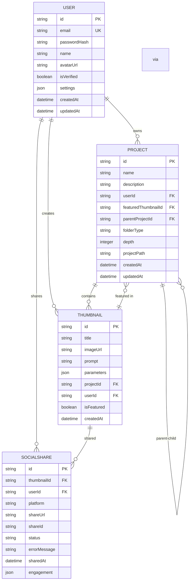
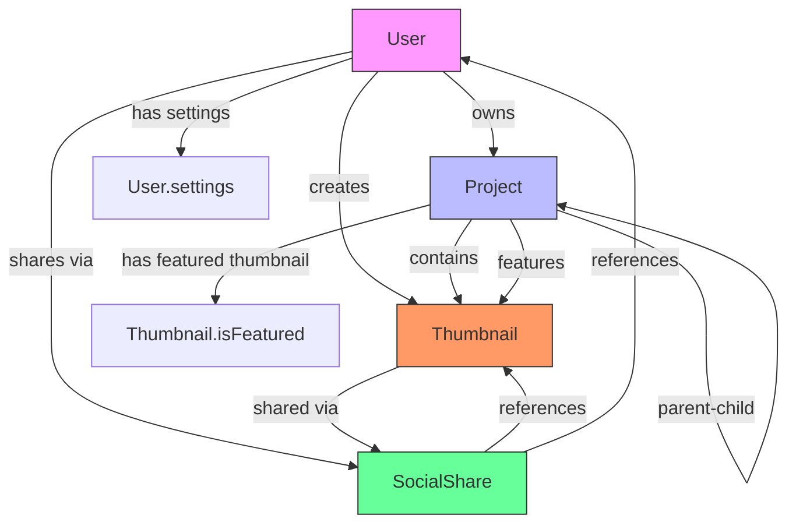
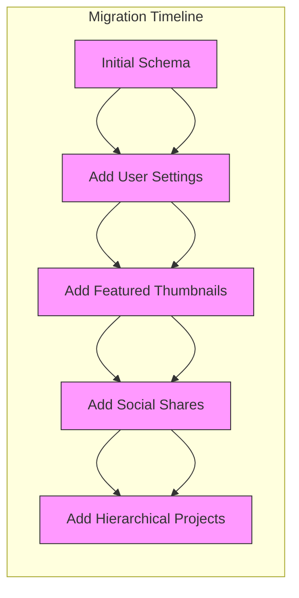

# Database Schema & ORM

<cite>
**Referenced Files in This Document**   
- [schema.prisma](file://pikzels-clone\prisma\schema.prisma)
- [20250829072650_init\migration.sql](file://pikzels-clone\prisma\migrations\20250829072650_init\migration.sql)
- [20250909081634_add_user_settings\migration.sql](file://pikzels-clone\prisma\migrations\20250909081634_add_user_settings\migration.sql)
- [20250911125101_add_featured_thumbnail_fields\migration.sql](file://pikzels-clone\prisma\migrations\20250911125101_add_featured_thumbnail_fields\migration.sql)
- [20250911134004_add_social_shares\migration.sql](file://pikzels-clone\prisma\migrations\20250911134004_add_social_shares\migration.sql)
- [20251003082936_add_hierarchical_project_structure\migration.sql](file://pikzels-clone\prisma\migrations\20251003082936_add_hierarchical_project_structure\migration.sql)
- [thumbnail.service.ts](file://pikzels-clone\src\modules\thumbnail\thumbnail.service.ts)
- [project.service.ts](file://pikzels-clone\src\modules\project\project.service.ts)
- [social-share.service.ts](file://pikzels-clone\src\modules\social-share\social-share.service.ts)
- [auth.service.ts](file://pikzels-clone\src\modules\auth\auth.service.ts)
</cite>

## Update Summary
**Changes Made**   
- Added comprehensive documentation for hierarchical project structure introduced in migration 20251003082936
- Updated Project model section with new hierarchical fields and constraints
- Enhanced Entity Relationship Diagram to include hierarchical relationships
- Added new section on hierarchical project operations and service methods
- Updated migration strategy section to include the hierarchical project structure migration
- Added new query examples for hierarchical operations
- Updated data integrity section with hierarchical constraints

## Table of Contents
1. [Introduction](#introduction)
2. [Data Model Overview](#data-model-overview)
3. [Entity Relationship Diagram](#entity-relationship-diagram)
4. [Model Definitions](#model-definitions)
   - [User Model](#user-model)
   - [Project Model](#project-model)
   - [Thumbnail Model](#thumbnail-model)
   - [SocialShare Model](#socialshare-model)
   - [Settings Model](#settings-model)
5. [Migration Strategy](#migration-strategy)
6. [Prisma Client Usage](#prisma-client-usage)
7. [Query Examples](#query-examples)
8. [Data Integrity and Constraints](#data-integrity-and-constraints)
9. [Indexing and Performance](#indexing-and-performance)
10. [Schema Evolution](#schema-evolution)

## Introduction

This document provides comprehensive documentation for the database schema and ORM implementation of Thumbnail Maker Studio. The system uses Prisma as the ORM layer with a SQLite database backend, managing core entities including users, projects, thumbnails, social shares, and user settings. The schema has evolved through a series of migrations to support new features while maintaining data integrity and performance.

The most recent enhancement introduces a hierarchical project structure, allowing users to organize their projects in a tree-like organization with parent-child relationships, depth tracking, and efficient path-based queries. This feature enables better organization of thumbnail projects, particularly for users with large collections.

**Section sources**
- [schema.prisma](file://pikzels-clone\prisma\schema.prisma)

## Data Model Overview

The database schema for Thumbnail Maker Studio consists of several interconnected models that represent the core entities of the application. The primary models include User, Project, Thumbnail, SocialShare, and various supporting models for collaboration and subscription management. The schema is designed to support a feature-rich thumbnail creation and sharing platform with user customization, project organization, and social media integration capabilities.

The data model follows relational database principles with proper normalization while incorporating JSON fields for flexible data storage where appropriate. Relationships between entities are explicitly defined with foreign key constraints to ensure data integrity.



**Diagram sources**
- [schema.prisma](file://pikzels-clone\prisma\schema.prisma)

**Section sources**
- [schema.prisma](file://pikzels-clone\prisma\schema.prisma)

## Entity Relationship Diagram



**Diagram sources**
- [schema.prisma](file://pikzels-clone\prisma\schema.prisma)

## Model Definitions

### User Model

The User model represents application users with authentication credentials, profile information, and preferences. It serves as the central identity for all user activities within the system.

Key fields:
- `id`: Unique identifier using UUID
- `email`: Unique email address for login
- `passwordHash`: BCrypt-hashed password
- `settings`: JSON field storing user preferences
- `isVerified`: Email verification status

The User model has relationships with multiple entities including Projects, Thumbnails, and SocialShares, establishing ownership and access control.

**Section sources**
- [schema.prisma](file://pikzels-clone\prisma\schema.prisma)
- [auth.service.ts](file://pikzels-clone\src\modules\auth\auth.service.ts)

### Project Model

The Project model organizes thumbnails into logical groups. Each project belongs to a user and can contain multiple thumbnails, with one designated as the featured thumbnail. The model has been enhanced with hierarchical structure capabilities.

Key fields:
- `id`: Unique identifier using UUID
- `name`: Project name
- `userId`: Foreign key to owner User
- `featuredThumbnailId`: Optional foreign key to featured Thumbnail
- `createdAt`: Creation timestamp
- `parentProjectId`: Optional foreign key to parent Project (enables hierarchical structure)
- `folderType`: Type of project container ('project' or 'folder')
- `depth`: Nesting depth level (0 = root, 1 = sub-project, etc.)
- `projectPath`: Full path for efficient hierarchical queries (e.g., "/root/sub1/sub2")

The Project model includes database indexes on `userId`, `teamId`, `parentProjectId`, and `depth` fields to optimize query performance for user-specific, team-based, and hierarchy-based project retrieval.

**Section sources**
- [schema.prisma](file://pikzels-clone\prisma\schema.prisma)
- [project.service.ts](file://pikzels-clone\src\modules\project\project.service.ts)

### Thumbnail Model

The Thumbnail model represents individual thumbnail images created by users. Each thumbnail belongs to a project and user, with metadata about its creation and usage.

Key fields:
- `id`: Unique identifier using UUID
- `title`: Thumbnail title
- `imageUrl`: URL to the image file
- `prompt`: Text prompt used for AI generation
- `parameters`: JSON field storing generation parameters
- `projectId`: Foreign key to parent Project
- `userId`: Foreign key to creator User
- `isFeatured`: Boolean indicating if this thumbnail is featured in its project

The parameters field uses JSON storage to accommodate flexible thumbnail generation options without requiring schema changes.

**Section sources**
- [schema.prisma](file://pikzels-clone\prisma\schema.prisma)
- [thumbnail.service.ts](file://pikzels-clone\src\modules\thumbnail\thumbnail.service.ts)

### SocialShare Model

The SocialShare model tracks sharing activities of thumbnails to various social media platforms. It records the status, results, and engagement metrics of each sharing attempt.

Key fields:
- `id`: Unique identifier using UUID
- `thumbnailId`: Foreign key to shared Thumbnail
- `userId`: Foreign key to sharing User
- `platform`: Target platform (twitter, facebook, etc.)
- `status`: Sharing status (pending, success, failed)
- `shareUrl`: URL of the shared post
- `shareId`: Platform-specific identifier
- `errorMessage`: Error details if sharing failed
- `engagement`: JSON field storing engagement metrics

This model enables analytics and retry functionality for failed sharing attempts.

**Section sources**
- [schema.prisma](file://pikzels-clone\prisma\schema.prisma)
- [social-share.service.ts](file://pikzels-clone\src\modules\social-share\social-share.service.ts)

### Settings Model

User settings are stored in the `settings` JSON field of the User model rather than as a separate table. This flexible approach allows for dynamic user preferences without schema modifications.

The JSON structure supports various settings including:
- UI theme preferences
- Notification preferences
- Default thumbnail parameters
- Privacy settings
- Language preferences

This denormalized approach improves read performance for user settings while maintaining flexibility for future setting additions.

**Section sources**
- [schema.prisma](file://pikzels-clone\prisma\schema.prisma)
- [auth.service.ts](file://pikzels-clone\src\modules\auth\auth.service.ts)

## Migration Strategy

The database schema has evolved through a series of versioned migrations managed by Prisma Migrate. Each migration is stored in a timestamped directory with corresponding SQL files.

Key migrations include:
- **20250829072650_init**: Initial schema with User, Project, Thumbnail, and Subscription models
- **20250909081634_add_user_settings**: Added settings JSON field to User model
- **20250911125101_add_featured_thumbnail_fields**: Added featured thumbnail relationships between Project and Thumbnail
- **20250911134004_add_social_shares**: Added SocialShare model for tracking social media sharing
- **20251003082936_add_hierarchical_project_structure**: Added hierarchical project structure with parent-child relationships and depth tracking

The migration strategy follows best practices:
- Each migration is atomic and focused on a specific feature
- SQL files are generated and version-controlled
- Foreign key constraints are properly defined
- Indexes are added to support query patterns
- Data integrity is maintained during schema changes



**Diagram sources**
- [20250829072650_init\migration.sql](file://pikzels-clone\prisma\migrations\20250829072650_init\migration.sql)
- [20250909081634_add_user_settings\migration.sql](file://pikzels-clone\prisma\migrations\20250909081634_add_user_settings\migration.sql)
- [20250911125101_add_featured_thumbnail_fields\migration.sql](file://pikzels-clone\prisma\migrations\20250911125101_add_featured_thumbnail_fields\migration.sql)
- [20250911134004_add_social_shares\migration.sql](file://pikzels-clone\prisma\migrations\20250911134004_add_social_shares\migration.sql)
- [20251003082936_add_hierarchical_project_structure\migration.sql](file://pikzels-clone\prisma\migrations\20251003082936_add_hierarchical_project_structure\migration.sql)

**Section sources**
- [20250829072650_init\migration.sql](file://pikzels-clone\prisma\migrations\20250829072650_init\migration.sql)
- [20250909081634_add_user_settings\migration.sql](file://pikzels-clone\prisma\migrations\20250909081634_add_user_settings\migration.sql)
- [20250911125101_add_featured_thumbnail_fields\migration.sql](file://pikzels-clone\prisma\migrations\20250911125101_add_featured_thumbnail_fields\migration.sql)
- [20250911134004_add_social_shares\migration.sql](file://pikzels-clone\prisma\migrations\20250911134004_add_social_shares\migration.sql)
- [20251003082936_add_hierarchical_project_structure\migration.sql](file://pikzels-clone\prisma\migrations\20251003082936_add_hierarchical_project_structure\migration.sql)

## Prisma Client Usage

The Prisma Client is used throughout the service layer to interact with the database. Each service module instantiates the client and implements data access methods.

Key usage patterns:
- **Service encapsulation**: Each business domain has a dedicated service class
- **Type safety**: Prisma generates TypeScript types from the schema
- **Transaction support**: Complex operations use Prisma transactions
- **Relation loading**: Include statements for related entities
- **Filtering and sorting**: Parameterized queries with proper validation

The service layer abstracts database operations while leveraging Prisma's type safety and query builder capabilities.

**Section sources**
- [thumbnail.service.ts](file://pikzels-clone\src\modules\thumbnail\thumbnail.service.ts)
- [project.service.ts](file://pikzels-clone\src\modules\project\project.service.ts)
- [social-share.service.ts](file://pikzels-clone\src\modules\social-share\social-share.service.ts)

## Query Examples

Common database operations are implemented in the service layer with proper error handling and validation.

### Creating a Thumbnail
```typescript
// In thumbnail.service.ts
async createThumbnail(data: { title: string; imageUrl: string; prompt: string; parameters: any; projectId: string; userId: string }) {
  return prisma.thumbnail.create({ data });
}
```

### Getting User's Projects with Featured Thumbnails
```typescript
// In project.service.ts
async getProjectsByUser(userId: string) {
  return prisma.project.findMany({
    where: { userId },
    orderBy: { createdAt: 'desc' },
    include: { featuredThumbnail: true }
  });
}
```

### Sharing a Thumbnail to Social Media
```typescript
// In social-share.service.ts
async createSocialShare(data: { thumbnailId: string; userId: string; platform: string; status: string }) {
  return prisma.socialShare.create({ data });
}
```

### Finding Thumbnails by Search Criteria
```typescript
// In thumbnail.service.ts with filtering
async getThumbnailsByUser(userId: string, filters?: { search?: string; projectId?: string; style?: string }) {
  const where: any = { userId };
  if (filters?.search) {
    where.OR = [
      { title: { contains: filters.search, mode: 'insensitive' } },
      { prompt: { contains: filters.search, mode: 'insensitive' } }
    ];
  }
  // Additional filters...
  return prisma.thumbnail.findMany({ where, include: { project: true } });
}
```

### Creating a Hierarchical Project
```typescript
// In project.service.ts with hierarchical structure
async createProject(data: {
  name: string;
  description?: string;
  userId: string;
  parentProjectId?: string;
  folderType?: 'project' | 'folder';
}) {
  // Validate hierarchy rules
  await this.validateHierarchy(data.parentProjectId, data.folderType || 'project');
  
  // Calculate depth and path
  const depth = await this.calculateDepth(data.parentProjectId);
  const projectPath = await this.generateProjectPath(data.parentProjectId);
  
  return prisma.project.create({
    data: {
      name: data.name,
      description: data.description || null,
      userId: data.userId,
      parentProjectId: data.parentProjectId || null,
      folderType: data.folderType || 'project',
      depth,
      projectPath,
    },
  });
}
```

### Getting Projects in Tree Structure
```typescript
// In project.service.ts for hierarchical display
async getProjectsTree(userId: string) {
  const allProjects = await prisma.project.findMany({
    where: { userId },
    orderBy: [
      { depth: 'asc' },
      { name: 'asc' }
    ],
    include: {
      featuredThumbnail: true,
      _count: {
        select: {
          subProjects: true,
          thumbnails: true
        }
      }
    },
  });
  
  // Build tree structure from flat list
  const projectMap = new Map();
  const rootProjects: any[] = [];
  
  // Create map of all projects
  allProjects.forEach(project => {
    projectMap.set(project.id, {
      ...project,
      children: []
    });
  });
  
  // Build tree relationships
  allProjects.forEach(project => {
    if (project.parentProjectId) {
      const parent = projectMap.get(project.parentProjectId);
      if (parent) {
        parent.children.push(projectMap.get(project.id));
      }
    } else {
      rootProjects.push(projectMap.get(project.id));
    }
  });
  
  return rootProjects;
}
```

**Section sources**
- [thumbnail.service.ts](file://pikzels-clone\src\modules\thumbnail\thumbnail.service.ts)
- [project.service.ts](file://pikzels-clone\src\modules\project\project.service.ts)
- [social-share.service.ts](file://pikzels-clone\src\modules\social-share\social-share.service.ts)

## Data Integrity and Constraints

The schema enforces data integrity through various constraints and relationships.

### Foreign Key Constraints
- User-Project: Cascading updates, restricted deletion
- Project-Thumbnail: Cascading updates, restricted deletion
- Thumbnail-SocialShare: Cascading updates, restricted deletion
- Project-Featured Thumbnail: Cascading updates, set null on deletion
- Project-Parent Project: Cascading updates, set null on deletion (for hierarchical structure)

### Unique Constraints
- User.email: Unique constraint to prevent duplicate accounts
- Project.featuredThumbnailId: Unique constraint to ensure only one featured thumbnail per project

### Required Fields
- All models have required fields marked with appropriate validation
- UUIDs are used for primary keys to ensure global uniqueness
- Timestamps are automatically managed (createdAt, updatedAt)

### Referential Actions
The schema uses appropriate referential actions:
- `ON DELETE RESTRICT`: Prevents deletion of referenced records
- `ON DELETE SET NULL`: Allows nullification of optional relationships
- `ON UPDATE CASCADE`: Ensures consistency when referenced IDs change

### Hierarchical Constraints
The hierarchical project structure includes additional integrity rules:
- Maximum depth of 2 (3-level structure: Root → Sub-Project → Thumbnails)
- Folders cannot contain sub-projects (only projects can contain sub-projects)
- Circular references are prevented through validation
- Parent-child relationships are validated before creation or modification

**Section sources**
- [schema.prisma](file://pikzels-clone\prisma\schema.prisma)
- [20250829072650_init\migration.sql](file://pikzels-clone\prisma\migrations\20250829072650_init\migration.sql)
- [project.service.ts](file://pikzels-clone\src\modules\project\project.service.ts)

## Indexing and Performance

The schema includes strategic indexes to optimize query performance for common access patterns.

### Defined Indexes
- `@@index([userId])` on Project: Optimizes user-specific project queries
- `@@index([teamId])` on Project: Optimizes team-based project queries
- `@@index([parentProjectId])` on Project: Optimizes hierarchical queries for child projects
- `@@index([depth])` on Project: Optimizes depth-based filtering
- `@@index([isPublic])` on Template: Optimizes public template discovery
- `@@index([status])` on TeamInvitation: Optimizes invitation status queries

### Query Optimization
- Service methods use appropriate `include` statements to load related data
- Filtering is applied at the database level to minimize data transfer
- Sorting is handled by the database with proper indexes
- Pagination can be easily added using Prisma's `take` and `skip` parameters
- Hierarchical queries use the `projectPath` field for efficient path-based searches

The indexing strategy focuses on the most common query patterns: user-specific data retrieval, relationship-based filtering, status-based filtering, and hierarchical navigation.

**Section sources**
- [schema.prisma](file://pikzels-clone\prisma\schema.prisma)

## Schema Evolution

The database schema has evolved through a series of migrations to support new features while maintaining backward compatibility.

### Initial Schema (2025-08-29)
The initial migration established the core entities:
- User authentication and profile
- Project organization
- Thumbnail creation and storage
- Subscription management

### User Settings Addition (2025-09-09)
The second migration added user preferences:
- Added `settings` JSON field to User model
- Enabled flexible storage of user preferences
- Maintained backward compatibility with existing records

### Featured Thumbnails (2025-09-11)
The third migration enhanced project-thumbnail relationships:
- Added `featuredThumbnailId` to Project
- Added `isFeatured` flag to Thumbnail
- Established bidirectional relationship between Project and Thumbnail
- Used `PRAGMA defer_foreign_keys` for safe schema redefinition

### Social Sharing (2025-09-11)
The fourth migration added social media integration:
- Created SocialShare model to track sharing activities
- Established relationships with Thumbnail and User
- Added fields for platform-specific data and engagement metrics
- Implemented proper foreign key constraints

### Hierarchical Project Structure (2025-10-03)
The fifth migration introduced hierarchical organization:
- Added `parentProjectId` to Project for parent-child relationships
- Added `folderType` field to distinguish between projects and folders
- Added `depth` field to track nesting level
- Added `projectPath` field for efficient hierarchical queries
- Implemented validation rules to prevent circular references and excessive nesting
- Added indexes on `parentProjectId` and `depth` for optimized hierarchical queries
- Created service methods for tree-based operations and breadcrumb navigation

This evolutionary approach demonstrates a well-managed schema development process with versioned migrations, backward compatibility, and minimal downtime.

**Section sources**
- [schema.prisma](file://pikzels-clone\prisma\schema.prisma)
- [20250829072650_init\migration.sql](file://pikzels-clone\prisma\migrations\20250829072650_init\migration.sql)
- [20250909081634_add_user_settings\migration.sql](file://pikzels-clone\prisma\migrations\20250909081634_add_user_settings\migration.sql)
- [20250911125101_add_featured_thumbnail_fields\migration.sql](file://pikzels-clone\prisma\migrations\20250911125101_add_featured_thumbnail_fields\migration.sql)
- [20250911134004_add_social_shares\migration.sql](file://pikzels-clone\prisma\migrations\20250911134004_add_social_shares\migration.sql)
- [20251003082936_add_hierarchical_project_structure\migration.sql](file://pikzels-clone\prisma\migrations\20251003082936_add_hierarchical_project_structure\migration.sql)