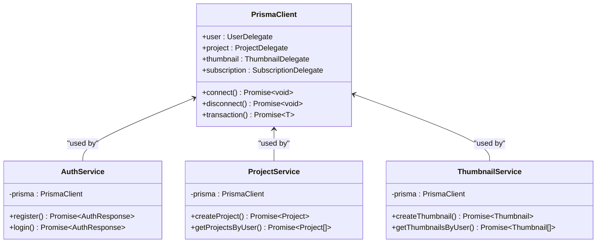
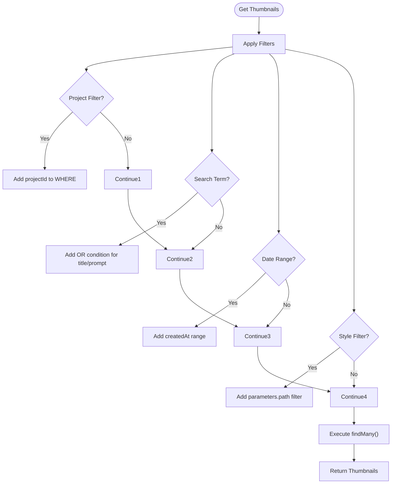
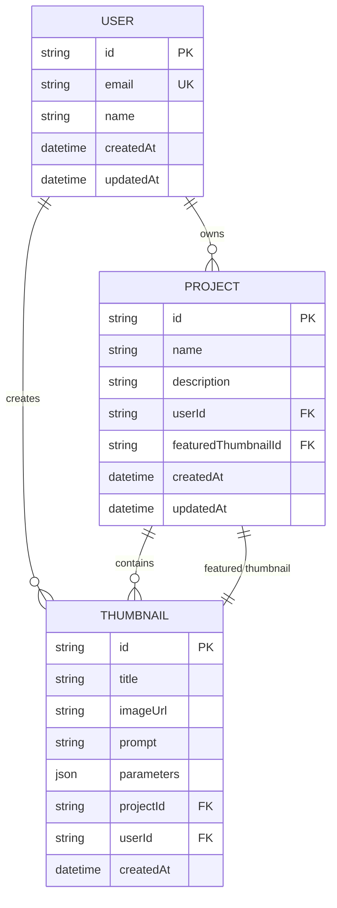

# Prisma Client Usage

<cite>
**Referenced Files in This Document**   
- [auth.service.ts](file://pikzels-clone\src\modules\auth\auth.service.ts)
- [project.service.ts](file://pikzels-clone\src\modules\project\project.service.ts)
- [thumbnail.service.ts](file://pikzels-clone\src\modules\thumbnail\thumbnail.service.ts)
- [schema.prisma](file://pikzels-clone\prisma\schema.prisma)
- [server.ts](file://pikzels-clone\src\server.ts)
</cite>

## Table of Contents
1. [Introduction](#introduction)
2. [Prisma Client Instantiation and Access](#prisma-client-instantiation-and-access)
3. [Core CRUD Operations](#core-crud-operations)
4. [Advanced Querying Techniques](#advanced-querying-techniques)
5. [Transaction Management](#transaction-management)
6. [Error Handling Strategies](#error-handling-strategies)
7. [Performance Considerations](#performance-considerations)
8. [Conclusion](#conclusion)

## Introduction
This document provides comprehensive documentation on Prisma Client usage patterns within the Thumbnail Maker application. It details how the Prisma ORM is leveraged across service layers for database operations, focusing on authentication, project management, and thumbnail creation workflows. The documentation covers instantiation patterns, CRUD operations, advanced querying, transaction management, error handling, and performance optimization strategies implemented throughout the codebase.

## Prisma Client Instantiation and Access
The Prisma Client is instantiated directly within each service module using a straightforward singleton pattern. Each service file creates its own instance of PrismaClient at the module level, making it globally accessible within that service.

**Diagram sources**
- [auth.service.ts](file://pikzels-clone\src\modules\auth\auth.service.ts#L6)
- [project.service.ts](file://pikzels-clone\src\modules\project\project.service.ts#L4)
- [thumbnail.service.ts](file://pikzels-clone\src\modules\thumbnail\thumbnail.service.ts#L4)

**Section sources**
- [auth.service.ts](file://pikzels-clone\src\modules\auth\auth.service.ts#L6)
- [project.service.ts](file://pikzels-clone\src\modules\project\project.service.ts#L4)
- [thumbnail.service.ts](file://pikzels-clone\src\modules\thumbnail\thumbnail.service.ts#L4)

## Core CRUD Operations
The application implements standard CRUD operations across its core services, with each service handling operations for its respective domain model.

### Authentication Service Operations
The AuthService handles user management operations including registration, login, and password reset functionality. During user registration, it checks for email uniqueness, hashes passwords using bcryptjs, creates user records, and generates JWT tokens.

**Section sources**
- [auth.service.ts](file://pikzels-clone\src\modules\auth\auth.service.ts#L8-L135)

### Project Service Operations
The ProjectService manages project lifecycle operations with methods for creating, retrieving, updating, and deleting projects. It enforces user ownership validation and supports project-thumbnail associations through the featuredThumbnail relationship.

**Section sources**
- [project.service.ts](file://pikzels-clone\src\modules\project\project.service.ts#L4-L80)

### Thumbnail Service Operations
The ThumbnailService handles thumbnail management operations, providing CRUD functionality for thumbnail entities. It maintains relationships between thumbnails and their parent projects, supporting both individual thumbnail operations and batch retrieval.

**Section sources**
- [thumbnail.service.ts](file://pikzels-clone\src\modules\thumbnail\thumbnail.service.ts#L4-L135)

## Advanced Querying Techniques
The application employs various advanced Prisma querying techniques to support complex data retrieval requirements.

### Filtering and Search Capabilities
The thumbnail service implements comprehensive filtering capabilities that support search by text, date ranges, project association, and style parameters. The implementation builds dynamic WHERE clauses based on provided filter criteria.

**Diagram sources**
- [thumbnail.service.ts](file://pikzels-clone\src\modules\thumbnail\thumbnail.service.ts#L15-L75)

### Sorting and Pagination
The service layer implements sorting capabilities with protection against injection attacks by validating sort fields against an allowed list. Default sorting is applied by createdAt in descending order, with options to sort by title or prompt.

**Section sources**
- [thumbnail.service.ts](file://pikzels-clone\src\modules\thumbnail\thumbnail.service.ts#L77-L85)

### Relational Queries with Include and Select
The application extensively uses Prisma's include and select operators to manage relational data loading. The project service retrieves projects with their featured thumbnails, while the thumbnail service includes associated project data in thumbnail queries.

**Diagram sources**
- [schema.prisma](file://pikzels-clone\prisma\schema.prisma#L20-L164)

## Transaction Management
While explicit transaction usage is not currently implemented in the analyzed service files, the Prisma Client provides transaction capabilities that could be leveraged for atomic operations in collaboration features. The $transaction method allows grouping multiple operations that must succeed or fail together.

**Section sources**
- [schema.prisma](file://pikzels-clone\prisma\schema.prisma#L20-L164)

## Error Handling Strategies
The application implements structured error handling for database operations, with specific strategies for different error types.

### Unique Constraint Violations
The authentication service handles email uniqueness constraints by checking for existing users before creation and throwing descriptive errors when duplicates are detected.

### Connection Failures
Although not explicitly shown in the service implementations, Prisma Client provides built-in connection management with retry mechanisms. The application should implement proper error boundaries to handle connection failures gracefully.

### Validation and Business Logic Errors
Services implement validation logic before database operations, such as verifying thumbnail ownership before setting a featured thumbnail. This prevents invalid state changes and provides meaningful error messages.

**Section sources**
- [auth.service.ts](file://pikzels-clone\src\modules\auth\auth.service.ts#L10-L15)
- [project.service.ts](file://pikzels-clone\src\modules\project\project.service.ts#L50-L60)
- [thumbnail.service.ts](file://pikzels-clone\src\modules\thumbnail\thumbnail.service.ts#L95-L105)

## Performance Considerations
The application incorporates several performance optimization strategies in its Prisma usage.

### Query Optimization
Queries are optimized by using appropriate filtering, sorting, and limiting results where applicable. The thumbnail service limits recent thumbnails to 5 items in project queries to prevent excessive data loading.

### Eager Loading vs Lazy Loading
The application primarily uses eager loading through the include operator to fetch related data in a single query, reducing N+1 query problems. This is evident in the project service loading featured thumbnails along with projects.

### Connection Management
While connection pooling configuration is not visible in the service files, Prisma Client manages database connections efficiently by default. The application should ensure proper connection cleanup in production environments.

**Section sources**
- [project.service.ts](file://pikzels-clone\src\modules\project\project.service.ts#L20-L25)
- [thumbnail.service.ts](file://pikzels-clone\src\modules\thumbnail\thumbnail.service.ts#L50-L55)

## Conclusion
The Thumbnail Maker application effectively leverages Prisma Client for database operations across its service layers. The implementation follows clean patterns for CRUD operations, advanced querying, and error handling. By using direct PrismaClient instantiation in services, the application maintains simplicity while providing robust data access capabilities. Future enhancements could include implementing explicit transactions for complex operations and further optimizing connection management for production scalability.