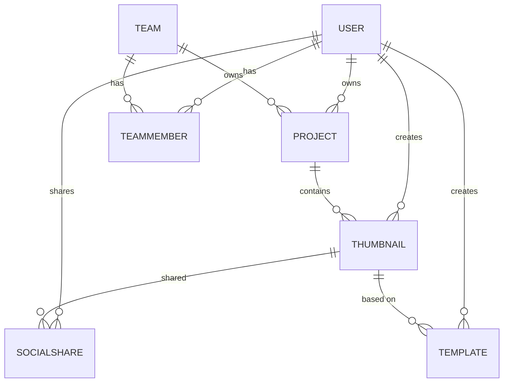
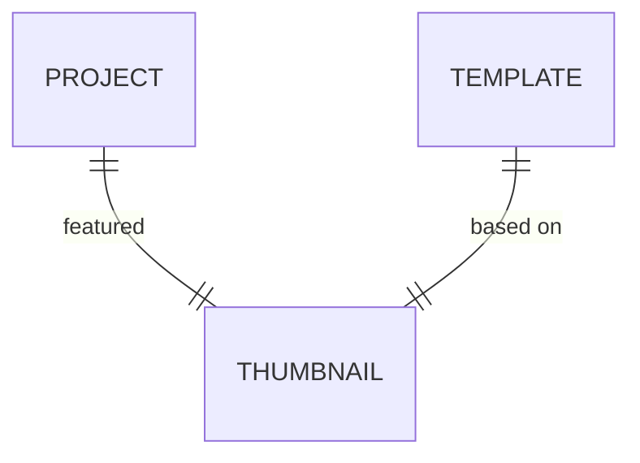

# Prisma Schema Definition

<cite>
**Referenced Files in This Document**  
- [schema.prisma](file://pikzels-clone/prisma/schema.prisma)
- [project.service.ts](file://pikzels-clone/src/modules/project/project.service.ts)
- [thumbnail.service.ts](file://pikzels-clone/src/modules/thumbnail/thumbnail.service.ts)
- [collaboration.service.ts](file://pikzels-clone/src/modules/collaboration/collaboration.service.ts)
- [social-share.service.ts](file://pikzels-clone/src/modules/social-share/social-share.service.ts)
</cite>

## Table of Contents
1. [Introduction](#introduction)
2. [Core Data Models](#core-data-models)
3. [Model Relationships](#model-relationships)
4. [Field Types and Constraints](#field-types-and-constraints)
5. [Indexing and Data Integrity](#indexing-and-data-integrity)
6. [Common Query Patterns](#common-query-patterns)
7. [Conclusion](#conclusion)

## Introduction

This document provides comprehensive documentation for the Prisma schema of Thumbnail Maker Studio, a platform for creating and managing thumbnails. The schema defines the data models that power the application's core functionality, including user management, project organization, thumbnail generation, social sharing, template marketplace, and team collaboration.

The data model is designed with scalability and performance in mind, utilizing UUIDs for primary keys, JSON fields for flexible data storage, and proper indexing strategies for optimized queries. The schema supports both individual and team-based workflows, allowing users to collaborate on projects and share resources.

This documentation details each model including User, Project, Thumbnail, SocialShare, Template, Team, TeamMember, and TeamInvitation, explaining their field types, constraints, default values, and relationships. It also covers common query patterns used in services for retrieving user projects, thumbnail associations, and team memberships.

**Section sources**
- [schema.prisma](file://pikzels-clone/prisma/schema.prisma)

## Core Data Models

### User Model

The User model represents registered users of the Thumbnail Maker Studio application. Each user has a unique identifier and can create projects, generate thumbnails, and participate in teams.

```prisma
model User {
  id            String     @id @default(uuid())
  email         String     @unique
  passwordHash  String
  name          String?
  avatarUrl     String?
  isVerified    Boolean    @default(false)
  settings      Json?
  createdAt     DateTime   @default(now())
  updatedAt     DateTime   @updatedAt
  projects      Project[]
  thumbnails    Thumbnail[]
  subscriptions Subscription[]
  socialShares  SocialShare[]
  templates     Template[]
  ownedTeams    Team[]     @relation("OwnedTeams")
  teamMemberships TeamMember[]
  teamInvitations TeamInvitation[] @relation("ReceivedInvitations")
  sentInvitations TeamInvitation[] @relation("SentInvitations")
}
```

**Section sources**
- [schema.prisma](file://pikzels-clone/prisma/schema.prisma#L10-L35)

### Project Model

The Project model organizes thumbnails into logical groups. Projects can be owned by individual users or teams, supporting both personal and collaborative workflows.

```prisma
model Project {
  id            String      @id @default(uuid())
  name          String
  description   String?
  userId        String
  user          User        @relation(fields: [userId], references: [id])
  teamId        String?     // Team owner (optional)
  team          Team?       @relation(fields: [teamId], references: [id])
  createdAt     DateTime    @default(now())
  updatedAt     DateTime    @updatedAt
  thumbnails    Thumbnail[] @relation("ProjectThumbnails")
  featuredThumbnailId String? @unique
  featuredThumbnail   Thumbnail? @relation("FeaturedThumbnail", fields: [featuredThumbnailId], references: [id])
}
```

**Section sources**
- [schema.prisma](file://pikzels-clone/prisma/schema.prisma#L37-L54)

### Thumbnail Model

The Thumbnail model represents generated thumbnail images. Each thumbnail is associated with a project and user, and contains metadata about its creation.

```prisma
model Thumbnail {
  id            String      @id @default(uuid())
  title         String
  imageUrl      String
  prompt        String
  parameters    Json
  projectId     String
  project       Project     @relation("ProjectThumbnails", fields: [projectId], references: [id])
  userId        String
  user          User        @relation(fields: [userId], references: [id])
  createdAt     DateTime    @default(now())
  isFeatured    Boolean     @default(false)
  featuredIn    Project?    @relation("FeaturedThumbnail")
  socialShares  SocialShare[]
  templates     Template[]
}
```

**Section sources**
- [schema.prisma](file://pikzels-clone/prisma/schema.prisma#L56-L73)

### SocialShare Model

The SocialShare model tracks when thumbnails are shared to various social media platforms, capturing platform-specific details and engagement metrics.

```prisma
model SocialShare {
  id            String      @id @default(uuid())
  thumbnailId   String
  thumbnail     Thumbnail   @relation(fields: [thumbnailId], references: [id])
  userId        String
  user          User        @relation(fields: [userId], references: [id])
  platform      String
  shareUrl      String?
  shareId       String?
  status        String
  errorMessage  String?
  sharedAt      DateTime    @default(now())
  engagement    Json?
}
```

**Section sources**
- [schema.prisma](file://pikzels-clone/prisma/schema.prisma#L75-L91)

### Template Model

The Template model represents reusable thumbnail designs available in the marketplace. Templates can be created by users and used as starting points for new thumbnails.

```prisma
model Template {
  id          String   @id @default(uuid())
  name        String
  description String?
  thumbnail   Thumbnail @relation(fields: [thumbnailId], references: [id])
  thumbnailId String
  creator     User     @relation(fields: [creatorId], references: [id])
  creatorId   String
  parameters  Json
  tags        Json
  isPublic    Boolean  @default(false)
  downloads   Int      @default(0)
  likes       Int      @default(0)
  createdAt   DateTime @default(now())
  updatedAt   DateTime @updatedAt()
}
```

**Section sources**
- [schema.prisma](file://pikzels-clone/prisma/schema.prisma#L93-L114)

### Team Model

The Team model enables collaboration by grouping users together. Teams can own projects and resources, facilitating shared workflows.

```prisma
model Team {
  id          String      @id @default(uuid())
  name        String
  description String?
  ownerId     String
  owner       User        @relation("OwnedTeams", fields: [ownerId], references: [id])
  members     TeamMember[]
  invitations TeamInvitation[]
  projects    Project[]
  createdAt   DateTime    @default(now())
  updatedAt   DateTime    @updatedAt()
}
```

**Section sources**
- [schema.prisma](file://pikzels-clone/prisma/schema.prisma#L116-L127)

### TeamMember Model

The TeamMember model establishes the many-to-many relationship between users and teams, with role-based permissions.

```prisma
model TeamMember {
  id        String   @id @default(uuid())
  teamId    String
  team      Team     @relation(fields: [teamId], references: [id])
  userId    String
  user      User     @relation(fields: [userId], references: [id])
  role      String
  joinedAt  DateTime @default(now())
}
```

**Section sources**
- [schema.prisma](file://pikzels-clone/prisma/schema.prisma#L129-L140)

### TeamInvitation Model

The TeamInvitation model manages the process of inviting users to join teams, tracking invitation status and responses.

```prisma
model TeamInvitation {
  id           String   @id @default(uuid())
  teamId       String
  team         Team     @relation(fields: [teamId], references: [id])
  inviterId    String
  inviter      User     @relation("SentInvitations", fields: [inviterId], references: [id])
  inviteeId    String
  invitee      User     @relation("ReceivedInvitations", fields: [inviteeId], references: [id])
  status       String
  invitedAt    DateTime @default(now())
  respondedAt  DateTime?
}
```

**Section sources**
- [schema.prisma](file://pikzels-clone/prisma/schema.prisma#L142-L163)

## Model Relationships

### One-to-Many Relationships

The schema implements several one-to-many relationships that form the foundation of the application's data structure:

- **User → Project**: A user can create multiple projects, but each project belongs to one user (or team)
- **User → Thumbnail**: A user can generate multiple thumbnails, but each thumbnail is created by one user
- **Project → Thumbnail**: A project can contain multiple thumbnails, but each thumbnail belongs to one project
- **Team → Project**: A team can own multiple projects, but each project belongs to one team (or user)
- **User → TeamMember**: A user can be a member of multiple teams, but each team membership record belongs to one user
- **Team → TeamMember**: A team can have multiple members, but each team membership record belongs to one team



**Diagram sources**
- [schema.prisma](file://pikzels-clone/prisma/schema.prisma)

**Section sources**
- [schema.prisma](file://pikzels-clone/prisma/schema.prisma)

### One-to-One Relationships

The schema includes one-to-one relationships for specialized associations:

- **Project → Thumbnail (Featured)**: Each project can have one featured thumbnail, and each thumbnail can be featured in one project
- **Template → Thumbnail**: Each template is based on one specific thumbnail



**Diagram sources**
- [schema.prisma](file://pikzels-clone/prisma/schema.prisma)

**Section sources**
- [schema.prisma](file://pikzels-clone/prisma/schema.prisma)

### Many-to-Many Relationships

The schema implements many-to-many relationships through explicit junction models:

- **User ↔ Team**: Users and teams have a many-to-many relationship managed through the TeamMember junction model
- **User ↔ Team (Invitations)**: The invitation system creates a many-to-many relationship between users and teams through the TeamInvitation junction model

```mermaid
erDiagram
USER ||--o{ TEAMMEMBER }o--|| TEAM
USER ||--o{ TEAMINVITATION }o--|| TEAM
```

**Diagram sources**
- [schema.prisma](file://pikzels-clone/prisma/schema.prisma)

**Section sources**
- [schema.prisma](file://pikzels-clone/prisma/schema.prisma)

## Field Types and Constraints

### UUID Primary Keys

All models use UUIDs for primary keys, providing globally unique identifiers that are secure and prevent enumeration attacks:

```prisma
id String @id @default(uuid())
```

This approach ensures that record IDs cannot be easily guessed and provides better distribution for database indexing compared to auto-incrementing integers.

**Section sources**
- [schema.prisma](file://pikzels-clone/prisma/schema.prisma)

### JSON Fields for Flexible Data Storage

The schema leverages JSON fields to store flexible, schema-less data:

- **settings (User)**: Stores user preferences in a structured JSON format
- **parameters (Thumbnail, Template)**: Stores generation parameters that may vary between thumbnails
- **tags (Template)**: Stores an array of tags for categorization and search
- **engagement (SocialShare)**: Stores platform-specific engagement metrics

```prisma
settings      Json?
parameters    Json
tags          Json
engagement    Json?
```

These JSON fields allow the application to evolve without requiring frequent database schema changes, as new properties can be added to the JSON objects without altering the database structure.

**Section sources**
- [schema.prisma](file://pikzels-clone/prisma/schema.prisma)

### DateTime Fields with Automatic Defaults

DateTime fields are used extensively throughout the schema with automatic defaults for audit and display purposes:

```prisma
createdAt     DateTime   @default(now())
updatedAt     DateTime   @updatedAt
sharedAt      DateTime   @default(now())
joinedAt      DateTime @default(now())
invitedAt     DateTime @default(now())
```

The `@default(now())` directive automatically sets the field to the current timestamp when a record is created, while `@updatedAt` automatically updates the field whenever the record is modified. This provides a complete audit trail for all records.

**Section sources**
- [schema.prisma](file://pikzels-clone/prisma/schema.prisma)

## Indexing and Data Integrity

### Indexing Strategies

The schema implements strategic indexing on frequently queried fields to optimize performance:

```prisma
@@index([userId])
@@index([teamId])
@@index([creatorId])
@@index([thumbnailId])
@@index([isPublic])
@@index([status])
```

These indexes are placed on foreign key fields and commonly filtered attributes to ensure fast lookups when retrieving records by user, team, status, or publication status. The indexing strategy focuses on the most common query patterns in the application.

**Section sources**
- [schema.prisma](file://pikzels-clone/prisma/schema.prisma#L46-L47)
- [schema.prisma](file://pikzels-clone/prisma/schema.prisma#L111-L113)
- [schema.prisma](file://pikzels-clone/prisma/schema.prisma#L129)
- [schema.prisma](file://pikzels-clone/prisma/schema.prisma#L143-L144)
- [schema.prisma](file://pikzels-clone/prisma/schema.prisma#L160-L162)

### Data Integrity Constraints

The schema enforces data integrity through unique constraints and referential integrity:

```prisma
email         String     @unique
featuredThumbnailId String? @unique
@@unique([teamId, userId])
```

The `@unique` directive ensures that email addresses are unique across users, preventing duplicate accounts. The composite unique constraint on TeamMember (`teamId, userId`) prevents a user from being added to the same team multiple times. The unique constraint on `featuredThumbnailId` ensures that a thumbnail can only be the featured thumbnail for one project.

**Section sources**
- [schema.prisma](file://pikzels-clone/prisma/schema.prisma#L13)
- [schema.prisma](file://pikzels-clone/prisma/schema.prisma#L52)
- [schema.prisma](file://pikzels-clone/prisma/schema.prisma#L142)

## Common Query Patterns

### Retrieving User Projects

The ProjectService provides methods to retrieve projects for a specific user, with options to include related data:

```typescript
async getProjectsByUser(userId: string) {
  return prisma.project.findMany({
    where: { userId },
    orderBy: {
      createdAt: 'desc',
    },
    include: {
      featuredThumbnail: true,
    },
  });
}
```

This query retrieves all projects owned by a user, ordered by creation date (newest first), and includes the featured thumbnail for each project to display in project listings.

**Section sources**
- [project.service.ts](file://pikzels-clone/src/modules/project/project.service.ts#L14-L25)

### Thumbnail Associations

The ThumbnailService includes methods to retrieve thumbnails with their associated projects and apply various filters:

```typescript
async getThumbnailsByUser(
  userId: string,
  filters?: {
    search?: string;
    projectId?: string;
    sortBy?: string;
    sortOrder?: 'asc' | 'desc';
    style?: string;
    dateFrom?: Date;
    dateTo?: Date;
  }
) {
  const where: any = { userId };
  
  if (filters?.projectId) {
    where.projectId = filters.projectId;
  }
  
  if (filters?.search) {
    where.OR = [
      { title: { contains: filters.search, mode: 'insensitive' } },
      { prompt: { contains: filters.search, mode: 'insensitive' } },
    ];
  }
  
  return prisma.thumbnail.findMany({
    where,
    include: {
      project: true,
    },
    orderBy,
  });
}
```

This comprehensive query pattern supports filtering by project, search terms, date ranges, and styles, while also allowing sorting by various fields.

**Section sources**
- [thumbnail.service.ts](file://pikzels-clone/src/modules/thumbnail/thumbnail.service.ts#L14-L80)

### Team Memberships and Collaborations

The CollaborationService handles complex queries for team memberships and relationships:

```typescript
async getUserTeams(userId: string) {
  return prisma.team.findMany({
    where: {
      members: {
        some: {
          userId: userId,
        },
      },
    },
    include: {
      owner: {
        select: {
          id: true,
          name: true,
          email: true,
          avatarUrl: true,
        },
      },
      members: {
        include: {
          user: {
            select: {
              id: true,
              name: true,
              email: true,
              avatarUrl: true,
            },
          },
        },
      },
      _count: {
        select: { members: true },
      },
    },
  });
}
```

This query demonstrates the use of nested filtering (`members.some`) to find teams where the user is a member, while also including related data about team owners and members, and counting the total number of members in each team.

**Section sources**
- [collaboration.service.ts](file://pikzels-clone/src/modules/collaboration/collaboration.service.ts#L25-L55)

### Social Sharing Queries

The SocialShareService provides methods to track and analyze social sharing activities:

```typescript
async getSocialSharesByUser(
  userId: string,
  filters?: {
    platform?: string;
    status?: string;
    thumbnailId?: string;
  }
) {
  const where: any = { userId };

  if (filters?.platform) {
    where.platform = filters.platform;
  }

  if (filters?.status) {
    where.status = filters.status;
  }

  return prisma.socialShare.findMany({
    where,
    include: {
      thumbnail: true,
    },
    orderBy: {
      sharedAt: 'desc',
    },
  });
}
```

This query pattern allows filtering social shares by platform, status, or specific thumbnail, while including the associated thumbnail data for display.

**Section sources**
- [social-share.service.ts](file://pikzels-clone/src/modules/social-share/social-share.service.ts#L14-L40)

## Conclusion

The Prisma schema for Thumbnail Maker Studio is a well-structured data model that supports the application's core functionality while maintaining flexibility for future enhancements. By using UUIDs for primary keys, the schema ensures security and scalability. JSON fields provide flexibility for storing variable data like settings, parameters, and engagement metrics without requiring frequent schema migrations.

The relationship model effectively supports both individual and collaborative workflows through a combination of one-to-many, one-to-one, and many-to-many relationships. The use of explicit junction models (TeamMember, TeamInvitation) provides fine-grained control over team membership and invitation processes.

Strategic indexing on frequently queried fields (userId, teamId, status) ensures optimal performance for common operations, while unique constraints maintain data integrity. The automatic handling of createdAt and updatedAt fields provides a complete audit trail for all records.

The service implementations demonstrate effective query patterns that leverage Prisma's capabilities for filtering, sorting, and including related data, enabling rich user experiences while maintaining efficient database operations.