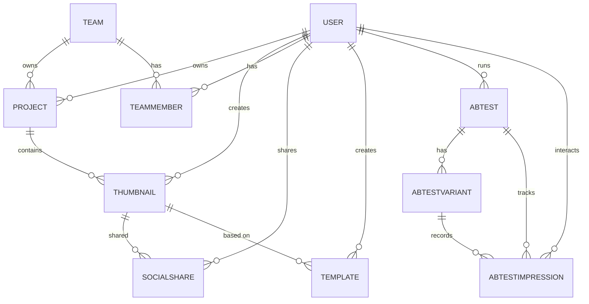
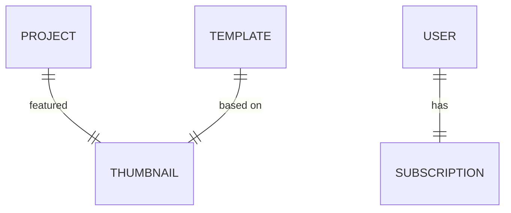
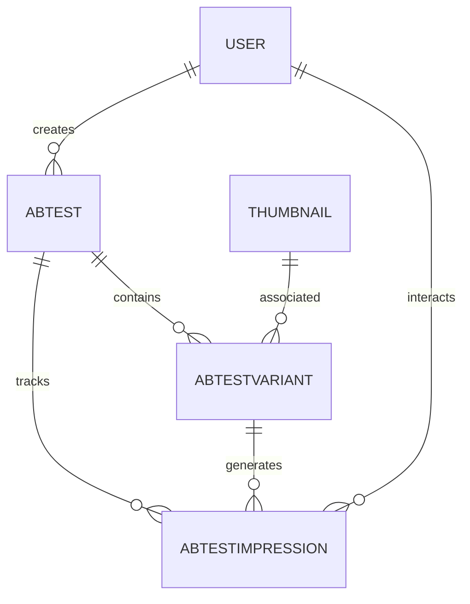
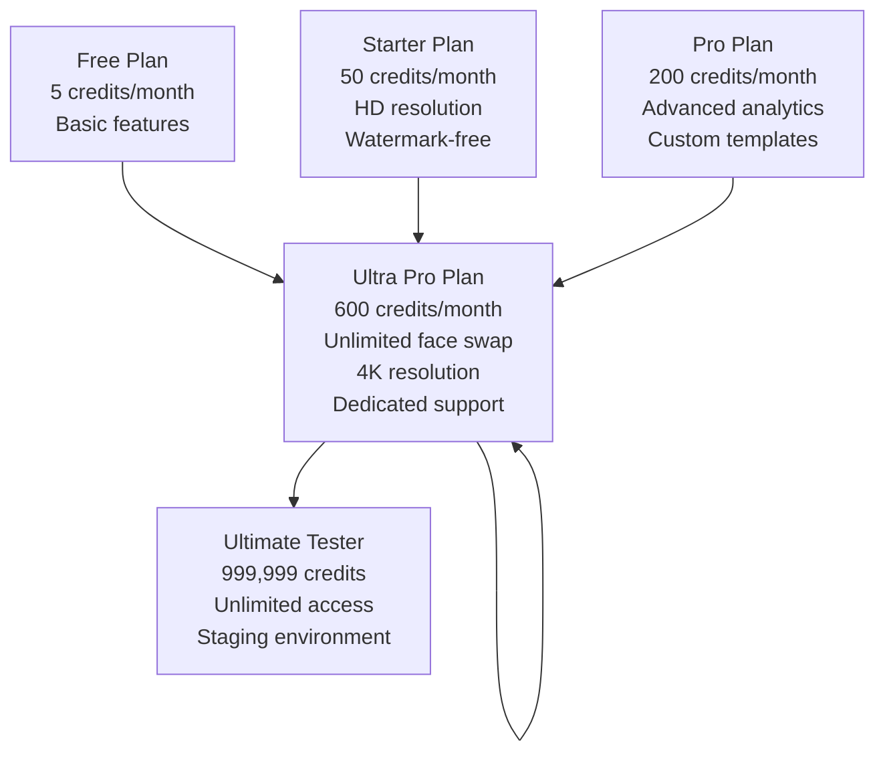

# Prisma Schema Definition

<cite>
**Referenced Files in This Document**
- [schema.prisma](file://pikzels-clone/prisma/schema.prisma)
- [seed.ts](file://pikzels-clone/prisma/seed.ts)
- [subscription.config.ts](file://pikzels-clone/src/modules/subscription/subscription.config.ts)
- [subscription.service.ts](file://pikzels-clone/src/modules/subscription/subscription.service.ts)
- [project.service.ts](file://pikzels-clone/src/modules/project/project.service.ts)
- [thumbnail.service.ts](file://pikzels-clone/src/modules/thumbnail/thumbnail.service.ts)
- [collaboration.service.ts](file://pikzels-clone/src/modules/collaboration/collaboration.service.ts)
- [social-share.service.ts](file://pikzels-clone/src/modules/social-share/social-share.service.ts)
- [ab-testing.service.ts](file://pikzels-clone/src/modules/ab-testing/ab-testing.service.ts)
- [types.ts](file://pikzels-clone/src/modules/ab-testing/types.ts)
- [notification.service.ts](file://pikzels-clone/src/modules/notification/notification.service.ts)
- [user-settings.service.ts](file://pikzels-clone/src/modules/user/user-settings.service.ts)
</cite>

## Update Summary
**Changes Made**
- Added ultimate tester account with unlimited credits (999,999 credits) for staging environments
- Enhanced TEST_SUBSCRIPTIONS mapping with ultra_pro plan configuration for multiple test accounts
- Improved seedSubscriptions function with duplicate prevention and error handling mechanisms
- Updated subscription configuration to support unlimited credits for ultra_pro plan
- Added comprehensive test user seeding with varied subscription tiers for QA environments

## Table of Contents
1. [Introduction](#introduction)
2. [Core Data Models](#core-data-models)
3. [Model Relationships](#model-relationships)
4. [Field Types and Constraints](#field-types-and-constraints)
5. [Indexing and Data Integrity](#indexing-and-data-integrity)
6. [Common Query Patterns](#common-query-patterns)
7. [AB Testing Infrastructure](#ab-testing-infrastructure)
8. [Subscription Management](#subscription-management)
9. [Test Environment Configuration](#test-environment-configuration)
10. [Conclusion](#conclusion)

## Introduction

This document provides comprehensive documentation for the Prisma schema of Thumbnail Maker Studio, a platform for creating and managing thumbnails. The schema defines the data models that power the application's core functionality, including user management, project organization, thumbnail generation, social sharing, template marketplace, team collaboration, and advanced analytics capabilities.

The data model is designed with scalability and performance in mind, utilizing UUIDs for primary keys, JSON fields for flexible data storage, and proper indexing strategies for optimized queries. The schema supports both individual and team-based workflows, allowing users to collaborate on projects and share resources.

**Updated** Major schema synchronization with production database including removal of email preferences fields from User model, addition of ABTest and ABTestImpression relationships, structural changes to Project and CreditTransaction models, and enhanced subscription management with unlimited credits for testing environments.

This documentation details each model including User, Project, Thumbnail, SocialShare, Template, Team, TeamMember, TeamInvitation, ABTest, ABTestVariant, ABTestImpression, VisionAnalysis, AdminNotification, AuditLog, Subscription, CreditTransaction, SystemHealth, SystemMetrics, UserSession, and SubscriptionPlan, explaining their field types, constraints, default values, and relationships. It also covers common query patterns used in services for retrieving user projects, thumbnail associations, and team memberships.

**Section sources**
- [schema.prisma](file://pikzels-clone/prisma/schema.prisma)

## Core Data Models

### User Model

**Updated** Removed email preferences fields (marketingEmails, productUpdates, weeklyDigest, securityAlerts) as part of schema synchronization with production database.

The User model represents registered users of the Thumbnail Maker Studio application. Each user has a unique identifier and can create projects, generate thumbnails, and participate in teams.

```prisma
model User {
  id                                            String              @id @default(uuid())
  email                                         String              @unique
  username                                      String              @unique
  passwordHash                                  String
  name                                          String
  avatarUrl                                     String?
  isVerified                                    Boolean             @default(false)
  emailVerificationToken                        String?             @unique
  emailVerificationExpiry                       DateTime?
  displayPreference                             String              @default("name")
  settings                                      Json?
  createdAt                                     DateTime            @default(now())
  updatedAt                                     DateTime            @updatedAt
  lastLoginAt                                   DateTime?
  isActive                                      Boolean             @default(true)
  stripeCustomerId                              String?             @unique
  stripeSubscriptionId                          String?
  emailUnsubscribedAt                           DateTime?
  emailVerified                                 Boolean             @default(false)
  ABTest                                        ABTest[]
  ABTestImpression                              ABTestImpression[]
  AdminRole                                     AdminRole[]
  AuditLog_AuditLog_adminIdToUser               AuditLog[]          @relation("AuditLog_adminIdToUser")
  AuditLog_AuditLog_userIdToUser                AuditLog[]          @relation("AuditLog_userIdToUser")
  CreditTransaction                             CreditTransaction[]
  Project                                       Project[]
  SocialShare                                   SocialShare[]
  Subscription                                  Subscription[]
  Team                                          Team[]
  TeamInvitation_TeamInvitation_inviteeIdToUser TeamInvitation[]    @relation("TeamInvitation_inviteeIdToUser")
  TeamInvitation_TeamInvitation_inviterIdToUser TeamInvitation[]    @relation("TeamInvitation_inviterIdToUser")
  TeamMember                                    TeamMember[]
  Template                                      Template[]
  Thumbnail                                     Thumbnail[]
  VisionAnalysis                                VisionAnalysis[]
}
```

**Section sources**
- [schema.prisma:277-317](file://pikzels-clone/prisma/schema.prisma#L277-L317)

### Project Model

**Updated** Enhanced with hierarchical structure support including parentProjectId, depth, projectPath, and category fields for improved organization.

The Project model organizes thumbnails into logical groups with support for hierarchical project structures. Projects can be owned by individual users or teams, supporting both personal and collaborative workflows.

```prisma
model Project {
  id                                               String      @id
  name                                             String
  description                                      String?
  userId                                           String
  teamId                                           String?
  createdAt                                        DateTime    @default(now())
  updatedAt                                        DateTime
  featuredThumbnailId                              String?     @unique
  parentProjectId                                  String?
  folderType                                       String      @default("project")
  depth                                            Int         @default(0)
  projectPath                                      String?
  category                                         String?
  isArchived                                       Boolean     @default(false)
  Thumbnail_Project_featuredThumbnailIdToThumbnail Thumbnail?  @relation("Project_featuredThumbnailIdToThumbnail", fields: [featuredThumbnailId], references: [id])
  Project                                          Project?    @relation("ProjectToProject", fields: [parentProjectId], references: [id])
  other_Project                                    Project[]   @relation("ProjectToProject")
  Team                                             Team?       @relation(fields: [teamId], references: [id])
  User                                             User        @relation(fields: [userId], references: [id])
  Thumbnail_Thumbnail_projectIdToProject           Thumbnail[] @relation("Thumbnail_projectIdToProject")
}
```

**Section sources**
- [schema.prisma:82-109](file://pikzels-clone/prisma/schema.prisma#L82-L109)

### Thumbnail Model

**Updated** Enhanced with downloadCount and editCount fields for analytics tracking.

The Thumbnail model represents generated thumbnail images. Each thumbnail is associated with a project and user, and contains metadata about its creation.

```prisma
model Thumbnail {
  id                                             String          @id
  title                                          String
  imageUrl                                       String
  prompt                                         String
  parameters                                     Json
  projectId                                      String
  userId                                         String
  createdAt                                      DateTime        @default(now())
  isFeatured                                     Boolean         @default(false)
  downloadCount                                  Int             @default(0)
  editCount                                      Int             @default(0)
  ABTestVariant                                  ABTestVariant[]
  Project_Project_featuredThumbnailIdToThumbnail Project?        @relation("Project_featuredThumbnailIdToThumbnail")
  SocialShare                                    SocialShare[]
  Template                                       Template[]
  Project_Thumbnail_projectIdToProject           Project         @relation("Thumbnail_projectIdToProject", fields: [projectId], references: [id])
  User                                           User            @relation(fields: [userId], references: [id])
}
```

**Section sources**
- [schema.prisma:257-275](file://pikzels-clone/prisma/schema.prisma#L257-L275)

### SocialShare Model

The SocialShare model tracks when thumbnails are shared to various social media platforms, capturing platform-specific details and engagement metrics.

```prisma
model SocialShare {
  id           String    @id
  thumbnailId  String
  userId       String
  platform     String
  shareUrl     String?
  shareId      String?
  status       String
  errorMessage String?
  sharedAt     DateTime  @default(now())
  engagement   Json?
  Thumbnail    Thumbnail @relation(fields: [thumbnailId], references: [id])
  User         User      @relation(fields: [userId], references: [id])
}
```

**Section sources**
- [schema.prisma:111-124](file://pikzels-clone/prisma/schema.prisma#L111-L124)

### Template Model

The Template model represents reusable thumbnail designs available in the marketplace. Templates can be created by users and used as starting points for new thumbnails.

```prisma
model Template {
  id          String    @id
  name        String
  description String?
  thumbnailId String
  creatorId   String
  parameters  Json
  tags        Json
  isPublic    Boolean   @default(false)
  downloads   Int       @default(0)
  likes       Int       @default(0)
  createdAt   DateTime  @default(now())
  updatedAt   DateTime
  User        User      @relation(fields: [creatorId], references: [id])
  Thumbnail   Thumbnail @relation(fields: [thumbnailId], references: [id])
}
```

**Section sources**
- [schema.prisma:236-255](file://pikzels-clone/prisma/schema.prisma#L236-L255)

### Team Model

The Team model enables collaboration by grouping users together. Teams can own projects and resources, facilitating shared workflows.

```prisma
model Team {
  id             String           @id
  name           String
  description    String?
  ownerId        String
  createdAt      DateTime         @default(now())
  updatedAt      DateTime
  Project        Project[]
  User           User             @relation(fields: [ownerId], references: [id])
  TeamInvitation TeamInvitation[]
  TeamMember     TeamMember[]
}
```

**Section sources**
- [schema.prisma:190-203](file://pikzels-clone/prisma/schema.prisma#L190-L203)

### TeamMember Model

The TeamMember model establishes the many-to-many relationship between users and teams, with role-based permissions.

```prisma
model TeamMember {
  id       String   @id
  teamId   String
  userId   String
  role     String
  joinedAt DateTime @default(now())
  Team     Team     @relation(fields: [teamId], references: [id])
  User     User     @relation(fields: [userId], references: [id])
}
```

**Section sources**
- [schema.prisma:222-234](file://pikzels-clone/prisma/schema.prisma#L222-L234)

### TeamInvitation Model

The TeamInvitation model manages the process of inviting users to join teams, tracking invitation status and responses.

```prisma
model TeamInvitation {
  id                                  String    @id
  teamId                              String
  inviterId                           String
  inviteeId                           String
  status                              String
  invitedAt                           DateTime  @default(now())
  respondedAt                         DateTime?
  User_TeamInvitation_inviteeIdToUser User      @relation("TeamInvitation_inviteeIdToUser", fields: [inviteeId], references: [id])
  User_TeamInvitation_inviterIdToUser User      @relation("TeamInvitation_inviterIdToUser", fields: [inviterId], references: [id])
  Team                                Team      @relation(fields: [teamId], references: [id])
}
```

**Section sources**
- [schema.prisma:205-220](file://pikzels-clone/prisma/schema.prisma#L205-L220)

### ABTest Model

**New** Advanced A/B testing infrastructure for feature experimentation and analytics.

The ABTest model manages A/B testing campaigns, tracking test configurations, variants, and performance metrics.

```prisma
model ABTest {
  id          String             @id @default(uuid())
  name        String
  description String?
  userId      String
  status      String             @default("draft")
  startDate   DateTime?
  endDate     DateTime?
  createdAt   DateTime           @default(now())
  updatedAt   DateTime           @updatedAt
  User        User               @relation(fields: [userId], references: [id])
  impressions ABTestImpression[]
  variants    ABTestVariant[]
}
```

**Section sources**
- [schema.prisma:334-351](file://pikzels-clone/prisma/schema.prisma#L334-L351)

### ABTestVariant Model

**New** Individual variants within A/B testing campaigns with performance tracking.

The ABTestVariant model represents different versions of a feature being tested, including performance metrics and control group designation.

```prisma
model ABTestVariant {
  id               String             @id @default(uuid())
  testId           String
  name             String
  thumbnailId      String
  impressions      Int                @default(0)
  clicks           Int                @default(0)
  ctr              Float              @default(0)
  isControl        Boolean            @default(false)
  ABTestImpression ABTestImpression[]
  ABTest           ABTest             @relation(fields: [testId], references: [id], onDelete: Cascade)
  Thumbnail        Thumbnail          @relation(fields: [thumbnailId], references: [id])
}
```

**Section sources**
- [schema.prisma:353-368](file://pikzels-clone/prisma/schema.prisma#L353-L368)

### ABTestImpression Model

**New** Detailed tracking of user interactions with A/B test variants.

The ABTestImpression model captures user actions and interactions with different test variants for comprehensive analytics.

```prisma
model ABTestImpression {
  id        String        @id @default(uuid())
  testId    String
  variantId String
  userId    String
  action    String
  metadata  Json?
  createdAt DateTime      @default(now())
  ABTest    ABTest        @relation(fields: [testId], references: [id], onDelete: Cascade)
  User      User          @relation(fields: [userId], references: [id])
  Variant   ABTestVariant @relation(fields: [variantId], references: [id], onDelete: Cascade)
}
```

**Section sources**
- [schema.prisma:370-386](file://pikzels-clone/prisma/schema.prisma#L370-L386)

### VisionAnalysis Model

**New** AI-powered content analysis and enhancement capabilities.

The VisionAnalysis model processes images through AI vision APIs to extract insights and suggest improvements.

```prisma
model VisionAnalysis {
  id              String   @id @default(uuid())
  userId          String
  imageUrl        String
  description     String
  suggestedPrompt String
  elements        Json
  sourceType      String
  createdAt       DateTime @default(now())
  User            User     @relation(fields: [userId], references: [id])
}
```

**Section sources**
- [schema.prisma:319-332](file://pikzels-clone/prisma/schema.prisma#L319-L332)

### AdminNotification Model

**Enhanced** Expanded administrative notification system with priority levels and expiration.

The AdminNotification model manages system-wide notifications for administrators with priority and expiration tracking.

```prisma
model AdminNotification {
  id        String    @id
  title     String
  message   String
  type      String
  priority  String    @default("normal")
  isRead    Boolean   @default(false)
  readAt    DateTime?
  createdAt DateTime  @default(now())
  expiresAt DateTime?
  metadata  Json?
}
```

**Section sources**
- [schema.prisma:10-26](file://pikzels-clone/prisma/schema.prisma#L10-L26)

### AuditLog Model

**Enhanced** Comprehensive audit logging with detailed resource tracking and severity levels.

The AuditLog model provides complete audit trails for user and admin actions with IP address and user agent tracking.

```prisma
model AuditLog {
  id                          String   @id
  userId                      String?
  adminId                     String?
  action                      String
  resource                    String
  resourceId                  String?
  details                     Json?
  ipAddress                   String?
  userAgent                   String?
  timestamp                   DateTime @default(now())
  severity                    String   @default("info")
  User_AuditLog_adminIdToUser User?    @relation("AuditLog_adminIdToUser", fields: [adminId], references: [id])
  User_AuditLog_userIdToUser  User?    @relation("AuditLog_userIdToUser", fields: [userId], references: [id])
}
```

**Section sources**
- [schema.prisma:45-66](file://pikzels-clone/prisma/schema.prisma#L45-L66)

### Subscription Model

**Updated** Enhanced with unlimited credits support for ultra_pro plan and improved duplicate prevention.

The Subscription model manages user billing plans and credit balances, supporting multiple subscription tiers with varying credit limits.

```prisma
model Subscription {
  id                   String   @id
  planType             String
  creditsBalance       Int
  creditsUsed          Int      @default(0)
  periodStart          DateTime
  periodEnd            DateTime
  userId               String
  createdAt            DateTime @default(now())
  billingCycle         String   @default("monthly")
  cancelAtPeriodEnd    Boolean  @default(false)
  status               String   @default("active")
  stripePriceId        String?
  stripeSubscriptionId String?  @unique
  User                 User     @relation(fields: [userId], references: [id])
}
```

**Section sources**
- [schema.prisma:126-145](file://pikzels-clone/prisma/schema.prisma#L126-L145)

### CreditTransaction Model

**Updated** Enhanced with improved indexing strategy for transaction tracking.

The CreditTransaction model tracks all credit purchases, usage, and adjustments with detailed metadata.

```prisma
model CreditTransaction {
  id              String   @id @default(uuid())
  userId          String
  type            String
  amount          Int
  description     String
  stripePaymentId String?
  metadata        Json?
  createdAt       DateTime @default(now())
  User            User     @relation(fields: [userId], references: [id])
}
```

**Section sources**
- [schema.prisma:147-161](file://pikzels-clone/prisma/schema.prisma#L147-L161)

### SystemHealth Model

The SystemHealth model monitors service health and performance metrics.

```prisma
model SystemHealth {
  id        String   @id @default(uuid())
  service   String
  status    String
  response  Float?
  errorRate Float?
  details   Json?
  checkedAt DateTime @default(now())
}
```

**Section sources**
- [schema.prisma:163-175](file://pikzels-clone/prisma/schema.prisma#L163-L175)

### SystemMetrics Model

The SystemMetrics model stores historical system performance data.

```prisma
model SystemMetrics {
  id             String   @id @default(uuid())
  metricType     String
  metricValue    Float
  metricDate     DateTime
  additionalData Json?
  createdAt      DateTime @default(now())
}
```

**Section sources**
- [schema.prisma:177-188](file://pikzels-clone/prisma/schema.prisma#L177-L188)

### UserSession Model

The UserSession model manages user authentication sessions and activity tracking.

```prisma
model UserSession {
  id           String    @id
  userId       String
  sessionId    String    @unique
  ipAddress    String?
  userAgent    String?
  loginAt      DateTime  @default(now())
  lastActivity DateTime  @default(now())
  logoutAt     DateTime?
  isActive     Boolean   @default(true)
}
```

**Section sources**
- [schema.prisma:388-403](file://pikzels-clone/prisma/schema.prisma#L388-L403)

## Model Relationships

### One-to-Many Relationships

The schema implements several one-to-many relationships that form the foundation of the application's data structure:

- **User → Project**: A user can create multiple projects, but each project belongs to one user (or team)
- **User → Thumbnail**: A user can generate multiple thumbnails, but each thumbnail is created by one user
- **Project → Thumbnail**: A project can contain multiple thumbnails, but each thumbnail belongs to one project
- **Team → Project**: A team can own multiple projects, but each project belongs to one team (or user)
- **User → TeamMember**: A user can be a member of multiple teams, but each team membership record belongs to one user
- **Team → TeamMember**: A team can have multiple members, but each team membership record belongs to one team
- **ABTest → ABTestVariant**: An A/B test can have multiple variants for comparison
- **ABTest → ABTestImpression**: A/B test results can have multiple impression records
- **ABTestVariant → ABTestImpression**: Test variants can have multiple user interaction records



**Diagram sources**
- [schema.prisma](file://pikzels-clone/prisma/schema.prisma)

**Section sources**
- [schema.prisma](file://pikzels-clone/prisma/schema.prisma)

### One-to-One Relationships

The schema includes one-to-one relationships for specialized associations:

- **Project → Thumbnail (Featured)**: Each project can have one featured thumbnail, and each thumbnail can be featured in one project
- **Template → Thumbnail**: Each template is based on one specific thumbnail
- **User → Subscription**: Each user can have one active subscription



**Diagram sources**
- [schema.prisma](file://pikzels-clone/prisma/schema.prisma)

**Section sources**
- [schema.prisma](file://pikzels-clone/prisma/schema.prisma)

### Many-to-Many Relationships

The schema implements many-to-many relationships through explicit junction models:

- **User ↔ Team**: Users and teams have a many-to-many relationship managed through the TeamMember junction model
- **User ↔ Team (Invitations)**: The invitation system creates a many-to-many relationship between users and teams through the TeamInvitation junction model
- **User ↔ ABTest**: Users can run multiple A/B tests
- **User ↔ ABTestImpression**: Users can interact with multiple test variants

```mermaid
erDiagram
USER ||--o{ TEAMMEMBER }o--|| TEAM
USER ||--o{ TEAMINVITATION }o--|| TEAM
USER ||--o{ ABTEST }o--|| ABTEST
USER ||--o{ ABTESTIMPRESSION }o--|| ABTEST
```

**Diagram sources**
- [schema.prisma](file://pikzels-clone/prisma/schema.prisma)

**Section sources**
- [schema.prisma](file://pikzels-clone/prisma/schema.prisma)

## Field Types and Constraints

### UUID Primary Keys

All models use UUIDs for primary keys, providing globally unique identifiers that are secure and prevent enumeration attacks:

```prisma
id String @id @default(uuid())
```

This approach ensures that record IDs cannot be easily guessed and provides better distribution for database indexing compared to auto-incrementing integers.

**Section sources**
- [schema.prisma](file://pikzels-clone/prisma/schema.prisma)

### JSON Fields for Flexible Data Storage

The schema leverages JSON fields to store flexible, schema-less data:

- **settings (User)**: Stores user preferences in a structured JSON format
- **parameters (Thumbnail, Template)**: Stores generation parameters that may vary between thumbnails
- **tags (Template)**: Stores an array of tags for categorization and search
- **engagement (SocialShare)**: Stores platform-specific engagement metrics
- **metadata (Various models)**: Stores additional configuration and tracking data
- **elements (VisionAnalysis)**: Stores AI-generated content analysis results

```prisma
settings      Json?
parameters    Json
tags          Json
engagement    Json?
metadata      Json?
elements      Json
```

These JSON fields allow the application to evolve without requiring frequent database schema changes, as new properties can be added to the JSON objects without altering the database structure.

**Section sources**
- [schema.prisma](file://pikzels-clone/prisma/schema.prisma)

### DateTime Fields with Automatic Defaults

DateTime fields are used extensively throughout the schema with automatic defaults for audit and display purposes:

```prisma
createdAt     DateTime   @default(now())
updatedAt     DateTime   @updatedAt
sharedAt      DateTime   @default(now())
joinedAt      DateTime   @default(now())
invitedAt     DateTime   @default(now())
checkedAt     DateTime   @default(now())
timestamp     DateTime   @default(now())
loginAt       DateTime   @default(now())
lastActivity  DateTime   @default(now())
```

The `@default(now())` directive automatically sets the field to the current timestamp when a record is created, while `@updatedAt` automatically updates the field whenever the record is modified. This provides a complete audit trail for all records.

**Section sources**
- [schema.prisma](file://pikzels-clone/prisma/schema.prisma)

## Indexing and Data Integrity

### Indexing Strategies

**Updated** Enhanced indexing strategy with improved performance for frequently queried fields and new models.

The schema implements strategic indexing on frequently queried fields to optimize performance:

```prisma
@@index([userId])
@@index([teamId])
@@index([creatorId])
@@index([thumbnailId])
@@index([isPublic])
@@index([status])
@@index([email])
@@index([username])
@@index([stripeCustomerId])
@@index([stripeSubscriptionId])
@@index([sessionId])
@@index([isActive])
@@index([lastActivity])
@@index([priority])
@@index([type])
@@index([severity])
@@index([action])
@@index([adminId])
@@index([resource])
@@index([timestamp])
@@index([userId])
@@index([testId])
@@index([variantId])
@@index([createdAt])
@@index([depth])
@@index([parentProjectId])
@@index([isArchived])
@@index([metricType])
@@index([metricDate])
```

These indexes are placed on foreign key fields, commonly filtered attributes, and new model-specific fields to ensure fast lookups when retrieving records by user, team, status, email, session, priority, severity, and other criteria. The indexing strategy focuses on the most common query patterns in the application.

**Section sources**
- [schema.prisma:22-26](file://pikzels-clone/prisma/schema.prisma#L22-L26)
- [schema.prisma:40-43](file://pikzels-clone/prisma/schema.prisma#L40-L43)
- [schema.prisma:60-66](file://pikzels-clone/prisma/schema.prisma#L60-L66)
- [schema.prisma:78-80](file://pikzels-clone/prisma/schema.prisma#L78-L80)
- [schema.prisma:104-109](file://pikzels-clone/prisma/schema.prisma#L104-L109)
- [schema.prisma:142-145](file://pikzels-clone/prisma/schema.prisma#L142-L145)
- [schema.prisma:158-161](file://pikzels-clone/prisma/schema.prisma#L158-L161)
- [schema.prisma:172-175](file://pikzels-clone/prisma/schema.prisma#L172-L175)
- [schema.prisma:185-188](file://pikzels-clone/prisma/schema.prisma#L185-L188)
- [schema.prisma:217-220](file://pikzels-clone/prisma/schema.prisma#L217-L220)
- [schema.prisma:231-234](file://pikzels-clone/prisma/schema.prisma#L231-L234)
- [schema.prisma:252-255](file://pikzels-clone/prisma/schema.prisma#L252-L255)
- [schema.prisma:348-351](file://pikzels-clone/prisma/schema.prisma#L348-L351)
- [schema.prisma:366-368](file://pikzels-clone/prisma/schema.prisma#L366-L368)
- [schema.prisma:382-386](file://pikzels-clone/prisma/schema.prisma#L382-L386)
- [schema.prisma:400-403](file://pikzels-clone/prisma/schema.prisma#L400-L403)

### Data Integrity Constraints

The schema enforces data integrity through unique constraints and referential integrity:

```prisma
email                                         String              @unique
username                                      String              @unique
stripeCustomerId                              String?             @unique
stripeSubscriptionId                          String?             @unique
emailVerificationToken                        String?             @unique
featuredThumbnailId                           String?             @unique
sessionId                                     String              @unique
@@unique([teamId, userId])
@@unique([metricType, metricDate])
```

The `@unique` directive ensures that email addresses, usernames, customer IDs, subscription IDs, verification tokens, and metric combinations are unique across records. The composite unique constraint on TeamMember prevents a user from being added to the same team multiple times. These constraints maintain data integrity across all models.

**Section sources**
- [schema.prisma:279-280](file://pikzels-clone/prisma/schema.prisma#L279-L280)
- [schema.prisma:285-286](file://pikzels-clone/prisma/schema.prisma#L285-L286)
- [schema.prisma:293-294](file://pikzels-clone/prisma/schema.prisma#L293-L294)
- [schema.prisma:349-350](file://pikzels-clone/prisma/schema.prisma#L349-L350)
- [schema.prisma:185-186](file://pikzels-clone/prisma/schema.prisma#L185-L186)
- [schema.prisma:231-232](file://pikzels-clone/prisma/schema.prisma#L231-L232)

## Common Query Patterns

### Retrieving User Projects

The ProjectService provides methods to retrieve projects for a specific user, with options to include related data:

```typescript
async getProjectsByUser(userId: string) {
  return prisma.project.findMany({
    where: { userId },
    orderBy: {
      createdAt: 'desc',
    },
    include: {
      featuredThumbnail: true,
    },
  });
}
```

This query retrieves all projects owned by a user, ordered by creation date (newest first), and includes the featured thumbnail for each project to display in project listings.

**Section sources**
- [project.service.ts:14-25](file://pikzels-clone/src/modules/project/project.service.ts#L14-L25)

### Thumbnail Associations

The ThumbnailService includes methods to retrieve thumbnails with their associated projects and apply various filters:

```typescript
async getThumbnailsByUser(
  userId: string,
  filters?: {
    search?: string;
    projectId?: string;
    sortBy?: string;
    sortOrder?: 'asc' | 'desc';
    style?: string;
    dateFrom?: Date;
    dateTo?: Date;
  }
) {
  const where: any = { userId };
  
  if (filters?.projectId) {
    where.projectId = filters.projectId;
  }
  
  if (filters?.search) {
    where.OR = [
      { title: { contains: filters.search, mode: 'insensitive' } },
      { prompt: { contains: filters.search, mode: 'insensitive' } },
    ];
  }
  
  return prisma.thumbnail.findMany({
    where,
    include: {
      project: true,
    },
    orderBy,
  });
}
```

This comprehensive query pattern supports filtering by project, search terms, date ranges, and styles, while also allowing sorting by various fields.

**Section sources**
- [thumbnail.service.ts:14-80](file://pikzels-clone/src/modules/thumbnail/thumbnail.service.ts#L14-L80)

### Team Memberships and Collaborations

The CollaborationService handles complex queries for team memberships and relationships:

```typescript
async getUserTeams(userId: string) {
  return prisma.team.findMany({
    where: {
      members: {
        some: {
          userId: userId,
        },
      },
    },
    include: {
      owner: {
        select: {
          id: true,
          name: true,
          email: true,
          avatarUrl: true,
        },
      },
      members: {
        include: {
          user: {
            select: {
              id: true,
              name: true,
              email: true,
              avatarUrl: true,
            },
          },
        },
      },
      _count: {
        select: { members: true },
      },
    },
  });
}
```

This query demonstrates the use of nested filtering (`members.some`) to find teams where the user is a member, while also including related data about team owners and members, and counting the total number of members in each team.

**Section sources**
- [collaboration.service.ts:25-55](file://pikzels-clone/src/modules/collaboration/collaboration.service.ts#L25-L55)

### Social Sharing Queries

The SocialShareService provides methods to track and analyze social sharing activities:

```typescript
async getSocialSharesByUser(
  userId: string,
  filters?: {
    platform?: string;
    status?: string;
    thumbnailId?: string;
  }
) {
  const where: any = { userId };

  if (filters?.platform) {
    where.platform = filters.platform;
  }

  if (filters?.status) {
    where.status = filters.status;
  }

  return prisma.socialShare.findMany({
    where,
    include: {
      thumbnail: true,
    },
    orderBy: {
      sharedAt: 'desc',
    },
  });
}
```

This query pattern allows filtering social shares by platform, status, or specific thumbnail, while including the associated thumbnail data for display.

**Section sources**
- [social-share.service.ts:14-40](file://pikzels-clone/src/modules/social-share/social-share.service.ts#L14-L40)

### AB Testing Analytics

**New** Advanced A/B testing analytics and reporting capabilities.

The AB Testing service provides comprehensive analytics for A/B test performance and variant comparisons:

```typescript
async getABTestResults(testId: string) {
  const test = await prisma.aBTest.findUnique({
    where: { id: testId },
    include: {
      variants: {
        include: {
          Thumbnail: true,
        },
      },
      impressions: true,
    },
  });

  const variants = test.variants.map(v => ({
    id: v.id,
    name: v.name,
    thumbnailId: v.thumbnailId,
    thumbnailUrl: v.Thumbnail?.imageUrl || null,
    impressions: v.impressions,
    clicks: v.clicks,
    ctr: v.ctr,
    isControl: v.isControl,
  }));

  const totalImpressions = variants.reduce((sum, v) => sum + v.impressions, 0);
  const totalClicks = variants.reduce((sum, v) => sum + v.clicks, 0);

  // Determine winner: variant with highest CTR (needs minimum impressions)
  const eligibleVariants = variants.filter((v) => v.impressions >= 10);
  const winner = eligibleVariants.length > 0
    ? eligibleVariants.reduce((best, v) => v.ctr > best.ctr ? v : best)
    : null;

  return {
    id: test.id,
    name: test.name,
    description: test.description,
    status: test.status,
    startDate: test.startDate?.toISOString() || null,
    endDate: test.endDate?.toISOString() || null,
    createdAt: test.createdAt.toISOString(),
    variants,
    totalImpressions,
    totalClicks,
    winner,
  };
}
```

This comprehensive analytics query calculates performance metrics, determines winning variants, and provides detailed statistics for A/B test evaluation.

**Section sources**
- [ab-testing.service.ts:295-337](file://pikzels-clone/src/modules/ab-testing/ab-testing.service.ts#L295-L337)
- [types.ts:1-39](file://pikzels-clone/src/modules/ab-testing/types.ts#L1-L39)

## AB Testing Infrastructure

**New** Comprehensive A/B testing framework with advanced analytics and tracking capabilities.

The AB testing infrastructure consists of three interconnected models that work together to provide robust experimentation capabilities:

### ABTest Model
Manages A/B testing campaigns with lifecycle tracking, status management, and user ownership. Supports draft, active, and completed states with configurable start/end dates.

### ABTestVariant Model  
Represents individual test variants with performance metrics (impressions, clicks, CTR), control group designation, and thumbnail association for visual testing.

### ABTestImpression Model
Captures detailed user interaction data including action types, metadata, and timestamps for comprehensive analytics and conversion tracking.



**Diagram sources**
- [schema.prisma:334-386](file://pikzels-clone/prisma/schema.prisma#L334-L386)

The AB testing infrastructure provides:
- **Performance Analytics**: Real-time tracking of impressions, clicks, and conversion rates
- **Statistical Significance**: Minimum impression thresholds for reliable results
- **Control Group Management**: Dedicated control variants for baseline comparison
- **Action Tracking**: Detailed user interaction logging with metadata
- **Winner Determination**: Automated winner selection based on statistical criteria

**Section sources**
- [schema.prisma:334-386](file://pikzels-clone/prisma/schema.prisma#L334-L386)
- [ab-testing.service.ts:295-337](file://pikzels-clone/src/modules/ab-testing/ab-testing.service.ts#L295-L337)

## Subscription Management

**Updated** Enhanced subscription system with unlimited credits support for testing environments and improved duplicate prevention.

The subscription management system provides comprehensive billing and credit tracking for users across multiple subscription tiers.

### Subscription Plans Configuration

The system supports four distinct subscription tiers with varying credit limits and feature sets:



**Diagram sources**
- [subscription.config.ts:30-111](file://pikzels-clone/src/modules/subscription/subscription.config.ts#L30-L111)

### Unlimited Credits for Testing

**New** Ultimate tester account with unlimited credits (999,999 credits) specifically designed for staging environments.

The ultimate tester account provides unlimited access to all premium features for comprehensive testing and development:

- **Plan Type**: ultra_pro with unlimited credits
- **Credit Limit**: 999,999 credits (effectively unlimited)
- **Environment**: Staging/QA environments only
- **Purpose**: Full feature testing without credit limitations

**Section sources**
- [subscription.config.ts:89-110](file://pikzels-clone/src/modules/subscription/subscription.config.ts#L89-L110)
- [seed.ts:77-84](file://pikzels-clone/prisma/seed.ts#L77-L84)

### Duplicate Prevention and Error Handling

**Enhanced** Improved seedSubscriptions function with comprehensive duplicate prevention and error handling mechanisms.

The subscription seeding process includes robust duplicate prevention and error handling:

```typescript
async function seedSubscriptions() {
  // Check for existing subscription before creating
  const existingSub = await prisma.subscription.findUnique({
    where: { userId: user.id },
  });

  if (existingSub) {
    // Skip if subscription already exists
    existing++;
    continue;
  }

  // Create new subscription with error handling
  try {
    await prisma.subscription.create({ /* subscription data */ });
  } catch (error) {
    console.error(`Error seeding subscription for ${email}:`, error);
  }
}
```

**Section sources**
- [seed.ts:279-316](file://pikzels-clone/prisma/seed.ts#L279-L316)

## Test Environment Configuration

**New** Comprehensive test environment setup with varied subscription tiers for QA and development.

The test environment configuration provides multiple user accounts with different subscription levels to support comprehensive testing scenarios:

### Test Users with Varied Subscription Tiers

| Test Account | Email | Plan | Credits | Purpose |
|--------------|--------|------|---------|---------|
| Ultra Tester | ultratester@thumpiks.com | Ultra Pro | 999,999 | Unlimited testing |
| Admin | admin@example.com | Ultra Pro | 999,999 | Administrative testing |
| LLM Tester | testerllm@example.com | Pro | 200 | AI feature testing |
| Starter Tester | tester1@example.com | Starter | 50 | Basic feature testing |
| Free Tester | tester2@example.com | Free | 5 | Feature limitation testing |
| Ultra Tester 3 | tester3@example.com | Ultra Pro | 600 | Premium feature testing |

### Test Subscription Mapping

The TEST_SUBSCRIPTIONS mapping provides structured configuration for test account seeding:

```typescript
const TEST_SUBSCRIPTIONS: Record<string, { planType: string; credits: number }> = {
  'ultratester@thumpiks.com': { planType: 'ultra_pro', credits: 999999 },
  'admin@example.com':        { planType: 'ultra_pro', credits: 999999 },
  'testerllm@example.com':    { planType: 'pro', credits: 200 },
  'tester1@example.com':      { planType: 'starter', credits: 50 },
  'tester2@example.com':      { planType: 'free', credits: 5 },
  'tester3@example.com':      { planType: 'ultra_pro', credits: 600 },
};
```

**Section sources**
- [seed.ts:75-84](file://pikzels-clone/prisma/seed.ts#L75-L84)

### Database Seeding Process

The comprehensive database seeding process includes:

1. **Test User Creation**: Creates multiple test users with hashed passwords
2. **Default Project Setup**: Creates default projects for each test user
3. **Subscription Assignment**: Assigns appropriate subscription tiers based on user role
4. **Duplicate Prevention**: Skips existing users and subscriptions
5. **Error Handling**: Provides detailed error logging for failed operations

**Section sources**
- [seed.ts:90-166](file://pikzels-clone/prisma/seed.ts#L90-L166)
- [seed.ts:260-316](file://pikzels-clone/prisma/seed.ts#L260-L316)

## Conclusion

The Prisma schema for Thumbnail Maker Studio is a comprehensive and well-structured data model that supports the application's core functionality while maintaining flexibility for future enhancements. The recent schema synchronization with production database has significantly enhanced the platform's capabilities.

**Key Enhancements:**
- **AB Testing Infrastructure**: Complete A/B testing framework with advanced analytics and statistical significance calculations
- **Hierarchical Project Organization**: Enhanced Project model with parent-child relationships and depth tracking
- **Advanced Analytics**: VisionAnalysis model for AI-powered content insights and suggestions
- **Improved Data Integrity**: Enhanced indexing strategies and unique constraints across all models
- **Streamlined User Management**: Removal of redundant email preferences fields for cleaner data model
- **Enhanced Subscription Management**: Unlimited credits support for testing environments and improved duplicate prevention
- **Comprehensive Test Environment**: Multiple test accounts with varied subscription tiers for QA and development

The schema continues to use UUIDs for primary keys, ensuring security and scalability. JSON fields provide flexibility for storing variable data like settings, parameters, and engagement metrics without requiring frequent schema migrations. The relationship model effectively supports both individual and collaborative workflows through a combination of one-to-many, one-to-one, and many-to-many relationships.

The addition of AB testing infrastructure enables data-driven decision making and feature experimentation, while the enhanced Project model supports complex organizational structures. The VisionAnalysis model provides AI-powered content analysis capabilities, and the comprehensive audit logging system ensures complete traceability of all user and administrative actions.

**Updated** The subscription management system now supports unlimited credits for testing environments, with the ultimate tester account providing 999,999 credits for comprehensive feature testing. The enhanced seedSubscriptions function includes robust duplicate prevention and error handling mechanisms, ensuring reliable test environment setup.

Strategic indexing on frequently queried fields ensures optimal performance for common operations, while unique constraints maintain data integrity. The automatic handling of createdAt and updatedAt fields provides a complete audit trail for all records.

The service implementations demonstrate effective query patterns that leverage Prisma's capabilities for filtering, sorting, and including related data, enabling rich user experiences while maintaining efficient database operations. The new AB testing analytics provide comprehensive insights into feature performance and user behavior, supporting evidence-based product decisions.

The comprehensive test environment configuration with varied subscription tiers enables thorough testing of all subscription features, from basic free accounts to unlimited testing scenarios, ensuring the platform's reliability and performance across all user segments.