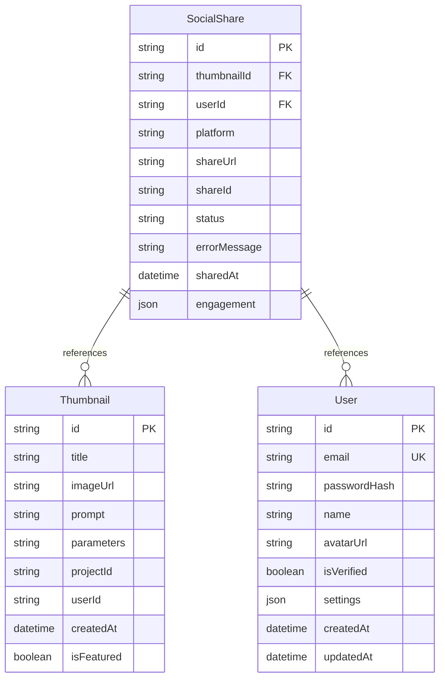
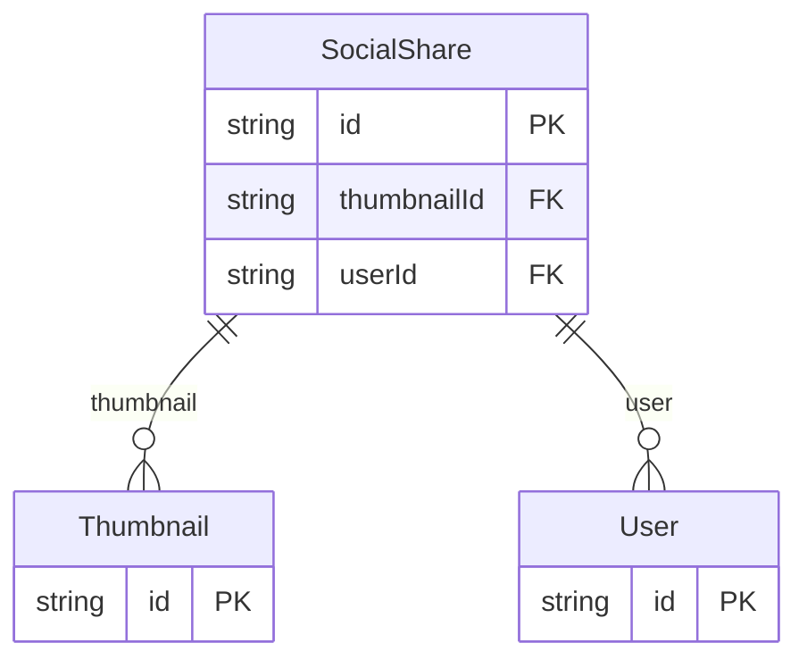
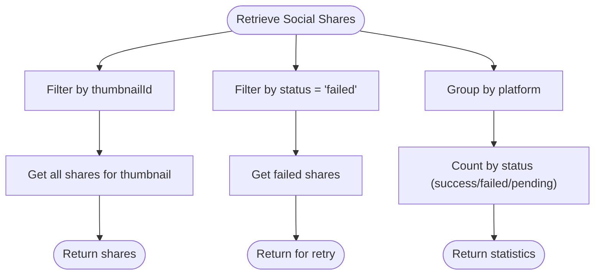
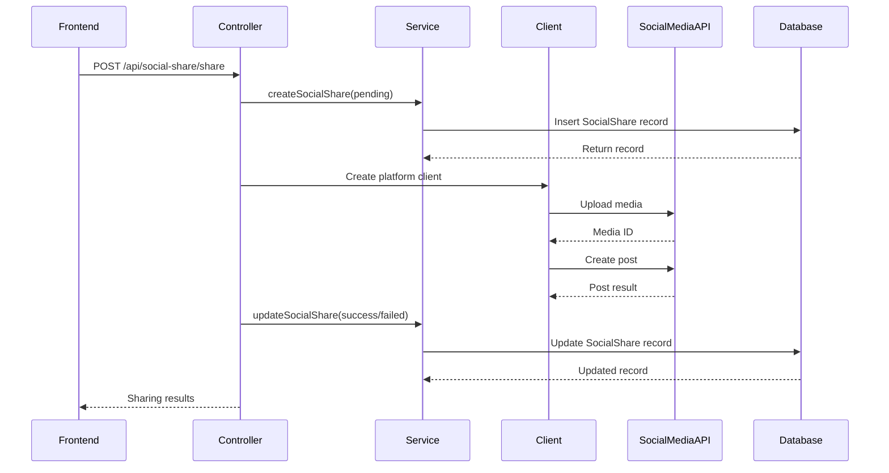

# SocialShare Model

<cite>
**Referenced Files in This Document**   
- [schema.prisma](file://pikzels-clone\prisma\schema.prisma)
- [social-share.service.ts](file://pikzels-clone\src\modules\social-share\social-share.service.ts)
- [social-share.controller.ts](file://pikzels-clone\src\modules\social-share\social-share.controller.ts)
- [social-sharing.md](file://pikzels-clone\docs\social-sharing.md)
- [migration.sql](file://pikzels-clone\prisma\migrations\20250911134004_add_social_shares\migration.sql)
</cite>

## Table of Contents
1. [Introduction](#introduction)
2. [Data Model Structure](#data-model-structure)
3. [Field Definitions](#field-definitions)
4. [Relationships](#relationships)
5. [Status Tracking and Error Handling](#status-tracking-and-error-handling)
6. [Platform Support](#platform-support)
7. [Engagement Metrics Storage](#engagement-metrics-storage)
8. [Common Prisma Queries](#common-prisma-queries)
9. [Performance and Indexing](#performance-and-indexing)
10. [Data Retention](#data-retention)
11. [Integration with Social Media API Clients](#integration-with-social-media-api-clients)
12. [Analytics and Retry Mechanisms](#analytics-and-retry-mechanisms)

## Introduction

The SocialShare model in Thumbnail Maker Studio is a critical component of the application's social media integration system. This model tracks all sharing activities performed by users, providing a comprehensive record of thumbnail distribution across various social networks. The model supports asynchronous sharing operations, error tracking, and analytics collection, enabling users to monitor the performance of their shared content and troubleshoot failed sharing attempts. This documentation provides a detailed analysis of the SocialShare model's structure, functionality, and integration points within the application ecosystem.

**Section sources**
- [schema.prisma](file://pikzels-clone\prisma\schema.prisma#L1-L165)
- [social-sharing.md](file://pikzels-clone\docs\social-sharing.md#L0-L141)

## Data Model Structure

The SocialShare model is implemented in the Prisma schema with a comprehensive set of fields designed to capture all relevant information about social media sharing activities. The model uses UUIDs for unique identification and establishes relationships with both the Thumbnail and User models to maintain data integrity. The structure supports tracking the entire lifecycle of a sharing operation from initiation to completion, including success, failure, and pending states. The model also incorporates platform-specific data storage through the JSON engagement field, allowing for flexible storage of engagement metrics that vary across different social networks.

**Diagram sources**
- [schema.prisma](file://pikzels-clone\prisma\schema.prisma#L1-L165)
- [migration.sql](file://pikzels-clone\prisma\migrations\20250911134004_add_social_shares\migration.sql#L1-L15)

**Section sources**
- [schema.prisma](file://pikzels-clone\prisma\schema.prisma#L1-L165)

## Field Definitions

The SocialShare model contains several key fields that capture essential information about each sharing operation. The id field serves as the primary key and is automatically generated as a UUID. The thumbnailId and userId fields establish foreign key relationships with the Thumbnail and User models, respectively, ensuring referential integrity. The platform field stores the name of the social network where the thumbnail was shared (e.g., 'twitter', 'facebook'). The shareUrl field contains the URL of the successfully shared post, while the shareId field stores the platform-specific identifier for the shared content. The status field tracks the current state of the sharing operation, with possible values including 'pending', 'success', and 'failed'. The errorMessage field captures any error messages when sharing fails, providing valuable diagnostic information. The sharedAt field records the timestamp when the sharing operation was initiated, with a default value of the current timestamp. Finally, the engagement field stores platform-specific engagement metrics as JSON data.

**Section sources**
- [schema.prisma](file://pikzels-clone\prisma\schema.prisma#L1-L165)
- [social-sharing.md](file://pikzels-clone\docs\social-sharing.md#L0-L141)

## Relationships

The SocialShare model establishes critical relationships with two core models in the application: Thumbnail and User. The relationship with the Thumbnail model is defined through the thumbnailId field, which references the id field of the Thumbnail model. This relationship enables the application to track which specific thumbnail was shared and provides access to the thumbnail's metadata and image URL when needed for sharing operations. The relationship with the User model is established through the userId field, which references the id field of the User model. This relationship ensures that sharing activities are properly attributed to the correct user and enables user-specific filtering and analytics. Both relationships use the ON DELETE RESTRICT constraint, preventing the deletion of referenced thumbnails or users while active sharing records exist, thus maintaining data integrity across the system.

**Diagram sources**
- [schema.prisma](file://pikzels-clone\prisma\schema.prisma#L1-L165)

**Section sources**
- [schema.prisma](file://pikzels-clone\prisma\schema.prisma#L1-L165)

## Status Tracking and Error Handling

The SocialShare model implements a robust status tracking system that supports asynchronous sharing operations. The status field can have three primary values: 'pending', 'success', and 'failed'. When a user initiates a sharing operation, a new SocialShare record is created with a status of 'pending', indicating that the sharing process has been initiated but not yet completed. If the sharing operation succeeds, the status is updated to 'success', and the shareUrl and shareId fields are populated with the relevant information from the social media platform. If the sharing operation fails, the status is updated to 'failed', and the errorMessage field is populated with details about the failure. This error handling mechanism provides valuable diagnostic information for troubleshooting failed sharing attempts and enables the implementation of retry mechanisms for failed operations.

**Section sources**
- [social-share.service.ts](file://pikzels-clone\src\modules\social-share\social-share.service.ts#L4-L130)
- [social-share.controller.ts](file://pikzels-clone\src\modules\social-share\social-share.controller.ts#L16-L281)

## Platform Support

The SocialShare model supports multiple social networks through the platform field, which stores the name of the social media platform where the thumbnail was shared. Currently supported platforms include 'twitter', 'facebook', 'linkedin', and 'pinterest', as evidenced by the frontend implementation in the SocialShareModal component. The platform field is implemented as a simple string rather than an enumeration, providing flexibility for future expansion to additional social networks without requiring database schema changes. This design choice allows the application to easily support new platforms by simply adding them to the client-side interface and implementing the corresponding backend client without modifying the database structure.

**Section sources**
- [schema.prisma](file://pikzels-clone\prisma\schema.prisma#L1-L165)
- [social-sharing.md](file://pikzels-clone\docs\social-sharing.md#L0-L141)

## Engagement Metrics Storage

The SocialShare model uses a JSON field named engagement to store platform-specific engagement metrics for shared thumbnails. This flexible data structure allows the model to accommodate different types of engagement data across various social networks. For example, Twitter might provide metrics such as retweets and likes, while Facebook might provide shares, reactions, and comments. The JSON format enables the storage of these varying metrics without requiring a rigid, predefined schema. This approach supports the evolving nature of social media platforms' APIs and their engagement metrics, allowing the application to adapt to changes in available data without requiring database migrations. The engagement data can be used to generate analytics and insights about the performance of shared thumbnails across different platforms.

**Section sources**
- [schema.prisma](file://pikzels-clone\prisma\schema.prisma#L1-L165)
- [social-sharing.md](file://pikzels-clone\docs\social-sharing.md#L0-L141)

## Common Prisma Queries

The SocialShare model supports several common query patterns that enable key functionality within the application. To retrieve all shares for a specific thumbnail, the application can use the getSocialSharesByThumbnail method in the SocialShareService, which queries the SocialShare model with a filter on the thumbnailId field. To count successful shares by platform, the application can use the getSocialShareStats method, which groups shares by platform and status, providing counts for successful, failed, and pending shares. To find failed shares for retry, the application can query the SocialShare model with a filter on the status field set to 'failed', optionally combined with a date range to limit the scope of the retry operation. These query patterns support the core functionality of the social sharing feature, including analytics, error handling, and retry mechanisms.

**Diagram sources**
- [social-share.service.ts](file://pikzels-clone\src\modules\social-share\social-share.service.ts#L4-L130)

**Section sources**
- [social-share.service.ts](file://pikzels-clone\src\modules\social-share\social-share.service.ts#L4-L130)

## Performance and Indexing

The SocialShare model includes indexing on the thumbnailId and userId fields to optimize query performance. These indexes are critical for supporting the application's most common query patterns, such as retrieving all shares for a specific thumbnail or user. The index on thumbnailId enables fast lookups when displaying sharing statistics for a particular thumbnail, while the index on userId supports efficient retrieval of all sharing activities for a specific user. These performance optimizations ensure that the social sharing feature remains responsive even as the volume of sharing records grows over time. The indexes also support the implementation of analytics features that require aggregating data across multiple sharing records.

**Section sources**
- [schema.prisma](file://pikzels-clone\prisma\schema.prisma#L1-L165)

## Data Retention

The documentation does not specify a formal data retention policy for SocialShare records. By default, the model appears to retain all sharing records indefinitely, as there are no automated mechanisms for purging old records. This approach ensures that users have access to their complete sharing history for analytics and auditing purposes. However, the lack of a defined retention policy may lead to database growth over time, particularly for active users who frequently share thumbnails. Future enhancements could include implementing a data retention policy that automatically archives or deletes SocialShare records after a certain period, balancing the need for historical data with database performance and storage considerations.

**Section sources**
- [schema.prisma](file://pikzels-clone\prisma\schema.prisma#L1-L165)

## Integration with Social Media API Clients

The SocialShare model is tightly integrated with the application's social media API clients through the SocialShareService and SocialShareController. When a user initiates a sharing operation, the SocialShareController creates a new SocialShare record with a status of 'pending' before attempting to share the thumbnail through the appropriate social media client. If the sharing operation succeeds, the controller updates the SocialShare record with a status of 'success' and populates the shareUrl and shareId fields with data returned from the social media API. If the operation fails, the controller updates the record with a status of 'failed' and stores the error message. This integration ensures that the database accurately reflects the state of sharing operations and provides a reliable record of all sharing activities, regardless of their outcome.

**Diagram sources**
- [social-share.controller.ts](file://pikzels-clone\src\modules\social-share\social-share.controller.ts#L16-L281)
- [social-share.service.ts](file://pikzels-clone\src\modules\social-share\social-share.service.ts#L4-L130)

**Section sources**
- [social-share.controller.ts](file://pikzels-clone\src\modules\social-share\social-share.controller.ts#L16-L281)

## Analytics and Retry Mechanisms

The SocialShare model enables comprehensive analytics and retry mechanisms for failed sharing attempts. The model's structure, with its status field and errorMessage field, provides the foundation for tracking the success rate of sharing operations and identifying common failure points. The getSocialShareStats method in the SocialShareService aggregates sharing data by platform and status, enabling the application to display analytics such as total shares, successful shares, and failed shares for each platform. This data is used in the SocialShareAnalytics component to provide users with insights into their sharing performance. Additionally, the model supports retry mechanisms by allowing the application to query for all SocialShare records with a status of 'failed' and attempt to re-share the associated thumbnails, potentially after addressing the underlying cause of the failure.

**Section sources**
- [social-share.service.ts](file://pikzels-clone\src\modules\social-share\social-share.service.ts#L4-L130)
- [social-share.controller.ts](file://pikzels-clone\src\modules\social-share\social-share.controller.ts#L16-L281)
- [social-sharing.md](file://pikzels-clone\docs\social-sharing.md#L0-L141)