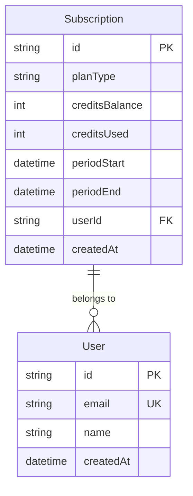
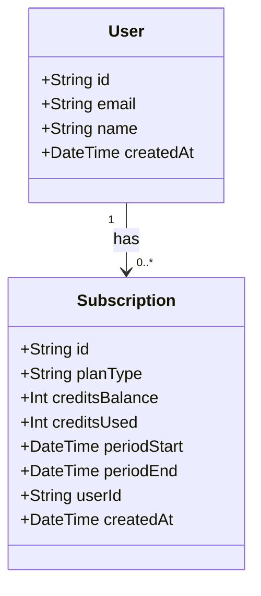
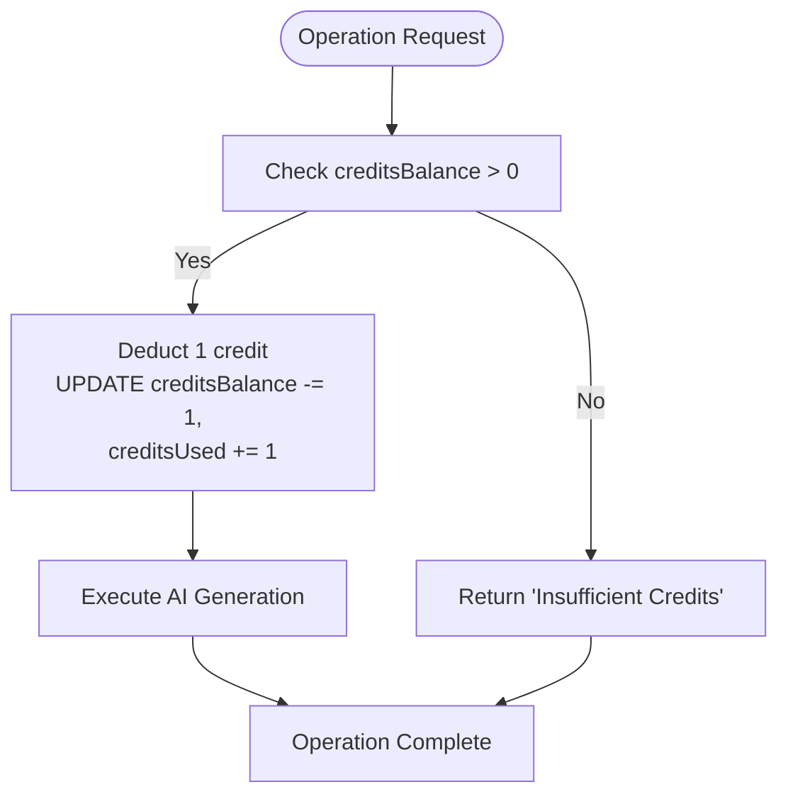
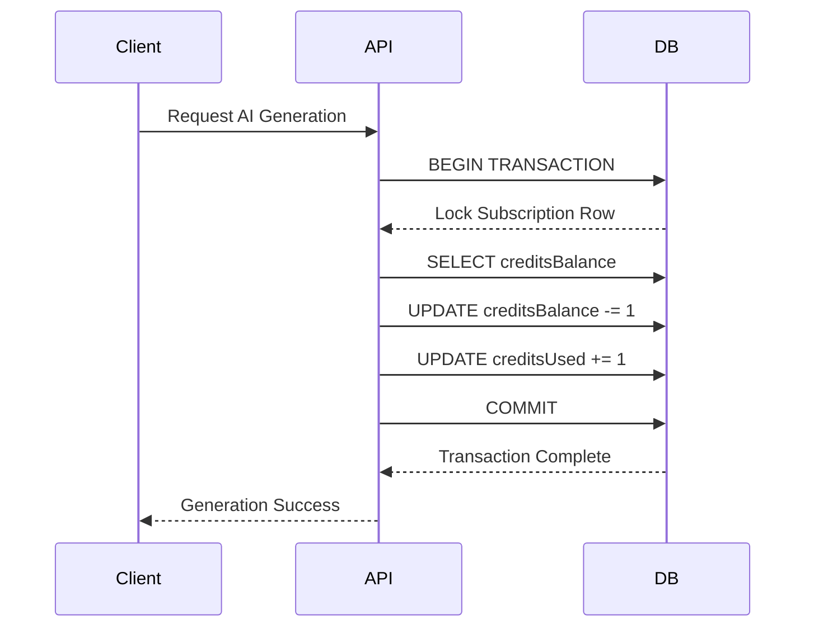

# Subscription Model

<cite>
**Referenced Files in This Document**   
- [schema.prisma](file://pikzels-clone/prisma/schema.prisma)
- [index.d.ts](file://pikzels-clone/src/generated/prisma/index.d.ts)
</cite>

## Table of Contents
1. [Introduction](#introduction)
2. [Subscription Model Structure](#subscription-model-structure)
3. [Field Definitions](#field-definitions)
4. [Relationship with User Model](#relationship-with-user-model)
5. [Credit System Design](#credit-system-design)
6. [Common Prisma Queries](#common-prisma-queries)
7. [Data Consistency and Race Condition Prevention](#data-consistency-and-race-condition-prevention)
8. [Integration with Payment Systems](#integration-with-payment-systems)
9. [Scalability for High-Frequency Credit Updates](#scalability-for-high-frequency-credit-updates)
10. [Reporting and Analytics Capabilities](#reporting-and-analytics-capabilities)

## Introduction
The Subscription model in Thumbnail Maker Studio is a core component of the platform's usage-based premium access system. It enables tracking of user subscriptions, manages credit balances for AI-powered features such as thumbnail generation, and supports recurring billing cycles. This document provides a comprehensive overview of the model's structure, functionality, and integration points within the application ecosystem.

**Section sources**
- [schema.prisma](file://pikzels-clone/prisma/schema.prisma#L45-L53)

## Subscription Model Structure
The Subscription model is defined in the Prisma schema and includes essential fields for managing subscription lifecycle, credit allocation, and user association. It supports various premium plans through the `planType` field and tracks usage via credit consumption metrics.



**Diagram sources**
- [schema.prisma](file://pikzels-clone/prisma/schema.prisma#L45-L53)

**Section sources**
- [schema.prisma](file://pikzels-clone/prisma/schema.prisma#L45-L53)

## Field Definitions
Each field in the Subscription model serves a specific purpose in managing subscription state and usage tracking:

- **id**: Unique identifier (UUID) for each subscription record
- **planType**: String indicating the subscription tier (e.g., "basic", "pro", "enterprise")
- **creditsBalance**: Integer representing the current available credits for premium feature usage
- **creditsUsed**: Integer tracking the total number of credits consumed during the billing period
- **periodStart**: DateTime marking the beginning of the current subscription cycle
- **periodEnd**: DateTime indicating when the current subscription period expires
- **userId**: Foreign key linking the subscription to a User record
- **createdAt**: Timestamp of when the subscription was created

**Section sources**
- [schema.prisma](file://pikzels-clone/prisma/schema.prisma#L45-L53)

## Relationship with User Model
The Subscription model maintains a one-to-many relationship with the User model, where each user can have multiple subscription records over time. The `userId` field establishes this relationship through a foreign key constraint, enabling efficient lookup of subscription history and current status for any user.



**Diagram sources**
- [schema.prisma](file://pikzels-clone/prisma/schema.prisma#L45-L53)

**Section sources**
- [schema.prisma](file://pikzels-clone/prisma/schema.prisma#L45-L53)

## Credit System Design
The credit system enables fine-grained control over access to premium features such as AI-generated thumbnails. Each operation consumes a predefined number of credits based on complexity, with the `creditsBalance` field checked before execution. Credits are replenished at the start of each billing cycle defined by `periodStart` and `periodEnd`. The system prevents overuse by validating sufficient balance prior to feature access.



**Diagram sources**
- [schema.prisma](file://pikzels-clone/prisma/schema.prisma#L45-L53)

**Section sources**
- [schema.prisma](file://pikzels-clone/prisma/schema.prisma#L45-L53)

## Common Prisma Queries
The following are typical Prisma queries used to interact with the Subscription model:

- **Check a user's credit balance**:
```prisma
prisma.subscription.findFirst({
  where: { userId: 'user-id', periodEnd: { gte: new Date() } },
  select: { creditsBalance: true }
})
```

- **Find active subscriptions**:
```prisma
prisma.subscription.findMany({
  where: {
    periodEnd: { gte: new Date() },
    creditsBalance: { gt: 0 }
  }
})
```

- **Update usage statistics after AI generation**:
```prisma
prisma.subscription.update({
  where: { id: 'subscription-id' },
  data: {
    creditsBalance: { decrement: 1 },
    creditsUsed: { increment: 1 }
  }
})
```

**Section sources**
- [schema.prisma](file://pikzels-clone/prisma/schema.prisma#L45-L53)

## Data Consistency and Race Condition Prevention
To ensure data consistency during credit transactions, all updates to `creditsBalance` and `creditsUsed` are performed within Prisma transactions. This prevents race conditions when multiple AI generation requests occur simultaneously. The atomic nature of database operations ensures that credit deductions are never double-applied or lost.



**Diagram sources**
- [schema.prisma](file://pikzels-clone/prisma/schema.prisma#L45-L53)

**Section sources**
- [schema.prisma](file://pikzels-clone/prisma/schema.prisma#L45-L53)

## Integration with Payment Systems
The Subscription model integrates with external payment providers through webhook listeners that update the `periodEnd` and `creditsBalance` fields upon successful renewal. Failed payments trigger status updates and may lead to service restrictions. The `planType` field determines the initial credit allocation and renewal terms.

**Section sources**
- [schema.prisma](file://pikzels-clone/prisma/schema.prisma#L45-L53)

## Scalability for High-Frequency Credit Updates
For high-frequency operations like AI generation, the system leverages database indexing on `userId` and `periodEnd` to optimize query performance. Caching layers can be implemented to reduce database load, with periodic reconciliation to maintain accuracy between cached and persistent states.

**Section sources**
- [schema.prisma](file://pikzels-clone/prisma/schema.prisma#L45-L53)

## Reporting and Analytics Capabilities
The Subscription model supports reporting on user engagement, credit consumption patterns, and revenue forecasting. Aggregated queries across `creditsUsed`, `planType`, and `createdAt` enable insights into feature popularity and customer lifetime value. These analytics inform product decisions and marketing strategies.

**Section sources**
- [schema.prisma](file://pikzels-clone/prisma/schema.prisma#L45-L53)