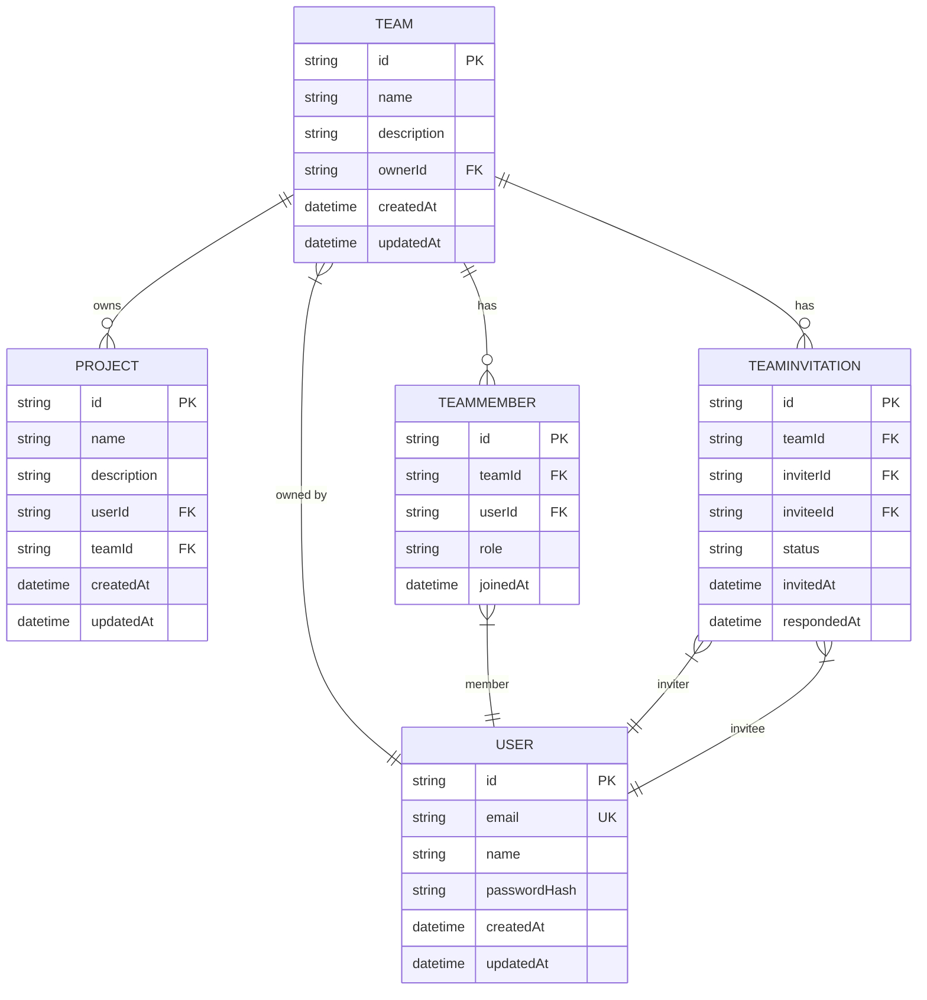
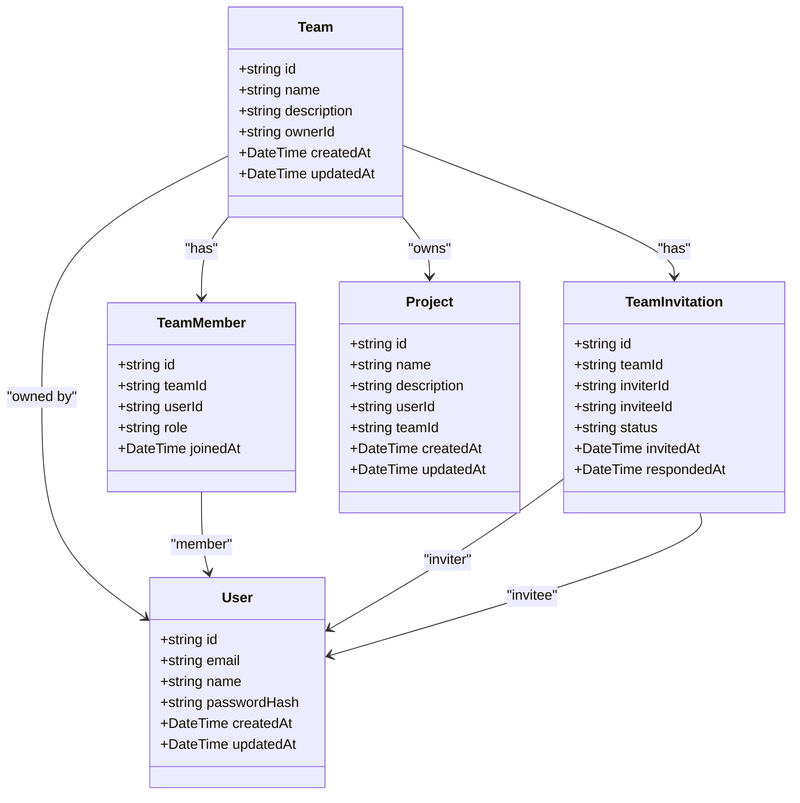

# Team Model

<cite>
**Referenced Files in This Document**   
- [schema.prisma](file://pikzels-clone\prisma\schema.prisma)
- [collaboration.md](file://pikzels-clone\docs\collaboration.md)
- [collaboration.service.ts](file://pikzels-clone\src\modules\collaboration\collaboration.service.ts)
- [collaboration.controller.ts](file://pikzels-clone\src\modules\collaboration\collaboration.controller.ts)
- [collaboration.routes.ts](file://pikzels-clone\src\modules\collaboration\collaboration.routes.ts)
</cite>

## Table of Contents
1. [Introduction](#introduction)
2. [Team Model Structure](#team-model-structure)
3. [Field Definitions](#field-definitions)
4. [Relationships](#relationships)
5. [Data Integrity and Constraints](#data-integrity-and-constraints)
6. [Role-Based Access Control](#role-based-access-control)
7. [Common Prisma Queries](#common-prisma-queries)
8. [Performance Considerations](#performance-considerations)
9. [Integration with Collaboration Workflows](#integration-with-collaboration-workflows)
10. [Scalability and Large Teams](#scalability-and-large-teams)
11. [Conclusion](#conclusion)

## Introduction

The Team model in Thumbnail Maker Studio serves as the foundation for collaborative workflows, enabling users to organize into groups for shared project creation and management. This data model facilitates team-based collaboration by establishing ownership, membership, and project association patterns that support complex team interactions. The model is implemented using Prisma ORM and integrates with the application's authentication system to provide secure, role-based access to team resources.

The Team model supports key collaboration features including team creation, member management, invitation workflows, and team-owned projects. It enables users to transition from individual to team-based work by providing a structured framework for shared ownership and access control. This documentation provides a comprehensive analysis of the Team model, its relationships, and its role in enabling collaborative features within the application.

**Section sources**
- [schema.prisma](file://pikzels-clone\prisma\schema.prisma#L100-L114)
- [collaboration.md](file://pikzels-clone\docs\collaboration.md#L40-L49)

## Team Model Structure

The Team model is defined in the Prisma schema with a comprehensive set of fields that capture essential team information and relationships. The model uses UUIDs for unique identification, ensuring global uniqueness across distributed systems. Each team has a name and optional description that provide human-readable identification and context. The model includes timestamps for creation and updates, enabling audit trails and temporal analysis of team activities.

The structure follows a relational database pattern with explicit foreign key relationships to related entities. The model is designed to support both individual ownership and team-based collaboration, with the owner field establishing clear accountability while membership relationships enable shared access. The schema includes appropriate indexing on frequently queried fields to optimize performance for common access patterns.



**Diagram sources**
- [schema.prisma](file://pikzels-clone\prisma\schema.prisma#L100-L114)

**Section sources**
- [schema.prisma](file://pikzels-clone\prisma\schema.prisma#L100-L114)
- [collaboration.md](file://pikzels-clone\docs\collaboration.md#L40-L49)

## Field Definitions

The Team model consists of six core fields that define its structure and behavior. The `id` field serves as the primary key, using a UUID for unique identification across the system. This approach ensures that team identifiers are globally unique and prevents collisions in distributed environments. The UUID generation is handled automatically by Prisma, reducing the risk of implementation errors.

The `name` field stores the team's display name as a string, providing a human-readable identifier. This field is required and supports team discovery and organization within the user interface. The optional `description` field allows team owners to provide additional context about the team's purpose, members, or projects, enhancing collaboration and onboarding.

The `ownerId` field establishes the team's ownership by referencing a User record. This foreign key relationship creates a one-to-one association between a team and its owner, who has elevated privileges for team management. The `createdAt` and `updatedAt` fields are automatically managed timestamps that track the team's lifecycle, enabling temporal queries and audit capabilities.

**Section sources**
- [schema.prisma](file://pikzels-clone\prisma\schema.prisma#L100-L114)
- [collaboration.md](file://pikzels-clone\docs\collaboration.md#L40-L49)

## Relationships

The Team model establishes several critical relationships that enable collaborative functionality. The one-to-one relationship with User through the `ownerId` field creates clear ownership and accountability, with the owner having special privileges for team management. This relationship is implemented with a foreign key constraint that ensures referential integrity between teams and users.

The one-to-many relationship with TeamMember enables multiple users to belong to a single team, supporting collaborative workflows. Each TeamMember record includes a role field that implements role-based access control, allowing for different permission levels within the team. This relationship supports team hierarchies and delegation of responsibilities.

The one-to-many relationship with TeamInvitation facilitates the team onboarding process, allowing existing members to invite new users. This relationship tracks invitation status and response timestamps, enabling workflow management and notification systems. The one-to-many relationship with Project allows teams to own projects, transitioning from individual to team-based work while maintaining clear ownership and access control.



**Diagram sources**
- [schema.prisma](file://pikzels-clone\prisma\schema.prisma#L100-L114)
- [schema.prisma](file://pikzels-clone\prisma\schema.prisma#L116-L125)
- [schema.prisma](file://pikzels-clone\prisma\schema.prisma#L127-L136)
- [schema.prisma](file://pikzels-clone\prisma\schema.prisma#L50-L59)

**Section sources**
- [schema.prisma](file://pikzels-clone\prisma\schema.prisma#L100-L114)
- [collaboration.md](file://pikzels-clone\docs\collaboration.md#L50-L61)

## Data Integrity and Constraints

The Team model implements several constraints to ensure data integrity and consistency. The primary key constraint on the `id` field guarantees unique team identification, while the foreign key constraint on `ownerId` ensures that every team references a valid user. These constraints prevent orphaned records and maintain referential integrity throughout the system.

The model includes a database index on the `ownerId` field, optimizing queries that retrieve teams by owner. This index significantly improves performance for common operations such as listing a user's teams or finding teams owned by a specific user. The index supports efficient filtering and sorting operations, reducing query execution time for team-related operations.

Additional constraints are enforced through the application logic rather than the database schema. For example, business rules prevent team members from being removed by non-administrative users and restrict role changes to team owners. These constraints are implemented in the collaboration service and controller layers, providing a comprehensive validation framework that complements the database-level constraints.

**Section sources**
- [schema.prisma](file://pikzels-clone\prisma\schema.prisma#L114)
- [collaboration.service.ts](file://pikzels-clone\src\modules\collaboration\collaboration.service.ts#L314-L354)
- [collaboration.controller.ts](file://pikzels-clone\src\modules\collaboration\collaboration.controller.ts#L197-L211)

## Role-Based Access Control

The Team model enables a sophisticated role-based access control system through its relationships with TeamMember and associated business logic. The owner of a team has elevated privileges, including the ability to update team information, delete the team, and modify member roles. This ownership model establishes clear accountability and prevents unauthorized modifications to team structure.

Team members are assigned roles such as "owner", "admin", or "member" through the TeamMember relationship, creating a hierarchy of permissions. Owners can promote members to admin status, granting them the ability to add or remove other members while maintaining the owner's exclusive right to modify roles. This tiered permission system balances flexibility with security, allowing teams to delegate responsibilities while maintaining control.

Access control is enforced through both database queries and application-level validation. When retrieving team data, the service layer filters results based on the requesting user's membership and role. For modification operations, the controller validates that the user has appropriate permissions before forwarding the request to the service layer, providing defense in depth against unauthorized access.

**Section sources**
- [schema.prisma](file://pikzels-clone\prisma\schema.prisma#L116-L125)
- [collaboration.service.ts](file://pikzels-clone\src\modules\collaboration\collaboration.service.ts#L314-L354)
- [collaboration.controller.ts](file://pikzels-clone\src\modules\collaboration\collaboration.controller.ts#L197-L211)

## Common Prisma Queries

The Team model supports several common query patterns that facilitate collaboration features. To retrieve a team with all its members, the application uses an include clause to eagerly load the members relationship with associated user data:

```prisma
prisma.team.findUnique({
  where: { id: teamId },
  include: {
    owner: { select: { id, name, email, avatarUrl } },
    members: {
      include: {
        user: { select: { id, name, email, avatarUrl } }
      }
    }
  }
})
```

To find all teams a user belongs to, the application queries teams where the user is a member:

```prisma
prisma.team.findMany({
  where: {
    members: {
      some: { userId: userId }
    }
  }
})
```

For listing team projects, the application retrieves projects owned by the team:

```prisma
prisma.project.findMany({
  where: { teamId: teamId }
})
```

These queries are optimized with appropriate indexing and include clauses to minimize database round trips and improve performance.

**Section sources**
- [collaboration.service.ts](file://pikzels-clone\src\modules\collaboration\collaboration.service.ts#L15-L35)
- [collaboration.service.ts](file://pikzels-clone\src\modules\collaboration\collaboration.service.ts#L37-L57)
- [collaboration.service.ts](file://pikzels-clone\src\modules\collaboration\collaboration.service.ts#L415-L433)

## Performance Considerations

The Team model incorporates several performance optimizations to handle collaborative workloads efficiently. The index on `ownerId` accelerates queries that filter teams by ownership, which are common in user dashboards and team management interfaces. Additional indexes on frequently queried fields in related models, such as `teamId` in TeamMember, ensure that membership queries perform well even with large datasets.

The model design minimizes join complexity by using direct foreign key relationships rather than complex many-to-many associations. This approach reduces query execution time and memory usage, particularly for operations that retrieve team data with related entities. The application uses selective field inclusion in queries to retrieve only the necessary data, reducing network overhead and improving response times.

For large teams, the system implements pagination and limiting strategies in the service layer to prevent performance degradation. When retrieving team members or projects, the application limits the number of records returned and provides pagination parameters for navigating large result sets. These optimizations ensure that the collaboration features remain responsive even as team sizes grow.

**Section sources**
- [schema.prisma](file://pikzels-clone\prisma\schema.prisma#L114)
- [collaboration.service.ts](file://pikzels-clone\src\modules\collaboration\collaboration.service.ts#L415-L433)

## Integration with Collaboration Workflows

The Team model integrates seamlessly with invitation workflows and project ownership transfer, enabling smooth transitions between individual and team contexts. The invitation system uses the TeamInvitation model to manage the onboarding process, tracking invitation status and responses. When a user accepts an invitation, the system automatically creates a TeamMember record, granting them access to the team's projects and resources.

Project ownership can be transferred from individual to team context by updating the `teamId` field on a Project record. This transition maintains all existing project data while extending access to all team members according to their roles. The system preserves the original `userId` field to maintain attribution and audit trails, creating a hybrid ownership model that combines individual credit with team collaboration.

The integration between teams and projects supports both team-owned projects and individual projects within a team context. This flexibility allows teams to manage shared resources while still supporting individual work, accommodating various collaboration patterns and workflows.

**Section sources**
- [schema.prisma](file://pikzels-clone\prisma\schema.prisma#L50-L59)
- [schema.prisma](file://pikzels-clone\prisma\schema.prisma#L127-L136)
- [collaboration.service.ts](file://pikzels-clone\src\modules\collaboration\collaboration.service.ts#L356-L384)

## Scalability and Large Teams

The Team model is designed to scale effectively for large teams and high-volume collaboration. The use of UUIDs for identification prevents key collisions in distributed systems and supports horizontal scaling. The normalized database structure with proper indexing ensures that query performance remains consistent as team sizes grow.

For very large teams, the system implements lazy loading and pagination to manage data retrieval efficiently. Team member lists are paginated, and detailed member information is loaded on demand rather than eagerly. This approach reduces memory usage and improves interface responsiveness, particularly for administrative operations.

The model supports bulk operations through the underlying Prisma ORM, enabling efficient processing of team-wide changes. For example, when a team is deleted, the database cascade rules automatically remove associated members and invitations, ensuring data consistency without requiring multiple application-level operations.

**Section sources**
- [schema.prisma](file://pikzels-clone\prisma\schema.prisma#L100-L114)
- [collaboration.service.ts](file://pikzels-clone\src\modules\collaboration\collaboration.service.ts#L215-L235)

## Conclusion

The Team model in Thumbnail Maker Studio provides a robust foundation for collaborative workflows, enabling users to organize into teams for shared project creation and management. Through its well-designed structure, comprehensive relationships, and integration with role-based access control, the model supports complex collaboration patterns while maintaining data integrity and performance.

The model's design balances flexibility with security, allowing teams to manage membership and permissions while preventing unauthorized access. Its integration with invitation workflows and project ownership transfer enables smooth transitions between individual and team contexts, supporting a wide range of collaboration scenarios.

By implementing appropriate indexing, constraints, and optimization strategies, the model ensures reliable performance even with large teams and high-volume usage. This comprehensive approach to team-based collaboration enhances the application's functionality and supports the growing needs of users working in collaborative environments.