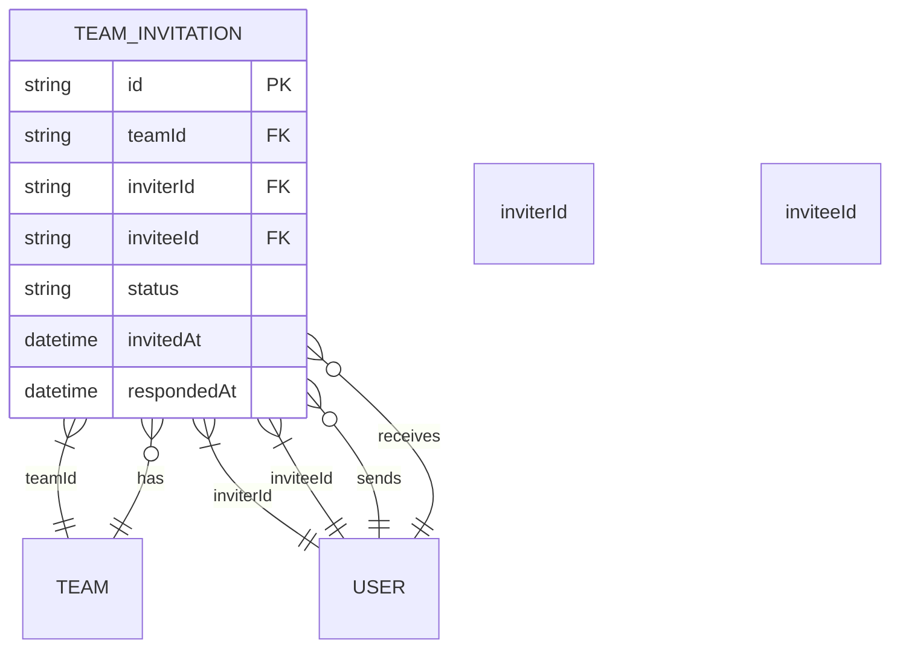
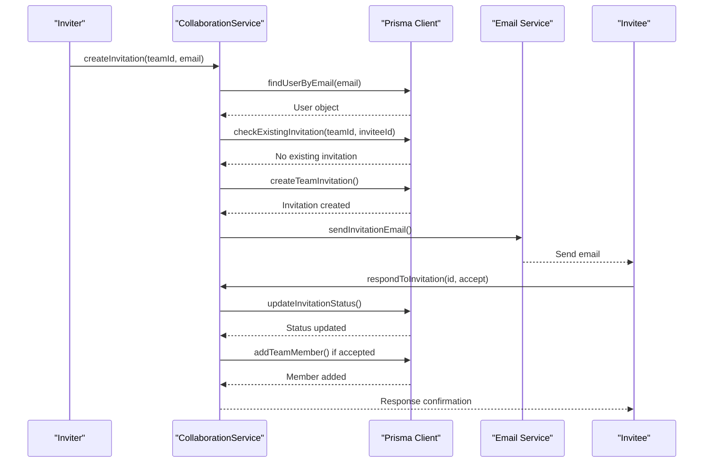

# TeamInvitation Model

<cite>
**Referenced Files in This Document**   
- [schema.prisma](file://pikzels-clone/prisma/schema.prisma)
- [collaboration.md](file://pikzels-clone/docs/collaboration.md)
- [collaboration.service.ts](file://pikzels-clone/src/modules/collaboration/collaboration.service.ts)
- [collaboration.controller.ts](file://pikzels-clone/src/modules/collaboration/collaboration.controller.ts)
- [collaboration.routes.ts](file://pikzels-clone/src/modules/collaboration/collaboration.routes.ts)
</cite>

## Table of Contents
1. [Introduction](#introduction)
2. [Field Specifications](#field-specifications)
3. [Relationships](#relationships)
4. [Indexing Strategy](#indexing-strategy)
5. [Common Prisma Queries](#common-prisma-queries)
6. [Data Integrity and Validation](#data-integrity-and-validation)
7. [Expiration and Cleanup](#expiration-and-cleanup)
8. [Integration with Notification Systems](#integration-with-notification-systems)
9. [Security and Collaboration Workflows](#security-and-collaboration-workflows)
10. [Conclusion](#conclusion)

## Introduction
The TeamInvitation model in Thumbnail Maker Studio enables asynchronous team onboarding by allowing users to invite others to join teams. This model supports collaboration workflows by managing the lifecycle of invitations from creation to response. It ensures data integrity through proper relationships and indexing while enabling efficient querying for pending invitations and invitation history.

**Section sources**
- [schema.prisma](file://pikzels-clone/prisma/schema.prisma#L138-L150)
- [collaboration.md](file://pikzels-clone/docs/collaboration.md#L50-L61)

## Field Specifications
The TeamInvitation model contains the following fields:

| Field | Type | Description |
|-------|------|-------------|
| id | String (UUID) | Unique identifier for the invitation |
| teamId | String | Reference to the team being joined |
| inviterId | String | Reference to the user who sent the invitation |
| inviteeId | String | Reference to the user who received the invitation |
| status | String | Current status of the invitation ("pending", "accepted", "declined") |
| invitedAt | DateTime | Timestamp when the invitation was created |
| respondedAt | DateTime (optional) | Timestamp when the invitation was responded to |

The status field uses an enumeration pattern with three possible values: "pending" (initial state), "accepted" (invitee joined the team), and "declined" (invitee rejected the invitation). The respondedAt field is optional and only populated when the invitation status changes from "pending".

**Section sources**
- [schema.prisma](file://pikzels-clone/prisma/schema.prisma#L138-L150)
- [collaboration.md](file://pikzels-clone/docs/collaboration.md#L50-L61)

## Relationships
The TeamInvitation model establishes relationships with multiple entities:



**Diagram sources**
- [schema.prisma](file://pikzels-clone/prisma/schema.prisma#L138-L150)

**Section sources**
- [schema.prisma](file://pikzels-clone/prisma/schema.prisma#L138-L150)
- [collaboration.service.ts](file://pikzels-clone/src/modules/collaboration/collaboration.service.ts#L1-L50)

## Indexing Strategy
The model implements strategic indexing to optimize common query patterns:

```prisma
@@index([teamId])
@@index([inviteeId])
@@index([status])
```

These indexes support efficient queries for:
- Finding all invitations for a specific team (teamId index)
- Retrieving all invitations for a user (inviteeId index)
- Filtering invitations by status, particularly "pending" invitations (status index)

The combination of these indexes enables fast retrieval of invitation lists, pending invitation checks, and team membership management operations.

**Section sources**
- [schema.prisma](file://pikzels-clone/prisma/schema.prisma#L148-L150)

## Common Prisma Queries
The following are typical Prisma queries used with the TeamInvitation model:

**Find pending invitations for a user:**
```prisma
prisma.teamInvitation.findMany({
  where: {
    inviteeId: userId,
    status: 'pending'
  },
  include: {
    team: true,
    inviter: true
  }
})
```

**Check if an invitation exists between users:**
```prisma
prisma.teamInvitation.findFirst({
  where: {
    teamId: teamId,
    inviterId: inviterId,
    inviteeId: inviteeId,
    status: 'pending'
  }
})
```

**List all invitations for a team:**
```prisma
prisma.teamInvitation.findMany({
  where: {
    teamId: teamId
  },
  include: {
    inviter: true,
    invitee: true
  },
  orderBy: {
    invitedAt: 'desc'
  }
})
```

**Update invitation status:**
```prisma
prisma.teamInvitation.update({
  where: {
    id: invitationId
  },
  data: {
    status: 'accepted',
    respondedAt: new Date()
  }
})
```

**Section sources**
- [collaboration.service.ts](file://pikzels-clone/src/modules/collaboration/collaboration.service.ts#L50-L150)
- [collaboration.controller.ts](file://pikzels-clone/src/modules/collaboration/collaboration.controller.ts#L20-L80)

## Data Integrity and Validation
The model enforces data integrity through several mechanisms:

1. **Unique Constraints**: While not explicitly defined at the database level, business logic prevents duplicate invitations between the same users for the same team.
2. **Required Fields**: All fields except respondedAt are required, ensuring complete invitation records.
3. **Status Validation**: The status field is constrained to predefined values ("pending", "accepted", "declined").
4. **Relationship Integrity**: Foreign key relationships ensure invitations reference valid teams and users.

The collaboration service validates invitations before creation, checking that:
- The inviter is a member of the team
- The invitee is not already a team member
- No pending invitation already exists for the same team and invitee

**Section sources**
- [collaboration.service.ts](file://pikzels-clone/src/modules/collaboration/collaboration.service.ts#L100-L200)
- [collaboration.controller.ts](file://pikzels-clone/src/modules/collaboration/collaboration.controller.ts#L15-L50)

## Expiration and Cleanup
While the current implementation does not include automatic expiration, the model structure supports future expiration strategies:

1. **Time-based Expiration**: Add an expiresAt field to automatically expire invitations after a set period (e.g., 7 days).
2. **Cleanup Process**: Implement a background job that periodically identifies and removes expired invitations.
3. **Manual Revocation**: Allow inviters to revoke pending invitations through the API.

The respondedAt field provides the basis for calculating invitation age and determining expiration status. Future enhancements could include adding an expiresAt field and implementing cleanup logic in the collaboration service.

**Section sources**
- [schema.prisma](file://pikzels-clone/prisma/schema.prisma#L138-L150)
- [collaboration.service.ts](file://pikzels-clone/src/modules/collaboration/collaboration.service.ts#L200-L250)

## Integration with Notification Systems
The TeamInvitation model integrates with notification systems to support user engagement:

1. **Email Notifications**: When an invitation is created, the system triggers an email to the invitee with acceptance instructions.
2. **In-app Notifications**: Users receive in-app notifications about new invitations.
3. **Status Updates**: When invitations are accepted or declined, relevant parties receive notifications.

The collaboration controller handles these integrations by emitting events or calling notification services when invitation status changes. The invitedAt and respondedAt timestamps help track invitation lifecycle for analytics and reminder systems.

**Section sources**
- [collaboration.controller.ts](file://pikzels-clone/src/modules/collaboration/collaboration.controller.ts#L80-L120)
- [collaboration.service.ts](file://pikzels-clone/src/modules/collaboration/collaboration.service.ts#L250-L300)

## Security and Collaboration Workflows
The model enables secure collaboration workflows by:

1. **Preventing Unauthorized Invitations**: Only team members can invite others, verified through authorization checks.
2. **Avoiding Duplicate Invitations**: The system checks for existing pending invitations before creating new ones.
3. **Maintaining Audit Trail**: The invitedAt and respondedAt fields provide a complete history of invitation interactions.
4. **Supporting Asynchronous Onboarding**: Users can accept invitations at their convenience without real-time coordination.

The model supports the complete invitation workflow from creation to resolution, ensuring that team membership changes are properly tracked and authorized.



**Diagram sources**
- [collaboration.service.ts](file://pikzels-clone/src/modules/collaboration/collaboration.service.ts#L1-L100)
- [collaboration.controller.ts](file://pikzels-clone/src/modules/collaboration/collaboration.controller.ts#L1-L50)

**Section sources**
- [collaboration.service.ts](file://pikzels-clone/src/modules/collaboration/collaboration.service.ts#L1-L300)
- [collaboration.controller.ts](file://pikzels-clone/src/modules/collaboration/collaboration.controller.ts#L1-L120)
- [collaboration.routes.ts](file://pikzels-clone/src/modules/collaboration/collaboration.routes.ts#L1-L40)

## Conclusion
The TeamInvitation model provides a robust foundation for team-based collaboration in Thumbnail Maker Studio. By implementing proper relationships, indexing, and validation, it supports efficient and secure team onboarding workflows. The model's design enables both immediate functionality and future enhancements such as invitation expiration and advanced notification systems.