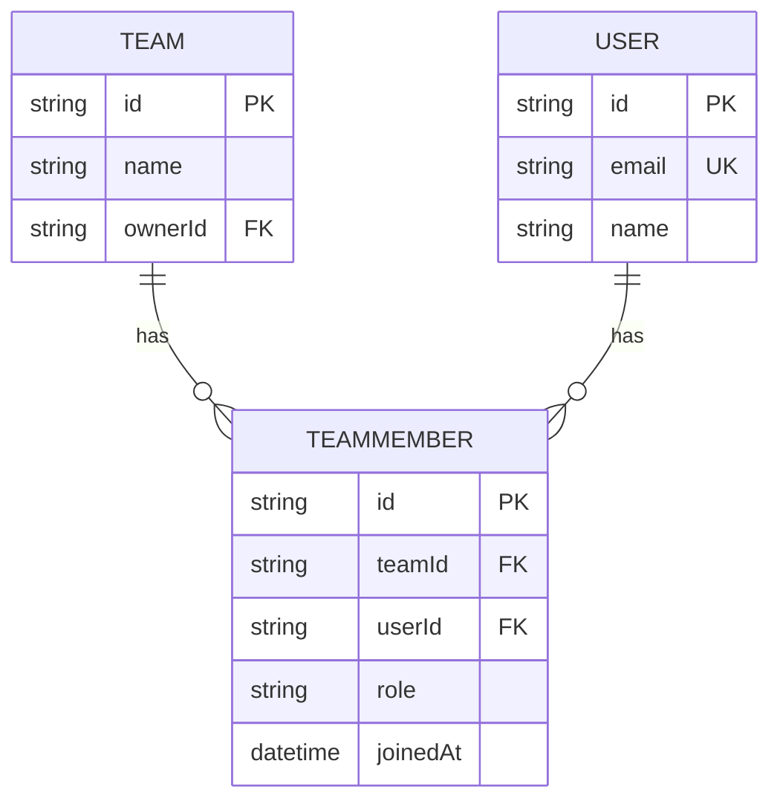
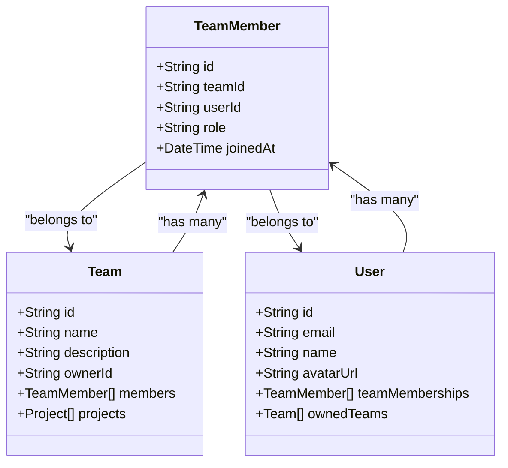
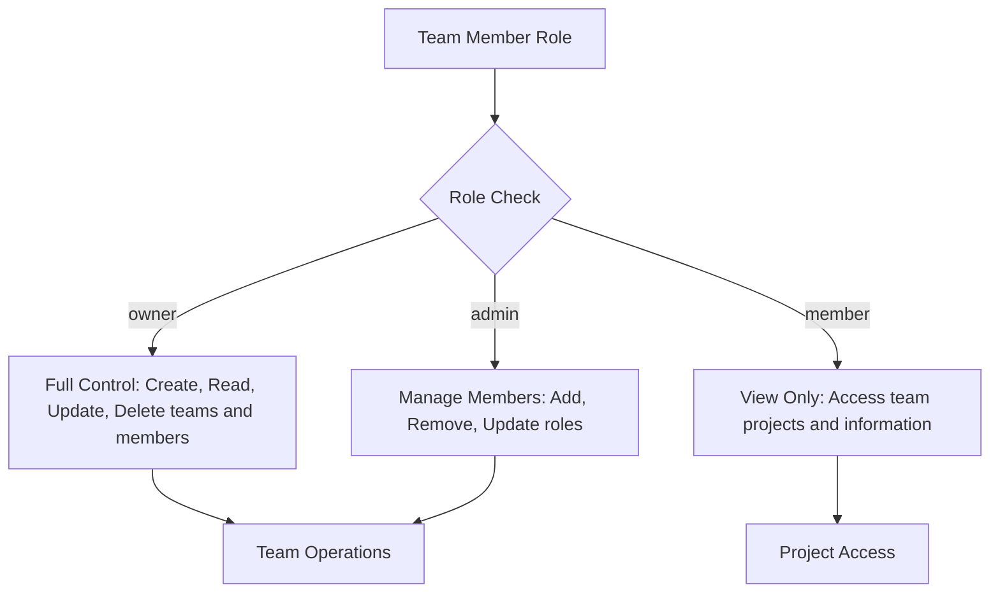
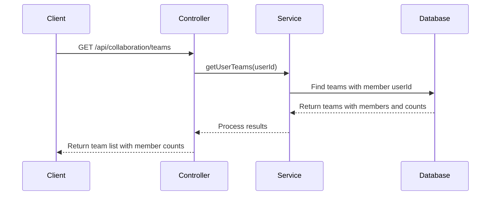
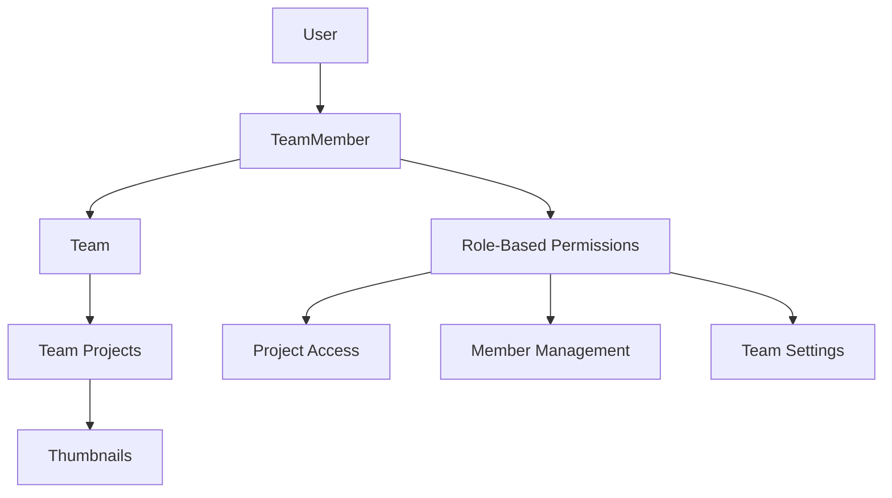

# TeamMember Model

<cite>
**Referenced Files in This Document**   
- [schema.prisma](file://pikzels-clone\prisma\schema.prisma)
- [collaboration.md](file://pikzels-clone\docs\collaboration.md)
- [collaboration.service.ts](file://pikzels-clone\src\modules\collaboration\collaboration.service.ts)
- [collaboration.controller.ts](file://pikzels-clone\src\modules\collaboration\collaboration.controller.ts)
</cite>

## Table of Contents
1. [Introduction](#introduction)
2. [Core Fields](#core-fields)
3. [Constraints and Indexes](#constraints-and-indexes)
4. [Relationships](#relationships)
5. [Role-Based Access Control](#role-based-access-control)
6. [Common Prisma Queries](#common-prisma-queries)
7. [Performance Considerations](#performance-considerations)
8. [Integration with Collaboration Features](#integration-with-collaboration-features)
9. [Data Consistency](#data-consistency)
10. [Conclusion](#conclusion)

## Introduction

The TeamMember model is a core component of the collaboration system in Thumbnail Maker Studio, enabling team-based project creation and management. This model establishes the relationship between users and teams, defining membership and roles within collaborative workspaces. The model supports granular access control through role-based permissions and ensures data integrity through unique constraints and database indexes.

**Section sources**
- [schema.prisma](file://pikzels-clone\prisma\schema.prisma#L133-L145)
- [collaboration.md](file://pikzels-clone\docs\collaboration.md#L40-L49)

## Core Fields

The TeamMember model contains several essential fields that define team membership:

- **id**: A UUID string serving as the primary key, automatically generated using Prisma's uuid() function
- **teamId**: String reference to the associated Team model
- **userId**: String reference to the associated User model
- **role**: String field that defines the member's role with three possible values: "owner", "admin", or "member"
- **joinedAt**: DateTime field that automatically records when the user joined the team using the default now() function

The role field is particularly important as it enables hierarchical access control within teams, determining what actions a member can perform. The joinedAt field provides temporal context for team membership, useful for analytics and audit trails.

**Section sources**
- [schema.prisma](file://pikzels-clone\prisma\schema.prisma#L133-L140)

## Constraints and Indexes

The TeamMember model implements several database constraints and indexes to ensure data integrity and optimize query performance:



**Diagram sources**
- [schema.prisma](file://pikzels-clone\prisma\schema.prisma#L142-L145)

The `@@unique([teamId, userId])` constraint prevents duplicate memberships by ensuring that a user can only be a member of a specific team once. This composite unique constraint is critical for maintaining data consistency and preventing accidental multiple invitations.

Two database indexes are defined for query optimization:
- `@@index([teamId])` optimizes queries that retrieve all members of a specific team
- `@@index([userId])` optimizes queries that retrieve all teams a specific user belongs to

These indexes significantly improve the performance of common collaboration operations such as listing team members or checking a user's team affiliations.

**Section sources**
- [schema.prisma](file://pikzels-clone\prisma\schema.prisma#L142-L145)

## Relationships

The TeamMember model establishes bidirectional relationships with both the Team and User models through foreign key references:



**Diagram sources**
- [schema.prisma](file://pikzels-clone\prisma\schema.prisma#L135-L138)
- [schema.prisma](file://pikzels-clone\prisma\schema.prisma#L110-L115)
- [schema.prisma](file://pikzels-clone\prisma\schema.prisma#L12-L25)

The model uses Prisma's relation syntax to define these relationships, with the Team model containing a `members` field that is an array of TeamMember objects, and the User model containing a `teamMemberships` field that is also an array of TeamMember objects. This structure enables efficient querying of team memberships from either direction - retrieving all members of a team or all teams a user belongs to.

**Section sources**
- [schema.prisma](file://pikzels-clone\prisma\schema.prisma#L135-L138)

## Role-Based Access Control

The role field in the TeamMember model enables granular access control within teams, supporting three distinct roles with different permission levels:



**Diagram sources**
- [collaboration.service.ts](file://pikzels-clone\src\modules\collaboration\collaboration.service.ts#L314-L354)
- [collaboration.service.ts](file://pikzels-clone\src\modules\collaboration\collaboration.service.ts#L370-L404)

The "owner" role has complete control over the team, including the ability to delete the team, update team information, and modify any member's role. The "admin" role can manage team members (add, remove, update roles) but cannot delete the team. The "member" role has read-only access to team information and projects.

This role hierarchy is enforced in the backend service layer, where operations like removing a team member or updating a member's role include authorization checks to ensure the requesting user has sufficient privileges.

**Section sources**
- [collaboration.service.ts](file://pikzels-clone\src\modules\collaboration\collaboration.service.ts#L314-L354)
- [collaboration.service.ts](file://pikzels-clone\src\modules\collaboration\collaboration.service.ts#L370-L404)

## Common Prisma Queries

The TeamMember model supports several common query patterns for collaboration features:

### Checking a User's Role in a Team
```prisma
const membership = await prisma.teamMember.findFirst({
  where: {
    teamId: 'team-123',
    userId: 'user-456',
  },
});
```

### Listing All Members of a Team
```prisma
const members = await prisma.team.findUnique({
  where: { id: 'team-123' },
  include: {
    members: {
      include: {
        user: {
          select: {
            id: true,
            name: true,
            email: true,
            avatarUrl: true,
          },
        },
      },
    },
  },
});
```

### Finding Admin Members
```prisma
const adminMembers = await prisma.teamMember.findMany({
  where: {
    teamId: 'team-123',
    role: 'admin',
  },
  include: {
    user: true,
  },
});
```

These queries leverage the defined indexes on teamId and userId for optimal performance. The inclusion of related user data in member queries provides a complete view of team composition with a single database call.

**Section sources**
- [collaboration.service.ts](file://pikzels-clone\src\modules\collaboration\collaboration.service.ts#L314-L354)
- [collaboration.service.ts](file://pikzels-clone\src\modules\collaboration\collaboration.service.ts#L370-L404)

## Performance Considerations

The TeamMember model is designed with performance optimization in mind:



**Diagram sources**
- [collaboration.controller.ts](file://pikzels-clone\src\modules\collaboration\collaboration.controller.ts#L50-L65)
- [collaboration.service.ts](file://pikzels-clone\src\modules\collaboration\collaboration.service.ts#L20-L35)

The composite unique constraint on [teamId, userId] prevents duplicate memberships at the database level, eliminating the need for application-level checks. The indexes on teamId and userId ensure that membership queries are efficient even as the number of teams and users grows.

For permission checks, the system leverages the indexed fields to quickly verify a user's role in a team, which is critical for securing API endpoints. The use of include statements in Prisma queries allows for efficient retrieval of related data in a single database round-trip, reducing latency.

**Section sources**
- [collaboration.service.ts](file://pikzels-clone\src\modules\collaboration\collaboration.service.ts#L20-L35)
- [collaboration.controller.ts](file://pikzels-clone\src\modules\collaboration\collaboration.controller.ts#L50-L65)

## Integration with Collaboration Features

The TeamMember model is central to the collaboration features in Thumbnail Maker Studio, enabling team-based project access and permission inheritance:



**Diagram sources**
- [schema.prisma](file://pikzels-clone\prisma\schema.prisma#L110-L115)
- [schema.prisma](file://pikzels-clone\prisma\schema.prisma#L133-L145)

When a user is added to a team, they gain access to all projects owned by that team. The role field determines what actions they can perform on team projects and members. This model supports the complete collaboration workflow, from team creation and member invitation to role management and project collaboration.

The integration with the Project model through the teamId field enables team ownership of projects, allowing multiple users to collaborate on the same projects. This creates a hierarchical permission structure where team-level roles translate to project-level access.

**Section sources**
- [schema.prisma](file://pikzels-clone\prisma\schema.prisma#L110-L115)
- [schema.prisma](file://pikzels-clone\prisma\schema.prisma#L133-L145)

## Data Consistency

The TeamMember model ensures data consistency through several mechanisms:

1. **Referential Integrity**: Foreign key constraints ensure that teamId and userId references point to existing Team and User records
2. **Unique Constraint**: The composite unique constraint on [teamId, userId] prevents duplicate memberships
3. **Cascade Operations**: When a team or user is deleted, related TeamMember records are automatically removed
4. **Role Validation**: Business logic in the service layer validates role changes and enforces permission rules

These consistency mechanisms work together to maintain the integrity of team membership data, preventing orphaned records and ensuring that permission changes are properly validated.

**Section sources**
- [schema.prisma](file://pikzels-clone\prisma\schema.prisma#L142-L145)
- [collaboration.service.ts](file://pikzels-clone\src\modules\collaboration\collaboration.service.ts#L314-L354)

## Conclusion

The TeamMember model is a foundational component of the collaboration system in Thumbnail Maker Studio, providing a robust framework for team-based project management. Through its well-designed fields, constraints, and relationships, the model enables secure, efficient, and scalable team collaboration. The role-based access control system allows for granular permission management, while the database indexes and constraints ensure optimal performance and data integrity. This model effectively supports the core collaboration features of the application, from team creation and member management to project access and permission inheritance.