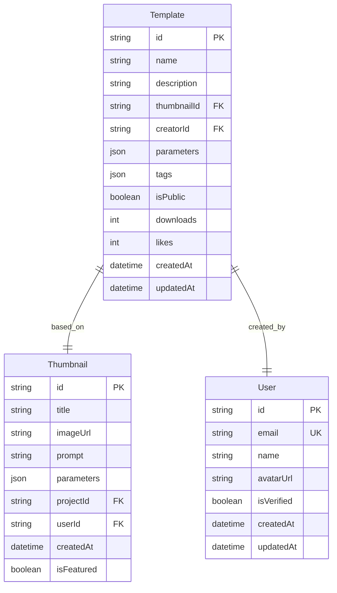
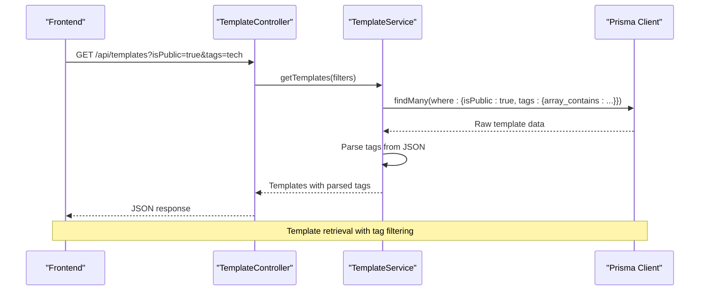
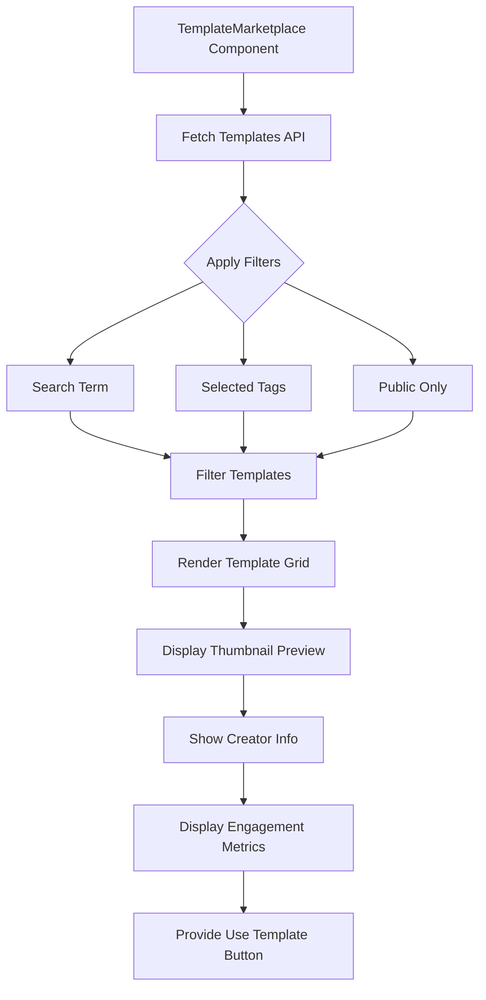

# Template Model

<cite>
**Referenced Files in This Document**   
- [schema.prisma](file://pikzels-clone/prisma/schema.prisma)
- [template.service.ts](file://pikzels-clone/src/modules/templates/template.service.ts)
- [template.controller.ts](file://pikzels-clone/src/modules/templates/template.controller.ts)
- [template.routes.ts](file://pikzels-clone/src/modules/templates/template.routes.ts)
- [TemplateMarketplace.tsx](file://pikzels-clone/client/src/components/templates/TemplateMarketplace.tsx)
</cite>

## Table of Contents
1. [Introduction](#introduction)
2. [Field Definitions](#field-definitions)
3. [Relationships](#relationships)
4. [Indexing Strategy](#indexing-strategy)
5. [Common Queries](#common-queries)
6. [Performance Considerations](#performance-considerations)
7. [Template Marketplace UI Integration](#template-marketplace-ui-integration)
8. [Extension Points](#extension-points)
9. [Conclusion](#conclusion)

## Introduction
The Template model in Thumbnail Maker Studio enables users to save, share, and reuse thumbnail designs through a structured data schema. It supports both private templates and public marketplace distribution, with flexible metadata storage and social engagement features. This document details the model's structure, relationships, indexing strategy, and integration with the application's frontend and backend systems.

**Section sources**
- [schema.prisma](file://pikzels-clone/prisma/schema.prisma#L100-L118)

## Field Definitions
The Template model contains the following fields:

- **id**: Unique UUID identifier for the template
- **name**: Display name of the template
- **description**: Optional textual description of the template's purpose or style
- **thumbnailId**: Foreign key referencing the source Thumbnail design
- **creatorId**: Foreign key linking to the User who created the template
- **parameters**: JSON field storing customizable design parameters for reuse
- **tags**: JSON array containing string tags for categorization and search
- **isPublic**: Boolean flag indicating marketplace visibility
- **downloads**: Counter tracking template usage frequency
- **likes**: Counter for user engagement and popularity
- **createdAt**: Timestamp of template creation
- **updatedAt**: Automatically updated timestamp reflecting last modification

The JSON fields (parameters and tags) provide schema flexibility, allowing dynamic parameter storage and tag-based discovery without requiring database migrations for new attributes.

**Section sources**
- [schema.prisma](file://pikzels-clone/prisma/schema.prisma#L100-L118)

## Relationships
The Template model establishes two primary relationships:

- **Thumbnail (source design)**: Each template is based on an existing thumbnail design, maintaining a reference to its visual structure, prompt, and parameters. This relationship enables template instantiation by copying the referenced design.
- **User (creator)**: Every template is associated with its creator, enabling attribution, ownership management, and creator-based filtering in the marketplace.

These relationships support key use cases such as template attribution in the UI, creator portfolio views, and design inheritance when applying templates to new thumbnails.

**Diagram sources**
- [schema.prisma](file://pikzels-clone/prisma/schema.prisma#L100-L118)
- [schema.prisma](file://pikzels-clone/prisma/schema.prisma#L50-L65)
- [schema.prisma](file://pikzels-clone/prisma/schema.prisma#L10-L25)

**Section sources**
- [schema.prisma](file://pikzels-clone/prisma/schema.prisma#L100-L118)

## Indexing Strategy
The Template model implements three database indexes to optimize marketplace queries:

- **creatorId index**: Accelerates retrieval of templates by specific creators, supporting user portfolio views and ownership filtering
- **thumbnailId index**: Optimizes lookups for templates based on specific thumbnail designs
- **isPublic index**: Enables efficient filtering of public templates for marketplace discovery

These indexes ensure responsive performance for common user interactions such as browsing creator collections, discovering public templates, and searching by tags or keywords.

**Section sources**
- [schema.prisma](file://pikzels-clone/prisma/schema.prisma#L116-L118)

## Common Queries
The Template service provides several common query patterns:

- **Finding public templates**: `GET /api/templates?isPublic=true` retrieves all marketplace-available templates
- **Retrieving templates by creator**: `GET /api/templates?creatorId={userId}` returns templates created by a specific user
- **Searching by tags**: `GET /api/templates?tags=tech,gaming` filters templates containing all specified tags
- **Full-text search**: `GET /api/templates?search=retro` matches templates by name or description
- **Sorting options**: Templates can be sorted by creation date, download count, or likes in ascending or descending order

The service handles JSON parsing for the tags field automatically, converting between database storage and application-ready arrays.

**Diagram sources**
- [template.controller.ts](file://pikzels-clone/src/modules/templates/template.controller.ts#L35-L68)
- [template.service.ts](file://pikzels-clone/src/modules/templates/template.service.ts#L28-L85)

**Section sources**
- [template.service.ts](file://pikzels-clone/src/modules/templates/template.service.ts#L28-L85)
- [template.controller.ts](file://pikzels-clone/src/modules/templates/template.controller.ts#L35-L68)

## Performance Considerations
The Template model addresses several performance aspects:

- **Counter scalability**: The downloads and likes fields use atomic database operations (increment) to prevent race conditions during concurrent access
- **JSON field optimization**: Tags are stored as JSON arrays but indexed for efficient querying using Prisma's array_contains operator
- **Pagination support**: The service implements pagination (default 20 items/page, max 100) to prevent excessive data loading
- **Selective field loading**: Creator information is selectively loaded with only essential fields (id, name, avatarUrl) to minimize payload size

These optimizations ensure the template marketplace remains responsive even as the number of templates and user interactions grows.

**Section sources**
- [template.service.ts](file://pikzels-clone/src/modules/templates/template.service.ts#L87-L105)
- [template.service.ts](file://pikzels-clone/src/modules/templates/template.service.ts#L145-L155)

## Template Marketplace UI Integration
The Template Marketplace UI consumes the Template model through a React component that:

- Displays templates in a responsive grid layout with thumbnail previews
- Implements client-side search and tag filtering
- Shows creator attribution with avatars and names
- Presents engagement metrics (downloads, likes)
- Provides "Use Template" functionality for applying designs

The frontend expects a flattened response structure where JSON fields (tags) are already parsed into arrays, and related entities (thumbnail, creator) are embedded in the response.

**Diagram sources**
- [TemplateMarketplace.tsx](file://pikzels-clone/client/src/components/templates/TemplateMarketplace.tsx#L3-L21)
- [template.controller.ts](file://pikzels-clone/src/modules/templates/template.controller.ts#L35-L68)

**Section sources**
- [TemplateMarketplace.tsx](file://pikzels-clone/client/src/components/templates/TemplateMarketplace.tsx#L3-L21)
- [template.controller.ts](file://pikzels-clone/src/modules/templates/template.controller.ts#L35-L68)

## Extension Points
The Template model supports several potential extensions:

- **Template versioning**: Adding version numbers and changelogs to track template iterations
- **Ratings system**: Implementing a 5-star rating system alongside likes for quality assessment
- **Collections**: Allowing users to group templates into curated collections
- **Usage analytics**: Tracking template application success rates and modification patterns
- **Featured status**: Adding editorial curation with featured template badges

These extensions could be implemented without major schema changes, leveraging the flexible JSON fields and existing relationship structure.

**Section sources**
- [schema.prisma](file://pikzels-clone/prisma/schema.prisma#L100-L118)

## Conclusion
The Template model serves as the foundation for Thumbnail Maker Studio's template marketplace, balancing structured data with flexible JSON storage. Its thoughtful indexing strategy, performance optimizations, and clear relationships enable efficient discovery and reuse of thumbnail designs. The model effectively supports both user-generated content and social engagement features, providing a solid foundation for future marketplace enhancements.