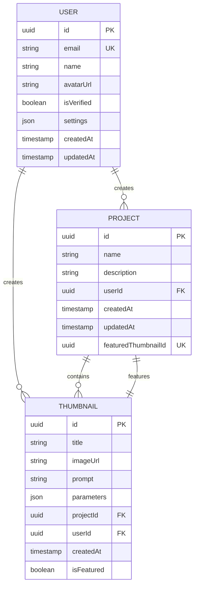

# Thumbnail Model

<cite>
**Referenced Files in This Document**   
- [schema.prisma](file://pikzels-clone/prisma/schema.prisma)
- [thumbnail.service.ts](file://pikzels-clone/src/modules/thumbnail/thumbnail.service.ts)
- [thumbnail.controller.ts](file://pikzels-clone/src/modules/thumbnail/thumbnail.controller.ts)
- [schema.md](file://pikzels-clone/docs/database/schema.md)
</cite>

## Table of Contents
1. [Introduction](#introduction)
2. [Core Fields](#core-fields)
3. [Relationships](#relationships)
4. [JSON Parameters Structure](#json-parameters-structure)
5. [Featured Thumbnail Mechanism](#featured-thumbnail-mechanism)
6. [Common Prisma Queries](#common-prisma-queries)
7. [Performance Considerations](#performance-considerations)
8. [Integration with AI Services](#integration-with-ai-services)
9. [Batch Editing Operations](#batch-editing-operations)
10. [Data Model Diagram](#data-model-diagram)

## Introduction
The Thumbnail model in Thumbnail Maker Studio serves as the central entity for storing and managing generated thumbnails. It captures essential metadata about each thumbnail, maintains relationships with users and projects, and supports advanced features like AI generation parameters and project curation through featured thumbnails. This document provides comprehensive documentation of the model's structure, functionality, and usage patterns.

**Section sources**
- [schema.prisma](file://pikzels-clone/prisma/schema.prisma#L28-L45)
- [schema.md](file://pikzels-clone/docs/database/schema.md#L77-L94)

## Core Fields
The Thumbnail model contains several key fields that define its structure and functionality:

- **id**: Unique UUID identifier for each thumbnail, automatically generated upon creation
- **title**: Descriptive name for the thumbnail, used for display and search purposes
- **imageUrl**: URL pointing to the hosted thumbnail image file
- **prompt**: Text prompt used as input for AI generation services
- **parameters**: JSON field storing AI generation parameters and editing metadata
- **projectId**: Foreign key linking the thumbnail to its parent project
- **userId**: Foreign key linking the thumbnail to its creator
- **createdAt**: Timestamp of thumbnail creation, automatically set
- **isFeatured**: Boolean flag indicating if the thumbnail is featured within its project

The model uses UUIDs for primary keys, ensuring global uniqueness and enhanced security compared to sequential identifiers. The imageUrl field stores direct links to the generated thumbnail assets, enabling efficient retrieval and display.

**Section sources**
- [schema.prisma](file://pikzels-clone/prisma/schema.prisma#L28-L45)

## Relationships
The Thumbnail model establishes bidirectional relationships with both Project and User models:

- **Project Relationship**: Each thumbnail belongs to exactly one project through the projectId foreign key. The Project model maintains a thumbnails collection for all associated thumbnails via the ProjectThumbnails relation. This one-to-many relationship enables organized grouping of thumbnails within projects.

- **User Relationship**: Each thumbnail is owned by exactly one user through the userId foreign key. The User model maintains a thumbnails collection for all thumbnails created by that user. This ownership model supports user-specific operations and access control.

- **Featured Thumbnail Relation**: The model participates in a special FeaturedThumbnail relation with Project through the featuredIn field. This allows a project to designate one of its thumbnails as the featured thumbnail, creating a bidirectional reference between the project and its highlighted content.

These relationships enable complex queries across the data model while maintaining referential integrity through foreign key constraints.

**Section sources**
- [schema.prisma](file://pikzels-clone/prisma/schema.prisma#L28-L45)
- [schema.prisma](file://pikzels-clone/prisma/schema.prisma#L12-L26)

## JSON Parameters Structure
The parameters field uses JSON storage to maintain flexibility for AI generation metadata and editing history. This schema-less approach allows for:

- **AI Generation Parameters**: Storage of style preferences, variation settings, and AI model configurations used during thumbnail creation
- **Editing Metadata**: Tracking of applied filters, transformations, and layer adjustments
- **Processing Information**: Recording of image processing operations and enhancement types
- **Sharing Configuration**: Storage of share tokens and expiration dates for collaborative access

The JSON format enables the application to evolve its feature set without requiring database schema migrations for new parameter types. This is particularly valuable for AI-related features where parameter requirements may change frequently.

**Section sources**
- [schema.prisma](file://pikzels-clone/prisma/schema.prisma#L34)
- [thumbnail.service.ts](file://pikzels-clone/src/modules/thumbnail/thumbnail.service.ts#L10-L15)

## Featured Thumbnail Mechanism
The isFeatured flag and bidirectional relationships enable a robust project curation system:

- **isFeatured Flag**: A boolean field on the Thumbnail model that indicates whether a thumbnail is designated as featured within its project context
- **ProjectThumbnails Relation**: The primary relationship that connects all thumbnails to their parent project
- **FeaturedThumbnail Relation**: A specialized relation that allows a Project to reference its featured thumbnail through the featuredThumbnailId field

This dual-relation approach ensures data consistency while enabling efficient queries for featured content. When a thumbnail is set as featured, the system updates the project's featuredThumbnailId field to point to the selected thumbnail. This design prevents multiple thumbnails from being simultaneously featured within the same project due to the unique constraint on featuredThumbnailId.

**Section sources**
- [schema.prisma](file://pikzels-clone/prisma/schema.prisma#L39)
- [schema.prisma](file://pikzels-clone/prisma/schema.prisma#L18-L20)
- [thumbnail.service.ts](file://pikzels-clone/src/modules/thumbnail/thumbnail.service.ts#L118-L135)

## Common Prisma Queries
The Thumbnail model supports various query patterns for different use cases:

- **Fetch thumbnails by project**: 
```prisma
prisma.thumbnail.findMany({
  where: { projectId: 'project-id' },
  include: { project: true }
})
```

- **Filter thumbnails by user**: 
```prisma
prisma.thumbnail.findMany({
  where: { userId: 'user-id' },
  orderBy: { createdAt: 'desc' }
})
```

- **Find featured thumbnails**: 
```prisma
prisma.project.findMany({
  where: { featuredThumbnailId: { not: null } },
  include: { featuredThumbnail: true }
})
```

- **Search thumbnails by prompt or title**: 
```prisma
prisma.thumbnail.findMany({
  where: {
    userId: 'user-id',
    OR: [
      { title: { contains: 'search-term', mode: 'insensitive' } },
      { prompt: { contains: 'search-term', mode: 'insensitive' } }
    ]
  }
})
```

These queries leverage the model's relationships and indexing strategy for optimal performance.

**Section sources**
- [thumbnail.service.ts](file://pikzels-clone/src/modules/thumbnail/thumbnail.service.ts#L41-L99)
- [thumbnail.controller.ts](file://pikzels-clone/src/modules/thumbnail/thumbnail.controller.ts#L55-L77)

## Performance Considerations
The model design incorporates several performance optimizations:

- **Indexing Strategy**: Database indexes on projectId and userId fields enable fast lookups for project-based and user-based queries
- **Image Optimization**: The imageUrl field stores references to optimized thumbnail assets rather than binary data, reducing database load
- **Selective Field Loading**: Applications can use Prisma's select option to retrieve only needed fields, minimizing data transfer
- **Batch Operations**: Support for batch creation and updates through Prisma's createMany and updateMany methods
- **Caching Opportunities**: The immutable nature of many thumbnail fields (id, createdAt, prompt) makes them suitable for caching

For high-volume thumbnail generation scenarios, the system can implement additional optimizations such as connection pooling, query batching, and read replicas to handle increased load.

**Section sources**
- [schema.prisma](file://pikzels-clone/prisma/schema.prisma#L20-L21)
- [schema.prisma](file://pikzels-clone/prisma/schema.prisma#L40-L41)

## Integration with AI Services
The Thumbnail model is designed to seamlessly integrate with AI generation services:

- **Prompt Storage**: The prompt field preserves the exact text input used for AI generation, enabling reproducibility
- **Parameters Flexibility**: The JSON parameters field accommodates various AI model configurations and style options
- **Generation Metadata**: The model tracks AI-generated status, variation numbers, and any error information from the generation process
- **Enhancement Tracking**: Records of AI-powered enhancements (style transfer, image enhancement) are stored in the parameters field

When AI services generate thumbnails, the system creates Thumbnail records with appropriate metadata, allowing users to understand how each thumbnail was created and enabling potential regeneration with similar parameters.

**Section sources**
- [thumbnail.service.ts](file://pikzels-clone/src/modules/thumbnail/thumbnail.service.ts#L78-L116)
- [thumbnail.controller.ts](file://pikzels-clone/src/modules/thumbnail/thumbnail.controller.ts#L189-L258)

## Batch Editing Operations
The model supports batch editing through several mechanisms:

- **Parameters Field**: The JSON structure allows storage of batch operation metadata, including applied edits and processing history
- **Efficient Updates**: Prisma's updateMany method enables bulk modifications to multiple thumbnails
- **Transaction Support**: Database transactions ensure consistency when applying batch operations across multiple thumbnails
- **History Preservation**: The model can maintain edit history within the parameters field, supporting undo/redo functionality

Batch operations leverage the uniform structure of thumbnail records while preserving individual customization through the flexible parameters field.

**Section sources**
- [thumbnail.service.ts](file://pikzels-clone/src/modules/thumbnail/thumbnail.service.ts#L91-L100)
- [thumbnail.controller.ts](file://pikzels-clone/src/modules/thumbnail/thumbnail.controller.ts#L390-L418)

## Data Model Diagram


**Diagram sources**
- [schema.prisma](file://pikzels-clone/prisma/schema.prisma#L28-L45)
- [schema.prisma](file://pikzels-clone/prisma/schema.prisma#L12-L26)
- [schema.prisma](file://pikzels-clone/prisma/schema.prisma#L47-L64)

**Section sources**
- [schema.prisma](file://pikzels-clone/prisma/schema.prisma#L12-L64)