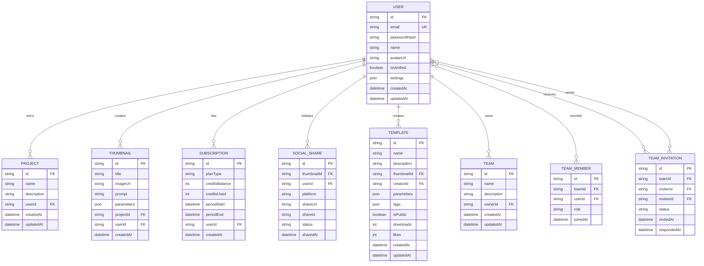
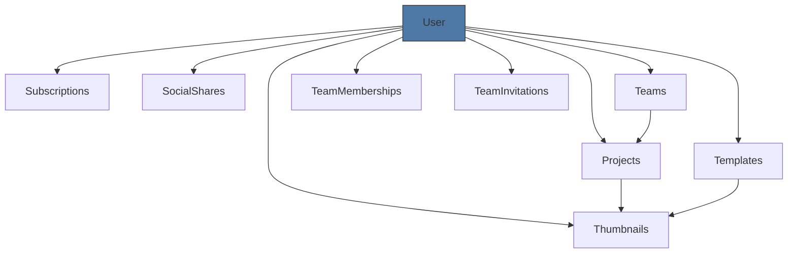

# User Model

<cite>
**Referenced Files in This Document**   
- [schema.prisma](file://pikzels-clone/prisma/schema.prisma)
- [migration.sql](file://pikzels-clone/prisma/migrations/20250829072650_init/migration.sql)
- [add_user_settings/migration.sql](file://pikzels-clone/prisma/migrations/20250909081634_add_user_settings/migration.sql)
- [auth.service.ts](file://pikzels-clone/shared/auth.service.ts)
- [AuthContext.tsx](file://pikzels-clone/client/src/contexts/AuthContext.tsx)
</cite>

## Table of Contents
1. [Introduction](#introduction)
2. [Field Definitions](#field-definitions)
3. [Relationships](#relationships)
4. [Data Integrity and Indexing](#data-integrity-and-indexing)
5. [Common Prisma Queries](#common-prisma-queries)
6. [Security Considerations](#security-considerations)
7. [Extensibility and Future Enhancements](#extensibility-and-future-enhancements)
8. [Architecture Overview](#architecture-overview)

## Introduction
The User model in Thumbnail Maker Studio serves as the central identity entity for the application, managing user accounts, authentication, preferences, and ownership of various resources. Built using Prisma ORM with SQLite as the underlying database, the model is designed for scalability, security, and flexibility. It supports core features such as user authentication, project management, team collaboration, and social sharing. The model leverages UUIDs for secure identification, automatic timestamp management, and a JSON field for extensible user settings.

**Section sources**
- [schema.prisma](file://pikzels-clone/prisma/schema.prisma#L1-L20)

## Field Definitions
The User model contains the following fields:

- **id (String)**: Primary key using UUID format for enhanced security and distributed system compatibility. Automatically generated via `@default(uuid())`.
- **email (String)**: Unique identifier for login. Enforced uniqueness at the database level with `@unique` attribute.
- **passwordHash (String)**: Stores bcrypt-hashed passwords. Never stored or transmitted in plaintext.
- **name (String?)**: Optional full name for display purposes.
- **avatarUrl (String?)**: Optional URL to user's profile image.
- **isVerified (Boolean)**: Indicates email verification status. Defaults to `false` via `@default(false)`.
- **settings (Json?)**: Flexible JSON field for storing user preferences (e.g., UI themes, default templates, notification settings). Added in a later migration to support evolving requirements.
- **createdAt (DateTime)**: Timestamp of record creation. Automatically set to current time via `@default(now())`.
- **updatedAt (DateTime)**: Automatically updated on every modification via `@updatedAt` directive.

The `settings` field enables schema flexibility without requiring frequent migrations, allowing dynamic storage of user-specific configurations.

**Section sources**
- [schema.prisma](file://pikzels-clone/prisma/schema.prisma#L3-L14)
- [migration.sql](file://pikzels-clone/prisma/migrations/20250909081634_add_user_settings/migration.sql#L1-L1)

## Relationships
The User model maintains the following relationships:

### One-to-Many Relationships
- **projects**: Collection of projects owned by the user.
- **thumbnails**: All thumbnails created by the user.
- **subscriptions**: Subscription history and current plan.
- **socialShares**: Record of social media shares initiated by the user.
- **templates**: Templates created by the user for the marketplace.

### Team Ownership and Membership
- **ownedTeams**: Teams where the user is the owner.
- **teamMemberships**: Membership records in teams via the TeamMember join model.
- **teamInvitations**: Invitations received by the user.
- **sentInvitations**: Invitations sent by the user.

These relationships support collaborative workflows while maintaining clear ownership and access control.

**Section sources**
- [schema.prisma](file://pikzels-clone/prisma/schema.prisma#L15-L30)

## Data Integrity and Indexing
The model enforces data integrity through several mechanisms:

- **Unique Constraint**: Email field is indexed with a unique constraint to prevent duplicate accounts.
- **Foreign Key Constraints**: All related models (Project, Thumbnail, etc.) reference the User ID with RESTRICT on DELETE, ensuring referential integrity.
- **Automatic Indexing**: Prisma automatically creates indexes for foreign key fields (e.g., `userId` in Project).
- **UUID Primary Key**: Provides better distribution and security compared to auto-incrementing integers.

The email uniqueness is implemented via a database-level index, ensuring fast lookups during authentication.



**Diagram sources**
- [schema.prisma](file://pikzels-clone/prisma/schema.prisma#L1-L80)

## Common Prisma Queries
Typical operations on the User model include:

- **Find user by email**:
```prisma
prisma.user.findUnique({ where: { email: 'user@example.com' } })
```

- **Retrieve user with projects and thumbnails**:
```prisma
prisma.user.findUnique({
  where: { id: 'user-id' },
  include: { projects: true, thumbnails: true }
})
```

- **Check verification status**:
```prisma
prisma.user.findUnique({
  where: { id: 'user-id' },
  select: { isVerified: true }
})
```

- **Update user settings**:
```prisma
prisma.user.update({
  where: { id: 'user-id' },
  data: { settings: { theme: 'dark', notifications: true } }
})
```

These queries leverage Prisma's type-safe API and relation loading capabilities.

**Section sources**
- [schema.prisma](file://pikzels-clone/prisma/schema.prisma#L1-L30)

## Security Considerations
The model incorporates several security best practices:

- **Password Security**: `passwordHash` stores only hashed values using bcrypt (handled in service layer).
- **Data Omission**: Prisma client can be configured to omit sensitive fields like `passwordHash` by default.
- **Email Verification**: `isVerified` flag prevents unverified accounts from accessing premium features.
- **UUIDs**: Prevents enumeration attacks compared to sequential IDs.
- **Timestamps**: Track account creation and last update for audit and anomaly detection.

The `settings` JSON field should be validated in the application layer to prevent injection of malicious content.

**Section sources**
- [schema.prisma](file://pikzels-clone/prisma/schema.prisma#L1-L14)
- [auth.service.ts](file://pikzels-clone/shared/auth.service.ts#L1-L6)

## Extensibility and Future Enhancements
The model is designed for future growth:

- **JSON Settings Field**: Allows adding new preferences without schema changes.
- **Team Collaboration**: Built-in support for team-based workflows via Team and TeamMember models.
- **Template Marketplace**: User-generated templates can be extended with ratings, comments, or monetization.
- **Social Sharing Analytics**: `engagement` field in SocialShare can store platform-specific metrics.

Future enhancements could include:
- Multi-factor authentication (add `mfaEnabled` boolean)
- OAuth provider links (new model: UserProvider)
- Activity logging (new model: UserActivity)

Performance can be maintained by indexing frequently queried fields and using connection pooling.

**Section sources**
- [schema.prisma](file://pikzels-clone/prisma/schema.prisma#L1-L30)
- [add_user_settings/migration.sql](file://pikzels-clone/prisma/migrations/20250909081634_add_user_settings/migration.sql#L1-L1)

## Architecture Overview
The User model sits at the center of the application's data model, serving as the identity anchor for all user-generated content and interactions. It integrates with authentication services, project management, team collaboration, and social sharing features. The use of UUIDs, automatic timestamps, and flexible JSON storage ensures the model remains secure, auditable, and adaptable to future requirements.



**Diagram sources**
- [schema.prisma](file://pikzels-clone/prisma/schema.prisma#L1-L80)
- [AuthContext.tsx](file://pikzels-clone/client/src/contexts/AuthContext.tsx#L9-L13)