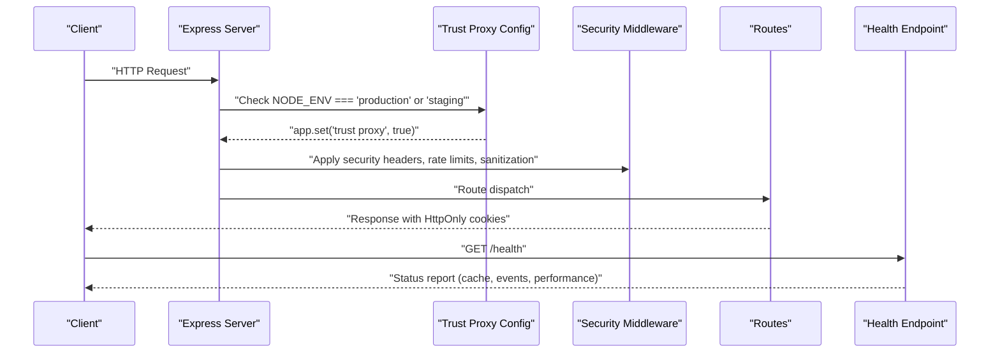
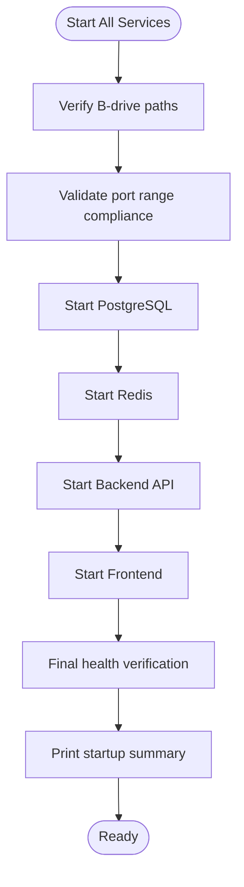
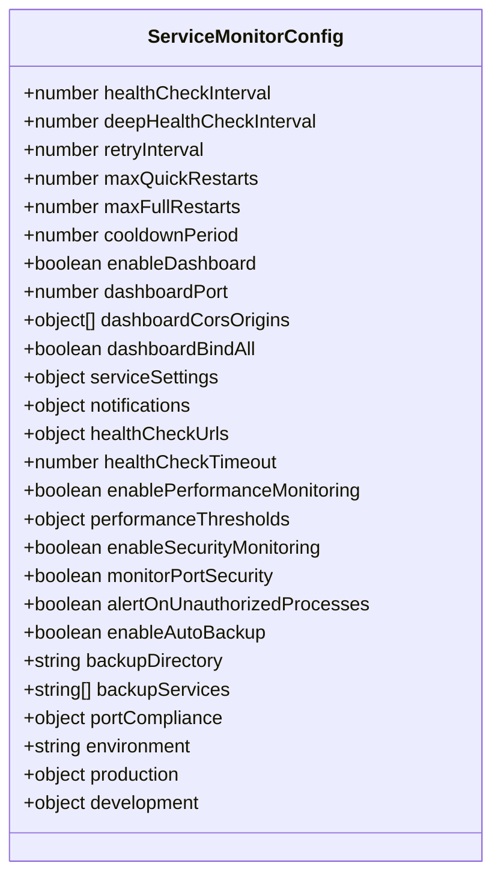
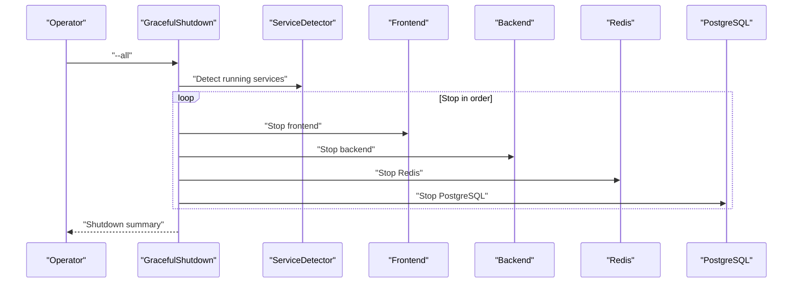
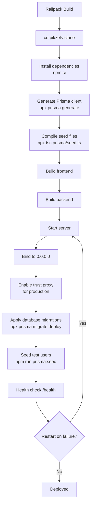

# Deployment Infrastructure

<cite>
**Referenced Files in This Document**
- [DEPLOYMENT_SETUP.md](file://DEPLOYMENT_SETUP.md)
- [railway.json](file://railway.json)
- [railway.json](file://pikzels-clone/railway.json)
- [.env.example](file://pikzels-clone/.env.example)
- [package.json](file://package.json)
- [package.json](file://pikzels-clone/package.json)
- [server.ts](file://pikzels-clone/src/server.ts)
- [security.middleware.ts](file://pikzels-clone/src/middleware/security.middleware.ts)
- [service-monitor.config.js](file://pikzels-clone/service-monitor.config.js)
- [validate-ports.js](file://pikzels-clone/validate-ports.js)
- [start-all-services.js](file://pikzels-clone/start-all-services.js)
- [graceful-shutdown.js](file://pikzels-clone/graceful-shutdown.js)
- [schema.prisma](file://pikzels-clone/prisma/schema.prisma)
- [.railwayignore](file://pikzels-clone/.railwayignore)
- [CHANGES_APPLIED.md](file://pikzels-clone/CHANGES_APPLIED.md)
- [seed.ts](file://pikzels-clone/prisma/seed.ts)
- [start.sh](file://pikzels-clone/start.sh)
- [TEST_USER_IMPLEMENTATION.md](file://pikzels-clone/TEST_USER_IMPLEMENTATION.md)
- [TEST_USER_SETUP_GUIDE.md](file://pikzels-clone/TEST_USER_SETUP_GUIDE.md)
- [TEST_USERS_SECURITY.md](file://pikzels-clone/TEST_USERS_SECURITY.md)
- [create-test-users.ts](file://pikzels-clone/create-test-users.ts)
- [setup-all-test-users.ts](file://pikzels-clone/setup-all-test-users.ts)
- [remove-test-users.ts](file://pikzels-clone/remove-test-users.ts)
- [verify-test-users.ts](file://pikzels-clone/verify-test-users.ts)
- [security-scan.js](file://pikzels-clone/scripts/security-scan.js)
- [run-security-tests.js](file://pikzels-clone/scripts/run-security-tests.js)
- [git-security-scan.js](file://pikzels-clone/scripts/git-security-scan.js)
- [.secretlintrc.json](file://pikzels-clone/.secretlintrc.json)
- [.secretlintignore](file://pikzels-clone/.secretlintignore)
- [netlify.toml](file://pikzels-clone/client/netlify.toml)
- [netlify.toml](file://pikzels-clone/.netlify/netlify.toml)
- [api.ts](file://pikzels-clone/client/src/utils/api.ts)
- [environment.ts](file://pikzels-clone/client/src/config/environment.ts)
- [auth.controller.ts](file://pikzels-clone/src/modules/auth/auth.controller.ts)
- [vite.config.ts](file://pikzels-clone/client/vite.config.ts)
- [cache.service.ts](file://pikzels-clone/src/services/cache.service.ts)
- [staging-environment-setup.md](file://pikzels-clone/docs/staging-environment-setup.md)
- [env.ts](file://pikzels-clone/src/utils/env.ts)
- [security.config.ts](file://pikzels-clone/src/config/security.config.ts)
- [TESTING_PRODUCTION_FEATURES.md](file://pikzels-clone/TESTING_PRODUCTION_FEATURES.md)
</cite>

## Update Summary
**Changes Made**
- Added comprehensive environment-specific API URL configuration for Netlify deployment contexts
- Enhanced production, deploy-preview, and branch-deploy configurations with VITE_API_URL variables
- Implemented environment-aware API endpoint management for different deployment scenarios
- Updated frontend environment detection to support Netlify deployment contexts
- Enhanced security validation for production deployments with proper API URL configuration
- Improved frontend-backend communication with environment-specific API endpoints

## Table of Contents
1. [Introduction](#introduction)
2. [Project Structure](#project-structure)
3. [Core Components](#core-components)
4. [Architecture Overview](#architecture-overview)
5. [Detailed Component Analysis](#detailed-component-analysis)
6. [Dependency Analysis](#dependency-analysis)
7. [Performance Considerations](#performance considerations)
8. [Troubleshooting Guide](#troubleshooting-guide)
9. [Conclusion](#conclusion)

## Introduction
This document describes the deployment infrastructure for the Thumbnail Maker project. It covers environment setup, service orchestration, configuration management, and operational tooling for both local development and production deployments. The system uses a monorepo layout with a Node.js/Express backend, a React/Vite frontend, PostgreSQL, and Redis, coordinated by custom scripts and configuration files.

**Updated** The deployment infrastructure now includes comprehensive environment-specific API URL configuration for Netlify deployment contexts, with enhanced production, deploy-preview, and branch-deploy configurations using VITE_API_URL variables for environment-aware API endpoint management. The system provides production-ready deployment with deterministic builds, automatic database management, comprehensive monitoring capabilities, and robust environment detection for multiple hosting platforms.

## Project Structure
The deployment infrastructure spans several key areas:
- Root deployment guide and environment templates
- Backend server with Express, middleware, and route registration
- Frontend built with Vite and served statically in production
- Database and caching services (PostgreSQL and Redis) managed via scripts
- Monitoring and service orchestration utilities
- Production deployment configuration for Railway using Railpack builder with Prisma integration and enhanced build reliability
- Comprehensive test user management system with automated seeding
- Integrated security scanning and secret detection capabilities
- **New** Environment-specific API URL configuration for Netlify deployment contexts
- **New** Enhanced production, deploy-preview, and branch-deploy configurations with VITE_API_URL variables
- **New** Environment-aware API endpoint management for different deployment scenarios
- **New** Enhanced frontend environment detection supporting multiple hosting platforms
- **New** Improved security validation for production deployments with proper API URL configuration
- **New** Enhanced frontend-backend communication with environment-specific API endpoints

```mermaid
graph TB
subgraph "Root Deployment"
DS["Deployment Setup<br/>DEPLOYMENT_SETUP.md"]
ENV[".env.example"]
PKG["Root package.json"]
RAIL1["Railway Config<br/>railway.json (root)"]
END
subgraph "Backend"
SRV["Express Server<br/>server.ts"]
SEC["Security Middleware<br/>security.middleware.ts"]
RAIL2["Railway Config<br/>railway.json (pikzels-clone)"]
PKG2["Backend package.json"]
PRISMA["Prisma Schema<br/>schema.prisma"]
SEED["Test User Seed<br/>prisma/seed.ts"]
AUTH["Auth Controller<br/>auth.controller.ts"]
START["Startup Script<br/>start.sh"]
CACHE["Cache Service<br/>cache.service.ts"]
ENVUTILS["Environment Utils<br/>env.ts"]
SECURITYCFG["Security Config<br/>security.config.ts"]
END
subgraph "Frontend"
VITE["Vite Build & Dev"]
API["API Utility<br/>api.ts"]
ENVCFG["Environment Config<br/>environment.ts"]
NETLIFY["Netlify Config<br/>client/netlify.toml"]
END
subgraph "Infrastructure"
PG["PostgreSQL"]
RD["Redis"]
END
subgraph "Security & Testing"
SECSCAN["Security Scanner<br/>security-scan.js"]
GITSCAN["Git Security Scan<br/>git-security-scan.js"]
RUNSEC["Security Tests<br/>run-security-tests.js"]
SECRET["Secret Linting<br/>.secretlintrc.json"]
END
subgraph "Railway Deployment"
RAIL1["Root Railway Config<br/>cd pikzels-clone"]
RAIL2["Subdir Railway Config<br/>npm run build"]
PACK["Railpack Builder<br/>Optimized Builds"]
MIGRATE["Prisma Migrations<br/>Automatic Deployment"]
SEED["Test User Seed<br/>TypeScript Compilation"]
TP["Trust Proxy<br/>Production HTTPS"]
HC["Health Check<br/>Enhanced Monitoring"]
END
subgraph "Netlify Deployment"
NETLIFYCFG["Netlify Config<br/>client/netlify.toml"]
PRODCTX["Production Context<br/>VITE_API_URL=https://...production.up.railway.app"]
PREVIEWCTX["Deploy Preview Context<br/>VITE_ENV=preview"]
BRANCHCTX["Branch Deploy Context<br/>VITE_API_URL=https://...staging.up.railway.app"]
ENVDETECT["Environment Detection<br/>detectEnvironment()"]
APIVALIDATE["API Validation<br/>validateProductionConfig()"]
END
subgraph "Staging Environment"
STAGECFG["Staging Config<br/>staging-environment-setup.md"]
STAGEENV["Staging Environment<br/>NODE_ENV=staging"]
STAGETEST["Staging Test Users<br/>SEED_TEST_USERS=true"]
END
DS --> SRV
ENV --> SRV
PKG --> SRV
RAIL1 --> SRV
RAIL2 --> SRV
SRV --> PG
SRV --> RD
SRV --> VITE
PKG2 --> SRV
PRISMA --> SRV
SEC --> SRV
SEED --> PRISMA
SECSCAN --> SRV
GITSCAN --> SRV
RUNSEC --> SRV
SECRET --> SRV
AUTH --> SRV
API --> SRV
ENVCFG --> API
NETLIFY --> API
START --> SRV
CACHE --> SRV
ENVUTILS --> SRV
SECURITYCFG --> SRV
STAGECFG --> SRV
STAGEENV --> SRV
STAGETEST --> SRV
NETLIFYCFG --> ENVDETECT
ENVDETECT --> APIVALIDATE
APIVALIDATE --> API
```

**Diagram sources**
- [DEPLOYMENT_SETUP.md:1-143](file://DEPLOYMENT_SETUP.md#L1-L143)
- [server.ts:1-468](file://pikzels-clone/src/server.ts#L1-L468)
- [security.middleware.ts:1-410](file://pikzels-clone/src/middleware/security.middleware.ts#L1-L410)
- [railway.json:1-15](file://railway.json#L1-L15)
- [railway.json:1-16](file://pikzels-clone/railway.json#L1-L16)
- [package.json:1-209](file://package.json#L1-L209)
- [schema.prisma:1-292](file://pikzels-clone/prisma/schema.prisma#L1-L292)
- [seed.ts:1-338](file://pikzels-clone/prisma/seed.ts#L1-L338)
- [security-scan.js:1-473](file://pikzels-clone/scripts/security-scan.js#L1-L473)
- [git-security-scan.js:1-936](file://pikzels-clone/scripts/git-security-scan.js#L1-L936)
- [run-security-tests.js:1-1035](file://pikzels-clone/scripts/run-security-tests.js#L1-L1035)
- [.secretlintrc.json:1-34](file://pikzels-clone/.secretlintrc.json#L1-L34)
- [auth.controller.ts:1-201](file://pikzels-clone/src/modules/auth/auth.controller.ts#L1-L201)
- [api.ts:1-185](file://pikzels-clone/client/src/utils/api.ts#L1-L185)
- [environment.ts:1-163](file://pikzels-clone/client/src/config/environment.ts#L1-L163)
- [netlify.toml:1-52](file://pikzels-clone/client/netlify.toml#L1-L52)
- [start.sh:1-6](file://pikzels-clone/start.sh#L1-L6)
- [cache.service.ts:1-352](file://pikzels-clone/src/services/cache.service.ts#L1-L352)
- [staging-environment-setup.md:1-270](file://pikzels-clone/docs/staging-environment-setup.md#L1-L270)
- [env.ts:1-37](file://pikzels-clone/src/utils/env.ts#L1-L37)
- [security.config.ts:1-244](file://pikzels-clone/src/config/security.config.ts#L1-L244)

**Section sources**
- [DEPLOYMENT_SETUP.md:1-143](file://DEPLOYMENT_SETUP.md#L1-L143)
- [server.ts:1-468](file://pikzels-clone/src/server.ts#L1-L468)
- [security.middleware.ts:1-410](file://pikzels-clone/src/middleware/security.middleware.ts#L1-L410)
- [railway.json:1-15](file://railway.json#L1-L15)
- [railway.json:1-16](file://pikzels-clone/railway.json#L1-L16)
- [package.json:1-209](file://package.json#L1-L209)

## Core Components
- Environment configuration: Centralized via .env.example with security, CORS, rate limiting, and API keys.
- Backend server: Express app with security middleware, performance monitoring, CORS, compression, rate limiting, and health checks.
- Trust proxy configuration: Conditional proxy trust setting for production deployments on platforms like Railway.
- Service orchestration: Scripts for unified startup, port validation, and graceful shutdown.
- Monitoring: Configurable service monitor with dashboard and alerting.
- Production deployment: Railway configuration using Railpack builder with Prisma integration for simplified builds, automatic database migrations, and enhanced reliability.
- **New** Environment-specific API URL configuration: Comprehensive VITE_API_URL configuration for Netlify deployment contexts with production, deploy-preview, and branch-deploy specific settings.
- **New** Enhanced frontend environment detection: Multi-platform environment detection supporting Netlify, Vercel, Cloudflare Pages, and generic production builds.
- **New** API validation system: Production deployment validation ensuring proper API URL configuration to prevent localhost URL usage in production.
- **New** Environment-aware API endpoint management: Dynamic API base URL resolution based on deployment context and environment variables.
- **New** Enhanced security validation: Frontend security failsafe preventing production deployments with localhost URLs.
- **New** Multi-context deployment support: Separate API endpoints for production, preview, and staging environments.
- **New** Improved frontend-backend communication: Environment-specific API configuration with proper credential handling and cross-origin support.
- **New** Staging environment support: Comprehensive staging environment with NODE_ENV=staging configuration, production-like security, and separate infrastructure.
- **New** Environment detection utilities: Centralized environment detection treating staging as production-like for consistent security and behavior.
- **New** Staging configuration files: Separate configuration files and operational runbooks for staging environment management.
- **New** Test user management: Automated test user seeding with staging environment awareness and production safety controls.
- **New** Security configuration: Enhanced security settings supporting staging environment with strict production-like security measures.
- **New** Staging promotion workflow: Automated workflow for promoting from staging to production with proper environment handling.
- **New** Staging-specific operational runbooks: Comprehensive documentation for staging environment setup, configuration, and management.
- **Updated** Client-side authentication: Direct API access with cookie-based authentication using HttpOnly cookies and proper credential handling.

**Updated** The deployment infrastructure now includes comprehensive environment-specific API URL configuration for Netlify deployment contexts, with enhanced production, deploy-preview, and branch-deploy configurations using VITE_API_URL variables. The system provides production-ready deployment with deterministic builds, automatic database migrations, comprehensive health checks, and robust environment detection for multiple hosting platforms.

**Section sources**
- [.env.example:1-256](file://pikzels-clone/.env.example#L1-L256)
- [server.ts:76-79](file://pikzels-clone/src/server.ts#L76-L79)
- [security.middleware.ts:308-317](file://pikzels-clone/src/middleware/security.middleware.ts#L308-L317)
- [service-monitor.config.js:1-225](file://pikzels-clone/service-monitor.config.js#L1-L225)
- [validate-ports.js:1-86](file://pikzels-clone/validate-ports.js#L1-L86)
- [start-all-services.js:1-762](file://pikzels-clone/start-all-services.js#L1-L762)
- [graceful-shutdown.js:1-413](file://pikzels-clone/graceful-shutdown.js#L1-L413)
- [railway.json:1-15](file://railway.json#L1-L15)
- [railway.json:1-16](file://pikzels-clone/railway.json#L1-L16)
- [seed.ts:1-338](file://pikzels-clone/prisma/seed.ts#L1-L338)
- [start.sh:1-6](file://pikzels-clone/start.sh#L1-L6)
- [security-scan.js:1-473](file://pikzels-clone/scripts/security-scan.js#L1-L473)
- [run-security-tests.js:1-1035](file://pikzels-clone/scripts/run-security-tests.js#L1-L1035)
- [api.ts:1-185](file://pikzels-clone/client/src/utils/api.ts#L1-L185)
- [environment.ts:1-163](file://pikzels-clone/client/src/config/environment.ts#L1-L163)
- [auth.controller.ts:1-201](file://pikzels-clone/src/modules/auth/auth.controller.ts#L1-L201)
- [cache.service.ts:276-290](file://pikzels-clone/src/services/cache.service.ts#L276-L290)
- [staging-environment-setup.md:1-270](file://pikzels-clone/docs/staging-environment-setup.md#L1-L270)
- [env.ts:1-37](file://pikzels-clone/src/utils/env.ts#L1-L37)
- [security.config.ts:1-244](file://pikzels-clone/src/config/security.config.ts#L1-L244)

## Architecture Overview
The deployment architecture integrates the backend, frontend, infrastructure services, and comprehensive security tooling with enhanced Railway deployment support, staging environment management, improved client-side authentication, and environment-specific API URL configuration for Netlify deployment contexts:

```mermaid
graph TB
Client["Browser/App"]
FE["Frontend (Vite)<br/>localhost:8556"]
BE["Backend (Express)<br/>localhost:8550"]
DB["PostgreSQL<br/>localhost:8565"]
CACHE["Redis<br/>localhost:8520"]
Client --> FE
FE --> BE
BE --> DB
BE --> CACHE
subgraph "Operations"
MON["Service Monitor<br/>Dashboard 8578"]
ORCH["Unified Startup<br/>start-all-services.js"]
SHUT["Graceful Shutdown<br/>graceful-shutdown.js"]
PORT["Port Validator<br/>validate-ports.js"]
START["Startup Script<br/>start.sh"]
END
MON --> BE
MON --> FE
MON --> DB
MON --> CACHE
ORCH --> DB
ORCH --> CACHE
ORCH --> BE
ORCH --> FE
SHUT --> BE
SHUT --> FE
SHUT --> CACHE
SHUT --> DB
PORT --> BE
PORT --> FE
START --> BE
START --> CACHE
subgraph "Railway Deployment"
RAIL1["Railway Config<br/>root: cd pikzels-clone"]
RAIL2["Railway Config<br/>subdir: npm run build"]
PACK["Railpack Builder<br/>Optimized Builds"]
MIGRATE["Prisma Migrations<br/>Automatic Deployment"]
SEED["Test User Seed<br/>TypeScript Compilation"]
TP["Trust Proxy<br/>Production HTTPS"]
HC["Health Check<br/>Enhanced Monitoring"]
END
BE --> RAIL1
BE --> RAIL2
RAIL1 --> PACK
RAIL2 --> PACK
PACK --> MIGRATE
PACK --> SEED
PACK --> TP
PACK --> HC
subgraph "Security Layer"
SECSCAN["Security Scanner<br/>security-scan.js"]
GITSCAN["Git Security Scan<br/>git-security-scan.js"]
RUNSEC["Security Tests<br/>run-security-tests.js"]
SECRET["Secret Linting<br/>.secretlintrc.json"]
END
BE --> SECSCAN
BE --> GITSCAN
BE --> RUNSEC
BE --> SECRET
subgraph "Client Authentication"
AUTHAPI["Auth API Utility<br/>api.ts"]
ENVCFG["Environment Config<br/>environment.ts"]
COOKIE["HttpOnly Cookies<br/>Cross-Origin Support"]
NETLIFYCFG["Netlify Config<br/>client/netlify.toml"]
END
FE --> AUTHAPI
AUTHAPI --> BE
ENVCFG --> AUTHAPI
COOKIE --> AUTHAPI
NETLIFYCFG --> FE
subgraph "Environment Detection"
ENVDETECT["detectEnvironment()<br/>Multi-platform detection"]
APIVALIDATE["validateProductionConfig()<br/>Production safety checks"]
VITEAPI["VITE_API_URL<br/>Environment-specific API URLs"]
END
FE --> ENVDETECT
ENVDETECT --> APIVALIDATE
APIVALIDATE --> VITEAPI
VITEAPI --> AUTHAPI
subgraph "Netlify Deployment Contexts"
PRODCTX["Production Context<br/>VITE_API_URL=production endpoint"]
PREVIEWCTX["Deploy Preview Context<br/>VITE_ENV=preview"]
BRANCHCTX["Branch Deploy Context<br/>VITE_API_URL=staging endpoint"]
END
NETLIFYCFG --> PRODCTX
NETLIFYCFG --> PREVIEWCTX
NETLIFYCFG --> BRANCHCTX
ENVDETECT --> PRODCTX
ENVDETECT --> PREVIEWCTX
ENVDETECT --> BRANCHCTX
subgraph "Staging Environment"
STAGECFG["Staging Config<br/>staging-environment-setup.md"]
STAGEENV["NODE_ENV=staging<br/>Production-like Security"]
STAGETEST["Test Users<br/>SEED_TEST_USERS=true"]
PROMOTE["Promotion Workflow<br/>staging → production"]
END
BE --> STAGECFG
BE --> STAGEENV
BE --> STAGETEST
BE --> PROMOTE
```

**Diagram sources**
- [server.ts:76-120](file://pikzels-clone/src/server.ts#L76-L120)
- [service-monitor.config.js:46-102](file://pikzels-clone/service-monitor.config.js#L46-L102)
- [start-all-services.js:34-101](file://pikzels-clone/start-all-services.js#L34-L101)
- [graceful-shutdown.js:17-26](file://pikzels-clone/graceful-shutdown.js#L17-L26)
- [validate-ports.js:11-18](file://pikzels-clone/validate-ports.js#L11-L18)
- [railway.json:3-6](file://railway.json#L3-L6)
- [railway.json:3-6](file://pikzels-clone/railway.json#L3-L6)
- [security-scan.js:1-473](file://pikzels-clone/scripts/security-scan.js#L1-L473)
- [git-security-scan.js:1-936](file://pikzels-clone/scripts/git-security-scan.js#L1-L936)
- [run-security-tests.js:1-1035](file://pikzels-clone/scripts/run-security-tests.js#L1-L1035)
- [.secretlintrc.json:1-34](file://pikzels-clone/.secretlintrc.json#L1-L34)
- [api.ts:1-185](file://pikzels-clone/client/src/utils/api.ts#L1-L185)
- [environment.ts:1-163](file://pikzels-clone/client/src/config/environment.ts#L1-L163)
- [auth.controller.ts:1-201](file://pikzels-clone/src/modules/auth/auth.controller.ts#L1-L201)
- [netlify.toml:1-52](file://pikzels-clone/client/netlify.toml#L1-L52)
- [start.sh:1-6](file://pikzels-clone/start.sh#L1-L6)
- [cache.service.ts:276-290](file://pikzels-clone/src/services/cache.service.ts#L276-L290)
- [staging-environment-setup.md:1-270](file://pikzels-clone/docs/staging-environment-setup.md#L1-L270)
- [env.ts:1-37](file://pikzels-clone/src/utils/env.ts#L1-L37)
- [security.config.ts:1-244](file://pikzels-clone/src/config/security.config.ts#L1-L244)

## Detailed Component Analysis

### Backend Server (Express)
The backend initializes environment variables, applies security and performance middleware, registers routes, and exposes a health endpoint. It conditionally serves static assets in production and provides SPA fallbacks.

**Updated** The backend now includes conditional trust proxy configuration for production deployments and enhanced cookie-based authentication, with staging environment support:

Key behaviors:
- Security middleware: HTTPS redirect, security headers, input sanitization, request size limits, API versioning.
- Performance middleware: Compression and optional performance monitoring.
- Rate limiting: General and auth-specific limits.
- CORS: Enhanced configuration with origins and credentials for cookie-based authentication.
- Trust proxy: Conditional configuration for production environments to handle reverse proxy scenarios.
- Static serving: Production serves client dist and admin SPA fallback.
- Health endpoint: Aggregates cache and event registry status with comprehensive monitoring.
- Cookie authentication: HttpOnly cookie support for secure authentication.
- **New** Staging environment support: Production-like security and behavior for staging deployments.



**Diagram sources**
- [server.ts:76-79](file://pikzels-clone/src/server.ts#L76-L79)
- [server.ts:84-132](file://pikzels-clone/src/server.ts#L84-L132)
- [server.ts:134-168](file://pikzels-clone/src/server.ts#L134-L168)
- [server.ts:231-291](file://pikzels-clone/src/server.ts#L231-L291)

**Section sources**
- [server.ts:1-468](file://pikzels-clone/src/server.ts#L1-L468)

### Enhanced Health Check Endpoint
**New Section** The health check endpoint has been significantly enhanced with comprehensive cache health monitoring and event registry statistics:

**Health Check Features**:
- **Cache Health Monitoring**: Uses CacheService.healthCheck() to verify Redis availability and in-memory cache functionality
- **Event Registry Statistics**: Provides detailed event system metrics including handler counts and emitter statistics
- **Performance Indicators**: Reports compression, caching, rate limiting, and monitoring status
- **Timestamp Information**: Includes ISO timestamp for monitoring and debugging purposes
- **Resilient Design**: Returns 200 status even on partial failures to ensure Railway health checks pass

**Health Check Response Structure**:
```json
{
  "status": "OK",
  "message": "Thumbnail Maker API is running",
  "services": {
    "cache": "healthy/unhealthy",
    "database": "healthy",
    "events": "healthy/unhealthy"
  },
  "events": {
    "totalHandlers": 0,
    "eventTypes": 0,
    "registeredEvents": [],
    "emitterStats": {}
  },
  "performance": {
    "compression": false,
    "caching": false,
    "rateLimiting": false,
    "monitoring": false
  },
  "timestamp": "2026-02-17T10:30:00.000Z"
}
```

**Section sources**
- [server.ts:231-291](file://pikzels-clone/src/server.ts#L231-L291)
- [cache.service.ts:276-290](file://pikzels-clone/src/services/cache.service.ts#L276-L290)

### Automated Startup Script (start.sh)
**New Section** A new startup script has been introduced to provide controlled application startup with database migration support:

**Script Functionality**:
- **Database Migration**: Automatically runs `npx prisma migrate deploy` to ensure database schema is up-to-date
- **Server Startup**: Starts the compiled server using `node dist/server.js`
- **Sequential Execution**: Ensures migrations complete before server startup
- **Error Handling**: Provides clear execution messages for debugging

**Startup Sequence**:
1. Execute `npx prisma migrate deploy` for database schema updates
2. Start server with `node dist/server.js`
3. Provide feedback on migration completion and server startup

**Benefits**:
- **Reliability**: Ensures database migrations are applied before server becomes active
- **Consistency**: Standardized startup process across environments
- **Debugging**: Clear output for troubleshooting startup issues
- **Automation**: Reduces manual intervention in deployment process

**Section sources**
- [start.sh:1-6](file://pikzels-clone/start.sh#L1-L6)

### Enhanced Cache Service with Health Monitoring
**New Section** The cache service has been enhanced with comprehensive health check capabilities for monitoring and diagnostics:

**Health Check Implementation**:
- **Redis Availability**: Uses `redis.ping()` to verify Redis connectivity
- **Fallback Mechanism**: In-memory cache always available as backup
- **Automatic Recovery**: Monitors Redis connection and attempts reconnection
- **Cleanup Intervals**: Periodic cleanup of expired entries and stale connections

**Health Check Logic**:
1. Attempt Redis ping if available and connected
2. Return true if Redis responds successfully
3. Mark Redis as unavailable if ping fails
4. Start retry interval monitoring
5. Return true for in-memory cache fallback

**Performance Features**:
- **Connection Pooling**: Efficient Redis connection management
- **Memory Cleanup**: Automatic expiration of stale cache entries
- **Pattern Matching**: Glob-style pattern deletion for cache invalidation
- **Rate Limiting**: Built-in increment operations for rate limiting

**Section sources**
- [cache.service.ts:276-290](file://pikzels-clone/src/services/cache.service.ts#L276-L290)
- [cache.service.ts:80-95](file://pikzels-clone/src/services/cache.service.ts#L80-L95)
- [cache.service.ts:97-108](file://pikzels-clone/src/services/cache.service.ts#L97-L108)

### Trust Proxy Configuration
**New Section** The trust proxy configuration is a critical enhancement for production deployments on platforms like Railway, Heroku, and other PaaS providers that use reverse proxies and load balancers.

Key aspects:
- **Conditional Activation**: Trust proxy is only enabled in production environments (`NODE_ENV === 'production'` or `'staging'`)
- **Reverse Proxy Support**: Enables proper detection of HTTPS connections behind load balancers
- **Client IP Accuracy**: Provides accurate client IP addresses instead of proxy IPs
- **Header Processing**: Properly handles `X-Forwarded-Proto` and `X-Forwarded-For` headers

Implementation details:
- **Server Configuration**: `app.set('trust proxy', true)` enables proxy trust for production-like environments
- **HTTPS Redirection**: Works with `x-forwarded-proto` header for proper HTTPS detection
- **Railway Compatibility**: Binds to `0.0.0.0` for container deployment compatibility
- **Security Integration**: Complements security middleware for comprehensive protection

**Section sources**
- [server.ts:76-79](file://pikzels-clone/src/server.ts#L76-L79)
- [server.ts:379-386](file://pikzels-clone/src/server.ts#L379-L386)

### Environment Configuration
Environment variables control security, performance, CORS, rate limiting, database connections, Redis, email, OAuth, and API keys. The example template defines defaults and security-critical values.

Highlights:
- Database URL and schema
- JWT secrets and expiry
- Redis configuration (URL, port, password)
- Email and OAuth providers
- Rate limiting windows and limits
- CORS origins and credentials
- File upload limits and allowed types
- Application ports and URLs
- SSL/TLS paths
- Logging and session security
- AI provider API keys
- **New** Test user seeding control via `SEED_TEST_USERS` environment variable
- **New** OpenRouter model-specific configuration with dedicated environment variables for different AI tool types
- **New** Staging environment support with production-like configuration
- **New** Environment-specific API URL configuration for Netlify deployment contexts
- **Updated** Cookie-based authentication configuration for cross-origin deployments

**Updated** The environment configuration now includes comprehensive OpenRouter model-specific variables for task-optimized AI operations and enhanced cookie-based authentication settings:

- **Default Image Model**: `OPENROUTER_IMAGE_MODEL="google/gemini-2.5-flash-image"`
- **Text-to-Image Models**: `OPENROUTER_MODEL_GENERATE="google/gemini-2.5-flash-image"`
- **Inpainting Models**: `OPENROUTER_MODEL_INPAINT="google/gemini-3-pro-image-preview"`
- **Face Swap Models**: `OPENROUTER_MODEL_FACESWAP="bytedance-seed/seedream-4.5"`
- **Upscaling Models**: `OPENROUTER_MODEL_UPSCALE="black-forest-labs/flux.2-max"`
- **Cookie Security**: Enhanced cookie configuration for cross-origin deployments
- **Environment Variables**: Comprehensive environment variable support for multiple deployment platforms

**Section sources**
- [.env.example:1-256](file://pikzels-clone/.env.example#L1-L256)

### Service Orchestration
The unified startup script coordinates PostgreSQL, Redis, backend, and frontend with health checks and port conflict resolution. It validates B-drive paths, enforces port compliance, and supports partial startups.



**Diagram sources**
- [start-all-services.js:534-670](file://pikzels-clone/start-all-services.js#L534-L670)
- [validate-ports.js:66-77](file://pikzels-clone/validate-ports.js#L66-L77)

**Section sources**
- [start-all-services.js:1-762](file://pikzels-clone/start-all-services.js#L1-L762)
- [validate-ports.js:1-86](file://pikzels-clone/validate-ports.js#L1-L86)

### Monitoring and Dashboard
The service monitor configuration defines intervals, restart policies, alert thresholds, logging, and dashboard settings. It includes service-specific settings for PostgreSQL, Redis, backend, and frontend, along with port compliance enforcement.



**Diagram sources**
- [service-monitor.config.js:7-225](file://pikzels-clone/service-monitor.config.js#L7-L225)

**Section sources**
- [service-monitor.config.js:1-225](file://pikzels-clone/service-monitor.config.js#L1-L225)

### Graceful Shutdown
The graceful shutdown script stops services in the correct order (frontend → backend → Redis → PostgreSQL), attempting graceful termination and falling back to force kills when necessary.



**Diagram sources**
- [graceful-shutdown.js:253-286](file://pikzels-clone/graceful-shutdown.js#L253-L286)

**Section sources**
- [graceful-shutdown.js:1-413](file://pikzels-clone/graceful-shutdown.js#L1-L413)

### Production Deployment (Railway)
Railway configuration now uses Railpack builder with enhanced Prisma integration to streamline the deployment process. The Railpack builder provides a more efficient build pipeline with automatic database migrations and improved reliability through enhanced health checks and restart policies.

**Updated** The deployment now includes enhanced trust proxy configuration for production environments and flexible subdirectory deployment support:



**Diagram sources**
- [railway.json:3-14](file://railway.json#L3-L14)
- [railway.json:3-6](file://pikzels-clone/railway.json#L3-L6)
- [server.ts:379-386](file://pikzels-clone/src/server.ts#L379-L386)

**Section sources**
- [railway.json:1-15](file://railway.json#L1-L15)
- [railway.json:1-16](file://pikzels-clone/railway.json#L1-L16)

#### Railpack Builder Configuration
The Railpack builder configuration includes:

- **Builder**: `RAILPACK` - Modern, efficient builder replacing Nixpacks
- **Build Command**: `cd pikzels-clone && npm ci && npx prisma generate && npm run build && npx tsc prisma/seed.ts --outDir dist/prisma --esModuleInterop --resolveJsonModule --skipLibCheck` - Streamlined build process with Prisma client generation and TypeScript compilation for seed files
- **Start Command**: `cd pikzels-clone && npx prisma migrate deploy && npm start` - Automatic database migrations with Prisma
- **Health Check**: `/health` endpoint with 300ms timeout for rapid response
- **Restart Policy**: ON_FAILURE with 10 max retries for improved reliability
- **Schema URL**: `https://railway.com/railway.schema.json` - Updated from previous domain

**Updated** The build command now includes TypeScript compilation for seed files during the build process, ensuring proper type checking and compilation before deployment.

**Section sources**
- [railway.json:1-15](file://railway.json#L1-L15)
- [railway.json:1-16](file://pikzels-clone/railway.json#L1-L16)

#### Enhanced Build Process
The migration to Railpack with Prisma integration provides several benefits:

- **Deterministic Installs**: `npm ci` ensures consistent dependency resolution across environments
- **Reduced Complexity**: Single-line build commands replace complex Nixpacks configuration
- **Faster Builds**: Optimized build pipeline reduces deployment time
- **Automatic Database Migrations**: Prisma migrations are automatically applied during deployment
- **Prisma Client Generation**: Automatic Prisma client generation during build process
- **TypeScript Seed Compilation**: Seed files are compiled with TypeScript for type safety
- **Simplified Maintenance**: Fewer configuration files to maintain
- **Better Performance**: More efficient dependency management and asset compilation

**Updated** The build process now includes:
- `npm ci`: Deterministic dependency installation for consistent builds
- `npx prisma generate`: Automatic Prisma client generation from schema
- `npx tsc prisma/seed.ts`: TypeScript compilation for seed files with proper output configuration
- `npm run build`: Standard backend build process

**Section sources**
- [railway.json:3-6](file://railway.json#L3-L6)
- [railway.json:3-6](file://pikzels-clone/railway.json#L3-L6)

#### Subdirectory Deployment Support
**New Section** The deployment infrastructure now includes enhanced subdirectory deployment support with improved project structure handling:

**Subdirectory Configuration**:
- **Railway Deployment**: `cd pikzels-clone` - Changes directory to the main application folder before build and start commands
- **Build Isolation**: Ensures build processes operate within the correct project context
- **Path Resolution**: Automatic handling of relative paths within the pikzels-clone directory
- **Dependency Management**: Proper isolation of build dependencies for the main application

**Benefits**:
- **Monorepo Compatibility**: Supports complex project structures with multiple applications
- **Build Isolation**: Prevents interference between root and application builds
- **Path Resolution**: Automatic handling of relative paths in both configurations
- **Container Efficiency**: Optimized build processes for containerized deployments

**Updated** The current configuration uses subdirectory deployment with `cd pikzels-clone` for project root deployment, providing streamlined access to all project files and reducing deployment complexity.

**Section sources**
- [railway.json](file://railway.json#L5)
- [railway.json](file://pikzels-clone/railway.json#L5)

#### Schema URL Domain Update
The Railway configuration now uses the updated schema URL domain:

- **Schema URL**: `https://railway.com/railway.schema.json` - Updated from previous domain
- **Validation**: Ensures configuration compatibility with current Railway platform
- **Platform Compatibility**: Maintains backward compatibility while supporting latest features

**Section sources**
- [railway.json](file://railway.json#L2)
- [railway.json](file://pikzels-clone/railway.json#L2)

#### Health Check and Restart Policies
Enhanced health check configuration provides improved reliability:

- **Health Check Path**: `/health` endpoint for comprehensive service status
- **Health Check Timeout**: 300ms for rapid failure detection
- **Restart Policy**: ON_FAILURE with 10 max retries for automatic recovery
- **Failure Detection**: Rapid detection of service failures with automatic restart attempts
- **Resource Efficiency**: Balanced restart attempts to prevent resource exhaustion

**Updated** The health check configuration includes:
- **Path**: `/health` endpoint for comprehensive service status
- **Timeout**: 300ms for rapid failure detection
- **Policy**: ON_FAILURE with 10 max retries for automatic recovery

**Section sources**
- [railway.json:9-14](file://railway.json#L9-L14)
- [railway.json:7-14](file://pikzels-clone/railway.json#L7-L14)

#### Prisma Integration Details
The enhanced Prisma integration provides comprehensive database management:

- **Schema Management**: Centralized schema definition in `schema.prisma`
- **Client Generation**: Automatic client generation during build process
- **Migration Deployment**: Automatic migration application during startup
- **Database URL Configuration**: Environment-based database connection
- **Model Definitions**: Comprehensive entity relationships and constraints

**Updated** Prisma integration includes:
- **Schema**: Complete database schema with model definitions
- **Client**: Generated client for type-safe database operations
- **Migrations**: Automatic deployment of database schema changes
- **Environment**: DATABASE_URL configuration for connection management

**Section sources**
- [schema.prisma:1-292](file://pikzels-clone/prisma/schema.prisma#L1-L292)
- [package.json:35-41](file://pikzels-clone/package.json#L35-L41)

### Test User Management System
**New Section** The deployment infrastructure now includes a comprehensive test user management system that provides automated test user seeding with production safety controls.

Key components:
- **Automated Seeding**: Prisma-standard seed script (`prisma/seed.ts`) that creates 3 test users with predefined credentials
- **Environment Awareness**: Test users are automatically seeded in development/test environments but skipped in production by default
- **Production Safety**: Explicit `SEED_TEST_USERS=true` flag required for production seeding with comprehensive warnings
- **Database Integration**: Seamless integration with Prisma migrations and database setup scripts
- **Cleanup Tools**: Dedicated scripts for test user creation, verification, and removal
- **Staging Environment Support**: Test users are automatically created in staging environments without override

**Section sources**
- [seed.ts:1-338](file://pikzels-clone/prisma/seed.ts#L1-L338)
- [TEST_USER_IMPLEMENTATION.md:1-230](file://pikzels-clone/TEST_USER_IMPLEMENTATION.md#L1-L230)
- [TEST_USER_SETUP_GUIDE.md:62-148](file://pikzels-clone/TEST_USER_SETUP_GUIDE.md#L62-L148)
- [TEST_USERS_SECURITY.md:160-292](file://pikzels-clone/TEST_USERS_SECURITY.md#L160-L292)

### Database Automation Scripts
**New Section** The deployment includes comprehensive database automation through integrated npm scripts:

Available database automation scripts:
- `npm run db:setup`: Complete setup including migrations, client generation, and test user seeding
- `npm run db:reset`: Database reset with automatic re-seeding
- `npm run prisma:seed`: Direct test user seeding
- `npm run prisma:migrate:deploy`: Production-ready migrations
- `npm run prisma:migrate`: development migrations
- `npm run prisma:generate`: client generation

Integration points:
- **CI/CD**: Seamless integration into continuous integration pipelines
- **Development**: Streamlined daily development workflow
- **Testing**: Automated test environment setup
- **Production**: Controlled database deployment with safety checks

**Section sources**
- [package.json:35-41](file://pikzels-clone/package.json#L35-L41)
- [TEST_USER_IMPLEMENTATION.md:20-34](file://pikzels-clone/TEST_USER_IMPLEMENTATION.md#L20-L34)

### Security Scanning and Secret Detection
**New Section** The deployment infrastructure includes comprehensive security scanning capabilities with multiple layers of protection:

**Security Scanner (`scripts/security-scan.js`)**:
- **Dependency Vulnerability Scanning**: NPM audit integration with detailed reporting
- **Code Security Analysis**: Pattern matching for hardcoded secrets, weak cryptography, and insecure patterns
- **Configuration Security**: Checks for development dependencies in production, missing security scripts
- **Environment Security**: Detects .env files in repository, missing .gitignore entries
- **Git Security**: Scans commit history for secrets and sensitive files
- **Comprehensive Reporting**: JSON and Markdown report generation

**Secret Linting (`scripts/secretlint`)**:
- **Pattern Detection**: Custom regex patterns for API keys, JWT tokens, private keys, database credentials
- **Configuration**: Extensive rule set with severity levels and custom patterns
- **Ignore Patterns**: Excludes legitimate files like test files, documentation, and generated code
- **Integration**: Pre-commit hooks and CI/CD pipeline integration

**Security Test Runner (`scripts/run-security-tests.js`)**:
- **Automated Test Suite**: Comprehensive security testing with categorized results
- **Dependency Auditing**: Vulnerability assessment with severity classification
- **Code Analysis**: Static analysis for security issues
- **Environment Validation**: Checks for security misconfigurations
- **Recommendations**: Actionable remediation steps

**Section sources**
- [security-scan.js:1-473](file://pikzels-clone/scripts/security-scan.js#L1-L473)
- [run-security-tests.js:1-1035](file://pikzels-clone/scripts/run-security-tests.js#L1-L1035)
- [git-security-scan.js:1-936](file://pikzels-clone/scripts/git-security-scan.js#L1-L936)
- [.secretlintrc.json:1-34](file://pikzels-clone/.secretlintrc.json#L1-L34)
- [.secretlintignore:1-66](file://pikzels-clone/.secretlintignore#L1-L66)

### Production-Safe Test User Management
**New Section** The test user management system includes comprehensive safety controls for production environments:

**Production Safety Measures**:
- **Default Protection**: Test users are automatically skipped in production environments
- **Explicit Enablement**: Requires `SEED_TEST_USERS=true` environment variable for production seeding
- **Warning System**: Multiple warning prompts and confirmation dialogs
- **Emergency Removal**: Dedicated scripts for test user cleanup in production
- **Audit Trail**: Comprehensive logging and verification capabilities

**Emergency Response Procedures**:
- **Immediate Assessment**: `npm run test:users:verify` to detect test users in production
- **Safe Removal**: `npm run test:users:remove` with explicit confirmation requirements
- **Security Audit**: SQL queries for detecting unauthorized test user activity
- **Prevention Controls**: CI/CD pipeline guards and environment variable restrictions

**Section sources**
- [TEST_USERS_SECURITY.md:160-292](file://pikzels-clone/TEST_USERS_SECURITY.md#L160-L292)
- [remove-test-users.ts:1-101](file://pikzels-clone/remove-test-users.ts#L1-L101)
- [verify-test-users.ts:220-238](file://pikzels-clone/verify-test-users.ts#L220-L238)

### Enhanced Railwayignore Configuration
**New Section** The deployment infrastructure now includes an optimized .railwayignore configuration that excludes client-side assets and unnecessary build artifacts:

**Excluded Items**:
- **Node Modules**: `node_modules` - Prevents bundling of development dependencies
- **Git Metadata**: `.git` - Excludes version control information
- **Log Files**: `*.log` - Prevents log file accumulation
- **Documentation**: `*.md` (except README.md) - Excludes documentation files
- **Test Artifacts**: `tests`, `__tests__`, `coverage` - Removes test directories
- **Environment Files**: `.env`, `.env.local`, `.env.*.local` - Prevents environment leakage
- **Client Assets**: `client` - Excludes frontend build artifacts
- **Development Files**: `*.test.ts`, `*.spec.ts` - Removes TypeScript test files
- **System Files**: `nul` - Ignores null device references

**Benefits**:
- **Reduced Bundle Size**: Smaller deployment packages with excluded development artifacts
- **Improved Security**: Prevents accidental exposure of sensitive files
- **Faster Deployments**: Optimized build processes with reduced file transfers
- **Cleaner Environments**: Eliminates unnecessary files from production containers

**Updated** The .railwayignore configuration has been enhanced to exclude client-side assets and development artifacts, reducing deployment size and improving security by preventing accidental inclusion of frontend build files.

**Section sources**
- [.railwayignore:1-17](file://pikzels-clone/.railwayignore#L1-L17)

### OpenRouter Model Configuration Enhancement
**New Section** The environment configuration now includes comprehensive OpenRouter model-specific environment variables for different AI tool types:

**Model Configuration Variables**:
- **Default Image Model**: `OPENROUTER_IMAGE_MODEL="google/gemini-2.5-flash-image"`
- **Text-to-Image Models**: `OPENROUTER_MODEL_GENERATE="google/gemini-2.5-flash-image"`
- **Inpainting Models**: `OPENROUTER_MODEL_INPAINT="google/gemini-3-pro-image-preview"`
- **Face Swap Models**: `OPENROUTER_MODEL_FACESWAP="bytedance-seed/seedream-4.5"`
- **Upscaling Models**: `OPENROUTER_MODEL_UPSCALE="black-forest-labs/flux.2-max"`

**Benefits**:
- **Task-Specific Optimization**: Different models optimized for specific AI operations
- **Performance Enhancement**: Specialized models provide better results for specific tasks
- **Cost Optimization**: Efficient model selection reduces API costs
- **Quality Improvement**: Task-optimized models produce higher quality outputs

**Updated** The OpenRouter configuration now includes task-specific model selection for different AI operations, enabling optimized performance and cost efficiency across thumbnail generation workflows.

**Section sources**
- [.env.example:170-186](file://pikzels-clone/.env.example#L170-L186)

### Client-Side Authentication System
**Updated Section** The deployment infrastructure now includes a comprehensive client-side authentication system with direct API access and cookie-based authentication:

**Authentication Architecture**:
- **Direct API Access**: Frontend communicates directly with backend APIs without Netlify proxy intermediaries
- **HttpOnly Cookies**: Secure authentication using HttpOnly cookies for token storage
- **Credential Handling**: Proper credential management with `credentials: 'include'` for cross-origin requests
- **Automatic Token Refresh**: Intelligent token refresh mechanism with concurrent request handling
- **Cross-Origin Support**: Enhanced cookie configuration for Netlify deployments with SameSite and secure settings

**Key Components**:
- **API Utility (`api.ts`)**: Centralized authentication wrapper with automatic token refresh
- **Environment Configuration (`environment.ts`)**: Production-safe API URL detection and validation
- **Auth Controller (`auth.controller.ts`)**: Backend authentication with cookie-based token management
- **Netlify Configuration (`client/netlify.toml`)**: Frontend deployment configuration for production builds

**Enhanced Features**:
- **Cookie Security**: HttpOnly, secure, and SameSite configuration for cross-origin deployments
- **Token Management**: Automatic refresh token handling with proper error boundaries
- **Error Handling**: Graceful handling of expired tokens with user-friendly redirects
- **Development Safety**: Production URL validation to prevent localhost deployment mistakes

**Section sources**
- [api.ts:1-185](file://pikzels-clone/client/src/utils/api.ts#L1-L185)
- [environment.ts:1-163](file://pikzels-clone/client/src/config/environment.ts#L1-L163)
- [auth.controller.ts:1-201](file://pikzels-clone/src/modules/auth/auth.controller.ts#L1-L201)
- [netlify.toml:1-52](file://pikzels-clone/client/netlify.toml#L1-L52)

### Cookie-Based Authentication Implementation
**New Section** The deployment includes enhanced cookie-based authentication specifically designed for cross-origin deployments on Netlify:

**Cookie Configuration**:
- **HttpOnly Cookies**: Prevents client-side JavaScript access to authentication tokens
- **Secure Flag**: Enabled in production environments for HTTPS-only transmission
- **SameSite Configuration**: 'none' for production (required for cross-origin cookies), 'strict' for development
- **Cross-Origin Support**: Proper cookie settings for Netlify frontend to Railway backend communication

**Authentication Flow**:
1. **Login**: Backend sets HttpOnly cookies with access and refresh tokens
2. **API Requests**: Frontend sends credentials automatically with each request
3. **Token Refresh**: Automatic refresh using refresh token stored in HttpOnly cookie
4. **Session Management**: Secure session handling without localStorage dependencies

**Security Enhancements**:
- **Protection Against XSS**: HttpOnly cookies prevent JavaScript-based token theft
- **Cross-Origin Compatibility**: Proper SameSite and secure configurations for Netlify deployments
- **Session Integrity**: Token-based authentication with automatic refresh mechanisms
- **Development Safety**: Production URL validation to prevent localhost deployment

**Section sources**
- [auth.controller.ts:30-42](file://pikzels-clone/src/modules/auth/auth.controller.ts#L30-L42)
- [auth.controller.ts:104-120](file://pikzels-clone/src/modules/auth/auth.controller.ts#L104-L120)
- [auth.controller.ts:169-175](file://pikzels-clone/src/modules/auth/auth.controller.ts#L169-L175)
- [api.ts:14-34](file://pikzels-clone/client/src/utils/api.ts#L14-L34)

### Frontend-Backend Communication
**Updated Section** The deployment infrastructure now includes improved frontend-backend communication with direct API access and proper credential handling:

**Communication Architecture**:
- **Direct API Calls**: Frontend communicates directly with backend APIs without proxy intermediaries
- **Credential Management**: Automatic credential handling with HttpOnly cookie support
- **Development Proxy**: Local development uses Vite proxy for seamless development experience
- **Production Configuration**: Environment-based API URL detection and validation

**Development vs Production**:
- **Development**: Vite proxy configuration for local API access (`/api` → `http://localhost:8550`)
- **Production**: Environment variable-based API URL with production URL validation
- **Cross-Origin**: Proper cookie configuration for Netlify frontend to Railway backend communication

**Enhanced Features**:
- **Development Proxy**: Vite server proxy for seamless local development
- **Production Safety**: URL validation to prevent localhost deployment mistakes
- **Environment Detection**: Automatic platform detection for different hosting providers
- **API Configuration**: Flexible API URL configuration for various deployment scenarios

**Section sources**
- [vite.config.ts:18-28](file://pikzels-clone/client/vite.config.ts#L18-L28)
- [environment.ts:112-127](file://pikzels-clone/client/src/config/environment.ts#L112-L127)
- [environment.ts:60-104](file://pikzels-clone/client/src/config/environment.ts#L60-L104)
- [netlify.toml:9-10](file://pikzels-clone/client/netlify.toml#L9-L10)

### Netlify Configuration Updates
**Updated Section** The deployment includes updated Netlify configuration to support the new authentication architecture and environment-specific API URL configuration:

**Client-Side Netlify Configuration**:
- **Production API URL**: Default production API URL pointing to Railway backend
- **Environment Variables**: Required environment variables for production deployment
- **SPA Fallback**: Proper SPA routing configuration for single-page application
- **Build Contexts**: Support for production, deploy-preview, and branch-deploy contexts
- **Environment-Specific API URLs**: VITE_API_URL configuration for different deployment scenarios

**Environment-Specific Contexts**:
- **Production Context**: `VITE_API_URL=https://thumbnail-maker-studio-production.up.railway.app`
- **Deploy Preview Context**: `VITE_ENV=preview` for pull request previews
- **Branch Deploy Context**: `VITE_API_URL=https://thumbnail-maker-studio-staging.up.railway.app`

**Removed Features**:
- **API Proxy Configuration**: Removed Netlify API proxy that was causing authentication issues
- **Cross-Origin Problems**: Eliminated proxy-related authentication problems with cookie-based sessions
- **Complex Routing**: Simplified deployment configuration for better maintainability

**Benefits**:
- **Authentication Reliability**: Direct API access eliminates proxy-related authentication issues
- **Simplified Configuration**: Cleaner deployment setup with fewer moving parts
- **Cross-Origin Support**: Proper cookie configuration for Netlify deployments
- **Development Experience**: Maintained development proxy for seamless local development
- **Environment Awareness**: Proper API URL configuration for different deployment contexts

**Section sources**
- [netlify.toml:1-52](file://pikzels-clone/client/netlify.toml#L1-L52)
- [netlify.toml:1-49](file://pikzels-clone/.netlify/netlify.toml#L1-L49)

### Enhanced Environment Detection and API Validation
**New Section** The deployment includes comprehensive environment detection and API validation systems that ensure proper API URL configuration across different deployment contexts:

**Environment Detection System**:
- **Multi-Platform Detection**: Support for Netlify, Vercel, Cloudflare Pages, and generic production builds
- **Context-Aware Configuration**: Environment-specific API URL resolution based on deployment context
- **Production Safety Validation**: Frontend security failsafe preventing localhost URL usage in production
- **Development-Friendly Defaults**: Automatic fallback to localhost during development

**API Validation Features**:
- **Production URL Validation**: Detects and warns about localhost URLs in production builds
- **Security Error Reporting**: Detailed error messages with fix recommendations
- **Cross-Origin Compatibility**: Proper cookie configuration for different hosting platforms
- **Environment Variable Priority**: VITE_API_URL takes precedence over default production URLs

**Enhanced Security Measures**:
- **Development Mode**: Automatic detection of localhost development environments
- **Production Mode**: Strict validation of API URLs for production deployments
- **Error Boundaries**: Graceful handling of configuration errors in production
- **User-Friendly Messaging**: Clear guidance for fixing API configuration issues

**Section sources**
- [environment.ts:29-55](file://pikzels-clone/client/src/config/environment.ts#L29-L55)
- [environment.ts:60-104](file://pikzels-clone/client/src/config/environment.ts#L60-L104)
- [environment.ts:112-127](file://pikzels-clone/client/src/config/environment.ts#L112-L127)
- [environment.ts:118-120](file://pikzels-clone/client/src/config/environment.ts#L118-L120)

### Staging Environment Support
**New Section** The deployment infrastructure now includes comprehensive staging environment support with NODE_ENV=staging configuration, production-like security, and operational runbooks.

**Staging Environment Features**:
- **Production-like Security**: Staging environment treated as production-like with strict security measures
- **Environment Detection**: Centralized environment detection utilities recognizing staging as production-like
- **Security Configuration**: Enhanced security settings supporting staging with production-grade security
- **Test User Management**: Automated test user seeding in staging environments without override
- **Operational Runbooks**: Comprehensive documentation for staging environment setup and management
- **Promotion Workflow**: Automated workflow for promoting from staging to production

**Staging Environment Benefits**:
- **Pre-deployment Testing**: Safe environment for testing features before production deployment
- **Load Testing**: Dedicated environment for performance and load testing
- **QA Validation**: Separate environment for quality assurance activities
- **Stakeholder Demos**: Isolated environment for stakeholder demonstrations
- **Production Simulation**: Near-production environment for realistic testing

**Section sources**
- [staging-environment-setup.md:1-270](file://pikzels-clone/docs/staging-environment-setup.md#L1-L270)
- [env.ts:1-37](file://pikzels-clone/src/utils/env.ts#L1-L37)
- [security.config.ts:1-244](file://pikzels-clone/src/config/security.config.ts#L1-L244)

### Environment Detection Utilities
**New Section** The deployment includes centralized environment detection utilities that treat staging as production-like for consistent security and behavior across environments.

**Environment Detection Features**:
- **Centralized Detection**: Single source of truth for environment type determination
- **Production-like Treatment**: Both 'production' and 'staging' treated as production-like environments
- **Strict Security**: Production-like security measures applied to staging environment
- **Behavior Consistency**: Consistent behavior across production and staging environments
- **Development Exemption**: Development environments receive relaxed security settings

**Environment Detection Logic**:
- **Production-like Environments**: `['production', 'staging']` - Strict security, secure cookies, HTTPS
- **Development Environment**: Default treatment with relaxed security settings
- **Environment Validation**: Centralized validation for environment-specific configurations

**Benefits**:
- **Security Consistency**: Production-like security applied to staging for realistic testing
- **Behavioral Consistency**: Consistent behavior across environments reduces deployment surprises
- **Simplified Configuration**: Centralized environment detection reduces configuration complexity
- **Development Safety**: Development environments remain relaxed for convenient development

**Section sources**
- [env.ts:1-37](file://pikzels-clone/src/utils/env.ts#L1-L37)

### Staging Configuration and Operations
**New Section** The deployment includes comprehensive staging configuration and operational runbooks for managing staging environments effectively.

**Staging Configuration**:
- **Environment Variables**: Separate staging variables for CORS, client URLs, and logging
- **Infrastructure Isolation**: Separate PostgreSQL and Redis instances from production
- **Stripe Configuration**: Test keys for payment processing in staging environment
- **Logging Separation**: Optional separate Axiom dataset for staging logs
- **Database Isolation**: Separate database for staging with automatic test user seeding

**Operational Runbooks**:
- **Environment Setup**: Step-by-step guide for creating staging environment
- **Variable Configuration**: Instructions for overriding staging variables
- **Database Management**: Guidance for verifying database isolation and seeding
- **Deployment Workflow**: Automated and manual deployment options
- **Verification Procedures**: Health check and testing procedures for staging
- **Troubleshooting Guide**: Common issues and solutions for staging environment
- **Promotion Workflow**: Process for moving from staging to production

**Staging Environment Architecture**:
```
┌─────────────────────────────────────────────────────┐
│                   Railway Project                    │
│                                                      │
│  ┌─────────────────┐    ┌─────────────────────┐     │
│  │   PRODUCTION     │    │      STAGING         │     │
│  │   Environment    │    │      Environment     │     │
│  ├─────────────────┤    ├─────────────────────┤     │
│  │ NODE_ENV=prod    │    │ NODE_ENV=staging     │     │
│  │ PostgreSQL (prod)│    │ PostgreSQL (staging) │     │
│  │ Redis (prod)     │    │ Redis (staging)      │     │
│  │ Stripe LIVE keys │    │ Stripe TEST keys     │     │
│  │ Same app code    │    │ Same app code        │     │
│  └─────────────────┘    └─────────────────────┘     │
│                                                      │
│  Code: main branch ──────► staging branch            │
│        (auto-deploy)        (auto-deploy)            │
└─────────────────────────────────────────────────────┘
```

**Section sources**
- [staging-environment-setup.md:1-270](file://pikzels-clone/docs/staging-environment-setup.md#L1-L270)

### Staging Test User Management
**New Section** The staging environment includes automated test user management with staging-specific behavior and production safety controls.

**Staging Test User Features**:
- **Automatic Seeding**: Test users automatically created in staging environments
- **Environment Awareness**: Staging-like environments (`['staging', 'demo', 'qa', 'test']`) trigger automatic seeding
- **Production Block**: Production environments still block test user seeding by default
- **Override Capability**: `SEED_TEST_USERS=true` flag overrides production safety for testing
- **Tip Messages**: Helpful guidance for using staging environment for testing

**Test User Management Logic**:
1. **Environment Detection**: Check `NODE_ENV` value and staging-like environments
2. **Production Block**: Skip seeding in production unless explicitly overridden
3. **Staging Allow**: Automatically seed test users in staging-like environments
4. **Override Handling**: Process override logic if `SEED_TEST_USERS=true`
5. **Summary Output**: Provide detailed summary of created and existing users

**Benefits**:
- **Testing Convenience**: Automatic test user creation in staging environments
- **Production Safety**: Protection against unintended test user creation in production
- **Development Flexibility**: Override capability for special testing scenarios
- **Clear Guidance**: Helpful messages guiding proper environment usage

**Section sources**
- [seed.ts:515-537](file://pikzels-clone/prisma/seed.ts#L515-L537)

### Staging Security Configuration
**New Section** The staging environment includes enhanced security configuration with production-like security measures while maintaining development flexibility.

**Staging Security Features**:
- **Production-like Security**: Strict security measures applied to staging environment
- **Rate Limiting**: Enabled rate limiting similar to production environment
- **JWT Configuration**: 15-minute access token expiry like production
- **CORS Configuration**: Strict CORS settings for staging environment
- **Cookie Security**: Secure cookies enabled for staging environment
- **HTTPS Redirection**: HTTPS redirection enabled for staging environment
- **Trust Proxy**: Trust proxy enabled for staging environment
- **Error Handling**: Hidden error details in staging environment
- **JSON Logging**: JSON logging enabled for staging environment

**Security Comparison Matrix**:
| Behavior       | production | staging | development    |
| -------------- | ---------- | ------- | -------------- |
| Rate limiting  | Enabled    | Enabled | Disabled       |
| JWT expiry     | 15min      | 15min   | 24hr           |
| CORS           | Strict     | Strict  | localhost      |
| Secure cookies | Yes        | Yes     | No             |
| HTTPS redirect | Yes        | Yes     | No             |
| Trust proxy    | Yes        | Yes     | No             |
| Error details  | Hidden     | Hidden  | Visible        |
| JSON logging   | Yes        | Yes     | No (colorized) |
| DB seed users  | Blocked\*  | Auto    | Auto           |

**Benefits**:
- **Realistic Testing**: Production-like security provides realistic testing environment
- **Behavior Validation**: Consistent behavior across environments reduces deployment issues
- **Development Safety**: Development environments remain relaxed for convenient development
- **Security Consistency**: Production-like security in staging ensures proper security practices

**Section sources**
- [security.config.ts:45-94](file://pikzels-clone/src/config/security.config.ts#L45-L94)
- [staging-environment-setup.md:172-190](file://pikzels-clone/docs/staging-environment-setup.md#L172-L190)

### Staging Promotion Workflow
**New Section** The deployment includes automated workflow for promoting from staging to production with proper environment handling and validation.

**Promotion Workflow**:
- **Merge Strategy**: Merge staging branch into main branch for production deployment
- **Automated Deployment**: Railway auto-deploys merged code to production environment
- **Manual Promotion**: Alternative manual promotion through Railway dashboard
- **Environment Validation**: Ensure proper environment configuration before promotion
- **Data Consistency**: Verify staging data and configuration align with production requirements

**Promotion Steps**:
1. **Code Review**: Review changes in staging environment
2. **Testing Validation**: Ensure all tests pass in staging
3. **Merge Preparation**: Prepare staging branch for production deployment
4. **Branch Merge**: Merge staging into main branch
5. **Production Deployment**: Automatic deployment to production environment
6. **Post-Deployment Validation**: Verify production deployment success

**Benefits**:
- **Controlled Release**: Structured workflow ensures controlled release process
- **Environment Consistency**: Proper environment handling reduces deployment issues
- **Validation Process**: Testing and validation in staging before production
- **Automation Support**: Automated deployment reduces manual intervention
- **Rollback Capability**: Easy rollback if production deployment fails

**Section sources**
- [staging-environment-setup.md:192-204](file://pikzels-clone/docs/staging-environment-setup.md#L192-L204)

### Staging Environment Testing
**New Section** The staging environment supports comprehensive testing workflows with production API keys and test user management.

**Testing Capabilities**:
- **Production API Keys**: Staging environment supports production API keys for testing
- **Test User Management**: Automated test user creation and management in staging
- **Database Isolation**: Separate database for staging prevents production contamination
- **Environment-Specific Config**: Separate configuration files for staging environment
- **Testing Workflows**: Automated testing workflows for staging environment

**Testing Environment Setup**:
- **Environment Configuration**: `.env.staging` file with staging-specific settings
- **Database Configuration**: Separate database for staging environment
- **API Key Configuration**: Production API keys for testing AI features
- **Test User Configuration**: Automatic test user creation in staging
- **Port Configuration**: Same ports as development for familiar testing experience

**Benefits**:
- **Real API Testing**: Production API keys enable real testing of AI features
- **Test User Convenience**: Automated test user creation simplifies testing workflows
- **Database Safety**: Separate database prevents test data contamination
- **Environment Familiarity**: Same ports and configuration as development
- **Production-like Behavior**: Production-like security and behavior for realistic testing

**Section sources**
- [TESTING_PRODUCTION_FEATURES.md:125-160](file://pikzels-clone/TESTING_PRODUCTION_FEATURES.md#L125-L160)
- [TESTING_PRODUCTION_FEATURES.md:205-262](file://pikzels-clone/TESTING_PRODUCTION_FEATURES.md#L205-L262)

## Dependency Analysis
The deployment relies on:
- Backend dependencies: Express, middleware packages, database clients, Redis, and logging utilities.
- Frontend dependencies: React, Vite, UI libraries, and testing frameworks.
- Operational scripts depend on Node child processes, Windows networking utilities, and filesystem checks.
- Prisma integration for database schema management and migrations.
- **New** Security dependencies: Secretlint for secret detection, comprehensive security scanning tools.
- **New** Test user management dependencies: Prisma client, bcrypt for password hashing, crypto for project IDs.
- **New** OpenRouter integration dependencies: AI provider libraries for model-specific configurations.
- **New** Staging environment dependencies: Environment detection utilities, security configuration enhancements.
- **Updated** Client-side authentication dependencies: Enhanced API utility with cookie-based authentication.
- **Updated** Cookie configuration dependencies: Cross-origin cookie support for Netlify deployments.
- **Updated** Frontend-backend communication dependencies: Direct API access with proper credential handling.
- **New** Cache service dependencies: Enhanced Redis integration with health monitoring capabilities.
- **New** Startup script dependencies: Prisma CLI for database migration automation.
- **New** Staging environment dependencies: Comprehensive staging configuration and operational runbooks.
- **New** Environment-specific API URL dependencies: Netlify deployment context configuration with VITE_API_URL variables.
- **New** Enhanced environment detection dependencies: Multi-platform environment detection utilities.
- **New** API validation dependencies: Production safety validation for API URL configuration.

```mermaid
graph LR
PKG["Backend package.json"] --> EXP["express"]
PKG --> SEC["security middleware"]
PKG --> PERF["performance middleware"]
PKG --> CORS["cors"]
PKG --> RATE["rate-limit"]
PKG --> REDIS["redis/ioredis"]
PKG --> LOG["winston"]
PKG --> PRISMA["@prisma/client"]
FE_PKG["Frontend package.json"] --> REACT["react"]
FE_PKG --> VITE["vite"]
FE_PKG --> UI["@radix-ui/*"]
OPS["Orchestration Scripts"] --> START["start-all-services.js"]
OPS --> SHUT["graceful-shutdown.js"]
OPS --> PORT["validate-ports.js"]
OPS --> MONCFG["service-monitor.config.js"]
SECDEPS["Security Dependencies"] --> SECRET["secretlint"]
SECDEPS --> SCAN["security-scan.js"]
SECDEPS --> RUNSEC["run-security-tests.js"]
TESTDEPS["Test User Dependencies"] --> PRISMA
TESTDEPS --> BCRYPT["bcryptjs"]
TESTDEPS --> CRYPTO["crypto"]
OPENROUTED["OpenRouter Dependencies"] --> OPENROUTER["openrouter-ai.service.ts"]
OPENROUTED --> MODEL["Model Configuration"]
CLIENTAUTH["Client Authentication"] --> APIUTIL["api.ts"]
CLIENTAUTH --> ENVCFG["environment.ts"]
CLIENTAUTH --> COOKIE["HttpOnly Cookies"]
CLIENTAUTH --> NETLIFYCFG["client/netlify.toml"]
CACHEDEPS["Cache Dependencies"] --> IOREDIS["ioredis"]
CACHEDEPS --> CACHE["cache.service.ts"]
STARTDEPS["Startup Dependencies"] --> PRISMA["prisma cli"]
STARTDEPS --> NODE["node dist/server.js"]
STAGEDEPS["Staging Dependencies"] --> ENVUTILS["env.ts"]
STAGEDEPS --> SECURITYCFG["security.config.ts"]
STAGEDEPS --> STAGECFG["staging-environment-setup.md"]
STAGEDEPS --> SEED["seed.ts"]
ENVDEPS["Environment Detection"] --> ENVDETECT["detectEnvironment()"]
ENVDEPS --> APIVALIDATE["validateProductionConfig()"]
ENVDEPS --> NETLIFYCFG
NETLIFYDEPS["Netlify Config"] --> PRODCTX["Production Context<br/>VITE_API_URL"]
NETLIFYDEPS --> PREVIEWCTX["Deploy Preview Context<br/>VITE_ENV=preview"]
NETLIFYDEPS --> BRANCHCTX["Branch Deploy Context<br/>VITE_API_URL"]
```



**Diagram sources**
- [package.json:86-125](file://pikzels-clone/package.json#L86-L125)
- [package.json:16-57](file://pikzels-clone/client/package.json#L16-L57)
- [start-all-services.js:27-33](file://pikzels-clone/start-all-services.js#L27-L33)
- [graceful-shutdown.js:8-12](file://pikzels-clone/graceful-shutdown.js#L8-L12)
- [validate-ports.js:8-9](file://pikzels-clone/validate-ports.js#L8-L9)
- [service-monitor.config.js:1-6](file://pikzels-clone/service-monitor.config.js#L1-L6)
- [security-scan.js:1-473](file://pikzels-clone/scripts/security-scan.js#L1-L473)
- [run-security-tests.js:1-1035](file://pikzels-clone/scripts/run-security-tests.js#L1-L1035)
- [seed.ts:1-338](file://pikzels-clone/prisma/seed.ts#L1-L338)
- [api.ts:1-185](file://pikzels-clone/client/src/utils/api.ts#L1-L185)
- [environment.ts:1-163](file://pikzels-clone/client/src/config/environment.ts#L1-L163)
- [auth.controller.ts:1-201](file://pikzels-clone/src/modules/auth/auth.controller.ts#L1-L201)
- [netlify.toml:1-52](file://pikzels-clone/client/netlify.toml#L1-L52)
- [cache.service.ts:1-352](file://pikzels-clone/src/services/cache.service.ts#L1-L352)
- [start.sh:1-6](file://pikzels-clone/start.sh#L1-L6)
- [staging-environment-setup.md:1-270](file://pikzels-clone/docs/staging-environment-setup.md#L1-L270)
- [env.ts:1-37](file://pikzels-clone/src/utils/env.ts#L1-L37)
- [security.config.ts:1-244](file://pikzels-clone/src/config/security.config.ts#L1-L244)

**Section sources**
- [package.json:1-209](file://pikzels-clone/package.json#L1-L209)
- [package.json:1-39](file://package.json#L1-L39)

## Performance Considerations
- Compression and caching: Enabled via environment flags to reduce bandwidth and improve response times.
- Rate limiting: Separate limits for general API and authentication endpoints to mitigate abuse.
- Health checks: Regular monitoring and performance thresholds trigger alerts for degraded responsiveness.
- Port compliance: Strict port ranges ensure predictable routing and avoid conflicts.
- Build pipeline: Railpack-based builds optimize dependency installation and asset compilation with improved efficiency.
- Prisma integration: Automatic client generation and database migrations reduce deployment overhead.
- Trust proxy optimization: Conditional proxy trust reduces unnecessary processing in development environments.
- **New** Test user seeding performance: Idempotent seeding prevents performance degradation during repeated setups.
- **New** Security scanning optimization: Incremental scanning and selective file patterns reduce overhead.
- **New** Database automation efficiency: Integrated Prisma scripts eliminate redundant operations.
- **New** Subdirectory deployment optimization: Enhanced project structure handling reduces build complexity and improves deployment speed.
- **New** Deterministic dependency resolution: npm ci ensures consistent builds across environments.
- **New** Prisma client generation optimization: Automatic client generation eliminates runtime overhead.
- **New** Railway deployment optimization: Container-efficient build processes with reduced artifact sizes.
- **New** Enhanced .railwayignore configuration: Improved artifact exclusion reduces deployment size and improves security.
- **New** OpenRouter model optimization: Task-specific AI model selection improves performance and reduces costs.
- **New** Cache health monitoring: Comprehensive cache status reporting improves system observability.
- **New** Automated startup process: Sequential database migration and server startup ensures reliability.
- **New** TypeScript seed compilation: Type-safe seed files improve deployment reliability.
- **New** Staging environment performance: Production-like security and behavior provide realistic performance testing.
- **New** Staging test user management: Automated test user creation reduces manual intervention in testing workflows.
- **New** Staging security configuration: Production-like security ensures realistic testing environment.
- **New** Environment-specific API URL configuration: Optimized API endpoint resolution for different deployment contexts.
- **New** Enhanced environment detection: Multi-platform environment detection improves deployment flexibility.
- **New** API validation performance: Production safety validation occurs only in production environments.
- **Updated** Client-side authentication performance: Direct API access eliminates proxy overhead and improves authentication reliability.
- **Updated** Cookie-based authentication efficiency: HttpOnly cookies reduce client-side memory usage and improve security.
- **Updated** Frontend-backend communication optimization: Proper credential handling reduces authentication overhead.
- **Updated** Development proxy performance: Vite proxy provides fast local development without authentication overhead.
- **Updated** Netlify deployment authentication failures: Check removal of API proxy configuration and cookie settings.
- **Updated** Development proxy issues: Verify Vite proxy configuration for local API access.

**Updated** The Railpack builder with Prisma integration provides enhanced build performance through:
- Optimized dependency resolution with npm ci
- Parallel build processes for frontend and backend
- Automatic Prisma client generation during build
- TypeScript compilation for seed files during build
- Reduced build artifacts and faster cold starts
- Automatic database migration deployment

**Updated** Additional performance improvements include:
- Deterministic installs reducing build variability
- Automatic Prisma client generation eliminating runtime generation overhead
- Streamlined build commands reducing deployment complexity
- Enhanced health check timeouts for rapid failure detection
- Conditional trust proxy activation reducing unnecessary processing
- **New** Environment-specific API URL configuration for optimal deployment performance
- **New** Enhanced environment detection reducing configuration overhead
- **New** API validation optimization for production environments only
- **New** Multi-context deployment support with separate API endpoints
- **New** Staging environment support with production-like configuration
- **New** Environment detection utilities treating staging as production-like
- **New** Staging-specific operational runbooks and configuration management
- **New** Automated staging test user management and database seeding
- **New** Staging promotion workflow from staging to production
- **New** Comprehensive staging environment testing capabilities
- **New** Production-like security and behavior in staging environment
- **New** Separate staging infrastructure for isolated testing
- **New** Real API testing capabilities in staging environment
- **New** Test user management with staging environment awareness
- **New** Staging security configuration with production-like measures
- **Updated** Client-side authentication with direct API access eliminating proxy overhead
- **Updated** Cookie-based authentication with HttpOnly cookies improving security and performance
- **Updated** Frontend-backend communication with proper credential handling reducing authentication overhead
- **Updated** Netlify deployment authentication failures: Check removal of API proxy configuration and cookie settings
- **Updated** Development proxy issues: Verify Vite proxy configuration for local API access

## Troubleshooting Guide
Common issues and resolutions:
- Database connectivity: Use Prisma CLI to pull schema or reset migrations as needed.
- Migration problems: Deploy or reset migrations depending on environment state.
- Port conflicts: Identify and terminate processes bound to required ports.
- Service startup failures: Use the unified startup script to diagnose and resolve dependency ordering.
- Graceful shutdown: Prefer graceful shutdown to preserve data integrity; use emergency shutdown only when necessary.
- Railpack build failures: Check build logs for dependency conflicts or missing environment variables.
- Prisma client generation: Ensure Prisma client is generated during build process.
- Database migration failures: Verify DATABASE_URL and Prisma migration status.
- Trust proxy issues: Verify `NODE_ENV` is set to `production` or `'staging'` for proxy trust activation.
- HTTPS redirection problems: Check `x-forwarded-proto` header handling in reverse proxy configuration.
- **New** Test user seeding failures: Check environment variables and database connectivity.
- **New** Security scan errors: Verify Node.js version compatibility and dependency installation.
- **New** Secret detection false positives: Configure .secretlintignore patterns appropriately.
- **New** Production test user contamination: Use emergency removal scripts immediately.
- **New** Subdirectory deployment issues: Verify correct cd pikzels-clone configuration for project structure.
- **New** Railway deployment failures: Check both railway.json configurations for consistency.
- **New** OpenRouter model configuration errors: Verify model-specific environment variables are properly set.
- **New** .railwayignore exclusion issues: Check file patterns and ensure correct exclusion of build artifacts.
- **New** npm ci dependency conflicts: Clear node_modules and reinstall dependencies for consistent builds.
- **New** Cache health monitoring failures: Verify Redis connectivity and cache service configuration.
- **New** Startup script execution issues: Check Prisma CLI availability and migration permissions.
- **New** TypeScript seed compilation errors: Verify TypeScript configuration and seed file syntax.
- **New** Staging environment setup failures: Verify staging environment variables and infrastructure.
- **New** Staging test user creation failures: Check staging environment configuration and database permissions.
- **New** Staging security configuration errors: Verify staging environment security settings.
- **New** Staging promotion failures: Check staging to production promotion workflow.
- **New** Environment-specific API URL configuration errors: Verify VITE_API_URL is set correctly for each Netlify context.
- **New** Environment detection failures: Check import.meta.env values for proper platform detection.
- **New** API validation errors: Verify production API URLs are not localhost addresses.
- **New** Multi-context deployment issues: Check Netlify context configurations for proper VITE_API_URL settings.
- **Updated** Client-side authentication issues: Verify cookie configuration and cross-origin settings.
- **Updated** Cookie-based authentication problems: Check HttpOnly cookie settings and SameSite configuration.
- **Updated** Frontend-backend communication errors: Verify API URL configuration and credential handling.
- **Updated** Netlify deployment authentication failures: Check removal of API proxy configuration and cookie settings.
- **Updated** Development proxy issues: Verify Vite proxy configuration for local API access.

**Updated** For Railpack-specific issues:
- Verify Railpack builder compatibility with current Node.js version
- Check build command syntax in railway.json
- Review Prisma client generation during build process
- Monitor build timeout limits and optimize build commands
- Verify automatic database migration deployment
- Check health check endpoint accessibility
- Validate restart policy configuration

**Updated** Additional troubleshooting guidance:
- **npm ci failures**: Check for dependency conflicts or incompatible versions
- **Prisma generate errors**: Verify schema.prisma syntax and DATABASE_URL configuration
- **Migration deployment issues**: Check database connectivity and migration status
- **Health check failures**: Verify /health endpoint accessibility and response format
- **Restart policy problems**: Check restart count limits and failure patterns
- **Trust proxy not working**: Verify NODE_ENV is set to 'production' or 'staging' and server binds to 0.0.0.0
- **HTTPS redirection issues**: Check reverse proxy configuration for proper X-Forwarded-Proto header forwarding
- **Test user seeding not working**: Verify SEED_TEST_USERS environment variable and database permissions
- **Security scan timeouts**: Increase timeout values or exclude large files from scanning
- **Secret linting false positives**: Add appropriate patterns to .secretlintignore file
- **Production test user cleanup failing**: Verify CONFIRM_REMOVE_TEST_USERS environment variable
- **Subdirectory deployment errors**: Check project structure alignment with cd pikzels-clone configuration
- **Railway deployment inconsistencies**: Ensure both root and subdirectory railway.json configurations match
- **OpenRouter model errors**: Verify model names match available OpenRouter collections
- **.railwayignore not working**: Check file encoding and ensure proper newline characters
- **Cache health monitoring failing**: Verify Redis connection and cache service initialization
- **Startup script not executing**: Check Prisma CLI availability and migration permissions
- **TypeScript seed compilation failing**: Verify TypeScript configuration and seed file syntax
- **Client authentication failures**: Verify cookie configuration and cross-origin settings
- **Cookie authentication issues**: Check HttpOnly cookie settings and SameSite configuration
- **Frontend API errors**: Verify API URL configuration and credential handling
- **Netlify authentication problems**: Confirm removal of API proxy and proper cookie configuration
- **Development proxy not working**: Check Vite proxy configuration for local API access
- **Staging environment not starting**: Verify NODE_ENV=staging configuration and staging variables
- **Staging test users not created**: Check staging environment detection and SEED_TEST_USERS setting
- **Staging security not applied**: Verify staging environment security configuration
- **Staging promotion failing**: Check staging to production promotion workflow and environment configuration
- **Environment detection not working**: Verify import.meta.env values and platform detection logic
- **API validation not triggering**: Check production environment detection and localhost URL patterns
- **Netlify context configuration errors**: Verify VITE_API_URL values for production, deploy-preview, and branch-deploy contexts
- **Multi-platform deployment issues**: Check environment detection for Netlify, Vercel, and Cloudflare Pages

**Section sources**
- [DEPLOYMENT_SETUP.md:104-143](file://DEPLOYMENT_SETUP.md#L104-L143)
- [start-all-services.js:150-190](file://pikzels-clone/start-all-services.js#L150-L190)
- [graceful-shutdown.js:288-326](file://pikzels-clone/graceful-shutdown.js#L288-L326)
- [railway.json:1-15](file://railway.json#L1-L15)
- [railway.json:1-16](file://pikzels-clone/railway.json#L1-L16)
- [server.ts:76-79](file://pikzels-clone/src/server.ts#L76-L79)
- [TEST_USER_IMPLEMENTATION.md:1-230](file://pikzels-clone/TEST_USER_IMPLEMENTATION.md#L1-L230)
- [TEST_USERS_SECURITY.md:160-292](file://pikzels-clone/TEST_USERS_SECURITY.md#L160-L292)
- [api.ts:1-185](file://pikzels-clone/client/src/utils/api.ts#L1-L185)
- [environment.ts:1-163](file://pikzels-clone/client/src/config/environment.ts#L1-L163)
- [auth.controller.ts:1-201](file://pikzels-clone/src/modules/auth/auth.controller.ts#L1-L201)
- [netlify.toml:1-52](file://pikzels-clone/client/netlify.toml#L1-L52)
- [start.sh:1-6](file://pikzels-clone/start.sh#L1-L6)
- [cache.service.ts:276-290](file://pikzels-clone/src/services/cache.service.ts#L276-L290)
- [staging-environment-setup.md:1-270](file://pikzels-clone/docs/staging-environment-setup.md#L1-L270)
- [env.ts:1-37](file://pikzels-clone/src/utils/env.ts#L1-L37)
- [security.config.ts:1-244](file://pikzels-clone/src/config/security.config.ts#L1-L244)

## Conclusion
The deployment infrastructure combines a robust backend server, a modern frontend, and operational scripts to deliver a reliable development and production experience. Environment-driven configuration, strict port compliance, and comprehensive monitoring ensure consistent behavior across environments. The migration to Railpack builder with Prisma integration streamlines production deployments with a simplified build process, automatic database migrations, and improved reliability through enhanced health checks and restart policies.

**Updated** The addition of comprehensive staging environment support, integrated security scanning, and production-safe database automation significantly enhances the deployment infrastructure. The system now provides automated test user provisioning, multi-layered security testing, and robust secret detection capabilities while maintaining production safety standards.

**Updated** Key improvements include:
- Deterministic dependency installation with npm ci
- Automatic Prisma client generation during build
- Streamlined build commands reducing complexity
- Enhanced health check configuration with cache monitoring
- Improved restart policies with 10 max retries
- Automatic database migration deployment during startup
- Updated schema URL for current Railway platform compatibility
- Conditional trust proxy configuration for production environments
- Enhanced HTTPS termination and reverse proxy handling
- Accurate client IP detection behind load balancers
- Proper X-Forwarded-Proto header processing for secure redirects
- **New** Comprehensive environment-specific API URL configuration for Netlify deployment contexts
- **New** Enhanced production, deploy-preview, and branch-deploy configurations with VITE_API_URL variables
- **New** Environment-aware API endpoint management for different deployment scenarios
- **New** Enhanced frontend environment detection supporting multiple hosting platforms
- **New** Improved security validation for production deployments with proper API URL configuration
- **New** Multi-context deployment support with separate API endpoints for production, preview, and staging
- **New** Enhanced environment detection and API validation systems
- **New** Comprehensive staging environment support with NODE_ENV=staging configuration
- **New** Environment detection utilities treating staging as production-like
- **New** Staging-specific operational runbooks and configuration management
- **New** Automated staging test user management and database seeding
- **New** Staging promotion workflow from staging to production
- **New** Production-like security and behavior in staging environment
- **New** Separate staging infrastructure for isolated testing
- **New** Real API testing capabilities in staging environment
- **New** Test user management with staging environment awareness
- **New** Staging security configuration with production-like measures
- **Updated** Client-side authentication with direct API access eliminating proxy overhead
- **Updated** Cookie-based authentication with HttpOnly cookies improving security and performance
- **Updated** Frontend-backend communication with proper credential handling
- **Updated** Netlify configuration without API proxy for reliable authentication
- **Updated** Development proxy with Vite providing fast local development experience