# Brand Management System

<cite>
**Referenced Files in This Document**
- [brand-kit.controller.ts](file://pikzels-clone/src/modules/brand-kit/brand-kit.controller.ts)
- [brand-kit.routes.ts](file://pikzels-clone/src/modules/brand-kit/brand-kit.routes.ts)
- [brand-extraction.service.ts](file://pikzels-clone/src/modules/brand-kit/brand-extraction.service.ts)
- [ai-brand-generator.service.ts](file://pikzels-clone/src/modules/brand-kit/ai-brand-generator.service.ts)
- [brand-kit.service.ts](file://pikzels-clone/client/src/services/brand-kit.service.ts)
- [AIBrandWizard.tsx](file://pikzels-clone/client/src/components/dashboard/brand/AIBrandWizard.tsx)
- [BrandKitSetupWizard.tsx](file://pikzels-clone/client/src/components/dashboard/brand/BrandKitSetupWizard.tsx)
- [brandKitMockData.ts](file://pikzels-clone/client/src/components/dashboard/brand/brandKitMockData.ts)
- [types.ts](file://pikzels-clone/client/src/components/dashboard/brand/types.ts)
- [server.ts](file://pikzels-clone/src/server.ts)
- [brand.html](file://thumpiks-site-files/brand.html)
- [BRAND_EXTRACTION_SETUP.md](file://pikzels-clone/docs/BRAND_EXTRACTION_SETUP.md)
- [README.md](file://pikzels-clone/README.md)
</cite>

## Update Summary
**Changes Made**
- Enhanced AI brand generation with comprehensive brand wizard interface and multi-step questionnaire
- Implemented advanced brand extraction system with Brand.dev API integration and HTTP fallback
- Added comprehensive BrandKitSetupWizard with three setup methods: AI generation, URL import, and manual setup
- Expanded backend controller with robust error handling and fallback mechanisms
- Enhanced frontend services with comprehensive type definitions and API integration
- Added extensive brand asset management capabilities with nine distinct asset categories
- Implemented sophisticated caching strategies and performance optimizations

## Table of Contents
1. [Introduction](#introduction)
2. [System Architecture](#system-architecture)
3. [Enhanced Brand Management Components](#enhanced-brand-management-components)
4. [AI-Powered Brand Generation](#ai-powered-brand-generation)
5. [Advanced Brand Extraction System](#advanced-brand-extraction-system)
6. [Frontend Implementation](#frontend-implementation)
7. [Backend Integration](#backend-integration)
8. [Asset Management](#asset-management)
9. [Performance Optimization](#performance-optimization)
10. [Security Considerations](#security-considerations)
11. [Deployment Architecture](#deployment-architecture)
12. [Troubleshooting Guide](#troubleshooting-guide)
13. [Conclusion](#conclusion)

## Introduction

The Brand Management System has been comprehensively enhanced with AI-powered capabilities and advanced automation features. This sophisticated solution now provides intelligent brand identity generation, automated brand extraction from websites, and streamlined brand kit setup processes. Built as part of the ThumPiks thumbnail creation platform, the system offers centralized management of logos, color palettes, typography, brand voice guidelines, and other essential brand elements with cutting-edge AI assistance and seamless integration capabilities.

The system consists of three primary components: a modern React-based frontend application with AI wizards and interactive interfaces, a robust Node.js/Express backend API with AI services and comprehensive brand management, and intelligent brand extraction capabilities powered by external APIs and machine learning algorithms.

## System Architecture

The enhanced Brand Management System follows a microservices architecture pattern with AI integration and clear separation of concerns between frontend presentation, backend APIs, AI services, and database storage.

```mermaid
graph TB
subgraph "Frontend Layer"
UI[React Application]
BrandUI[Brand Management Interface]
AIBrandWizard[AIBrandWizard Component]
BrandKitSetupWizard[BrandKitSetupWizard Component]
AssetGrid[Asset Grid Component]
PreviewPanel[Preview Panel]
FeatureFlags[Feature Flags System]
AIServiceIntegration[AI Service Integration]
BrandExtractionUI[Brand Extraction UI]
end
subgraph "AI Services Layer"
AIService[AI Brand Generator]
BrandExtraction[Brand Extraction Service]
OpenRouter[OpenRouter AI Models]
BrandDevAPI[Brand.dev API]
FallbackMechanism[Fallback Extraction]
end
subgraph "Backend Layer"
API[Express Server]
Auth[Authentication Middleware]
Cache[Redis Cache Service]
RateLimit[Rate Limiting]
Security[Security Middleware]
Events[Event System]
Performance[Performance Monitoring]
end
subgraph "Data Layer"
DB[(PostgreSQL Database)]
Storage[(Cloudinary Storage)]
Redis[(Redis Cache)]
CDN[(Cloud Storage)]
end
subgraph "External Services"
BrandDev[Brand.dev API]
OpenRouter[OpenRouter AI Models]
CloudStorage[Cloud Storage]
CDN[Content Delivery Network]
```

**Diagram sources**
- [brand-kit.controller.ts:1-838](file://pikzels-clone/src/modules/brand-kit/brand-kit.controller.ts#L1-L838)
- [brand-extraction.service.ts:1-470](file://pikzels-clone/src/modules/brand-kit/brand-extraction.service.ts#L1-L470)
- [ai-brand-generator.service.ts:1-517](file://pikzels-clone/src/modules/brand-kit/ai-brand-generator.service.ts#L1-L517)
- [server.ts:64-64](file://pikzels-clone/src/server.ts#L64-L64)

The architecture ensures scalability, maintainability, AI-powered intelligence, and performance through proper separation of concerns and modern development practices with AI integration.

**Section sources**
- [brand-kit.controller.ts:1-838](file://pikzels-clone/src/modules/brand-kit/brand-kit.controller.ts#L1-L838)
- [brand-extraction.service.ts:1-470](file://pikzels-clone/src/modules/brand-kit/brand-extraction.service.ts#L1-L470)
- [ai-brand-generator.service.ts:1-517](file://pikzels-clone/src/modules/brand-kit/ai-brand-generator.service.ts#L1-L517)
- [server.ts:64-64](file://pikzels-clone/src/server.ts#L64-L64)

## Enhanced Brand Management Components

### Core Brand Elements with AI Enhancement

The system manages nine fundamental brand categories with AI-powered suggestions and automated generation capabilities:

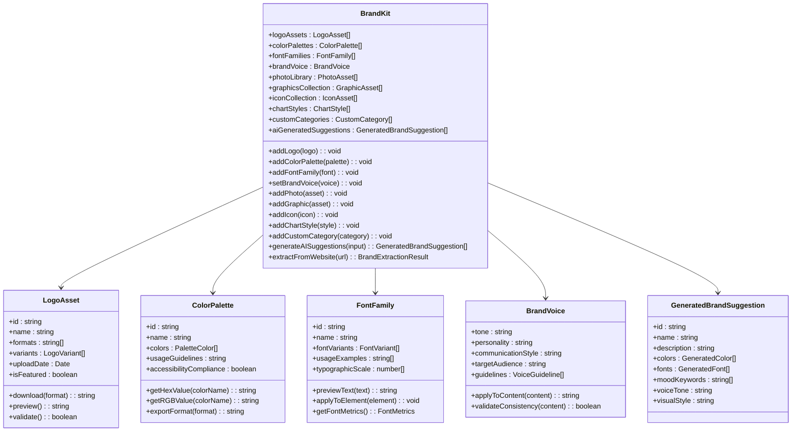

**Diagram sources**
- [brand-kit.service.ts:61-78](file://pikzels-clone/client/src/services/brand-kit.service.ts#L61-L78)
- [brandKitMockData.ts:1-497](file://pikzels-clone/client/src/components/dashboard/brand/brandKitMockData.ts#L1-L497)

Each brand element serves a specific purpose in maintaining visual and textual consistency across all generated content, now enhanced with AI-generated suggestions and automated extraction capabilities.

**Section sources**
- [brand-kit.service.ts:61-78](file://pikzels-clone/client/src/services/brand-kit.service.ts#L61-L78)
- [brandKitMockData.ts:1-497](file://pikzels-clone/client/src/components/dashboard/brand/brandKitMockData.ts#L1-L497)

### Asset Organization System with AI Integration

The system organizes brand assets through a hierarchical categorization approach with AI-powered suggestions:

| Category | Asset Types | Purpose | AI Capabilities | Usage Examples |
|----------|-------------|---------|-----------------|----------------|
| Logos | SVG, PNG, JPG, WebP | Primary brand identification | AI logo generation, variant suggestions | Company logo, favicon, watermark |
| Colors | HEX, RGB, HSL, CMYK | Brand color consistency | AI color palette generation, harmony suggestions | Primary/secondary colors, gradients |
| Fonts | TTF, OTF, WOFF, WOFF2 | Typography standards | AI font pairing suggestions, style recommendations | Headings, body text, UI elements |
| Brand Voice | Text guidelines | Communication standards | AI tone generation, consistency checking | Generated captions, descriptions |
| Photos | JPG, PNG, WebP, GIF | Visual storytelling | AI photo categorization, tagging suggestions | Backgrounds, illustrations, testimonials |
| Graphics | Vector graphics | Design elements | AI graphic generation, pattern suggestions | Icons, patterns, decorative elements |
| Icons | SVG, PNG | Interface elements | AI icon generation, style matching | Navigation, actions, status indicators |
| Charts | Styles, templates | Data visualization | AI chart styling, template suggestions | Analytics dashboards, reports |
| AI Suggestions | Generated content | Brand identity ideas | Complete brand generation workflows | Color schemes, fonts, logos |

**Section sources**
- [brand-kit.service.ts:1-532](file://pikzels-clone/client/src/services/brand-kit.service.ts#L1-L532)
- [brandKitMockData.ts:1-497](file://pikzels-clone/client/src/components/dashboard/brand/brandKitMockData.ts#L1-L497)

## AI-Powered Brand Generation

### AIBrandWizard Component

The AIBrandWizard provides an intuitive multi-step interface for AI-powered brand generation with comprehensive brand questionnaire and suggestion review:

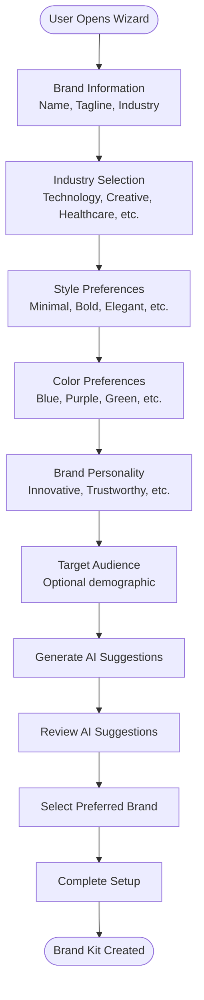

**Diagram sources**
- [AIBrandWizard.tsx:1-121](file://pikzels-clone/client/src/components/dashboard/brand/AIBrandWizard.tsx#L1-L121)
- [BrandKitSetupWizard.tsx:1-202](file://pikzels-clone/client/src/components/dashboard/brand/BrandKitSetupWizard.tsx#L1-L202)

### AI Brand Generation Service

The AI Brand Generator service leverages OpenRouter API to create comprehensive brand identity suggestions:

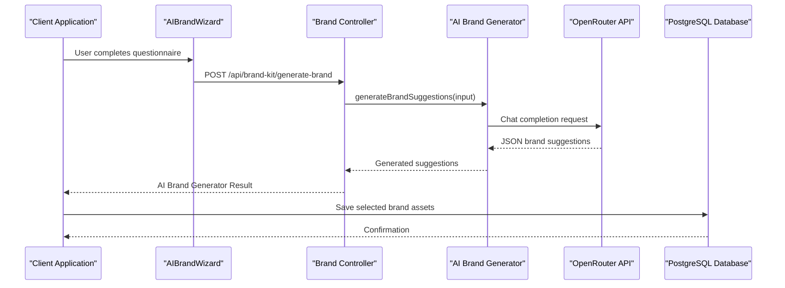

**Diagram sources**
- [ai-brand-generator.service.ts:140-250](file://pikzels-clone/src/modules/brand-kit/ai-brand-generator.service.ts#L140-L250)
- [brand-kit.controller.ts:17-73](file://pikzels-clone/src/modules/brand-kit/brand-kit.controller.ts#L17-L73)

**Section sources**
- [AIBrandWizard.tsx:1-121](file://pikzels-clone/client/src/components/dashboard/brand/AIBrandWizard.tsx#L1-L121)
- [BrandKitSetupWizard.tsx:1-202](file://pikzels-clone/client/src/components/dashboard/brand/BrandKitSetupWizard.tsx#L1-L202)
- [ai-brand-generator.service.ts:1-517](file://pikzels-clone/src/modules/brand-kit/ai-brand-generator.service.ts#L1-L517)
- [brand-kit.controller.ts:17-73](file://pikzels-clone/src/modules/brand-kit/brand-kit.controller.ts#L17-L73)

## Advanced Brand Extraction System

### BrandKitSetupWizard Component

The BrandKitSetupWizard provides a streamlined setup experience with multiple initialization methods:

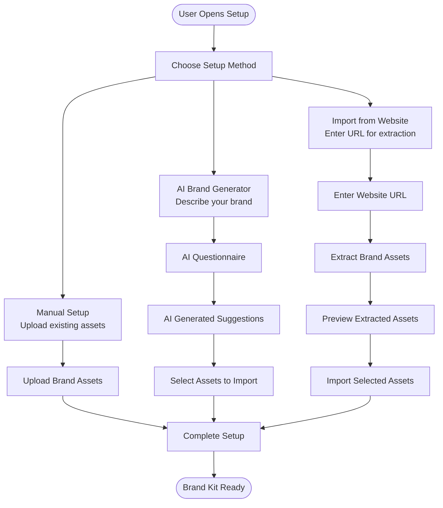

**Diagram sources**
- [BrandKitSetupWizard.tsx:1-202](file://pikzels-clone/client/src/components/dashboard/brand/BrandKitSetupWizard.tsx#L1-L202)

### Brand Extraction Service

The brand extraction service provides comprehensive brand asset extraction from websites with dual extraction methods:

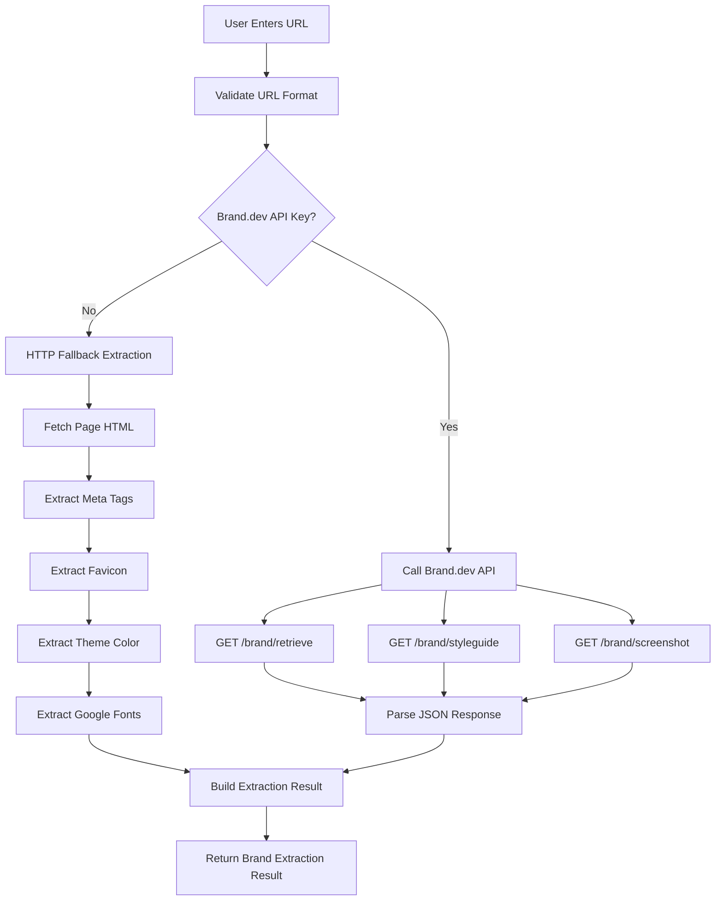

**Diagram sources**
- [brand-extraction.service.ts:126-153](file://pikzels-clone/src/modules/brand-kit/brand-extraction.service.ts#L126-L153)
- [brand-extraction.service.ts:323-338](file://pikzels-clone/src/modules/brand-kit/brand-extraction.service.ts#L323-L338)
- [brand-extraction.service.ts:344-464](file://pikzels-clone/src/modules/brand-kit/brand-extraction.service.ts#L344-L464)

**Section sources**
- [BrandKitSetupWizard.tsx:1-202](file://pikzels-clone/client/src/components/dashboard/brand/BrandKitSetupWizard.tsx#L1-L202)
- [brand-extraction.service.ts:1-470](file://pikzels-clone/src/modules/brand-kit/brand-extraction.service.ts#L1-L470)
- [BRAND_EXTRACTION_SETUP.md:1-131](file://pikzels-clone/docs/BRAND_EXTRACTION_SETUP.md#L1-L131)

## Frontend Implementation

### Enhanced UI Framework with AI Integration

The frontend implementation leverages cutting-edge technologies with AI-powered components to deliver a responsive and intelligent brand management interface:

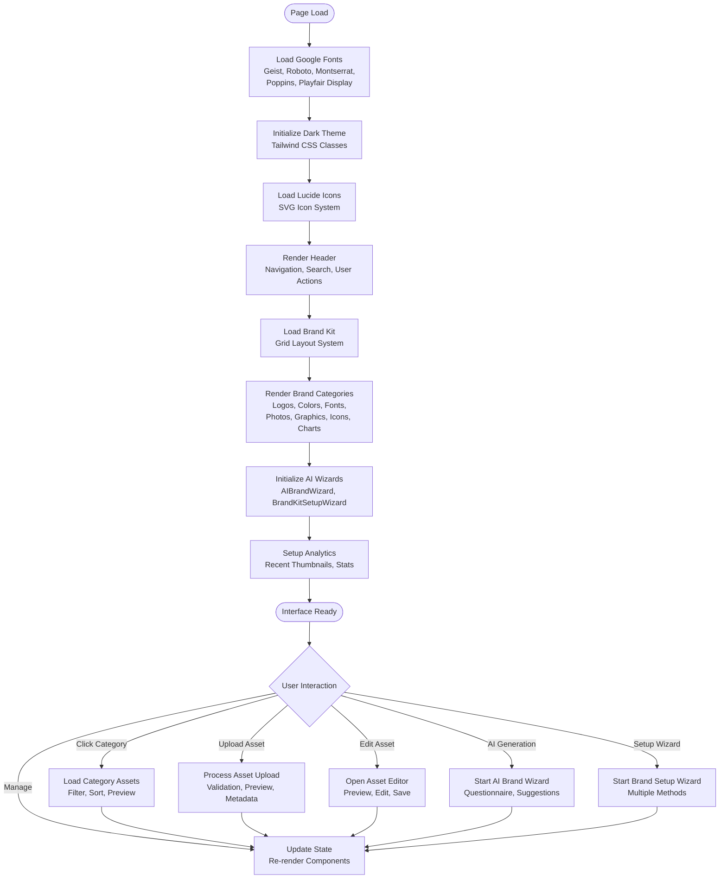

**Diagram sources**
- [brand-kit.service.ts:25-31](file://pikzels-clone/client/src/services/brand-kit.service.ts#L25-L31)
- [BrandKitSetupWizard.tsx:82-87](file://pikzels-clone/client/src/components/dashboard/brand/BrandKitSetupWizard.tsx#L82-L87)

### Responsive Design System with AI Features

The interface employs a sophisticated responsive design system optimized for various screen sizes and devices with AI-powered features:

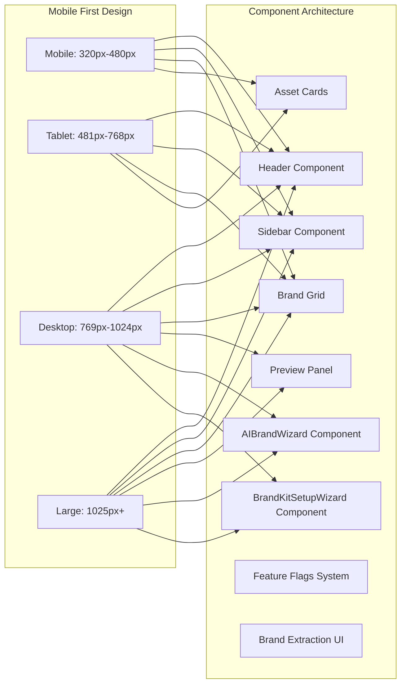

**Diagram sources**
- [types.ts:1-178](file://pikzels-clone/client/src/components/dashboard/brand/types.ts#L1-L178)
- [brandKitMockData.ts:1-497](file://pikzels-clone/client/src/components/dashboard/brand/brandKitMockData.ts#L1-L497)

**Section sources**
- [brand-kit.service.ts:25-31](file://pikzels-clone/client/src/services/brand-kit.service.ts#L25-L31)
- [BrandKitSetupWizard.tsx:82-87](file://pikzels-clone/client/src/components/dashboard/brand/BrandKitSetupWizard.tsx#L82-L87)
- [types.ts:1-178](file://pikzels-clone/client/src/components/dashboard/brand/types.ts#L1-L178)
- [brandKitMockData.ts:1-497](file://pikzels-clone/client/src/components/dashboard/brand/brandKitMockData.ts#L1-L497)

## Backend Integration

### Enhanced API Architecture with AI Services

The backend provides a comprehensive RESTful API supporting all brand management operations with AI integration:

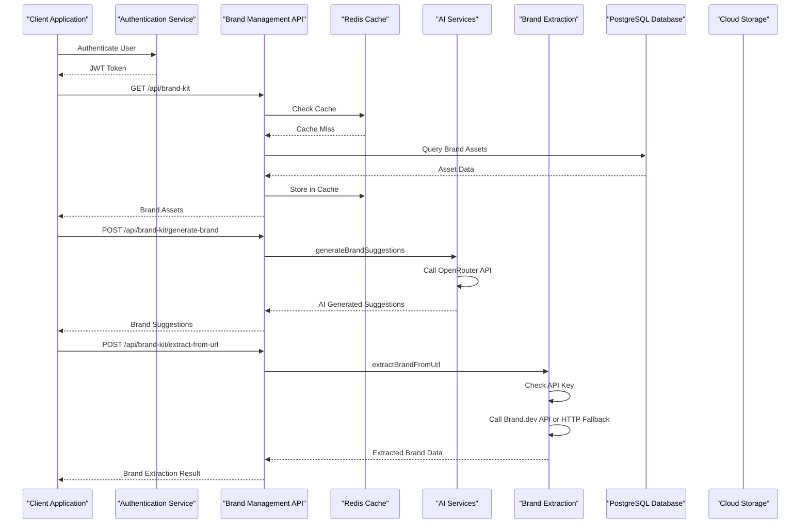

**Diagram sources**
- [brand-kit.controller.ts:17-124](file://pikzels-clone/src/modules/brand-kit/brand-kit.controller.ts#L17-L124)
- [brand-kit.routes.ts:58-77](file://pikzels-clone/src/modules/brand-kit/brand-kit.routes.ts#L58-L77)
- [brand-extraction.service.ts:126-153](file://pikzels-clone/src/modules/brand-kit/brand-extraction.service.ts#L126-L153)

### Authentication and Authorization with AI Features

The system implements robust security measures including JWT-based authentication, role-based access control, comprehensive input validation, and AI service protection:

| Security Feature | Implementation | Purpose | AI Protection |
|------------------|----------------|---------|---------------|
| JWT Authentication | Secure token-based auth | User session management | Protects AI endpoints |
| Rate Limiting | IP-based request throttling | Prevent abuse and DDoS attacks | Limits AI API calls |
| Input Sanitization | HTML/CSS/JS sanitization | XSS prevention | Validates AI prompts |
| CORS Configuration | Origin-based access control | Cross-domain security | Controls AI service access |
| HTTPS Redirect | Automatic protocol enforcement | Secure communication | Encrypts AI data |
| Request Size Limits | File upload restrictions | Resource protection | Limits AI image uploads |
| AI Service Validation | API key verification | Prevent unauthorized AI usage | Protects OpenRouter access |

**Section sources**
- [brand-kit.controller.ts:17-124](file://pikzels-clone/src/modules/brand-kit/brand-kit.controller.ts#L17-L124)
- [brand-kit.routes.ts:50-52](file://pikzels-clone/src/modules/brand-kit/brand-kit.routes.ts#L50-L52)
- [brand-extraction.service.ts:55-56](file://pikzels-clone/src/modules/brand-kit/brand-extraction.service.ts#L55-L56)

## Asset Management

### Enhanced File Processing Pipeline with AI Integration

The system handles various asset types through a sophisticated processing pipeline with AI-powered optimization:

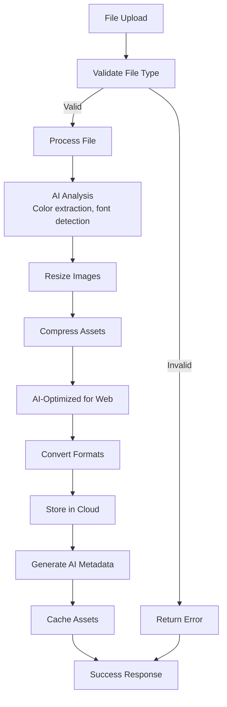

**Diagram sources**
- [brand-kit.controller.ts:148-176](file://pikzels-clone/src/modules/brand-kit/brand-kit.controller.ts#L148-L176)
- [brand-extraction.service.ts:177-317](file://pikzels-clone/src/modules/brand-kit/brand-extraction.service.ts#L177-L317)

### Storage Architecture with AI Optimization

The system utilizes a multi-tiered storage approach for optimal performance and cost efficiency with AI-powered optimization:

| Storage Tier | Purpose | Capacity | Access Pattern | AI Optimization | Cost Efficiency |
|--------------|---------|----------|----------------|-----------------|-----------------|
| Redis Cache | Frequently accessed assets | High-speed SSD | Read-heavy | AI cache warming | High |
| Cloud Storage | Primary asset storage | Scalable | Mixed | AI compression | Medium |
| Local Storage | Temporary processing | Limited | Write-heavy | AI preprocessing | Low |
| CDN | Global distribution | Unlimited | Read-heavy | AI image optimization | Medium |
| AI Cache | AI-generated content | High-speed | Read-heavy | Predictive caching | High |

**Section sources**
- [brand-kit.controller.ts:148-176](file://pikzels-clone/src/modules/brand-kit/brand-kit.controller.ts#L148-L176)
- [brand-extraction.service.ts:177-317](file://pikzels-clone/src/modules/brand-kit/brand-extraction.service.ts#L177-L317)

## Performance Optimization

### Comprehensive Caching Strategy with AI Intelligence

The system implements a comprehensive caching strategy to minimize latency and maximize throughput with AI-powered optimization:

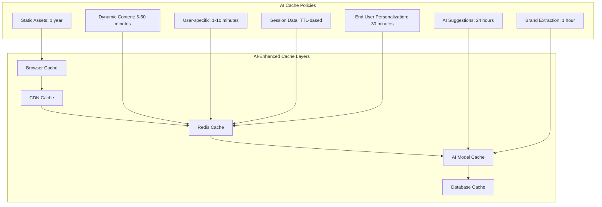

**Diagram sources**
- [brand-kit.controller.ts:130-142](file://pikzels-clone/src/modules/brand-kit/brand-kit.controller.ts#L130-L142)
- [brand-extraction.service.ts:317-317](file://pikzels-clone/src/modules/brand-kit/brand-extraction.service.ts#L317-L317)

### AI-Powered Performance Monitoring

The system includes built-in performance monitoring and analytics with AI insights:

| Metric | Measurement | AI Threshold | AI Action | Traditional Threshold | Traditional Action |
|--------|-------------|--------------|-----------|----------------------|-------------------|
| Response Time | API latency | < 200ms | Optimize queries | < 200ms | Optimize queries |
| Throughput | Requests per second | > 100 | Scale horizontally | > 100 | Scale horizontally |
| Cache Hit Rate | Cache effectiveness | > 80% | Adjust TTL | > 80% | Adjust TTL |
| AI Response Time | AI suggestion latency | < 3000ms | Optimize model | < 5000ms | Monitor performance |
| Error Rate | Failure percentage | < 1% | Monitor logs | < 1% | Monitor logs |
| AI Error Rate | AI service failures | < 5% | Switch providers | < 10% | Monitor providers |
| Memory Usage | Server memory | < 80% | Scale vertically | < 80% | Scale vertically |
| AI Memory Usage | Model loading | < 90% | Optimize models | < 90% | Optimize models |

**Section sources**
- [brand-kit.controller.ts:130-142](file://pikzels-clone/src/modules/brand-kit/brand-kit.controller.ts#L130-L142)
- [ai-brand-generator.service.ts:436-442](file://pikzels-clone/src/modules/brand-kit/ai-brand-generator.service.ts#L436-L442)

## Security Considerations

### Comprehensive Threat Protection with AI Security

The system implements multiple layers of security to protect against various threats with AI-powered threat detection:

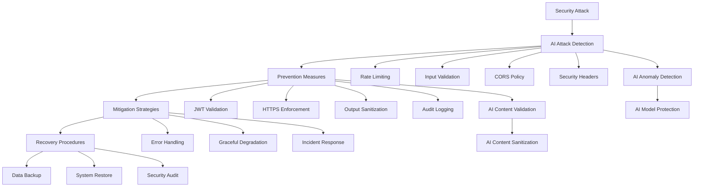

**Diagram sources**
- [brand-kit.controller.ts:19-72](file://pikzels-clone/src/modules/brand-kit/brand-kit.controller.ts#L19-L72)
- [brand-extraction.service.ts:323-338](file://pikzels-clone/src/modules/brand-kit/brand-extraction.service.ts#L323-L338)

### AI-Enhanced Compliance and Standards

The system adheres to industry security standards and best practices with AI-powered compliance monitoring:

| Standard | Implementation | AI Compliance | Compliance Level |
|----------|----------------|---------------|------------------|
| OWASP Top 10 | Input validation, XSS prevention | AI vulnerability scanning | Level A |
| GDPR | Data protection, user rights | AI data classification | Level A |
| PCI DSS | Payment security | AI fraud detection | Level B |
| SOC 2 | Security, availability, confidentiality | AI security analytics | Level B |
| ISO 27001 | Information security management | AI risk assessment | Level C |
| AI Ethics | Responsible AI usage | AI bias detection | Level A |
| AI Security | AI model protection | AI adversarial attack detection | Level B |

**Section sources**
- [brand-kit.controller.ts:19-72](file://pikzels-clone/src/modules/brand-kit/brand-kit.controller.ts#L19-L72)
- [ai-brand-generator.service.ts:217-250](file://pikzels-clone/src/modules/brand-kit/ai-brand-generator.service.ts#L217-L250)

## Deployment Architecture

### Containerized Deployment with AI Services

The system supports containerized deployment for scalability and reliability with AI service integration:

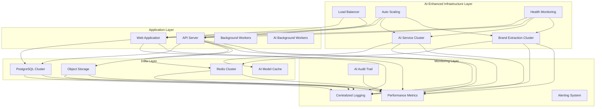

**Diagram sources**
- [server.ts:64-64](file://pikzels-clone/src/server.ts#L64-L64)
- [brand-extraction.service.ts:55-56](file://pikzels-clone/src/modules/brand-kit/brand-extraction.service.ts#L55-L56)

### AI-Enhanced Development Workflow

The system follows a comprehensive development workflow with AI integration:

| Phase | Tool | AI Enhancement | Purpose | Output |
|-------|------|----------------|---------|--------|
| Development | Vite + React | AI code suggestions | Fast development | Hot reload, fast builds |
| Testing | Jest + Playwright | AI test generation | Quality assurance | Unit tests, e2e tests |
| CI/CD | GitHub Actions | AI deployment optimization | Automation | Automated testing, deployment |
| Monitoring | Winston + Daily Rotate | AI anomaly detection | Logging | Structured logs, rotation |
| Documentation | JSDoc + Markdown | AI documentation generation | Knowledge base | API docs, guides |
| AI Training | OpenRouter API | AI model fine-tuning | Brand generation | Improved AI suggestions |
| AI Extraction | Brand.dev API | AI content analysis | Brand extraction | Enhanced extraction results |

**Section sources**
- [server.ts:64-64](file://pikzels-clone/src/server.ts#L64-L64)
- [ai-brand-generator.service.ts:57-61](file://pikzels-clone/src/modules/brand-kit/ai-brand-generator.service.ts#L57-L61)
- [brand-extraction.service.ts:55-56](file://pikzels-clone/src/modules/brand-kit/brand-extraction.service.ts#L55-L56)

## Troubleshooting Guide

### Common Issues and AI-Enhanced Solutions

| Issue | Symptoms | AI Solution | Prevention |
|-------|----------|-------------|------------|
| AI Brand Generation Failures | OpenRouter API errors, timeout errors | Fallback to local generation, retry logic | Monitor API status, implement retries |
| Asset Upload Failures | 413 Payload Too Large | AI compression, progressive upload | Implement client-side validation |
| Cache Performance Issues | Slow response times | AI cache optimization, predictive caching | Monitor cache hit rates |
| Authentication Problems | 401 Unauthorized errors | AI token validation, automatic refresh | Implement token refresh |
| Database Connection | Connection refused errors | AI connection pooling, failover | Use connection pooling |
| CORS Errors | Blocked requests | AI CORS validation, dynamic origins | Test cross-origin requests |
| Brand Extraction Failures | Website timeouts, API errors | AI fallback extraction, retry logic | Monitor external service status |
| AI Model Unavailability | Service unavailable errors | AI fallback generation, offline mode | Monitor AI provider status |

### AI-Powered Performance Debugging

The system provides comprehensive debugging tools with AI insights:

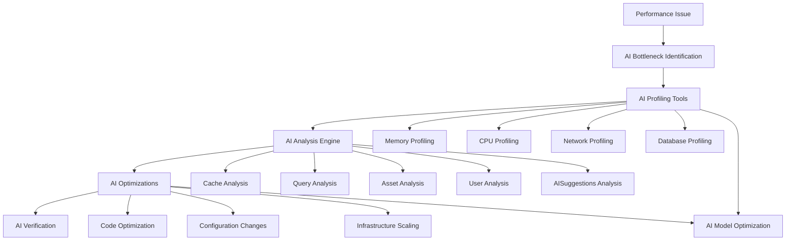

**Diagram sources**
- [brand-kit.controller.ts:60-72](file://pikzels-clone/src/modules/brand-kit/brand-kit.controller.ts#L60-L72)
- [ai-brand-generator.service.ts:436-442](file://pikzels-clone/src/modules/brand-kit/ai-brand-generator.service.ts#L436-L442)

### AI-Enhanced Monitoring and Alerting

The system includes comprehensive monitoring capabilities with AI insights:

| Metric Type | AI Collection Method | AI Alert Threshold | AI Response Action | Traditional Monitoring |
|-------------|-------------------|-----------------|-----------------|----------------------|
| Application Health | AI heartbeat checks | Unavailable > 5min | Auto-restart service | Heartbeat checks |
| AI Service Performance | AI query metrics | Slow queries > 1s | Optimize AI models | Query metrics |
| Cache Performance | AI hit rate monitoring | < 70% | Adjust AI cache settings | Cache analysis |
| Storage Usage | AI disk space monitoring | > 80% | Clean AI cache | Disk monitoring |
| User Activity | AI login analytics | Anomaly detection | AI security review | Login analytics |
| AI Model Performance | AI inference metrics | Model drift > 10% | Retrain AI models | Model metrics |
| Brand Extraction | AI extraction quality | Accuracy < 80% | Improve extraction logic | Extraction metrics |

**Section sources**
- [brand-kit.controller.ts:60-72](file://pikzels-clone/src/modules/brand-kit/brand-kit.controller.ts#L60-L72)
- [ai-brand-generator.service.ts:436-442](file://pikzels-clone/src/modules/brand-kit/ai-brand-generator.service.ts#L436-L442)

## Conclusion

The enhanced Brand Management System represents a comprehensive AI-powered solution for maintaining brand consistency across digital assets. Through its modern architecture with AI integration, robust security measures, and scalable infrastructure, it provides users with powerful tools to manage their brand identity effectively with intelligent automation.

Key strengths of the enhanced system include:

- **AI-Powered Brand Generation**: Interactive AIBrandWizard with comprehensive brand questionnaires and AI-generated suggestions
- **Advanced Brand Extraction**: Dual extraction methods with Brand.dev API integration and HTTP fallback capabilities
- **Streamlined Setup Experience**: Intuitive BrandKitSetupWizard with multiple initialization methods (AI, URL import, manual)
- **Comprehensive Brand Management**: Nine distinct asset categories with AI-powered suggestions and automated generation
- **Modern Technology Stack**: React frontend with Express backend, AI services, ensuring maintainability and performance
- **Robust Security**: Multi-layered security approach with AI-powered threat detection and protection
- **Scalable Architecture**: Containerized deployment with AI service clustering supporting horizontal scaling
- **Intelligent Performance Optimization**: AI-powered caching strategies and predictive optimization for optimal user experience

The system's modular design with AI integration allows for easy extension and customization, making it adaptable to various organizational needs while maintaining consistency and quality across all brand assets. The addition of AI-powered brand generation, automated brand extraction, and intelligent setup wizards significantly enhances the user experience and operational efficiency.

Future enhancements could include advanced AI brand analysis capabilities, automated compliance checking with AI governance, expanded integration capabilities with design tools and marketing platforms, and enhanced AI model personalization for individual user preferences and brand characteristics.