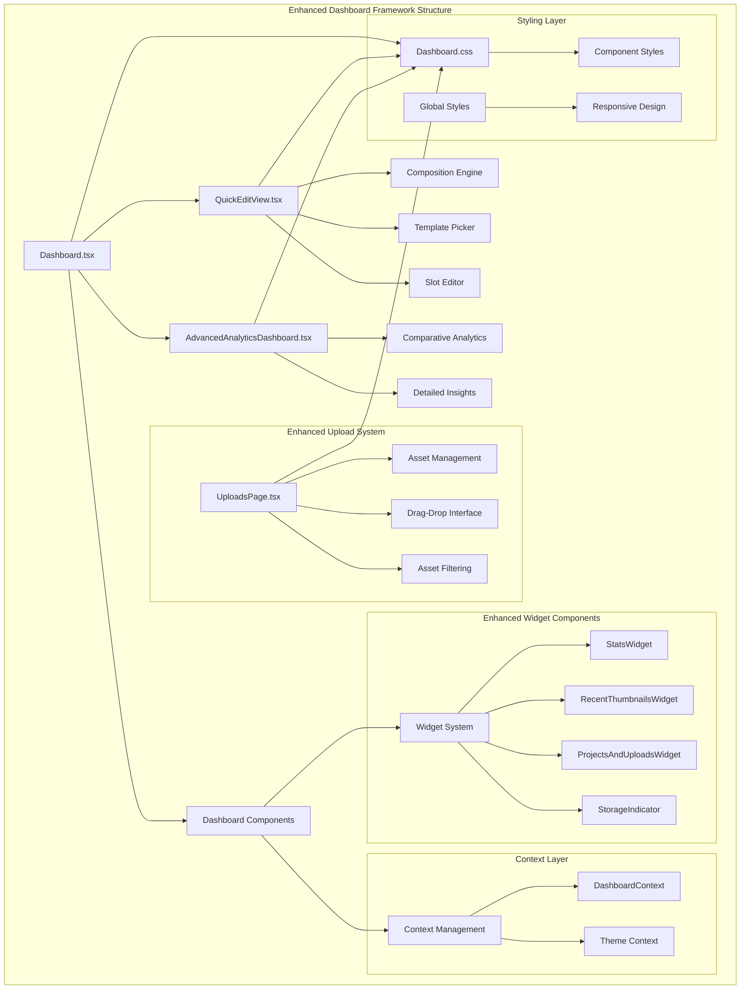
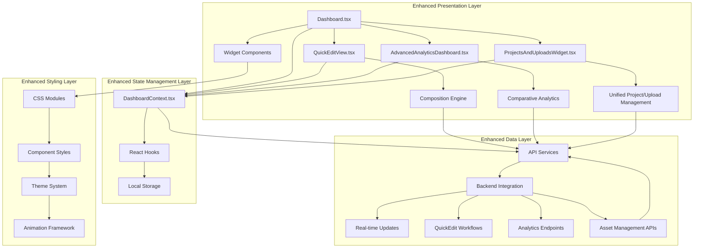
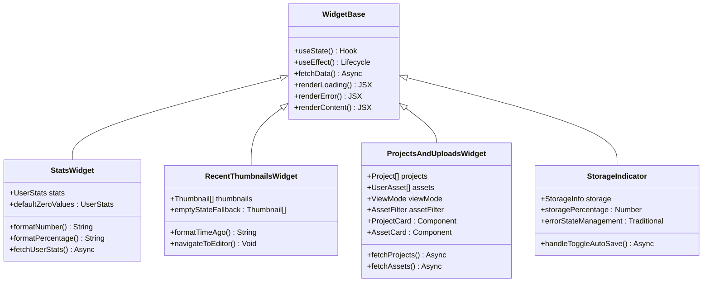
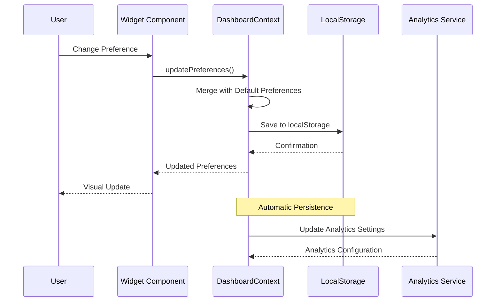
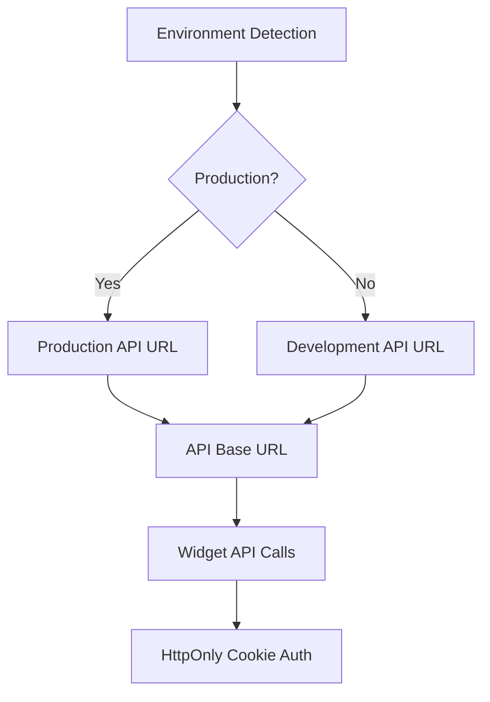
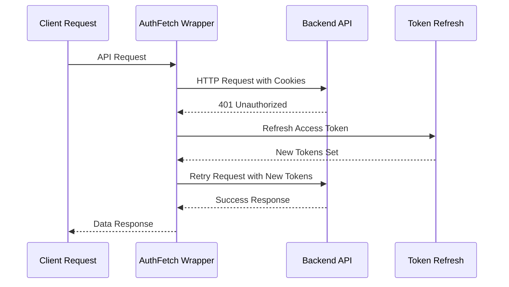
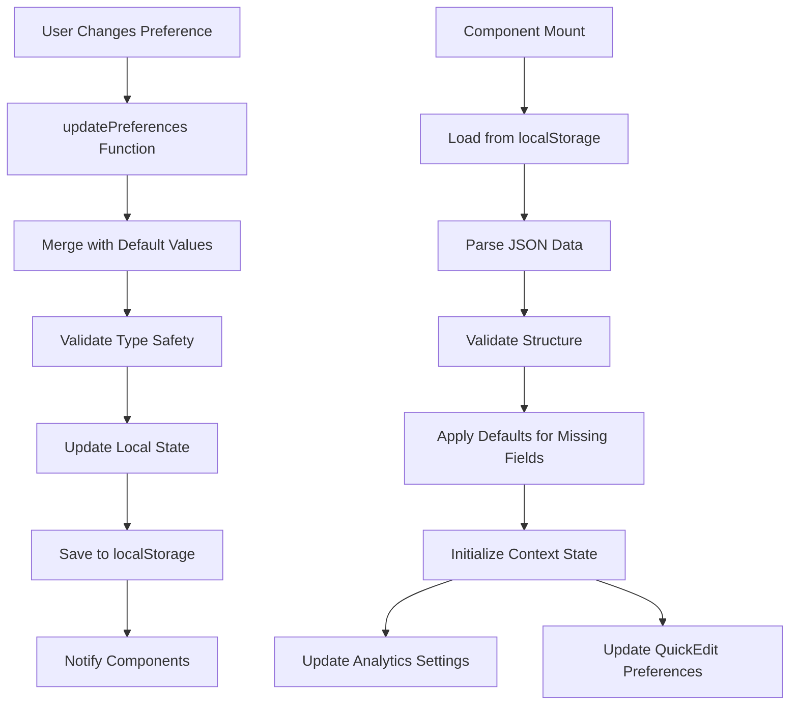
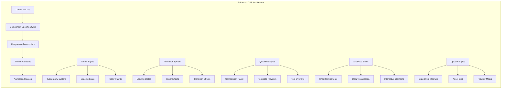
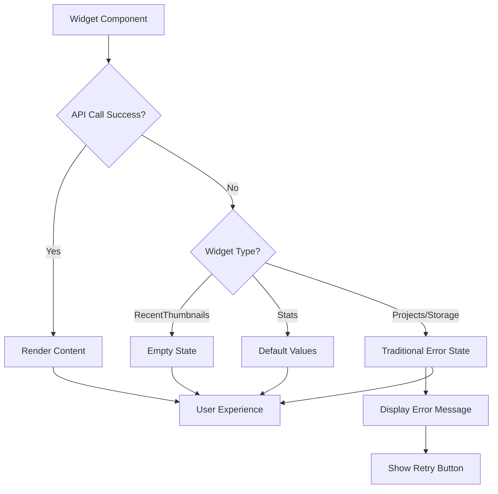

# Dashboard Widgets Framework

<cite>
**Referenced Files in This Document**
- [Dashboard.tsx](file://pikzels-clone/client/src/components/Dashboard.tsx)
- [QuickEditView.tsx](file://pikzels-clone/client/src/components/dashboard/QuickEditView.tsx)
- [AdvancedAnalyticsDashboard.tsx](file://pikzels-clone/client/src/components/AdvancedAnalyticsDashboard.tsx)
- [DashboardContext.tsx](file://pikzels-clone/client/src/contexts/DashboardContext.tsx)
- [Dashboard.css](file://pikzels-clone/client/src/components/Dashboard.css)
- [StatsWidget.tsx](file://pikzels-clone/client/src/components/dashboard/widgets/StatsWidget.tsx)
- [RecentThumbnailsWidget.tsx](file://pikzels-clone/client/src/components/dashboard/widgets/RecentThumbnailsWidget.tsx)
- [ProjectsAndUploadsWidget.tsx](file://pikzels-clone/client/src/components/dashboard/widgets/ProjectsAndUploadsWidget.tsx)
- [StorageIndicator.tsx](file://pikzels-clone/client/src/components/dashboard/widgets/StorageIndicator.tsx)
- [UploadsPage.tsx](file://pikzels-clone/client/src/components/dashboard/UploadsPage.tsx)
- [useAITextGenerator.ts](file://pikzels-clone/client/src/hooks/useAITextGenerator.ts)
- [useCompositionTemplates.ts](file://pikzels-clone/client/src/features/composition-templates/useCompositionTemplates.ts)
- [composition-engine.ts](file://pikzels-clone/client/src/features/composition-templates/composition-engine.ts)
- [presets.ts](file://pikzels-clone/client/src/features/composition-templates/presets.ts)
- [environment.ts](file://pikzels-clone/client/src/config/environment.ts)
- [api.ts](file://pikzels-clone/client/src/utils/api.ts)
- [DASHBOARD_ENHANCEMENT_COMPLETE.md](file://pikzels-clone/DASHBOARD_ENHANCEMENT_COMPLETE.md)
- [DASHBOARD_STYLING_SOLUTION.md](file://pikzels-clone/DASHBOARD_STYLING_SOLUTION.md)
- [analytics-dashboard.md](file://pikzels-clone/docs/analytics-dashboard.md)
- [advanced-analytics-dashboard.md](file://pikzels-clone/docs/components/advanced-analytics-dashboard.md)
- [extending-advanced-analytics.md](file://pikzels-clone/docs/guides/extending-advanced-analytics.md)
- [ErrorBoundary.tsx](file://pikzels-clone/client/src/components/ErrorBoundary.tsx)
</cite>

## Update Summary
**Changes Made**
- Enhanced error handling strategy implemented across widget components for improved user experience
- RecentThumbnailsWidget now converts API errors to empty states instead of displaying error messages
- StatsWidget now shows default zero values instead of error messages when API calls fail
- ProjectsAndUploadsWidget and StorageIndicator maintain traditional error state management
- Error handling patterns standardized with consistent empty state fallbacks
- API integration improvements with enhanced authentication reliability across deployment platforms

## Table of Contents
1. [Introduction](#introduction)
2. [Project Structure](#project-structure)
3. [Core Components](#core-components)
4. [Architecture Overview](#architecture-overview)
5. [Detailed Component Analysis](#detailed-component-analysis)
6. [Widget System](#widget-system)
7. [QuickEditView Integration](#quickeditview-integration)
8. [Advanced Analytics Dashboard](#advanced-analytics-dashboard)
9. [Template Management System](#template-management-system)
10. [Authentication and Session Management](#authentication-and-session-management)
11. [Context Management](#context-management)
12. [Styling Framework](#styling-framework)
13. [Performance Considerations](#performance-considerations)
14. [Enhanced Error Handling Strategy](#enhanced-error-handling-strategy)
15. [Troubleshooting Guide](#troubleshooting-guide)
16. [Conclusion](#conclusion)

## Introduction

The Dashboard Widgets Framework is a comprehensive React-based dashboard system designed for a thumbnail creation and management platform. This framework provides a modular, extensible architecture for building interactive dashboards with customizable widgets, responsive layouts, and professional styling. The system supports real-time data visualization, user preferences management, seamless integration with backend APIs, and advanced thumbnail editing capabilities.

The framework emphasizes modern web development practices including TypeScript integration, React hooks, context-based state management, and component composition patterns. It features a dark-themed interface optimized for creative work environments, with smooth animations and responsive design principles.

**Updated** The framework now implements an enhanced error handling approach that prioritizes user experience by converting API errors to empty states or default values rather than displaying alarming error messages. This approach improves user confidence and reduces cognitive load when dashboard components encounter temporary service issues or network failures. The strategy is applied consistently across widget components with three distinct approaches: empty states for user-facing content, default values for metrics display, and traditional error states for critical operations.

## Project Structure

The dashboard framework follows a well-organized structure that separates concerns across multiple layers with enhanced integration points:



**Diagram sources**
- [Dashboard.tsx:1-892](file://pikzels-clone/client/src/components/Dashboard.tsx#L1-L892)
- [QuickEditView.tsx:1-2081](file://pikzels-clone/client/src/components/dashboard/QuickEditView.tsx#L1-L2081)
- [AdvancedAnalyticsDashboard.tsx:1-719](file://pikzels-clone/client/src/components/AdvancedAnalyticsDashboard.tsx#L1-L719)
- [UploadsPage.tsx:1-625](file://pikzels-clone/client/src/components/dashboard/UploadsPage.tsx#L1-L625)

The structure demonstrates clear separation between layout management, content presentation, widget composition, and enhanced integration systems. Each component maintains single responsibility while collaborating through well-defined interfaces and advanced service integrations.

**Section sources**
- [Dashboard.tsx:1-892](file://pikzels-clone/client/src/components/Dashboard.tsx#L1-L892)
- [QuickEditView.tsx:1-2081](file://pikzels-clone/client/src/components/dashboard/QuickEditView.tsx#L1-L2081)
- [AdvancedAnalyticsDashboard.tsx:1-719](file://pikzels-clone/client/src/components/AdvancedAnalyticsDashboard.tsx#L1-L719)
- [UploadsPage.tsx:1-625](file://pikzels-clone/client/src/components/dashboard/UploadsPage.tsx#L1-L625)

## Core Components

### Enhanced Dashboard Layout System

The Dashboard Layout serves as the primary container and navigation framework for the entire dashboard system, now enhanced with QuickEditView integration and Advanced Analytics capabilities. It provides responsive navigation, user authentication integration, and consistent styling across all dashboard pages.

Key features include:
- **Responsive Navigation**: Collapsible sidebar with adaptive breakpoints
- **Multi-level Routing**: Support for nested dashboard routes including analytics and editing workflows
- **User Authentication**: Integration with backend authentication systems using HttpOnly cookies
- **Theme Management**: Dark/light mode switching capabilities
- **Mobile Responsiveness**: Touch-friendly navigation for mobile devices
- **QuickEdit Integration**: Seamless access to advanced thumbnail editing capabilities
- **Analytics Dashboard**: Built-in access to detailed analytics and insights
- **Uploads Consolidation**: Unified access to project and asset management

The layout system implements a sophisticated navigation hierarchy with support for both desktop and mobile interfaces, ensuring optimal user experience across all device types while integrating advanced editing and analytics workflows.

### Dashboard Home Component

The Dashboard Home component acts as the main entry point and content orchestrator, now featuring enhanced integration with ProjectsAndUploadsWidget and comprehensive upload management. It integrates multiple widget systems, handles user interactions, and manages the overall dashboard workflow with advanced editing capabilities.

Primary responsibilities:
- **Widget Orchestration**: Coordinates multiple dashboard widgets including enhanced analytics and unified project/upload management
- **User Interaction Management**: Handles form submissions, modal dialogs, and user actions
- **State Management**: Manages complex state for various dashboard features including editing workflows and asset management
- **Integration Points**: Connects with external services, QuickEditView, and Advanced Analytics
- **Error Handling**: Implements comprehensive error management and user feedback with enhanced empty state fallbacks
- **QuickEdit Workflow**: Provides seamless access to advanced thumbnail editing capabilities
- **Analytics Integration**: Displays detailed insights and performance metrics
- **Upload Management**: Integrates comprehensive asset management and drag-drop functionality

**Section sources**
- [Dashboard.tsx:42-892](file://pikzels-clone/client/src/components/Dashboard.tsx#L42-L892)

## Architecture Overview

The dashboard framework employs a layered architecture that promotes maintainability and scalability with enhanced integration capabilities:



**Diagram sources**
- [DashboardContext.tsx:1-95](file://pikzels-clone/client/src/contexts/DashboardContext.tsx#L1-L95)
- [Dashboard.tsx:1-892](file://pikzels-clone/client/src/components/Dashboard.tsx#L1-L892)
- [QuickEditView.tsx:1-2081](file://pikzels-clone/client/src/components/dashboard/QuickEditView.tsx#L1-L2081)
- [AdvancedAnalyticsDashboard.tsx:1-719](file://pikzels-clone/client/src/components/AdvancedAnalyticsDashboard.tsx#L1-L719)
- [ProjectsAndUploadsWidget.tsx:1-405](file://pikzels-clone/client/src/components/dashboard/widgets/ProjectsAndUploadsWidget.tsx#L1-L405)

The architecture ensures loose coupling between components while maintaining clear data flow and state management patterns. This design enables easy extension and modification of individual components without affecting the overall system, with enhanced integration for QuickEditView, Advanced Analytics, and comprehensive asset management.

## Detailed Component Analysis

### Enhanced Widget System Architecture

The widget system provides a flexible framework for creating reusable dashboard components with enhanced analytics and template management capabilities. Each widget follows consistent patterns for data fetching, error handling, and user interaction.



**Diagram sources**
- [StatsWidget.tsx:1-146](file://pikzels-clone/client/src/components/dashboard/widgets/StatsWidget.tsx#L1-L146)
- [RecentThumbnailsWidget.tsx:1-97](file://pikzels-clone/client/src/components/dashboard/widgets/RecentThumbnailsWidget.tsx#L1-L97)
- [ProjectsAndUploadsWidget.tsx:1-405](file://pikzels-clone/client/src/components/dashboard/widgets/ProjectsAndUploadsWidget.tsx#L1-L405)
- [StorageIndicator.tsx:1-154](file://pikzels-clone/client/src/components/dashboard/widgets/StorageIndicator.tsx#L1-L154)

Each widget implements consistent patterns for data management, error handling, and user interaction, ensuring predictable behavior across the enhanced dashboard ecosystem with improved analytics integration and unified project/upload management.

**Updated** All widget components now use absolute API URLs from the environment configuration, improving authentication reliability across different deployment platforms including Netlify, and enhanced with comparative analytics data for more comprehensive insights.

### Enhanced ProjectsAndUploadsWidget Implementation

The ProjectsAndUploadsWidget represents a significant enhancement to the dashboard framework, combining project management and asset upload functionality in a single, unified interface. This widget provides three distinct view modes: all projects, saved projects, and my uploads, with comprehensive filtering and management capabilities.

Key features:
- **Unified Interface**: Combines project and asset management in a single widget
- **Multiple View Modes**: Tabbed interface for projects vs uploads with separate filtering
- **Asset Management**: Comprehensive upload, categorization, and preview capabilities
- **Drag-Drop Integration**: Advanced drag-and-drop functionality for asset recategorization
- **Real-time Updates**: Live asset count and filtering with immediate visual feedback
- **Preview System**: Integrated image preview modal with download and navigation capabilities
- **Navigation Integration**: Seamless routing to dedicated upload management page

The widget implements sophisticated state management for both projects and assets, with separate loading states and error handling for each data source, ensuring optimal user experience across different content types.

### Context Management System

The Dashboard Context provides centralized state management for user preferences, theme settings, and dashboard-wide configurations. This system enables seamless preference persistence and cross-component communication with enhanced QuickEditView and analytics integration.



**Diagram sources**
- [DashboardContext.tsx:43-95](file://pikzels-clone/client/src/contexts/DashboardContext.tsx#L43-L95)

The context system implements automatic persistence using localStorage, ensuring user preferences survive page reloads and browser restarts, with enhanced integration for QuickEditView and analytics preferences.

**Section sources**
- [DashboardContext.tsx:1-95](file://pikzels-clone/client/src/contexts/DashboardContext.tsx#L1-L95)

## Widget System

### Enhanced Stats Widget Implementation

The Stats Widget provides comprehensive user analytics and metrics display with enhanced comparative analytics integration. It fetches real-time data from backend APIs using absolute URLs and presents it in an intuitive grid layout with trend indicators.

Key features:
- **Real-time Data Fetching**: Integrates with analytics endpoints using `${API_BASE_URL}/api/analytics/stats`
- **Enhanced Comparative Analytics**: Displays trend indicators and comparative data
- **Data Formatting**: Intelligent number and percentage formatting with trend visualization
- **Loading States**: Graceful loading indicators and error handling
- **Responsive Grid**: Adapts layout based on screen size
- **Visual Hierarchy**: Clear prioritization of metrics importance with trend indicators

**Updated** The Stats Widget now implements an enhanced error handling approach that converts API failures to default zero values instead of displaying error messages. This approach prioritizes user experience by maintaining visual consistency even when data is temporarily unavailable.

The widget implements sophisticated data formatting logic that adapts numbers to human-readable formats (K for thousands, M for millions) and handles edge cases gracefully, with enhanced trend visualization for comparative analytics.

### Recent Thumbnails Widget

**Updated** This widget displays the user's most recent thumbnail creations with interactive previews, enhanced navigation capabilities, and QuickEditView integration. The widget now implements an enhanced error handling strategy that converts API failures to empty states rather than displaying error messages.

Implementation highlights:
- **Enhanced Image Loading**: Optimized image handling with fallback mechanisms and lazy loading
- **Dynamic Time Formatting**: Dynamic time display ("Just now", "X minutes ago") with relative timestamps
- **QuickEdit Integration**: Direct access to advanced editing capabilities
- **Interactive Elements**: Hover effects and click-to-navigate functionality with QuickEdit shortcuts
- **Empty State Handling**: Graceful display when thumbnails exist or API calls fail
- **Recent Preview Enhancement**: Enhanced thumbnail previews with QuickEdit indicators

**Updated** The Recent Thumbnails Widget now treats API errors as empty states, displaying a simple "No thumbnails yet" message with guidance to create the first thumbnail. This approach prevents users from seeing alarming error messages while maintaining a clean, professional interface.

### ProjectsAndUploadsWidget

**Updated** The ProjectsAndUploadsWidget replaces the previous AllProjectsWidget with a comprehensive unified interface that combines project management and asset upload functionality. This widget features three distinct view modes with advanced filtering and management capabilities.

Key features:
- **Unified Interface**: Single widget managing both projects and uploads
- **Three View Modes**: All projects, saved projects, and my uploads tabs
- **Asset Filtering**: Category-based filtering (faces, images, brand logos, others)
- **Drag-Drop Recategorization**: Advanced drag-and-drop functionality for asset management
- **Preview System**: Integrated image preview with metadata and navigation
- **Navigation Integration**: Seamless routing to dedicated upload management page
- **Real-time Updates**: Live asset counting and filtering with immediate feedback
- **Mock Data Support**: Development environment compatibility with fallback data

The widget implements sophisticated state management for both projects and assets, with separate loading states and error handling, ensuring optimal user experience across different content types.

### Storage Indicator Widget

This widget monitors user storage usage and provides controls for auto-save functionality with enhanced utilization visualization.

Core functionality:
- **Enhanced Storage Monitoring**: Real-time usage percentage calculation with utilization trends
- **Auto-save Control**: Toggle for automatic thumbnail saving
- **Error Recovery**: Graceful handling of API failures with traditional error state management
- **Enhanced Visual Progress**: Animated progress bar with gradient styling and utilization indicators
- **Development Mode**: Mock data for local development
- **Storage Utilization Insights**: Detailed breakdown of storage usage patterns

**Section sources**
- [StatsWidget.tsx:1-146](file://pikzels-clone/client/src/components/dashboard/widgets/StatsWidget.tsx#L1-L146)
- [RecentThumbnailsWidget.tsx:1-97](file://pikzels-clone/client/src/components/dashboard/widgets/RecentThumbnailsWidget.tsx#L1-L97)
- [ProjectsAndUploadsWidget.tsx:1-405](file://pikzels-clone/client/src/components/dashboard/widgets/ProjectsAndUploadsWidget.tsx#L1-L405)
- [StorageIndicator.tsx:1-154](file://pikzels-clone/client/src/components/dashboard/widgets/StorageIndicator.tsx#L1-L154)

## QuickEditView Integration

### Advanced Thumbnail Editing Workflow

The QuickEditView component provides a comprehensive thumbnail editing interface with advanced AI-powered capabilities, template management, and composition engine integration.

Key features:
- **Multi-source Input**: Supports URL input, file upload, and AI-generated thumbnails
- **Video Frame Extraction**: Real-time video frame streaming with progress indicators
- **AI-Powered Generation**: Advanced AI tools for thumbnail creation with style presets
- **Template Management**: Integration with composition templates and layout engines
- **Text Overlay System**: Sophisticated text overlay with drag-and-drop positioning
- **Face Swap Integration**: AI-powered face replacement capabilities
- **Image Enhancement**: Quality enhancement tools for improved thumbnail appearance
- **Session Persistence**: Automatic state persistence for editing workflows

The QuickEditView implements a sophisticated editing pipeline with real-time preview, AI integration, and seamless workflow progression from concept to final thumbnail.

**Section sources**
- [QuickEditView.tsx:1-2081](file://pikzels-clone/client/src/components/dashboard/QuickEditView.tsx#L1-L2081)

## Advanced Analytics Dashboard

### Comprehensive Analytics and Insights

The Advanced Analytics Dashboard provides detailed insights into thumbnail creation activity, performance metrics, and user engagement patterns with comparative analytics capabilities.

Key features:
- **Comparative Analytics**: Timeframe-based comparative analysis (daily, weekly, monthly)
- **Productivity Metrics**: Best creation days, peak hours, and consistency tracking
- **Engagement Analytics**: Sharing rates, platform distribution, and most shared thumbnails
- **Editing Analytics**: Complexity analysis and edit distribution patterns
- **Trend Visualization**: Interactive charts and trend indicators
- **Performance Insights**: Detailed metrics with comparative data and trend analysis

The dashboard implements sophisticated data visualization with interactive charts, trend indicators, and comprehensive metric analysis for informed decision-making.

**Section sources**
- [AdvancedAnalyticsDashboard.tsx:1-719](file://pikzels-clone/client/src/components/AdvancedAnalyticsDashboard.tsx#L1-L719)

## Template Management System

### Composition Engine and Layout Templates

The template management system provides advanced composition capabilities with layout templates, slot editors, and AI-powered text generation integration.

Key components:
- **Composition Engine**: Real-time rendering of composed thumbnails
- **Template Picker**: Curated collection of professional layout templates
- **Slot Editor**: Intuitive interface for managing content slots
- **AI Text Generation**: Vision-aware text generation with style adaptation
- **Style Presets**: Professional design templates with consistent branding
- **Font Management**: Comprehensive font library with mood-based selection

The template system enables users to create professional thumbnails quickly while maintaining design consistency and brand guidelines.

**Section sources**
- [QuickEditView.tsx:1-2081](file://pikzels-clone/client/src/components/dashboard/QuickEditView.tsx#L1-L2081)

## Authentication and Session Management

**Updated** The dashboard framework now implements robust authentication and session management to address Netlify proxy configuration challenges and ensure reliable API access across different deployment environments.

### Environment-Based API Configuration

The framework uses environment-specific API base URLs to ensure proper authentication cookie handling:



**Diagram sources**
- [environment.ts:112-117](file://pikzels-clone/client/src/config/environment.ts#L112-L117)

The environment configuration automatically detects deployment platforms (Netlify, Vercel, Cloudflare) and sets appropriate API URLs, preventing authentication cookie issues that commonly occur with proxy configurations.

### Enhanced Fetch Wrapper with Automatic Token Refresh

The framework includes an enhanced fetch wrapper that handles authentication automatically:



**Diagram sources**
- [api.ts:44-102](file://pikzels-clone/client/src/utils/api.ts#L44-L102)

The authentication system uses HttpOnly cookies for secure token storage and implements automatic token refresh on 401 errors, ensuring seamless user experience without manual intervention.

### Widget API Integration Pattern

All widget components now follow a consistent pattern for API integration:

```mermaid
classDiagram
class WidgetAPIPattern {
+API_BASE_URL : string
+credentials : 'include'
+absoluteURL : `${API_BASE_URL}${endpoint}`
+authCookies : HttpOnly
}
class StatsWidget {
+fetchUserStats() Async
+uses : `${API_BASE_URL}/api/analytics/stats`
+errorHandling : Default Zero Values
}
class RecentThumbnailsWidget {
+fetchRecentThumbnails() Async
+uses : `${API_BASE_URL}/api/thumbnails`
+errorHandling : Empty State
}
class ProjectsAndUploadsWidget {
+fetchProjects() Async
+fetchAssets() Async
+uses : `${API_BASE_URL}/api/projects`
+uses : `${API_BASE_URL}/api/assets`
+errorHandling : Traditional Error States
}
class StorageIndicator {
+fetchStorageInfo() Async
+uses : `${API_BASE_URL}/api/user/storage`
+errorHandling : Traditional Error States
}
WidgetAPIPattern <|-- StatsWidget
WidgetAPIPattern <|-- RecentThumbnailsWidget
WidgetAPIPattern <|-- ProjectsAndUploadsWidget
WidgetAPIPattern <|-- StorageIndicator
```

**Diagram sources**
- [StatsWidget.tsx:23-41](file://pikzels-clone/client/src/components/dashboard/widgets/StatsWidget.tsx#L23-L41)
- [RecentThumbnailsWidget.tsx:23-41](file://pikzels-clone/client/src/components/dashboard/widgets/RecentThumbnailsWidget.tsx#L23-L41)
- [ProjectsAndUploadsWidget.tsx:75-105](file://pikzels-clone/client/src/components/dashboard/widgets/ProjectsAndUploadsWidget.tsx#L75-L105)
- [StorageIndicator.tsx:29-52](file://pikzels-clone/client/src/components/dashboard/widgets/StorageIndicator.tsx#L29-L52)

**Section sources**
- [environment.ts:1-163](file://pikzels-clone/client/src/config/environment.ts#L1-L163)
- [api.ts:1-185](file://pikzels-clone/client/src/utils/api.ts#L1-L185)
- [StatsWidget.tsx:1-146](file://pikzels-clone/client/src/components/dashboard/widgets/StatsWidget.tsx#L1-L146)
- [RecentThumbnailsWidget.tsx:1-97](file://pikzels-clone/client/src/components/dashboard/widgets/RecentThumbnailsWidget.tsx#L1-L97)
- [ProjectsAndUploadsWidget.tsx:1-405](file://pikzels-clone/client/src/components/dashboard/widgets/ProjectsAndUploadsWidget.tsx#L1-L405)
- [StorageIndicator.tsx:1-154](file://pikzels-clone/client/src/components/dashboard/widgets/StorageIndicator.tsx#L1-L154)

## Context Management

### Enhanced Dashboard Preferences System

The context management system provides comprehensive user preference handling with automatic persistence and validation, now enhanced with QuickEditView and analytics preferences.



**Diagram sources**
- [DashboardContext.tsx:47-72](file://pikzels-clone/client/src/contexts/DashboardContext.tsx#L47-L72)

The system implements robust type safety through TypeScript interfaces, ensuring compile-time validation of preference structures and preventing runtime errors, with enhanced support for QuickEditView and analytics preferences.

### Theme and Styling Context

The framework supports dynamic theme switching with persistent user preferences. The context system manages theme state across all dashboard components while respecting user preferences stored in localStorage, with enhanced integration for QuickEditView and analytics dashboard theming.

**Section sources**
- [DashboardContext.tsx:1-95](file://pikzels-clone/client/src/contexts/DashboardContext.tsx#L1-L95)

## Styling Framework

### Enhanced Dashboard CSS Architecture

The styling system employs a comprehensive CSS architecture optimized for the enhanced dashboard framework:



**Diagram sources**
- [Dashboard.css:1-216](file://pikzels-clone/client/src/components/Dashboard.css#L1-L216)

The styling framework implements a comprehensive design system with consistent spacing, typography, and color schemes optimized for creative work environments, with enhanced styles for QuickEditView, Advanced Analytics, and comprehensive upload management components.

### Responsive Design Implementation

The dashboard features sophisticated responsive design patterns that adapt seamlessly across device sizes with enhanced mobile optimization for QuickEditView, analytics, and upload management:

- **Mobile-First Approach**: Base styles optimized for mobile devices with enhanced touch interactions
- **Adaptive Grid System**: Flexible grid layouts that reconfigure based on screen size
- **Touch-Friendly Interactions**: Large touch targets and gesture support for QuickEditView and upload management
- **Performance Optimization**: Efficient CSS animations and transitions for analytics components
- **Accessibility Compliance**: Proper contrast ratios and keyboard navigation support
- **Enhanced Mobile Experience**: Optimized layouts for mobile editing, analytics viewing, and asset management

**Section sources**
- [Dashboard.css:1-216](file://pikzels-clone/client/src/components/Dashboard.css#L1-L216)

## Performance Considerations

### Optimized Rendering Patterns

The dashboard framework implements several performance optimization strategies with enhanced component-level optimizations:

- **Lazy Loading**: Widgets load data on demand rather than during initial render
- **Efficient State Updates**: Minimal re-renders through selective state updates
- **Enhanced Image Optimization**: Lazy loading and fallback mechanisms for thumbnail images
- **Memory Management**: Proper cleanup of event listeners and timers
- **Bundle Optimization**: Tree shaking and code splitting for reduced bundle size
- **QuickEdit Performance**: Optimized rendering for composition engine and template management
- **Analytics Optimization**: Efficient data fetching and caching for comparative analytics
- **Upload Performance**: Optimized asset loading and preview rendering

### Data Fetching Strategies

The framework employs intelligent data fetching patterns with enhanced error handling:

- **Conditional Loading**: Widgets only fetch data when visible or needed
- **Enhanced Error Boundaries**: Graceful handling of API failures with retry mechanisms
- **Loading States**: Progressive disclosure of information with skeleton screens
- **Caching Strategies**: Local caching for frequently accessed data
- **Abort Controllers**: Ability to cancel ongoing requests when components unmount
- **QuickEdit Streaming**: Real-time progress updates for video frame extraction
- **Analytics Caching**: Comparative data caching for improved performance
- **Upload Optimization**: Efficient asset loading with pagination and filtering

**Updated** API integration improvements include better error handling and retry mechanisms for authentication-related failures, ensuring more reliable data fetching across different deployment environments, with enhanced QuickEditView streaming, analytics data optimization, and comprehensive upload management performance enhancements.

## Enhanced Error Handling Strategy

**Updated** The dashboard framework now implements a comprehensive error handling strategy that prioritizes user experience and maintains visual consistency across all widget components.

### Error Handling Patterns

The framework employs three distinct error handling approaches depending on the widget's purpose and user impact:

#### Empty State Strategy (RecentThumbnailsWidget)
- **Purpose**: Prevents alarming error messages for user-facing content
- **Approach**: Converts API failures to empty states with friendly messaging
- **User Impact**: Maintains visual consistency while gracefully handling failures
- **Implementation**: Sets thumbnails array to empty on API errors

#### Default Value Strategy (StatsWidget)
- **Purpose**: Ensures dashboard metrics remain visually consistent
- **Approach**: Provides default zero values instead of error messages
- **User Impact**: Maintains grid layout integrity and avoids confusion
- **Implementation**: Returns predefined zero-value UserStats object on failure

#### Traditional Error State Strategy (ProjectsAndUploadsWidget, StorageIndicator)
- **Purpose**: Provides actionable feedback for critical operations
- **Approach**: Displays detailed error messages with retry functionality
- **User Impact**: Enables users to understand and resolve issues
- **Implementation**: Maintains separate error state variables with user feedback

### Error Boundary Integration

The framework includes comprehensive error boundary support for handling unexpected errors:



**Diagram sources**
- [ErrorBoundary.tsx:1-108](file://pikzels-clone/client/src/components/ErrorBoundary.tsx#L1-L108)

The error boundary system provides a fallback UI for unexpected errors, displaying helpful recovery options and diagnostic information while maintaining application stability.

**Section sources**
- [RecentThumbnailsWidget.tsx:33-40](file://pikzels-clone/client/src/components/dashboard/widgets/RecentThumbnailsWidget.tsx#L33-L40)
- [StatsWidget.tsx:32-46](file://pikzels-clone/client/src/components/dashboard/widgets/StatsWidget.tsx#L32-L46)
- [ProjectsAndUploadsWidget.tsx:83-89](file://pikzels-clone/client/src/components/dashboard/widgets/ProjectsAndUploadsWidget.tsx#L83-L89)
- [StorageIndicator.tsx:38-44](file://pikzels-clone/client/src/components/dashboard/widgets/StorageIndicator.tsx#L38-L44)
- [ErrorBoundary.tsx:1-108](file://pikzels-clone/client/src/components/ErrorBoundary.tsx#L1-L108)

## Troubleshooting Guide

### Common Issues and Solutions

**Dashboard Styling Problems**
- **Issue**: Widgets appear unstyled or have missing CSS
- **Solution**: Verify Tailwind CSS installation and PostCSS configuration
- **Prevention**: Regular dependency checks and build system validation

**Enhanced Widget Data Loading Failures**
- **Issue**: Widgets show loading indefinitely or error messages
- **Solution**: Check API endpoints, authentication tokens, and network connectivity
- **Debugging**: Inspect browser developer tools for failed requests

**Context State Issues**
- **Issue**: User preferences not persisting between sessions
- **Solution**: Verify localStorage availability and JSON parsing
- **Prevention**: Implement proper error handling for storage operations

**QuickEditView Integration Problems**
- **Issue**: QuickEditView fails to load or crashes during editing
- **Solution**: Check session storage limits and API connectivity for AI services
- **Debugging**: Monitor QuickEditView state persistence and API responses

**Advanced Analytics Dashboard Issues**
- **Issue**: Analytics data not displaying or showing errors
- **Solution**: Verify comparative analytics API endpoints and data availability
- **Prevention**: Implement proper error boundaries and loading states

**ProjectsAndUploadsWidget Issues**
- **Issue**: Unified widget not displaying projects or assets correctly
- **Solution**: Check view mode state and API endpoint connectivity
- **Debugging**: Verify asset filtering and drag-drop functionality

**UploadsPage Integration Problems**
- **Issue**: Upload functionality not working or assets not displaying
- **Solution**: Check file upload limits, drag-drop integration, and asset management APIs
- **Debugging**: Monitor upload progress, error states, and asset preview functionality

**Performance Degradation**
- **Issue**: Dashboard becomes slow or unresponsive
- **Solution**: Monitor component re-renders, optimize heavy computations
- **Monitoring**: Use React DevTools Profiler for performance analysis

**Authentication Issues with Netlify**
- **Issue**: Widgets fail to load data in Netlify deployment
- **Solution**: Verify API_BASE_URL environment variable is set correctly
- **Debugging**: Check browser network tab for authentication cookie issues
- **Prevention**: Ensure environment.ts detects Netlify platform correctly

**Enhanced Error Handling Issues**
- **Issue**: Widgets not responding appropriately to API failures
- **Solution**: Verify error handling patterns match intended strategy
- **Debugging**: Check widget-specific error handling implementations
- **Prevention**: Follow established error handling patterns consistently

**Section sources**
- [DASHBOARD_STYLING_SOLUTION.md:104-167](file://pikzels-clone/DASHBOARD_STYLING_SOLUTION.md#L104-L167)
- [DASHBOARD_ENHANCEMENT_COMPLETE.md:120-216](file://pikzels-clone/DASHBOARD_ENHANCEMENT_COMPLETE.md#L120-L216)

## Conclusion

The Dashboard Widgets Framework represents a comprehensive solution for building modern, interactive dashboards with professional-grade functionality and advanced capabilities. The framework's modular architecture, robust context management, and extensive widget system provide a solid foundation for scalable dashboard development with enhanced QuickEditView integration, Advanced Analytics Dashboard, and improved template management.

Key strengths of the enhanced framework include:

- **Modular Design**: Clean separation of concerns enabling easy maintenance and extension
- **Type Safety**: Comprehensive TypeScript integration ensuring code reliability
- **Performance Optimization**: Carefully implemented patterns for efficient rendering and data management
- **Enhanced Authentication**: Improved session management with environment-aware API configuration
- **Deployment Resilience**: Robust handling of authentication cookies across different hosting platforms
- **Advanced Editing Capabilities**: Seamless QuickEditView integration for professional thumbnail editing
- **Comprehensive Analytics**: Detailed insights through Advanced Analytics Dashboard with comparative data
- **Template Management**: Professional composition engine with layout templates and AI integration
- **Unified Asset Management**: Comprehensive upload, filtering, and preview capabilities through UploadsPage
- **Enhanced Widget System**: Integrated project and asset management through ProjectsAndUploadsWidget
- **Drag-Drop Integration**: Advanced asset management with intuitive drag-and-drop functionality
- **User Experience**: Thoughtful interactions, animations, and responsive design
- **Developer Experience**: Well-structured codebase with clear patterns and documentation
- **Enhanced Error Handling**: Strategic error handling that prioritizes user experience and visual consistency

**Updated** The recent enhancements to client-side API integration using absolute URLs from environment configuration significantly enhance the framework's reliability, particularly when deployed on platforms like Netlify where proxy configurations can interfere with authentication cookie handling. The implementation of enhanced error handling strategies with empty states and default values provides superior user experience by maintaining visual consistency and avoiding alarming error messages during temporary service issues.

The framework successfully balances flexibility with consistency, providing developers with powerful tools while maintaining predictable behavior and performance characteristics. Its comprehensive widget system, enhanced context management capabilities, advanced integration points, and unified asset management make it suitable for complex dashboard applications requiring real-time data visualization, advanced editing workflows, comprehensive analytics reporting, and professional asset management.

Future enhancements could include additional widget types, advanced filtering capabilities, expanded analytics features, enhanced QuickEditView capabilities, improved template management system, and expanded drag-drop functionality, all while maintaining the framework's core architectural principles and performance standards.