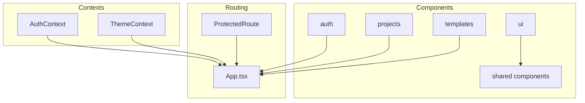
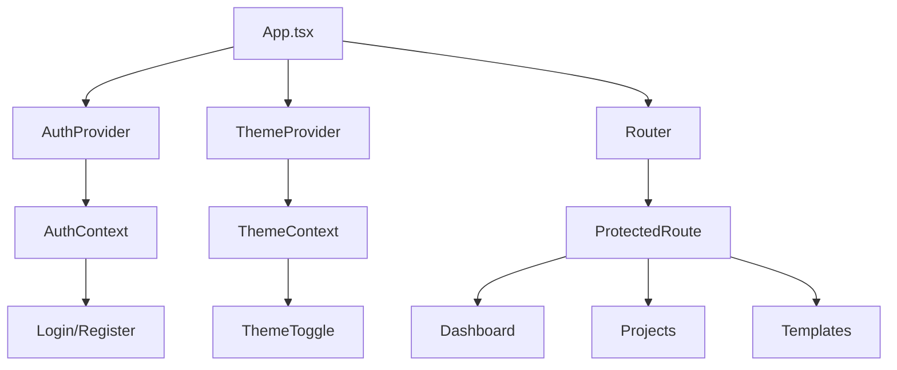
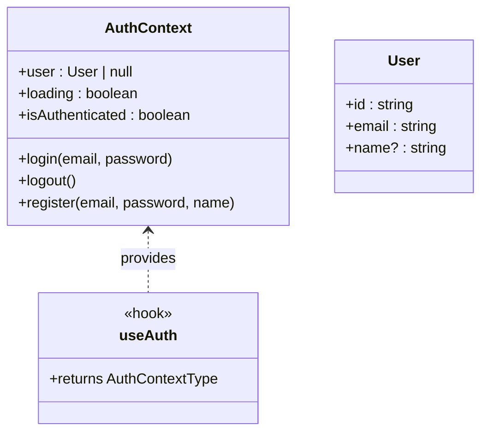
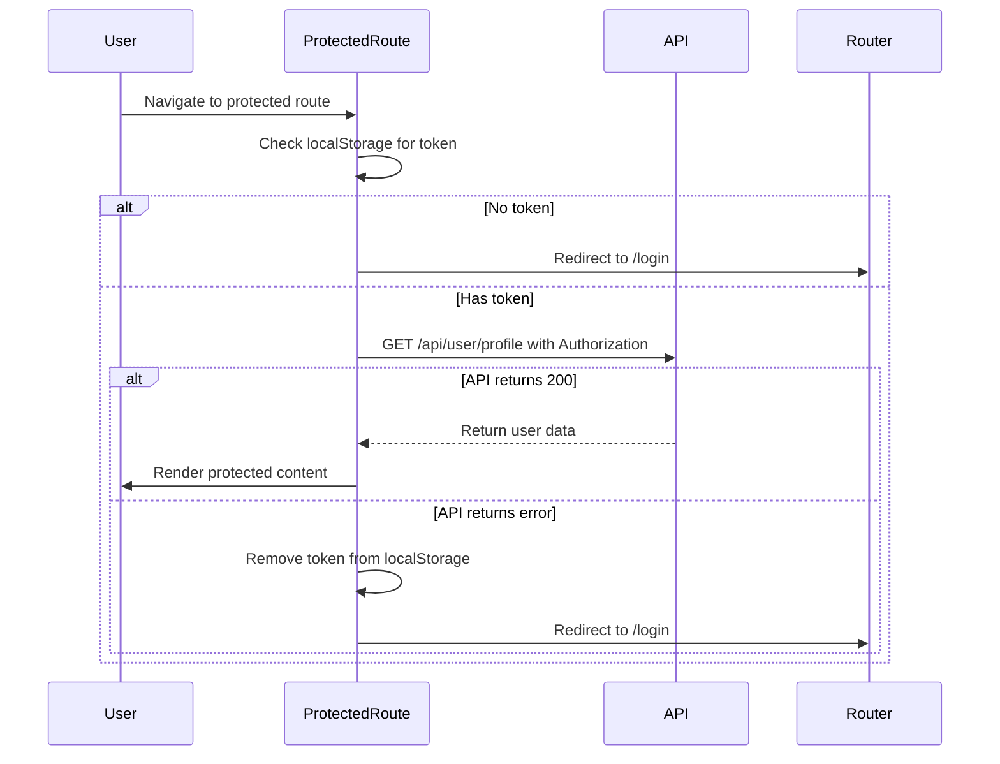
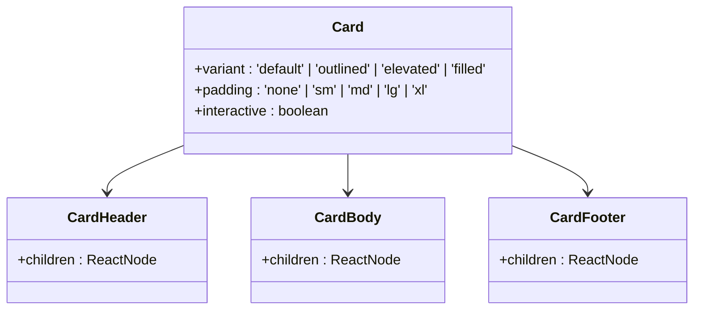
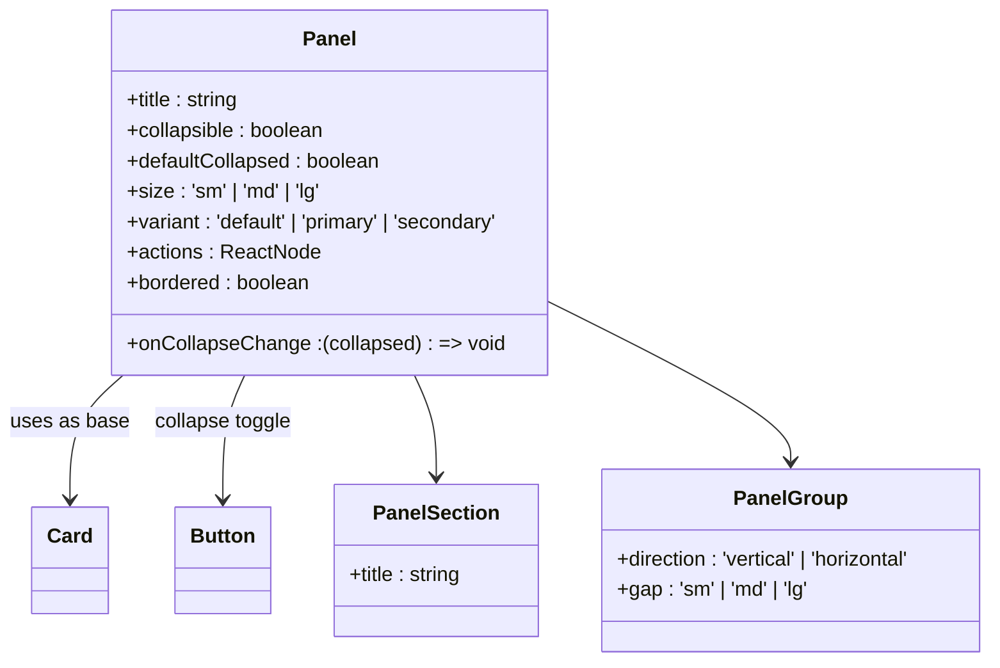
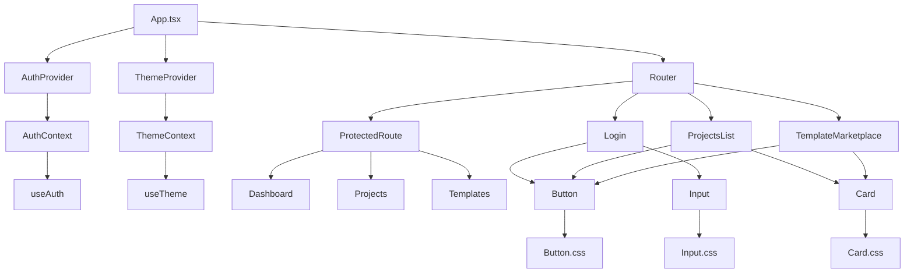

# Frontend Architecture

<cite>
**Referenced Files in This Document**   
- [AuthContext.tsx](file://pikzels-clone\client\src\contexts\AuthContext.tsx)
- [ThemeContext.tsx](file://pikzels-clone\client\src\contexts\ThemeContext.tsx)
- [ProtectedRoute.tsx](file://pikzels-clone\client\src\components\ProtectedRoute.tsx)
- [Button.tsx](file://pikzels-clone\client\src\components\ui\Button.tsx)
- [Card.tsx](file://pikzels-clone\client\src\components\ui\Card.tsx)
- [Input.tsx](file://pikzels-clone\client\src\components\ui\Input.tsx)
- [Panel.tsx](file://pikzels-clone\client\src\components\ui\Panel.tsx)
- [Login.tsx](file://pikzels-clone\client\src\components\auth\Login.tsx)
- [ProjectsList.tsx](file://pikzels-clone\client\src\components\projects\ProjectsList.tsx)
- [TemplateMarketplace.tsx](file://pikzels-clone\client\src\components\templates\TemplateMarketplace.tsx)
</cite>

## Table of Contents
1. [Introduction](#introduction)
2. [Project Structure](#project-structure)
3. [Core Components](#core-components)
4. [Architecture Overview](#architecture-overview)
5. [Detailed Component Analysis](#detailed-component-analysis)
6. [Dependency Analysis](#dependency-analysis)
7. [Performance Considerations](#performance-considerations)
8. [Troubleshooting Guide](#troubleshooting-guide)
9. [Conclusion](#conclusion)

## Introduction
This document provides comprehensive architectural documentation for the frontend of Thumbnail Maker Studio, a React-based application designed for creating and managing thumbnails. The architecture is organized around feature-based component structure, global state management using React Context API, a reusable UI component library, and React Router for navigation. The system emphasizes maintainability, scalability, and design consistency through well-defined patterns and reusable components.

## Project Structure

The frontend application follows a feature-based organization within the `src/components` directory, grouping components by functional areas such as authentication, projects, templates, and UI elements. Shared utility components are organized under the `ui` subdirectory, while global state management contexts are maintained in the `contexts` directory.



**Diagram sources**
- [AuthContext.tsx](file://pikzels-clone\client\src\contexts\AuthContext.tsx#L1-L145)
- [ThemeContext.tsx](file://pikzels-clone\client\src\contexts\ThemeContext.tsx#L1-L122)
- [App.tsx](file://pikzels-clone\client\src\App.tsx#L1-L50)

**Section sources**
- [AuthContext.tsx](file://pikzels-clone\client\src\contexts\AuthContext.tsx#L1-L145)
- [ThemeContext.tsx](file://pikzels-clone\client\src\contexts\ThemeContext.tsx#L1-L122)

## Core Components

The application's core components are organized by feature domains, enabling clear separation of concerns and maintainable code structure. The authentication components handle user login, registration, and password recovery. Project components manage project creation, listing, and editing. Template components facilitate template marketplace functionality and creation. The UI components provide a consistent design system across the application.

**Section sources**
- [Login.tsx](file://pikzels-clone\client\src\components\auth\Login.tsx#L1-L129)
- [ProjectsList.tsx](file://pikzels-clone\client\src\components\projects\ProjectsList.tsx#L1-L229)
- [TemplateMarketplace.tsx](file://pikzels-clone\client\src\components\templates\TemplateMarketplace.tsx#L1-L253)

## Architecture Overview

The frontend architecture implements a component-based React application with global state management through Context API. The application bootstraps with `App.tsx` as the entry point, which wraps the application with `AuthProvider` and `ThemeProvider` to make authentication and theme state available throughout the component tree. React Router handles navigation between different views, with `ProtectedRoute` components ensuring authentication requirements are met before rendering protected content.



**Diagram sources**
- [App.tsx](file://pikzels-clone\client\src\App.tsx#L1-L50)
- [AuthContext.tsx](file://pikzels-clone\client\src\contexts\AuthContext.tsx#L1-L145)
- [ThemeContext.tsx](file://pikzels-clone\client\src\contexts\ThemeContext.tsx#L1-L122)
- [ProtectedRoute.tsx](file://pikzels-clone\client\src\components\ProtectedRoute.tsx#L1-L68)

## Detailed Component Analysis

### Authentication Context Analysis
The `AuthContext` provides a centralized authentication state management system, exposing user information, authentication status, and authentication methods (login, logout, register) to all components through the `useAuth` hook. The context checks for existing authentication tokens on initialization and maintains user session state across the application.



**Diagram sources**
- [AuthContext.tsx](file://pikzels-clone\client\src\contexts\AuthContext.tsx#L1-L145)

**Section sources**
- [AuthContext.tsx](file://pikzels-clone\client\src\contexts\AuthContext.tsx#L1-L145)

### Theme Context Analysis
The `ThemeContext` manages the application's visual theme, supporting both light and dark modes. It detects user preferences from system settings or stored user preferences, applies the appropriate CSS classes to the document, and provides a `toggleTheme` function to switch between themes. The context also persists user theme preferences to the backend when authenticated.

```mermaid
classDiagram
class ThemeContext {
+theme : 'light' | 'dark'
+toggleTheme()
}
class useTheme {
<<hook>>
+returns ThemeContextType
}
ThemeContext <.. useTheme : provides
ThemeContext --> "localStorage" : stores preference
ThemeContext --> "API" : saves user settings
```

**Diagram sources**
- [ThemeContext.tsx](file://pikzels-clone\client\src\contexts\ThemeContext.tsx#L1-L122)

**Section sources**
- [ThemeContext.tsx](file://pikzels-clone\client\src\contexts\ThemeContext.tsx#L1-L122)

### Protected Route Analysis
The `ProtectedRoute` component implements authentication guarding for routes that require user login. It checks for valid authentication tokens and user profile access, displaying loading states during verification and redirecting unauthenticated users to the login page. This pattern ensures that sensitive application areas are only accessible to authenticated users.



**Diagram sources**
- [ProtectedRoute.tsx](file://pikzels-clone\client\src\components\ProtectedRoute.tsx#L1-L68)

**Section sources**
- [ProtectedRoute.tsx](file://pikzels-clone\client\src\components\ProtectedRoute.tsx#L1-L68)

### UI Component Library Analysis
The UI component library provides a consistent design system through reusable components such as Button, Card, Input, and Panel. These components support various variants, sizes, and states, enabling flexible composition while maintaining visual consistency. The components are designed with accessibility in mind, including proper ARIA attributes and keyboard navigation support.

#### Button Component
```mermaid
classDiagram
class Button {
+variant : 'primary' | 'secondary' | 'ghost' | 'danger' | 'success'
+size : 'sm' | 'md' | 'lg'
+loading : boolean
+fullWidth : boolean
+leftIcon : ReactNode
+rightIcon : ReactNode
+disabled : boolean
}
Button --> "Spinner" : shows when loading
Button --> "Icons" : optional left/right
```

#### Card Component


#### Input Component
```mermaid
classDiagram
class Input {
+size : 'sm' | 'md' | 'lg'
+variant : 'default' | 'filled' | 'borderless'
+error : boolean
+success : boolean
+label : string
+helperText : string
+errorMessage : string
+leftIcon : ReactNode
+rightIcon : ReactNode
}
Input --> "Label" : optional
Input --> "Helper Text" : below input
Input --> "Error Message" : replaces helper
Input --> "Icons" : left/right
```

#### Panel Component


**Diagram sources**
- [Button.tsx](file://pikzels-clone\client\src\components\ui\Button.tsx#L1-L108)
- [Card.tsx](file://pikzels-clone\client\src\components\ui\Card.tsx#L1-L94)
- [Input.tsx](file://pikzels-clone\client\src\components\ui\Input.tsx#L1-L150)
- [Panel.tsx](file://pikzels-clone\client\src\components\ui\Panel.tsx#L1-L146)

**Section sources**
- [Button.tsx](file://pikzels-clone\client\src\components\ui\Button.tsx#L1-L108)
- [Card.tsx](file://pikzels-clone\client\src\components\ui\Card.tsx#L1-L94)
- [Input.tsx](file://pikzels-clone\client\src\components\ui\Input.tsx#L1-L150)
- [Panel.tsx](file://pikzels-clone\client\src\components\ui\Panel.tsx#L1-L146)

## Dependency Analysis

The frontend architecture demonstrates a well-structured dependency graph with clear separation of concerns. The core dependencies flow from the application root through context providers to feature components, with UI components serving as shared dependencies across all features.



**Diagram sources**
- [App.tsx](file://pikzels-clone\client\src\App.tsx#L1-L50)
- [AuthContext.tsx](file://pikzels-clone\client\src\contexts\AuthContext.tsx#L1-L145)
- [ThemeContext.tsx](file://pikzels-clone\client\src\contexts\ThemeContext.tsx#L1-L122)
- [ProtectedRoute.tsx](file://pikzels-clone\client\src\components\ProtectedRoute.tsx#L1-L68)
- [Login.tsx](file://pikzels-clone\client\src\components\auth\Login.tsx#L1-L129)
- [ProjectsList.tsx](file://pikzels-clone\client\src\components\projects\ProjectsList.tsx#L1-L229)
- [TemplateMarketplace.tsx](file://pikzels-clone\client\src\components\templates\TemplateMarketplace.tsx#L1-L253)

**Section sources**
- [App.tsx](file://pikzels-clone\client\src\App.tsx#L1-L50)
- [AuthContext.tsx](file://pikzels-clone\client\src\contexts\AuthContext.tsx#L1-L145)
- [ThemeContext.tsx](file://pikzels-clone\client\src\contexts\ThemeContext.tsx#L1-L122)

## Performance Considerations

The application implements several performance optimization techniques to ensure responsive user experience:

1. **Lazy Loading**: Route-based code splitting can be implemented to load only necessary code for the current view.
2. **Memoization**: Components can use React.memo to prevent unnecessary re-renders when props haven't changed.
3. **Efficient State Management**: Context API is used judiciously to avoid unnecessary re-renders of the entire component tree.
4. **Optimized API Calls**: The ProtectedRoute component minimizes API calls by checking localStorage first before making network requests.
5. **Conditional Rendering**: Components like TemplateMarketplace only render content when authentication is confirmed.

Additional performance improvements could include:
- Implementing React.lazy for route components
- Using useMemo and useCallback hooks in complex components
- Adding pagination to ProjectsList and TemplateMarketplace for large datasets
- Implementing debouncing for search inputs

**Section sources**
- [ProtectedRoute.tsx](file://pikzels-clone\client\src\components\ProtectedRoute.tsx#L1-L68)
- [TemplateMarketplace.tsx](file://pikzels-clone\client\src\components\templates\TemplateMarketplace.tsx#L1-L253)
- [ProjectsList.tsx](file://pikzels-clone\client\src\components\projects\ProjectsList.tsx#L1-L229)

## Troubleshooting Guide

Common issues and their solutions in the frontend architecture:

1. **Authentication State Not Persisting**
   - Verify localStorage token is being set correctly in AuthContext
   - Check browser storage permissions
   - Ensure API endpoints are correctly handling authentication

2. **Theme Not Applying Correctly**
   - Verify ThemeContext is properly wrapped in App.tsx
   - Check if 'dark' class is being added to documentElement
   - Ensure dark-mode.css is imported and contains correct styles

3. **Protected Routes Not Redirecting**
   - Confirm ProtectedRoute is wrapping the route component
   - Check network requests in browser dev tools for authentication API calls
   - Verify token is present in localStorage

4. **UI Components Not Rendering Properly**
   - Ensure CSS files are imported in component files
   - Check for CSS class name conflicts
   - Verify component props are correctly passed

5. **Context Not Available**
   - Confirm provider components are wrapped around the application
   - Check for multiple instances of React in node_modules
   - Verify useAuth and useTheme hooks are used within provider scope

**Section sources**
- [AuthContext.tsx](file://pikzels-clone\client\src\contexts\AuthContext.tsx#L1-L145)
- [ThemeContext.tsx](file://pikzels-clone\client\src\contexts\ThemeContext.tsx#L1-L122)
- [ProtectedRoute.tsx](file://pikzels-clone\client\src\components\ProtectedRoute.tsx#L1-L68)

## Conclusion

The frontend architecture of Thumbnail Maker Studio demonstrates a well-structured React application with clear separation of concerns, reusable components, and effective state management. The feature-based component organization enhances maintainability, while the Context API provides a clean solution for global state management without requiring external libraries. The UI component library ensures design consistency across the application, and the protected route pattern enforces authentication requirements. Future improvements could include implementing TypeScript interfaces for better type safety, adding unit tests for critical components, and enhancing performance with additional optimization techniques.