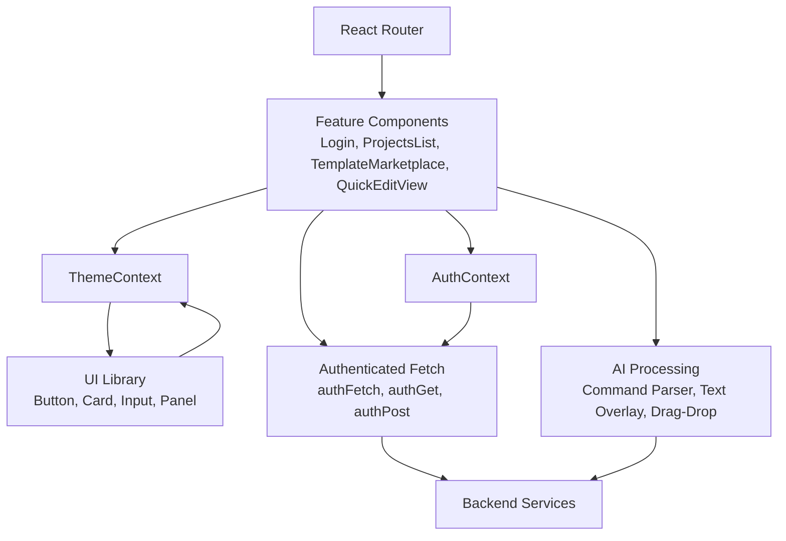
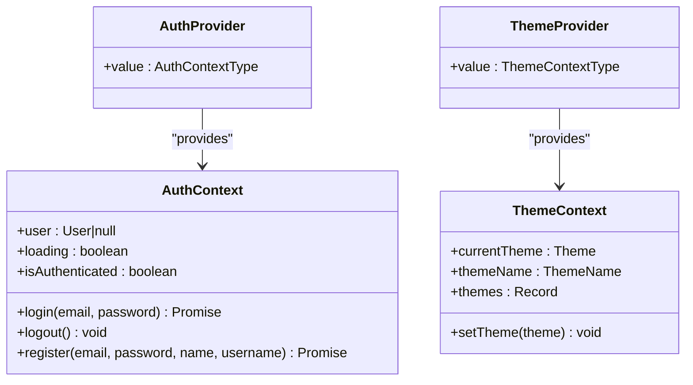
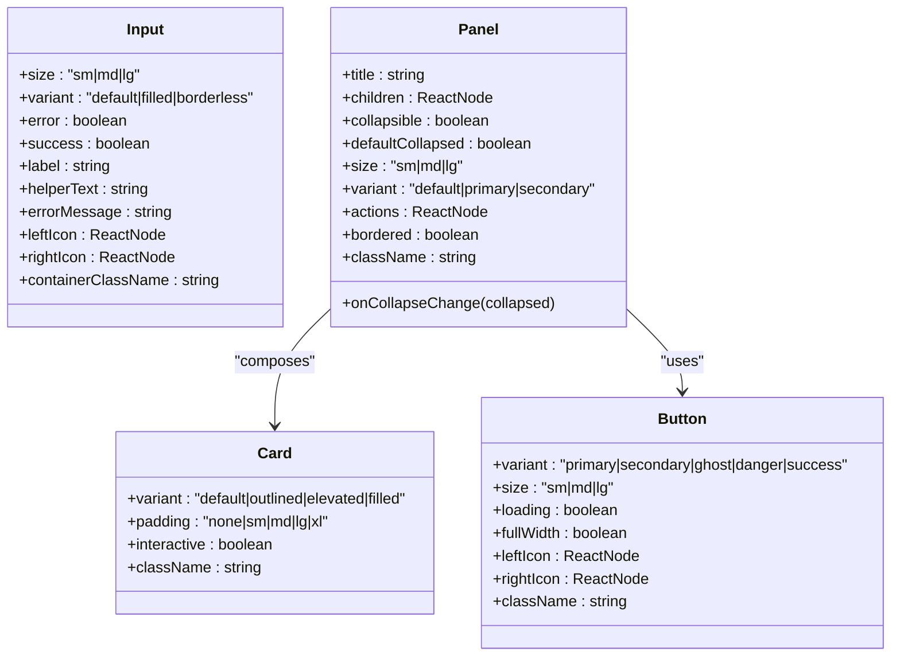
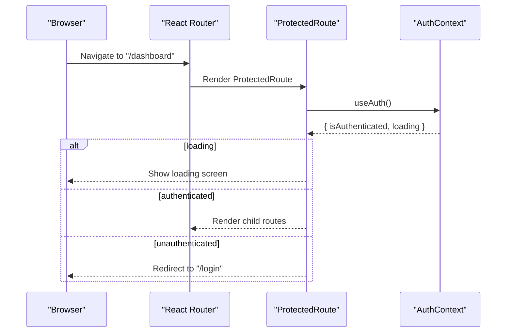
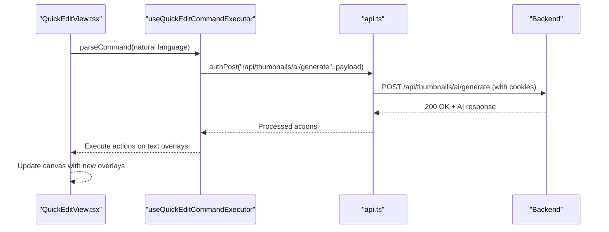
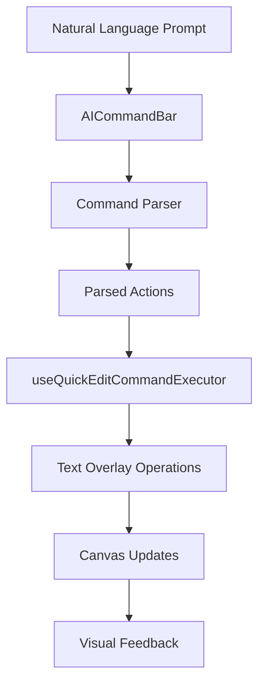
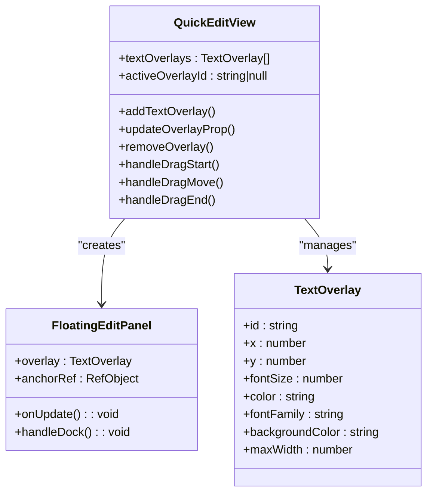
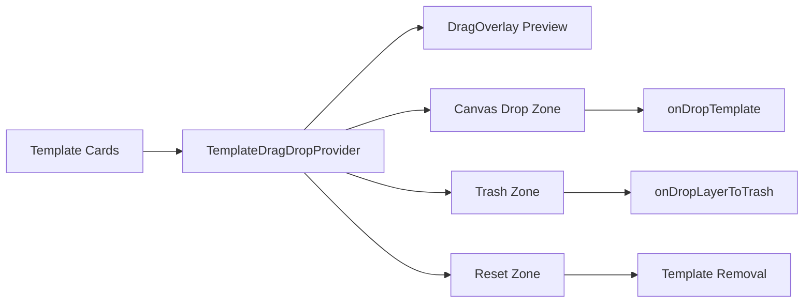
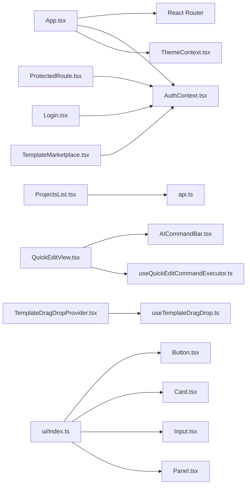

# Frontend Architecture

<cite>
**Referenced Files in This Document**
- [App.tsx](file://pikzels-clone/client/src/App.tsx)
- [index.tsx](file://pikzels-clone/client/src/index.tsx)
- [AuthContext.tsx](file://pikzels-clone/client/src/contexts/AuthContext.tsx)
- [ThemeContext.tsx](file://pikzels-clone/client/src/contexts/ThemeContext.tsx)
- [ProtectedRoute.tsx](file://pikzels-clone/client/src/components/ProtectedRoute.tsx)
- [Button.tsx](file://pikzels-clone/client/src/components/ui/Button.tsx)
- [Card.tsx](file://pikzels-clone/client/src/components/ui/Card.tsx)
- [Input.tsx](file://pikzels-clone/client/src/components/ui/Input.tsx)
- [Panel.tsx](file://pikzels-clone/client/src/components/ui/Panel.tsx)
- [ui/index.ts](file://pikzels-clone/client/src/components/ui/index.ts)
- [Login.tsx](file://pikzels-clone/client/src/components/auth/Login.tsx)
- [ProjectsList.tsx](file://pikzels-clone/client/src/components/projects/ProjectsList.tsx)
- [TemplateMarketplace.tsx](file://pikzels-clone/client/src/components/templates/TemplateMarketplace.tsx)
- [api.ts](file://pikzels-clone/client/src/utils/api.ts)
- [vite.config.ts](file://pikzels-clone/client/vite.config.ts)
- [QuickEditView.tsx](file://pikzels-clone/client/src/components/dashboard/QuickEditView.tsx)
- [useQuickEditCommandExecutor.ts](file://pikzels-clone/client/src/components/dashboard/hooks/useQuickEditCommandExecutor.ts)
- [AICommandBar.tsx](file://pikzels-clone/client/src/components/editor/components/AICommandBar.tsx)
- [TemplateDragDropProvider.tsx](file://pikzels-clone/client/src/features/drag-drop/components/TemplateDragDropProvider.tsx)
- [useTemplateDragDrop.ts](file://pikzels-clone/client/src/features/drag-drop/hooks/useTemplateDragDrop.ts)
- [TemplateDragDropProvider.test.tsx](file://pikzels-clone/client/src/features/drag-drop/__tests__/TemplateDragDropProvider.test.tsx)
</cite>

## Update Summary
**Changes Made**
- Enhanced QuickEditView component documentation to reflect its transformation into an AI-powered design studio
- Added comprehensive coverage of advanced text overlay management, floating edit panels, and drag-and-drop positioning
- Updated drag-and-drop system documentation to include the new TemplateDragDropProvider with comprehensive accessibility support
- Added AI command bar integration and natural language processing capabilities
- Expanded component composition patterns and state management examples

## Table of Contents
1. [Introduction](#introduction)
2. [Project Structure](#project-structure)
3. [Core Components](#core-components)
4. [Architecture Overview](#architecture-overview)
5. [Detailed Component Analysis](#detailed-component-analysis)
6. [Advanced AI-Powered Features](#advanced-ai-powered-features)
7. [Drag-and-Drop System Enhancement](#drag-and-drop-system-enhancement)
8. [Dependency Analysis](#dependency-analysis)
9. [Performance Considerations](#performance-considerations)
10. [Troubleshooting Guide](#troubleshooting-guide)
11. [Conclusion](#conclusion)
12. [Appendices](#appendices)

## Introduction
This document describes the frontend architecture of Thumbnail Maker Studio, a React-based application featuring an AI-powered design studio. The architecture has evolved to include sophisticated text overlay management, floating edit panels, comprehensive drag-and-drop positioning, and advanced AI integration capabilities. It explains the feature-based component organization (auth, projects, templates, ui, dashboard), the state management pattern using React Context API (AuthContext and ThemeContext), the UI component library built around reusable elements (Button, Card, Input, Panel), the routing strategy using React Router with protected routes, and the data flow from UI components to API calls and backend services.

## Project Structure
The client-side application is organized by feature and shared concerns with enhanced AI capabilities:
- Feature folders:
  - Authentication: login, registration, password reset, verification
  - Projects: list, detail, forms
  - Templates: marketplace and creation modals
  - Dashboard: AI-powered QuickEditView with advanced text overlay management
  - Drag-and-drop: comprehensive template management system
- Shared components and contexts:
  - UI library (Button, Card, Input, Panel, Navigation, Slider, StatCard, Toolbar)
  - Global contexts (AuthContext, ThemeContext)
  - Routing and protected routes
  - AI command bar for natural language processing
- Utilities:
  - API wrappers for authenticated requests
  - AI text generation and processing
- Build and environment:
  - Vite configuration with React plugin and Tailwind CSS integration

```mermaid
graph TB
subgraph "Entry Point"
IDX["index.tsx"]
APP["App.tsx"]
end
subgraph "Routing Layer"
ROUTER["React Router"]
PROTECT["ProtectedRoute.tsx"]
end
subgraph "Global State"
AUTHCTX["AuthContext.tsx"]
THEMECTX["ThemeContext.tsx"]
end
subgraph "Feature: Auth"
LOGIN["Login.tsx"]
end
subgraph "Feature: Dashboard"
QEVIEW["QuickEditView.tsx"]
AICMD["AICommandBar.tsx"]
END
subgraph "Feature: Drag-Drop"
TDDPROV["TemplateDragDropProvider.tsx"]
UTDP["useTemplateDragDrop.ts"]
END
subgraph "Feature: Projects"
PLIST["ProjectsList.tsx"]
end
subgraph "Feature: Templates"
TMPL["TemplateMarketplace.tsx"]
END
subgraph "UI Library"
BTN["Button.tsx"]
CARD["Card.tsx"]
INPUT["Input.tsx"]
PANEL["Panel.tsx"]
UIIDX["ui/index.ts"]
end
subgraph "Utilities"
API["api.ts"]
END
IDX --> APP
APP --> ROUTER
ROUTER --> PROTECT
PROTECT --> AUTHCTX
PROTECT --> THEMECTX
QEVIEW --> AICMD
QEVIEW --> AUTHCTX
TDDPROV --> UTDP
UIIDX --> BTN
UIIDX --> CARD
UIIDX --> INPUT
UIIDX --> PANEL
```

**Diagram sources**
- [index.tsx:1-15](file://pikzels-clone/client/src/index.tsx#L1-L15)
- [App.tsx:1-497](file://pikzels-clone/client/src/App.tsx#L1-L497)
- [ProtectedRoute.tsx:1-30](file://pikzels-clone/client/src/components/ProtectedRoute.tsx#L1-L30)
- [AuthContext.tsx:1-137](file://pikzels-clone/client/src/contexts/AuthContext.tsx#L1-L137)
- [ThemeContext.tsx:1-380](file://pikzels-clone/client/src/contexts/ThemeContext.tsx#L1-L380)
- [Login.tsx:1-189](file://pikzels-clone/client/src/components/auth/Login.tsx#L1-L189)
- [ProjectsList.tsx:1-217](file://pikzels-clone/client/src/components/projects/ProjectsList.tsx#L1-L217)
- [TemplateMarketplace.tsx:1-315](file://pikzels-clone/client/src/components/templates/TemplateMarketplace.tsx#L1-L315)
- [QuickEditView.tsx:1-3587](file://pikzels-clone/client/src/components/dashboard/QuickEditView.tsx#L1-L3587)
- [AICommandBar.tsx:1-303](file://pikzels-clone/client/src/components/editor/components/AICommandBar.tsx#L1-L303)
- [TemplateDragDropProvider.tsx:1-506](file://pikzels-clone/client/src/features/drag-drop/components/TemplateDragDropProvider.tsx#L1-L506)
- [useTemplateDragDrop.ts:1-176](file://pikzels-clone/client/src/features/drag-drop/hooks/useTemplateDragDrop.ts#L1-L176)
- [Button.tsx:1-109](file://pikzels-clone/client/src/components/ui/Button.tsx#L1-L109)
- [Card.tsx:1-95](file://pikzels-clone/client/src/components/ui/Card.tsx#L1-L95)
- [Input.tsx:1-151](file://pikzels-clone/client/src/components/ui/Input.tsx#L1-L151)
- [Panel.tsx:1-146](file://pikzels-clone/client/src/components/ui/Panel.tsx#L1-L146)
- [ui/index.ts:1-59](file://pikzels-clone/client/src/components/ui/index.ts#L1-L59)
- [api.ts:1-185](file://pikzels-clone/client/src/utils/api.ts#L1-L185)

**Section sources**
- [App.tsx:1-497](file://pikzels-clone/client/src/App.tsx#L1-L497)
- [index.tsx:1-15](file://pikzels-clone/client/src/index.tsx#L1-L15)

## Core Components
- React Router configuration defines public and protected routes, nested dashboards, and admin routes. ProtectedRoute enforces authentication and loading states.
- AuthContext manages user session, login/logout/register flows, and integrates with backend via authenticated fetch helpers. It initializes token expiration timing for proactive refresh.
- ThemeContext provides a theme switching mechanism with persistent storage and CSS variable updates for dynamic theming.
- UI library exports reusable components (Button, Card, Input, Panel) with consistent props and composition patterns.
- QuickEditView transforms from a simple thumbnail editor to a comprehensive AI-powered design studio with advanced text overlay management, floating edit panels, and sophisticated styling controls.
- TemplateDragDropProvider offers comprehensive drag-and-drop functionality with template card management, group handles, reset zones, and extensive accessibility support.

Key implementation references:
- Routing and nested routes: [App.tsx:130-497](file://pikzels-clone/client/src/App.tsx#L130-L497)
- Protected route logic: [ProtectedRoute.tsx:9-27](file://pikzels-clone/client/src/components/ProtectedRoute.tsx#L9-L27)
- Auth provider and hooks: [AuthContext.tsx:36-128](file://pikzels-clone/client/src/contexts/AuthContext.tsx#L36-L128)
- Theme provider and persistence: [ThemeContext.tsx:316-371](file://pikzels-clone/client/src/contexts/ThemeContext.tsx#L316-L371)
- UI exports and composition: [ui/index.ts:8-59](file://pikzels-clone/client/src/components/ui/index.ts#L8-L59)
- QuickEditView advanced features: [QuickEditView.tsx:1-3587](file://pikzels-clone/client/src/components/dashboard/QuickEditView.tsx#L1-L3587)
- Template drag-drop system: [TemplateDragDropProvider.tsx:1-506](file://pikzels-clone/client/src/features/drag-drop/components/TemplateDragDropProvider.tsx#L1-L506)

**Section sources**
- [App.tsx:130-497](file://pikzels-clone/client/src/App.tsx#L130-L497)
- [ProtectedRoute.tsx:1-30](file://pikzels-clone/client/src/components/ProtectedRoute.tsx#L1-L30)
- [AuthContext.tsx:1-137](file://pikzels-clone/client/src/contexts/AuthContext.tsx#L1-L137)
- [ThemeContext.tsx:1-380](file://pikzels-clone/client/src/contexts/ThemeContext.tsx#L1-L380)
- [ui/index.ts:1-59](file://pikzels-clone/client/src/components/ui/index.ts#L1-L59)
- [QuickEditView.tsx:1-3587](file://pikzels-clone/client/src/components/dashboard/QuickEditView.tsx#L1-L3587)
- [TemplateDragDropProvider.tsx:1-506](file://pikzels-clone/client/src/features/drag-drop/components/TemplateDragDropProvider.tsx#L1-L506)

## Architecture Overview
The frontend follows a layered architecture with enhanced AI capabilities:
- Presentation layer: Feature components (auth, projects, templates, dashboard with QuickEditView) and UI library components
- State layer: React Context providers (AuthContext, ThemeContext)
- Data access layer: Authenticated fetch utilities (authFetch, authGet, authPost, etc.) with proactive token refresh
- AI processing layer: Natural language command parsing, text overlay management, and drag-and-drop positioning
- Routing layer: React Router with nested routes and protected route guards



**Diagram sources**
- [App.tsx:130-497](file://pikzels-clone/client/src/App.tsx#L130-L497)
- [AuthContext.tsx:36-128](file://pikzels-clone/client/src/contexts/AuthContext.tsx#L36-L128)
- [ThemeContext.tsx:316-371](file://pikzels-clone/client/src/contexts/ThemeContext.tsx#L316-L371)
- [api.ts:75-147](file://pikzels-clone/client/src/utils/api.ts#L75-L147)
- [QuickEditView.tsx:1-3587](file://pikzels-clone/client/src/components/dashboard/QuickEditView.tsx#L1-L3587)
- [TemplateDragDropProvider.tsx:1-506](file://pikzels-clone/client/src/features/drag-drop/components/TemplateDragDropProvider.tsx#L1-L506)

## Detailed Component Analysis

### State Management Pattern: AuthContext and ThemeContext
- AuthContext encapsulates:
  - User profile retrieval and session initialization
  - Login, register, logout flows
  - Loading state and authentication gating
  - Token expiration tracking and proactive refresh triggers
- ThemeContext encapsulates:
  - Multiple named themes with color palettes, gradients, effects, and animations
  - Persistent theme selection via localStorage
  - Dynamic CSS variables applied to document root for runtime theming



**Diagram sources**
- [AuthContext.tsx:17-128](file://pikzels-clone/client/src/contexts/AuthContext.tsx#L17-L128)
- [ThemeContext.tsx:303-371](file://pikzels-clone/client/src/contexts/ThemeContext.tsx#L303-L371)

**Section sources**
- [AuthContext.tsx:1-137](file://pikzels-clone/client/src/contexts/AuthContext.tsx#L1-L137)
- [ThemeContext.tsx:1-380](file://pikzels-clone/client/src/contexts/ThemeContext.tsx#L1-L380)

### UI Component Library: Button, Card, Input, Panel
- Button supports variants, sizes, loading states, icons, and full-width layout.
- Card supports variants, padding, interactivity, and sub-components (CardHeader, CardBody, CardFooter).
- Input supports labels, helper/error messages, icons, and accessibility attributes.
- Panel composes Card and Button to provide collapsible sections with actions and optional borders.



**Diagram sources**
- [Button.tsx:4-109](file://pikzels-clone/client/src/components/ui/Button.tsx#L4-L109)
- [Card.tsx:4-95](file://pikzels-clone/client/src/components/ui/Card.tsx#L4-L95)
- [Input.tsx:4-151](file://pikzels-clone/client/src/components/ui/Input.tsx#L4-L151)
- [Panel.tsx:6-146](file://pikzels-clone/client/src/components/ui/Panel.tsx#L6-L146)

**Section sources**
- [Button.tsx:1-109](file://pikzels-clone/client/src/components/ui/Button.tsx#L1-L109)
- [Card.tsx:1-95](file://pikzels-clone/client/src/components/ui/Card.tsx#L1-L95)
- [Input.tsx:1-151](file://pikzels-clone/client/src/components/ui/Input.tsx#L1-L151)
- [Panel.tsx:1-146](file://pikzels-clone/client/src/components/ui/Panel.tsx#L1-L146)
- [ui/index.ts:1-59](file://pikzels-clone/client/src/components/ui/index.ts#L1-L59)

### Routing Mechanism and Protected Routes
- App.tsx configures public routes (landing, auth, content), protected routes under /dashboard and related paths, and admin routes with permission-aware nested routes.
- ProtectedRoute checks authentication state and renders a loading indicator while AuthContext validates the session. Unauthenticated users are redirected to login.



**Diagram sources**
- [App.tsx:180-214](file://pikzels-clone/client/src/App.tsx#L180-L214)
- [ProtectedRoute.tsx:9-27](file://pikzels-clone/client/src/components/ProtectedRoute.tsx#L9-L27)
- [AuthContext.tsx:36-128](file://pikzels-clone/client/src/contexts/AuthContext.tsx#L36-L128)

**Section sources**
- [App.tsx:130-497](file://pikzels-clone/client/src/App.tsx#L130-L497)
- [ProtectedRoute.tsx:1-30](file://pikzels-clone/client/src/components/ProtectedRoute.tsx#L1-L30)

### Data Flow: UI → API → Backend
- UI components trigger actions (e.g., login form submission, AI command processing).
- AuthContext orchestrates login/register/logout and delegates network calls to authenticated fetch utilities.
- authFetch automatically sends cookies for authentication, proactively refreshes tokens before expiration, and retries on 401 responses.
- QuickEditView processes AI commands through useQuickEditCommandExecutor hook with natural language parsing and execution.



**Diagram sources**
- [QuickEditView.tsx:767-792](file://pikzels-clone/client/src/components/dashboard/QuickEditView.tsx#L767-L792)
- [useQuickEditCommandExecutor.ts:71-73](file://pikzels-clone/client/src/components/dashboard/hooks/useQuickEditCommandExecutor.ts#L71-L73)
- [api.ts:75-157](file://pikzels-clone/client/src/utils/api.ts#L75-L157)

**Section sources**
- [QuickEditView.tsx:1-3587](file://pikzels-clone/client/src/components/dashboard/QuickEditView.tsx#L1-L3587)
- [useQuickEditCommandExecutor.ts:1-78](file://pikzels-clone/client/src/components/dashboard/hooks/useQuickEditCommandExecutor.ts#L1-L78)
- [AuthContext.tsx:1-137](file://pikzels-clone/client/src/contexts/AuthContext.tsx#L1-L137)
- [api.ts:1-185](file://pikzels-clone/client/src/utils/api.ts#L1-L185)

### Example: Component Composition and Prop Drilling Patterns
- UI library composition:
  - Panel composes Card and Button to provide collapsible sections with actions.
  - Card exposes sub-components (CardHeader, CardBody, CardFooter) to encourage structured layouts.
- Prop drilling avoidance:
  - AuthContext and ThemeContext eliminate prop drilling by providing global state via hooks.
  - UI components accept className and variant props to align with design system without deep nesting.
- QuickEditView composition patterns:
  - FloatingEditPanel composes with SmartTextItem for advanced text overlay management.
  - AICommandBar integrates seamlessly with QuickEditView for natural language processing.

References:
- Panel composition: [Panel.tsx:61-105](file://pikzels-clone/client/src/components/ui/Panel.tsx#L61-L105)
- Card sub-components: [Card.tsx:48-94](file://pikzels-clone/client/src/components/ui/Card.tsx#L48-L94)
- UI exports: [ui/index.ts:8-59](file://pikzels-clone/client/src/components/ui/index.ts#L8-L59)
- FloatingEditPanel: [QuickEditView.tsx:315-557](file://pikzels-clone/client/src/components/dashboard/QuickEditView.tsx#L315-L557)
- AICommandBar integration: [QuickEditView.tsx:56-57](file://pikzels-clone/client/src/components/dashboard/QuickEditView.tsx#L56-L57)

**Section sources**
- [Panel.tsx:1-146](file://pikzels-clone/client/src/components/ui/Panel.tsx#L1-L146)
- [Card.tsx:1-95](file://pikzels-clone/client/src/components/ui/Card.tsx#L1-L95)
- [ui/index.ts:1-59](file://pikzels-clone/client/src/components/ui/index.ts#L1-L59)
- [QuickEditView.tsx:315-557](file://pikzels-clone/client/src/components/dashboard/QuickEditView.tsx#L315-L557)
- [AICommandBar.tsx:1-303](file://pikzels-clone/client/src/components/editor/components/AICommandBar.tsx#L1-L303)

### Example: Feature Component Patterns
- ProjectsList demonstrates:
  - Local state for items, loading, and errors
  - Authenticated fetch for data retrieval
  - Navigation to edit/detail views
- TemplateMarketplace demonstrates:
  - Normalization of heterogeneous data sources
  - Filtering by search and tags
  - Conditional rendering based on authentication state
- QuickEditView demonstrates:
  - Comprehensive state management for AI-powered design
  - Advanced text overlay manipulation with drag-and-drop positioning
  - Floating edit panels with sophisticated styling controls

References:
- ProjectsList: [ProjectsList.tsx:17-217](file://pikzels-clone/client/src/components/projects/ProjectsList.tsx#L17-L217)
- TemplateMarketplace: [TemplateMarketplace.tsx:24-315](file://pikzels-clone/client/src/components/templates/TemplateMarketplace.tsx#L24-L315)
- QuickEditView: [QuickEditView.tsx:1288-1395](file://pikzels-clone/client/src/components/dashboard/QuickEditView.tsx#L1288-L1395)

**Section sources**
- [ProjectsList.tsx:1-217](file://pikzels-clone/client/src/components/projects/ProjectsList.tsx#L1-L217)
- [TemplateMarketplace.tsx:1-315](file://pikzels-clone/client/src/components/templates/TemplateMarketplace.tsx#L1-L315)
- [QuickEditView.tsx:1-3587](file://pikzels-clone/client/src/components/dashboard/QuickEditView.tsx#L1-L3587)

## Advanced AI-Powered Features

### AI Command Processing System
The QuickEditView now incorporates a sophisticated AI command processing system that transforms natural language into structured editor actions:

- **Natural Language Parsing**: AICommandBar processes user prompts and converts them into structured actions
- **Command Execution**: useQuickEditCommandExecutor maps parsed actions to Quick Edit's text overlay operations
- **Context Building**: The system builds a simplified canvas context for LLM processing including current overlays and active selections
- **Action Mapping**: Supports text overlay creation, updates, and removal through AI commands



**Diagram sources**
- [AICommandBar.tsx:109-154](file://pikzels-clone/client/src/components/editor/components/AICommandBar.tsx#L109-L154)
- [useQuickEditCommandExecutor.ts:71-73](file://pikzels-clone/client/src/components/dashboard/hooks/useQuickEditCommandExecutor.ts#L71-L73)
- [QuickEditView.tsx:767-792](file://pikzels-clone/client/src/components/dashboard/QuickEditView.tsx#L767-L792)

**Section sources**
- [AICommandBar.tsx:1-303](file://pikzels-clone/client/src/components/editor/components/AICommandBar.tsx#L1-L303)
- [useQuickEditCommandExecutor.ts:1-78](file://pikzels-clone/client/src/components/dashboard/hooks/useQuickEditCommandExecutor.ts#L1-L78)
- [QuickEditView.tsx:1-3587](file://pikzels-clone/client/src/components/dashboard/QuickEditView.tsx#L1-L3587)

### Advanced Text Overlay Management
The QuickEditView provides comprehensive text overlay management with sophisticated positioning and styling capabilities:

- **Floating Edit Panels**: Draggable panels that spawn at Smart Text button locations with docking functionality
- **Drag-and-Drop Positioning**: Precise text overlay placement with pixel-perfect positioning
- **Advanced Styling Controls**: Font selection, color pickers, size sliders, and background options
- **Smart Text Items**: Interactive text overlay management with hover effects and quick actions



**Diagram sources**
- [QuickEditView.tsx:84-98](file://pikzels-clone/client/src/components/dashboard/QuickEditView.tsx#L84-L98)
- [QuickEditView.tsx:307-400](file://pikzels-clone/client/src/components/dashboard/QuickEditView.tsx#L307-L400)
- [QuickEditView.tsx:1288-1326](file://pikzels-clone/client/src/components/dashboard/QuickEditView.tsx#L1288-L1326)

**Section sources**
- [QuickEditView.tsx:1-3587](file://pikzels-clone/client/src/components/dashboard/QuickEditView.tsx#L1-L3587)

## Drag-and-Drop System Enhancement

### TemplateDragDropProvider Architecture
The new TemplateDragDropProvider offers comprehensive drag-and-drop functionality with bidirectional support:

- **Template-to-Canvas Operations**: Drag templates from the marketplace to the canvas with precise positioning
- **Canvas Layer Management**: Drag individual layers from the canvas to trash or reset zones
- **Accessibility Compliance**: WCAG 2.5.7 compliant with keyboard navigation and screen reader support
- **Visual Feedback**: DragOverlay provides real-time previews during drag operations



**Diagram sources**
- [TemplateDragDropProvider.tsx:224-402](file://pikzels-clone/client/src/features/drag-drop/components/TemplateDragDropProvider.tsx#L224-L402)
- [TemplateDragDropProvider.tsx:424-504](file://pikzels-clone/client/src/features/drag-drop/components/TemplateDragDropProvider.tsx#L424-L504)

### Comprehensive Accessibility Support
The drag-and-drop system includes extensive accessibility features:

- **Keyboard Navigation**: Space/Enter to pick, Arrow keys to move, Enter to drop, Escape to cancel
- **Screen Reader Announcements**: Assertive and polite announcements via aria-live regions
- **Non-Dragging Alternatives**: Click-to-place fallback for users who cannot use drag-and-drop
- **Position Tracking**: Real-time position updates with throttled performance optimization

**Section sources**
- [TemplateDragDropProvider.tsx:1-506](file://pikzels-clone/client/src/features/drag-drop/components/TemplateDragDropProvider.tsx#L1-L506)
- [useTemplateDragDrop.ts:1-176](file://pikzels-clone/client/src/features/drag-drop/hooks/useTemplateDragDrop.ts#L1-L176)
- [TemplateDragDropProvider.test.tsx:1-74](file://pikzels-clone/client/src/features/drag-drop/__tests__/TemplateDragDropProvider.test.tsx#L1-L74)

## Dependency Analysis
- App.tsx depends on:
  - React Router for routing
  - AuthProvider and ThemeProvider for global state
  - Feature components and pages including QuickEditView
- ProtectedRoute depends on AuthContext for authentication checks.
- UI components depend on ThemeContext indirectly via CSS variables and design tokens.
- API utilities depend on environment configuration and are consumed by AuthContext and feature components.
- QuickEditView depends on AICommandBar for natural language processing and useQuickEditCommandExecutor for action execution.
- TemplateDragDropProvider depends on useTemplateDragDrop hook for core drag-and-drop functionality.



**Diagram sources**
- [App.tsx:1-497](file://pikzels-clone/client/src/App.tsx#L1-L497)
- [ProtectedRoute.tsx:1-30](file://pikzels-clone/client/src/components/ProtectedRoute.tsx#L1-L30)
- [AuthContext.tsx:1-137](file://pikzels-clone/client/src/contexts/AuthContext.tsx#L1-L137)
- [ThemeContext.tsx:1-380](file://pikzels-clone/client/src/contexts/ThemeContext.tsx#L1-L380)
- [Login.tsx:1-189](file://pikzels-clone/client/src/components/auth/Login.tsx#L1-L189)
- [ProjectsList.tsx:1-217](file://pikzels-clone/client/src/components/projects/ProjectsList.tsx#L1-L217)
- [TemplateMarketplace.tsx:1-315](file://pikzels-clone/client/src/components/templates/TemplateMarketplace.tsx#L1-L315)
- [QuickEditView.tsx:1-3587](file://pikzels-clone/client/src/components/dashboard/QuickEditView.tsx#L1-L3587)
- [AICommandBar.tsx:1-303](file://pikzels-clone/client/src/components/editor/components/AICommandBar.tsx#L1-L303)
- [useQuickEditCommandExecutor.ts:1-78](file://pikzels-clone/client/src/components/dashboard/hooks/useQuickEditCommandExecutor.ts#L1-L78)
- [TemplateDragDropProvider.tsx:1-506](file://pikzels-clone/client/src/features/drag-drop/components/TemplateDragDropProvider.tsx#L1-L506)
- [useTemplateDragDrop.ts:1-176](file://pikzels-clone/client/src/features/drag-drop/hooks/useTemplateDragDrop.ts#L1-L176)
- [api.ts:1-185](file://pikzels-clone/client/src/utils/api.ts#L1-L185)
- [ui/index.ts:1-59](file://pikzels-clone/client/src/components/ui/index.ts#L1-L59)

**Section sources**
- [App.tsx:1-497](file://pikzels-clone/client/src/App.tsx#L1-L497)
- [ProtectedRoute.tsx:1-30](file://pikzels-clone/client/src/components/ProtectedRoute.tsx#L1-L30)
- [AuthContext.tsx:1-137](file://pikzels-clone/client/src/contexts/AuthContext.tsx#L1-L137)
- [ThemeContext.tsx:1-380](file://pikzels-clone/client/src/contexts/ThemeContext.tsx#L1-L380)
- [Login.tsx:1-189](file://pikzels-clone/client/src/components/auth/Login.tsx#L1-L189)
- [ProjectsList.tsx:1-217](file://pikzels-clone/client/src/components/projects/ProjectsList.tsx#L1-L217)
- [TemplateMarketplace.tsx:1-315](file://pikzels-clone/client/src/components/templates/TemplateMarketplace.tsx#L1-L315)
- [QuickEditView.tsx:1-3587](file://pikzels-clone/client/src/components/dashboard/QuickEditView.tsx#L1-L3587)
- [AICommandBar.tsx:1-303](file://pikzels-clone/client/src/components/editor/components/AICommandBar.tsx#L1-L303)
- [useQuickEditCommandExecutor.ts:1-78](file://pikzels-clone/client/src/components/dashboard/hooks/useQuickEditCommandExecutor.ts#L1-L78)
- [TemplateDragDropProvider.tsx:1-506](file://pikzels-clone/client/src/features/drag-drop/components/TemplateDragDropProvider.tsx#L1-L506)
- [useTemplateDragDrop.ts:1-176](file://pikzels-clone/client/src/features/drag-drop/hooks/useTemplateDragDrop.ts#L1-L176)
- [api.ts:1-185](file://pikzels-clone/client/src/utils/api.ts#L1-L185)
- [ui.ts#L1-L59:1-59](file://pikzels-clone/client/src/components/ui/index.ts#L1-L59)

## Performance Considerations
- Code splitting and lazy loading:
  - Split large feature routes (e.g., editor pages) into separate chunks to reduce initial bundle size. Use dynamic imports for heavy components like editors and analytics dashboards.
  - Lazy-load route components to defer work until navigation occurs.
- Memoization:
  - Wrap expensive render computations with useMemo/useCallback in frequently re-rendered components.
  - Memoize derived data (e.g., normalized templates) to avoid recomputation on re-renders.
  - Use React.memo for drag-preview components in TemplateDragDropProvider to prevent unnecessary re-renders.
- Network optimization:
  - Use proactive token refresh to minimize 401 retries and improve perceived performance.
  - Configure caching headers and cache-control strategies for static assets and API responses where appropriate.
  - Implement throttled drag position updates (16ms) to prevent excessive performance impact during drag operations.
- Bundle and build:
  - Vite with React plugin and Tailwind CSS integration provides fast development and optimized production builds. Keep plugins minimal and avoid unnecessary polyfills.
- AI Processing Optimization:
  - Implement AbortController patterns for cancellable AI operations to prevent resource waste.
  - Use progressive feedback timers to provide better user experience during long-running AI operations.

## Troubleshooting Guide
- Authentication issues:
  - ProtectedRoute displays a loading state while AuthContext validates the session. If redirection to login occurs unexpectedly, verify cookie-based authentication and token expiration tracking.
  - References: [ProtectedRoute.tsx:9-27](file://pikzels-clone/client/src/components/ProtectedRoute.tsx#L9-L27), [AuthContext.tsx:43-65](file://pikzels-clone/client/src/contexts/AuthContext.tsx#L43-L65)
- API failures:
  - authFetch handles 401 responses by attempting token refresh and retrying the request. If refresh fails, the caller decides the next step (e.g., redirect to login).
  - References: [api.ts:75-140](file://pikzels-clone/client/src/utils/api.ts#L75-L140)
- Theming problems:
  - ThemeContext persists theme selection and applies CSS variables. If theme changes do not reflect, check localStorage persistence and CSS variable updates.
  - References: [ThemeContext.tsx:316-371](file://pikzels-clone/client/src/contexts/ThemeContext.tsx#L316-L371)
- AI Command Processing Issues:
  - If AI commands fail to execute, check the command parser integration and ensure proper action mapping in useQuickEditCommandExecutor.
  - References: [AICommandBar.tsx:109-154](file://pikzels-clone/client/src/components/editor/components/AICommandBar.tsx#L109-L154), [useQuickEditCommandExecutor.ts:71-73](file://pikzels-clone/client/src/components/dashboard/hooks/useQuickEditCommandExecutor.ts#L71-L73)
- Drag-and-Drop Problems:
  - If drag-and-drop functionality fails, verify TemplateDragDropProvider context setup and ensure proper event handling in useTemplateDragDrop hook.
  - References: [TemplateDragDropProvider.tsx:293-352](file://pikzels-clone/client/src/features/drag-drop/components/TemplateDragDropProvider.tsx#L293-L352), [useTemplateDragDrop.ts:80-163](file://pikzels-clone/client/src/features/drag-drop/hooks/useTemplateDragDrop.ts#L80-L163)

**Section sources**
- [ProtectedRoute.tsx:1-30](file://pikzels-clone/client/src/components/ProtectedRoute.tsx#L1-L30)
- [AuthContext.tsx:1-137](file://pikzels-clone/client/src/contexts/AuthContext.tsx#L1-L137)
- [api.ts:1-185](file://pikzels-clone/client/src/utils/api.ts#L1-L185)
- [ThemeContext.tsx:1-380](file://pikzels-clone/client/src/contexts/ThemeContext.tsx#L1-L380)
- [AICommandBar.tsx:1-303](file://pikzels-clone/client/src/components/editor/components/AICommandBar.tsx#L1-L303)
- [useQuickEditCommandExecutor.ts:1-78](file://pikzels-clone/client/src/components/dashboard/hooks/useQuickEditCommandExecutor.ts#L1-L78)
- [TemplateDragDropProvider.tsx:1-506](file://pikzels-clone/client/src/features/drag-drop/components/TemplateDragDropProvider.tsx#L1-L506)
- [useTemplateDragDrop.ts:1-176](file://pikzels-clone/client/src/features/drag-drop/hooks/useTemplateDragDrop.ts#L1-L176)

## Conclusion
Thumbnail Maker Studio's frontend has evolved into a sophisticated AI-powered design platform with comprehensive drag-and-drop capabilities and advanced text overlay management. The architecture maintains its feature-based organization, robust UI library, and global state management while adding cutting-edge AI integration and accessibility compliance. The QuickEditView serves as a comprehensive design studio, while the TemplateDragDropProvider ensures intuitive template management. The system supports scalability, maintainability, and a consistent design system, with clear patterns for component composition, data flow, and AI-powered interactions.

## Appendices

### Guidelines for Creating New Components
- Follow the design system:
  - Prefer UI library components (Button, Card, Input, Panel) and reuse exported types from ui/index.ts.
  - Use className and variant props to align with design tokens and theme support.
- Composition over inheritance:
  - Compose smaller components (e.g., Panel using Card and Button) rather than deep prop drilling.
  - Leverage existing AI integration patterns for natural language processing.
- Accessibility:
  - Include proper labels, roles, and aria attributes for inputs and interactive elements.
  - Implement keyboard navigation and screen reader support for drag-and-drop functionality.
- Theming:
  - Rely on CSS variables and ThemeContext for colors and effects; avoid hardcoding values.
- Performance:
  - Use memoization for expensive computations and stable callbacks.
  - Defer heavy work with lazy loading for route-level components.
  - Implement throttling for drag operations and AI processing.
- AI Integration:
  - Follow the AICommandBar pattern for natural language processing.
  - Use useQuickEditCommandExecutor for mapping AI actions to component state.
  - Implement proper error handling and user feedback for AI operations.

**Section sources**
- [ui/index.ts:1-59](file://pikzels-clone/client/src/components/ui/index.ts#L1-L59)
- [ThemeContext.tsx:316-371](file://pikzels-clone/client/src/contexts/ThemeContext.tsx#L316-L371)
- [AICommandBar.tsx:1-303](file://pikzels-clone/client/src/components/editor/components/AICommandBar.tsx#L1-L303)
- [useQuickEditCommandExecutor.ts:1-78](file://pikzels-clone/client/src/components/dashboard/hooks/useQuickEditCommandExecutor.ts#L1-L78)
- [TemplateDragDropProvider.tsx:1-506](file://pikzels-clone/client/src/features/drag-drop/components/TemplateDragDropProvider.tsx#L1-L506)