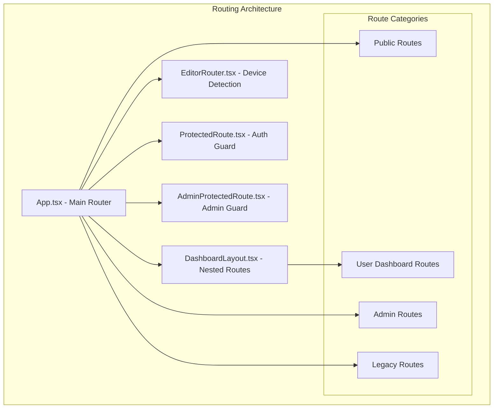
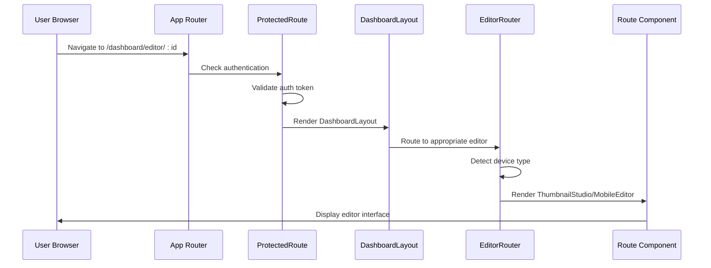
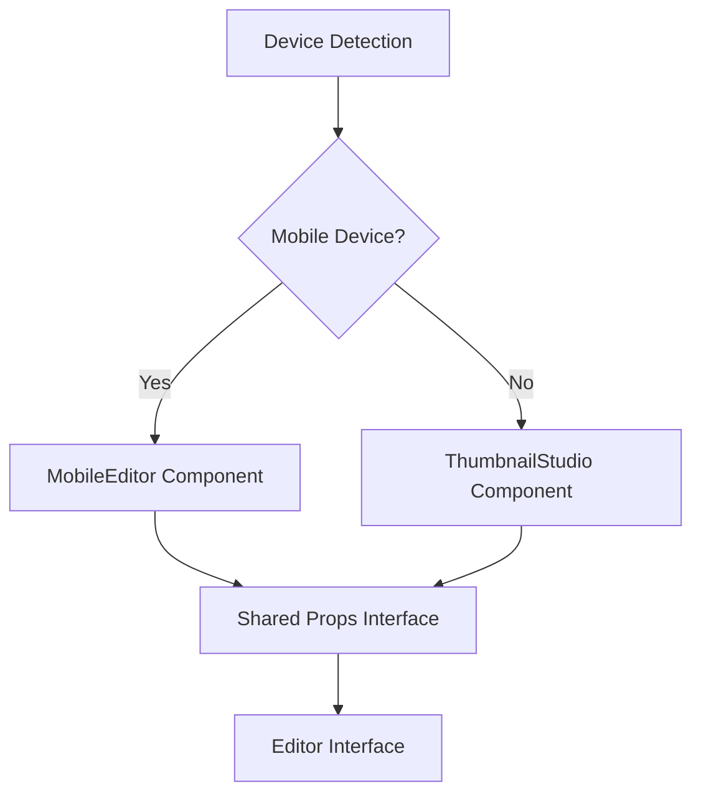
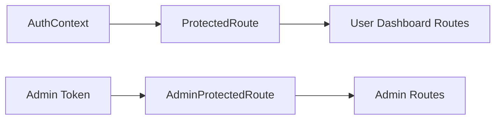
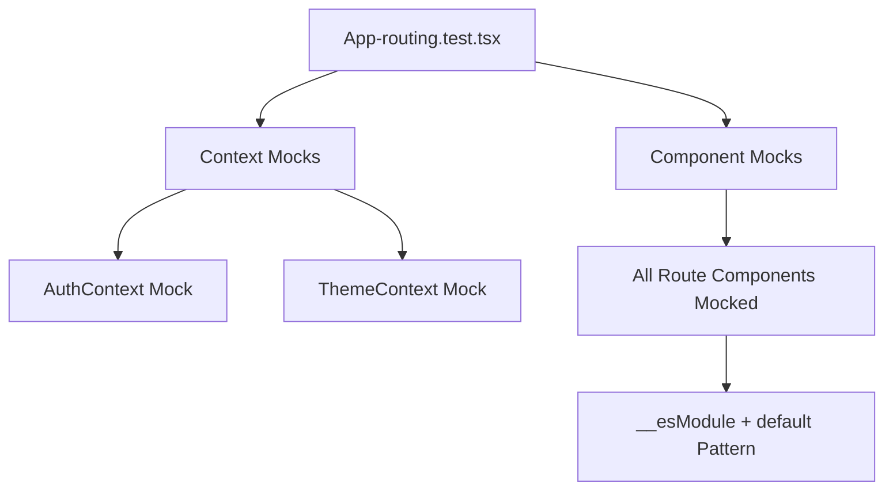

# Routing & Navigation

<cite>
**Referenced Files in This Document**
- [App.tsx](file://pikzels-clone/client/src/App.tsx)
- [ProtectedRoute.tsx](file://pikzels-clone/client/src/components/ProtectedRoute.tsx)
- [AdminProtectedRoute.tsx](file://pikzels-clone/client/src/components/admin/AdminProtectedRoute.tsx)
- [DashboardLayout.tsx](file://pikzels-clone/client/src/components/dashboard/DashboardLayout.tsx)
- [ThumbnailStudioPage.tsx](file://pikzels-clone/client/src/pages/ThumbnailStudioPage.tsx)
- [CanvasEditorPage.tsx](file://pikzels-clone/client/src/pages/CanvasEditorPage.tsx)
- [EditorRouter.tsx](file://pikzels-clone/client/src/components/editor/EditorRouter.tsx)
- [App-routing.test.tsx](file://pikzels-clone/client/src/__tests__/App-routing.test.tsx)
- [LandingPage.tsx](file://pikzels-clone/client/src/components/LandingPage.tsx)
- [Dashboard.tsx](file://pikzels-clone/client/src/components/Dashboard.tsx)
- [ProjectDetail.tsx](file://pikzels-clone/client/src/components/projects/ProjectDetail.tsx)
- [Login.tsx](file://pikzels-clone/client/src/components/auth/Login.tsx)
- [Register.tsx](file://pikzels-clone/client/src/components/auth/Register.tsx)
</cite>

## Update Summary
**Changes Made**
- Enhanced routing system documentation to reflect new editor routes and unified editor architecture
- Updated authentication guard documentation to include AdminProtectedRoute component
- Added comprehensive coverage of nested routing patterns and dashboard layout integration
- Expanded testing documentation to reflect extensive mocking improvements using __esModule + default pattern
- Updated route configuration examples to include new professional editor routes
- Enhanced navigation patterns documentation with modern React Router features

## Table of Contents
1. [Introduction](#introduction)
2. [Project Structure](#project-structure)
3. [Core Components](#core-components)
4. [Architecture Overview](#architecture-overview)
5. [Enhanced Route Configuration](#enhanced-route-configuration)
6. [Editor Integration Architecture](#editor-integration-architecture)
7. [Authentication & Authorization Guards](#authentication--authorization-guards)
8. [Nested Routing & Dashboard Layout](#nested-routing--dashboard-layout)
9. [Testing Strategy](#testing-strategy)
10. [Performance Considerations](#performance-considerations)
11. [Troubleshooting Guide](#troubleshooting-guide)
12. [Conclusion](#conclusion)

## Introduction
This document provides comprehensive documentation for the routing architecture in Thumbnail Maker Studio. The routing system has been significantly enhanced with new editor routes, unified editor architecture, and improved authentication mechanisms. The implementation leverages React Router v6 with modern features including nested routing, route guards, and dynamic route resolution. The system now supports both desktop and mobile editing experiences through intelligent route-based component selection.

## Project Structure
The routing architecture is organized around a hierarchical structure that separates concerns between public routes, user dashboard routes, and administrative interfaces. The App component serves as the central router, while specialized layouts and route guards provide context-specific navigation patterns.

**Diagram sources**
- [App.tsx](file://pikzels-clone/client/src/App.tsx)
- [DashboardLayout.tsx](file://pikzels-clone/client/src/components/dashboard/DashboardLayout.tsx)
- [EditorRouter.tsx](file://pikzels-clone/client/src/components/editor/EditorRouter.tsx)
- [ProtectedRoute.tsx](file://pikzels-clone/client/src/components/ProtectedRoute.tsx)
- [AdminProtectedRoute.tsx](file://pikzels-clone/client/src/components/admin/AdminProtectedRoute.tsx)

**Section sources**
- [App.tsx](file://pikzels-clone/client/src/App.tsx)
- [DashboardLayout.tsx](file://pikzels-clone/client/src/components/dashboard/DashboardLayout.tsx)

## Core Components
The routing architecture consists of several key components working together to provide a seamless navigation experience:

- **App Component**: Central router that defines all application routes and manages global navigation state
- **ProtectedRoute**: Authentication guard that protects user routes requiring valid authentication
- **AdminProtectedRoute**: Specialized authentication guard for administrative interfaces with permission-based access control
- **DashboardLayout**: Nested routing container that provides dashboard-specific navigation and layout management
- **EditorRouter**: Intelligent route-based component selector that adapts between desktop and mobile editing experiences

**Section sources**
- [App.tsx](file://pikzels-clone/client/src/App.tsx)
- [ProtectedRoute.tsx](file://pikzels-clone/client/src/components/ProtectedRoute.tsx)
- [AdminProtectedRoute.tsx](file://pikzels-clone/client/src/components/admin/AdminProtectedRoute.tsx)
- [DashboardLayout.tsx](file://pikzels-clone/client/src/components/dashboard/DashboardLayout.tsx)
- [EditorRouter.tsx](file://pikzels-clone/client/src/components/editor/EditorRouter.tsx)

## Architecture Overview
The routing architecture follows a hierarchical pattern with multiple layers of route protection and specialized layouts. The system supports both traditional SPA navigation and modern nested routing patterns.

**Diagram sources**
- [App.tsx](file://pikzels-clone/client/src/App.tsx)
- [ProtectedRoute.tsx](file://pikzels-clone/client/src/components/ProtectedRoute.tsx)
- [DashboardLayout.tsx](file://pikzels-clone/client/src/components/dashboard/DashboardLayout.tsx)
- [EditorRouter.tsx](file://pikzels-clone/client/src/components/editor/EditorRouter.tsx)

## Enhanced Route Configuration
The routing system now includes comprehensive support for modern editing workflows with multiple route patterns:

### Public Routes
- Landing pages and marketing content
- Authentication routes (login, register, password reset)
- Public sharing routes for thumbnails
- Informational pages (about, contact, terms, privacy)

### User Dashboard Routes
- **Nested Layout**: `/dashboard` with child routes for different sections
- **Editor Routes**: `/dashboard/editor` and `/dashboard/editor/:id` for thumbnail editing
- **Project Routes**: `/dashboard/projects` with detail views
- **Analytics Routes**: Multiple analytics endpoints
- **Specialized Tools**: AI tools, vision tools, visual search, A/B testing

### Professional Editor Routes
- **Unified Studio**: `/studio` and `/studio/:id` for professional editing
- **Canvas Editor**: `/canvas-editor` and `/canvas-editor/:id` for canvas-based editing
- **Video Editor**: `/dashboard/video-editor` for video thumbnail creation

### Administrative Routes
- **Admin Login**: `/admin/login` for authentication
- **Admin Dashboard**: `/admin` with nested routes for different admin functions
- **Permission-based Access**: Routes gated by specific permissions

**Section sources**
- [App.tsx](file://pikzels-clone/client/src/App.tsx)
- [DashboardLayout.tsx](file://pikzels-clone/client/src/components/dashboard/DashboardLayout.tsx)

## Editor Integration Architecture
The editor system uses a sophisticated routing pattern that intelligently selects between desktop and mobile editing experiences based on device detection.

### EditorRouter Pattern
The EditorRouter component provides a unified interface for accessing different editor implementations:

**Diagram sources**
- [EditorRouter.tsx](file://pikzels-clone/client/src/components/editor/EditorRouter.tsx)
- [ThumbnailStudioPage.tsx](file://pikzels-clone/client/src/pages/ThumbnailStudioPage.tsx)

### Route Parameter Handling
The routing system supports flexible parameter handling for editor instances:

- **Thumbnail ID Parameters**: Dynamic routing for existing thumbnail editing
- **Route State Passing**: Data passing between AI generation pages and editors
- **Session Persistence**: Automatic restoration of editing state across page refreshes

**Section sources**
- [EditorRouter.tsx](file://pikzels-clone/client/src/components/editor/EditorRouter.tsx)
- [ThumbnailStudioPage.tsx](file://pikzels-clone/client/src/pages/ThumbnailStudioPage.tsx)

## Authentication & Authorization Guards
The routing system implements multiple layers of authentication and authorization:

### ProtectedRoute Component
Provides universal authentication protection for user routes:
- Token validation through AuthContext
- Loading state management during authentication checks
- Automatic redirection to login for unauthorized access

### AdminProtectedRoute Component
Specialized protection for administrative interfaces:
- Admin token validation
- Permission-based access control
- Granular permission checking for different admin functions

### Route Protection Patterns

**Diagram sources**
- [ProtectedRoute.tsx](file://pikzels-clone/client/src/components/ProtectedRoute.tsx)
- [AdminProtectedRoute.tsx](file://pikzels-clone/client/src/components/admin/AdminProtectedRoute.tsx)

**Section sources**
- [ProtectedRoute.tsx](file://pikzels-clone/client/src/components/ProtectedRoute.tsx)
- [AdminProtectedRoute.tsx](file://pikzels-clone/client/src/components/admin/AdminProtectedRoute.tsx)

## Nested Routing & Dashboard Layout
The dashboard layout system provides sophisticated nested routing capabilities:

### DashboardLayout Features
- **Responsive Navigation**: Collapsible sidebar with progressive disclosure
- **Active State Management**: Automatic highlighting of current navigation items
- **Keyboard Shortcuts**: Support for command-key combinations (⌘K) for search
- **Mobile Responsiveness**: Full mobile navigation overlay with hamburger menu

### Nested Route Patterns
The dashboard supports complex nested routing with automatic parent-child relationship detection:
- Parent routes trigger sidebar expansion/collapse
- Child routes maintain active state indicators
- Route parameters are preserved across navigation

**Section sources**
- [DashboardLayout.tsx](file://pikzels-clone/client/src/components/dashboard/DashboardLayout.tsx)

## Testing Strategy
The routing system includes comprehensive testing infrastructure with extensive mocking capabilities:

### Enhanced Testing Setup
The test suite has been significantly enhanced to handle modern module patterns:

**Diagram sources**
- [App-routing.test.tsx](file://pikzels-clone/client/src/__tests__/App-routing.test.tsx)

### Testing Improvements
- **Complete Component Coverage**: All route components mocked with proper ES module pattern
- **Context Provider Testing**: Auth and Theme contexts fully mocked for isolated testing
- **Route Parameter Testing**: Comprehensive testing of dynamic route parameters
- **Guard Behavior Testing**: Protected routes validated for proper authentication handling

**Section sources**
- [App-routing.test.tsx](file://pikzels-clone/client/src/__tests__/App-routing.test.tsx)

## Performance Considerations
The routing architecture incorporates several performance optimizations:

### Modern React Router Features
- **v7 Start Transition**: Smooth navigation transitions with improved performance
- **Relative Splats**: Optimized route matching for nested routes
- **Lazy Loading Potential**: Ready for code-splitting implementation

### Route Optimization Strategies
- **Component Memoization**: Route components optimized for minimal re-renders
- **Context Provider Efficiency**: Auth and Theme contexts designed for optimal performance
- **Device Detection Optimization**: Editor routing based on efficient device detection

## Troubleshooting Guide
Common routing issues and their solutions:

### Authentication Issues
- **Protected Route Failures**: Verify AuthContext is properly wrapped around routes
- **Admin Route Access**: Check admin token and permission storage in localStorage
- **Token Validation**: Ensure authentication tokens are properly formatted and not expired

### Route Parameter Issues
- **Dynamic Route Matching**: Verify parameter names match between route definition and component usage
- **Nested Route Resolution**: Check parent-child route relationships in DashboardLayout
- **Legacy Route Migration**: Confirm RedirectToEditor component properly handles parameter passing

### Editor Integration Problems
- **Device Detection Failures**: Verify useShouldUseMobileEditor hook returns expected values
- **Route State Persistence**: Check sessionStorage usage for temporary data storage
- **Component Prop Passing**: Ensure EditorRouter receives all required props

**Section sources**
- [App.tsx](file://pikzels-clone/client/src/App.tsx)
- [ProtectedRoute.tsx](file://pikzels-clone/client/src/components/ProtectedRoute.tsx)
- [AdminProtectedRoute.tsx](file://pikzels-clone/client/src/components/admin/AdminProtectedRoute.tsx)
- [EditorRouter.tsx](file://pikzels-clone/client/src/components/editor/EditorRouter.tsx)

## Conclusion
The routing architecture in Thumbnail Maker Studio represents a sophisticated implementation of modern React Router patterns with enhanced editor integration and comprehensive authentication systems. The system successfully balances flexibility with performance through intelligent route organization, device-aware component selection, and robust testing infrastructure. The recent enhancements to editor routes, authentication guards, and testing capabilities position the application for continued growth and feature expansion while maintaining excellent user experience and development workflow.