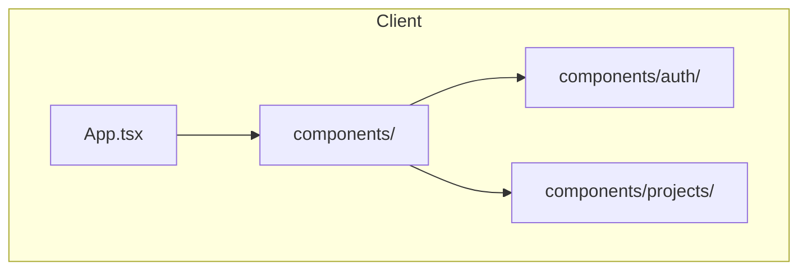
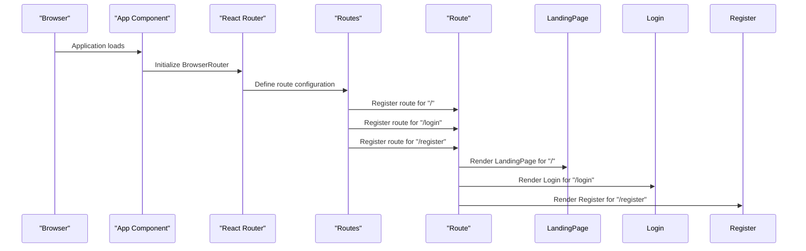
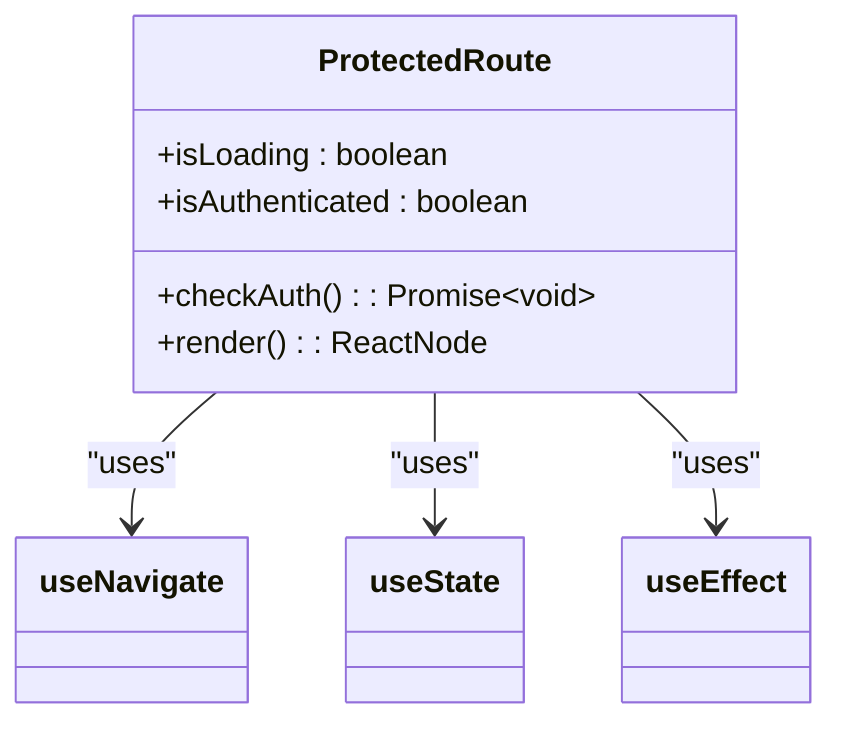
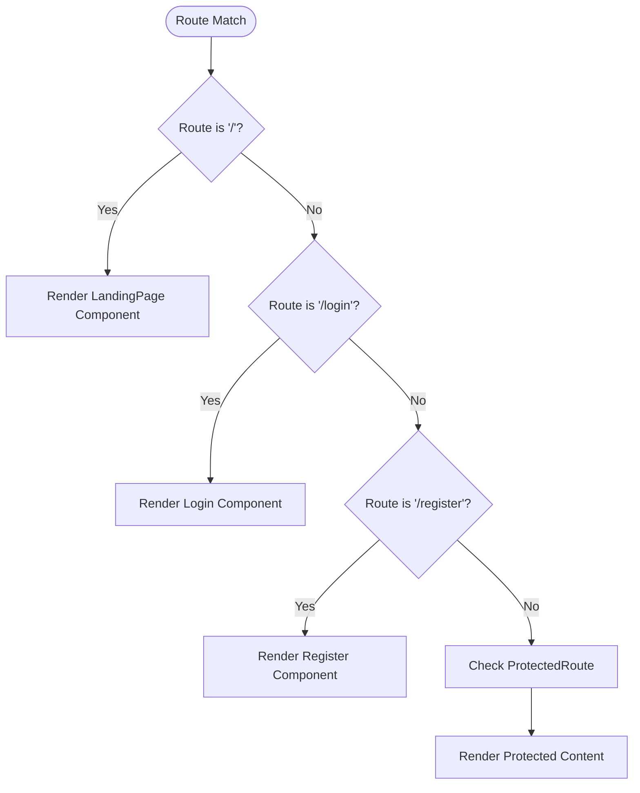
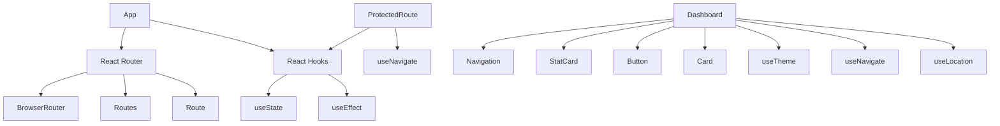

# Routing & Navigation

<cite>
**Referenced Files in This Document**   
- [App.tsx](file://client/src/App.tsx)
- [ProtectedRoute.tsx](file://client/src/components/ProtectedRoute.tsx)
- [LandingPage.tsx](file://client/src/components/LandingPage.tsx)
- [Dashboard.tsx](file://client/src/components/Dashboard.tsx)
- [ProjectDetail.tsx](file://client/src/components/projects/ProjectDetail.tsx)
- [Login.tsx](file://client/src/components/auth/Login.tsx)
- [Register.tsx](file://client/src/components/auth/Register.tsx)
</cite>

## Table of Contents
1. [Introduction](#introduction)
2. [Project Structure](#project-structure)
3. [Core Components](#core-components)
4. [Architecture Overview](#architecture-overview)
5. [Detailed Component Analysis](#detailed-component-analysis)
6. [Dependency Analysis](#dependency-analysis)
7. [Performance Considerations](#performance-considerations)
8. [Troubleshooting Guide](#troubleshooting-guide)
9. [Conclusion](#conclusion)

## Introduction
This document provides comprehensive documentation for the routing architecture in Thumbnail Maker Studio. It details the implementation using React Router, including route definitions, navigation patterns, and dynamic routing for project and thumbnail views. The ProtectedRoute component's role in enforcing authentication guards and redirecting unauthenticated users is explained. The integration between App.tsx as the routing container and key views such as LandingPage, Dashboard, and ProjectDetail is documented. Client-side routing performance, code splitting strategies using lazy loading, and SEO implications are addressed. Guidance on adding new routes, handling nested routes, and ensuring accessibility in navigation flows is provided.

## Project Structure
The project structure reveals a well-organized client application with a clear separation of concerns. The routing system is centered in the client/src directory, with components organized by feature. The App.tsx file serves as the routing container, while specific views are located in the components directory. Authentication-related components are grouped in an auth subdirectory, and project-specific components are organized in a projects subdirectory. This structure supports maintainability and scalability of the routing system.



**Diagram sources**
- [App.tsx](file://client/src/App.tsx)
- [LandingPage.tsx](file://client/src/components/LandingPage.tsx)

**Section sources**
- [App.tsx](file://client/src/App.tsx)
- [LandingPage.tsx](file://client/src/components/LandingPage.tsx)

## Core Components
The routing architecture in Thumbnail Maker Studio is built around several core components that work together to provide a seamless navigation experience. The App component serves as the root routing container, defining the primary routes for the application. The ProtectedRoute component acts as a higher-order component that wraps authenticated routes, ensuring that only authorized users can access protected views. Key views such as LandingPage, Dashboard, and ProjectDetail represent the main application states and are connected through the routing system.

**Section sources**
- [App.tsx](file://client/src/App.tsx)
- [ProtectedRoute.tsx](file://client/src/components/ProtectedRoute.tsx)
- [Dashboard.tsx](file://client/src/components/Dashboard.tsx)

## Architecture Overview
The routing architecture follows a client-side routing pattern using React Router, which enables dynamic navigation without full page reloads. The App component initializes the Router and defines the route configuration through the Routes and Route components. Public routes such as the landing page, login, and registration are accessible without authentication, while protected routes like the dashboard and project views are wrapped with the ProtectedRoute component. This architecture supports a single-page application (SPA) experience with smooth transitions between views.

```mermaid
graph TD
A[App] --> B[Router]
B --> C[Routes]
C --> D[/]
C --> E[/login]
C --> F[/register]
C --> G[/dashboard]
C --> H[/projects/:id]
D --> I[LandingPage]
E --> J[Login]
F --> K[Register]
G --> L[ProtectedRoute]
H --> M[ProtectedRoute]
L --> N[Dashboard]
M --> O[ProjectDetail]
```

**Diagram sources**
- [App.tsx](file://client/src/App.tsx)
- [ProtectedRoute.tsx](file://client/src/components/ProtectedRoute.tsx)

## Detailed Component Analysis

### App Component Analysis
The App component serves as the routing container for the application, defining the route configuration and rendering the appropriate components based on the current URL. It uses React Router's BrowserRouter to enable client-side routing and the Routes component to define the available routes. The route configuration includes both public routes (landing page, login, registration) and protected routes (dashboard, projects) that require authentication.

#### For API/Service Components:


**Diagram sources**
- [App.tsx](file://client/src/App.tsx)

**Section sources**
- [App.tsx](file://client/src/App.tsx)

### ProtectedRoute Component Analysis
The ProtectedRoute component implements authentication guards to protect routes that require user authentication. It checks for the presence of a valid authentication token in localStorage and validates it by making a request to the user profile endpoint. If the user is not authenticated, they are redirected to the login page. During the authentication check, a loading indicator is displayed to provide feedback to the user.

#### For Object-Oriented Components:


**Diagram sources**
- [ProtectedRoute.tsx](file://client/src/components/ProtectedRoute.tsx)

**Section sources**
- [ProtectedRoute.tsx](file://client/src/components/ProtectedRoute.tsx)

### View Components Analysis
The view components represent the main application states and are rendered based on the current route. The LandingPage provides an entry point for unauthenticated users, while the Dashboard offers a comprehensive interface for authenticated users to manage their thumbnails and projects. The ProjectDetail component enables viewing and editing specific project details with dynamic routing based on the project ID parameter.

#### For Complex Logic Components:


**Diagram sources**
- [LandingPage.tsx](file://client/src/components/LandingPage.tsx)
- [Dashboard.tsx](file://client/src/components/Dashboard.tsx)
- [ProjectDetail.tsx](file://client/src/components/projects/ProjectDetail.tsx)

**Section sources**
- [LandingPage.tsx](file://client/src/components/LandingPage.tsx)
- [Dashboard.tsx](file://client/src/components/Dashboard.tsx)
- [ProjectDetail.tsx](file://client/src/components/projects/ProjectDetail.tsx)

## Dependency Analysis
The routing components have well-defined dependencies that follow React best practices. The App component depends on React Router for routing functionality, while the ProtectedRoute component relies on React hooks (useState, useEffect) and the useNavigate hook for navigation. View components depend on various UI components and context providers for theme and authentication state. The dependency graph shows a clear hierarchy with the App component at the top, followed by route guards, and finally the view components.



**Diagram sources**
- [App.tsx](file://client/src/App.tsx)
- [ProtectedRoute.tsx](file://client/src/components/ProtectedRoute.tsx)
- [Dashboard.tsx](file://client/src/components/Dashboard.tsx)

**Section sources**
- [App.tsx](file://client/src/App.tsx)
- [ProtectedRoute.tsx](file://client/src/components/ProtectedRoute.tsx)
- [Dashboard.tsx](file://client/src/components/Dashboard.tsx)

## Performance Considerations
The routing architecture incorporates several performance optimizations to ensure a responsive user experience. Client-side routing eliminates the need for full page reloads when navigating between views, reducing latency and improving perceived performance. The ProtectedRoute component implements a loading state during authentication checks to provide immediate feedback to users. However, there is an opportunity to enhance performance further by implementing code splitting and lazy loading for route components, which would reduce the initial bundle size and improve load times.

## Troubleshooting Guide
Common routing issues in Thumbnail Maker Studio typically involve authentication state management and route configuration. If users are unable to access protected routes, verify that the authentication token is properly stored in localStorage and that the user profile endpoint is accessible. For route matching issues, ensure that route paths are correctly defined in the App component and that dynamic parameters are properly handled in components like ProjectDetail. When adding new routes, remember to wrap protected routes with the ProtectedRoute component and ensure that navigation links use the appropriate React Router components.

**Section sources**
- [App.tsx](file://client/src/App.tsx)
- [ProtectedRoute.tsx](file://client/src/components/ProtectedRoute.tsx)
- [Login.tsx](file://client/src/components/auth/Login.tsx)
- [Register.tsx](file://client/src/components/auth/Register.tsx)

## Conclusion
The routing architecture in Thumbnail Maker Studio effectively implements client-side navigation using React Router, providing a seamless user experience with proper authentication guards. The separation of public and protected routes through the ProtectedRoute component ensures that sensitive functionality is only accessible to authenticated users. The architecture is well-structured and maintainable, with clear component responsibilities and dependencies. Future enhancements could include implementing code splitting for improved performance and adding route-level code splitting to further optimize bundle sizes.