# State Management

<cite>
**Referenced Files in This Document**
- [AuthContext.tsx](file://pikzels-clone/client/src/contexts/AuthContext.tsx)
- [ThemeContext.tsx](file://pikzels-clone/client/src/contexts/ThemeContext.tsx)
- [Login.tsx](file://pikzels-clone/client/src/components/auth/Login.tsx)
- [ThemeToggle.tsx](file://pikzels-clone/client/src/components/ThemeToggle.tsx)
- [AIToolsPage.tsx](file://pikzels-clone/client/src/components/dashboard/AIToolsPage.tsx)
- [AIPromptPanel.tsx](file://pikzels-clone/client/src/components/editor/panels/AIPromptPanel.tsx)
- [AIToolsPanel.tsx](file://pikzels-clone/client/src/components/editor/panels/AIToolsPanel.tsx)
- [useAIService.ts](file://pikzels-clone/client/src/hooks/useAIService.ts)
- [ai-service.ts](file://pikzels-clone/client/src/services/ai-providers/ai-service.ts)
</cite>

## Update Summary
**Changes Made**
- Enhanced AI state management with separated prompt states for different AI operations
- Improved state cleanup mechanisms and better error handling across AI tool operations
- Added comprehensive AI service state management with proper initialization and error handling
- Updated AI tools panel with dedicated prompt state management for inpainting operations

## Table of Contents
1. [Introduction](#introduction)
2. [Context Providers Implementation](#context-providers-implementation)
3. [AuthContext: User Authentication State](#authcontext-user-authentication-state)
4. [ThemeContext: UI Theme Preferences](#themecontext-ui-theme-preferences)
5. [AI Service State Management](#ai-service-state-management)
6. [Consumer Components Integration](#consumer-components-integration)
7. [State Update Mechanisms](#state-update-mechanisms)
8. [Re-render Optimization Strategies](#re-render-optimization-strategies)
9. [Error Handling in State Transitions](#error-handling-in-state-transitions)
10. [Common Issues and Best Practices](#common-issues-and-best-practices)

## Introduction
This document provides a comprehensive analysis of the state management system in the frontend architecture of the Thumbnail Maker application. The implementation leverages React Context API to manage global application state, specifically focusing on three critical contexts: AuthContext for user authentication state, ThemeContext for UI theme preferences, and AI Service state for managing AI tool operations. The system enables centralized state management while maintaining component encapsulation and avoiding prop drilling. This documentation details the provider components, context value structure, consumer patterns using the useContext hook, and integration examples from key components such as Login.tsx, ThemeToggle.tsx, and AI tools panels.

## Context Providers Implementation

The application implements three primary context providers that wrap the application to make global state available to all child components. These providers are responsible for initializing state, handling side effects, and exposing state update mechanisms to consumers.

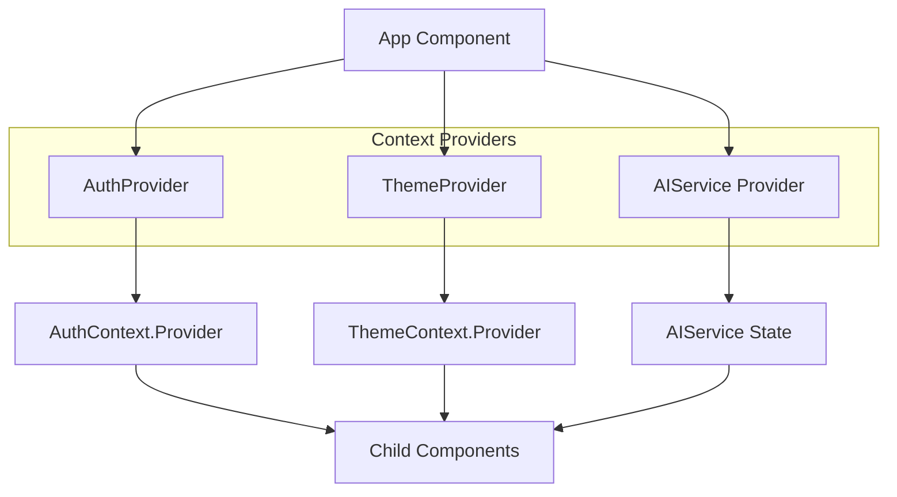
```mermaid
graph TB
subgraph "Context Providers"
AuthProvider[AuthProvider]
ThemeProvider[ThemeProvider]
AIProvider[AIService Provider]
end
App[App Component] --> AuthProvider
App --> ThemeProvider
App --> AIProvider
AuthProvider --> AuthContext[AuthContext.Provider]
ThemeProvider --> ThemeContext[ThemeContext.Provider]
AIProvider --> AIService[AIService State]
AuthContext --> Children["Child Components"]
ThemeContext --> Children
AIService --> Children
```

**Diagram sources**
- [AuthContext.tsx](file://pikzels-clone/client/src/contexts/AuthContext.tsx#L36-L139)
- [ThemeContext.tsx](file://pikzels-clone/client/src/contexts/ThemeContext.tsx#L316-L371)
- [useAIService.ts](file://pikzels-clone/client/src/hooks/useAIService.ts#L39-L93)

**Section sources**
- [AuthContext.tsx](file://pikzels-clone/client/src/contexts/AuthContext.tsx#L1-L148)
- [ThemeContext.tsx](file://pikzels-clone/client/src/contexts/ThemeContext.tsx#L1-L380)
- [useAIService.ts](file://pikzels-clone/client/src/hooks/useAIService.ts#L1-L191)

## AuthContext: User Authentication State

The AuthContext manages user authentication state including login, logout, registration, and session persistence. It provides a comprehensive interface for authentication operations and maintains user session state across the application.

### AuthContext Type Definition
The AuthContextType interface defines the structure of the authentication context, including user data, authentication methods, loading state, and authentication status.

```mermaid
classDiagram
class AuthContextType {
+user : User | null
+login(email : string, password : string) : Promise<{success : boolean, error? : string}>
+logout() : void
+register(email : string, password : string, name : string, username : string) : Promise<{success : boolean, error? : string}>
+loading : boolean
+isAuthenticated : boolean
}
class User {
+id : string
+email : string
+name? : string
+username? : string
}
AuthContextType --> User : "contains"
```

**Diagram sources**
- [AuthContext.tsx](file://pikzels-clone/client/src/contexts/AuthContext.tsx#L17-L32)

### Authentication Flow
The authentication flow begins with session persistence check on application load, followed by handling login, registration, and logout operations with proper error handling and state updates.

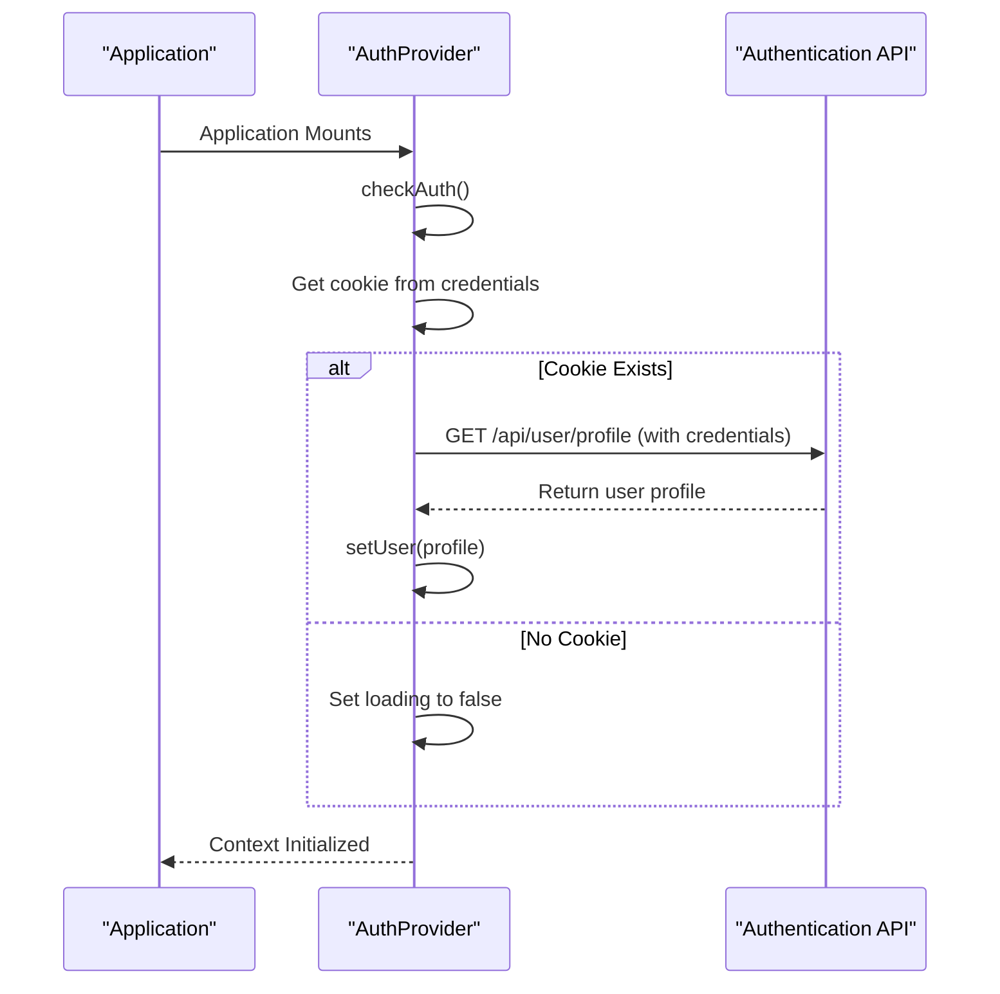
```mermaid
sequenceDiagram
participant App as "Application"
participant AuthProvider as "AuthProvider"
participant API as "Authentication API"
App->>AuthProvider : Application Mounts
AuthProvider->>AuthProvider : checkAuth()
AuthProvider->>AuthProvider : Get cookie from credentials
alt Cookie Exists
AuthProvider->>API : GET /api/user/profile (with credentials)
API-->>AuthProvider : Return user profile
AuthProvider->>AuthProvider : setUser(profile)
else No Cookie
AuthProvider->>AuthProvider : Set loading to false
end
AuthProvider-->>App : Context Initialized
```

**Diagram sources**
- [AuthContext.tsx](file://pikzels-clone/client/src/contexts/AuthContext.tsx#L43-L63)

**Section sources**
- [AuthContext.tsx](file://pikzels-clone/client/src/contexts/AuthContext.tsx#L1-L148)

## ThemeContext: UI Theme Preferences

The ThemeContext manages UI theme preferences, supporting seven predefined themes with user preference persistence and system preference fallback.

### ThemeContext Type Definition
The ThemeContextType interface defines the structure of the theme context, including the current theme, theme name, and the function to set themes.

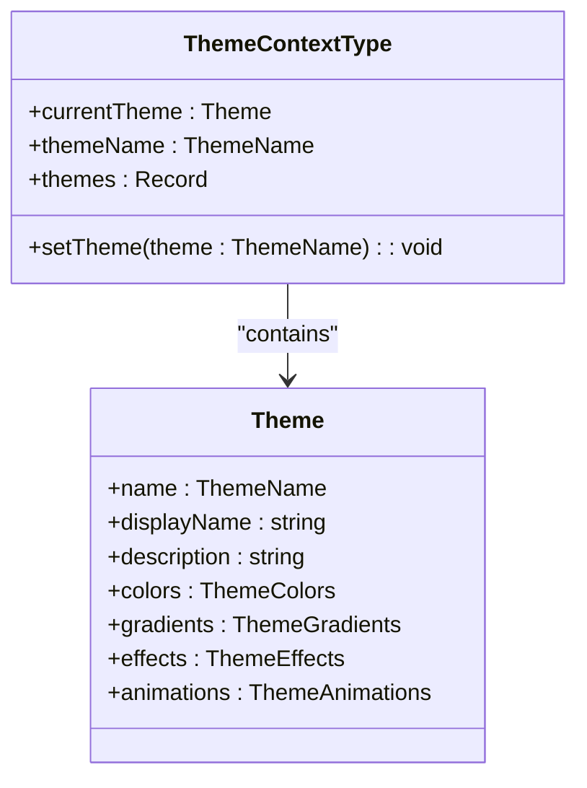
```mermaid
classDiagram
class ThemeContextType {
+currentTheme : Theme
+themeName : ThemeName
+setTheme(theme : ThemeName) : void
+themes : Record<ThemeName, Theme>
}
class Theme {
+name : ThemeName
+displayName : string
+description : string
+colors : ThemeColors
+gradients : ThemeGradients
+effects : ThemeEffects
+animations : ThemeAnimations
}
ThemeContextType --> Theme : "contains"
```

**Diagram sources**
- [ThemeContext.tsx](file://pikzels-clone/client/src/contexts/ThemeContext.tsx#L303-L308)

### Theme Initialization Flow
The theme system initializes by checking user preferences, falling back to system preferences when necessary, and applying the appropriate CSS variables to the document root.

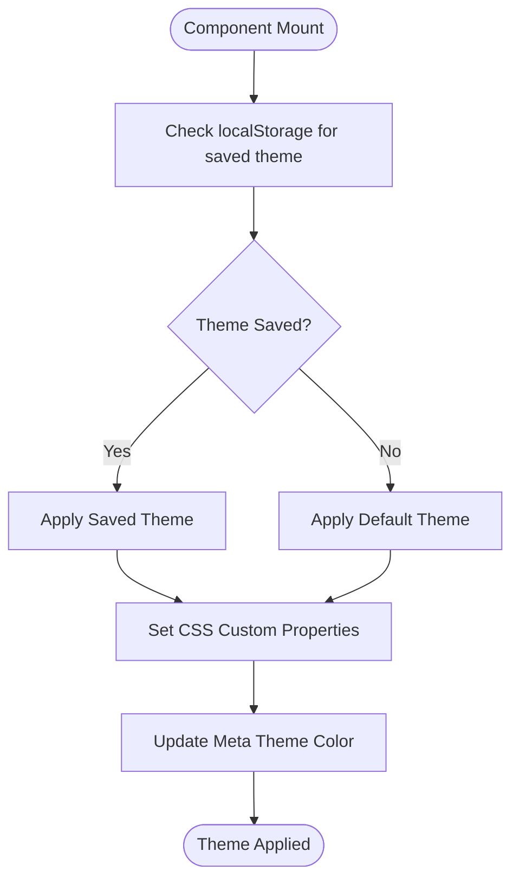
```mermaid
flowchart TD
Start([Component Mount]) --> CheckSaved["Check localStorage for saved theme"]
CheckSaved --> ThemeExists{"Theme Saved?"}
ThemeExists --> |Yes| ApplySaved["Apply Saved Theme"]
ThemeExists --> |No| ApplyDefault["Apply Default Theme"]
ApplySaved --> SetCSSVars["Set CSS Custom Properties"]
ApplyDefault --> SetCSSVars
SetCSSVars --> UpdateMeta["Update Meta Theme Color"]
UpdateMeta --> End([Theme Applied])
```

**Diagram sources**
- [ThemeContext.tsx](file://pikzels-clone/client/src/contexts/ThemeContext.tsx#L319-L353)

**Section sources**
- [ThemeContext.tsx](file://pikzels-clone/client/src/contexts/ThemeContext.tsx#L1-L380)

## AI Service State Management

The AI Service State Management system provides comprehensive state management for AI operations across different AI tools. This system separates prompt states for different AI operations and implements robust error handling and cleanup mechanisms.

### AI Service State Architecture
The AI Service state management includes separate prompt states for different AI operations, comprehensive loading states, and error handling mechanisms.

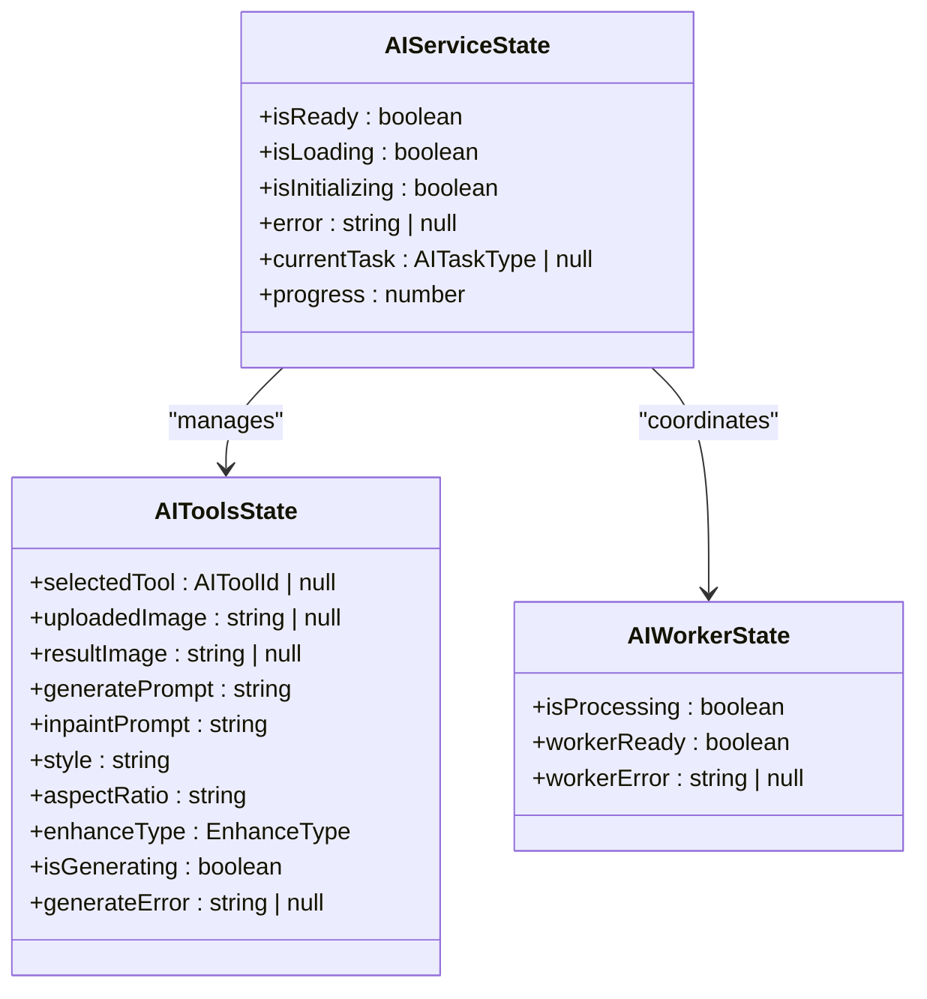
```mermaid
classDiagram
class AIServiceState {
+isReady : boolean
+isLoading : boolean
+isInitializing : boolean
+error : string | null
+currentTask : AITaskType | null
+progress : number
}
class AIToolsState {
+selectedTool : AIToolId | null
+uploadedImage : string | null
+resultImage : string | null
+generatePrompt : string
+inpaintPrompt : string
+style : string
+aspectRatio : string
+enhanceType : EnhanceType
+isGenerating : boolean
+generateError : string | null
}
class AIWorkerState {
+isProcessing : boolean
+workerReady : boolean
+workerError : string | null
}
AIServiceState --> AIToolsState : "manages"
AIServiceState --> AIWorkerState : "coordinates"
```

**Diagram sources**
- [useAIService.ts](file://pikzels-clone/client/src/hooks/useAIService.ts#L30-L37)
- [AIToolsPage.tsx](file://pikzels-clone/client/src/components/dashboard/AIToolsPage.tsx#L97-L112)

### AI Service Initialization Flow
The AI Service implements a sophisticated initialization system that supports both Web Worker and main-thread execution with fallback mechanisms.

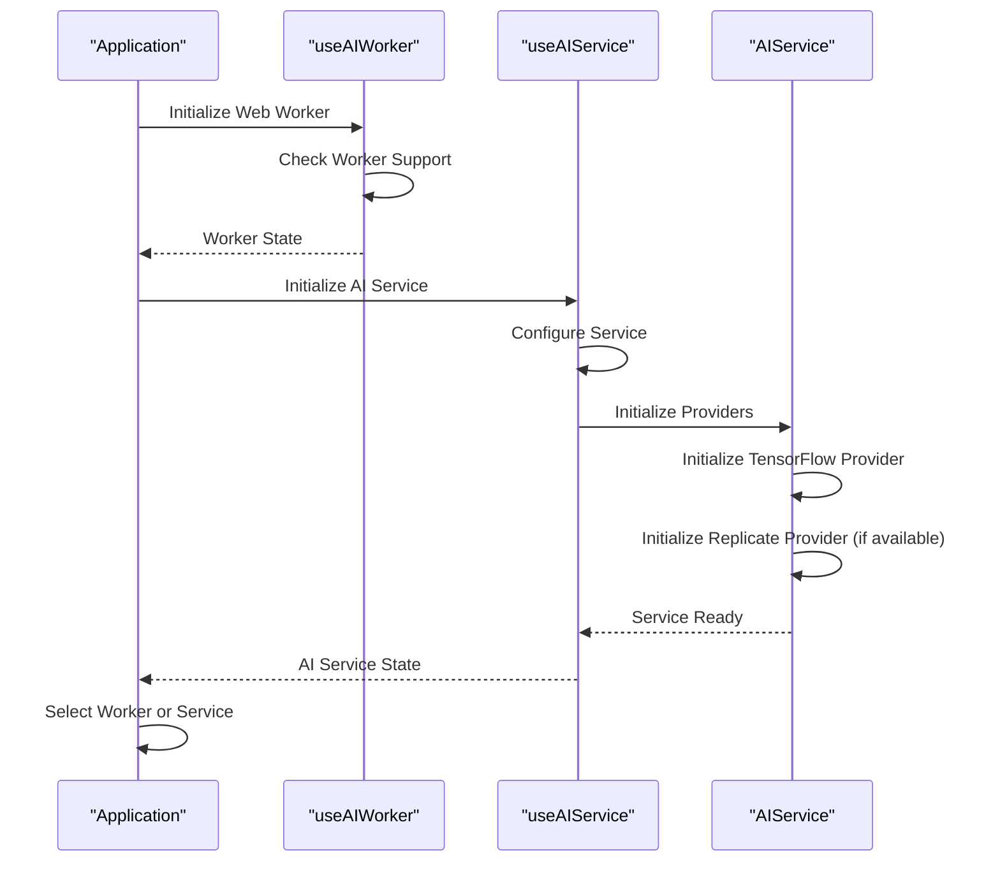
```mermaid
sequenceDiagram
participant App as "Application"
participant WorkerHook as "useAIWorker"
participant AIServiceHook as "useAIService"
participant AIService as "AIService"
App->>WorkerHook : Initialize Web Worker
WorkerHook->>WorkerHook : Check Worker Support
WorkerHook-->>App : Worker State
App->>AIServiceHook : Initialize AI Service
AIServiceHook->>AIServiceHook : Configure Service
AIServiceHook->>AIService : Initialize Providers
AIService->>AIService : Initialize TensorFlow Provider
AIService->>AIService : Initialize Replicate Provider (if available)
AIService-->>AIServiceHook : Service Ready
AIServiceHook-->>App : AI Service State
App->>App : Select Worker or Service
```

**Diagram sources**
- [AIToolsPage.tsx](file://pikzels-clone/client/src/components/dashboard/AIToolsPage.tsx#L70-L95)
- [useAIService.ts](file://pikzels-clone/client/src/hooks/useAIService.ts#L52-L93)

### AI Tool State Management
Each AI tool maintains its own state management with separate prompt states and operation-specific configurations.

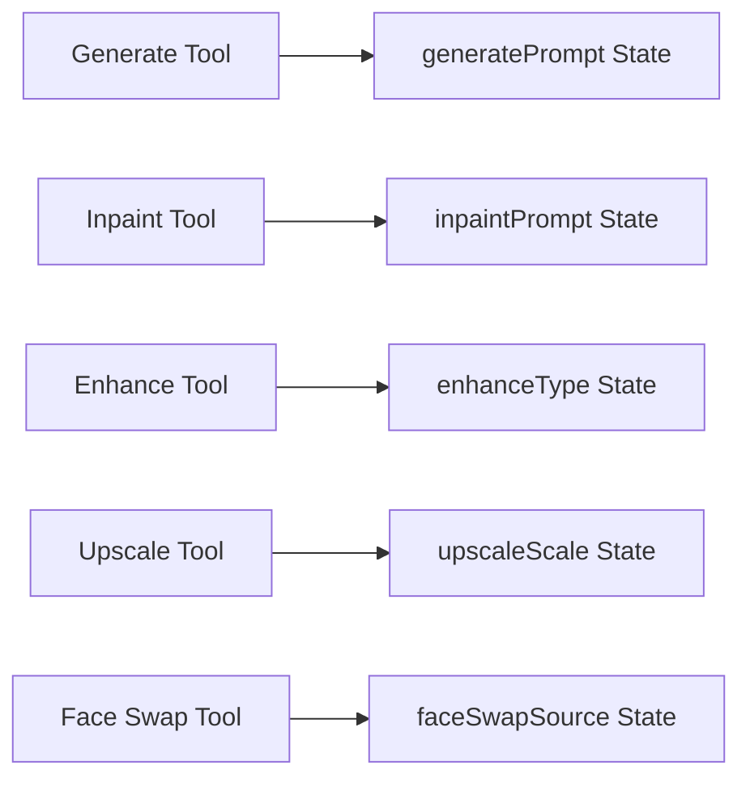
```mermaid
flowchart LR
GenerateTool["Generate Tool"] --> GeneratePrompt["generatePrompt State"]
InpaintTool["Inpaint Tool"] --> InpaintPrompt["inpaintPrompt State"]
EnhanceTool["Enhance Tool"] --> EnhanceType["enhanceType State"]
UpscaleTool["Upscale Tool"] --> UpscaleScale["upscaleScale State"]
FaceSwapTool["Face Swap Tool"] --> FaceSwapSource["faceSwapSource State"]
```

**Diagram sources**
- [AIToolsPage.tsx](file://pikzels-clone/client/src/components/dashboard/AIToolsPage.tsx#L101-L107)

**Section sources**
- [useAIService.ts](file://pikzels-clone/client/src/hooks/useAIService.ts#L1-L191)
- [AIToolsPage.tsx](file://pikzels-clone/client/src/components/dashboard/AIToolsPage.tsx#L1-L200)
- [ai-service.ts](file://pikzels-clone/client/src/services/ai-providers/ai-service.ts#L1-L471)

## Consumer Components Integration

### Login Component Integration
The Login component integrates with AuthContext to handle user authentication, demonstrating the consumer pattern for authentication state management.

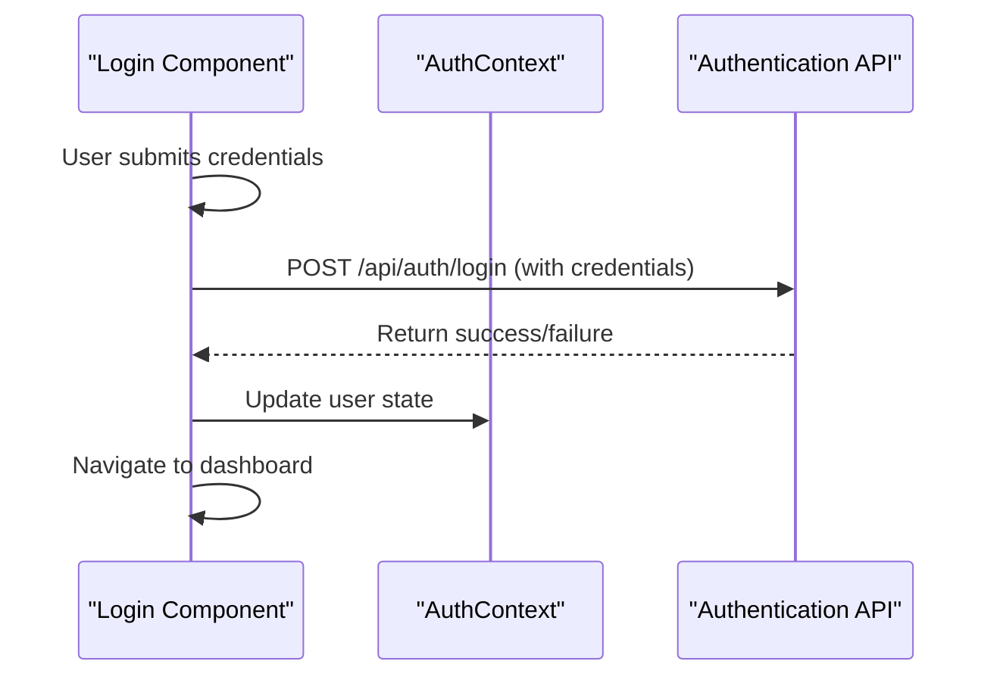
```mermaid
sequenceDiagram
participant Login as "Login Component"
participant AuthContext as "AuthContext"
participant API as "Authentication API"
Login->>Login : User submits credentials
Login->>API : POST /api/auth/login (with credentials)
API-->>Login : Return success/failure
Login->>AuthContext : Update user state
Login->>Login : Navigate to dashboard
```

**Diagram sources**
- [Login.tsx](file://pikzels-clone/client/src/components/auth/Login.tsx#L19-L40)
- [AuthContext.tsx](file://pikzels-clone/client/src/contexts/AuthContext.tsx#L65-L88)

### ThemeToggle Component Integration
The ThemeToggle component consumes ThemeContext to provide users with a UI element for switching between themes.

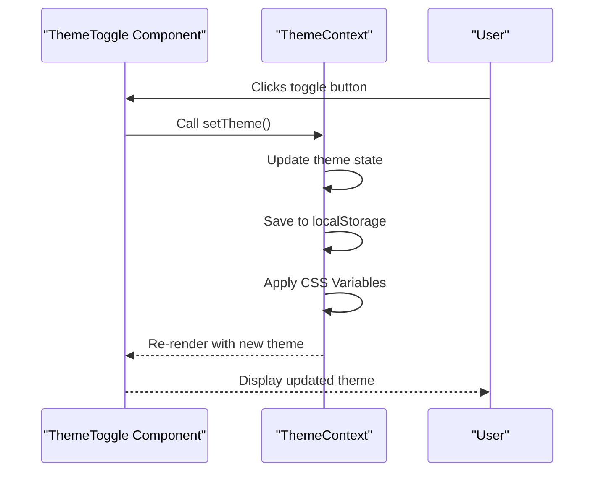
```mermaid
sequenceDiagram
participant ThemeToggle as "ThemeToggle Component"
participant ThemeContext as "ThemeContext"
participant User as "User"
User->>ThemeToggle : Clicks toggle button
ThemeToggle->>ThemeContext : Call setTheme()
ThemeContext->>ThemeContext : Update theme state
ThemeContext->>ThemeContext : Save to localStorage
ThemeContext->>ThemeContext : Apply CSS Variables
ThemeContext-->>ThemeToggle : Re-render with new theme
ThemeToggle-->>User : Display updated theme
```

**Diagram sources**
- [ThemeToggle.tsx](file://pikzels-clone/client/src/components/ThemeToggle.tsx#L11-L32)
- [ThemeContext.tsx](file://pikzels-clone/client/src/contexts/ThemeContext.tsx#L355-L357)

### AI Tools Panel Integration
The AI Tools Panels demonstrate integrated state management with separate prompt states for different operations.

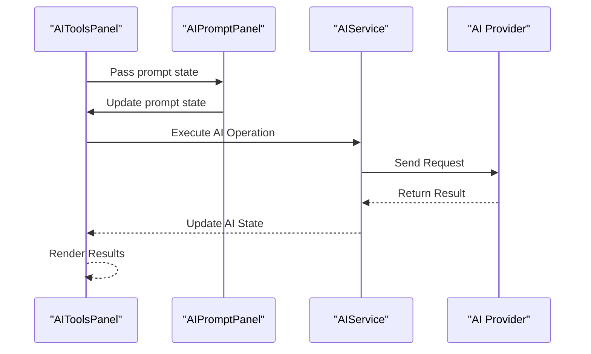
```mermaid
sequenceDiagram
participant AIToolsPanel as "AIToolsPanel"
participant AIPromptPanel as "AIPromptPanel"
participant AIService as "AIService"
participant AIProvider as "AI Provider"
AIToolsPanel->>AIPromptPanel : Pass prompt state
AIPromptPanel->>AIToolsPanel : Update prompt state
AIToolsPanel->>AIService : Execute AI Operation
AIService->>AIProvider : Send Request
AIProvider-->>AIService : Return Result
AIService-->>AIToolsPanel : Update AI State
AIToolsPanel-->>AIToolsPanel : Render Results
```

**Diagram sources**
- [AIToolsPanel.tsx](file://pikzels-clone/client/src/components/editor/panels/AIToolsPanel.tsx#L224-L239)
- [AIPromptPanel.tsx](file://pikzels-clone/client/src/components/editor/panels/AIPromptPanel.tsx#L58-L70)

**Section sources**
- [Login.tsx](file://pikzels-clone/client/src/components/auth/Login.tsx#L1-L189)
- [ThemeToggle.tsx](file://pikzels-clone/client/src/components/ThemeToggle.tsx#L1-L34)
- [AIToolsPanel.tsx](file://pikzels-clone/client/src/components/editor/panels/AIToolsPanel.tsx#L1-L470)
- [AIPromptPanel.tsx](file://pikzels-clone/client/src/components/editor/panels/AIPromptPanel.tsx#L1-L265)

## State Update Mechanisms

The state management system employs several mechanisms for updating state, ensuring consistency and proper side effects across all contexts.

### Authentication State Updates
Authentication state updates occur through explicit actions (login, logout, register) that modify both local state and persistent storage.

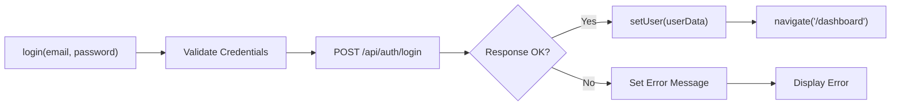
```mermaid
flowchart LR
LoginAction["login(email, password)"] --> ValidateInput["Validate Credentials"]
ValidateInput --> APICall["POST /api/auth/login"]
APICall --> Success{"Response OK?"}
Success --> |Yes| SetUser["setUser(userData)"]
Success --> |No| SetError["Set Error Message"]
SetUser --> Navigate["navigate('/dashboard')"]
SetError --> End["Display Error"]
```

**Diagram sources**
- [AuthContext.tsx](file://pikzels-clone/client/src/contexts/AuthContext.tsx#L65-L88)

### AI Service State Updates
AI Service state updates implement comprehensive state management with separate prompt states and error handling.

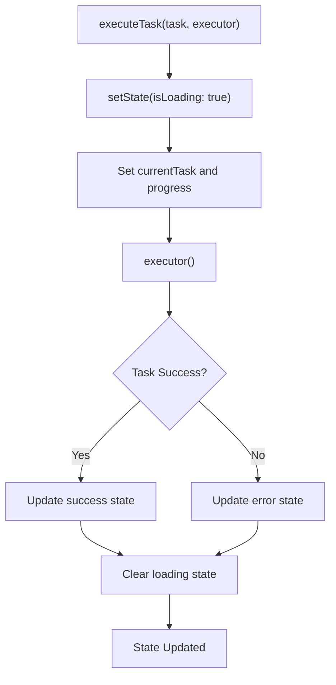
```mermaid
flowchart TD
ExecuteTask["executeTask(task, executor)"] --> SetLoading["setState(isLoading: true)"]
SetLoading --> SetCurrentTask["Set currentTask and progress"]
SetCurrentTask --> ExecuteExecutor["executor()"]
ExecuteExecutor --> Success{"Task Success?"}
Success --> |Yes| SetSuccess["Update success state"]
Success --> |No| SetError["Update error state"]
SetSuccess --> ClearState["Clear loading state"]
SetError --> ClearState
ClearState --> End["State Updated"]
```

**Diagram sources**
- [useAIService.ts](file://pikzels-clone/client/src/hooks/useAIService.ts#L96-L123)

### Theme State Updates
Theme state updates involve both React state management and CSS variable manipulation to ensure visual consistency.

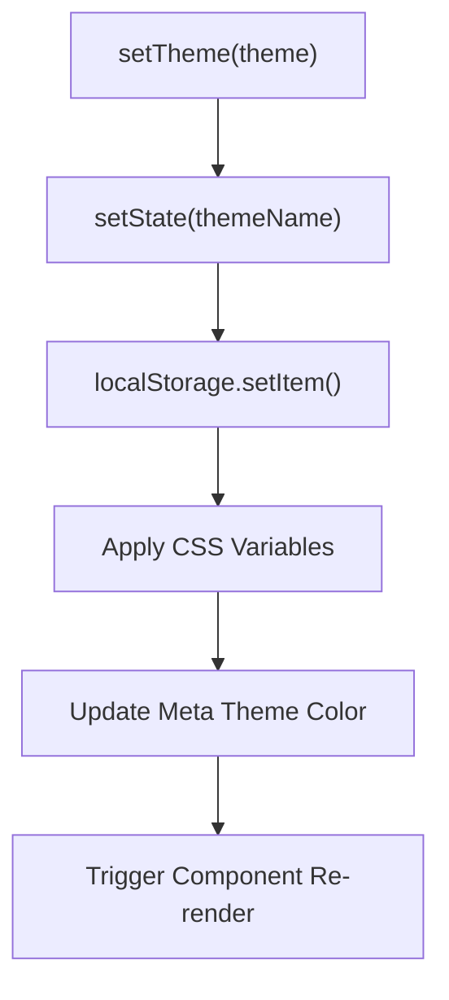
```mermaid
flowchart TD
SetTheme["setTheme(theme)"] --> UpdateState["setState(themeName)"]
UpdateState --> SaveLocalStorage["localStorage.setItem()"]
SaveLocalStorage --> ApplyCSS["Apply CSS Variables"]
ApplyCSS --> UpdateMeta["Update Meta Theme Color"]
UpdateMeta --> TriggerReRender["Trigger Component Re-render"]
```

**Diagram sources**
- [ThemeContext.tsx](file://pikzels-clone/client/src/contexts/ThemeContext.tsx#L355-L357)

**Section sources**
- [AuthContext.tsx](file://pikzels-clone/client/src/contexts/AuthContext.tsx#L1-L148)
- [useAIService.ts](file://pikzels-clone/client/src/hooks/useAIService.ts#L1-L191)
- [ThemeContext.tsx](file://pikzels-clone/client/src/contexts/ThemeContext.tsx#L1-L380)

## Re-render Optimization Strategies

The application employs several strategies to optimize re-renders and maintain performance despite global state management and complex AI operations.

### Context Value Memoization
The context value objects are memoized to prevent unnecessary re-renders of consumer components when the context value reference changes.

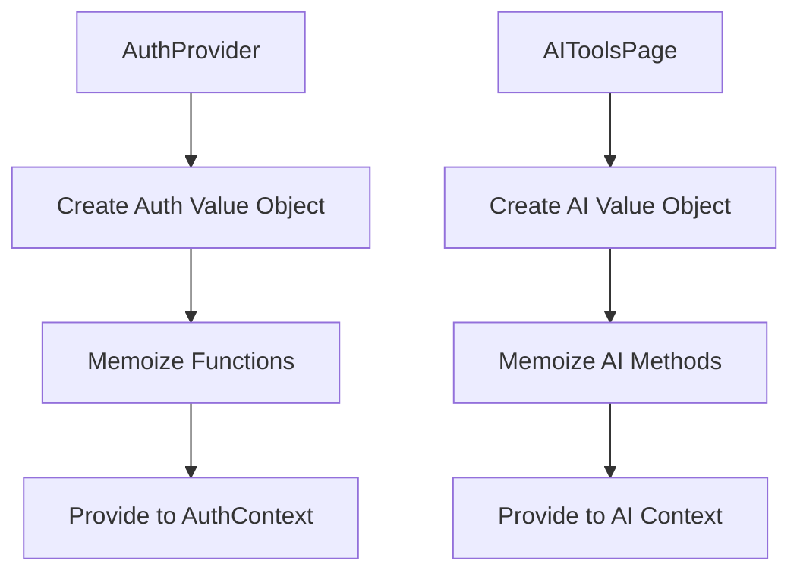
```mermaid
flowchart TD
AuthProvider["AuthProvider"] --> CreateUserValue["Create Auth Value Object"]
CreateUserValue --> MemoizeFunctions["Memoize Functions"]
MemoizeFunctions --> ProvideAuth["Provide to AuthContext"]
AIToolsPage["AIToolsPage"] --> CreateAIValue["Create AI Value Object"]
CreateAIValue --> MemoizeAI["Memoize AI Methods"]
MemoizeAI --> ProvideAI["Provide to AI Context"]
```

**Section sources**
- [AuthContext.tsx](file://pikzels-clone/client/src/contexts/AuthContext.tsx#L129-L136)
- [AIToolsPage.tsx](file://pikzels-clone/client/src/components/dashboard/AIToolsPage.tsx#L89-L95)

### Selective Context Consumption
Components consume only the specific parts of context they need, minimizing the impact of state changes.

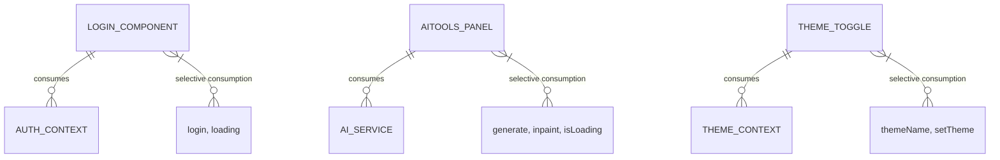
```mermaid
erDiagram
LOGIN_COMPONENT ||--o{ AUTH_CONTEXT : "consumes"
LOGIN_COMPONENT }|--o{ "login, loading" : "selective consumption"
AITOOLS_PANEL ||--o{ AI_SERVICE : "consumes"
AITOOLS_PANEL }|--o{ "generate, inpaint, isLoading" : "selective consumption"
THEME_TOGGLE ||--o{ THEME_CONTEXT : "consumes"
THEME_TOGGLE }|--o{ "themeName, setTheme" : "selective consumption"
```

**Section sources**
- [Login.tsx](file://pikzels-clone/client/src/components/auth/Login.tsx#L14)
- [AIToolsPanel.tsx](file://pikzels-clone/client/src/components/editor/panels/AIToolsPanel.tsx#L224-L239)
- [ThemeToggle.tsx](file://pikzels-clone/client/src/components/ThemeToggle.tsx#L11-L15)

### AI State Optimization
The AI tools page implements selective state management with separate prompt states to minimize re-renders during different AI operations.

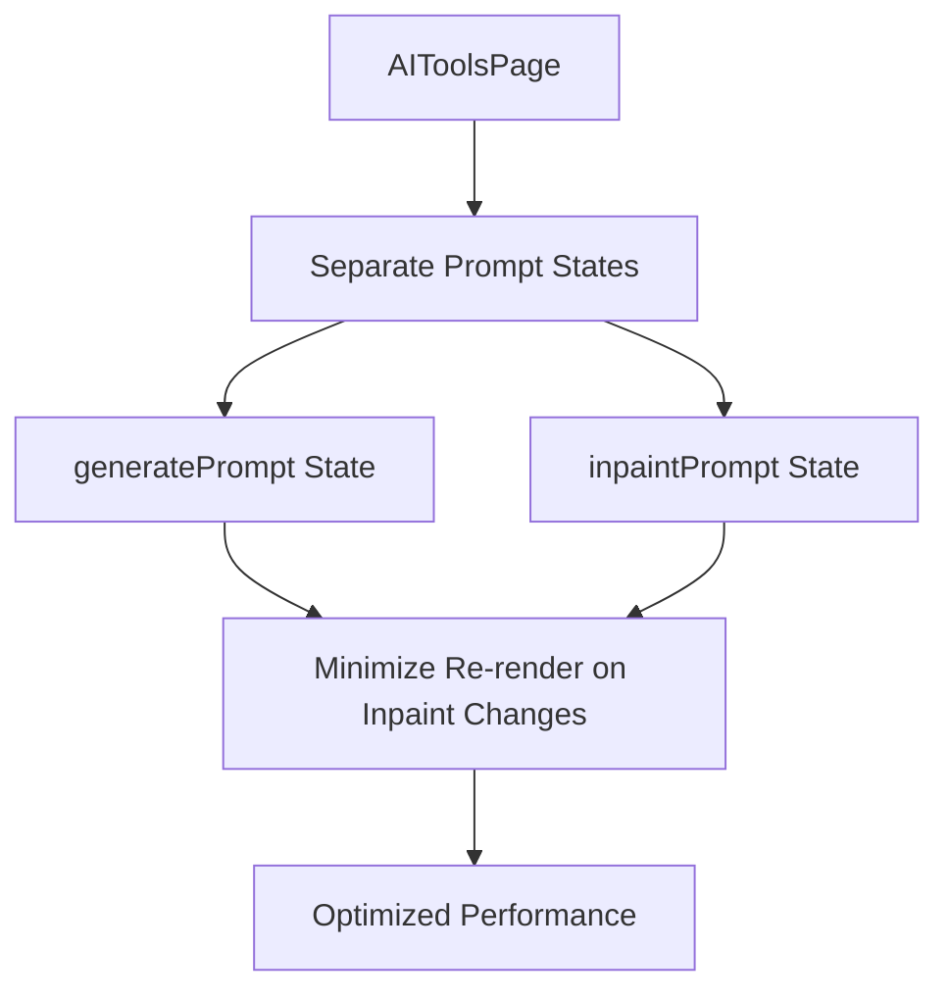
```mermaid
flowchart TD
AIToolsPage["AIToolsPage"] --> SeparateStates["Separate Prompt States"]
SeparateStates --> GenerateState["generatePrompt State"]
SeparateStates --> InpaintState["inpaintPrompt State"]
GenerateState --> MinimizeReRender["Minimize Re-render on Inpaint Changes"]
InpaintState --> MinimizeReRender
MinimizeReRender --> OptimizePerformance["Optimized Performance"]
```

**Diagram sources**
- [AIToolsPage.tsx](file://pikzels-clone/client/src/components/dashboard/AIToolsPage.tsx#L101-L102)

## Error Handling in State Transitions

The state management system implements comprehensive error handling for all state transitions, ensuring graceful degradation and user feedback across all contexts.

### Authentication Error Handling
Authentication operations include try-catch blocks and response validation to handle various error scenarios.

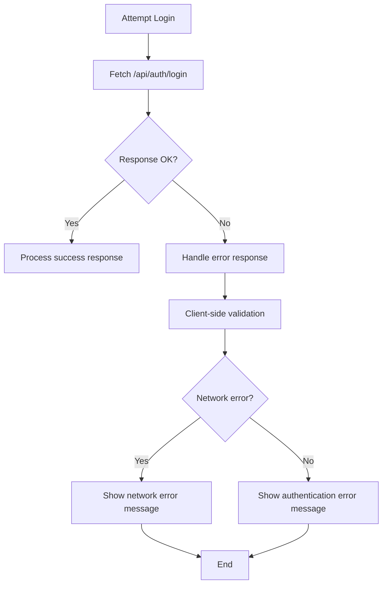
```mermaid
flowchart TD
AttemptLogin["Attempt Login"] --> NetworkRequest["Fetch /api/auth/login"]
NetworkRequest --> ResponseOK{"Response OK?"}
ResponseOK --> |Yes| ProcessSuccess["Process success response"]
ResponseOK --> |No| HandleError["Handle error response"]
HandleError --> ClientError["Client-side validation"]
ClientError --> NetworkError{"Network error?"}
NetworkError --> |Yes| ShowNetworkError["Show network error message"]
NetworkError --> |No| ShowAuthError["Show authentication error message"]
ShowNetworkError --> End
ShowAuthError --> End
```

**Diagram sources**
- [AuthContext.tsx](file://pikzels-clone/client/src/contexts/AuthContext.tsx#L65-L88)

### AI Service Error Handling
AI Service implements robust error handling with separate error states for different operations and comprehensive error recovery mechanisms.

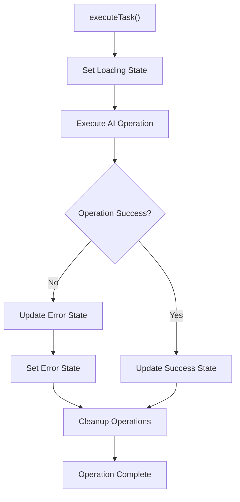
```mermaid
flowchart TD
ExecuteTask["executeTask()"] --> SetLoading["Set Loading State"]
SetLoading --> ExecuteOperation["Execute AI Operation"]
ExecuteOperation --> Success{"Operation Success?"}
Success --> |Yes| UpdateSuccess["Update Success State"]
Success --> |No| UpdateError["Update Error State"]
UpdateError --> SetErrorState["Set Error State"]
SetErrorState --> Cleanup["Cleanup Operations"]
UpdateSuccess --> Cleanup
Cleanup --> End["Operation Complete"]
```

**Diagram sources**
- [useAIService.ts](file://pikzels-clone/client/src/hooks/useAIService.ts#L96-L123)

### Theme Persistence Error Handling
Theme preference saving includes error handling to ensure the UI remains functional even when persistence fails.

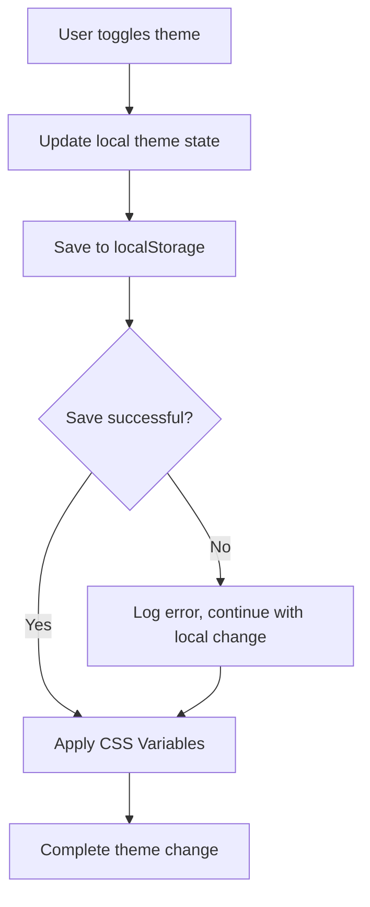
```mermaid
flowchart TD
ToggleTheme["User toggles theme"] --> UpdateLocal["Update local theme state"]
UpdateLocal --> SaveLocal["Save to localStorage"]
SaveLocal --> Success{"Save successful?"}
Success --> |Yes| ApplyCSS["Apply CSS Variables"]
Success --> |No| LogError["Log error, continue with local change"]
LogError --> ApplyCSS
ApplyCSS --> Complete["Complete theme change"]
```

**Diagram sources**
- [ThemeContext.tsx](file://pikzels-clone/client/src/contexts/ThemeContext.tsx#L355-L357)

**Section sources**
- [AuthContext.tsx](file://pikzels-clone/client/src/contexts/AuthContext.tsx#L1-L148)
- [useAIService.ts](file://pikzels-clone/client/src/hooks/useAIService.ts#L1-L191)
- [ThemeContext.tsx](file://pikzels-clone/client/src/contexts/ThemeContext.tsx#L1-L380)

## Common Issues and Best Practices

### Context Nesting Management
The application avoids excessive context nesting by organizing related state into logical contexts rather than creating numerous small contexts.

```mermaid
graph TD
App[App] --> Providers[Providers Wrapper]
Providers --> AuthProvider[AuthProvider]
Providers --> ThemeProvider[ThemeProvider]
Providers --> AIProvider[AIService Provider]
AuthProvider --> Components[Application Components]
ThemeProvider --> Components
AIProvider --> Components
```

### Performance Impact Mitigation
The system addresses performance concerns through several best practices:

1. **Function stability**: Authentication, theme, and AI functions are defined in providers and maintain stable references
2. **Selective re-renders**: Components only re-render when the specific state they consume changes
3. **Efficient updates**: State updates are batched and optimized through React's reconciliation process
4. **State separation**: AI operations maintain separate prompt states to minimize re-renders

### Best Practices Implemented
The implementation follows several React context best practices:

- **Provider at root**: Context providers are placed high in the component tree
- **Custom hooks**: useAuth, useTheme, and useAIService hooks provide type safety and error handling
- **Separation of concerns**: Authentication, theme, and AI state are separated into distinct contexts
- **Persistence**: State is persisted across sessions using localStorage and cookies
- **Graceful degradation**: The system functions correctly even when API calls or worker threads fail
- **Error boundaries**: Comprehensive error handling ensures user experience remains smooth during failures

**Section sources**
- [AuthContext.tsx](file://pikzels-clone/client/src/contexts/AuthContext.tsx#L1-L148)
- [ThemeContext.tsx](file://pikzels-clone/client/src/contexts/ThemeContext.tsx#L1-L380)
- [useAIService.ts](file://pikzels-clone/client/src/hooks/useAIService.ts#L1-L191)
- [Login.tsx](file://pikzels-clone/client/src/components/auth/Login.tsx#L1-L189)
- [ThemeToggle.tsx](file://pikzels-clone/client/src/components/ThemeToggle.tsx#L1-L34)
- [AIToolsPanel.tsx](file://pikzels-clone/client/src/components/editor/panels/AIToolsPanel.tsx#L1-L470)
- [AIPromptPanel.tsx](file://pikzels-clone/client/src/components/editor/panels/AIPromptPanel.tsx#L1-L265)