# State Management

<cite>
**Referenced Files in This Document**   
- [AuthContext.tsx](file://pikzels-clone/client/src/contexts/AuthContext.tsx)
- [ThemeContext.tsx](file://pikzels-clone/client/src/contexts/ThemeContext.tsx)
- [Login.tsx](file://pikzels-clone/client/src/components/auth/Login.tsx)
- [ThemeToggle.tsx](file://pikzels-clone/client/src/components/ThemeToggle.tsx)
- [Dashboard.tsx](file://pikzels-clone/client/src/components/Dashboard.tsx)
</cite>

## Table of Contents
1. [Introduction](#introduction)
2. [Context Providers Implementation](#context-providers-implementation)
3. [AuthContext: User Authentication State](#authcontext-user-authentication-state)
4. [ThemeContext: UI Theme Preferences](#themecontext-ui-theme-preferences)
5. [Consumer Components Integration](#consumer-components-integration)
6. [State Update Mechanisms](#state-update-mechanisms)
7. [Re-render Optimization Strategies](#re-render-optimization-strategies)
8. [Error Handling in State Transitions](#error-handling-in-state-transitions)
9. [Common Issues and Best Practices](#common-issues-and-best-practices)

## Introduction
This document provides a comprehensive analysis of the state management system in the frontend architecture of the Thumbnail Maker application. The implementation leverages React Context API to manage global application state, specifically focusing on two critical contexts: AuthContext for user authentication state and ThemeContext for UI theme preferences. The system enables centralized state management while maintaining component encapsulation and avoiding prop drilling. This documentation details the provider components, context value structure, consumer patterns using the useContext hook, and integration examples from key components such as Login.tsx and ThemeToggle.tsx.

## Context Providers Implementation

The application implements two primary context providers that wrap the application to make global state available to all child components. These providers are responsible for initializing state, handling side effects, and exposing state update mechanisms to consumers.

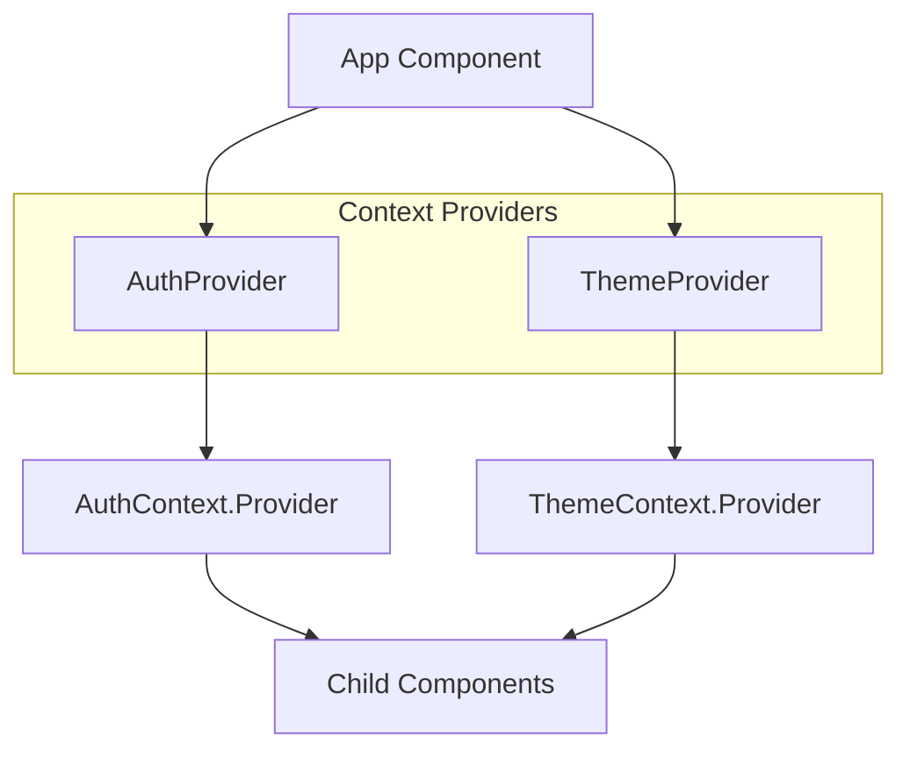

**Diagram sources**
- [AuthContext.tsx](file://pikzels-clone/client/src/contexts/AuthContext.tsx#L33-L136)
- [ThemeContext.tsx](file://pikzels-clone/client/src/contexts/ThemeContext.tsx#L15-L113)

**Section sources**
- [AuthContext.tsx](file://pikzels-clone/client/src/contexts/AuthContext.tsx#L1-L145)
- [ThemeContext.tsx](file://pikzels-clone/client/src/contexts/ThemeContext.tsx#L1-L122)

## AuthContext: User Authentication State

The AuthContext manages user authentication state including login, logout, registration, and session persistence. It provides a comprehensive interface for authentication operations and maintains user session state across the application.

### AuthContext Type Definition
The AuthContextType interface defines the structure of the authentication context, including user data, authentication methods, loading state, and authentication status.

```mermaid
classDiagram
class AuthContextType {
+user : User | null
+login(email : string, password : string) : Promise<{success : boolean, error? : string}>
+logout() : void
+register(email : string, password : string, name : string) : Promise<{success : boolean, error? : string}>
+loading : boolean
+isAuthenticated : boolean
}
class User {
+id : string
+email : string
+name? : string
}
AuthContextType --> User : "contains"
```

**Diagram sources**
- [AuthContext.tsx](file://pikzels-clone/client/src/contexts/AuthContext.tsx#L10-L27)

### Authentication Flow
The authentication flow begins with session persistence check on application load, followed by handling login, registration, and logout operations with proper error handling and state updates.

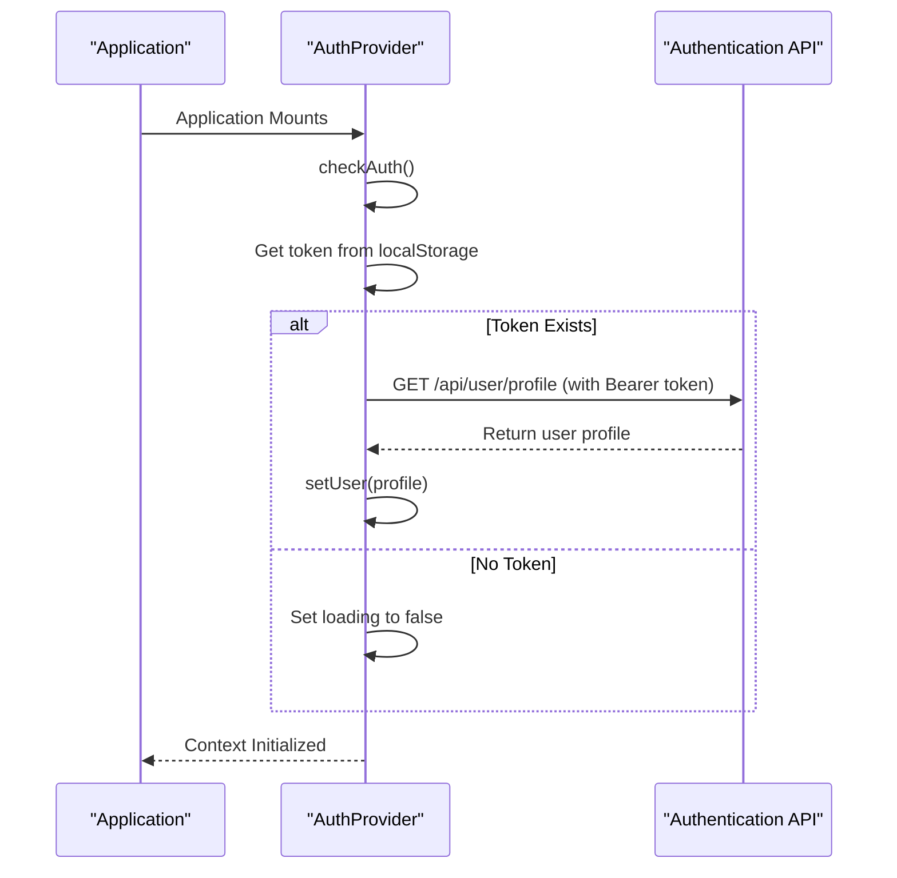

**Diagram sources**
- [AuthContext.tsx](file://pikzels-clone/client/src/contexts/AuthContext.tsx#L40-L75)

**Section sources**
- [AuthContext.tsx](file://pikzels-clone/client/src/contexts/AuthContext.tsx#L1-L145)

## ThemeContext: UI Theme Preferences

The ThemeContext manages UI theme preferences, supporting both light and dark modes with user preference persistence and system preference fallback.

### ThemeContext Type Definition
The ThemeContextType interface defines the structure of the theme context, including the current theme and the function to toggle between themes.

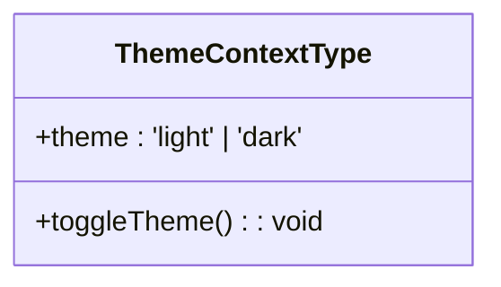

**Diagram sources**
- [ThemeContext.tsx](file://pikzels-clone/client/src/contexts/ThemeContext.tsx#L10-L13)

### Theme Initialization Flow
The theme system initializes by checking user preferences, falling back to system preferences when necessary, and applying the appropriate CSS classes to the document.

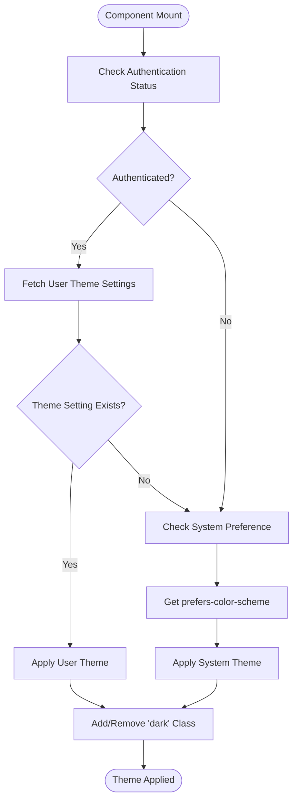

**Diagram sources**
- [ThemeContext.tsx](file://pikzels-clone/client/src/contexts/ThemeContext.tsx#L15-L113)

**Section sources**
- [ThemeContext.tsx](file://pikzels-clone/client/src/contexts/ThemeContext.tsx#L1-L122)

## Consumer Components Integration

### Login Component Integration
The Login component integrates with AuthContext to handle user authentication, demonstrating the consumer pattern for authentication state management.

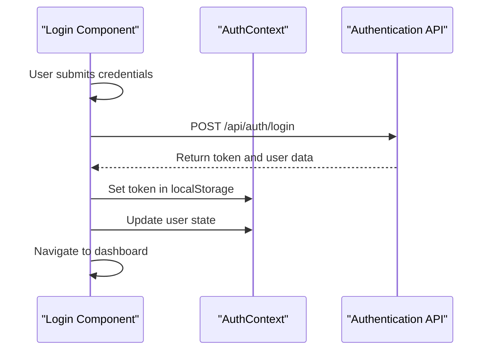

**Diagram sources**
- [Login.tsx](file://pikzels-clone/client/src/components/auth/Login.tsx#L1-L129)
- [AuthContext.tsx](file://pikzels-clone/client/src/contexts/AuthContext.tsx#L87-L108)

### ThemeToggle Component Integration
The ThemeToggle component consumes ThemeContext to provide users with a UI element for switching between light and dark themes.

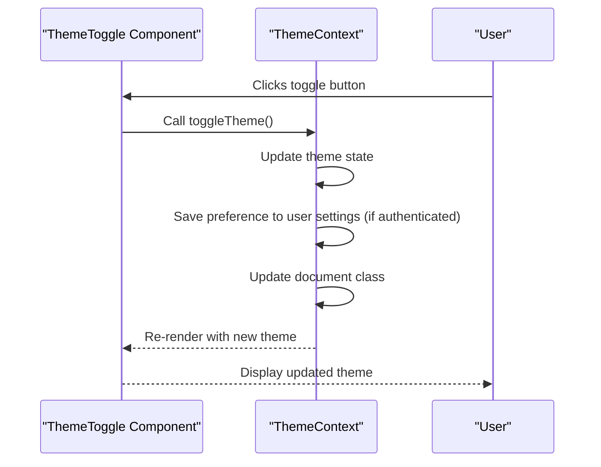

**Diagram sources**
- [ThemeToggle.tsx](file://pikzels-clone/client/src/components/ThemeToggle.tsx#L1-L33)
- [ThemeContext.tsx](file://pikzels-clone/client/src/contexts/ThemeContext.tsx#L95-L110)

**Section sources**
- [Login.tsx](file://pikzels-clone/client/src/components/auth/Login.tsx#L1-L129)
- [ThemeToggle.tsx](file://pikzels-clone/client/src/components/ThemeToggle.tsx#L1-L33)

## State Update Mechanisms

The state management system employs several mechanisms for updating state, ensuring consistency and proper side effects.

### Authentication State Updates
Authentication state updates occur through explicit actions (login, logout, register) that modify both local state and persistent storage.

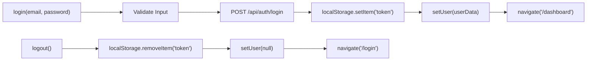

**Diagram sources**
- [AuthContext.tsx](file://pikzels-clone/client/src/contexts/AuthContext.tsx#L87-L130)

### Theme State Updates
Theme state updates involve both React state management and DOM manipulation to ensure visual consistency.

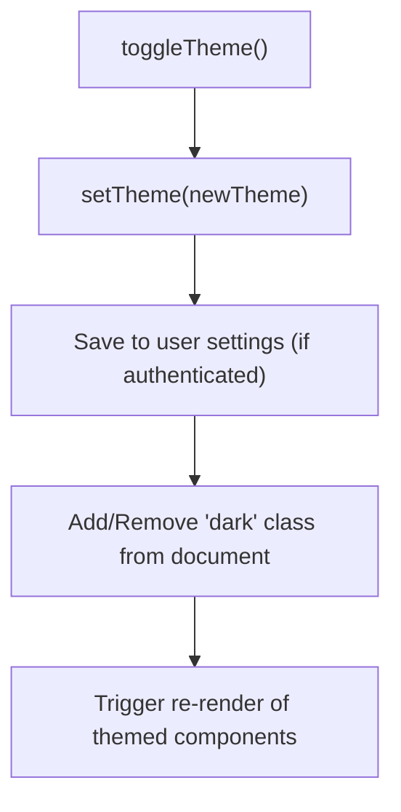

**Diagram sources**
- [ThemeContext.tsx](file://pikzels-clone/client/src/contexts/ThemeContext.tsx#L95-L110)

**Section sources**
- [AuthContext.tsx](file://pikzels-clone/client/src/contexts/AuthContext.tsx#L1-L145)
- [ThemeContext.tsx](file://pikzels-clone/client/src/contexts/ThemeContext.tsx#L1-L122)

## Re-render Optimization Strategies

The application employs several strategies to optimize re-renders and maintain performance despite global state management.

### Context Value Memoization
The context value objects are memoized to prevent unnecessary re-renders of consumer components when the context value reference changes.

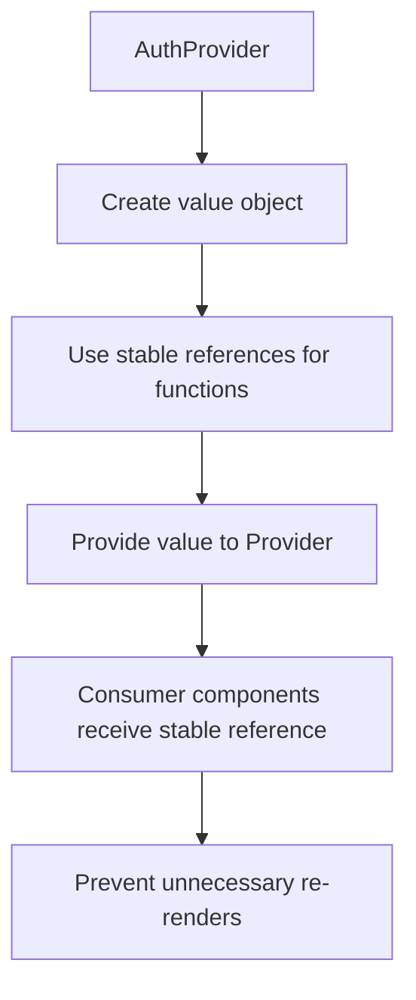

**Section sources**
- [AuthContext.tsx](file://pikzels-clone/client/src/contexts/AuthContext.tsx#L120-L130)

### Selective Context Consumption
Components consume only the specific parts of context they need, minimizing the impact of state changes.

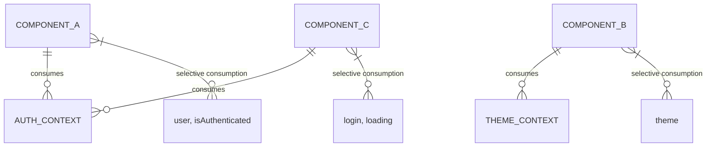

**Section sources**
- [Dashboard.tsx](file://pikzels-clone/client/src/components/Dashboard.tsx#L10-L58)
- [Login.tsx](file://pikzels-clone/client/src/components/auth/Login.tsx#L1-L129)

## Error Handling in State Transitions

The state management system implements comprehensive error handling for all state transitions, ensuring graceful degradation and user feedback.

### Authentication Error Handling
Authentication operations include try-catch blocks and response validation to handle various error scenarios.

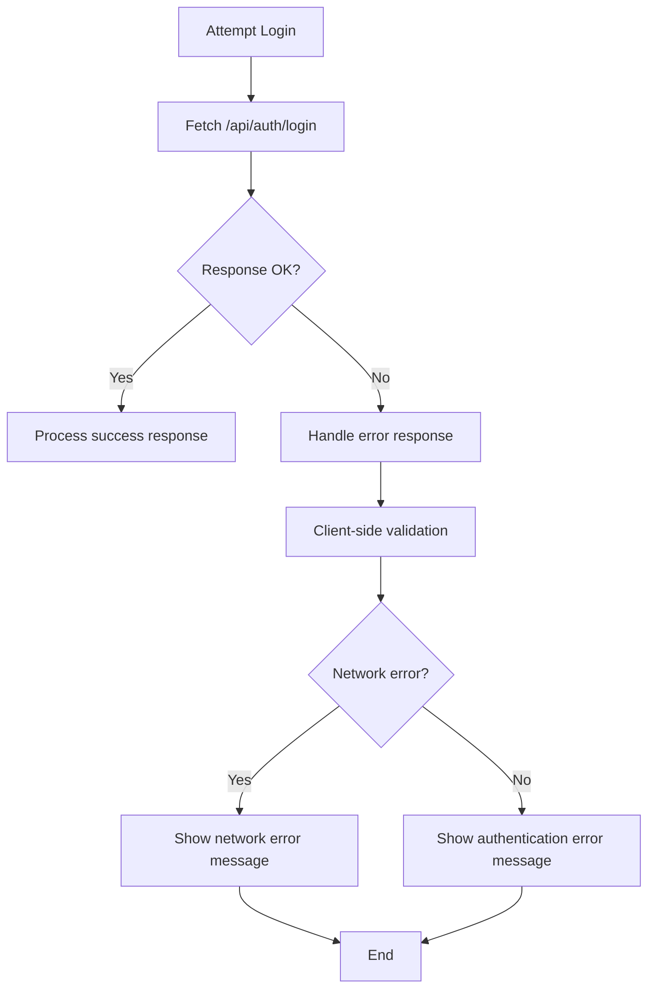

**Diagram sources**
- [AuthContext.tsx](file://pikzels-clone/client/src/contexts/AuthContext.tsx#L87-L108)

### Theme Persistence Error Handling
Theme preference saving includes error handling to ensure the UI remains functional even when persistence fails.

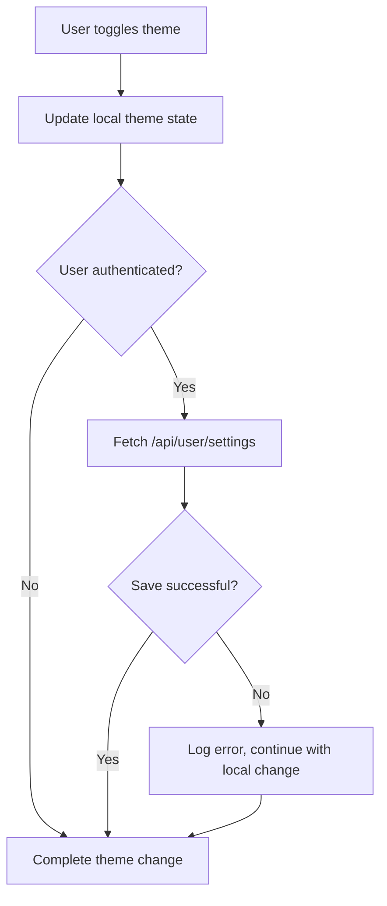

**Diagram sources**
- [ThemeContext.tsx](file://pikzels-clone/client/src/contexts/ThemeContext.tsx#L95-L110)

**Section sources**
- [AuthContext.tsx](file://pikzels-clone/client/src/contexts/AuthContext.tsx#L1-L145)
- [ThemeContext.tsx](file://pikzels-clone/client/src/contexts/ThemeContext.tsx#L1-L122)

## Common Issues and Best Practices

### Context Nesting Management
The application avoids excessive context nesting by organizing related state into logical contexts rather than creating numerous small contexts.

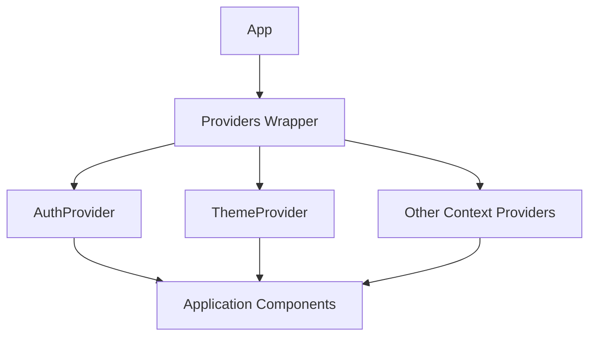

### Performance Impact Mitigation
The system addresses performance concerns through several best practices:

1. **Function stability**: Authentication and theme functions are defined in the provider and maintain stable references
2. **Selective re-renders**: Components only re-render when the specific state they consume changes
3. **Efficient updates**: State updates are batched and optimized through React's reconciliation process

### Best Practices Implemented
The implementation follows several React context best practices:

- **Provider at root**: Context providers are placed high in the component tree
- **Custom hooks**: useAuth and useTheme hooks provide type safety and error handling
- **Separation of concerns**: Authentication and theme state are separated into distinct contexts
- **Persistence**: State is persisted across sessions using localStorage
- **Graceful degradation**: The system functions correctly even when API calls fail

**Section sources**
- [AuthContext.tsx](file://pikzels-clone/client/src/contexts/AuthContext.tsx#L1-L145)
- [ThemeContext.tsx](file://pikzels-clone/client/src/contexts/ThemeContext.tsx#L1-L122)
- [Login.tsx](file://pikzels-clone/client/src/components/auth/Login.tsx#L1-L129)
- [ThemeToggle.tsx](file://pikzels-clone/client/src/components/ThemeToggle.tsx#L1-L33)