# UI Component Library

<cite>
**Referenced Files in This Document**
- [Button.tsx](file://pikzels-clone/client/src/components/ui/Button.tsx)
- [Card.tsx](file://pikzels-clone/client/src/components/ui/Card.tsx)
- [Input.tsx](file://pikzels-clone/client/src/components/ui/Input.tsx)
- [Panel.tsx](file://pikzels-clone/client/src/components/ui/Panel.tsx)
- [Toolbar.tsx](file://pikzels-clone/client/src/components/ui/Toolbar.tsx)
- [Slider.tsx](file://pikzels-clone/client/src/components/ui/Slider.tsx)
- [StatCard.tsx](file://pikzels-clone/client/src/components/ui/StatCard.tsx)
- [DashboardHome.tsx](file://pikzels-clone/client/src/components/dashboard/DashboardHome.tsx)
- [AIToolsPage.tsx](file://pikzels-clone/client/src/components/dashboard/AIToolsPage.tsx)
- [AccountDropdown.tsx](file://pikzels-clone/client/src/components/account/AccountDropdown.tsx)
- [UploadsPage.tsx](file://pikzels-clone/client/src/components/dashboard/UploadsPage.tsx)
- [ProjectsAndUploadsWidget.tsx](file://pikzels-clone/client/src/components/dashboard/widgets/ProjectsAndUploadsWidget.tsx)
- [AssetContextMenu.tsx](file://pikzels-clone/client/src/components/ui/AssetContextMenu.tsx)
- [ImagePreviewModal.tsx](file://pikzels-clone/client/src/components/ui/ImagePreviewModal.tsx)
- [widgets/index.ts](file://pikzels-clone/client/src/components/dashboard/widgets/index.ts)
- [AuthContext.tsx](file://pikzels-clone/client/src/contexts/AuthContext.tsx)
- [index.ts](file://pikzels-clone/client/src/components/ui/index.ts)
- [types.ts](file://pikzels-clone/client/src/components/ui/types.ts)
- [DashboardContext.tsx](file://pikzels-clone/client/src/contexts/DashboardContext.tsx)
- [design-system.css](file://pikzels-clone/client/src/styles/design-system.css)
- [dark-mode.css](file://pikzels-clone/client/src/styles/dark-mode.css)
</cite>

## Update Summary
**Changes Made**
- Added comprehensive UploadsPage component with advanced drag-and-drop functionality, asset categorization, and unified management interface
- Introduced ProjectsAndUploadsWidget replacing AllProjectsWidget with unified project and asset management through tabbed navigation
- Implemented AssetContextMenu component for asset recategorization with Radix UI context menu
- Added ImagePreviewModal component with comprehensive metadata display and navigation controls
- Enhanced dashboard widget system with sophisticated state management and responsive design
- Integrated @dnd-kit for advanced drag-and-drop operations with visual feedback and type conversion
- Added comprehensive error handling, loading states, and user experience improvements

## Table of Contents
1. [Introduction](#introduction)
2. [Project Structure](#project-structure)
3. [Core Components](#core-components)
4. [Architecture Overview](#architecture-overview)
5. [Detailed Component Analysis](#detailed-component-analysis)
6. [Enhanced Dashboard Components](#enhanced-dashboard-components)
7. [Uploads Management System](#uploads-management-system)
8. [Enhanced Widget System](#enhanced-widget-system)
9. [Drag-and-Drop Upload Areas](#drag-and-drop-upload-areas)
10. [Asset Management Components](#asset-management-components)
11. [Authentication and State Management](#authentication-and-state-management)
12. [Dependency Analysis](#dependency-analysis)
13. [Performance Considerations](#performance-considerations)
14. [Troubleshooting Guide](#troubleshooting-guide)
15. [Conclusion](#conclusion)

## Introduction
The UI Component Library in Thumbnail Maker Studio provides a consistent, accessible, and reusable set of components that adhere to the application's design system. These components are built using React with TypeScript and styled via CSS modules, ensuring type safety and encapsulation. The library supports responsive design, theming via CSS variables, and global dark mode integration. This documentation details each component's visual design, behavior, accessibility features, props, events, and customization options, along with usage examples and extension guidelines.

**Updated** Enhanced coverage of new UploadsPage component with comprehensive file management capabilities, ProjectsAndUploadsWidget replacing AllProjectsWidget with unified project and asset management, and expanded dashboard widget system with sophisticated drag-and-drop functionality and asset management features.

## Project Structure
The UI component library is located in the `client/src/components/ui` directory and includes reusable components such as Button, Card, Input, Panel, Toolbar, Slider, and StatCard. The dashboard components have been significantly expanded with UploadsPage for file management and ProjectsAndUploadsWidget for unified project and asset management. Each component has a corresponding `.tsx` file for logic and a `.css` file for styles. The library exports all components through centralized `index.ts` files, enabling clean imports across the application. Shared types are defined in `types.ts`, and global design tokens are managed in `design-system.css` and `dark-mode.css`.

**Updated** Added new UploadsPage component in `client/src/components/dashboard/` for comprehensive file management and ProjectsAndUploadsWidget in `client/src/components/dashboard/widgets/` for unified project and asset management. Introduced AssetContextMenu and ImagePreviewModal components for enhanced asset management capabilities.

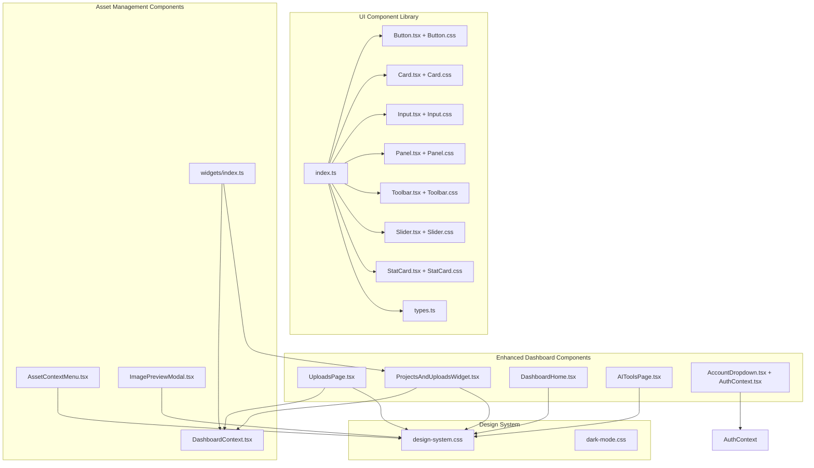
```mermaid
graph TB
subgraph "UI Component Library"
Button[Button.tsx + Button.css]
Card[Card.tsx + Card.css]
Input[Input.tsx + Input.css]
Panel[Panel.tsx + Panel.css]
Toolbar[Toolbar.tsx + Toolbar.css]
Slider[Slider.tsx + Slider.css]
StatCard[StatCard.tsx + StatCard.css]
Index[index.ts]
Types[types.ts]
end
subgraph "Enhanced Dashboard Components"
UploadsPage[UploadsPage.tsx]
ProjectsAndUploadsWidget[ProjectsAndUploadsWidget.tsx]
DashboardHome[DashboardHome.tsx]
AIToolsPage[AIToolsPage.tsx]
AccountDropdown[AccountDropdown.tsx + AuthContext.tsx]
end
subgraph "Asset Management Components"
AssetContextMenu[AssetContextMenu.tsx]
ImagePreviewModal[ImagePreviewModal.tsx]
WidgetIndex[widgets/index.ts]
DashboardContext[DashboardContext.tsx]
end
subgraph "Design System"
DesignSystem[design-system.css]
DarkMode[dark-mode.css]
end
Index --> Button
Index --> Card
Index --> Input
Index --> Panel
Index --> Toolbar
Index --> Slider
Index --> StatCard
Index --> Types
UploadsPage --> DesignSystem
ProjectsAndUploadsWidget --> DesignSystem
ProjectsAndUploadsWidget --> DashboardContext
UploadsPage --> DashboardContext
DashboardHome --> DesignSystem
AIToolsPage --> DesignSystem
AccountDropdown --> AuthContext
WidgetIndex --> ProjectsAndUploadsWidget
WidgetIndex --> DashboardContext
AssetContextMenu --> DesignSystem
ImagePreviewModal --> DesignSystem
```

**Diagram sources**
- [index.ts](file://pikzels-clone/client/src/components/ui/index.ts)
- [widgets/index.ts](file://pikzels-clone/client/src/components/dashboard/widgets/index.ts)
- [design-system.css](file://pikzels-clone/client/src/styles/design-system.css)
- [dark-mode.css](file://pikzels-clone/client/src/styles/dark-mode.css)
- [DashboardHome.tsx](file://pikzels-clone/client/src/components/dashboard/DashboardHome.tsx)
- [AIToolsPage.tsx](file://pikzels-clone/client/src/components/dashboard/AIToolsPage.tsx)
- [AccountDropdown.tsx](file://pikzels-clone/client/src/components/account/AccountDropdown.tsx)
- [AuthContext.tsx](file://pikzels-clone/client/src/contexts/AuthContext.tsx)
- [UploadsPage.tsx](file://pikzels-clone/client/src/components/dashboard/UploadsPage.tsx)
- [ProjectsAndUploadsWidget.tsx](file://pikzels-clone/client/src/components/dashboard/widgets/ProjectsAndUploadsWidget.tsx)
- [AssetContextMenu.tsx](file://pikzels-clone/client/src/components/ui/AssetContextMenu.tsx)
- [ImagePreviewModal.tsx](file://pikzels-clone/client/src/components/ui/ImagePreviewModal.tsx)
- [DashboardContext.tsx](file://pikzels-clone/client/src/contexts/DashboardContext.tsx)

**Section sources**
- [Button.tsx](file://pikzels-clone/client/src/components/ui/Button.tsx)
- [Card.tsx](file://pikzels-clone/client/src/components/ui/Card.tsx)
- [Input.tsx](file://pikzels-clone/client/src/components/ui/Input.tsx)
- [Panel.tsx](file://pikzels-clone/client/src/components/ui/Panel.tsx)
- [Toolbar.tsx](file://pikzels-clone/client/src/components/ui/Toolbar.tsx)
- [Slider.tsx](file://pikzels-clone/client/src/components/ui/Slider.tsx)
- [StatCard.tsx](file://pikzels-clone/client/src/components/ui/StatCard.tsx)
- [DashboardHome.tsx](file://pikzels-clone/client/src/components/dashboard/DashboardHome.tsx)
- [AIToolsPage.tsx](file://pikzels-clone/client/src/components/dashboard/AIToolsPage.tsx)
- [AccountDropdown.tsx](file://pikzels-clone/client/src/components/account/AccountDropdown.tsx)
- [AuthContext.tsx](file://pikzels-clone/client/src/contexts/AuthContext.tsx)
- [index.ts](file://pikzels-clone/client/src/components/ui/index.ts)
- [types.ts](file://pikzels-clone/client/src/components/ui/types.ts)
- [UploadsPage.tsx](file://pikzels-clone/client/src/components/dashboard/UploadsPage.tsx)
- [ProjectsAndUploadsWidget.tsx](file://pikzels-clone/client/src/components/dashboard/widgets/ProjectsAndUploadsWidget.tsx)
- [AssetContextMenu.tsx](file://pikzels-clone/client/src/components/ui/AssetContextMenu.tsx)
- [ImagePreviewModal.tsx](file://pikzels-clone/client/src/components/ui/ImagePreviewModal.tsx)
- [widgets/index.ts](file://pikzels-clone/client/src/components/dashboard/widgets/index.ts)
- [DashboardContext.tsx](file://pikzels-clone/client/src/contexts/DashboardContext.tsx)

## Core Components
The core components of the UI library include Button, Card, Input, Panel, Toolbar, Slider, and StatCard. Each component is designed with accessibility in mind, supporting keyboard navigation, ARIA attributes, and screen reader compatibility. Components are built using TypeScript interfaces to define props, ensuring type safety and developer experience. Styling is achieved through CSS modules and design system tokens, enabling consistent theming and dark mode support.

**Updated** Core components remain unchanged, but now integrated with enhanced dashboard components including UploadsPage with comprehensive drag-and-drop functionality and ProjectsAndUploadsWidget with unified project and asset management capabilities.

**Section sources**
- [Button.tsx](file://pikzels-clone/client/src/components/ui/Button.tsx)
- [Card.tsx](file://pikzels-clone/client/src/components/ui/Card.tsx)
- [Input.tsx](file://pikzels-clone/client/src/components/ui/Input.tsx)
- [Panel.tsx](file://pikzels-clone/client/src/components/ui/Panel.tsx)
- [Toolbar.tsx](file://pikzels-clone/client/src/components/ui/Toolbar.tsx)
- [Slider.tsx](file://pikzels-clone/client/src/components/ui/Slider.tsx)
- [StatCard.tsx](file://pikzels-clone/client/src/components/ui/StatCard.tsx)

## Architecture Overview
The UI component library follows a modular architecture where each component is self-contained with its own styles and logic. Components are composed using sub-components (e.g., CardHeader, CardBody) for better flexibility. The design system uses CSS custom properties (variables) defined in `design-system.css` for consistent spacing, typography, colors, and shadows. Dark mode is implemented by overriding these variables in the `.dark` class, applied globally via a theme context. Components are exported through `index.ts` for easy consumption, and types are shared via `types.ts`.

**Updated** Architecture now includes specialized dashboard components with advanced state management, authentication integration, comprehensive drag-and-drop functionality, and a complete widget system with dashboard customization capabilities. The new UploadsPage component integrates with the asset management system and provides unified file handling with sophisticated drag-and-drop operations and visual feedback.

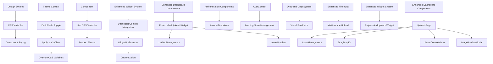
```mermaid
graph TD
A[Design System] --> B[CSS Variables]
B --> C[Component Styling]
D[Theme Context] --> E[Dark Mode Toggle]
E --> F[Apply .dark Class]
F --> G[Override CSS Variables]
H[Component] --> I[Use CSS Variables]
I --> J[Respect Theme]
K[Enhanced Dashboard Components] --> L[UploadsPage]
M[Enhanced Dashboard Components] --> N[ProjectsAndUploadsWidget]
O[Authentication Components] --> P[AccountDropdown]
Q[AuthContext] --> R[Loading State Management]
S[Drag-and-Drop System] --> T[Visual Feedback]
U[Enhanced File Input] --> V[Multi-source Upload]
W[Enhanced Widget System] --> X[ProjectsAndUploadsWidget]
Y[Enhanced Widget System] --> Z[DashboardContext Integration]
Z --> WidgetPreferences
WidgetPreferences --> Customization
L --> AssetManagement
N --> UnifiedManagement
N --> AssetPreview
L --> DragDropKit
L --> AssetContextMenu
L --> ImagePreviewModal
```

**Diagram sources**
- [design-system.css](file://pikzels-clone/client/src/styles/design-system.css)
- [dark-mode.css](file://pikzels-clone/client/src/styles/dark-mode.css)
- [DashboardHome.tsx](file://pikzels-clone/client/src/components/dashboard/DashboardHome.tsx)
- [AIToolsPage.tsx](file://pikzels-clone/client/src/components/dashboard/AIToolsPage.tsx)
- [AccountDropdown.tsx](file://pikzels-clone/client/src/components/account/AccountDropdown.tsx)
- [AuthContext.tsx](file://pikzels-clone/client/src/contexts/AuthContext.tsx)
- [UploadsPage.tsx](file://pikzels-clone/client/src/components/dashboard/UploadsPage.tsx)
- [ProjectsAndUploadsWidget.tsx](file://pikzels-clone/client/src/components/dashboard/widgets/ProjectsAndUploadsWidget.tsx)
- [AssetContextMenu.tsx](file://pikzels-clone/client/src/components/ui/AssetContextMenu.tsx)
- [ImagePreviewModal.tsx](file://pikzels-clone/client/src/components/ui/ImagePreviewModal.tsx)
- [DashboardContext.tsx](file://pikzels-clone/client/src/contexts/DashboardContext.tsx)

## Detailed Component Analysis

### Button Analysis
The Button component supports multiple variants (primary, secondary, ghost, danger, success), sizes (sm, md, lg), and states (loading, disabled, full-width). It accepts left and right icons and is fully accessible with proper focus indicators and ARIA attributes. The loading state displays a spinner, and the button is disabled during loading.

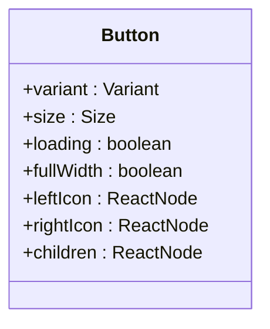
```mermaid
classDiagram
class Button {
+variant : Variant
+size : Size
+loading : boolean
+fullWidth : boolean
+leftIcon : ReactNode
+rightIcon : ReactNode
+children : ReactNode
}
```

**Diagram sources**
- [Button.tsx](file://pikzels-clone/client/src/components/ui/Button.tsx)

**Section sources**
- [Button.tsx](file://pikzels-clone/client/src/components/ui/Button.tsx)

### Card Analysis
The Card component provides a container with variants (default, outlined, elevated, filled), padding options, and interactive states. It includes sub-components CardHeader, CardBody, and CardFooter for structured content layout. Cards support hover effects when marked as interactive.

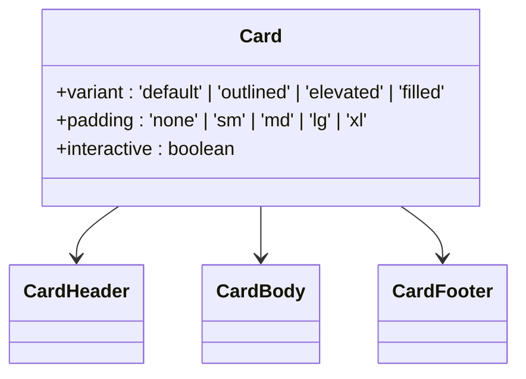
```mermaid
classDiagram
class Card {
+variant : 'default' | 'outlined' | 'elevated' | 'filled'
+padding : 'none' | 'sm' | 'md' | 'lg' | 'xl'
+interactive : boolean
}
class CardHeader
class CardBody
class CardFooter
Card --> CardHeader
Card --> CardBody
Card --> CardFooter
```

**Diagram sources**
- [Card.tsx](file://pikzels-clone/client/src/components/ui/Card.tsx)

**Section sources**
- [Card.tsx](file://pikzels-clone/client/src/components/ui/Card.tsx)

### Input Analysis
The Input component supports labels, helper text, error messages, left/right icons, and validation states. It is fully accessible with proper labeling, ARIA attributes, and error announcements. The component handles focus states and integrates with form validation systems.

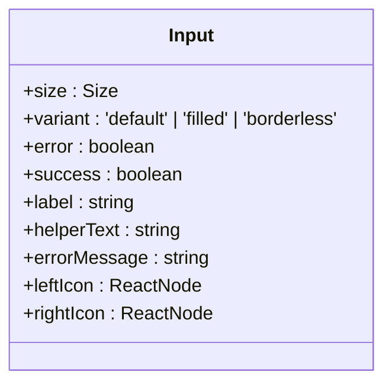
```mermaid
classDiagram
class Input {
+size : Size
+variant : 'default' | 'filled' | 'borderless'
+error : boolean
+success : boolean
+label : string
+helperText : string
+errorMessage : string
+leftIcon : ReactNode
+rightIcon : ReactNode
}
```

**Diagram sources**
- [Input.tsx](file://pikzels-clone/client/src/components/ui/Input.tsx)

**Section sources**
- [Input.tsx](file://pikzels-clone/client/src/components/ui/Input.tsx)

### Panel Analysis
The Panel component is a collapsible container built on top of Card. It supports titles, actions, collapsible behavior, and nested sections via PanelSection and PanelGroup. Panels can be bordered or borderless and support different sizes and variants.

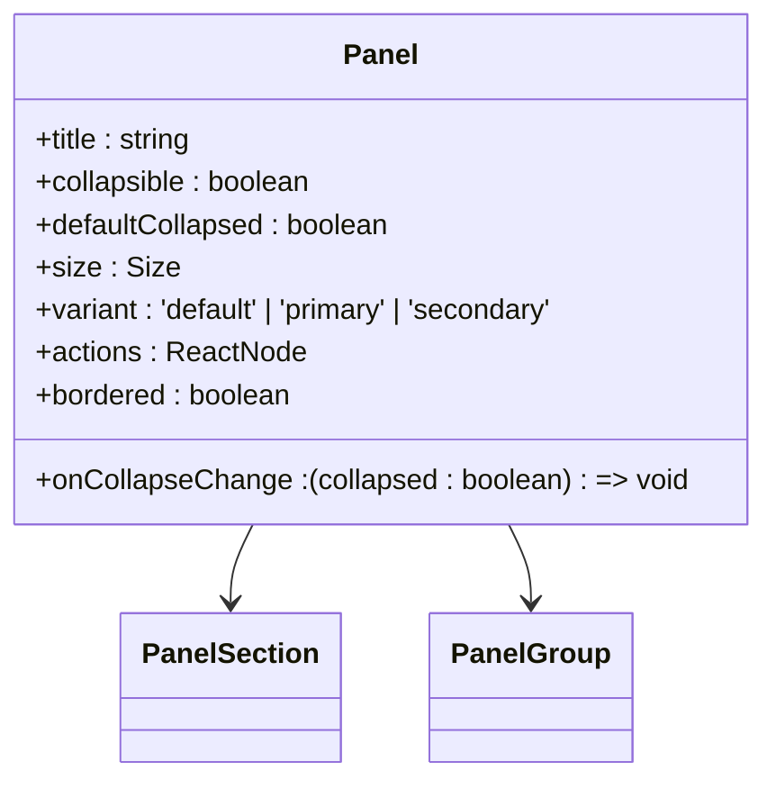
```mermaid
classDiagram
class Panel {
+title : string
+collapsible : boolean
+defaultCollapsed : boolean
+size : Size
+variant : 'default' | 'primary' | 'secondary'
+actions : ReactNode
+bordered : boolean
+onCollapseChange : (collapsed : boolean) => void
}
class PanelSection
class PanelGroup
Panel --> PanelSection
Panel --> PanelGroup
```

**Diagram sources**
- [Panel.tsx](file://pikzels-clone/client/src/components/ui/Panel.tsx)

**Section sources**
- [Panel.tsx](file://pikzels-clone/client/src/components/ui/Panel.tsx)

### Toolbar Analysis
The Toolbar component displays a set of tools with active state indication. It supports horizontal or vertical orientation and integrates with Button components. Tool items can have icons, labels, tooltips, and separators.

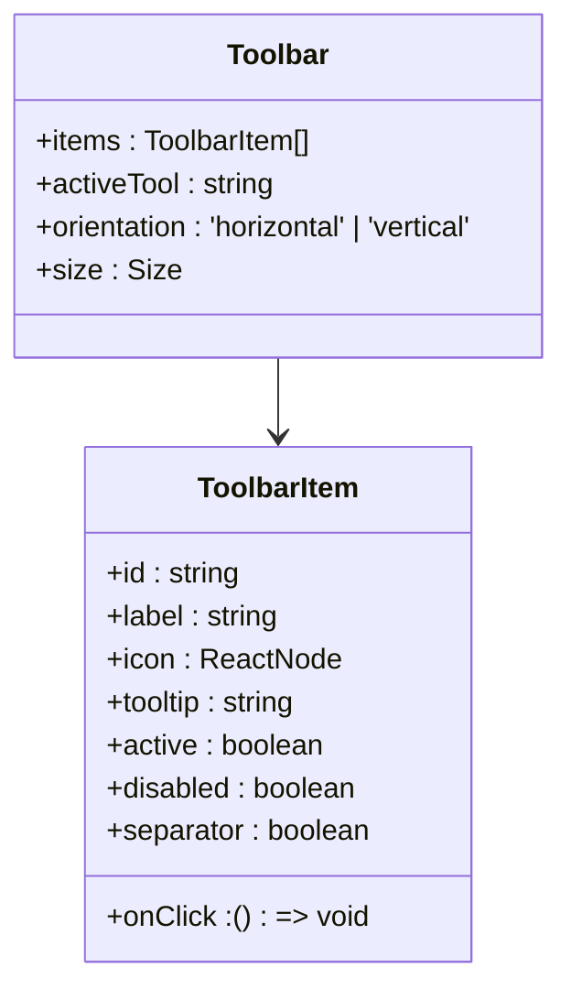
```mermaid
classDiagram
class Toolbar {
+items : ToolbarItem[]
+activeTool : string
+orientation : 'horizontal' | 'vertical'
+size : Size
}
class ToolbarItem {
+id : string
+label : string
+icon : ReactNode
+tooltip : string
+active : boolean
+disabled : boolean
+onClick : () => void
+separator : boolean
}
Toolbar --> ToolbarItem
```

**Diagram sources**
- [Toolbar.tsx](file://pikzels-clone/client/src/components/ui/Toolbar.tsx)

**Section sources**
- [Toolbar.tsx](file://pikzels-clone/client/src/components/ui/Toolbar.tsx)

### Slider Analysis
The Slider component provides a range input with visual feedback, supporting mouse and keyboard interaction. It displays the current value and supports formatting. The component is accessible with proper ARIA labeling and keyboard navigation (arrow keys, Page Up/Down, Home/End).

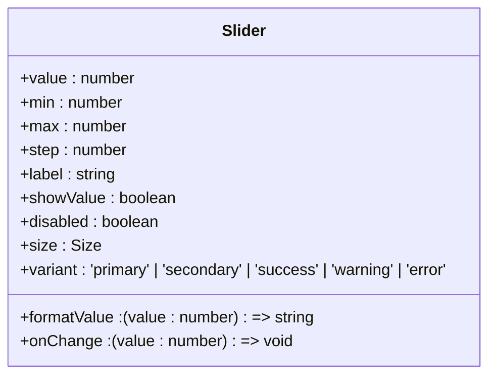
```mermaid
classDiagram
class Slider {
+value : number
+min : number
+max : number
+step : number
+label : string
+showValue : boolean
+formatValue : (value : number) => string
+disabled : boolean
+size : Size
+variant : 'primary' | 'secondary' | 'success' | 'warning' | 'error'
+onChange : (value : number) => void
}
```

**Diagram sources**
- [Slider.tsx](file://pikzels-clone/client/src/components/ui/Slider.tsx)

**Section sources**
- [Slider.tsx](file://pikzels-clone/client/src/components/ui/Slider.tsx)

### StatCard Analysis
The StatCard component displays key metrics with icons, trends, and optional interactivity. It supports trend indicators (up, down, neutral) with directional icons and percentage changes. The component is built on Card and supports click handling for interactive dashboards.

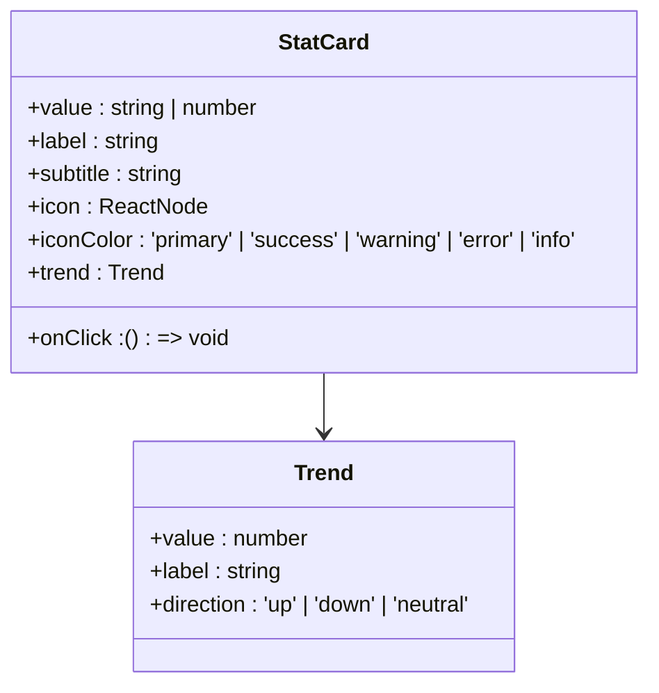
```mermaid
classDiagram
class StatCard {
+value : string | number
+label : string
+subtitle : string
+icon : ReactNode
+iconColor : 'primary' | 'success' | 'warning' | 'error' | 'info'
+trend : Trend
+onClick : () => void
}
class Trend {
+value : number
+label : string
+direction : 'up' | 'down' | 'neutral'
}
StatCard --> Trend
```

**Diagram sources**
- [StatCard.tsx](file://pikzels-clone/client/src/components/ui/StatCard.tsx)

**Section sources**
- [StatCard.tsx](file://pikzels-clone/client/src/components/ui/StatCard.tsx)

## Enhanced Dashboard Components

### DashboardHome Analysis
The DashboardHome component is a sophisticated dashboard interface featuring a platform typing animation system, comprehensive file upload capabilities, and enhanced modal systems. It serves as the central hub for thumbnail generation with advanced social media platform integration.

#### Key Features
- **Platform Typing Animation**: Sophisticated animated input field that cycles through supported platforms (YouTube, TikTok, Instagram, Twitter) with realistic typing/deleting effects
- **Comprehensive File Upload System**: Multi-source file upload with drag-and-drop support, progress tracking, and validation
- **Cloud Integration**: Native integration with Google Drive and iCloud for seamless file access
- **Advanced Modal Systems**: Multiple modal types for face inclusion, cloud authentication, example previews, and success notifications
- **Project Management**: Grid-based project display with auto-save and auto-import capabilities
- **Statistics Dashboard**: Real-time metrics display with trending indicators

#### Platform Typing Animation System
The typing animation creates a dynamic user experience by cycling through supported platforms with realistic typing effects:

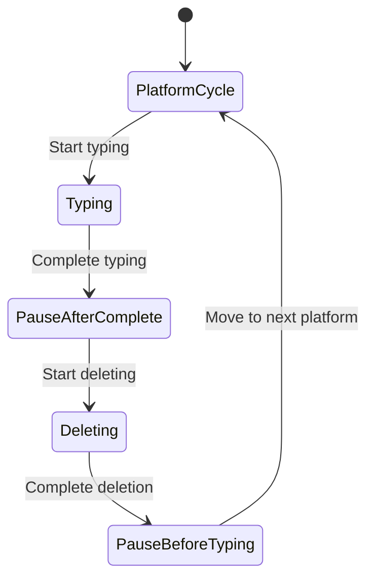
```mermaid
stateDiagram-v2
[*] --> PlatformCycle
PlatformCycle --> Typing : Start typing
Typing --> PauseAfterComplete : Complete typing
PauseAfterComplete --> Deleting : Start deleting
Deleting --> PauseBeforeTyping : Complete deletion
PauseBeforeTyping --> PlatformCycle : Move to next platform
```

**Diagram sources**
- [DashboardHome.tsx](file://pikzels-clone/client/src/components/dashboard/DashboardHome.tsx)

#### File Upload and Cloud Integration
The component provides a comprehensive file management system:

- **Local Upload**: Direct file upload with drag-and-drop support and progress visualization
- **Cloud Integration**: OAuth-based connection to Google Drive and iCloud with file browsing
- **Face Detection**: AI-powered face detection with automatic cropping and selection
- **Validation**: Comprehensive file validation with size and type restrictions

#### Modal System Architecture
The dashboard employs a sophisticated modal system with multiple specialized modals:

- **Face Inclusion Modal**: Advanced face selection with upload, AI detection, and cloud integration
- **Cloud Authentication Modals**: OAuth flows for Google Drive and iCloud with loading states
- **Example Preview Modal**: Interactive thumbnail showcase with navigation controls
- **Success Notification Modal**: Automated success confirmation with redirect handling

#### Technical Implementation
The component uses advanced React patterns including:
- **Custom Hooks**: For state management and side effects
- **Observer Pattern**: For real-time state updates
- **Strategy Pattern**: For different upload and cloud integration strategies
- **Command Pattern**: For undo/redo operations and modal management

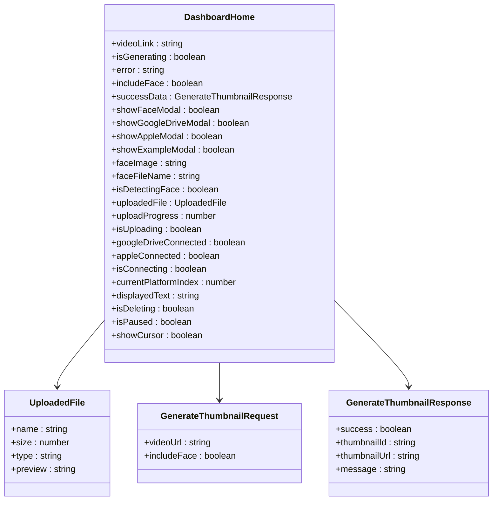
```mermaid
classDiagram
class DashboardHome {
+videoLink : string
+isGenerating : boolean
+error : string
+includeFace : boolean
+successData : GenerateThumbnailResponse
+showFaceModal : boolean
+showGoogleDriveModal : boolean
+showAppleModal : boolean
+showExampleModal : boolean
+faceImage : string
+faceFileName : string
+isDetectingFace : boolean
+uploadedFile : UploadedFile
+uploadProgress : number
+isUploading : boolean
+googleDriveConnected : boolean
+appleConnected : boolean
+isConnecting : boolean
+currentPlatformIndex : number
+displayedText : string
+isDeleting : boolean
+isPaused : boolean
+showCursor : boolean
}
class UploadedFile {
+name : string
+size : number
+type : string
+preview : string
}
class GenerateThumbnailRequest {
+videoUrl : string
+includeFace : boolean
}
class GenerateThumbnailResponse {
+success : boolean
+thumbnailId : string
+thumbnailUrl : string
+message : string
}
DashboardHome --> UploadedFile
DashboardHome --> GenerateThumbnailRequest
DashboardHome --> GenerateThumbnailResponse
```

**Diagram sources**
- [DashboardHome.tsx](file://pikzels-clone/client/src/components/dashboard/DashboardHome.tsx)

#### Props and Events
- **videoUrl**: Optional initial video URL for direct loading
- **onFacesExtracted**: Callback receiving selected faces for processing
- **onSuccess**: Success callback with thumbnail data

#### Usage Examples
```typescript
// Basic dashboard usage
<DashboardHome />

// With custom callbacks
<DashboardHome 
  onFacesExtracted={(faces) => processFaces(faces)}
  onSuccess={(data) => handleSuccess(data)}
```

**Section sources**
- [DashboardHome.tsx](file://pikzels-clone/client/src/components/dashboard/DashboardHome.tsx)

### AIToolsPage Analysis
The AIToolsPage component provides a comprehensive AI-powered image editing interface with advanced drag-and-drop functionality and enhanced file input handling. This standalone component offers six distinct AI tools: image generation, inpainting, background removal, face swapping, image enhancement, and AI upscaling.

#### Key Features
- **Comprehensive AI Tool Suite**: Six specialized AI tools with dedicated interfaces and workflows
- **Advanced Drag-and-Drop System**: Dual upload areas with visual feedback for both main images and face swap sources
- **Enhanced State Management**: Sophisticated state handling for drag operations and file processing
- **Multi-format Support**: PNG, JPG, and GIF uploads with size and type validation
- **Real-time Processing**: Loading states and error handling for AI operations
- **Responsive Design**: Adaptive layouts for different screen sizes

#### Drag-and-Drop Upload Areas
The component implements two distinct drag-and-drop upload areas with comprehensive visual feedback:

**Main Image Upload Area**
- **Location**: Top-left panel for tools requiring image input
- **Visual Feedback**: Blue border and gradient background during drag operations
- **Instructions**: Clear messaging indicating drop zone activation
- **File Validation**: Automatic filtering for image MIME types

**Face Swap Source Upload Area**
- **Location**: Dedicated area within face swap tool interface
- **Visual Feedback**: Orange border and gradient background for face-specific uploads
- **Size Constraints**: Fixed 32x32 dimensions for optimal face recognition
- **Dual Functionality**: Accepts both drag-and-drop and traditional file selection

#### State Management Improvements
The component introduces enhanced state management for drag-and-drop operations:

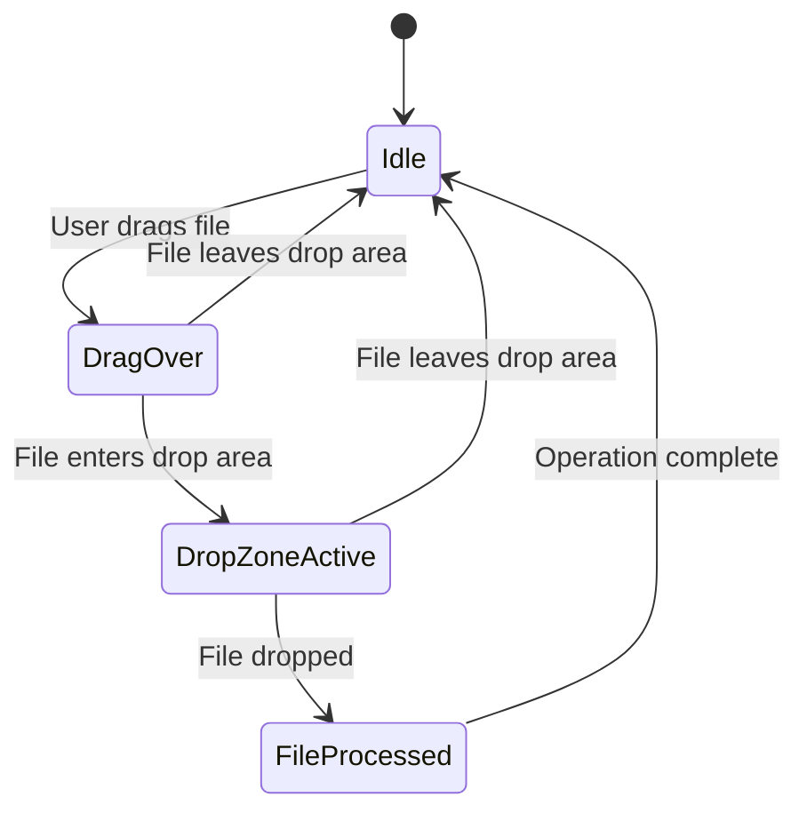
```mermaid
stateDiagram-v2
[*] --> Idle
Idle --> DragOver : User drags file
DragOver --> DropZoneActive : File enters drop area
DropZoneActive --> FileProcessed : File dropped
FileProcessed --> Idle : Operation complete
DragOver --> Idle : File leaves drop area
DropZoneActive --> Idle : File leaves drop area
```

**Diagram sources**
- [AIToolsPage.tsx](file://pikzels-clone/client/src/components/dashboard/AIToolsPage.tsx)

#### AI Tool Capabilities
Each tool provides specialized functionality:

- **AI Image Generation**: Text-to-image creation with style presets and aspect ratio selection
- **AI Inpainting**: Intelligent image editing through natural language descriptions
- **Background Removal**: Automatic background elimination with transparency support
- **Face Swap**: AI-powered face replacement with dual-face recognition
- **Image Enhancement**: Quality improvement through sharpening, denoising, and color correction
- **AI Upscaling**: Resolution increase while preserving image quality

#### Technical Implementation
The component utilizes advanced React patterns:

- **Custom Hooks**: For AI service integration and worker management
- **Memoization**: Optimized configuration objects to prevent unnecessary re-renders
- **Event Delegation**: Efficient drag-and-drop event handling
- **Async Processing**: Promise-based AI operation handling with loading states

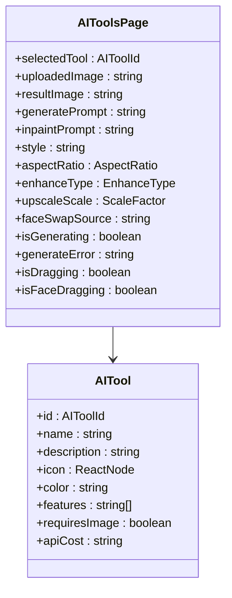
```mermaid
classDiagram
class AIToolsPage {
+selectedTool : AIToolId
+uploadedImage : string
+resultImage : string
+generatePrompt : string
+inpaintPrompt : string
+style : string
+aspectRatio : AspectRatio
+enhanceType : EnhanceType
+upscaleScale : ScaleFactor
+faceSwapSource : string
+isGenerating : boolean
+generateError : string
+isDragging : boolean
+isFaceDragging : boolean
}
class AITool {
+id : AIToolId
+name : string
+description : string
+icon : ReactNode
+color : string
+features : string[]
+requiresImage : boolean
+apiCost : string
}
AIToolsPage --> AITool
```

**Diagram sources**
- [AIToolsPage.tsx](file://pikzels-clone/client/src/components/dashboard/AIToolsPage.tsx)

#### Props and Integration
- **Standalone Component**: Designed for independent use outside the main editor
- **AI Service Integration**: Seamless integration with useAIService and useAIWorker hooks
- **Environment Configuration**: Dynamic API key handling and provider selection
- **Error Handling**: Comprehensive error states and user feedback

#### Usage Examples
```typescript
// Basic AI tools page usage
<AIToolsPage />

// With custom AI configuration
<AIToolsPage aiConfig={customConfig} />
```

**Section sources**
- [AIToolsPage.tsx](file://pikzels-clone/client/src/components/dashboard/AIToolsPage.tsx)

### AccountDropdown Analysis
The AccountDropdown component provides enhanced authentication state management with loading state support. It serves as the primary user account access point with comprehensive menu functionality.

#### Enhanced Authentication State Management
The component now supports sophisticated loading state handling:

- **Loading State**: Displays disabled state while authentication status is being checked
- **Authentication Status**: Seamlessly handles authenticated and unauthenticated states
- **Graceful Degradation**: Provides fallback UI when authentication is unavailable

#### Menu Structure and Functionality
The dropdown provides organized access to account-related functionality:

- **Account Group**: Profile, billing, security settings
- **Preferences Group**: Notifications, settings, team management  
- **Support Group**: Help center, data export
- **Logout Functionality**: Secure logout with confirmation

#### Loading State Implementation
The component implements intelligent loading state management:

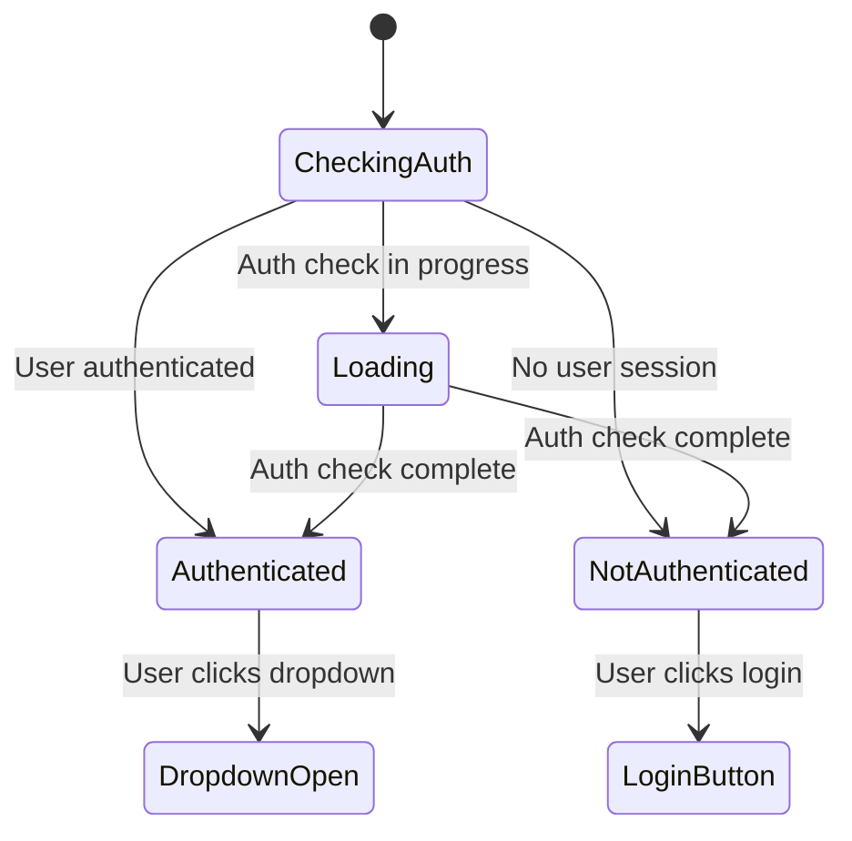
```mermaid
stateDiagram-v2
[*] --> CheckingAuth
CheckingAuth --> Loading : Auth check in progress
CheckingAuth --> Authenticated : User authenticated
CheckingAuth --> NotAuthenticated : No user session
Loading --> Authenticated : Auth check complete
Loading --> NotAuthenticated : Auth check complete
Authenticated --> DropdownOpen : User clicks dropdown
NotAuthenticated --> LoginButton : User clicks login
```

**Diagram sources**
- [AccountDropdown.tsx](file://pikzels-clone/client/src/components/account/AccountDropdown.tsx)
- [AuthContext.tsx](file://pikzels-clone/client/src/contexts/AuthContext.tsx)

#### Props and Integration
- **className**: Optional CSS class for styling integration
- **useAuth Hook**: Integrates with AuthContext for state management

#### Usage Examples
```typescript
// Basic account dropdown
<AccountDropdown />

// With custom styling
<AccountDropdown className="mr-4" />
```

**Section sources**
- [AccountDropdown.tsx](file://pikzels-clone/client/src/components/account/AccountDropdown.tsx)
- [AuthContext.tsx](file://pikzels-clone/client/src/contexts/AuthContext.tsx)

## Uploads Management System

### UploadsPage Analysis
The UploadsPage component provides comprehensive file management capabilities with advanced drag-and-drop functionality, asset categorization, and unified management interface. This component serves as the central hub for managing user-uploaded assets including faces, backgrounds, and brand logos.

#### Key Features
- **Comprehensive Asset Management**: Centralized interface for managing all uploaded assets
- **Advanced Drag-and-Drop System**: Sophisticated drag-and-drop with visual feedback and drop targets
- **Asset Categorization**: Type-based filtering (faces, images, brand logos, others)
- **Bulk Operations**: Support for uploading multiple asset types with category assignment
- **Search and Filter**: Real-time search functionality with type-specific filtering
- **Preview and Download**: Image preview modal with download and metadata display
- **Storage Monitoring**: Real-time storage usage tracking with visual progress indicators
- **Context Menus**: Right-click context menus for asset operations and recategorization

#### Asset Type Management
The component supports four distinct asset types with specialized handling:

- **Faces**: Purple badge with facial recognition optimization
- **Backgrounds**: Blue badge for general image assets
- **Brand Logos**: Amber badge for brand identity assets
- **Others**: Slate badge for miscellaneous file types

#### Drag-and-Drop Architecture
The drag-and-drop system implements a sophisticated multi-target approach:

**Asset Cards**: Individual asset cards are draggable with visual feedback
**Filter Tabs**: Drop targets for recategorizing assets by type
**Visual Indicators**: Ring overlays and scaling animations during drag operations
**Type Mapping**: Automatic type conversion based on drop target location

#### Upload Workflow
The upload process includes comprehensive validation and processing:

- **File Validation**: Size limits (10MB max), MIME type filtering (images only)
- **Category Assignment**: Upload type selection (face, image, brand logo, other)
- **Base64 Encoding**: Client-side encoding for immediate preview display
- **API Integration**: Seamless upload to backend services with progress tracking
- **Automatic Refresh**: Immediate UI updates after successful uploads

#### Storage Management
The component provides comprehensive storage monitoring:

- **Usage Tracking**: Real-time calculation of total storage used
- **Type Distribution**: Visual breakdown of assets by category
- **Progress Visualization**: Gradient progress bar with storage utilization percentage
- **Count Tracking**: Asset counts per category for quick overview

#### Preview and Interaction System
The component includes sophisticated preview and interaction capabilities:

- **Image Preview Modal**: Full-screen preview with navigation controls
- **Metadata Display**: File size, dimensions, upload date, and type information
- **Action Buttons**: Download, delete, and navigation controls within preview
- **Hover Effects**: Contextual overlays with action buttons and metadata display

#### Error Handling and User Experience
The component implements comprehensive error handling:

- **Upload Errors**: Specific error messages for file size and type violations
- **API Errors**: User-friendly error states with retry functionality
- **Loading States**: Skeleton loaders during data fetching operations
- **Empty States**: Helpful messaging for empty asset collections

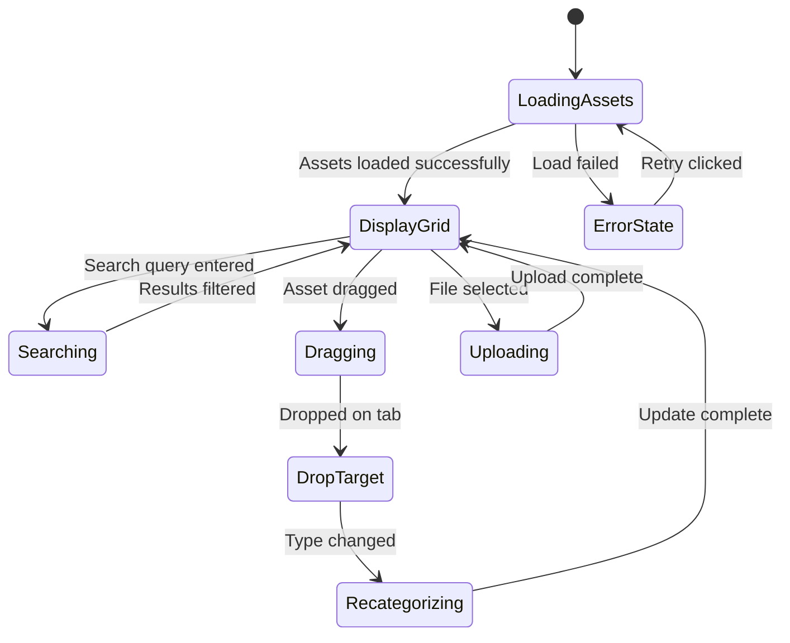
```mermaid
stateDiagram-v2
[*] --> LoadingAssets
LoadingAssets --> DisplayGrid : Assets loaded successfully
LoadingAssets --> ErrorState : Load failed
ErrorState --> LoadingAssets : Retry clicked
DisplayGrid --> Searching : Search query entered
Searching --> DisplayGrid : Results filtered
DisplayGrid --> Dragging : Asset dragged
Dragging --> DropTarget : Dropped on tab
DropTarget --> Recategorizing : Type changed
Recategorizing --> DisplayGrid : Update complete
DisplayGrid --> Uploading : File selected
Uploading --> DisplayGrid : Upload complete
```

**Diagram sources**
- [UploadsPage.tsx](file://pikzels-clone/client/src/components/dashboard/UploadsPage.tsx)

#### Props and Integration
- **Standalone Component**: Designed for independent use in dashboard navigation
- **API Integration**: Direct integration with quickEditService for asset management
- **Navigation**: Routes to asset preview modal and management interfaces
- **Context Integration**: Works seamlessly with DashboardContext for theme preferences

#### Usage Examples
```typescript
// Basic uploads page
<UploadsPage />

// With custom styling
<UploadsPage className="max-w-6xl mx-auto" />
```

**Section sources**
- [UploadsPage.tsx](file://pikzels-clone/client/src/components/dashboard/UploadsPage.tsx)

## Enhanced Widget System

### ProjectsAndUploadsWidget Analysis
The ProjectsAndUploadsWidget represents a significant evolution from the previous AllProjectsWidget, providing unified management of both projects and uploaded assets through a sophisticated tabbed interface. This component consolidates project management and asset management into a single, cohesive dashboard widget.

#### Key Features
- **Unified Interface**: Single widget managing both projects and uploaded assets
- **Tabbed Navigation**: Three distinct views: All projects, Saved projects, My uploads
- **Asset Filtering**: Type-based filtering for uploaded assets (faces, images, brand logos)
- **Preview Integration**: Asset preview modal with metadata and action controls
- **Navigation Integration**: Direct navigation to detailed views and management interfaces
- **Responsive Design**: Adaptive layout that works across different screen sizes
- **Loading States**: Comprehensive loading and error handling for both data sources

#### View Modes and Navigation
The widget implements three distinct view modes with specialized functionality:

**All Projects View**
- Displays recent projects with featured thumbnails
- Includes demo project highlighting with special badges
- Supports direct navigation to project detail pages
- Shows project descriptions and creation dates

**Saved Projects View**
- Placeholder for future saved project functionality
- Currently displays static "0 saved projects" count
- Ready for integration with saved project management system

**My Uploads View**
- Manages uploaded assets with type filtering
- Supports asset preview and metadata display
- Provides navigation to comprehensive uploads page
- Shows asset counts and type distribution

#### Asset Management Integration
The widget integrates seamlessly with the asset management system:

- **Type Filtering**: Four asset categories with visual indicators
- **Preview Modal**: Full-screen asset preview with download and metadata
- **Navigation**: Direct access to UploadsPage for comprehensive management
- **Count Display**: Real-time asset counts for each category

#### Project Card Component
Each project is displayed using a specialized ProjectCard component that includes:

- **Featured Thumbnail**: Project preview image or fallback icon
- **Demo Badge**: Special styling for demo projects
- **Hover Effects**: Scale-up animation and border transitions
- **Description Support**: Project descriptions with line clamping
- **Navigation**: Click-to-navigate functionality

#### Asset Card Component
Uploaded assets are displayed using a specialized AssetCard component:

- **Type Badges**: Color-coded badges indicating asset type
- **Preview Images**: 3:2 aspect ratio for consistent grid layout
- **Hover Overlays**: Metadata display and action buttons
- **Timestamps**: Relative time formatting for creation dates
- **Navigation**: Click-to-preview functionality

#### Technical Implementation
The widget implements sophisticated state management:

- **React Hooks**: useState and useEffect for comprehensive state handling
- **Type Safety**: Strongly typed interfaces for project and asset data
- **Error Boundaries**: Comprehensive error handling with user feedback
- **Loading States**: Separate loading states for projects and assets
- **Navigation**: React Router integration for seamless navigation

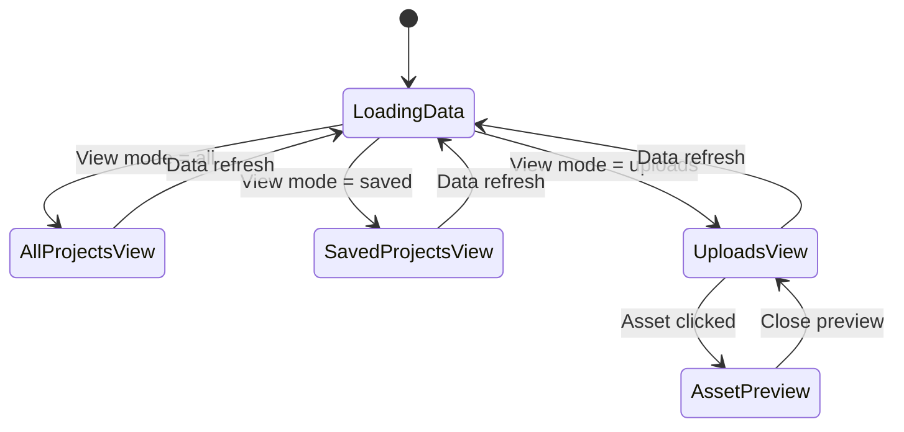
```mermaid
stateDiagram-v2
[*] --> LoadingData
LoadingData --> AllProjectsView : View mode = all
LoadingData --> SavedProjectsView : View mode = saved
LoadingData --> UploadsView : View mode = uploads
AllProjectsView --> LoadingData : Data refresh
SavedProjectsView --> LoadingData : Data refresh
UploadsView --> LoadingData : Data refresh
UploadsView --> AssetPreview : Asset clicked
AssetPreview --> UploadsView : Close preview
```

**Diagram sources**
- [ProjectsAndUploadsWidget.tsx](file://pikzels-clone/client/src/components/dashboard/widgets/ProjectsAndUploadsWidget.tsx)

#### Props and Usage
- **className**: Optional CSS class for styling integration
- **Integration**: Works seamlessly with DashboardContext for theme preferences
- **Navigation**: Provides navigation to detailed project and asset management views

#### Usage Examples
```typescript
// Basic projects and uploads widget
<ProjectsAndUploadsWidget />

// With custom styling
<ProjectsAndUploadsWidget className="md:col-span-2" />

// With custom class names
<ProjectsAndUploadsWidget className="max-w-4xl mx-auto" />
```

**Section sources**
- [ProjectsAndUploadsWidget.tsx](file://pikzels-clone/client/src/components/dashboard/widgets/ProjectsAndUploadsWidget.tsx)

### Widget System Architecture
The enhanced widget system provides a flexible, extensible framework for displaying dynamic content in the dashboard. The system includes comprehensive error handling, loading states, and responsive design. All widgets integrate with the DashboardContext for theme preferences, refresh intervals, and customization capabilities.

#### Widget System Components
- **Widget Container**: Consistent styling with slate backgrounds and border accents
- **State Management**: Loading, error, and success states for all widgets
- **Responsive Layout**: Grid-based layouts that adapt to different screen sizes
- **Mock Data Support**: Graceful fallback to mock data in development environments
- **API Integration**: Direct integration with backend endpoints for real data
- **DashboardContext Integration**: Theme preferences, refresh intervals, and widget customization

#### DashboardContext Integration
Widgets integrate with the DashboardContext for:
- **Theme Preferences**: Dark/light mode support
- **Refresh Intervals**: Automatic data refreshing
- **Widget Customization**: User preferences for widget layouts
- **Notification Settings**: Global notification preferences

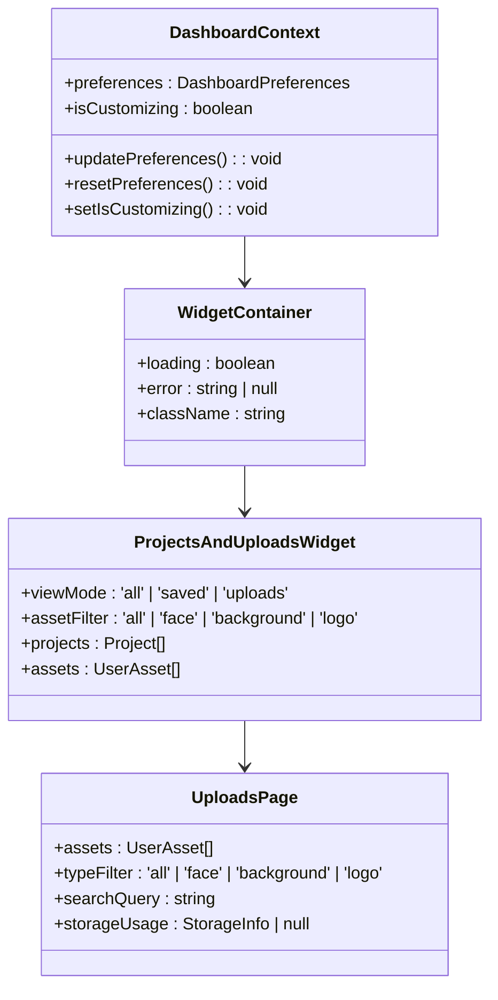
```mermaid
classDiagram
class DashboardContext {
+preferences : DashboardPreferences
+updatePreferences() : void
+resetPreferences() : void
+isCustomizing : boolean
+setIsCustomizing() : void
}
class WidgetContainer {
+loading : boolean
+error : string | null
+className : string
}
class ProjectsAndUploadsWidget {
+viewMode : 'all' | 'saved' | 'uploads'
+assetFilter : 'all' | 'face' | 'background' | 'logo'
+projects : Project[]
+assets : UserAsset[]
}
class UploadsPage {
+assets : UserAsset[]
+typeFilter : 'all' | 'face' | 'background' | 'logo'
+searchQuery : string
+storageUsage : StorageInfo | null
}
DashboardContext --> WidgetContainer
WidgetContainer --> ProjectsAndUploadsWidget
ProjectsAndUploadsWidget --> UploadsPage
```

**Diagram sources**
- [DashboardContext.tsx](file://pikzels-clone/client/src/contexts/DashboardContext.tsx)
- [ProjectsAndUploadsWidget.tsx](file://pikzels-clone/client/src/components/dashboard/widgets/ProjectsAndUploadsWidget.tsx)
- [UploadsPage.tsx](file://pikzels-clone/client/src/components/dashboard/UploadsPage.tsx)

**Section sources**
- [widgets/index.ts](file://pikzels-clone/client/src/components/dashboard/widgets/index.ts)
- [DashboardContext.tsx](file://pikzels-clone/client/src/contexts/DashboardContext.tsx)

## Drag-and-Drop Upload Areas

### Main Image Upload Area
The primary drag-and-drop upload area provides comprehensive visual feedback for image uploads:

#### Visual Feedback System
- **Border Transformation**: Changes from dashed border to solid blue border during drag operations
- **Background Gradients**: Subtle blue gradient overlay indicates active drop zone
- **Icon Color Changes**: Upload icon transitions from gray to blue for emphasis
- **Text Updates**: Instructions dynamically change from generic to specific drop instructions
- **Size Indicators**: Clear file type and size limitations displayed below upload area

#### Event Handling
The upload area implements sophisticated event handling:

- **Drag Over**: Prevents default behavior and activates visual feedback
- **Drag Leave**: Resets visual state when file leaves drop zone
- **Drop**: Processes dropped files with MIME type validation
- **Click**: Triggers hidden file input for traditional upload methods

#### File Processing
Upon successful drop:
- **File Validation**: Ensures file is an image type (PNG, JPG, GIF)
- **Preview Generation**: Creates data URL for immediate preview display
- **State Updates**: Sets uploaded image state and clears previous results
- **Error Handling**: Validates file size and type constraints

### Face Swap Source Upload Area
The face swap specific upload area provides specialized functionality:

#### Visual Design
- **Compact Dimensions**: Fixed 32x32 pixel area for optimal face recognition
- **Orange Theme**: Distinct orange border and gradient for visual distinction
- **Icon Adaptation**: Users icon replaces upload icon during drag operations
- **Text Customization**: Simplified "Drop here" messaging for clarity

#### Specialized Functionality
- **Face Recognition**: Optimized for facial feature detection algorithms
- **Aspect Ratio**: Maintains square proportions for consistent processing
- **Preview Display**: Shows thumbnail preview of selected face image
- **Removal Capability**: Allows clearing of selected face source

#### Integration Points
The face swap area integrates seamlessly with:
- **Face Swap Tool**: Activated only when face swap tool is selected
- **AI Processing**: Provides input for AI-powered face replacement algorithms
- **Validation**: Ensures face images meet minimum quality requirements

### Asset Management Drag-and-Drop
The UploadsPage component implements a sophisticated drag-and-drop system for asset management:

#### Draggable Asset Cards
- **Individual Draggables**: Each asset card is independently draggable
- **Visual Feedback**: Opacity changes and transition effects during drag operations
- **Data Attributes**: Asset IDs passed through drag data for recategorization

#### Droppable Filter Tabs
- **Tab Targets**: Filter tabs become drop targets for asset recategorization
- **Visual Indicators**: Ring overlays and scaling animations indicate drop targets
- **Type Mapping**: Automatic type conversion based on drop target location
- **Disabled Targets**: "All" tab is disabled as drop target

#### Command Pattern Implementation
The drag-and-drop system uses command pattern for asset operations:

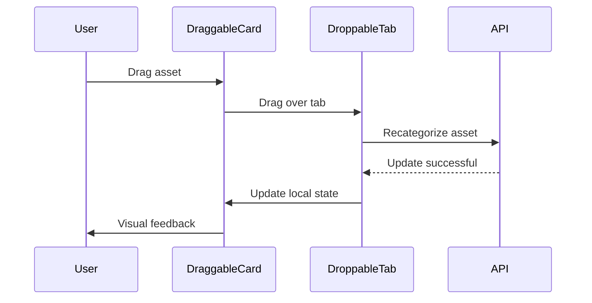
```mermaid
sequenceDiagram
participant User
participant DraggableCard
participant DroppableTab
participant API
User->>DraggableCard : Drag asset
DraggableCard->>DroppableTab : Drag over tab
DroppableTab->>API : Recategorize asset
API-->>DroppableTab : Update successful
DroppableTab->>DraggableCard : Update local state
DraggableCard->>User : Visual feedback
```

**Diagram sources**
- [UploadsPage.tsx](file://pikzels-clone/client/src/components/dashboard/UploadsPage.tsx)

**Section sources**
- [AIToolsPage.tsx](file://pikzels-clone/client/src/components/dashboard/AIToolsPage.tsx)
- [UploadsPage.tsx](file://pikzels-clone/client/src/components/dashboard/UploadsPage.tsx)

## Asset Management Components

### AssetContextMenu Analysis
The AssetContextMenu component provides sophisticated context menu functionality for asset management operations. Built with Radix UI, it offers consistent styling and keyboard navigation support.

#### Key Features
- **Variant-Based Menu**: Supports both 'thumbnail' and 'asset' variants with different options
- **Type-Specific Actions**: Platform options for thumbnail categorization, asset type options for recategorization
- **Visual Feedback**: Current selection indication with "Current" badges
- **Disabled States**: Prevents actions on already applied selections
- **Keyboard Navigation**: Full keyboard accessibility with Radix UI patterns

#### Menu Variants
**Asset Context Menu**
- **Faces**: Purple-themed menu item for face assets
- **Images**: Blue-themed menu item for background assets  
- **Brand**: Amber-themed menu item for brand logo assets

**Thumbnail Context Menu**
- **YouTube**: Red-themed menu item with YouTube icon
- **Instagram**: Pink-themed menu item with Instagram icon
- **TikTok**: Cyan-themed menu item with music note icon
- **Twitter/X**: Gray-themed menu item with Twitter icon

#### Integration Pattern
The component follows a discriminated union pattern for type safety:

```mermaid
classDiagram
class AssetContextMenu {
+variant : 'asset' | 'thumbnail'
+currentType : AssetType
+currentPlatform : ThumbnailPlatform
+onRecategorize : Function
}
class AssetTypeOptions {
+face : { value : 'face', label : 'Faces', icon : User }
+background : { value : 'background', label : 'Images', icon : Image }
+logo : { value : 'logo', label : 'Brand', icon : Palette }
}
class ThumbnailPlatformOptions {
+youtube : { value : 'youtube', label : 'YouTube', icon : Youtube }
+tiktok : { value : 'tiktok', label : 'TikTok', icon : Music }
+instagram : { value : 'instagram', label : 'Instagram', icon : Instagram }
+twitter : { value : 'twitter', label : 'Twitter / X', icon : Twitter }
}
AssetContextMenu --> AssetTypeOptions
AssetContextMenu --> ThumbnailPlatformOptions
```

**Diagram sources**
- [AssetContextMenu.tsx](file://pikzels-clone/client/src/components/ui/AssetContextMenu.tsx)

#### Props and Usage
- **variant**: Determines menu options ('asset' or 'thumbnail')
- **currentType/currentPlatform**: Current selection for disabled state management
- **onRecategorize**: Callback function for handling recategorization actions

#### Usage Examples
```typescript
// Asset recategorization context menu
<AssetContextMenu
  variant="asset"
  currentType="face"
  onRecategorize={(newType) => handleRecategorize(newType)}
/>

// Thumbnail platform context menu
<AssetContextMenu
  variant="thumbnail"
  currentPlatform="youtube"
  onRecategorize={(newPlatform) => handlePlatformChange(newPlatform)}
/>
```

**Section sources**
- [AssetContextMenu.tsx](file://pikzels-clone/client/src/components/ui/AssetContextMenu.tsx)

### ImagePreviewModal Analysis
The ImagePreviewModal component provides a comprehensive image viewing experience with navigation controls, metadata display, and action integration. Built with Framer Motion for smooth animations and Radix UI for accessible interactions.

#### Key Features
- **Full-Screen Preview**: Modal-based image viewing with backdrop blur
- **Navigation Controls**: Previous/next buttons with keyboard shortcuts
- **Metadata Display**: Comprehensive information sidebar with file details
- **Action Integration**: Edit, download, move, and delete action buttons
- **Responsive Design**: Adapts to different screen sizes and orientations
- **Keyboard Navigation**: Escape to close, arrow keys for navigation

#### Navigation System
The modal implements sophisticated navigation with multiple interaction methods:

**Mouse Navigation**
- Click image to close
- Click left/right edges for navigation
- Click dots for direct navigation (when multiple items)

**Keyboard Navigation**
- Arrow keys for next/previous
- Escape key to close
- Tab key for focus management

**Touch Navigation**
- Swipe gestures for mobile devices
- Tap areas for navigation buttons

#### Metadata Display
The information sidebar provides comprehensive asset details:

- **Basic Information**: Name, type, file size
- **Technical Details**: Dimensions, creation date
- **AI Information**: Prompt text (if available)
- **Platform Information**: Social media platform (if applicable)

#### Action Integration
The modal supports multiple action types:

- **Edit**: Integration with editor functionality
- **Download**: Direct file download with filename preservation
- **Move**: Asset relocation to different categories
- **Delete**: Asset removal with confirmation

#### Animation System
Built with Framer Motion for smooth transitions:

- **Entry/Exit**: Fade and scale animations
- **Image Loading**: Smooth transitions between images
- **Sidebar**: Slide-in/out animations
- **Button States**: Hover and active state animations

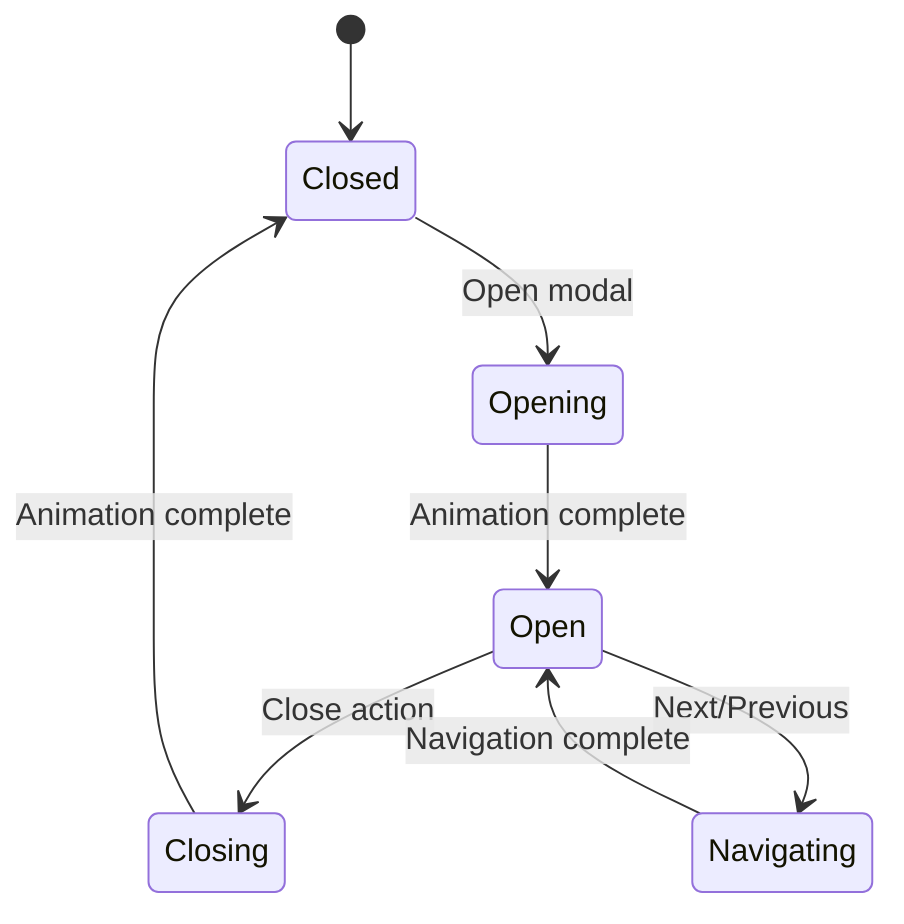
```mermaid
stateDiagram-v2
[*] --> Closed
Closed --> Opening : Open modal
Opening --> Open : Animation complete
Open --> Closing : Close action
Open --> Navigating : Next/Previous
Navigating --> Open : Navigation complete
Closing --> Closed : Animation complete
```

**Diagram sources**
- [ImagePreviewModal.tsx](file://pikzels-clone/client/src/components/ui/ImagePreviewModal.tsx)

#### Props and Integration
- **isOpen**: Control visibility state
- **onClose**: Callback for closing the modal
- **imageUrl**: Current image URL for display
- **title**: Display name for the asset
- **metadata**: Comprehensive asset information
- **actions**: Available action callbacks
- **items**: Complete asset collection for navigation
- **currentIndex**: Current position in asset collection

#### Usage Examples
```typescript
// Basic image preview
<ImagePreviewModal
  isOpen={previewOpen}
  onClose={() => setPreviewOpen(false)}
  imageUrl={selectedAsset.url}
  title={selectedAsset.name}
  metadata={{
    type: selectedAsset.type,
    size: selectedAsset.sizeBytes,
    date: selectedAsset.createdAt,
  }}
  actions={{
    onDownload: () => handleDownload(selectedAsset),
  }}
  items={assetCollection}
  currentIndex={currentAssetIndex}
  onNavigate={(index) => setCurrentAssetIndex(index)}
/>

// Advanced preview with all features
<ImagePreviewModal
  isOpen={previewOpen}
  onClose={() => setPreviewOpen(false)}
  imageUrl={selectedAsset.url}
  title={selectedAsset.name}
  metadata={{
    type: selectedAsset.type,
    size: selectedAsset.sizeBytes,
    width: selectedAsset.width,
    height: selectedAsset.height,
    date: selectedAsset.createdAt,
    prompt: selectedAsset.prompt,
  }}
  actions={{
    onEdit: () => handleEdit(selectedAsset),
    onDownload: () => handleDownload(selectedAsset),
    onDelete: () => handleDelete(selectedAsset),
    onMoveTo: () => handleMove(selectedAsset),
  }}
  items={assetCollection}
  currentIndex={currentAssetIndex}
  onNavigate={(index) => setCurrentAssetIndex(index)}
/>
```

**Section sources**
- [ImagePreviewModal.tsx](file://pikzels-clone/client/src/components/ui/ImagePreviewModal.tsx)

## Authentication and State Management

### AuthContext Analysis
The AuthContext provides comprehensive authentication state management with loading state support, enabling seamless user experience during authentication checks.

#### Core Features
- **Loading State Management**: Tracks authentication status checking progress
- **User Session Management**: Handles user authentication lifecycle
- **OAuth Integration**: Supports external authentication providers
- **Error Handling**: Comprehensive error management and recovery

#### State Management Patterns
The context implements advanced state management patterns:

- **Loading States**: Distinct loading, authenticated, and unauthenticated states
- **Token Management**: Secure token storage and validation
- **Error Recovery**: Automatic error recovery and user feedback
- **Session Persistence**: Local storage integration for persistent sessions

```mermaid
sequenceDiagram
participant User
participant AuthContext
participant API
User->>AuthContext : Initialize app
AuthContext->>AuthContext : Check local storage
AuthContext->>API : Validate token
API-->>AuthContext : Token valid/invalid
AuthContext->>AuthContext : Update loading state
AuthContext->>User : Render appropriate UI
```

**Diagram sources**
- [AuthContext.tsx](file://pikzels-clone/client/src/contexts/AuthContext.tsx)

#### Integration with Components
Components integrate with AuthContext through the useAuth hook:

- **AccountDropdown**: Uses loading state for authentication checks
- **DashboardHome**: Accesses user authentication for protected features
- **Navigation**: Adapts UI based on authentication state

**Section sources**
- [AuthContext.tsx](file://pikzels-clone/client/src/contexts/AuthContext.tsx)

### DashboardContext Analysis
The DashboardContext provides comprehensive dashboard state management with theme preferences, refresh intervals, and widget customization capabilities.

#### Core Features
- **Theme Management**: Light, dark, and auto theme modes
- **Refresh Intervals**: Configurable data refresh rates
- **Widget Customization**: Favorite widgets and layout preferences
- **Notification Settings**: Desktop, email, and critical notification preferences
- **Layout Options**: Grid and list widget layouts

#### Preference Management
The context manages extensive user preferences:

- **Theme Preferences**: Global theme selection and auto-detection
- **Performance Settings**: Compact mode and animation toggles
- **Analytics Settings**: Default time filters and refresh intervals
- **Personalization**: Favorite widgets and custom layouts

#### Integration with Widgets
Widgets integrate with DashboardContext for:
- **Theme Application**: Automatic theme switching
- **Data Refresh**: Configurable refresh intervals
- **Layout Adaptation**: Responsive layout adjustments
- **User Preferences**: Customized widget arrangements

```mermaid
classDiagram
class DashboardContext {
+preferences : DashboardPreferences
+updatePreferences() : void
+resetPreferences() : void
+isCustomizing : boolean
+setIsCustomizing() : void
}
class DashboardPreferences {
+theme : 'light' | 'dark' | 'auto'
+refreshInterval : number
+compactMode : boolean
+showAnimations : boolean
+defaultTimeFilter : string
+favoriteWidgets : string[]
+widgetLayout : 'grid' | 'list'
+notificationSettings : NotificationSettings
}
class NotificationSettings {
+desktop : boolean
+email : boolean
+critical : boolean
}
DashboardContext --> DashboardPreferences
DashboardPreferences --> NotificationSettings
```

**Diagram sources**
- [DashboardContext.tsx](file://pikzels-clone/client/src/contexts/DashboardContext.tsx)

**Section sources**
- [DashboardContext.tsx](file://pikzels-clone/client/src/contexts/DashboardContext.tsx)

## Dependency Analysis
The UI components have a hierarchical dependency structure where higher-level components compose lower-level ones. For example, Panel uses Card and Button, while StatCard uses Card. All components rely on the design system CSS variables for consistent styling. The export mechanism in `index.ts` centralizes component access, reducing direct file path dependencies.

**Updated** Added dependencies for new specialized components including UploadsPage with comprehensive drag-and-drop functionality, ProjectsAndUploadsWidget with unified project and asset management, and enhanced AccountDropdown with authentication integration. The widget system now includes comprehensive state management through DashboardContext. Asset management components leverage Radix UI for accessibility and @dnd-kit for advanced drag-and-drop operations.

```mermaid
graph TD
A[index.ts] --> B[Button]
A --> C[Card]
A --> D[Input]
A --> E[Panel]
A --> F[Toolbar]
A --> G[Slider]
A --> H[StatCard]
A --> I[DashboardHome]
A --> J[AIToolsPage]
A --> K[AccountDropdown]
L[widgets/index.ts] --> M[ProjectsAndUploadsWidget]
L --> N[RecentThumbnailsWidget]
L --> O[StatsWidget]
L --> P[StorageIndicator]
Q[DashboardContext] --> R[Widget Preferences]
S[DashboardHome] --> DesignSystem
S --> AuthContext
T[AIToolsPage] --> DesignSystem
U[AccountDropdown] --> AuthContext
V[ProjectsAndUploadsWidget] --> DashboardContext
W[UploadsPage] --> DashboardContext
X[ProjectsAndUploadsWidget] --> UploadsPage
Y[UploadsPage] --> AssetContextMenu
Z[UploadsPage] --> ImagePreviewModal
AA[AssetContextMenu] --> RadixUI
AB[ImagePreviewModal] --> FramerMotion
AC[ProjectsAndUploadsWidget] --> ImagePreviewModal
M --> DesignSystem
N --> DesignSystem
O --> DesignSystem
P --> DesignSystem
Q --> WidgetPreferences
```

**Diagram sources**
- [index.ts](file://pikzels-clone/client/src/components/ui/index.ts)
- [widgets/index.ts](file://pikzels-clone/client/src/components/dashboard/widgets/index.ts)
- [Panel.tsx](file://pikzels-clone/client/src/components/ui/Panel.tsx)
- [StatCard.tsx](file://pikzels-clone/client/src/components/ui/StatCard.tsx)
- [Toolbar.tsx](file://pikzels-clone/client/src/components/ui/Toolbar.tsx)
- [DashboardHome.tsx](file://pikzels-clone/client/src/components/dashboard/DashboardHome.tsx)
- [AIToolsPage.tsx](file://pikzels-clone/client/src/components/dashboard/AIToolsPage.tsx)
- [AccountDropdown.tsx](file://pikzels-clone/client/src/components/account/AccountDropdown.tsx)
- [AuthContext.tsx](file://pikzels-clone/client/src/contexts/AuthContext.tsx)
- [ProjectsAndUploadsWidget.tsx](file://pikzels-clone/client/src/components/dashboard/widgets/ProjectsAndUploadsWidget.tsx)
- [UploadsPage.tsx](file://pikzels-clone/client/src/components/dashboard/UploadsPage.tsx)
- [AssetContextMenu.tsx](file://pikzels-clone/client/src/components/ui/AssetContextMenu.tsx)
- [ImagePreviewModal.tsx](file://pikzels-clone/client/src/components/ui/ImagePreviewModal.tsx)
- [DashboardContext.tsx](file://pikzels-clone/client/src/contexts/DashboardContext.tsx)

**Section sources**
- [index.ts](file://pikzels-clone/client/src/components/ui/index.ts)
- [widgets/index.ts](file://pikzels-clone/client/src/components/dashboard/widgets/index.ts)

## Performance Considerations
The UI component library is optimized for performance through several strategies:
- **Memoization**: Components use React.memo where appropriate to prevent unnecessary re-renders.
- **Event Delegation**: Interactive components use efficient event handling.
- **CSS Variables**: Design tokens enable fast theme switching without re-rendering.
- **Lazy Loading**: Components are imported on demand via the index export.
- **Minimal DOM**: Components generate minimal markup for better rendering performance.
- **Optimized Animations**: CSS transforms and hardware acceleration for smooth animations.
- **Efficient State Management**: Custom hooks for optimized state updates and memory usage.
- **Loading State Optimization**: Smart loading state management prevents unnecessary re-renders during authentication checks.
- **Drag-and-Drop Optimization**: Event prevention and propagation optimization for smooth drag operations.
- **Widget Caching**: Dashboard widgets cache data to reduce API calls.
- **Conditional Rendering**: Widgets only render when data is available or loading is complete.
- **Mock Data Fallback**: Development environment optimizations with mock data.
- **Enhanced Widget Performance**: ProjectsAndUploadsWidget implements efficient loading states and error boundaries.
- **Upload Optimization**: UploadsPage uses efficient drag-and-drop handling and debounced search filtering.
- **Asset Management**: ProjectsAndUploadsWidget optimizes asset loading with pagination and lazy rendering.
- **Drag-and-Drop Performance**: @dnd-kit provides optimized drag-and-drop with minimal re-renders.
- **Modal Optimization**: ImagePreviewModal uses portal rendering to minimize DOM tree depth.
- **Context Optimization**: DashboardContext uses selective re-renders for preference updates.

**Updated** Added performance considerations for new UploadsPage component including drag-and-drop optimization, upload progress handling, and asset management efficiency. Enhanced widget performance with caching and conditional rendering. Added performance optimizations for AssetContextMenu with Radix UI and ImagePreviewModal with Framer Motion.

## Troubleshooting Guide
Common issues and solutions for the UI component library:
- **Dark mode not applying**: Ensure the `.dark` class is applied to the root element and `dark-mode.css` is imported.
- **Component not rendering**: Verify the component is exported in `index.ts` and imported correctly.
- **Styling conflicts**: Use CSS modules and avoid global styles; prefer design system utilities.
- **Accessibility issues**: Check ARIA attributes, keyboard navigation, and screen reader announcements.
- **Type errors**: Ensure `types.ts` is up to date and interfaces match implementation.
- **DashboardHome animation issues**: Verify animation timing configurations and platform array setup.
- **AIToolsPage drag-and-drop failures**: Check browser compatibility for File API and drag-and-drop events.
- **File upload failures**: Verify browser compatibility, CORS settings, and file size limits.
- **Cloud integration problems**: Verify OAuth configuration and network connectivity.
- **AccountDropdown loading state issues**: Ensure AuthContext is properly configured and loaded.
- **Drag-and-drop visual feedback not working**: Verify CSS classes are correctly applied and event handlers are properly bound.
- **State management conflicts**: Check for proper cleanup of drag-and-drop event listeners.
- **Widget loading states**: Verify API endpoints are reachable and credentials are properly configured.
- **ProjectsAndUploadsWidget tab switching issues**: Ensure viewMode state updates trigger data refetch.
- **UploadsPage drag-and-drop not working**: Verify @dnd-kit provider is properly configured and event handlers are bound.
- **Asset recategorization failures**: Check API endpoints and authentication state for asset management.
- **Storage usage calculation errors**: Verify storage API responses and data formatting.
- **UploadsPage error states**: Check network connectivity and API response formats for asset operations.
- **AssetContextMenu not opening**: Verify Radix UI context menu provider is configured and permissions are granted.
- **ImagePreviewModal animation issues**: Check Framer Motion version compatibility and animation configurations.
- **Drag-and-drop performance issues**: Verify @dnd-kit event handler optimization and prevent excessive re-renders.
- **Widget state synchronization**: Ensure proper prop drilling and context usage for widget data consistency.

**Updated** Added troubleshooting guidance for new UploadsPage component including drag-and-drop functionality, asset management API integration, and storage monitoring. Enhanced widget troubleshooting for ProjectsAndUploadsWidget tab switching and data loading issues. Added troubleshooting for AssetContextMenu Radix UI integration and ImagePreviewModal animation performance.

**Section sources**
- [design-system.css](file://pikzels-clone/client/src/styles/design-system.css)
- [dark-mode.css](file://pikzels-clone/client/src/styles/dark-mode.css)
- [index.ts](file://pikzels-clone/client/src/components/ui/index.ts)
- [types.ts](file://pikzels-clone/client/src/components/ui/types.ts)
- [DashboardHome.tsx](file://pikzels-clone/client/src/components/dashboard/DashboardHome.tsx)
- [AIToolsPage.tsx](file://pikzels-clone/client/src/components/dashboard/AIToolsPage.tsx)
- [AccountDropdown.tsx](file://pikzels-clone/client/src/components/account/AccountDropdown.tsx)
- [AuthContext.tsx](file://pikzels-clone/client/src/contexts/AuthContext.tsx)
- [UploadsPage.tsx](file://pikzels-clone/client/src/components/dashboard/UploadsPage.tsx)
- [ProjectsAndUploadsWidget.tsx](file://pikzels-clone/client/src/components/dashboard/widgets/ProjectsAndUploadsWidget.tsx)
- [AssetContextMenu.tsx](file://pikzels-clone/client/src/components/ui/AssetContextMenu.tsx)
- [ImagePreviewModal.tsx](file://pikzels-clone/client/src/components/ui/ImagePreviewModal.tsx)
- [DashboardContext.tsx](file://pikzels-clone/client/src/contexts/DashboardContext.tsx)

## Conclusion
The UI Component Library in Thumbnail Maker Studio provides a robust, accessible, and themable set of components that ensure consistency across the application. By leveraging TypeScript, CSS modules, and design system tokens, the library enables efficient development and maintenance. Components are well-documented, composable, and support responsive design and dark mode. The addition of specialized components like UploadsPage with comprehensive file management capabilities, ProjectsAndUploadsWidget replacing AllProjectsWidget with unified project and asset management, and enhanced AccountDropdown component featuring loading state support demonstrates the library's evolution to support complex multimedia applications with advanced state management, authentication integration, and comprehensive project management capabilities.

**Updated** Enhanced conclusion to reflect the addition of UploadsPage component for comprehensive file management, ProjectsAndUploadsWidget replacing AllProjectsWidget with unified project and asset management capabilities, and the integration of these components with the existing dashboard widget system. The library now supports sophisticated user interaction patterns with drag-and-drop functionality, asset categorization, storage monitoring, and seamless integration with AI-powered workflows and enhanced authentication systems. The introduction of AssetContextMenu and ImagePreviewModal components further enhances the asset management experience with accessible context menus and comprehensive preview capabilities.